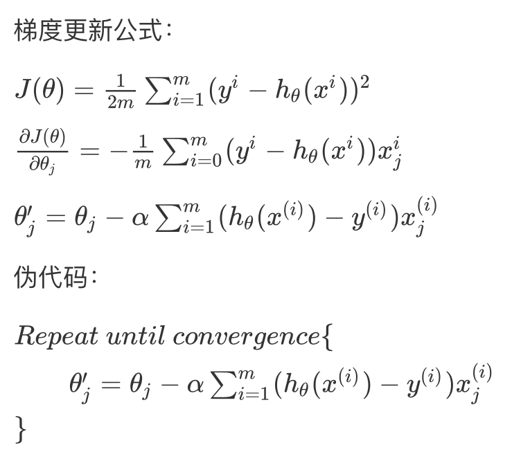

Optimization algorithms

机器学习的应用是一个高度依赖经验的过程，伴随着大量迭代的过程，你需要训练诸多模型，才能找到合适的那一个，所以，优化算法能够帮助你快速训练模型。

## 1.1 Mini-bath gradient descent

Mini-bath梯度下降

**1.1.1 Batch gradient descent**

梯度更新公式：

$J(\theta)=\frac{1}{2m}\sum_{i=1}^{m}(y^i-h_\theta(x^i))^2$

$\frac{\partial J(\theta)}{\partial\theta_j} = -\frac1m\sum_{i=0}^m(y^i - 	h_\theta(x^i))x^i_j$

$\theta'_j=\theta_j-\alpha\sum_{i=1}^m(h_\theta(x^{(i)})-y^{(i)})x_j^{(i)}$

伪代码：

$Repeat \ until \ convergence \{ \\ \qquad \theta'_j=\theta_j-\alpha\sum_{i=1}^m(h_\theta(x^{(i)})-y^{(i)})x_j^{(i)} \\ \}$



优点：

* 全局最优解（每次迭代成本都会下降）
* 易于并行实现（向量化计算一步到位）

缺点：

* 样本数据量很大时，训练过程会很慢

**1.1.2 Stochastic gradient descent**

随机梯度下降就是每次从所有训练样本中抽取一个样本进行更新，这样不用每次都遍历所有数据集，迭代速度会很快，但是会增加很多迭代次数，因为每一次迭代选取的方向不一定是最优的方向。

SGD因为每次只对一个样本进行梯度下降，所以大部分时候是向着最小值靠近的，但也有一些是离最小值越来越远，因为那些样本恰好指向相反的方向。所以看起来会**有很多噪音，但整体趋势是向最小值逼近**。

伪代码：

$Repeat \ until \ convergence \{ \\ \qquad    for \ i=1 \ to \ m \{            \\   \qquad\qquad \theta'_j=\theta_j-\alpha(h_\theta(x^{(i)})-y^{(i)})x_j^{(i)} \\ \qquad\} \\ \}$


$重复 \ 0 \ c \{ \\ \qquad    for \ i=1 \ to \ m \{            \\   \qquad\qquad   \theta'_j=\theta_j - \alpha( h_\theta (x^{(i)}) -y^{(i)})x_j^{(i)}  \\ \qquad\} \\ \}$

```
$重复 \ 0 \ c \{ \\ \qquad    for \ i=1 \ to \ m \{            \\   \qquad\qquad   \theta'_j=\theta_j - \alpha( h_\theta (x^{(i)}) -y^{(i)})x_j^{(i)}  \\ \qquad\} \\ \}$
```


**优点：**

* 训练速度快
* 每次迭代只使用一个训练样本，可用作online learning(在线学习)

缺点：

- 每次只处理一个训练样本，不能通过向量化进行加速
- SGD永远不会收敛，它只会在最小值附近不断的波动，不会到达也不会在此停留


**1.1.3 Mini-batch gradient descent**

伪代码：

$Repeat \ until \ convergence \{ \\ \qquad    for \ t=1 \ to \ T \{            \\   \qquad\qquad \theta'_j=\theta_j-\alpha\sum_{i=1}^{m_t}(h_\theta(x^{(i)})-y^{(i)})x_j^{(i)} \\ \qquad\} \\ \}$

Batch size选择：

如果训练集较小（一般小于2000时），直接使用Batch gradient descent。

一般mini-batch的大小在64～512之间，选择2的n次幂会运行的相对快一些。

优点：

* pass

缺点：

* pass

**1.1.4 Batch vs Stochastic vs Mini-batch**


**1.2 Exponentially weighted averages**

**1.3 Gradient descent with Momentum**

**1.4 RMSprop**

**1.5 Adam optiminzation algorithms**

```sequence
对象A->对象B: 对象B你好吗?（请求）

Note right of 对象B: 对象B的描述

Note left of 对象A: 对象A的描述(提示)

对象B-->对象A: 我很好(响应)

对象A->对象B: 你真的好吗？

```


## mnist数据集

```
链接:https://pan.baidu.com/s/1sRjHRj-C2KxiDwMZkGn_yQ  密码:777c
参考： https://www.cnblogs.com/endlesscoding/p/9901539.html

获取数据
# from sklearn.datasets import fetch_mldata
# from sklearn import datasets

# mnist = fetch_mldata('MNIST   original') 
# mnist


手写数字识别
文章基本Markdown写的。
同时也支持自己写css文件来控制排版。

```


**误差分析**

```
最后一种分类任务，被叫做"多输出-多分类"（或者简称多输出分类）。在这里每一个标签可以是多类别的（比如我们前面所举的例子）

为了说明这点，我们建立一个系统，它可以去除图片当中的噪音。它将一张混有噪音的图片作为输入，期待它输出一张干净的数字图片，用一个像素强度的数组表示，就像 MNIST图片那样。注意到这个分类器的输出是多标签的（一个像素一个标签）和每个标签可以有多个值 （像素强度取值范围从0到255）。所以它是一个多输出分类系统的例子。

我们从MNIST的图版创建训练集和测试集开始，然后给图片的像素强度添加噪声，这里是用NumPy的randint()函数。目标图像是原始图像
```


```python
import numpy as np

def sigmoid(Z):
    return 1 / (1 + np.exp(-Z))

# sigmoid求导
def sigmoid_backward(dA, Z):
    s = 1 / (1 + np.exp(-Z))
    dZ = dA * s * (1 - s)
    return dZ

def relu(Z):
    return np.maximum(0, Z)

# relu求导
def relu_backward(dA, Z):
    dZ = np.array(dA, copy=True)
    dZ[Z <= 0] = 0
    return dZ

# 初始化
def init_parameters(layers_dim):

    m = len(layers_dim)
    parameters = {}
    for i in range(1, m):
        parameters['W' + str(i)] = np.random.randn(layers_dim[i], layers_dim[i-1]) / np.sqrt(layers_dim[i-1])
        parameters['b' + str(i)] = np.zeros((layers_dim[i], 1))

    return parameters


# 前向传播
def forward_propagation(x, parameters):

    W1 = parameters['W1']
    b1 = parameters['b1']
    W2 = parameters['W2']
    b2 = parameters['b2']

    Z1 = np.dot(W1, x) + b1
    A1 = relu(Z1)
    Z2 = np.dot(W2, A1) + b2
    A2 = sigmoid(Z2)

    return A2, (Z1, A1, Z2, A2)


# 反向传播
def backward_propagation(x, y, cache, parameters):

    m = x.shape[1]
    W2 = parameters['W2']
    (Z1, A1, Z2, A2) = cache
    
    da2 = - (np.divide(y, A2) - np.divide(1 - y, 1 - A2))
    dz2 = sigmoid_backward(da2, Z2)
    dW2 = np.dot(dz2, A1.T) / m
    db2 = np.sum(dz2, axis=1, keepdims=True) / m

    da1 = np.dot(W2.T, dz2)
    dz1 = relu_backward(da1, Z1)
    dW1 = np.dot(dz1, x.T) / m
    db1 = np.sum(dz1, axis=1, keepdims=True) / m

    gradients = {"da2": da2, "dz2": dz2, "dW2": dW2, "db2": db2,
                 "da1": da1, "dz1": dz1, "dW1": dW1, "db1": db1}

    return gradients


def compute_cost(a2, a):
    m = a2.shape[1]

    cost = -np.sum(np.multiply(np.log(a2), a) + np.multiply(np.log(1 - a2), 1 - a)) / m
    cost = float(np.squeeze(cost))

    return cost


def update_parameters_with_grad(parameters, grads, learning_rate=0.01):
    L = len(parameters) // 2
    for l in range(L):
        parameters["W" + str(l + 1)] = parameters["W" + str(l + 1)] - learning_rate * grads["dW" + str(l + 1)]
        parameters["b" + str(l + 1)] = parameters["b" + str(l + 1)] - learning_rate * grads["db" + str(l + 1)]
    # 返回更新后的参数
    return parameters

def model(train_x, train_y, layers_dims, learning_rate=0.0001, num_iterations=1000, print_cost=True):
    print("Training")
    parameters = init_parameters(layers_dims)

    for i in range(num_iterations):
        A2, cache = forward_propagation(train_x, parameters)
        cost = compute_cost(A2, train_y)
        gradients = backward_propagation(train_x, train_y, cache, parameters)
        parameters = update_parameters_with_grad(parameters, gradients, learning_rate)

        if print_cost and i % 50 == 0:
            print("Cost after %i : %i :%f" % (i, num_iterations, cost))

    return parameters

# 测试
def predict(x, y, parameters):
    print("Predicting")
    m = x.shape[1]
    a2, _ = forward_propagation(x, parameters)
    predict_result = np.where(a2 > 0.5, 1, 0)

    count = 0
    tmp = list(predict_result.T == a2.T)
    for i in tmp:
        if False in i:
            count += 1
    accuracy = 1-count/m
    print(predict_result.T)
    print(y.T)
    return accuracy

# 读入数据
# 格式为X(784,m) Y(10,m)
def load_dataset(url, m):
    print("Data loading")
    examples = []
    labels = []
    fr = open(url, 'r')
    lines = fr.readlines()
    lines = lines[:m]
    for line in lines:
        curLine = line.strip().split(',')
        tmp = [0, 0, 0, 0, 0, 0, 0, 0, 0, 0]
        y = int(curLine[0])
        tmp[y] = 1
        labels.append(tmp)
        examples.append([int(num) / 255 for num in curLine[1:]])

    labels = np.array(labels).T
    examples = np.array(examples).T

    return examples, labels


if __name__ == '__main__':
    train_x, train_y = load_dataset('D:\Code\MLearing\MultiLayer\MNIST_Adam\mnist_train.csv', 300)
    test_x, test_y = load_dataset('D:\Code\MLearing\MultiLayer\MNIST_Adam\mnist_test.csv', 100)

    layers = [train_x.shape[0], 128, train_y.shape[0]]

    parameters_ = model(train_x, train_y, layers_dims=layers)

    accuracy_ = predict(test_x, test_y, parameters_)
    print("Accuracy %f" % accuracy_)
```


## 支持向量机


**SVM**

  支持向量机是一种二分类模型，它以间隔最大作为优化目标，因此它比感知机仅仅以误分类推动的模型要优胜不少。数据线性可分时，SVM直接以间隔最大训练出一个线性分类模型。当数据线性不可分时，SVM通过软间隔最大化解决这种问题。此时的模型仍是一个线性模型，若采用核方法和软间隔最大化，则得到一个非线性模型。可以看到SVM在解决变复杂的情况时是逐步改进的。

**1. 定义**

  前面已经学习过的线性分类有感知机和𝐿𝑜𝑔𝑖𝑠𝑡𝑖𝑐Logistic回归。感知机对误分类点进行优化，得到一个对训练样本的分类超平面，但这个超平面并不是最优的，而且只能用于数据线性可分的情况。而𝐿𝑜𝑔𝑖𝑠𝑡𝑖𝑐Logistic回归是一个对数线性模型，它将数据映射到0到1之间，对有较大差异的数据有较好适应性。通常，𝐿𝑜𝑔𝑖𝑠𝑡𝑖𝑐Logistic回归中的线性部分𝑤𝑇𝑥+𝑏>0wTx+b>0时，该模型输出就大于0.5 这时输入𝑥x被分为𝑦=1y=1那一类。

  上面已说到，SVM问题分三个阶段，一是线性可分、二是线性不可分但可放弃部分奇异点用线性分割、三是线性不可分且数据本身就非线性可分。解决这些问题都是一步一步来的，图1 是一个线性可分的SVM示意图，中间是得到的分类超平面，两端虚线是支持向量到超平面的最大间隔线。而这条线上的就是支持向量，支持向量到超平面的间隔是所有样本点中最近的。


图 1 线性可分SVM

  ：线性可分支持向量机是给定数据集，通过最大间隔法确定的分离超平面***𝑤*****∗****⋅*****𝑥***+𝑏∗=0w∗⋅x+b∗=0和分类决策函数𝑦=𝑠𝑖𝑔𝑛(***𝑤*****∗****⋅*****𝑥***+𝑏∗)y=sign(w∗⋅x+b∗)定义的分类模型。其中sign是符号函数。当时取 1 ，反之取0 。并且越大代表确信度越高。

**1.1 函数间隔和几何间隔**

  数据集中，一个点离超平面越远，那么确信其判断正确性的可能就越大，它可以由***𝑤*****⋅*****𝑥***+𝑏w⋅x+b来表示。若要建立一个即可判断确信度又能判断其分类正确性的函数，则需要引进一个符号变量，巧合的是𝑦∈{−1,1}y∈{−1,1}，并且若分类正确***𝑤*****⋅*****𝑥***+𝑏w⋅x+b与𝑦y的符号是一致的。那么可由𝑦(***𝑤*****⋅*****𝑥***+𝑏)y(w⋅x+b)来表示分类的正确性和确信度，这就是函数间隔的意义。

  对于给定样本集和超平面，超平面关于样本点(***𝑥******𝑖***,𝑦𝑖)(xi,yi)的函数间隔为

𝛾ˆ𝑖=𝑦𝑖(***𝑤*****⋅*****𝑥******𝑖***+𝑏)γ^i=yi(w⋅xi+b)

超平面关于数据集的函数间隔为𝛾ˆ=𝑚𝑖𝑛𝑖𝛾ˆ𝑖γ^=miniγ^i事实上，超平面关于整个数据集的函数间隔就是超平面关于支持向量的函数间隔。显然，我们需要优化的便是这个关于支持向量的间隔，使它最大也就使得超平面对数据集中所有点都有较远距离。

  但是直接对函数间隔最大化有个问题，函数间隔是关于参数***𝑤***,𝑏w,b的函数，若***𝑤***,𝑏w,b成比例的增加，这时超平面是**不会变**的，但是函数间隔会按相同比例增加。所以直接最大化函数间隔得到的结果肯定是无穷大了，因此需要对其进行规范化。

**1.2 间隔最大化**

  定义了几何间隔后，就能通过最大化支持向量到超平面的几何间隔得到一个最优的分类超平面。在感知机中，学习的方法是最小化误差距离。这种方法只要超平面能够正确分类已知的数据，学习过程便结束。而对SVM中最大化几何间隔来说，当还未能正确分类所有样本点时，数据集中几何间隔最小的样本点是负的，此时的最大化过程是找到一个能够正确分割数据集的超平面。当几何间隔学习到大于0的时侯，超平面已能将数据集正确分割，但学习过程不会停止，SVM希望让最靠近超平面的样本点的分类结果仍有较大的确信度，这就是最大化几何间隔的目的。

  


**2. 线性可分SVM**

  定义中导出的问题实际就是根据线性可分的情况推导的，因此我们只需要求解基本情况的二次规划问题就能得到一个线性可分的SVM模型。求解这类带约束优化问题的基本思路就是先通过拉格朗日函数转化为无约束优化问题。
注意是维度相同的，对于这个广义拉格朗日的最小化问题可以求偏导令为0，再利用KKT条件约束来解，但这样计算量太大。因为这个函数是凸函数，所以可以求解其对偶问题来得到原问题等价的解。（对偶性）

**2.1 对偶问题**

  李航书中给出一个数量为3的例题，可以直接将下面约束中的等式将其中一个变量带换掉，然后对两个未知变量求偏导。依据不等式约束判断是否符合，不符合则在边界取得极值，两个变量尝试边界也较简单，分别带入比较大小即可。可是该对偶问题的未知变量的数量与样本数成正比，机器学习中成千上万的样本量使得计算变得非常复杂，很多变量不能轻易消去，且带边界的时候有很多组合。于是下面介绍简化这个问题的优化算法——SMO。

**2.2 序列最小最优算法（SMO）**

**2.2.1 坐标下降法**

  SMO算法的思想与坐标下降法十分类似，因此先介绍下坐标下降法。它是一种非梯度优化算法，梯度优化算法是每次选择梯度最大的方向进行优化，当然这使得每次优化的程度较大。不过计算量较多，尤其是变量较多的情况。而坐标下降法每次只对一个坐标方向进行优化，如此循环，对每个坐标轴依次优化。这样的做法可能会使得优化过程显得较为”曲折“，不过中间每步对单个坐标轴的计算比整个梯度的计算小得多。可以由下图表示


  坐标下降法不一定是对坐标方向进行优化，也可以自己选择一组基，对这组基的方向进行优化。不过它的优化方向仍是在一开始就决定了。SMO也是这种思想，在SVM的对偶问题中，其对偶变量为***𝝀***λ，而***𝝀***λ的数量与样本的数量成正比。对如此多的变量同时优化无疑是比较困难的，因此借鉴坐标下降法，对其中一部分变量进行优化，不断循环的对所有变量依次优化，这样迭代可以得到一个期望的优化结果。

Q：**为什么选两个变量**？

同样是因为约束条件∑𝑛𝑖𝜆𝑖𝑦𝑖=0∑inλiyi=0 ，𝜆𝑖λi在更新后需要满足它们之间的等式，所以需要同时更新两个变量。

**2.2.2 SMO求解方法**

对这两个变量的优化中，其中的等式约束给出了它们之间的关系。那么可用其中一个表示另一个变为一个变量的优化，这里用表示，且目标函数中的常数项不需要再考虑𝜆1=𝑦1𝜁−𝜆2𝑦1𝑦2(2.2.2-1)(2.2.2-1)λ1=y1ζ−λ2y1y2  通过等式约束得到两个变量之间的关系后，将其带入原优化表达式，便能够对单变量进行优化，这当然是我们希望看到的情况，不过除了等式约束还有不等式约束。好在只有两个变量，我们可以先计算出单变量迭代的结果，再考察是否满足不等式约束，对结果进行修剪。

**2.2.2.1 求解等式约束**

  简化表达，记𝑣𝑖=$∑𝑗$=$3𝑛𝜆𝑗𝑦𝑗(𝑥𝑇𝑖𝑥𝑗)vi=∑j$=$3nλjyj(xiTxj)$

$$𝑊(𝜆1,𝜆2)=
12𝜆21(𝑥𝑇1𝑥1)+12𝜆22(𝑥𝑇2𝑥2)+𝜆1𝜆2𝑦1𝑦2(𝑥𝑇1𝑥2)+𝜆1𝑦1𝑣1+𝜆2𝑦2𝑣2−(𝜆1+𝜆2)(2.2.2.1-1)(2.2.2.1-1)W(λ1,λ2)$$=$$12λ12(x1Tx1)+12λ22(x2Tx2)+λ1λ2y1y2(x1Tx2)+λ1y1v1+λ2y2v2−(λ1+λ2)$$


$𝑊(𝜆2)=12(𝜁−𝜆2𝑦2)2(𝑥𝑇1𝑥1)+12𝜆22(𝑥𝑇2𝑥2)+(𝜁−𝜆2𝑦2)𝜆2𝑦2(𝑥𝑇1𝑥2)+(𝜁−𝜆2𝑦2)𝑣1+𝜆2𝑦2𝑣2−𝑦1(𝜁−𝜆2𝑦2)−𝜆2(2.2.2.1-1)(2.2.2.1-1)W(λ2)$$=$$12(ζ−λ2y2)2(x1Tx1)+12λ22(x2Tx2)+(ζ−λ2y2)λ2y2(x1Tx2)+(ζ−λ2y2)v1+λ2y2v2−y1(ζ−λ2y2)−λ2$


```
目标函数可写作

𝑊(𝜆1,𝜆2)=12𝜆21(𝑥𝑇1𝑥1)+12𝜆22(𝑥𝑇2𝑥2)+𝜆1𝜆2𝑦1𝑦2(𝑥𝑇1𝑥2)+𝜆1𝑦1𝑣1+𝜆2𝑦2𝑣2−(𝜆1+𝜆2)(2.2.2.1-1)(2.2.2.1-1)W(λ1,λ2)=12λ12(x1Tx1)+12λ22(x2Tx2)+λ1λ2y1y2(x1Tx2)+λ1y1v1+λ2y2v2−(λ1+λ2)
将代入得到
$𝑊(𝜆2)=12(𝜁−𝜆2𝑦2)2(𝑥𝑇1𝑥1)+12𝜆22(𝑥𝑇2𝑥2)+(𝜁−𝜆2𝑦2)𝜆2𝑦2(𝑥𝑇1𝑥2)+(𝜁−𝜆2𝑦2)𝑣1+𝜆2𝑦2𝑣2−𝑦1(𝜁−𝜆2𝑦2)−𝜆2(2.2.2.1-1)(2.2.2.1-1)W(λ2)=12(ζ−λ2y2)2(x1Tx1)+12λ22(x2Tx2)+(ζ−λ2y2)λ2y2(x1Tx2)+(ζ−λ2y2)v1+λ2y2v2−y1(ζ−λ2y2)−λ2$
对求偏导，∂𝑊∂𝜆2=𝜆2(𝑥𝑇1𝑥1)−𝜁𝑦2(𝑥𝑇1𝑥1)+𝜆2(𝑥𝑇2𝑥2)−2𝜆2(𝑥𝑇1𝑥2)+𝜁𝑦2(𝑥𝑇1𝑥2)−𝑦2𝑣1+𝑦2𝑣2+𝑦1𝑦2−1∂W∂λ2=λ2(x1Tx1)−ζy2(x1Tx1)+λ2(x2Tx2)−2λ2(x1Tx2)+ζy2(x1Tx2)−y2v1+y2v2+y1y2−1令为0(𝑥𝑇1𝑥1+𝑥𝑇2𝑥2−2𝑥𝑇1𝑥2)𝜆2==𝜁𝑦2[(𝑥𝑇1𝑥1)−(𝑥𝑇1𝑥2)]+𝑦2(𝑣1−𝑣2)+𝑦2(𝑦2−𝑦1)𝑦2[𝜁(𝑥𝑇1𝑥1−𝑥𝑇1𝑥2)+(𝑣1−𝑣2)+(𝑦2−𝑦1)](2.2.2.1-2)(2.2.2.1-2)(x1Tx1+x2Tx2−2x1Tx2)λ2=ζy2[(x1Tx1)−(x1Tx2)]+y2(v1−v2)+y2(y2−y1)=y2[ζ(x1Tx1−x1Tx2)+(v1−v2)+(y2−y1)]

将𝜁=𝑦1𝜆𝑜𝑙𝑑1+𝑦2𝜆𝑜𝑙𝑑2ζ=y1λ1old+y2λ2old与𝑣1,𝑣2v1,v2代入得到右边

=𝑦2[(𝑦1𝜆𝑜𝑙𝑑1+𝑦2𝜆𝑜𝑙𝑑2)(𝑥𝑇1𝑥1−𝑥𝑇1𝑥2)+(∑𝑗=3𝑛𝜆𝑜𝑙𝑑𝑗𝑦𝑗(𝑥𝑇1𝑥𝑗))−(∑𝑗=3𝑛𝜆𝑜𝑙𝑑𝑗𝑦𝑗(𝑥𝑇2𝑥𝑗))+𝑦2−𝑦1]𝑦2[𝑦2𝜆𝑜𝑙𝑑2(𝑥𝑇1𝑥1+𝑥𝑇2𝑥2−2𝑥𝑇1𝑥2)+(∑𝑗=1𝑛𝜆𝑜𝑙𝑑𝑗𝑦𝑗(𝑥𝑇1𝑥𝑗))−(∑𝑗=1𝑛𝜆𝑜𝑙𝑑𝑗𝑦𝑗(𝑥𝑇2𝑥𝑗))+𝑦2−𝑦1]y2[(y1λ1old+y2λ2old)(x1Tx1−x1Tx2)+(∑j=3nλjoldyj(x1Txj))−(∑j=3nλjoldyj(x2Txj))+y2−y1]=y2[y2λ2old(x1Tx1+x2Tx2−2x1Tx2)+(∑j=1nλjoldyj(x1Txj))−(∑j=1nλjoldyj(x2Txj))+y2−y1]

上式将后面求和缺少的前两项补上了，这样前面凑出来的部分正好和的左端系数相同，再看后面部分的求和 
𝑏b𝑥1x1𝑦1y1𝑥1x1𝑥𝑖xi𝑦y{−1,1}{−1,1}
𝑥x𝑔(𝑥)g(x)
𝐸E𝐸𝑖=𝑔(𝑥𝑖)−𝑦𝑖Ei=g(xi)−yi将右端结果带回式

𝜂=(𝑥𝑇1𝑥1+𝑥𝑇2𝑥2−2𝑥𝑇1𝑥2)η=(x1Tx1+x2Tx2−2x1Tx2)𝜆𝑛𝑒𝑤,𝑢𝑛𝑐2λ2new,unc𝜆𝑛𝑒𝑤,𝑢𝑛𝑐2=𝜆𝑜𝑙𝑑2+𝑦2(𝐸1−𝐸2)𝜂λ2new,unc=λ2old+y2(E1−E2)η
```


**2.2.2.2 不等式约束修剪**

   上面求解了优化问题在等式约束下的解，对于这两个变量来说，等式约束实际上把他们约束在一条平面直线上，而𝜆≥0λ≥0便将它们约束到**第一象限**。其且它们的系数不是-1就是1，这意味着它们组成的直线只有两个方向，45𝑜或135𝑜45o或135o 。这样就能通过作图来确定它们的上下界，且通过关系式的直线，只需确定𝜆2λ2的范围即可。这里只有下界限制，后面软间隔需要添加合页损失函数，那时会有上界，不过处理方法都相同，先看这里的情况，注意变量只有𝜆2λ2


 这是不等式约束带来的下界，将得到的未修剪与之比较，若满足上述约束，则 0≤𝜆≤𝐶0≤λ≤C，则变量不止有下界，还有上界了。不过仍可用相同的分析方法。


  这是添加了合页损失函数后的约束空间，用截距的方法也比较容易分析，图中绿色的线会确定一个𝜆2λ2的下界，红色的线会确定一个上界，注意仍考虑𝜆2λ2的范围。

  当𝑦1≠𝑦2y1≠y2时，截距大于0的绿线会确定一个下界，截距小于0的红线会确定一个上界.

**2.2.2.3 变量的选择方法**

分类决策函数只依赖于输入样本的和训练样本的之间的内积。这是后面引入核方法进行非线性推广的基础。同时，决策函数中的内积只需要计算输入向量和样本求出的支持向量之间的即可。因为其他非支持向量的系数为0，支持向量机便是这样一个由少数支持向量决定的分类模型。

**3. 线性不可分SVM**

  前述算法是针对数据线性可分的情况，在数据不可分的情况该算法无法收敛。不过在明白了线性可分SVM的基础原理后，将其推广至线性不可分的SVM其实并不难。

**3.1 松弛变量**

  若一组数据整体线性可分，只是有一些奇异点干扰。如下图


这些少量的奇异点使得不能找到一个超平面将所有数据正确划分，然而数据整体又是可分的，为了继续使用线性SVM，我们需要对这些奇异点添加一个松弛变量𝜉ξ。也就是对它们的错误进行一定程度的容忍，也就是使得这些奇异点的函数间隔加上松弛变量后能够满足大于等于1 的约束。
得到软间隔下的优化问题后，步骤就与线性可分SVM相同了，先找到对偶问题，再用SMO算法求解即可。

**3.2 求解对偶问题**

  找对偶问题也是按流程来就行了，先列出拉格朗日函数，转化为极大极小问题，求解关于𝑤,𝑏,𝜉w,b,ξ的极小问题，再对得到的极小函数求解关于𝜆,𝜂λ,η 的极大问题，也就是对偶问题。

原始问题的拉格朗日函数

𝜆𝑖λi的上界约束C，对于求解过程中的差异主要表现在SMO算法的修剪过程中，需要确定的约束范围变小了。而这一变化在上节线性 可分SVM的SMO中已经给出了，后面的SMO过程可以说与线性可分SVM完全相同了。这样就得到一个可以容忍噪声奇异点干扰的SVM线性分类器了。

**3.3 支持向量求解参数𝑤,𝑏w,b**

  求解出对偶问题的参数𝜆λ 后，还需考虑一个问题，就是如何通过这个参数𝜆λ和训练数据{𝑥,𝑦}{x,y}得到我们需要的参数𝑤,𝑏w,b 。因为原始问题是凸二次规划问题，可以通过KKT条件来从**原始问题**中找出𝑤,𝑏w,b 与𝜆,𝑥,𝑦λ,x,y 之间的关系。

𝜆𝑖=𝐶λi=C时，则不一定等于0了，而是很有可能大于0，此时若用 (3.6)(3.6)𝑏b0<𝜆𝑖<𝐶0<λi<C


  事实上，如图，当0<𝜆𝑖<𝐶0<λi<C时，样本𝑥𝑖xi 便是支持向量，其代价𝜉𝑖=0ξi=0 ，正好在间隔边界上。当𝜆𝑖=0λi=0时，该向量不是支持向量，位于正确分割的间隔边界外。当𝜆𝑖=𝐶,;𝜉𝑖<1λi=C,;ξi<1 时，此时𝑥𝑖xi也是支持向量，被正确分割，位于超平面和正确分割边界之间。当𝜆𝑖=𝐶,𝜉𝑖=1λi=C,ξi=1 时，𝑥𝑖xi是支持向量，位于超平面上。当𝜆𝑖=𝐶,𝜉𝑖>1λi=C,ξi>1 时，𝑥𝑖xi是支持向量，位于误分类一侧。

  所以，𝑏b 的计算最好选择恰在间隔边界上的支持向量。

**4. 非线性SVM**

  在线性SVM中，我们求解的目标都是一个线性的分离超平面𝑤𝑇⋅𝑥+𝑏=0wT⋅x+b=0

若要实现对非线性模型的分类，我们需要得到一些关于𝑥x 分量的一些非线性组合。𝑤w是𝑥x的系数，那只能从𝑥x入手了。如果将𝑥x的不同分量映射到一个更高维的空间，这些映射后的分量的线性组合也能实现𝑥x 原分量的非线性组合。

将原始数据映射到新的高维空间，也叫特征空间（希尔伯特空间）。关于希尔伯特空间可参考[上海交通大学公开课](http://open.163.com/movie/2013/3/T/0/M8PTB0GHI_M8PTBUHT0.html) ，希尔伯特空间可大致理解为有限的欧几里得内积空间添加了完备性后的空间。这里有一篇对这个公开课较好的[总结](https://blog.csdn.net/weixin_36811328/article/details/81207753) 。由泰勒展开公式可知，一个函数展开到的阶数越高，就越能拟合复杂的曲线。上面的例子中阶数仅仅提升到2，若有较复杂的分割模型，它仍不能较好的完成任务。但是若将其提升到很高的维度，甚至是无穷大维，计算量是非常大甚至是难以计算的。因为既要计算𝑥x到ΦΦ的映射，还要计算高维ΦΦ与系数的乘积后的求和。
输入向量使用相同的映射到高维空间，并且是内积的形式，那么这种情况可以使用来减少计算量。核方法可以跳过求解到的映射和计算映射后的函数的内积的过程。

```l
它的主要依据是，先定义一个关于原输入向量内积的核函数，总可以将其拆解为输入向量的映射之间的内积的形式。比如一个简单的 平方核函数
𝐾(𝑥,𝑧)=(𝑥⋅𝑧)2K(x,z)=(x⋅z)2
它是关于输入向量的内积的平方函数，可以通过将输入向量映射到Φ(𝑥)=(𝑥21,2‾√𝑥1𝑥2,𝑥22)𝑇Φ(x)=(x12,2x1x2,x22)T可以验证Φ(𝑥)⋅Φ(𝑧)=(𝑥⋅𝑧)2=𝐾(𝑥,𝑧)Φ(x)⋅Φ(z)=(x⋅z)2=K(x,z)当然拆解的映射函数不止这一种，这说明当需要将一个向量映射到高维空间并且作内积时，为了减少计算量，可以不用管映射函数，而只是计算核函数的值便等价与计算映射后的函数的内积。
核函数肯定不是随便定义一个都行的，它需要满足正定核条件，正定核的充要条件是该核函数的Gram矩阵是半正定的。
```

具体就看，李航的统计学习方法了。


## 希腊字母Ä

- Α[α ](https://baike.baidu.com/item/α /9134554)alpha常用作形容词，以显示某件事物中最重要或最初的。
- Β[β ](https://baike.baidu.com/item/β /9134749)beta也能表示电脑软件的测试版，通常指的是公开测试版，提供一般使用者协助测试并回报问题。
- Ι ι ℩ 有时用来表示微细的差别。
- Δ在初中数学里也表示一元二次方程的判别式，事实上，不少希腊字母被用在数学和物理上。
- Ο ο Omicron(国际音标/'ɑmɪ,krɑn/)字面上的意思是“小的 O”（ὄμικρόν），以便与“大 O”（ω“ὦμέγα）区别。
- Σ σ ς 在[希腊](https://baike.baidu.com/item/希腊)语中，如果一个单词的最末一个字母是小写σ，要把该字母写成 ς。
- Ψ ψ 意为神秘的、未知的。
- Ω ω 用作指事情的终结，对应指开始的alpha。

希腊语的书写使用希腊字母，如上所述，希腊语[字母表](https://baike.baidu.com/item/字母表)一共有24个字母，包括**7个**[元音](https://baike.baidu.com/item/元音)和17个[辅音](https://baike.baidu.com/item/辅音)。

Αα=άλφα（Alpha） Ββ=βήτα（Beta） Γγ=γάμα（Gama） Δδ=δέλτα（Delta） Εε=έψιλον（Epsilon）

Ζζ=ζήτα（Zita） Ηη=ήτα（Ita） Θθ=θήτα（Thita） Ιι=ιώτα（Iota） Κκ=κάπα（Kapa）

Λλ=λάμδα（Lamda） Μμ=μι（Mi） Νν=νι（Ni） Ξξ=ξι(Ksi) Οο=όμικρον（Omikron） Ππ=πι（Pi）

Ρρ=ρο（Ro） Σσ,ς=σίγμα*（Sigma） Ττ=ταφ（Taf） Υυ=ύψιλον（Ipsilon） Φφ=φι（Phi）

Χχ=χι（xi） Ψψ=ψι（Psi） Ωω=ωμέγα（Omega）

*Σ有两种小写字母，分别两种用法：σ可放词首或词中使用，ς只放在词尾使用。（例：άσκηση，σκύλος）而大写时，不变化。（例：ΣΥΝΔΙΑΣΜΟΣ）

*七个元音字母包括：Αα Εε Ηη Ιι Οο Υυ Ωω

| **字母** | **名称**      | **古代语音**     | **现代语音**      | **拉丁字母标音**       |
| -------- | ------------- | ---------------- | ----------------- | ---------------------- |
| Α α      | Alpha         | [a] [a:]         | [a]               | a                      |
| Β β      | Beta          | [b]              | [v]               | b                      |
| Γ γ      | Gamma         | [g]              | [j] before [e] or | g                      |
| Δ δ      | Delta         | [d]              | [&eth;]           | d                      |
| Ε ε      | Epsilon       | [e]              | [e]               | e                      |
| Ζ ζ      | zeta          | [zd], later [z:] | [z]               | z, s (between vowels)  |
| Η η      | eta           | [崂              |                   | ē, e, ê                |
| Θ θ      | Theta         | [t崂             | [θ]               | th                     |
| Ι ι      | Iota          | *[i:]*           | *[j]*             | i                      |
| Κ κ      | Kappa         | [k]              | [k]               | k, c                   |
| Λ λ      | Lambda        | [l]              | [l]               | l                      |
| Μ μ      | Mu            | [m]              | [m]               | m                      |
| Ν ν      |               | [n]              | [n]               | n                      |
| Ξ ξ      | Xi            |                  | [ks]              | x, (ks)                |
| Ο ο      | Omicron       | [o]              | [o]               | o                      |
| Π π      | Pi            | [p]              | [p]               | p                      |
| Ρ ρ      | Rho           | [r]              | [r]               | r, rh,rr               |
| Σ σ      | Sigma         | [s]              | [s]               | s, ss (between vowels) |
| ς        | Sigma (final) | s                |                   |                        |
| Τ τ      | Tau           | [t]              | [t]               | t                      |
| Υ υ      | Upsilon       | [y] [y:]         |                   | u, y                   |
| Φ φ      | Phi           | [p崂             | [f]               | ph                     |
| Χ χ      | Chi           | [k崂             | [&ccedil;]        | ch, kh                 |
| Ψ ψ      | Psi           | [ps]             | [ps]              | ps                     |
| Ω ω      | Omega         | [崂              | [o]               | o, &ocirc;             |


## 他山之石

```
svm支持向量机参考地址：
https://www.cnblogs.com/breezezz/p/11335816.html

希腊语 字母
https://baike.baidu.com/item/希腊语/675775

http://note.youdao.com/noteshare?id=eeef039b8f76a7a952099c616fbbf76e
```