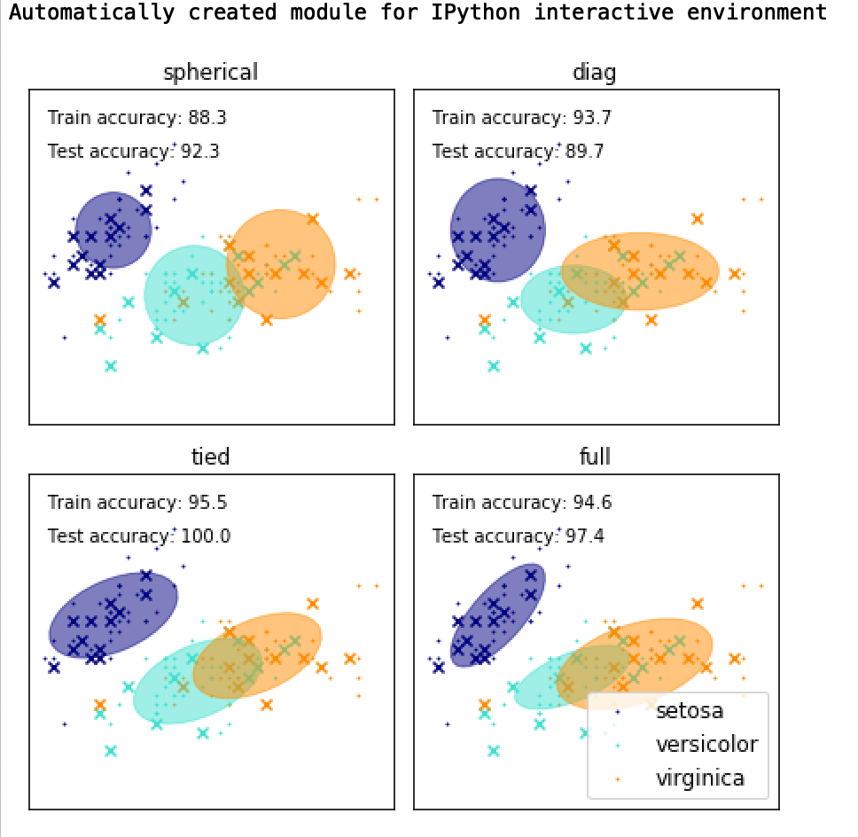
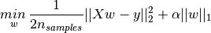

## 机器学习

```
机器学习是一种自动的过程，通过使用算法来理解数据中的模式和一些数据表示，这些算法能够提取那些模式，而无需专门为此编写程序，从而创建能够解决特定(或多个)问题的模型。
阿里腾讯滴滴头条，内推了

58同城：58同城面试紧张的一笔；
数据结构与算法；
我感觉答的还挺好；
苏宁易购：苏宁易购应该是过了；苏宁易购是两面技术；第三面技术是南京面；数据结构与算法；我是电话面试；地点：望京；锐什么大厦；八里庄那是北京人力总部和苏宁体育，世界五百强；1200计划，升职的时候基本优先考虑这些人；技术专家L7=P7

几乎是xgboost
问决策树损失函数
gbdt推导
混合高斯的em算法是什么？

滴滴：
四面结束啦；要是要我了，我好开心

layout: post
title: "Machine Learning机器学习面试题目"
date: 2019-07-23
tag: 学习
```


## gbdt和xgboost对比

传统GBDT以CART作为基分类器，xgboost还支持线性分类器，这个时候xgboost相当于带L1和L2正则项的逻辑斯蒂回归（分类问题）或者线性回归（回归问题）。
GBDT优化时只用到一阶导数信息，xgboost则对代价函数进行了二阶泰勒展开，同时用到了一阶和二阶导数。xgboost工具支持自定义代价函数，只要函数可一阶二阶求导。
xgboost在代价函数中引入了正则项，用于控制模型的复杂度。正则项里包含了树的叶子节点个数、每个叶子节点上输出score的L2。使学习出来的模型更加简单，防止过拟合。
缩减和列采样：防止过拟合，列采样是从随机森林那边学习来的，防止过拟合的效果比传统的行采样效果还要好，并且有利于后面提到的并行化处理算法。
划分点查找算法
贪心算法获取最优切分点
近似算法，提出了候选分割点概念，先通过直方图算法获得候选分割点的分布情况
分布式加权直方图算法
对缺失值的处理。对于特征的值有缺失的样本，xgboost可以自动学习出它的分裂方向。稀疏感知算法。
内置交叉验证
并行化处理：各个特征的增益计算是可以并行进行的。


## 面试-数据科学-19.6

第1部分- SQL
给定旅游应用程序模式的以下子集，编写可执行SQL查询
回答下面两个问题。请在一个查询中回答并假设
对数据库的只读访问(即不使用CREATE TABLE)。
假设一个PostgreSQL数据库，服务器时区是UTC。

|表名称:旅行||
|-|-|
|列名称:|数据类型:|
|id|的整数|
|client_id|整数(外键为users.usersid)|
|driver_id|整数(外键为users.usersid)|
|city_id|整数|
|client_rating|整数|
|driver_rating|整数|
|状态status|枚举(‘完成’,‘cancelled_by_driver’,“cancelled_by_client”)|
|actual_eta|整数|
|request_at|带有时区的 时间戳|

|表名称:用户||
|-|-|
|列名称:|数据类型:|
|usersid|整数|
|电子邮件email|性格不同|
|signup_city_id|整数|
|禁止banned|布尔|
|角色role|枚举(“客户”、“驱动程序”、“合作伙伴”)|
|created_at|带有时区的时间戳|
问题：
1. 在2013年10月1日上午10点到2013年10月22日下午5点之间
未被禁止的客户每天请求的百分比被取消
每一个城市吗?
2. 对于城市id 1、6和12，按完成的行程数列出前三位司机
于2013年6月3日至2013年6月24日期间每星期举行。
在1-5的范围内，5代表完美答案，你认为你的答案在哪里站吗?


第2部分-提出问题
保留矩阵用于表示不同队列的保留率 新客户。
1. 如何从数学上定义这个矩阵，最小数据是多少 需要得到这样一个矩阵?
2. 编写脚本(在一个SQL查询中或在另一个SQL查询中编写的循环中组合)
从上述假设的数据中得到这样一个矩阵。
在1-5的范围内，5代表完美答案，你认为你的答案在哪里站吗?


第3部分-实验设计
该旅游应用增长团队的一位产品经理提出了一个新的建议 特性。
不是每一次成功的邀请都能免费获得一次，
用户将获得一次激增 ；这让他们在下次飙升时免受峰时价格的影响。
1. 您会选择什么作为该特性成功的关键度量?
2. 除了关键指标之外，还有哪些指标值得关注?
3.描述一个实验设计，你可以用来证实假设
您选择的关键措施是不同的治疗组。
规模的1 - 5 5是一个完美的答案,你认为你的回答是?


第4部分-模特，还是你?
您有一组描述一百万客户的各种属性的数据，
例如人口统计，整个购买历史和应用程序浏览历史。
因此可以对数据进行建模，预测每个客户的回购概率个人的水平。
然后你就会面临有限的营销预算，而你可以选择分配给您选择的一组客户，
其唯一目标是最大限度地利用预算带来的回报。

1. 简要描述这种模型的典型情况(例如，逻辑回归、随机森林等)的工作，
    以帮助选择您的客户集?

2. 你做过类似的模型吗?是关于什么的?

3. 你对这个问题有何评论?

  规模的1 - 5 5是一个完美的答案,你认为你的回答是?


第5部分——礼貌而坚持地进行争论
描述一个你不同意一个普遍的共识或某个人的观点的时候
强有力的职位(例如，你的主管/客户/父母/教授)。
你可能想使用星型(情景、任务、行动和结果)格式。
尤其是，请具体的,

1. 你如何陈述你对事实的理解;
2. 你如何获得对方的观点;
3.	你如何控制双方的情绪。
规模的1 - 5 5是一个完美的答案,你认为你的回答是?


第6部分-我们的榜样告诉我们很多，我们的过去和未来也是如此

你的榜样是谁?为什么?
你做过的最大的“牺牲”是什么为了达到什么目标而做的?
你为什么要考虑这种牺牲呢?
规模的1 - 5 5是一个完美的答案,你认为你的回答是?


第7部分—处理临时场景
假设您抵达前半小时开始安排面试,你会怎么做?
你会给面试官打电话说你来早了吗?
你坐在接待玩你的电话吗?
我们感兴趣的方式应对出现的这种情况几乎每天习惯和动机背后反应。


## 高斯混合模型

```
https://www.jianshu.com/p/cd9bc01b694f
高斯混合模型 --- python教程
翻译自(翻墙需要)
https://jakevdp.github.io/PythonDataScienceHandbook/05.12-gaussian-mixtures.html
```


**使用scikit学习0.15.0。当我尝试导入sklearn.mixture时，我得到ImportError：无法导入名称选择**

```
回答1：
如上所述，它可能与旧文件（在python而不是库中实现？）在一个新的软件包中你可能使用pip install -U packagename更新（在我的例子中是pip install -U scikit-learn）它可能值得首先尝试卸载软件包并在手动删除东西之前再次安装...（在我的情况下工作）卸载（在我的情况下在Anaconda命令提示符下运行它）：

➜  ~ git:(master) ✗ 	pip uninstall scikit-learn   
然后：

➜  ~ git:(master) ✗    pip install -U numpy scipy scikit-learn 
（添加依赖项以防万一）然后只是为了确定
ERROR: tensorflow 1.14.0  not installed.
Successfully installed numpy-1.17.1 scikit-learn-0.21.3 scipy-1.3.1

➜  ~ git:(master) ✗ pip install scikit-learn
Requirement already satisfied: scikit-learn in ./anaconda3/lib/python3.7/site-packages (0.21.3)
应该说它已经安装好了


回答2：
我尝试的时候遇到了同样的错误import KMeans：from sklearn.cluster import KMeans
Error > ImportError: cannot import name choice
我在这里找到答案：https：//github.com/scikit-learn/scikit-learn/issues/3461
由于几天前我已经升级到Scikit版本0.15，因此版本中 出现 了较早版本的random.so/usr/local/lib/python2.7/dist-packages/sklearn/utils。
我手动删除它，现在我不再收到错误了。

```


**一、概念解释：**
先验概率：在有一定量数据的前提下，我们对参数进行概率估计，事件发生前的预判概率。

极大似然估计：找到一组参数使得我们观测到的数据出现的概率最大。

后验概率：在最合适的那个参数的前提下，观测数据出现的最大概率。

条件概率：

高斯分布:概率密度函数。

高斯混合模型（GMM）：高斯混合模型是一种混合模型，混合的基本分布是高斯分布，假设有随机变量x，则高斯混合模型可以表示为：，其中高斯分布称为高斯混合模型的第k个分量（component），相当于每个分量的权重且满足。

密度估计：根据数据来推断概率密度通常被称作密度估计（density estimation）。

参数估计：已知概率密度函数的形式，而要估计其中的参数的过程。

**二、GMM理论**
  GMM常用于聚类，如果要从一个GMM的分布中随机取一个点的话，实际上可以分为两步：

       1. 随机在K个分量中选一个，每个分量实际被选到的概率就是它的权重，即。
    
       2. 选中分量之后，单独再这个分两种考虑所选点的概率，此时转化为普通的高斯分布问题。

当确定高斯混合分布的分量个数即K时，之后要做的就是参数估计的过程。假设有N个数据点，我们需要确定的参数，最终目标是使确定的参数可以使生成这些数据点的概率值最大，而这个概率值实际上就是，我们这个乘积称作似然函数(likehood)。通常单个点的概率都很小，通常用取对数的方式把乘积变成加和的形式。即，我们称这个加和形式为对数似然函数(log-likehood)。我们的目标是使对数似然函数最大化。

Jensen不等式：对于凸函数；对于凹函数，Jensen不等式的等号成立。

**三、 EM算法参数估计**
为了使最大，需使等号成立以最大化下界，即（多个等式的分子分母相加值不变）

当各分量的参数确定时，的计算公式即为后验概率。（E步）

之后固定，调整使的下界极大化（固定后，的下界还可以更大）。（M步）

总结：一般的EM算法步骤为：

  1. E步: 对于每一个i，固定计算 ，

  2. M步: 得到后，调整使的下界极大化


**warning模块**

```
Python如何忽略warning的输出：
import warnings
warnings.filterwarnings('ignore')

命令行下则可以：
python -W ignore file.py
避免warnings的输出了，但是切记，不要盲目设置取消输出。
```


```python
和exception异常要求用户立刻进行处理不同，warning通常用于提示用户一些错误或者过时的用法。
case
scrapy源码中用到了继承了Warning类创建了一个提醒对象ScrapyDeprecationWarning，用于提醒过时的用户操作，在新版本可能会直接去除支持。

用户感知warnings
python参数控制warning输出
 python3 -W all example.py
 python3 -W error example.py
 python3 -W ignore example.py

python脚本控制
import warnings
warnings.simplefilter('ignore')
warnings.simplefilter('always')
warnings.simplefilter('error')

开发输出warnings
import warnings
warnings.warn('warning message', OwnDeprecationWarning)

```


**开发流程**

```
收集数据：可以使用任何方法
准备数据：树构造算法（这里使用的是ID3算法，因此数值型数据必须离散化。）
分析数据：可以使用任何方法，构造树完成之后，我们可以将树画出来。
训练算法：构造树结构
测试算法：使用习得的决策树执行分类
使用算法：此步骤可以适用于任何监督学习任务，而使用决策树可以更好地理解数据的内在含义
```


**问题 cannot import name 'GMM'** 

```
from sklearn.mixture import GMM  ===>换成这个就行了
from sklearn.mixture import GaussianMixture


Traceback (most recent call last):
  File "<ipython-input-4-047d70f98a3e>", line 1, in <module>
ImportError: cannot import name 'GMM' from 'sklearn.mixture' (/Users/tianzi/anaconda3/lib/python3.7/site-packages/sklearn/mixture/__init__.py)


https://cloud.tencent.com/developer/ask/214316


下面没有问题的包
import tensorflow as tf
import numpy as np
import matplotlib.pyplot as plt
   # 绘制出不同的簇
```

解

较新版本的scikit-learn没有该模块。通过查看版本，它在v 0.18中被弃用，并在v 0.20中删除。这是OLD 0.18模块的链接，这是我能找到的第一个显示弃用警告的实例。https://scikit-learn.org/0.18/modules/generated/sklearn.mixture.GMM.html#sklearn.mixture.GMM如果您希望安装旧版本  `pip install -Iv scikit-learn==0.15`，或者如果您想使用更新版本，请调整GaussianMixture的参数反映了它们的新名称（例如，在GaussianMixture中，`max_iter`是迭代次数，而不是`n_iter`）。

```
它可能与旧文件（在python而不是库中实现？）在一个新的软件包中你可能使用pip install -U packagename更新（在我的例子中是pip install -U scikit-learn）它可能值得首先尝试卸载软件包并在手动删除东西之前再次安装...（在我的情况下工作）卸载（在我的情况下在Anaconda命令提示符下运行它）：

   pip uninstall scikit-learn
然后：

   pip install -U numpy scipy scikit-learn
（添加依赖项以防万一）然后只是为了确定

   pip install scikit-learn
应该说它已经安装好了
```

```
实规《Python数据科学手册》的代码时，

from sklearn.mixture import GMM
总是报错，查阅对应 scikit-learn 版本的官方文档后发现，GMM 被替换为 GaussianMixture，故正确写法为：
from sklearn.mixture import GaussianMixture
启示：
遇到冷门报错信息，束手无策时，可以考虑查查官方文档
```


**官方文档**

https://sklearn.apachecn.org/docs/0.21.3/20.html

**代码**

https://scikit-learn.org/stable/auto_examples/mixture/plot_gmm_pdf.html

**图**





```python
import matplotlib as mpl
import matplotlib.pyplot as plt

import numpy as np

from sklearn import datasets
from sklearn.mixture import GaussianMixture
from sklearn.model_selection import StratifiedKFold

print(__doc__)
#为IPython交互环境自动创建模块

colors = ['navy', 'turquoise', 'darkorange']


def make_ellipses(gmm, ax):
    for n, color in enumerate(colors):
        if gmm.covariance_type == 'full':
            covariances = gmm.covariances_[n][:2, :2]
        elif gmm.covariance_type == 'tied':
            covariances = gmm.covariances_[:2, :2]
        elif gmm.covariance_type == 'diag':
            covariances = np.diag(gmm.covariances_[n][:2])
        elif gmm.covariance_type == 'spherical':
            covariances = np.eye(gmm.means_.shape[1]) * gmm.covariances_[n]
        v, w = np.linalg.eigh(covariances)
        u = w[0] / np.linalg.norm(w[0])
        angle = np.arctan2(u[1], u[0])
        angle = 180 * angle / np.pi  # convert to degrees
        v = 2. * np.sqrt(2.) * np.sqrt(v)
        ell = mpl.patches.Ellipse(gmm.means_[n, :2], v[0], v[1],
                                  180 + angle, color=color)
        ell.set_clip_box(ax.bbox)
        ell.set_alpha(0.5)
        ax.add_artist(ell)
        ax.set_aspect('equal', 'datalim')

iris = datasets.load_iris()

# Break up the dataset into non-overlapping training (75%) and testing
# (25%) sets.
skf = StratifiedKFold(n_splits=4)
# Only take the first fold.
train_index, test_index = next(iter(skf.split(iris.data, iris.target)))


X_train = iris.data[train_index]
y_train = iris.target[train_index]
X_test = iris.data[test_index]
y_test = iris.target[test_index]

n_classes = len(np.unique(y_train))

# Try GMMs using different types of covariances.
estimators = {cov_type: GaussianMixture(n_components=n_classes,
              covariance_type=cov_type, max_iter=20, random_state=0)
              for cov_type in ['spherical', 'diag', 'tied', 'full']}

n_estimators = len(estimators)

plt.figure(figsize=(3 * n_estimators // 2, 6))
plt.subplots_adjust(bottom=.01, top=0.95, hspace=.15, wspace=.05,
                    left=.01, right=.99)


for index, (name, estimator) in enumerate(estimators.items()):
    # Since we have class labels for the training data, we can
    # initialize the GMM parameters in a supervised manner.
    estimator.means_init = np.array([X_train[y_train == i].mean(axis=0)
                                    for i in range(n_classes)])

    # Train the other parameters using the EM algorithm.
    estimator.fit(X_train)

    h = plt.subplot(2, n_estimators // 2, index + 1)
    make_ellipses(estimator, h)

    for n, color in enumerate(colors):
        data = iris.data[iris.target == n]
        plt.scatter(data[:, 0], data[:, 1], s=0.8, color=color,
                    label=iris.target_names[n])
    # Plot the test data with crosses
    for n, color in enumerate(colors):
        data = X_test[y_test == n]
        plt.scatter(data[:, 0], data[:, 1], marker='x', color=color)

    y_train_pred = estimator.predict(X_train)
    train_accuracy = np.mean(y_train_pred.ravel() == y_train.ravel()) * 100
    plt.text(0.05, 0.9, 'Train accuracy: %.1f' % train_accuracy,
             transform=h.transAxes)

    y_test_pred = estimator.predict(X_test)
    test_accuracy = np.mean(y_test_pred.ravel() == y_test.ravel()) * 100
    plt.text(0.05, 0.8, 'Test accuracy: %.1f' % test_accuracy,
             transform=h.transAxes)

    plt.xticks(())
    plt.yticks(())
    plt.title(name)

plt.legend(scatterpoints=1, loc='lower right', prop=dict(size=12))


plt.show()
```


## **书记**

```
案例一主要是基于“中国人民共和国地市级党委书记数据库(2000-2010) ”数据进行数据挖掘，该数据库由
复旦大学经济学院陈硕副教授及其团队(Fudan WTF Social Science Lab)成员整理，主要研究问题如下：
1、性别构成
2、年龄情况、专业情况
3、任期情况

课程技术点：
数据读取及查看 / 数据清洗 / 数据分析 / 图表制作

参考文章：
《如何成为一位市委书记？》
```


```python
# 先将.xls文件导出成.csv文件
# 注意：以下一切代码均为英文输入法，包括标点符号等！！

# 加载csv数据，并且将数据赋予data变量
# 这里用到了pandas的工具包，读取数据之后的格式为Dataframe，是一种矩阵格式（execl的数据表格其实也是一种矩阵格式）
# pyhton中，创造一个变量的方法就是给其赋值，而“=”代表 变量赋值
# print()是python最基本的语句之一，代表“打印内容”
# import语句：加载工具包
import numpy as np 	 # numpy：科学计算工具包
import pandas as pd 	# pandas：数据分析工具包
import matplotlib.pyplot as plt	# pandas：数据分析工具包

# data = pd.read_csv("C:\\Users\\Hjx\\Desktop\\地市级党委书记数据库（2000-10）.csv",encoding = "gbk")
data = pd.read_csv("书记.csv")


print(data)

```


## Lasso

[`Lasso`](https://scikit-learn.org/stable/modules/generated/sklearn.linear_model.Lasso.html#sklearn.linear_model.Lasso) 是拟合稀疏系数的线性模型。 它在一些情况下是有用的，因为它倾向于使用具有较少参数值的情况，有效地减少给定解决方案所依赖变量的数量。 因此，Lasso 及其变体是压缩感知领域的基础。 在一定条件下，它可以恢复一组非零权重的精确集（见[压缩感知_断层重建](https://scikit-learn.org/stable/auto_examples/applications/plot_tomography_l1_reconstruction.html)）。

在数学公式表达上，它由一个带有  先验的正则项的线性模型组成。 其最小化的目标函数是:



​					$\underset{w}{min\,} { \frac{1}{2n_{samples}} ||X w - y||_2 ^ 2 + \alpha ||w||_1}$

lasso estimate 解决了加上罚项  的最小二乘法的最小化，其中，  是一个常数，  是参数向量的 -norm 范数。

[`Lasso`](https://scikit-learn.org/stable/modules/generated/sklearn.linear_model.Lasso.html#sklearn.linear_model.Lasso) 类的实现使用了 coordinate descent （坐标下降算法）来拟合系数。 查看 [最小角回归](#117-最小角回归) ，这是另一种方法:

```py
>>> from sklearn import linear_model
>>> reg = linear_model.Lasso(alpha = 0.1)
>>> reg.fit([[0, 0], [1, 1]], [0, 1])
Lasso(alpha=0.1, copy_X=True, fit_intercept=True, max_iter=1000,
 normalize=False, positive=False, precompute=False, random_state=None,
 selection='cyclic', tol=0.0001, warm_start=False)
>>> reg.predict([[1, 1]])
array([ 0.8])

```

对于较简单的任务，同样有用的是函数 [`lasso_path`](https://scikit-learn.org/stable/modules/generated/sklearn.linear_model.lasso_path.html#sklearn.linear_model.lasso_path) 。它能够通过搜索所有可能的路径上的值来计算系数。

> **示例:**
>
> - [Lasso和Elastic Net(弹性网络)在稀疏信号上的表现](https://scikit-learn.org/stable/auto_examples/linear_model/plot_lasso_and_elasticnet.html#sphx-glr-auto-examples-linear-model-plot-lasso-and-elasticnet-py)
> - [压缩感知_断层重建](https://scikit-learn.org/stable/auto_examples/applications/plot_tomography_l1_reconstruction.html)


> **注意: 使用 Lasso 进行特征选择**
>
> 由于 Lasso 回归产生稀疏模型，因此可以用于执行特征选择，详见 [基于 L1 的特征选取](14#11341-基于-l1-的特征选取) 。

下面两篇参考解释了scikit-learn坐标下降算法中使用的迭代，以及用于收敛控制的对偶间隙计算的理论基础。

> **参考资料**
>
> - “Regularization Path For Generalized linear Models by Coordinate Descent”, Friedman, Hastie & Tibshirani, J Stat Softw, 2010 ([Paper](https://www.jstatsoft.org/article/view/v033i01/v33i01.pdf)).
> - “An Interior-Point Method for Large-Scale L1-Regularized Least Squares,” S. J. Kim, K. Koh, M. Lustig, S. Boyd and D. Gorinevsky, in IEEE Journal of Selected Topics in Signal Processing, 2007 ([Paper](https://web.stanford.edu/~boyd/papers/pdf/l1_ls.pdf))


## end


