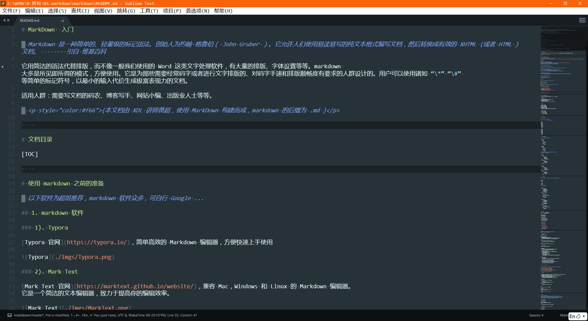
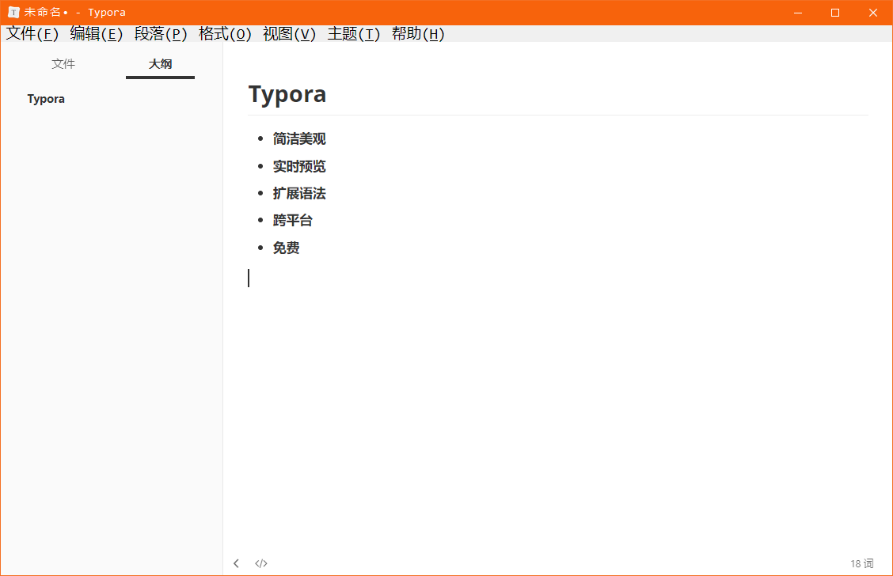
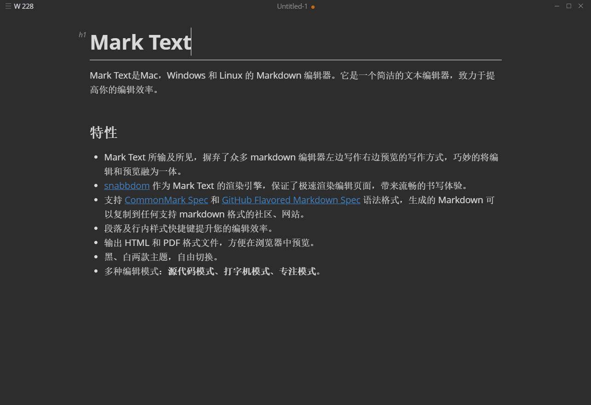
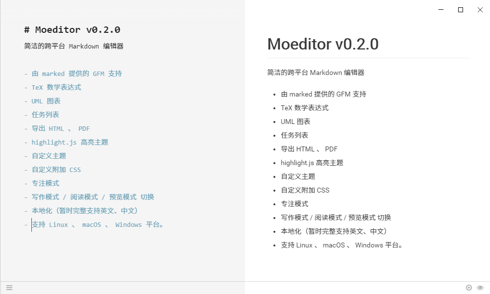
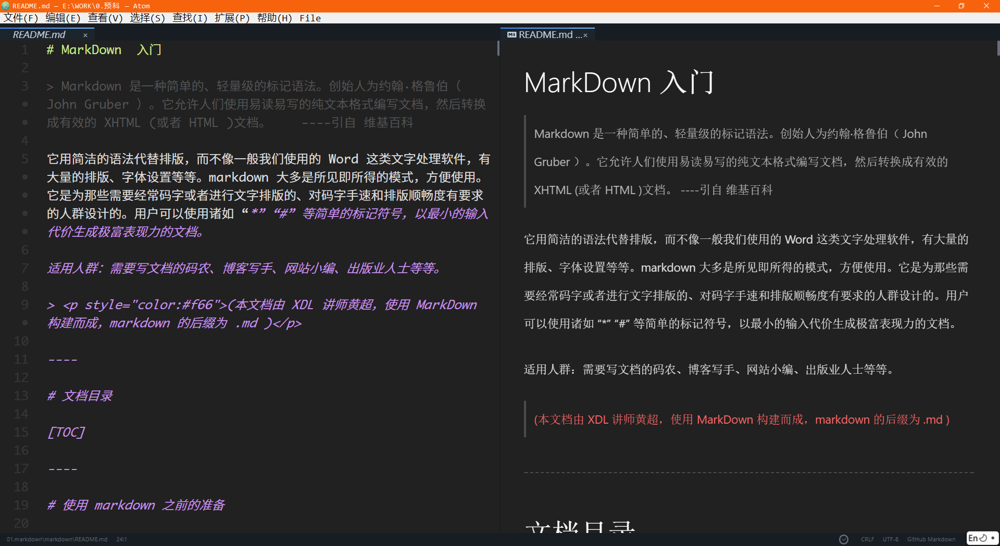
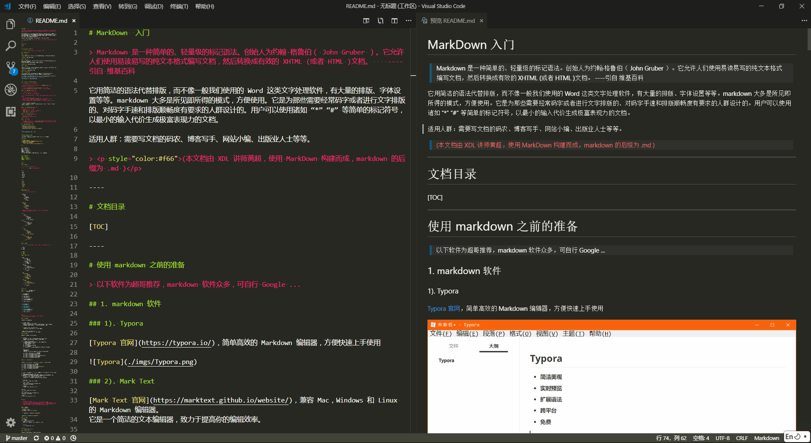
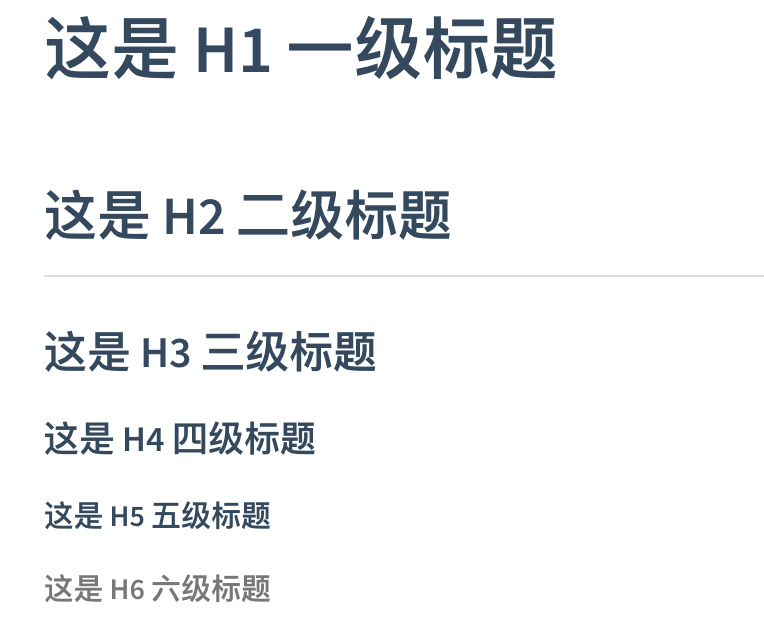
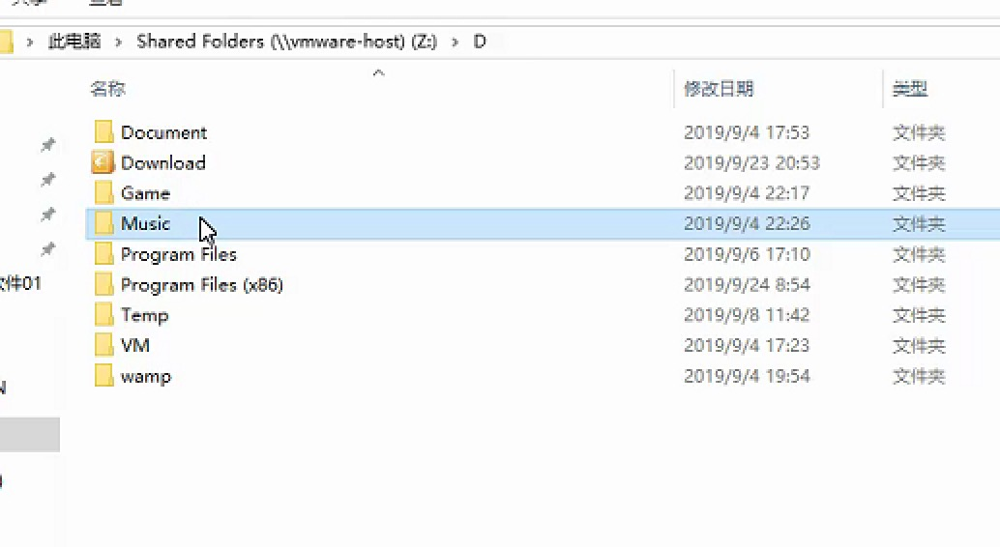

## markdown简介

> [Markdown](https://zh.wikipedia.org/wiki/Markdown) 是一种简单的、轻量级的标记语法。创始人为约翰·格鲁伯（John Gruber）。
>
> 它允许人们使用，易读易写的纯文本格式编写文档，然后转换成有效的 HTML 文档。
>
> ——— 引用自《[维基百科](https://zh.wikipedia.org/wiki/)》

它用简洁的语法代替排版，而不像一般我们使用的 Word 这类文字处理软件，有大量的排版、字体设置等等。markdown 大多是所见即所得的模式，方便使用。

它是为那些需要经常码字或者进行文字排版的、对码字手速和排版顺畅度有要求的人群设计的。用户可以使用诸如 “\*” “\#” 等简单的标记符号，以最小的输入代价生成极富表现力的文档。

适用人群：需要写文档的码农、博客写手、网站小编、出版业人士等等。

> <p style="color:#f66">（markdown 的后缀为 .md）</p>

## 1.有道云的公式


```html
节目目录（table of contents）== toc 

layout: post
title: TensorFlow 在 iOS 平台上的使用(一)
date: 2016-11-03 
tags: 机器学习   


layout: post
title: "iOS 9 变化笔记"
date: 2015-09-26 18:15:06 
description: "iOS9 变化笔记, 以及工作中常遇到的问题"
tag: iOS

<div align="center">
	
</div> 

<div align="center">
　　
</div> 
```


$$n! = \begin{cases}1 &\text{if }			 n=0  ;  \
n*(n-1)! &\text{if } n\geq1\end{cases}$$

```math
n! = \begin{cases}
1 &\text{if } n=0 \
n*(n-1)! &\text{if } n\geq1
\end{cases}
```


## 2.google的公式：

做机器学习，画个简单的数学公式，很容易出来，还可以调节参数。

https://www.desmos.com/calculator/hrhjutvlew


## 3.word 数学公式

插入 公式，对于office2019 更加人性话 有很多公式模版，很不错。不过不可以复制。应该是与底层语言有关系。我们复制出来是图片的形式。例如：你写一个积分，就是个图片。

一般数学老师会用到，或者论文。


## 4.md-typora公式

常用的数学公式语法，以及一般遇到的场景，简要汇总如下：

**1.累加与累乘**

(sum = summation总和，multiplicative 累乘 )

$$\sum_{i=0}^{n}  \prod_\epsilon$$= $$\sum_{i=0}^{n}$  \prod_\epsilon$$

```
$$\sum_{i=0}^{n}  \prod_\epsilon$$

 $$\sum_{i=0}^{n}$  \prod_\epsilon$$ 不可以了
```

**2.微分与积分**

$\int_{a}^{\pi} f(x)\,dx$ =	∫πaf(x)dx=     $\int_{a}^{\pi} f(x) \,dx$  =$\int f(x) \,dx$  =    $\frac{x^{2}y^{2}}{x+y}$=    $c = \sqrt{a^{2}+b_{xy}^{2} +e^{x}}$

```
$\int_{a}^{\pi} f(x)\,dx$
$\int f(x) \,dx$   不定积分

$\frac{x^{2}y^{2}}{x+y}$ 除法
$c = \sqrt{a^{2}+b_{xy}^{2} +e^{x}}$  两点之间的坐标
```


**3.极限与偏导数**


$$\lim_{x\to +\infty}\frac{1}{x}$$=$$ \lim_{x \to +\infty}\frac{1}{x}$$= $$\frac{\partial^2 u}{\partial z^2}$$

```
$$\lim_{x\to +\infty}\frac{1}{x}$$		求极限
$$ \lim_{x \to +\infty}\frac{1}{x}$$

$$\frac{\partial^2 u}{\partial z^2}$$  u =x^4 对x^2进行求偏导
```


**4.三角函数**

$$\cos2\theta $$= $$cos^2\theta - \sin^2 \theta \\$$ =$$  2\cos^2\theta -1$$

$$\cos2\ theta  = cos^2\theta - \sin^2 \ theta\\ \ = 2\cos^2\theta-1$$

```
$$\cos2\theta = cos^2\theta - \sin^2 \theta \\ =  2\cos^2\theta -1$$

```

**5.矩阵**

矩阵必须要有等于号---


$$ \begin{equation} A= \left[\begin {matrix}1&2&3&\\2&2&3&\\3&2&3&\end{matrix}\right]\end{equation}$$=$$\begin{equation}
A=\left[
\begin{matrix}
1&2&3&\\
2&2&3&\\
3&2&3&
\end{matrix}
\right]
\end{equation}$$=A = $$ \begin{equation}  \left[\begin {matrix}1&2&3&\\2&2&3&\\3&2&3&\end{matrix}\right]\end{equation}$$


```
$$ \begin{equation} A= \left[\begin {matrix}1&2&3&\\2&2&3&\\3&2&3&\end{matrix}\right]\end{equation}$$


输出一个3*3的 矩阵：
$$\begin{equation}
left[
\begin{matrix}
1&2&3&\\
2&2&3&\\
3&2&3&
\end{matrix}
\right]
\end{equation}$$
```


**6.希腊字母**


```

```

$\rho$ = $\varrho$

$\varphi$

**7.数学符号(属于)**


**8.运算符号**


**6.画横线**

```
 |值|描述|
  |-|-|
  |border-box	|背景被裁剪到边框盒。(默认)|
  |padding-box	|背景被裁剪到内边距框。|
	| content-box	|背景被裁剪到内容框。|

```

**7.文字**

```
1.说明
本文主要叙述如何写出更加优美的markdown文档。在我们观看文档的过程中，良好的格式将会带来很大的收益。对于不同颜色的字体也并不会显得花里胡哨，只会让我们表达的内容更加的清晰。下面来具体的看一下操作的流程。

2. 文字的居中
对于标准的markdown文本，是不支持居中对齐的。还好markdown支持html语言，所以我们采用html语法格式即可。

<center>这一行需要居中</center>
下面就是排版后的结果


3.文字的字体及颜色
3.1 字体更换
同样我们也需要遵照其标准的语法格式

<font face="黑体">我是黑体字</font>
下面是测试结果


3.2 大小更换
大小为size

<font face="黑体" size=10>我是黑体字</font>

3.3 颜色替换
对于html语音中，颜色是用color来表示，所以可以表示如下

<font color=red size=72>颜色</font>


4 总结
善用markdown语法，记住markdown语法是兼容html预言的，这很重要。


-----------------------------------
<center>这一行需要居中</center>
<font face="黑体">我是黑体字</font>
<font face="黑体" size=10>我是黑体字</font>
<font color=red size=72>颜色</font>
<center><font color=red size=72>居中的颜色</font></center>
```

<center>1这一行需要居中</center>
<font face="黑体">2我是黑体字</font>

<font face="黑体" size=10>3我是黑体字</font>

<font color=red size=72>4颜色</font>

<center><font color=red size=72>颜色</font></center>
**Md 换编辑器**

一种格式化文本的简单方法，在任何设备上看起来都很棒。它不会像改变字体大小，颜色或类型那样做任何想法 - 只需要使用您已经知道的键盘符号的基本要素。


## 5.md的使用-1909


- markdown使用说明:(相当于网页)

1. ctrl 加 + 升级。 加大标题
2. ctrl 加 - 降级。减小标题
3. command + 0 。 没有标题 。
4. ctrl+k+B  **大纲**
5. '''代表代码块 还有'一个tab 上面的键(tab 上面的键)
6. 偏好设置,很多功能.折叠
   - ctrl + l 选中
   - ctrl + B 加粗
   - 无序==总->分 shift +前推
     - shift +ctrl+ 右边大括号 无序...
     - shift + ctrl +左边大括号为有序
     - tab + 后退
   - 字体放大缩小 shift+ctrl+加号.
     - ---- ------ --shift+ctrl+减号.

```
无序：+    -   *		点tab
. 是项目标示； 
有序：数字	点 空格
```

- d


- 减号


- 🌟星星

1. 方法	
2. 深度防水的


<!--注释：浏览器看不到-->

少年强扶墙  
少女强平躺
（内换行）
少女强

少年墙

豆豆

```
1.标题层级如下，最多6级
# 顶级标题 等价于 title 和 <h1>
## 次级标题 等价于 <h2>
### 3级标题 等价于 <h3>
#### 4级标题 等价于 <h4>
##### 5级标题 等价于 <h5>
###### 6级标题 等价于 <h6>
####### 注：此行错误，标题层级最多6级 没有<h7>标签


2.加强和强调规范
 *强调 **加强  							*emphasize*   **strong** 
使用~~给文字添加删除线				~~strikethrough~~


3个波浪						块级代码
 链接    An [example](http://url.com/ "Title")
 
 
3.markdown图片语法：   这样就可以上传了
```


> 
>
> 只要> 回车就可以了。


**换行问题**

1. markdown的换行效果百度了很多，都是使用空格空格加换行符的效果进行换行
   示例：
   ``123  
   123``
   效果：
   123
   123
2. 有道云的markdown文档里面要是为了效果想生成单独的空行，我现在采用的是"&nbsp;"加上空格空格换行符，有一个空格能让单独的空行生成示例：

```
  123  
  &nbsp;  
  123
```

**1.标题**

```
# 一级标题

## 二级标题
```

**2.字体**

- 倾斜

  前后加1个*

  *字体*

- 加粗 ctrl+b （command+b）****

  前后加2个*

  **加粗字体**

- 加粗倾斜

  前后3个*

  ****加粗倾斜***

```
command+b
```


**3.图片**

```

```

**4.超链接**

```
[超链接名](超链接地址 "超链接title")
title可加可不加
```

**5.列表**

```
无序列表

- *

有序列表

1. ds
2. 2
```

无序列表

- - 

有序列表

1. ds

2. 2

   ​	

**引用**

```
> 设置引用文本
>>  设置引用文本
```


> dsada
>
> > ​	dsad
> >
> > > ​	fdsafds
> > >
> > > 
>
> ​	

222= 1024\*2\*3

**超链接**   与图像

```
[]()
ctrl+单机一下
../../上上级目录 ；相对路径
网址  c盘；带盘符就是 绝对路径；
/xx/xxx/xx.jpg						根地址
```

[百度](https://www.baidu.com)


**代码块**

```
''单
""双
`反引号
<del>哈哈哈</del>    用一反引号
\转义    把特殊字符变成普通 。 普通变成不同。
```

`<del>哈哈哈</del> `

`<strong>嘻嘻</strong>`

撒打算\t sadsa


**表格**

```
8列 20行 
快捷键ctrl + t 
新增一行： ctrl +enter

加粗 ctrl  + B
```


## 6.使用 md-sublime text3

> ​	软件
>
> Sublime 3
>
> **Typora**
>
>  Mark Text
>
> 4-Moeditor
>
> 5-Atom-GitHub 出品
>
> 6-Visual Studio Code(推荐)-微软
>
> 在线的 MarkDown 编辑器：
>
> - [MaHua](http://mahua.jser.me/)
> - [dillinger](http://dillinger.io/)
> - [简书](http://www.jianshu.com/)
> - Cmd Markdown


HBuilder是[DCloud](https://link.jianshu.com/?t=http://baike.baidu.com/view/8938133.htm)数字天堂推出的一款支持HTML5开发IDE，通过完整的语法提示和代码输入法、代码块等，大幅提升HTML、js、css的开发效率。相对于sublime不必安装很多插件，要求熟记语法规则，因此比较适合跨平台移动app的开发。


**Sublime 3**



sublime 3 需要安装一些辅助插件，才能方便我们编写 markdown。由于这类插件众多，以下推荐两款，可根据个人喜好使用。

按`crtl+shift+p` 呼出 Package Control 工具列表

搜索并选择 `Package Control: Install Package` 安装插件功能。

> 首次使用 Package Control 需要安装控制插件: [Package Control](https://packagecontrol.io/installation) 
>
> 选择后，需要稍作等待，它要拉取在线的插件列表，如果拉取失败请重试！

**1). Markdown Preview 插件**

功能 1: 按 `CTRL + B` 生成 HTML 网页文件 （默认功能)

> 该插件默认生成的 HTML 页面的 body 宽度是固定的。
>
> 如果想设置宽一些，建议将此值改大一些即可！

功能 2: 按 `ALT + M` 打开为网页 （需要自定义按键）

> 在 sublime 里选择 [首选项] -- [快捷键设置]，在打开的设置里添加 按键配置
>
> 按 alt+m，即可打开当前编辑的 markdown 文件为 HTML 网页
>
> 在 User 文件内，将以下代码添加至中括号内: (如有其他设置，需要在 {} 配置之前加 `,`)

```json
// 默认打开 markdown 为 html 文件
{ "keys": ["alt+m"], "command": "markdown_preview", "args": {"target": "browser", "parser":"markdown"} }
```


> sub常用插件推荐
>
> Sublime Text 3(Mac版)
>
> 


- **Emmet**
  ——Emmet 官方提供的 Sublime Text 扩展；//即zencoding，写html先装这一个就够了
- SublimeLinter
  ——代码校验插件，支持 HTML、CSS、JS、PHP、Java、C++ 等16种语言；
- **HTML5**
- **Alignment**
  ——代码对齐插件
- **jQuery**
  ——代码智能提示插件
  -Git
  —整合 Git 功能的插件
- **LESS**
  ——LESS 代码高亮插件
- **JsFormat**
  ——JavaScript 代码格式化插件
- **LiveReload**
  ——让页面即时刷新
- **Pretty JSON**
  ——JSON美化扩展
- **Can I Use**
  ——查询 CSS 属性兼容情况
- **CoffeeScript**
  ——CoffeeScript 代码高亮，校验和编译等
- **ColorPicker**
  ——跨平台取色器插件


> ​	sublime右键打开
>
> Windows10

修改注册表

1. win + R
2. 输入  `regedit`, 打开注册表
3. 点开 HKEY_CLASSES_ROOT \ * \ shell
4. 右键 shell  -> 创建 "项" -> `取名 "用 Sublime Text3 打开"`
5. 右键 `"用 Sublime Text3 打开"`项 -> 创建 "项" -> 取名 "Command"
6. 在 Command 右侧, 双击 `"默认", 输入内容 "sublime主程序地址" "%1"`


**新建->字符串值**


---


> sublime_install安装
>
> ​	在 Ubuntu 软件中 安装 sublime


**汉化**

1. 汉化需要安装一个package control，通过这个插件管理器可以使用很多插件来扩展sublime的功能。

2. 使用`Ctrl+`\`快捷键或者通过`View->Show Console`菜单打开命令行，输入

   ```
   import urllib.request,os; pf = 'Package Control.sublime-package'; ipp = sublime.installed_packages_path(); urllib.request.install_opener( urllib.request.build_opener( urllib.request.ProxyHandler()) ); open(os.path.join(ipp, pf),'wb').write(urllib.request.urlopen( 'http://sublime.wbond.net/' + pf.replace(' ','%20')).read())
   ```

3. 点击`package control`，输入或 `install package`

4. 输入 `chineselocalization` 并安装


**代码补全**

1. 打开首选项中的设置-用户

2. 加上一句`"auto_complete": true,"auto_match_enabled": true,`

3. 保存关闭重开

4. html 代码不全:

   打开`package control`,直接在输入框内输入 emmet 安装


**Typora**

[Typora 官网](https://typora.io/)，简单高效的 Markdown 编辑器，方便快速上手使用




Mark Text

[Mark Text 官网](https://marktext.github.io/website/)，兼容 Mac，Windows 和 Linux 的 Markdown 编辑器。挺好用
它是一个简洁的文本编辑器，致力于提高你的编辑效率。




---


4-Moeditor

[Moeditor 下载](https://github.com/Moeditor/Moeditor/releases)，特点是左右分栏，左边源码，右边即时显示效果，详见下图。



------

**2. 代码编辑器 编写 Markdown**

> 一些文本编辑器，也很好的提供了 markdown 的编写功能。
>
> 如  [Sublime 3](https://www.sublimetext.com/3)、 [Atom](https://atom.io)、 [Visual Studio Code](https://code.visualstudio.com) 等等，有兴趣可以自己 Google...


2). MarkDown Editing 插件

> 支持 Markdown 语法高亮;
>
> 支持 Github Favored Markdown 语法;
>
> 自带 3 个主题.


---


Atom

> GitHub 出品，自带预览模式的 Markdown 编辑器。




---


Visual Studio Code(推荐)

> 微软爸爸良心出品，全平台支持。自带预览模式的 Markdown 编辑器。



**3. 在线的 MarkDown 编辑器**

- [MaHua](http://mahua.jser.me/)
- [dillinger](http://dillinger.io/)
- [简书](http://www.jianshu.com/)
- [Cmd Markdown](https://www.zybuluo.com/mdeditor)

------

> *现在，准备工作做好了，我们开始吧！*

------

**MarkDown 的常用语法介绍**

为了保证以下讲解的语法通用，所以都是基于**`源码模式`**来规定的。

**基本规则**

- 单个回车，视为空格.
- 连续回车，才能分段（即两段内容之间有一个空行）
- 行尾加两个空格，再加单个回车，即可段内换行
- 注释可使用 html 的注释：
  `<!--我是 html 的注释，在 markdown 内可以直接使用-->`

**标题**

```
源码: 
# 这是 H1 一级标题
## 这是 H2 二级标题
### 这是 H3 三级标题
#### 这是 H4 四级标题
##### 这是 H5 五级标题
###### 这是 H6 六级标题
（不同的编辑器，可能对标题的渲染样式有所不同，其原理一致。）

Typora 快捷键: 
一级标题: Ctrl + 1
二级标题: Ctrl + 2
...
以此类推

Ctrl + + 	加大标题
Ctrl + - 	减小标题
Ctrl + 0 	没有标题


```



三、列表

**1. 无序列表**

> 注意，标记符号与文字之间有空格！
>
> **`*` `+` `-` 三种符号** 均可实现无序列表

```
* 中国
* 韩国
* 日本
+ 德国
+ 法国
+ 意大利
- 美国
- 加拿大
- 巴西
```

- 中国
- 韩国
- 日本

- 德国
- 法国
- 意大利

- 美国
- 加拿大
- 巴西

------

**无序列表嵌套**

> 注意，标记符号与文字之间有空格！
>
> 使用四个空格，来设置层级关系.

```
* 电子数码
    * 电脑
    * 手机
        * iphone
        * 锤子手机
    * 电器
        * 冰箱
        * 洗衣机
```

- 电子数码
  - 电脑
  - 手机
    - iphone
    - 锤子手机
  - 电器
    - 冰箱
    - 洗衣机

> 无序列表的标记符号可以混用，建议按层级书写，同级应该保持一致

```
* 中国
    + 北京
    + 上海
        - 静安区
            * XDL教育
            * 宝尊电商
        - 浦东新区
            * 东方明珠电视塔
* 美国
    + 纽约
        - 曼哈顿区
            * 自由女神像
            * 华尔街
            * 中央公园
    + 华盛顿
```

- 中国
  - 北京
  - 上海
    - 静安区
      - XDL教育
      - 宝尊电商
    - 浦东新区
      - 东方明珠电视塔
- 美国
  - 纽约
    - 曼哈顿区
      - 自由女神像
      - 华尔街
      - 中央公园
  - 华盛顿

------

**2. 有序列表**

> 使用 **`数字 + 点 + 空格`** 的形式来表示
>
> 标记符号与文字之间，依旧要有空格！

```
1. 文本
2. 音乐
3. 电影
```

1. 文本
2. 音乐
3. 电影

**有序列表嵌套**

```
- 电影
    1. 美国电影
        1. 《蝙蝠侠》
        2. 《疯狂动物城》
        3. 《盗梦空间》
    2. 日本电影
        1. 《你的名字》
        2. 《小偷家族》
- 音乐
    1. 欧美
        1. 《fade》
        2. 《Lock Me Up》
        3. 《Dream It Possible》
    2. 国语
        1. 《生僻字》
        2. 《成都》
```

- 电影
  1. 美国电影
     1. 《蝙蝠侠》
     2. 《疯狂动物城》
     3. 《盗梦空间》
  2. 日本电影
     1. 《你的名字》
     2. 《小偷家族》
- 音乐
  1. 欧美
     1. 《fade》
     2. 《Lock Me Up》
     3. 《Dream It Possible》
  2. 国语
     1. 《生僻字》
     2. 《成都》

------

四、文字格式

使用 `*` 或 `_` 来设置斜体或加粗
使用 `~~` 来设置文本删除线

```
*这是文字斜体格式*
_这是文字斜体格式_

**这是文字粗体格式**
__这是文字粗体格式__

***这是文字粗体+斜体格式***
___这是文字粗体+斜体格式___

~~这是文字删除线格式~~

Typora:
加粗: Ctrl + B
倾斜: Ctrl + i
下划线: Ctrl + u
```

*这是文字斜体格式*  |  _这是文字斜体格式_

**这是文字粗体格式**  |  __这是文字粗体格式__

***这是文字粗体+斜体格式***  |  ___这是文字粗体+斜体格式___

~~这是文字删除线格式~~

------

**五、链接**

> 使用以下两种语法来设置链接文本，注意语法之间的空格
>
> 亦可使用`<a></a>`标签来设置链接

**1. 直接设置 （推荐）**

直接设置链接（行内形式）

```
格式: 
    [链接名称](链接地址)
    
    [链接名称](链接地址 "我是title描述")
        只要在方块括号后面，紧接着写小括号，并在小括号内，插入网址链接即可。
        小括号内，还可以选择性的加入 title 属性，用于描述该链接。

例如:
    [百度一下](http://www.baidu.com/)
    [ITXDL](http://www.itxdl.cn/ "兄弟连教育官网")
```

[百度一下](http://www.baidu.com/)  
[ITXDL](http://www.itxdl.cn/ "网")

**2. 间接设置 （部分支持）**

间接设置 链接可重复使用（参考形式）

```
[链接名称][1]
    参考式的链接，是在链接名称的括号后面，再接上另一个方括号
    而在第二个方括号里面，要填入用以辨识链接的标记。

[1]: 链接地址 "我是title描述"
    接着，在文件的任意处，你可以把这个标记的链接内容定义出来
    链接内容定义的形式为：
    1). 方括号，里面输入链接文字
    2). 接着一个冒号
    3). 接着一个以上的空格或制表符
    4). 接着链接的网址
    5). 选择性地接着 title 内容，它可以用单引号、双引号或是括号包裹着

例如:
    [B站][1]
    [Bilibili][1]
    [LAMP][2]是由[linux][3]/[apache][4]/[mysql][5]/[php][6]构成.

    [1]: https://www.bilibili.com/ "哔哩哔哩"
    [2]: https://zh.wikipedia.org/wiki/LAMP/
    [3]: https://zh.wikipedia.org/wiki/Linux/
    [4]: https://zh.wikipedia.org/wiki/Apache_HTTP_Server/
    [5]: https://zh.wikipedia.org/wiki/MySQL/
    [6]: https://zh.wikipedia.org/wiki/PHP/
```

[B站][1]  |  [Bilibili][1]

[LAMP][2] 是由 [linux][3] / [apache][4] / [mysql][5] / [php][6] 构成.

[1]: https://www.bilibili.com/	"哔哩哔哩"
[2]: https://zh.wikipedia.org/wiki/LAMP/
[3]: https://zh.wikipedia.org/wiki/Linux/
[4]: https://zh.wikipedia.org/wiki/Apache_HTTP_Server/
[5]: https://zh.wikipedia.org/wiki/MySQL/
[6]: https://zh.wikipedia.org/wiki/PHP/

**3. 其他 （部分支持）**

```
1. 链接辨别标签，可以有字母/数字/空白/标点符号，但是并不区分大小写: [a] [A] 视为一致（例1）
2. 链接网址也可以用尖括号包起来。（例1）
3. 你也可以把 title 属性放到下一行，若网址太长的话，这样会比较好看。（例2）
4. 隐式链接标记功能，让你可以省略指定链接标记。（例3）
    这种情形下，链接标记会视为等同于链接文字，
    要用隐式链接标记，只要在链接文字后面，加上一个空的方括号.

例1:
    [花瓣][a]
    [A]: <http://huaban.com/> "花瓣网"
例2:
    [谷歌实验][gg]
    [gg]: https://experiments.withgoogle.com/
    "Experiments with Google"
例3:
    [ACFUN][]
    [ACFUN]: http://www.acfun.cn "A站"
```

[花瓣][a]

[A]: http://huaban.com/	"花瓣网"

[谷歌实验][gg]

[gg]: https://experiments.withgoogle.com/

"Experiments with Google"

[ACFUN][]

[ACFUN]: http://www.acfun.cn	"A站"

------

**六、图片**

> 图片的语法与链接很相似
>
> 注意: markdown 无法设置图片的宽高，如有需要，可自行添加``标签
>
> > 图片值得注意之处： 若是本地图片，那么 markdown 就会生成绝对地址，给你引入图片。
> >
> > 所以，想要正常的在 markdown 内展示自己添加的图片，还是选择一个网络的图床吧。
> >
> > 推荐使用 七牛云存储 或 微博图片 或 [SMMS](https://sm.ms) 等，或输出为 PDF 文件亦可。

**1. 行内形式 （推荐）**

title 为可选设置

```


例如:
    
```


**2. 参考形式 （部分支持）**

```
![替代文本][1]
[1]: 链接地址
[1]: 链接地址 "我是title描述"
    可设置 title 描述:
    需要注意: 链接地址的数字号，与普通的链接共享。

例如:
    ![喵][7]
    [7]: ./imgs/02.jpg "喵喵喵"
```

![喵][7]

[7]: ../images/posts/markdown/02.jpg	"喵喵喵"

**3. 自定义图片宽高**

markdown 默认的图片语法，不支持调整图片宽高。
需要使用 img 标签来搞定。

```
例如：
    下图过大
    
    
    换成
    
```


```
相对路径
	./ 		当前目录下, 默认
	../ 	上一级目录下
	../../ 	上上级目录下
	依次类推
	
	如果直接写文件名, 默认为 当前目录下  1.jpg   和 ./1.jpg 效果一样


绝对路径
	在线路径		http://www.baidu.com/xxx/xxx/a.jpg
	本地路径		D:/xxx/xxx/a.jpg
	
```


------

**七引用**

```
> 设置引用文本
>> 设置嵌套的引用文本
```

> 我是引用的文本
>
> > 哎呀，好巧！ 我也是引用文本！（嵌套）

引用内可包含其他语法:

```
引用文本内，也可以使用其他的 Markdown 语法，包括标题、列表、代码区块等：
	
> + 网页三剑客
>     * html
>     * css
>     * javascript

> 欢迎来到全球最大的[程序员交友网站](https://github.com/)!
```

> - 网页三剑客
>   - html
>   - css
>   - javascript
>
> 欢迎来到全球最大的[程序员交友网站](https://github.com/)!

------

**水平分隔线**

> 可以在一行中用三个以上的星号、减号、下划线来建立一个分隔线，行内不能有其他东西。
>
> 也可以在星号或是减号或下划线中间插入空格。

```
---
___
***
- - - -
* * * *
```

------

------

------

**八、代码块( 重点 )**

**1. 代码语句**

> 如果要标记一小段的行内代码，你可以一对用反引号 \`\` 把它包裹起来

```
一句代码： `print(5201314)`
请问大神 `<frameset></frameset>` 是什么标签？
```

一句代码： `print(5201314)`
请问大神 `<frameset></frameset>` 是什么标签？

**2. 代码段**

> 以下两种方案皆可
>
> 代码段与其他元素之间，要有一个换行，前后都是如此。

**1). 空格代码段**

使用4个空格，来定义代码段。一个代码区块会一直持续到，没有缩进的那一行或是文件结尾.
以下代码，需要查看 markdown 源码文件学习

```
// 递归计算阶乘
function fact(n) {
    if(n > 0){
        return n * fact(n-1);
    }
    if(n === 0){
        return n = 1;
    }
}
fact(5); // 120
```

**2). 使用反引号的代码段**

使用三个以上反引号，定义代码段开始和结束。
以下代码，需要查看 markdown 源码文件学习。
代码的着色会根据 markdown 主题的不同，显示不同的样式。
代码段前置标记后，可标注次代码段的语言名字，用于代码高亮显示。

```php
// 一道面试题
$a = 3;
$b = 3;
if ($a = 5 || $b = 5) {
    $a++;
    $b++;
}
echo $a . '和' . $b; // 结果会输出什么？
```

```python
# AI核心代码，估值2个亿！
while True:
    strvar = input()
    strval = strval.repalce('?','!').repalce('?','!').repalce('吗','').replace('你','我')
    print(strval)
```

**3). 代码段内的特殊字符转义**

在代码区块里面 `&` `<` `>` 会自动转成 HTML 实体。

```html
<div class="container">
    <div class="row">
        <h2>我是HTML代码块</h2>
    </div>
</div>
```

------

**九、表格**

```
|  表头1  |  表头2  |   表头3  |
|---------|---------|---------|
| 1-1 con | 1-2 con | 1-3 con |
| 2-1 con | 2-2 con | 2-3 con |
| 3-1 con | 3-2 con | 3-3 con |
```

```
快捷键: Ctrl + T
新增一行: Ctrl + Enter
```


| id   | name   | sex   | age  | cons |
| ---- | ------ | ----- | ---- | ---- |
| 1    | seeker | man   | 18   | 江苏 |
| 250  | jack   | man   | 40   | 米国 |
| 356  | Chris  | woman | 26   | 腐国 |
| 4125 | 三胖   | man   | 30   | 北朝 |
| 6666 | obama  | man   | 53   | 米国 |

------

**十、列出 markdown 文档目录 （部分支持）**

只需在你想要放入，目录结构的相应位置写入： `[TOC]` 即可！

------

**自动转换**

> `<` 与 `>` 符号用于 html 的起始标签， `&` 符号则用于标记 HTML 实体.

使用 markdown 语法设置链接时，要特别注意特殊字符会自动转换： `<` 、 `>` 、 `&`

如果你只是想要显示这些字符的原形，你必须要使用实体的形式: `&lt;` （小于号） 和 `&amp;` （大于号）等等

> Markdown 中的转义字符为 `\`（反斜线），转义的有:

```
\\   反斜杠
\`   反引号
\*   星号
\_   下划线
\{\} 大括号
\[\] 中括号
\(\) 小括号
\#   井号
\+   加号
\-   减号
\.   英文句号
\!   感叹号
```


## 文件管理-习惯

**电脑内存占用**

- 浏览器
- 视频
- 音乐缓存





+ Document 文档
+ Download 下载
+ Game 游戏
+ Music音乐
+ program Files 程序文件
+ Program Files（x86） 程序文件
+ Temp 临时
+ VM 虚拟机
+ wamp 缓存


+ 0是图标icon ，%1主程序位置
+ ctrl + 点 中文输入法
+ Window7 规定到开始菜单  ---文件管理
+ Win10 *固定到*


## Markdown 常用公式

每次编辑公式用word，然后截图迁移非常不方便，乘此学习下Markdown编辑器中用Latex语法来编辑公式提高效率。

```latex
$\sum_{i=0}^N{X_i}$
$$\sum_{i=0}^N{X_i}$$

$$\int_{-\infty}^\infty e^{-x^2}dx=\sqrt{\pi}$$

$$E = mc^2 = \sqrt{(m_0)^2c^4 + p^2c^2}$$

$$F_G = G\frac{m_1m_2}{r^2}$$
4 是 爱因斯坦的 相对论。 5 是高中物理的 行星运动那一块东西

$$W^{3\beta}_{\delta_1 \rho_1 \sigma_2} = U^{3\beta}_{\delta_1 \rho_1} + \frac{1}{8 \pi 2} \int^{\alpha_2}_{\alpha_2} d \alpha^\prime_2 \left[\frac{ U^{2\beta}_{\delta_1 \rho_1} - \alpha^\prime_2U^{1\beta}_{\rho_1 \sigma_2} }{U^{0\beta}_{\rho_1 \sigma_2}}\right]$$

加两个也不报错了。，。。看不懂
加2个在外面或者一个内外  。。。  不显示
```


**1.1 呈现位置**

`$...$` 用来在在文本中嵌入显示，比如`$\sum_{i=0}^N{X_i}$`的效果为： $\sum_{i=0}^N{X_i}$ 其是嵌入在文本中间来呈现的。而`$$....$$`则为隔行居中显示， `$$\sum_{i=0}^N{X_i}$$`的显示效果：$$\sum_{i=0}^N{X_i}$$


$$P(k)$$= $$ \sum_{i=k+1}^n \frac{1}{n}*\frac{k}{i-1} $$ = $$\frac{k}{n}\sum_{i=k+1}^n\frac{1}{i-1}$$

P(K) = $$x\int_x^1\frac{1}{t}dt = -x\times ln{x}$$

> 详见 37% 未婚妻问题

**1.2 常用希腊字母表示**

| 写法         | 表示       |
| ------------ | ---------- |
| `$\alpha$`   | $\alpha$   |
| `$\beta$`    | $\beta$    |
| `$\gamma$`   | $\gamma$   |
| `$\delta$`   | $\delta$   |
| `$\epsilon$` | $\epsilon$ |
| `$\eta$`     | $\eta$     |
| `$\theta$`   | $\theta$   |
| `$\lambda$`  | $\lambda$  |
| `$\mu$`      | $\mu$      |
| `$\omega$`   | $\omega$   |
| `$\pi$`      | $\pi$      |
| `$\xi$`      | $\xi$      |
| `$\tau$`     | $\tau$     |
| `$\phi$`     | $\phi$     |
| `$\psi$`     | $\psi$     |
| `$\upsilon$` | $\upsilon$ |
| `$\nu$`      | $\nu$      |

首字母大写即为大写表示:     `$\Nu$  ` $\Nu$  
加var前缀则斜体:   `$\vartheta$` $\vartheta$ 

**1.3 上下标**

_表示下标，^表示上标

| 写法           | 表示         |
| -------------- | ------------ |
| `$I_i$`        | $I_i$        |
| `$I^j$`        | $I^j$        |
| `$I_i^{ka+b}$` | $I_i^{ka+b}$ |

**1.4 矢量**

利用\vec  和\overrightarrow （注意空格）

| 写法                      | 表示                    |
| ------------------------- | ----------------------- |
| `$\vec {a}$`              | $\vec {a}$              |
| `$\vec {a+b}$`            | $\vec {a+b}$            |
| `$\overrightarrow {a+b}$` | $\overrightarrow {a+b}$ |

**1.5 分组与括号**

利用{}来进行分组，分组就是将{}内看做一个整体的意思， 比如不分组时`$10^20$` 效果为$10^20$
可以看到20被分隔开了，10的20次方正确的写法应该为`$10^{20}$`    效果：$10^{20}$
接下来是括号：

| 写法                               | 表示                       |
| :--------------------------------- | -------------------------- |
| 小括号`$(a+b+c)$`                  | $(a+b+c)$                  |
| 中括号`$[a\ b\ c]$`                | $[a\ b\ c]$                |
| 无空格 `$[a b c]$`                 | $[a b c]$                  |
| 尖括号`$< \overrightarrow {xyz}>$` | $< \overrightarrow {xyz}>$ |

**1.6   求和，极限，积分，分式，根式**

| 写法                                | 表示                          |
| :---------------------------------- | ----------------------------- |
| 求和`$\sum_{i=1}^{N}{W_i*X_i+b_i}$` | $\sum_{i=1}^{N}{W_i*X_i+b_i}$ |
| 极限`$\lim_{x \to 0}{f(x)}$`        | $\lim_{x \to 0}{f(x)}$        |
| 积分`$\int_0^\infty{f(x)dx}$`       | $\int_0^\infty{f(x)dx}$       |
| 分式`$\frac {x+y}{x_0+y_0}$`        | $\frac {x+y}{x_0+y_0}$        |
| 根式`$\sqrt[x]{y}$`                 | $\sqrt[x]{y}$                 |

**1.7  常用函数**

| 写法              | 表示            |
| ----------------- | --------------- |
| `$\sin{(w*x+b)}$` | $\sin{(w*x+b)}$ |
| `$\cos{(w*x+b)}$` | $\cos{(w*x+b)}$ |
| `$\tan{(w*x+b)}$` | $\tan{(w*x+b)}$ |
| `$\ln{(w*x+b)}$`  | $\ln{(w*x+b)}$  |
| `$\max{(w*x+b)}$` | $\max{(w*x+b)}$ |
| `$\min{(w*x+b)}$` | $\min{(w*x+b)}$ |

其他函数就按自己想象写就行了比如softmax 函数:
`$$softmax(x_i) = \frac {e^{x_i}}{\sum_{j=0}^N{e^x_j}}$$`
$$softmax(x_i) = \frac {e^{x_i}}{\sum_{j=0}^N{e^x_j}}$$

**1.8  算式与特殊符号**

| 写法            | 表示          |
| --------------- | ------------- |
| `$\pm$`         | $\pm$         |
| `$\div$`        | $\div$        |
| `$\times$`      | $\times$      |
| ` $\sum$`       | $\sum$        |
| ` $\prod$`      | $\prod$       |
| ` $\leq$`       | $\leq$        |
| `$\neq$`        | $\neq$        |
| `$\geq$`        | $\geq$        |
| `$\infty$`      | $\infty$      |
| `$\cup$`        | $\cup$        |
| `$\cap$`        | $\cap$        |
| `$\subset$`     | $\subset$     |
| `$\subseteq$`   | $\subseteq$   |
| `$\supset$`     | $\supset$     |
| `$\supseteq$`   | $\supseteq$   |
| `$\in$`         | $\in$         |
| `$\notin$`      | $\notin$      |
| `$\varnothing$` | $\varnothing$ |
| `$\forall$`     | $\forall$     |
| `$\exist$`      | $\exist$      |
| `$\lnot$`       | $\lnot$       |
| `$\nabla$`      | $\nabla$      |
| `$\partial$`    | $\partial$    |

**1.9  矩阵**

`\begin{matrix}` 标识开始
`\end{matrix}`   标识结束
`pmatrix` 小括号外框
`bmatrix` 中括号外框
`Bmatrix` 大括号外框
`vmatrix` 单竖线外框
`Vmatrix` 双竖线外框

`\\` 行结尾
`&`元素分割
`\cdots` 横向省略号
`\vdots` 竖向省略号
`\ddots` 斜向省略号
$$
\begin{bmatrix}
a_{00}&a_{01}\\
a_{10}&a_{11}\\
\end{bmatrix}
$$
​	
$$
A_{mn}=
\begin{vmatrix}
a_{00}&a_{01}&{\cdots}&{a_{0n}}\\
a_{10}&a_{11}&{\cdots}&{a_{1n}}\\
{\vdots}&{\vdots}&{\ddots}&{\vdots}\\
a_{m0}&a_{m1}&{\cdots}&{a_{mn}}\\
\end{vmatrix}
$$
**1.10  方程组**
$$
\begin{cases}
a_1x+b_1y+c_1z=d_1\\
a_2x+b_2y+c_2z=d_2\\
a_3x+b_3y+c_3z=d_3\\
\end{cases}
$$
**1.11 后续**

机器学习领域内常用的公式在此，以便查阅和Just use it!

## <u>参考文献</u>

```

markdown是一种格式化文本的简单方法
https://commonmark.org/help/ 

Mac下使用Typora的一些简单操作
https://www.cnblogs.com/peizhe123/p/7994746.html

Typora中的图像
http://support.typora.io/Images/

Sublime Text 3添加在浏览器中打开功能
https://www.jianshu.com/p/686672aff949
```

