[TOC]


## 1.有道云的公式


```html
节目目录（table of contents）== toc 

layout: post
title: TensorFlow 在 iOS 平台上的使用(一)
date: 2016-11-03 
tags: 机器学习   


layout: post
title: "iOS 9 变化笔记"
date: 2015-09-26 18:15:06 
description: "iOS9 变化笔记, 以及工作中常遇到的问题"
tag: iOS

<div align="center">
	
</div> 

<div align="center">
　　
</div> 
```


$$n! = \begin{cases}1 &\text{if }			 n=0  ;  \
n*(n-1)! &\text{if } n\geq1\end{cases}$$

```math
n! = \begin{cases}
1 &\text{if } n=0 \
n*(n-1)! &\text{if } n\geq1
\end{cases}
```


## 2.google的公式：

做机器学习，画个简单的数学公式，很容易出来，还可以调节参数。

https://www.desmos.com/calculator/hrhjutvlew


## 3.word 数学公式

插入 公式，对于office2019 更加人性话 有很多公式模版，很不错。不过不可以复制。应该是与底层语言有关系。我们复制出来是图片的形式。例如：你写一个积分，就是个图片。

一般数学老师会用到，或者论文。


## 4.md-typora公式

常用的数学公式语法，以及一般遇到的场景，简要汇总如下：

**1.累加与累乘**

(sum = summation总和，multiplicative 累乘 )

$$\sum_{i=0}^{n}  \prod_\epsilon$$= $$\sum_{i=0}^{n}$  \prod_\epsilon$$

```
$$\sum_{i=0}^{n}  \prod_\epsilon$$

 $$\sum_{i=0}^{n}$  \prod_\epsilon$$ 不可以了
```

**2.微分与积分**

$\int_{a}^{\pi} f(x)\,dx$ =	∫πaf(x)dx=     $\int_{a}^{\pi} f(x) \,dx$  =$\int f(x) \,dx$  =    $\frac{x^{2}y^{2}}{x+y}$=    $c = \sqrt{a^{2}+b_{xy}^{2} +e^{x}}$

```
$\int_{a}^{\pi} f(x)\,dx$
$\int f(x) \,dx$   不定积分

$\frac{x^{2}y^{2}}{x+y}$ 除法
$c = \sqrt{a^{2}+b_{xy}^{2} +e^{x}}$  两点之间的坐标
```


**3.极限与偏导数**


$$\lim_{x\to +\infty}\frac{1}{x}$$=$$ \lim_{x \to +\infty}\frac{1}{x}$$= $$\frac{\partial^2 u}{\partial z^2}$$

```
$$\lim_{x\to +\infty}\frac{1}{x}$$		求极限
$$ \lim_{x \to +\infty}\frac{1}{x}$$

$$\frac{\partial^2 u}{\partial z^2}$$  u =x^4 对x^2进行求偏导
```


**4.三角函数**

$$\cos2\theta $$= $$cos^2\theta - \sin^2 \theta \\$$ =$$  2\cos^2\theta -1$$

$$\cos2\ theta  = cos^2\theta - \sin^2 \ theta\\ \ = 2\cos^2\theta-1$$

```
$$\cos2\theta = cos^2\theta - \sin^2 \theta \\ =  2\cos^2\theta -1$$

```

**5.矩阵**

矩阵必须要有等于号---


$$ \begin{equation} A= \left[\begin {matrix}1&2&3&\\2&2&3&\\3&2&3&\end{matrix}\right]\end{equation}$$=$$\begin{equation}
A=\left[
\begin{matrix}
1&2&3&\\
2&2&3&\\
3&2&3&
\end{matrix}
\right]
\end{equation}$$=A = $$ \begin{equation}  \left[\begin {matrix}1&2&3&\\2&2&3&\\3&2&3&\end{matrix}\right]\end{equation}$$


```
$$ \begin{equation} A= \left[\begin {matrix}1&2&3&\\2&2&3&\\3&2&3&\end{matrix}\right]\end{equation}$$


输出一个3*3的 矩阵：
$$\begin{equation}
left[
\begin{matrix}
1&2&3&\\
2&2&3&\\
3&2&3&
\end{matrix}
\right]
\end{equation}$$
```


**6.希腊字母**


```

```

$\rho$ = $\varrho$

$\varphi$

**7.数学符号(属于)**


**8.运算符号**


**6.画横线**

```
 |值|描述|
  |-|-|
  |border-box	|背景被裁剪到边框盒。(默认)|
  |padding-box	|背景被裁剪到内边距框。|
	| content-box	|背景被裁剪到内容框。|

```

**7.文字**

```
1.说明
本文主要叙述如何写出更加优美的markdown文档。在我们观看文档的过程中，良好的格式将会带来很大的收益。对于不同颜色的字体也并不会显得花里胡哨，只会让我们表达的内容更加的清晰。下面来具体的看一下操作的流程。

2. 文字的居中
对于标准的markdown文本，是不支持居中对齐的。还好markdown支持html语言，所以我们采用html语法格式即可。

<center>这一行需要居中</center>
下面就是排版后的结果


3.文字的字体及颜色
3.1 字体更换
同样我们也需要遵照其标准的语法格式

<font face="黑体">我是黑体字</font>
下面是测试结果


3.2 大小更换
大小为size

<font face="黑体" size=10>我是黑体字</font>

3.3 颜色替换
对于html语音中，颜色是用color来表示，所以可以表示如下

<font color=red size=72>颜色</font>


4 总结
善用markdown语法，记住markdown语法是兼容html预言的，这很重要。


-----------------------------------
<center>这一行需要居中</center>
<font face="黑体">我是黑体字</font>
<font face="黑体" size=10>我是黑体字</font>
<font color=red size=72>颜色</font>
<center><font color=red size=72>居中的颜色</font></center>
```

<center>1这一行需要居中</center>
<font face="黑体">2我是黑体字</font>

<font face="黑体" size=10>3我是黑体字</font>

<font color=red size=72>4颜色</font>

<center><font color=red size=72>颜色</font></center>


**Md 换编辑器**

一种格式化文本的简单方法，在任何设备上看起来都很棒。它不会像改变字体大小，颜色或类型那样做任何想法 - 只需要使用您已经知道的键盘符号的基本要素。


## 5.md的使用-1909


- markdown使用说明:(相当于网页)

1. ctrl 加 + 升级。 加大标题
2. ctrl 加 - 降级。减小标题
3. command + 0 。 没有标题 。
4. ctrl+k+B  **大纲**
5. '''代表代码块 还有'一个tab 上面的键(tab 上面的键)
6. 偏好设置,很多功能.折叠
   - ctrl + l 选中
   - ctrl + B 加粗
   - 无序==总->分 shift +前推
     - shift +ctrl+ 右边大括号 无序...
     - shift + ctrl +左边大括号为有序
     - tab + 后退
   - 字体放大缩小 shift+ctrl+加号.
     - ---- ------ --shift+ctrl+减号.

```
无序：+    -   *		点tab
. 是项目标示； 
有序：数字	点 空格
```

- d


- 减号


- 🌟星星

1. 方法	
2. 深度防水的


<!--注释：浏览器看不到-->

少年强扶墙  
少女强平躺
（内换行）
少女强

少年墙

豆豆

```
1.标题层级如下，最多6级
# 顶级标题 等价于 title 和 <h1>
## 次级标题 等价于 <h2>
### 3级标题 等价于 <h3>
#### 4级标题 等价于 <h4>
##### 5级标题 等价于 <h5>
###### 6级标题 等价于 <h6>
####### 注：此行错误，标题层级最多6级 没有<h7>标签


2.加强和强调规范
 *强调 **加强  							*emphasize*   **strong** 
使用~~给文字添加删除线				~~strikethrough~~


3个波浪						块级代码
 链接    An [example](http://url.com/ "Title")
 
 
3.markdown图片语法：   这样就可以上传了
```


> 
>
> 只要> 回车就可以了。


**换行问题**

1. markdown的换行效果百度了很多，都是使用空格空格加换行符的效果进行换行
   示例：
   ``123  
   123``
   效果：
   123
   123
2. 有道云的markdown文档里面要是为了效果想生成单独的空行，我现在采用的是"&nbsp;"加上空格空格换行符，有一个空格能让单独的空行生成示例：

```
  123  
  &nbsp;  
  123
```

**1.标题**

```
# 一级标题

## 二级标题
```

**2.字体**

- 倾斜

  前后加1个*

  *字体*

- 加粗 ctrl+b （command+b）****

  前后加2个*

  **加粗字体**

- 加粗倾斜

  前后3个*

  ****加粗倾斜***

```
command+b
```


**3.图片**

```

```

**4.超链接**

```
[超链接名](超链接地址 "超链接title")
title可加可不加
```

**5.列表**

```
无序列表

- *

有序列表

1. ds
2. 2
```

无序列表

- - 

有序列表

1. ds

2. 2

   ​	

**引用**

```
> 设置引用文本
>>  设置引用文本
```


> dsada
>
> > ​	dsad
> >
> > > ​	fdsafds
> > >
> > > 
>
> ​	

222= 1024\*2\*3

**超链接**   与图像

```
[]()
ctrl+单机一下
../../上上级目录 ；相对路径
网址  c盘；带盘符就是 绝对路径；
/xx/xxx/xx.jpg						根地址
```

[百度](https://www.baidu.com)


**代码块**

```
''单
""双
`反引号
<del>哈哈哈</del>    用一反引号
\转义    把特殊字符变成普通 。 普通变成不同。
```

`<del>哈哈哈</del> `

`<strong>嘻嘻</strong>`

撒打算\t sadsa


**表格**

```
8列 20行 
快捷键ctrl + t 
新增一行： ctrl +enter

加粗 ctrl  + B
```


## Md(Flow) 流程图

flow 流程图分为两部分，定义节点和控制走向。


**定义节点**

```
open=>start: Open:>https://github.com/knsv/mermaid
// 格式
tag=type: content:>url
```

- tag 节点名称，是流程图中的标签，在第二段连接元素中使用
- type 节点类型(标签类型)
  - start 开始节点
  - end 结束节点
  - operation 操作节点
  - subroutine 子程序节点
  - condition 条件节点
  - inputoutput 输入或产出节点
- content 节点描述（文本框中的描述内容，冒号与文本之间一定要有空格）
- url 超连接，与文本绑定（点击可以跳转url指定页面）


**关联节点**


用 `->`来关两个节点，如果是 `condition`节点将会有 `yes`和 `no`两个分支。

```
open->userInput->processes->results
results(yes)->end
results(no)->regis
```

注: 暂时发现 condition 只能有`yes`or `no`两种条件。如果有其他方法请留言。


```
st=>start: 开始
e=>end: 结束
op=>operation: 1+1>=2
sub1=>subroutine: 子程序
cond=>condition: Yes or No?

下图一：

open=>start: Open:>https://github.com/knsv/mermaid
    userInput=>inputoutput: 请输出
    processes=>operation: 过程
    results=>condition: Yes or No?
    regis=>condition: GoSignUp,Yes or No?
    userr=>operation: SignUp
    end=>end: End
    open->userInput->processes->results
    results(yes)->end
    results(no)->regis
    regis(yes)->userr
    regis(no)->userInput
    
下图二：

​```flow
st=>start: Start
op=>operation: Your Operation
cond=>condition: Yes or No?
e=>end
st->op->cond
cond(yes)->e
cond(no)->op
​```

下图三：
获取待爬取商品id，爬取代理，爬取评论，情感分析

​```flow
st=>start: Start|past:>http://www.google.com[blank]
e=>end: End:>http://www.google.com
op1=>operation: get_hotel_ids|past
op2=>operation: get_proxy|current
sub1=>subroutine: get_proxy|current
op3=>operation: save_comment|current
op4=>operation: set_sentiment|current
op5=>operation: set_record|current

cond1=>condition: ids_remain空?
cond2=>condition: proxy_list空?
cond3=>condition: ids_got空?
cond4=>condition: 爬取成功??
cond5=>condition: ids_remain空?

io1=>inputoutput: ids-remain
io2=>inputoutput: proxy_list
io3=>inputoutput: ids-got

st->op1(right)->io1->cond1
cond1(yes)->sub1->io2->cond2
cond2(no)->op3
cond2(yes)->sub1
cond1(no)->op3->cond4
cond4(yes)->io3->cond3
cond4(no)->io1
cond3(no)->op4
cond3(yes, right)->cond5
cond5(yes)->op5
cond5(no)->cond3
op5->e
```


------


```flow
open=>start: Open:>https://github.com/knsv/mermaid
    userInput=>inputoutput: 请输出
    processes=>operation: 过程
    results=>condition: Yes or No?
    regis=>condition: GoSignUp,Yes or No?
    userr=>operation: SignUp
    end=>end: End
    open->userInput->processes->results
    results(yes)->end
    results(no)->regis
    regis(yes)->userr
    regis(no)->userInput
```


```flow
st=>start: Start
op=>operation: 你的操作
cond=>condition: Yes or No? 
e=>end: 结束

st->op->cond
cond(yes)->e
cond(no)->op
```


```flow
st=>start: Start|past:>http://www.google.com[blank]
e=>end: End:>http://www.google.com
op1=>operation: get_hotel_ids|past
op2=>operation: get_proxy|current
sub1=>subroutine: get_proxy|current
op3=>operation: save_comment|current
op4=>operation: set_sentiment|current
op5=>operation: set_record|current

cond1=>condition: ids_remain空?
cond2=>condition: proxy_list空?
cond3=>condition: ids_got空?
cond4=>condition: 爬取成功??
cond5=>condition: ids_remain空?

io1=>inputoutput: ids-remain
io2=>inputoutput: proxy_list
io3=>inputoutput: ids-got

st->op1(right)->io1->cond1
cond1(yes)->sub1->io2->cond2
cond2(no)->op3
cond2(yes)->sub1
cond1(no)->op3->cond4
cond4(yes)->io3->cond3
cond4(no)->io1
cond3(no)->op4
cond3(yes, right)->cond5
cond5(yes)->op5
cond5(no)->cond3
op5->e
```


```flow


```


end


## md （flowchat）流程图


```
tu 
graph图
mermaid美人鱼

```


```
​```mermaid
graph LR
A(模块A) -->|A1| B[模块B]
B --> C{判断条件C}
C -->|条件C1| D(模块D)
C -->|条件C2| E(模块E)
C -->|条件C3| F(模块F)
​```
```





```mermaid
graph LR
A(模块A) -->|A1| B[模块B]
B --> C{判断条件C}
C -->|条件C1| D(模块D)
C -->|条件C2| E(模块E)
C -->|条件C3| F(模块F)
```

```mermaid
graph LR
c(交换)-->1(冒泡-1)
c-->3(快速3)

a(插入)-->2(插入-2)
a-->6(希尔-6)

b(选择)-->5(选择-5)
b-->堆

4{并归排序-4}


```


##  Markdown (sequence)

```
这里使用了Typora 这款极简的MarkDown编辑器，还集成了非常多的扩展。
大体上分为四类：
```

- 标题：sequence 图标题。
- 注释：对参与构成序列图成员的描述，这里有三种，1 在成员左边，2在成员右边，3悬浮在成员体上。
- 流向(箭头)：定义序列的方向，有虚线，实线，空箭头和黑体箭头。
- 成员：定义参与的成员。


**标题**

使用title关键字输入冒号（英文状态下）和 标题内容即可。

示例：

```
​```sequence
title: MarkDown 画sequence图
participant finefine as ff
participant kunkun as kk
ff-->kk: this is kunkun?
kk-->ff: yes!
​```
```


```sequence
title: MarkDown 画sequence图
participant finefine as ff
participant kunkun as kk
ff-->kk: this is kunkun?
kk-->ff: yes!
```


**注释**

使用note 关键字表明注释，left of、right of、over 表明注释的位置。

left of

示例：

```
​```sequence
title: 注释演示
participant A
note left of A: note 在A左边
​```
```

```sequence
title: 注释演示
participant A
note left of A: note 在A左边
```


right of

示例：

```
​```sequence
title: 注释演示
participant A
note right of A: note 在A右边
​```
```

```sequence
title: 注释演示
participant A
note right of A: note 在A右边
```

over

示例：

```
​```sequence
title: 注释演示
participant A
note over A: note 
浮在A上
​```
```

```sequence
title: 注释演示
participant A
note over A: note 浮在A上
```

over 还可以同时浮在两个成员上

示例：

```
​```sequence
title: 注释演示
participant A
participant B
note over A,B: note 浮在A和B上
​```
```

```sequence
title: 注释演示
participant A
participant B
note over A,B: note 浮在A和B上
```

over 跨过中间成员

示例：

```
​```sequence
title: 注释演示
participant A
participant B
participant C
participant D
note over A,D: note 跨过BC
​```
```


```sequence
title: 注释演示
participant A
participant B
participant C
participant D
note over A,D: note 跨过BC
```

**流向**

"-"表示实线，"--"表示实线，">"表示黑体箭头，">>"表示空心箭头。

1. "-->>"

示例：

```
​```sequence
title: 流向演示
participant A
participant B
A-->>B: 虚线空心演示
​```
```

```sequence
title: 流向演示
participant A
participant B
A-->>B: 虚线空心演示
```


1. "-->"

示例：

```
​```sequence
title: 流向演示
participant A
participant B
A-->B: 虚线实心演示
​```
```


```sequence
title: 流向演示
participant A
participant B
A-->B: 虚线实心演示
```

1. "->>"

示例：

```
​```sequence
title: 流向演示
participant A
participant B
A->>B: 实线空心演示
​```
```

```sequence
title: 流向演示
participant A
participant B
A->>B: 实线空心演示
```

1. "->"

示例：

```
​```sequence
title: 流向演示
participant A
participant B
A->B: 实线实心演示
​```
```


```sequence
title: 流向演示
participant A
participant B
A->B: 实线实心演示
```

**成员**

使用 participant 可定义成员，使用as 可以为成员定义别名。

participant

示例：

```
​```sequence
title:成员定义
participant Client
​```
```


```sequence
title:成员定义
participant Client
```

participant 和 as，使用as 的目的是为了简写成员

示例：

```
​```sequence
title:定义成员
participant finefine as ff
participant kunkun as kk
ff->kk: say hello 
ff->ff: say hello to my self
​```


```


```sequence
title:定义成员
participant finefine as ff
participant kunkun as kk
ff->kk: say hello 
ff->ff: say hello to my self
```

**Sequence实战（ 按顺序排好）**

这里使用sequence 画一个Token 原理图，token 校验的原理，这里简单说一下，客户端使用密码和用户名登录，如果服务端认证成功，则会返回token，下次客户端去请求数据时，只需携带token即可通过安全认证从而获取所需的数据。（参与者participant）

```
​```sequence
title: Token Valid logic
participant Client as C
participant Server as S
C->S: 1.login with username and password
S->C: 2.response with token and something
note left of C: such as Android App、IOS\n App and so on.
note right of S: supply Api Service
C->S: 3.request data with token
S->C: 4.response with data
note right of S: if token is valid then return\n the data that Client needed
note over C,S: This is the Token principle
​```


​```sequence
title: 计算机自学路线图
participant 数学基础&专业基础理论 as C
participant 编程语言&实用技术 as S
C->S: 1.高等数学；离散数学；线性代数；概率统计
S->C: 2.C/C++;Java/C#;Python;JavaScript
note left of C: 0基础
note right of S: 深入钻研
C->>S: 并行学习
S->>C: 并行学习
C->S: 3.数据结构与算法;计算机组成原理;操作系统;计算机网络
S->C: 4.各种流行的开发框架和工具
note right of S: 人工智能；图形图像；云计算；物联网
note over C,S: 特定技术领域
​```


```

```sequence
title: Token Valid logic
participant Client as C
participant Server as S
C->S: 1.login with username and password
S->C: 2.response with token and something
note left of C: such as Android App、IOS\n App and so on.
note right of S: supply Api Service
C->S: 3.request data with token
S->C: 4.response with data
note right of S: if token is valid then return\n the data that Client needed
note over C,S: This is the Token principle
```


```sequence
title: 计算机自学路线图
participant 数学基础&专业基础理论 as C
participant 编程语言&实用技术 as S
C->S: 1.高等数学；离散数学；线性代数；概率统计
S->C: 2.C/C++;Java/C#;Python;JavaScript
note left of C: 0基础
note right of S: 深入钻研
C->>S: 并行学习
S->>C: 并行学习
C->S: 3.数据结构与算法;计算机组成原理;操作系统;计算机网络
S->C: 4.各种流行的开发框架和工具
note right of S: 人工智能；图形图像；云计算；物联网
note over C,S: 特定技术领域
```


## Markdown 常用公式
每次编辑公式用word，然后截图迁移非常不方便，乘此学习下Markdown编辑器中用Latex语法来编辑公式提高效率。

```latex
$\sum_{i=0}^N{X_i}$
$$\sum_{i=0}^N{X_i}$$

$$\int_{-\infty}^\infty e^{-x^2}dx=\sqrt{\pi}$$

$$E = mc^2 = \sqrt{(m_0)^2c^4 + p^2c^2}$$

$$F_G = G\frac{m_1m_2}{r^2}$$
4 是 爱因斯坦的 相对论。 5 是高中物理的 行星运动那一块东西

$$W^{3\beta}_{\delta_1 \rho_1 \sigma_2} = U^{3\beta}_{\delta_1 \rho_1} + \frac{1}{8 \pi 2} \int^{\alpha_2}_{\alpha_2} d \alpha^\prime_2 \left[\frac{ U^{2\beta}_{\delta_1 \rho_1} - \alpha^\prime_2U^{1\beta}_{\rho_1 \sigma_2} }{U^{0\beta}_{\rho_1 \sigma_2}}\right]$$

加两个也不报错了。，。。看不懂
加2个在外面或者一个内外  。。。  不显示
```


**1.1 呈现位置**

`$...$` 用来在在文本中嵌入显示，比如`$\sum_{i=0}^N{X_i}$`的效果为： $\sum_{i=0}^N{X_i}$ 其是嵌入在文本中间来呈现的。而`$$....$$`则为隔行居中显示， `$$\sum_{i=0}^N{X_i}$$`的显示效果：$$\sum_{i=0}^N{X_i}$$

**1.2 常用希腊字母表示**

| 写法         | 表示       |
| ------------ | ---------- |
| `$\alpha$`   | $\alpha$   |
| `$\beta$`    | $\beta$    |
| `$\gamma$`   | $\gamma$   |
| `$\delta$`   | $\delta$   |
| `$\epsilon$` | $\epsilon$ |
| `$\eta$`     | $\eta$     |
| `$\theta$`   | $\theta$   |
| `$\lambda$`  | $\lambda$  |
| `$\mu$`      | $\mu$      |
| `$\omega$`   | $\omega$   |
| `$\pi$`      | $\pi$      |
| `$\xi$`      | $\xi$      |
| `$\tau$`     | $\tau$     |
| `$\phi$`     | $\phi$     |
| `$\psi$`     | $\psi$     |
| `$\upsilon$` | $\upsilon$ |
| `$\nu$`      | $\nu$      |

首字母大写即为大写表示:     `$\Nu$  ` $\Nu$  
加var前缀则斜体:   `$\vartheta$` $\vartheta$ 

**1.3 上下标**

_表示下标，^表示上标
| 写法           | 表示         |
| -------------- | ------------ |
| `$I_i$`        | $I_i$        |
| `$I^j$`        | $I^j$        |
| `$I_i^{ka+b}$` | $I_i^{ka+b}$ |

**1.4 矢量**

利用\vec  和\overrightarrow （注意空格）
| 写法                      | 表示                    |
| ------------------------- | ----------------------- |
| `$\vec {a}$`              | $\vec {a}$              |
| `$\vec {a+b}$`            | $\vec {a+b}$            |
| `$\overrightarrow {a+b}$` | $\overrightarrow {a+b}$ |

**1.5 分组与括号**

利用{}来进行分组，分组就是将{}内看做一个整体的意思， 比如不分组时`$10^20$` 效果为$10^20$
可以看到20被分隔开了，10的20次方正确的写法应该为`$10^{20}$`    效果：$10^{20}$
接下来是括号：
| 写法                               | 表示                       |
| :--------------------------------- | -------------------------- |
| 小括号`$(a+b+c)$`                  | $(a+b+c)$                  |
| 中括号`$[a\ b\ c]$`                | $[a\ b\ c]$                |
| 无空格 `$[a b c]$`                 | $[a b c]$                  |
| 尖括号`$< \overrightarrow {xyz}>$` | $< \overrightarrow {xyz}>$ |

**1.6   求和，极限，积分，分式，根式**

| 写法                                | 表示                          |
| :---------------------------------- | ----------------------------- |
| 求和`$\sum_{i=1}^{N}{W_i*X_i+b_i}$` | $\sum_{i=1}^{N}{W_i*X_i+b_i}$ |
| 极限`$\lim_{x \to 0}{f(x)}$`        | $\lim_{x \to 0}{f(x)}$        |
| 积分`$\int_0^\infty{f(x)dx}$`       | $\int_0^\infty{f(x)dx}$       |
| 分式`$\frac {x+y}{x_0+y_0}$`        | $\frac {x+y}{x_0+y_0}$        |
| 根式`$\sqrt[x]{y}$`                 | $\sqrt[x]{y}$                 |

**1.7  常用函数**

| 写法              | 表示            |
| ----------------- | --------------- |
| `$\sin{(w*x+b)}$` | $\sin{(w*x+b)}$ |
| `$\cos{(w*x+b)}$` | $\cos{(w*x+b)}$ |
| `$\tan{(w*x+b)}$` | $\tan{(w*x+b)}$ |
| `$\ln{(w*x+b)}$`  | $\ln{(w*x+b)}$  |
| `$\max{(w*x+b)}$` | $\max{(w*x+b)}$ |
| `$\min{(w*x+b)}$` | $\min{(w*x+b)}$ |

其他函数就按自己想象写就行了比如softmax 函数:
`$$softmax(x_i) = \frac {e^{x_i}}{\sum_{j=0}^N{e^x_j}}$$`
$$softmax(x_i) = \frac {e^{x_i}}{\sum_{j=0}^N{e^x_j}}$$

**1.8  算式与特殊符号**

| 写法            | 表示          |
| --------------- | ------------- |
| `$\pm$`         | $\pm$         |
| `$\div$`        | $\div$        |
| `$\times$`      | $\times$      |
| ` $\sum$`       | $\sum$        |
| ` $\prod$`      | $\prod$       |
| ` $\leq$`       | $\leq$        |
| `$\neq$`        | $\neq$        |
| `$\geq$`        | $\geq$        |
| `$\infty$`      | $\infty$      |
| `$\cup$`        | $\cup$        |
| `$\cap$`        | $\cap$        |
| `$\subset$`     | $\subset$     |
| `$\subseteq$`   | $\subseteq$   |
| `$\supset$`     | $\supset$     |
| `$\supseteq$`   | $\supseteq$   |
| `$\in$`         | $\in$         |
| `$\notin$`      | $\notin$      |
| `$\varnothing$` | $\varnothing$ |
| `$\forall$`     | $\forall$     |
| `$\exist$`      | $\exist$      |
| `$\lnot$`       | $\lnot$       |
| `$\nabla$`      | $\nabla$      |
| `$\partial$`    | $\partial$    |

**1.9  矩阵**

`\begin{matrix}` 标识开始
`\end{matrix}`   标识结束
`pmatrix` 小括号外框
`bmatrix` 中括号外框
`Bmatrix` 大括号外框
`vmatrix` 单竖线外框
`Vmatrix` 双竖线外框

`\\` 行结尾
`&`元素分割
`\cdots` 横向省略号
`\vdots` 竖向省略号
`\ddots` 斜向省略号


$$
\begin{bmatrix}
a_{00}&a_{01}\\
a_{10}&a_{11}\\
\end{bmatrix}
$$

​	


$$
A_{mn}=
\begin{vmatrix}
a_{00}&a_{01}&{\cdots}&{a_{0n}}\\
a_{10}&a_{11}&{\cdots}&{a_{1n}}\\
{\vdots}&{\vdots}&{\ddots}&{\vdots}\\
a_{m0}&a_{m1}&{\cdots}&{a_{mn}}\\
\end{vmatrix}
$$
**1.10  方程组**


$$
\begin{cases}
a_1x+b_1y+c_1z=d_1\\
a_2x+b_2y+c_2z=d_2\\
a_3x+b_3y+c_3z=d_3\\
\end{cases}
$$

**1.11 后续**

机器学习领域内常用的公式在此，以便查阅和Just use it!


## 他山之石

```
-参考文献


Markdown是一种格式化文本的简单方法
https://commonmark.org/help/ 
```

