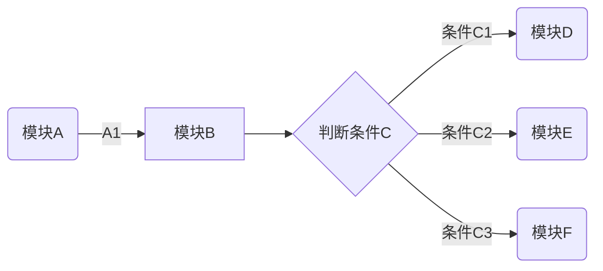
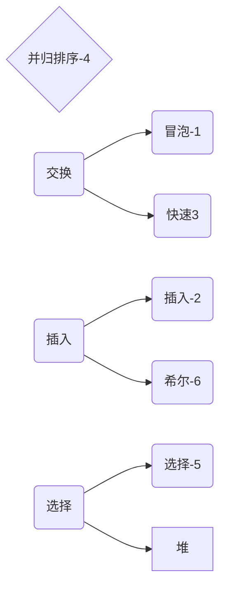
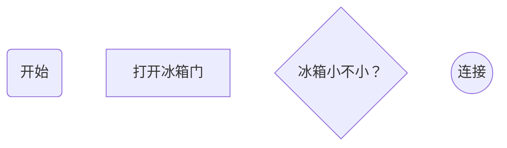
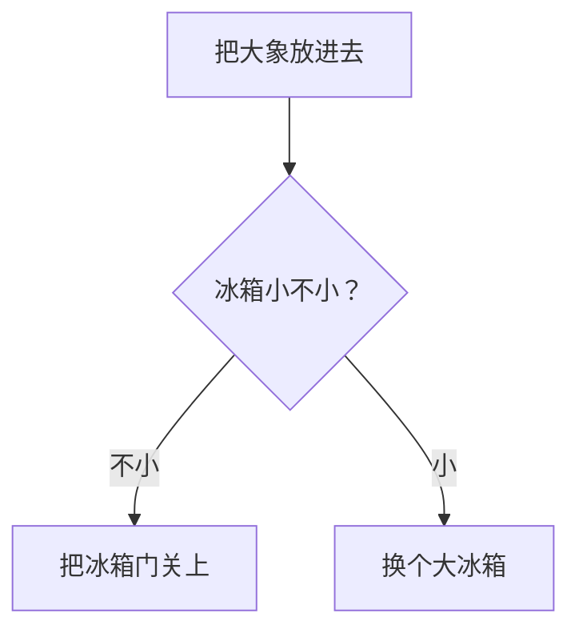
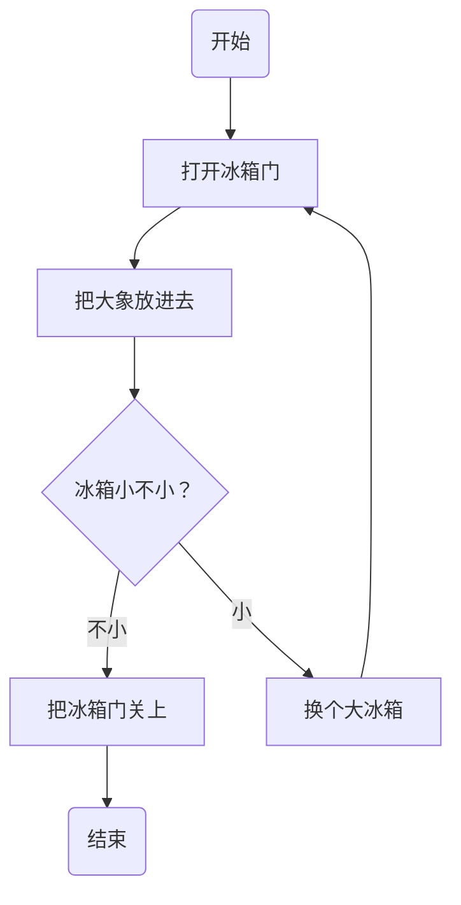
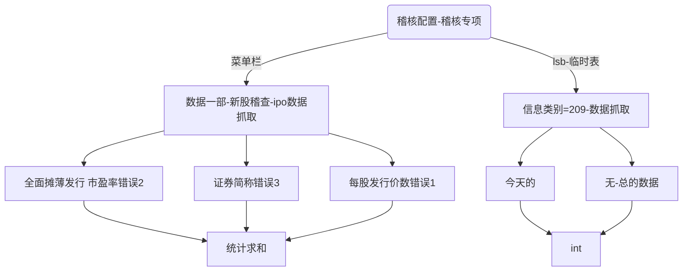

## 1-flowchat- mermaid 画图

消息语句格式为：`<参与者> <箭头> <参与者> : <描述文本>`。

其中 `<箭头>` 的写法有：

- `->>`：显示为实线箭头（主动发出消息）
- `-->>`：显示为虚线箭头（响应）
- `-x`：显示为末尾带「X」的实线箭头（异步消息）

```
tu 
graph图
mermaid美人鱼

```


```
​```mermaid
graph LR
A(模块A) -->|A1| B[模块B]
B --> C{判断条件C}
C -->|条件C1| D(模块D)
C -->|条件C2| E(模块E)
C -->|条件C3| F(模块F)
​```
```

**例一**



**例二**




**例三**




**例三-2**

> TB（Top Bottom）表示从上向下布局，另外三种是
> BT
> LR（Left Right）
> RL




**例三-3**



## 手册

**MinDoc 中 mermaid 图表是以`mermaid ` 开始的代码块。**

## 流程图

### 图表方向

Mermaid 支持多种图表的方向，语法如下：

```
graph 方向描述
    图表中的其他语句...
```

其中“方向描述”为

| 用词 | 含义     |
| :--- | :------- |
| TB   | 从上到下 |
| BT   | 从下到上 |
| RL   | 从右到左 |
| LR   | 从左到右 |


### 节点定义

即流程图中每个文本块，包括开始、结束、处理、判断等。Mermaid 中每个节点都有一个 id，以及节点的文字。

| 表述       | 说明           |
| :--------- | :------------- |
| id[文字]   | 矩形节点       |
| id(文字)   | 圆角矩形节点   |
| id((文字)) | 圆形节点       |
| id>文字]   | 右向旗帜状节点 |
| id{文字}   | 菱形节点       |

需要注意的是，如果节点的文字中包含标点符号，需要时用双引号包裹起来。

### 节点间的连线

| 表述     | 说明           |
| :------- | :------------- |
| >        | 添加尾部箭头   |
| -        | 不添加尾部箭头 |
| –        | 单线           |
| –text–   | 单线上加文字   |
| ==       | 粗线           |
| ==text== | 粗线加文字     |
| -.-      | 虚线           |
| -.text.- | 虚线加文字     |


## 模仿mermaid-ipo





## 2-流程图-Flow

flow 流程图分为两部分，定义节点和控制走向。


**定义节点**

```
open=>start: Open:>https://github.com/knsv/mermaid
// 格式
tag=type: content:>url
```

- tag 节点名称，是流程图中的标签，在第二段连接元素中使用
- type 节点类型(标签类型)
  - start 开始节点
  - 
  - end 结束节点
  - operation 操作节点
  - subroutine 子程序节点
  - condition 条件节点
  - inputoutput 输入或产出节点
- content 节点描述（文本框中的描述内容，冒号与文本之间一定要有空格）
- url 超连接，与文本绑定（点击可以跳转url指定页面）


**关联节点**


用 `->`来关两个节点，如果是 `condition`节点将会有 `yes`和 `no`两个分支。

```sql
open->userInput->processes->results
results(yes)->end
results(no)->regis
```

注: 暂时发现 condition 只能有`yes`or `no`两种条件。如果有其他方法请留言。


```
st=>start: 开始
e=>end: 结束
op=>operation: 1+1>=2
sub1=>subroutine: 子程序
cond=>condition: Yes or No?

下图一：

open=>start: Open:>https://github.com/knsv/mermaid
    userInput=>inputoutput: 请输出
    processes=>operation: 过程
    results=>condition: Yes or No?
    regis=>condition: GoSignUp,Yes or No?
    userr=>operation: SignUp
    end=>end: End
    open->userInput->processes->results
    results(yes)->end
    results(no)->regis
    regis(yes)->userr
    regis(no)->userInput
    
下图二：

​```flow
st=>start: Start
op=>operation: Your Operation
cond=>condition: Yes or No?
e=>end
st->op->cond
cond(yes)->e
cond(no)->op
​```

下图三：
获取待爬取商品id，爬取代理，爬取评论，情感分析

​```flow
st=>start: Start|past:>http://www.google.com[blank]
e=>end: End:>http://www.google.com
op1=>operation: get_hotel_ids|past
op2=>operation: get_proxy|current
sub1=>subroutine: get_proxy|current
op3=>operation: save_comment|current
op4=>operation: set_sentiment|current
op5=>operation: set_record|current

cond1=>condition: ids_remain空?
cond2=>condition: proxy_list空?
cond3=>condition: ids_got空?
cond4=>condition: 爬取成功??
cond5=>condition: ids_remain空?

io1=>inputoutput: ids-remain
io2=>inputoutput: proxy_list
io3=>inputoutput: ids-got

st->op1(right)->io1->cond1
cond1(yes)->sub1->io2->cond2
cond2(no)->op3
cond2(yes)->sub1
cond1(no)->op3->cond4
cond4(yes)->io3->cond3
cond4(no)->io1
cond3(no)->op4
cond3(yes, right)->cond5
cond5(yes)->op5
cond5(no)->cond3
op5->e
```

**例子1**


```flow
open=>start: Open:>https://github.com/knsv/mermaid
    userInput=>inputoutput: 请输出
    processes=>operation: 过程
    results=>condition: Yes or No?
    regis=>condition: GoSignUp,Yes or No?
    userr=>operation: SignUp
    end=>end: End
    open->userInput->processes->results
    results(yes)->end
    results(no)->regis
    regis(yes)->userr
    regis(no)->userInput
```


**例子2**


```flow
st=>start: Start
op=>operation: 你的操作
cond=>condition: Yes or No? 
e=>end: 结束

st->op->cond
cond(yes)->e
cond(no)->op
```


**例子3**


```flow
st=>start: Start|past:>http://www.google.com[blank]
e=>end: End:>http://www.google.com
op1=>operation: get_hotel_ids|past
op2=>operation: get_proxy|current
sub1=>subroutine: get_proxy|current
op3=>operation: save_comment|current
op4=>operation: set_sentiment|current
op5=>operation: set_record|current

cond1=>condition: ids_remain空?
cond2=>condition: proxy_list空?
cond3=>condition: ids_got空?
cond4=>condition: 爬取成功??
cond5=>condition: ids_remain空?

io1=>inputoutput: ids-remain
io2=>inputoutput: proxy_list
io3=>inputoutput: ids-got

st->op1(right)->io1->cond1
cond1(yes)->sub1->io2->cond2
cond2(no)->op3
cond2(yes)->sub1
cond1(no)->op3->cond4
cond4(yes)->io3->cond3
cond4(no)->io1
cond3(no)->op4
cond3(yes, right)->cond5
cond5(yes)->op5
cond5(no)->cond3
op5->e
```


##   3-图标题-sequence

```
这里使用了Typora 这款极简的MarkDown编辑器，还集成了非常多的扩展。
大体上分为四类：
```

- 标题：sequence 图标题。
- 注释：对参与构成序列图成员的描述，这里有三种，1 在成员左边，2在成员右边，3悬浮在成员体上。
- 流向(箭头)：定义序列的方向，有虚线，实线，空箭头和黑体箭头。
- 成员：定义参与的成员。


**标题**

使用title关键字输入冒号（英文状态下）和 标题内容即可。

示例：

```
​```sequence
title: MarkDown 画sequence图
participant finefine as ff
participant kunkun as kk
ff-->kk: this is kunkun?
kk-->ff: yes!
​```
```


```sequence
title: MarkDown 画sequence图
participant finefine as ff
participant kunkun as kk
ff-->kk: this is kunkun?
kk-->ff: yes!
```


**注释**

使用note 关键字表明注释，left of、right of、over 表明注释的位置。

left of

示例：

```
​```sequence
title: 注释演示
participant A
note left of A: note 在A左边
​```
```

```sequence
title: 注释演示
participant A
note left of A: note 在A左边
```


right of

示例：

```
​```sequence
title: 注释演示
participant A
note right of A: note 在A右边
​```
```

```sequence
title: 注释演示
participant A
note right of A: note 在A右边
```

over

示例：

```
​```sequence
title: 注释演示
participant A
note over A: note 
浮在A上
​```
```

```sequence
title: 注释演示
participant A
note over A: note 浮在A上
```

over 还可以同时浮在两个成员上

示例：

```
​```sequence
title: 注释演示
participant A
participant B
note over A,B: note 浮在A和B上
​```
```

```sequence
title: 注释演示
participant A
participant B
note over A,B: note 浮在A和B上
```

over 跨过中间成员

示例：

```
​```sequence
title: 注释演示
participant A
participant B
participant C
participant D
note over A,D: note 跨过BC
​```
```


```sequence
title: 注释演示
participant A
participant B
participant C
participant D
note over A,D: note 跨过BC
```

**流向**

"-"表示实线，"--"表示实线，">"表示黑体箭头，">>"表示空心箭头。

1. "-->>"

示例：

```
​```sequence
title: 流向演示
participant A
participant B
A-->>B: 虚线空心演示
​```
```

```sequence
title: 流向演示
participant A
participant B
A-->>B: 虚线空心演示
```


1. "-->"

示例：

```
​```sequence
title: 流向演示
participant A
participant B
A-->B: 虚线实心演示
​```
```


```sequence
title: 流向演示
participant A
participant B
A-->B: 虚线实心演示
```

1. "->>"

示例：

```
​```sequence
title: 流向演示
participant A
participant B
A->>B: 实线空心演示
​```
```

```sequence
title: 流向演示
participant A
participant B
A->>B: 实线空心演示
```

1. "->"

示例：

```
​```sequence
title: 流向演示
participant A
participant B
A->B: 实线实心演示
​```
```


```sequence
title: 流向演示
participant A
participant B
A->B: 实线实心演示
```

**成员**

使用 participant 可定义成员，使用as 可以为成员定义别名。

participant

示例：

```
​```sequence
title:成员定义
participant Client
​```
```


```sequence
title:成员定义
participant Client
```

participant 和 as，使用as 的目的是为了简写成员

示例：

```
​```sequence
title:定义成员
participant finefine as ff
participant kunkun as kk
ff->kk: say hello 
ff->ff: say hello to my self
​```


```


```sequence
title:定义成员
participant finefine as ff
participant kunkun as kk
ff->kk: say hello 
ff->ff: say hello to my self
```

**Sequence实战（ 按顺序排好）**

这里使用sequence 画一个Token 原理图，token 校验的原理，这里简单说一下，客户端使用密码和用户名登录，如果服务端认证成功，则会返回token，下次客户端去请求数据时，只需携带token即可通过安全认证从而获取所需的数据。（参与者participant）

```
​```sequence
title: Token Valid logic
participant Client as C
participant Server as S
C->S: 1.login with username and password
S->C: 2.response with token and something
note left of C: such as Android App、IOS\n App and so on.
note right of S: supply Api Service
C->S: 3.request data with token
S->C: 4.response with data
note right of S: if token is valid then return\n the data that Client needed
note over C,S: This is the Token principle
​```


​```sequence
title: 计算机自学路线图
participant 数学基础&专业基础理论 as C
participant 编程语言&实用技术 as S
C->S: 1.高等数学；离散数学；线性代数；概率统计
S->C: 2.C/C++;Java/C#;Python;JavaScript
note left of C: 0基础
note right of S: 深入钻研
C->>S: 并行学习
S->>C: 并行学习
C->S: 3.数据结构与算法;计算机组成原理;操作系统;计算机网络
S->C: 4.各种流行的开发框架和工具
note right of S: 人工智能；图形图像；云计算；物联网
note over C,S: 特定技术领域
​```


```

```sequence
title: Token Valid logic
participant Client as C
participant Server as S
C->S: 1.login with username and password
S->C: 2.response with token and something
note left of C: such as Android App、IOS\n App and so on.
note right of S: supply Api Service
C->S: 3.request data with token
S->C: 4.response with data
note right of S: if token is valid then return\n the data that Client needed
note over C,S: This is the Token principle
```


## 模仿-sequence

```sequence
title: 计算机自学路线图
participant 数学基础&专业基础理论 as C
participant 编程语言&实用技术 as S
C->S: 1.高等数学；离散数学；线性代数；概率统计
S->C: 2.C/C++;Java/C#;Python;JavaScript
note left of C: 0基础
note right of S: 深入钻研
C->>S: 并行学习
S->>C: 并行学习
C->S: 3.数据结构与算法;计算机组成原理;操作系统;计算机网络
S->C: 4.各种流行的开发框架和工具
note right of S: 人工智能；图形图像；云计算；物联网
note over C,S: 特定技术领域
```


## 参考文献

༄྄ེིོུ平常ཉ྄ིོུ༄:
https://www.cnblogs.com/nanqiang/articles/8244309.html

༄྄ེིོུ平常ཉ྄ིོུ༄:
https://www.iminho.me/wiki/docs/mindoc/mermaid.md