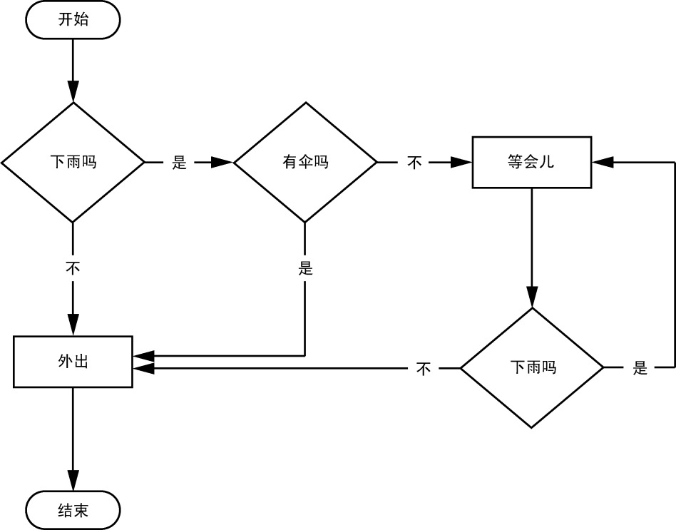
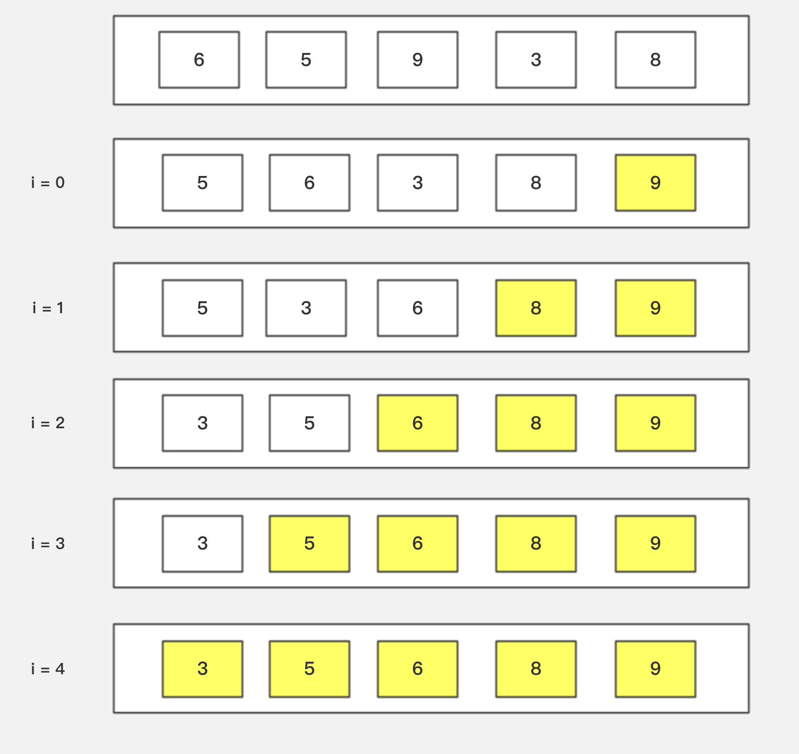
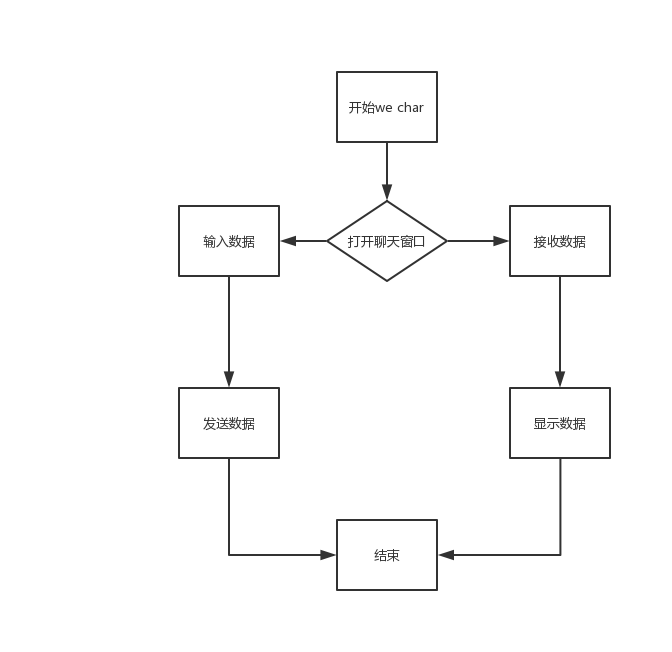
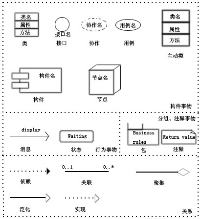
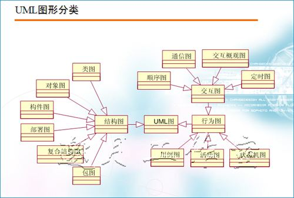
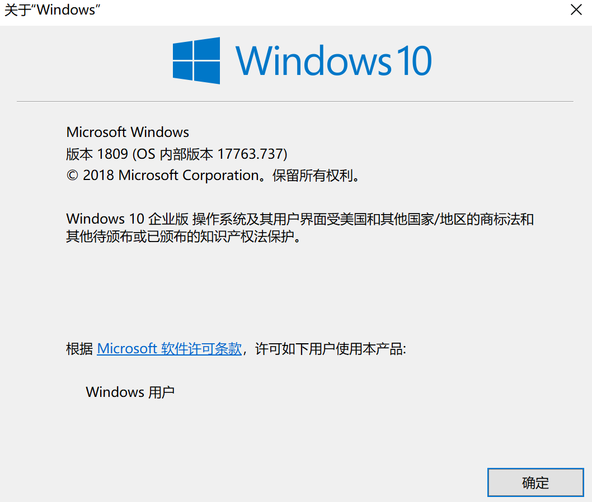
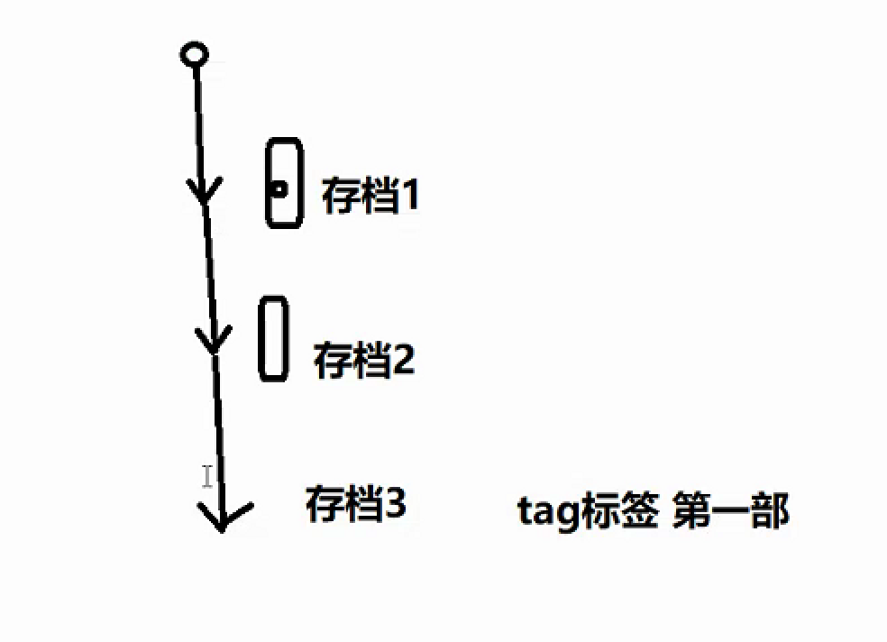
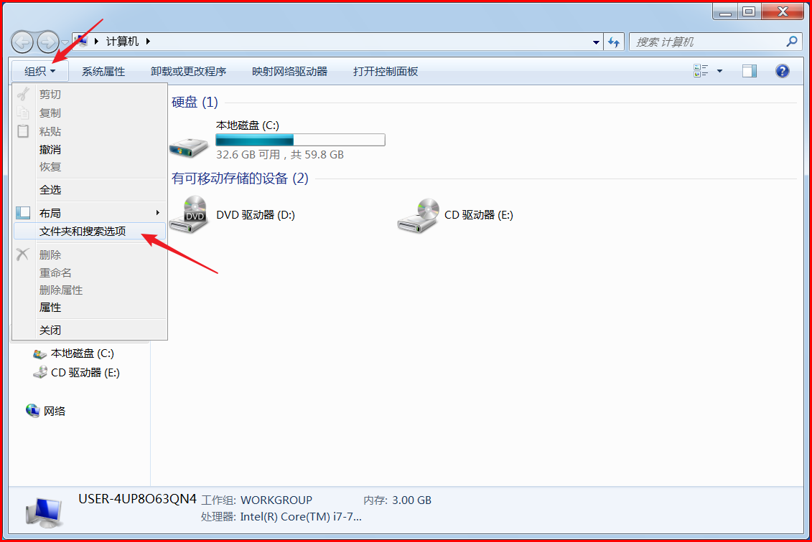
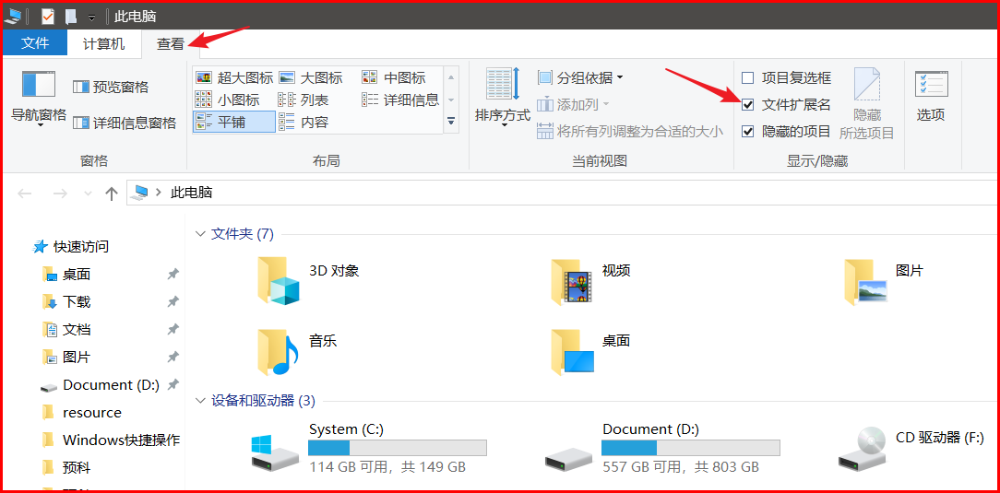

---

layout: post
title: "软件操作-process流程图 -思维导图xmind"
date: 2019-07-18
tag: tool
---

## process流程图

> ​	项目思路
>
> 用软件可以走下来，说明可以做；
>
> 如果不能写出 完整项目流程图，则做不出，待考虑
>
> ## 画图  
>
> - paint
> - draw





**冒泡**




资料：processon官方手册

目的：绘制聊天流程图

def：流程是一项活动或一系列连续有规律的事项或行为进行的程序。
也可以把流程理解为为了一定的目的去做事情的顺序。 

**流程的六个主要特性:** 

整体性 •流程一般是由多个部门或岗位共同完成的。

连续性 •从起点到终点，包括多个业务活动,涉及多个工作步骤，流程开始是 信息的输入,流程结果是信息的输出或存储。 

目标性 •所有流程的设计初衷必须有明确的目的和服务对象。 

层次性 •从公司整体到各部门再到各岗位，流程可以按层级划分。 

动态性 •流程归口部门应该根据企业需要动态及时调整甚至重新设计流程。

重复性 •工作具有重复性的较关键的工作内容。

直观性 •通过流程可以直观的了解管理活动的步骤、责任人、输入输出等信息。


**符号：**

| **符号**                 | **名称**                        | **意义**                                   |
| ------------------------ | ------------------------------- | ------------------------------------------ |
| 六边形                   | 准备作业 Start                  | 流程开始                                   |
| 矩形                     | 处理Process                     | 处理程序                                   |
| 菱形                     | 决策Decision                    | 不同方案的决策                             |
| 环形类似于操场           | 结束END                         | 流程图结束                                 |
| 箭头                     | 路径Path                        | 指示路径方向                               |
| 矩形少一个角             | 文件Document                    | 输入或输出文件                             |
| 矩形中间来两个竖线       | 已定义处理(Predefined Process） | 使用某一已定义之处理程序                   |
| 一个圆 一个五角形        | 连接Connector                   | 流程图向另一流程图之出口或从另一地方之入口 |
| 一个横线一个矩形都输虚线 | 批注(Comment)                   | 表示附注说明之用                           |
|                          |                                 |                                            |


详情页

数量

购物车

下单

收货人 

支付


聊天流程图：





## Xmind

**快捷键**

- alt+方向键
- 回车 enter 新增/新增同级分支
- tab 子分支/新增子级分支
- 方向键
- 空格-内容编辑
- 切换顺序: Alt + 方向键


**网络**

资料：幕布官方手册学习、xmind

目的：tcp ip思维导图


**1.什么是网络:**

定义：辅助设备连接的工具
使用网络的目的：数据的共享


**2.网络协议的诞生TCP/IP协议族**

​	tcp/ip 是一套互联网的标准协议  tcp/ip协议族
​	网络模型：
​	    实际用四层模型：
​	        网络接口层        物理层
​	                        数据链路层
​	        网际层
​	        传输层
​	        应用层           会话层
​	                        表示层
​	                        应用层
​	


**3.ip地址**

​    地址：用来标记一个位置
​	ip地址干嘛用的：一个ip对应互联网当中唯一一台联网的设备
​	分类：ipv4
​	       A B C D E

**4.端口号**

```
端口号干嘛用的：标识网络通讯的应用程序 一个应用程序会有一个独立的端口号
端口号的范围：0-65535
端口号的分类：
    知名端口号：80端口 web服务端口 22 ssh端口
        范围：0-1024
    动态端口号：
        1025-65535
        建议使用3000以上端口号
```

**5.udp,tcp属于传输层协议**

```
udp特点：负责发送数据，不关心数据是否送达， 对于网络环境依赖较大，传输速度快，传输数据有大小限制64k，数据传输不安全，无序
        用在聊天软件
tcp特点：
    传输数据前 要保证双方都能连接成功 传输速度慢 数据传输大小没有明确限制，数据传输安全，有序


三次握手：
建立连接 三次握手

ACK：确认标志
SYN：同步标志
第一次握手：主机A发送位码为syn＝1,随机产生seq number=1234567的数据包到服务器，主机B由SYN=1知道，A要求建立联机；

第二次握手：主机B收到请求后要确认联机信息，向A发送ack number=(主机A的seq+1),syn=1,ack=1,随机产生seq=7654321的包

第三次握手：主机A收到后检查ack number是否正确，即第一次发送的seq number+1,以及位码ack是否为1，若正确，主机A会再发送ack number=(主机B的seq+1),ack=1，主机B收到后确认seq值与ack=1则连接建立成功。

完成三次握手，主机A与主机B开始传送数据。
```

​			

tcp/ip协议：


## 原型图

process的工具


## UML

> 分类: [Java](https://www.cnblogs.com/virgree/category/775920.html)
>
> 标签: [UML](https://www.cnblogs.com/virgree/tag/UML/)

```
统一建模语言（英语：Unified Modeling Language，缩写 UML）是非专利的第三代建模和规约语言。UML是一种开放的方法，用于说明、可视化、构建和编写一个正在开发的、面向对象的、软件密集系统的制品的开放方法。UML展现了一系列最佳工程实践，这些最佳实践在对大规模，复杂系统进行建模方面，特别是在软件架构层次已经被验证有效。
```







**画图说明**

UML(统一建模语言)：是面向对象的可视化建模的一种语言。是数据库设计过程中，在E-R图（实体-联系图）的设计后的进一步建模。
UML中有3种构造块：事物、关系和图，事物是对模型中最具有代表性的成分的抽象；关系是把事物结合在一起；图聚集了相关的的事物。具体关系图标如下：


说明：
构件事物是名词，是模型的静态部分。
行为事物是动态部分，表示行为。
分组事物是组织部分。
注释事物是解释部分。

* 依赖：一个事物变化会引起另一个事物变化。
* 聚集：特殊的关联，描述整体与部分的组合关系。
* 泛化：是一种特殊与一般的关系，如子元素（特殊）与父元素（一般），箭头指向父元素。
* 实现：类元之间的关系，其中一个类元指定了由另一个类元保证执行的契约。一般用在接口和实现他们的类之间或用例和实现它们的协作之间。

UML提供9种视图：类图、对象图，用例图，序列图、协作图，状态图、活动图，构件图和部署图。


在UML系统开发中有三个主要的模型：

- 功能模型: 从用户的角度展示系统的功能，包括用例图。
- 对象模型: 采用对象，属性，操作，关联等概念展示系统的结构和基础，包括类图。
- 动态模型: 展现系统的内部行为。 包括序列图，活动图，状态图。


## 组织结构图


## BPMN

> ​	BPMN:业务流程建模与标注，包括这些图元如何组合成一个[业务流程图](https://baike.so.com/doc/5399955-5637517.html)(Business Process Diagram);讨论BPMN的各种的用途，包括以何种精度来影响一个流程图中的模型;BPMN作为一个标准的价值，以及BPMN未来发展的远景。


## 软件使用02

<u>**浏览器**</u>

**网页浏览器**（英语：web browser），常被简称为**浏览器**，是一种用于检索并展示[万维网](https://zh.wikipedia.org/wiki/%E5%85%A8%E7%90%83%E8%B3%87%E8%A8%8A%E7%B6%B2)信息资源的[应用程序](https://zh.wikipedia.org/wiki/%E6%87%89%E7%94%A8%E7%A8%8B%E5%BC%8F)。这些信息资源可为网页、图片、影音或其他内容，它们由[统一资源标志符](https://zh.wikipedia.org/wiki/%E7%B5%B1%E4%B8%80%E8%B3%87%E6%BA%90%E6%A8%99%E8%AA%8C%E7%AC%A6)标志。信息资源中的[超链接](https://zh.wikipedia.org/wiki/%E8%B6%85%E9%80%A3%E7%B5%90)可使用户方便地浏览相关信息。

网页浏览器虽然主要用于使用万维网，但也可用于获取[专用网络](https://zh.wikipedia.org/wiki/%E4%B8%93%E7%94%A8%E7%BD%91%E7%BB%9C)中[网页服务器](https://zh.wikipedia.org/wiki/%E7%B6%B2%E9%A0%81%E4%BC%BA%E6%9C%8D%E5%99%A8)之信息或[文件系统](https://zh.wikipedia.org/wiki/%E6%AA%94%E6%A1%88%E7%B3%BB%E7%B5%B1)内之文件。

对于浏览器都不陌生，上网的必需品。
这里主要给大家介绍的浏览器的内核，这是浏览器最核心的部分。

浏览器内核：

- Trident（IE内核）
  - IE 浏览器
  - 猎豹浏览器
  - 360安全浏览器（兼容模式）
  - 傲游浏览器
  - 2345 浏览器
  - 等等
- Gecko（Firefox内核）
  - FireFox
  - Iceweasel
  - Netscape
- Webkit（Chrome内核，Safari内核）
  - Chrome
  - Safari
  - UC
  - 搜狗
  - 安卓默认浏览器
- Presto（Opera 内核）
  - Opera
  - Nokia 770
- Blink（Google + Opera）
  - chrome
  - 360 极速浏览器（极速模式）
  - 猎豹浏览器
  - 搜狗浏览器
  - UC
  - 等等
- Servo（Mozilla + Samsung）开发中

------

**截图**

> 别老用 【QQ】 或 【微信】截图了！！！

- [FastStone Capture](http://www.pc6.com/softview/SoftView_14254.html) （随用随开，小巧实用）
- [Snipaste](http://zh.snipaste.com/)（功能强大，推荐）

------

**录屏**

- [Bandicam](http://www.bandicam.cn/) 大众高清，占用空间小
- [Fraps](http://www.fraps.com/) 超清，适合游戏，占用空间大
- [FSCapture](http://www.pc6.com/softview/SoftView_14254.html) 简单，画质一般，小巧实用

------

**命令行工具**

- [Cmder](https://cmder.net/) （功能强大，实用系数高)
- [Git Bash](https://git-scm.com)（版本库管理使用）

------

**软件卸载**

> 软件卸载并非只是 右键删除就可以的。
> 一般你删除的只是软件的快捷方式

正确的卸载软件方式：

1. 按住 `win + R`
2. 输入 `control`
3. 点选 `程序和功能`
4. 双击 要卸载的软件
5. 根据提示 步骤进行卸载即可

> Windows 环境下，想要卸载彻底，还需要清理注册表。
> 这里推荐 [CCleaner 清理工具](https://www.ccleaner.com/ccleaner)

------

**Windows 基本快捷键操作**

| 1.windows                             | 描述                             |
| ------------------------------------- | -------------------------------- |
| Win + E                               | 我的电脑                         |
| Win + R                               | 运行框                           |
| Win + L                               | 锁屏                             |
| <u>Win + D</u>                        | 显示 / 隐藏 桌面                 |
| Win + T（这个类似于 alt+ tab）        | 快速切换任务栏                   |
| <u>Win + 方向键</u>                   | <u>快速调整窗口（分屏显示）</u>  |
| win+ 上 变大全屏                      |                                  |
| win+下 变下，最小化                   |                                  |
| win+左  是分屏                        |                                  |
| win+右 右边分屏                       |                                  |
| Win + 数字                            | 快速打开任务栏程序，1 代表最左边 |
| 1开始 2. 小娜 3.视图 ；4 ie作为第一个 |                                  |
| Alt + F4                              | 关闭当前程序（包括关机）         |

------

> 如何使用快捷键将 Chrome 浏览器光标定位到地址栏
>
> Windows: Ctrl + L 或 Alt + D 或 F6 
> Mac: Command + L
> Linux: Ctrl + L


**对文件和文件夹进行操作**

| 2.文件夹              | 描述                             |
| ------------------- | -------------------------------- |
| Alt + D             | 定位到地址栏                     |
| enter进入文件夹 |  |
| Alt + 左键          | 查看上一个文件夹                 |
| Alt + 右键          | 查看下一个文件夹                 |
| Alt + 上键（无下键）    | 查看父级文件夹/                  |
| Ctrl + W | 关闭当前窗口 （不包括关机） |
|                      |                             |
| Ctrl + shift + N    | 新建文件夹                       |

用cmd 来运行 ，快捷方式；


```sh

C:\Users\天子>cmd
Microsoft Windows [版本 10.0.17763.737]
(c) 2018 Microsoft Corporation。保留所有权利。

C:\Users\天子>regedit
进入注册表

C:\Users\天子>control
控制面板

C:\Users\天子>notepad
txt

C:\Users\天子>mspaint
画图板；

C:\Users\天子>dxdiag
directx诊断工具

C:\Users\天子>msconfig
系统配置，这儿有 安全引导；正常启动

C:\Users\天子>services.msc
服务

C:\Users\天子>devmgmt.msc
设备管理器 /对设备管理，看看有没有装驱动、运行状态

C:\Users\天子>ncpa.cpl
控制面板\网络和 Internet\网络连接  看一下网络

C:\Users\天子>taskmgr
任务管理器  = 可以看到 进程；性能； 应用历史记录 ；详细信息；服务
在详细信息里面；找到 explorer.exe  pid= 4132  结束任务-> 结束进程 

C:\Users\天子>explorer
如果没有explorer.exe，则运行 这个软件
如果有 则进入我的电脑这个文件夹；

C:\Users\天子>winver
就是信息

```




## **运行框命令**

| 命令                                                | 描述                                                         |
| --------------------------------------------------- | ------------------------------------------------------------ |
| cmd                                                 | 命令提示符                                                   |
| regedit                                             | 注册表([计] 注册表编辑器)                                    |
| control(控制)                                       | 控制面板                                                     |
| calc（The calculator）                              | 计算器                                                       |
| <u>notepad</u>                                      | 记事本                                                       |
| <u>mspaint</u>                                      | 画图                                                         |
| dxdiag（牛p）                                       | 系统硬件信息                                                 |
| msconfig （Microsoft System Configuration Utility） | 启动项（系统配置实用程序）<br />系统配置                     |
| services.msc                                        | 服务                                                         |
| devmgmt.msc                                         | 设备管理器                                                   |
| ncpa.cpl                                            | 网卡配置ifconfig（mac） + ipconfig（win）<br />控制面板\网络和 Internet\网络连接 |
| taskmgr（control（控制）+ option（选项））          | 任务管理器（n）.exe                                          |
| explorer                                            | 资源管理器（）探险家，勘探者                                 |
| winver                                              | 显示 About Windows 窗口                                      |

------

**<u>浏览器</u>快捷按键**

> Chrome 常用 / 国产浏览器 基本支持

| 快捷键                                                   | 描述                                       |
| -------------------------------------------------------- | ------------------------------------------ |
| Ctrl + R                                                 | 刷新                                       |
| Alt + F4                                                 | 关闭浏览器                                 |
| Ctrl + W（这个好用啊）                                   | 关闭当前窗口                               |
| <u>Ctrl + Shift + T（恢复 ）</u> （command+ t 就是新建） | 重新打开最后关闭的标签页，并跳转到该标签页 |
| <u>ctrl+h  历史</u>                                      | 查看历史                                   |
| Ctrl + N（另外打开一个窗口）                             | 打开新窗口                                 |
| Ctrl + T                                                 | 打开新的标签页                             |
| Ctrl + F                                                 | 本页面搜索                                 |
| Ctrl + Tab（control +tab==mac跳）                        | 跳转到下一个标签页                         |
| Alt + 左方向键                                           | 历史记录上一页                             |
| Alt + 右方向键                                           | 历史记录下一页                             |
| Ctrl + Shift + B                                         | 显示 / 隐藏书签栏                          |
| <u>Alt + D（command+L）</u>                              | 跳转到地址栏                               |
| Ctrl + D                                                 | 将当前网页保存为<u>书签</u>                |
| Ctrl + + （command +）                                   | 放大网页上的所有内容                       |
| Ctrl + -                                                 | 缩小网页上的所有内容                       |
| Ctrl + 0                                                 | 将网页上的所有内容恢复到默认大小           |
| Ctrl + 点击链接                                          | 在新的后台标签页中打开链接                 |
| F11（control+command+f）                                 | 网页全屏                                   |
| Ctrl + U（option + command +u）                          | 查看源码                                   |
| Ctrl + Shift + I                                         | 打开调试工具（检查）                       |

------





**文件扩展名**

> <u>绝大多数的文件名字格式</u>：`文件名.扩展名`

**命名要求**

- 文件名要求：(也适用于 文件夹)
  - 不能包含以下字符：`/ \ | : ? * " < >`
- 扩展名要求:
  - 不能包含以下字符：`/ \ | : ? * " < >`

> 文件 可以没有扩展名
>
> 文件夹名 不需要扩展名(后缀)

**开启/隐藏扩展名**

> Win 7



Win 7




> Win 10


## xyz域名

top，vip，xyz，cx，ws，in这几个域名哪个后缀比较好？

> ​	.xyz是互联网域名系统的通用顶级域，由ICANN的新通用顶级域名计划提出。受互联网和域名自身的无限潜力启发（例如，其自身较短且富有创意；由三个连续英文字母组成，十分直观），该域名试图代表下一代互联网“XYZ”——即包含了X世代、Y世代和Z世代的全球社群，通过新的方式向全球人类提供新的交流平台。
>
> > 	从建站数量上：Alexa全球前一百万网站排名中，.xyz有2400多个，相比任何其他新顶级域名后缀要高出至少1000多个。
> > 从建站质量上：除了众所周知的谷歌母公司Alphabet的abc.xyz，重量级的 .xyz数量繁多，例如德勤（世界四大会计师事务所之一）的 Exponentials.xyz、FutureFin.xyz、麻省理工（工程学世界第一、计算机科学世界第二的大学）的Engine.xyz、Skype创始人的Starship.xyz、HBO电视网（占据美国付费电视频道90%的份额，也是著名的《权力的游戏》电视剧的制作方）的Hooli.xyz。以及获520万美元投资的Umake.xyz，获400万美元投资的Practice.xyz等等，更多案例可以访问gen.xyz/live。
> > 从域名健康上：根据域名滥用统计网站Spamhaus数据显示，.xyz的滥用指数分仅为0.91分，而滥用指数分最高的 .gdn 为8.34。说明 .xyz的滥用率极低，健康度非常高。
> > 从本身含义上：XYZ作为字母表最后三个字母，令人过目不忘，且全球熟知。字母表以xyz结束，域名以.xyz结尾同样流畅自然。XYZ是三个声母也是辅音，例如在汉语拼音中可以拼成小宇宙、下一站、幸运者、小燕子、新宇宙等等，在其他语言中的组合数不胜数；正如X、Y和Z也代表着空间的三个维度，X轴、Y轴、Z轴，.XYZ域名包罗万象，寓意无限种。
> > 更多更新的信息推荐访问.xyz官方平台：
> >
> > 中文官网：www.gen.xyz/cn/blog
> > 知乎/新浪微博/微信公众号/今日头条：ID统一为 XYZ网站域名
> > 或者使用VPN访问 Instagram, Twitter, Facebook，ID统一为 xyz


<u>**.top**</u>

> ​	.top是由江苏邦宁科技有限公司负责运营管理的一个新通用顶级域名，[1]于2014年11月18日开放注册，[2]并于2015年4月14日获得中华人民共和国工业和信息化部批复。[3]“top”在英语中是“顶端”的意思。截止2018年9月，.top域名的注册量达到320万


**网络**

.com国际

只是一个称呼，备案的；不分大小写的；

- .cn
- .top
- .cn
- .net
- .com.cn 
- Io


## 翻墙啦

> ​	
>
> **<u>翻墙</u>**
>
> - shadowsocket小飞机
> - vpn   蓝灯
>
> 

官网

https://www.qingyuno.com/user

推荐朋友： 
https://www.qy1a.xyz/auth/register?code=fib

用户中心：
可以选择（套餐等级）商店，购买；
可以选择（余额）充值，2元；
苹果电脑：ShadowsocksX-NG-R8 ；vip2 可以用ShadowsocksX-NG；
微软电脑：
SSRR - [ 全部套餐都可以使用 ]7m；一半用这个比较好
SSR - [ 全部套餐都可以使用 ]829k；
SSTap - [游戏加速全局模式]3m ； 

**节点选择**

```
aws日本1G口；
方法一：配置二维码：Shadowsocksr；
方法二：配置链接：
ssr://MTMuMjMxLjQuMTkwOjgwOmF1dGhfYWVzMTI4X3NoYTE6Y2hhY2hhMjA6aHR0cF9zaW1wbGU6T1Zwc1dEZzUvP29iZnNwYXJhbT1NekF3WXpnMU5EY3lMbTFwWTNKdmMyOW1kQzVqYjIwJnByb3RvcGFyYW09TlRRM01qcFFjbVJRYW5vJnJlbWFya3M9WVhkejVwZWw1cHlzTVVmbGo2TWdMU0E0TUNEbGpaWG5xNl9sajZNJmdyb3VwPVRHbG5hSFFnWTJ4dmRXUQ


订阅定制：
https://subscription.lightyun.site/link/yAORyVjnSQhHw4rw?sub=1&extend=1


```


邀请说明：
您每邀请1位用户注册：
您会获得20 G流量奖励。
对方将获得2元奖励作为初始资金。
对方充值时您还会获得对方充值金额的 30 % 的返利。
返利不支持提现，仅限于购买套餐使用。


**<u>蘑菇</u>**

https://moguss.us/nodeList

**mac**

- [点击此处](https://www.moguss.us/clients/ShadowsocksX-NG-R8.dmg)下载客户端并启动
- 点击状态栏纸飞机 -> 服务器 -> 编辑订阅
- 点击窗口左下角 “+”号 新增订阅，完整复制本页上方“订阅服务”处地址，将其粘贴至“订阅地址”栏，点击右下角“OK”
- 点击纸飞机 -> 服务器 -> 手动更新订阅
- 点击纸飞机 -> 服务器，选定合适服务器
- 点击纸飞机 -> 打开Shadowsocks
- 点击纸飞机 -> PAC自动模式
- 点击纸飞机 -> 代理设置->从 GFW List 更新 PAC
- 打开系统偏好设置 -> 网络，在窗口左侧选定显示为“已连接”的网络，点击右下角“高级...”
- 切换至“代理”选项卡，勾选“自动代理配置”和“不包括简单主机名”，点击右下角“好”，再次点击右下角“应用”

**windows**

- [点击此处](https://moguss.us/clients/SSTap-beta-setup-1.0.9.7.zip)下载客户端并安装（弹出网卡安装时切记一定要信任勾选安装）
- 打开 SSTap，选择 -> SSR订阅 -> SSR订阅管理，添加订阅地址
- 添加完成后，再次选择 - SSR订阅 - 手动更新SSR订阅，即可同步节点列表。
- 在代理模式中选择仅「网络浏览器(全局)」或「网络浏览器跳过中国站点」，点击「连接」即可加速。
- 需要注意的是，一旦连接成功，客户端会自动缩小到任务栏，可在设置中关闭。


**linux**

[点击此处](https://moguss.us/clients/Shadowsocks-qt5-3.0.1.zip)下载客户端并启动

单击状态栏小飞机，找到服务器 -> 编辑订阅，复制黏贴订阅地址

更新订阅设置即可


**ios翻墙**

1. 打开 Shadowrocket，点击左上角 “[]”号 扫描添加节点
2. 或者点击节点列表长得像（小飞机）这个的按钮直接添加
3. 选定合适服务器节点，点击右上角连接开关，屏幕上方状态栏出现“VPN”图标
4. 当进行海外游戏时请将 Shadowrocket “首页” 页面中的 “全局路由” 切换至 “代理”，并确保“设置”页面中的“UDP”已开启转发


**安卓android**

[点击此处](https://moguss.us/clients/ShadowsocksRR-3.5.1.1.apk)下载客户端并启动

单击左上角的shadowsocksR进入配置文件页，点击右下角的“+”号，点击“添加/升级SSR订阅”，完整复制本页上方“订阅服务”处地址，填入订阅信息并保存

选中任意一个节点，返回软件首页

在软件首页处找到“路由”选项，并将其改为“绕过局域网及中国大陆地址”

点击右上角的小飞机图标进行连接，提示是否添加（或创建）VPN连接，点同意（或允许）


**Games**

[点击此处](https://moguss.us/clients/SSTap-beta-setup-1.0.9.7.zip)下载客户端并安装

打开 SSTap，选择  -> SSR订阅 -> SSR订阅管理，添加订阅地址

添加完成后，再次选择  - SSR订阅 - 手动更新SSR订阅，即可同步节点列表。

在代理模式中选择游戏或「不代理中国IP」，点击「连接」即可加速。

需要注意的是，一旦连接成功，客户端会自动缩小到任务栏，可在设置中关闭。


## 参考文档

```
百度的ai-做机器学习
https://aistudio.baidu.com/aistudio/index


专属邀请链接，通过此链接注册ProcessOn
https://www.processon.com/i/5c75ea3de4b07fada4f54590

UML图中类之间的关系:依赖,泛化,关联,聚合,组合,实现
https://www.cnblogs.com/virgree/articles/5197236.html


UML教程
https://www.w3cschool.cn/uml_tutorial/


蓝灯Windows下载
https://github.com/getlantern/download#%E8%93%9D%E7%81%AFlantern%E6%9C%80%E6%96%B0%E7%89%88%E6%9C%AC%E4%B8%8B%E8%BD%BD
https://getlantern.org/zh_CN/

小飞机
https://moguss.us/

百度云盘；网盘；百度网盘
http://pandownload.com/index.html
```

