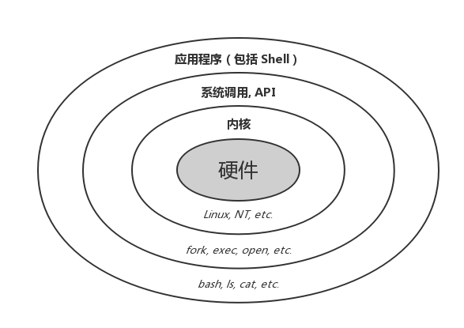

## unix-Mac

```
➜  test-js git:(master) ✗ node --version
v10.16.0
➜  test-js git:(master) ✗ node -v
```


UNIX是一个功能强大、性能全面的多用户、多任务操作系统，可以应用从巨型计算机到普通PC机等多种不同的平台上，是应用面最广、影响力最大的操作系统。 
Linux是一种外观和性能与UNIX相同或更好的操作系统，但，Linux不源于任何版本的UNIX的源代码，并不是UNIX，而是一个类似于UNIX的产品。

Linux是开发源代码的自由软件,UNIX是对源代码实行知识产权保护的传统商业软件.

UNIX系统大多是与硬件配套的,而Linux则可运行在多种硬件平台上.UNIX是商业软件,而Linux是自由软件,免费、公开源代码的.UNIX(5万美圆)而Linux免费
UNIX是命令行下的系统 linux是加了窗体管理的系统
在对硬件的要求上,linux比unix要低,没有unix那么苛刻.在安装上linux比unix容易掌握.

linux与unix系统基本一致,unix各种版本之间也是有差异的,所以linux完全可以看成unix的一种


```
1.linux&macos命令行：主要在苹果机下面执行的 。

service sshd start							 开启服务
 ping 192.168.137.103 						查ip的延迟。
 ssh -p22 xyl@192.168.137.103  用ssh服务端控制客户端
终止目录 control +c 控制
				ctrl+c

2.Linux 下navicat 中文乱码终极解决方案
navicat 也是够了，直接用了个wine包装navicat 成了linux版本的了，对此表示无语
此前有很多人说，要更改startnavicat脚本中的 lang 很明确的说没有成功，因为
根本不是那的事， 是因为wine的事
 解决办法：
安装 文泉驿字体
sudo apt-get install ttf-wqy-microhei  #文泉驿-微米黑
sudo apt-get install ttf-wqy-zenhei  #文泉驿-正黑
sudo apt-get install xfonts-wqy #文泉驿-点阵宋体
然后在设置中 TOOLs option 更改字体为  WenQuanYi Zen Hei Sharp即可解决，其中有三处字体需要更改。

3.用户名和电脑名
xdh@xdh-ThinkPad-T420:~/桌面$ 
当前用户名/计算机的名字/～就是跟着工作目录。

4.终端的软件
dash  mac和liunx
duch  黑色

5.### 安装日志：
/root/install.log: 				存储了系统中的软件包及其 版本信息
/root/install.log.syslog: 存储了安装过程中留下的 事件记录
/root/anaconda-ks.cfg	:以Kickstart配置文件的格式记录过程中设置的 选项信息

6.### 服务器：远程服务器 只能重启（不允许关机）

7.### 虚拟机的小问题：Linux 必须通过挂在之后使用 （是所有的存储设备）
nat：两个一样 无线 vmware
桥接 :独立的网络号  ifconfig eth0 网络地址

​```


```

**2.读写执行权限:**

```
1读写执行权限:
r（read）读
w（write）写
x	执行exe（execute）  --运行文件

2权限：
所属组(g)root：我授权（只有读的权限）
其他人（0）other：不能碰
文件所属者->文件所属组-> 文件的修改时间->文件名

3.文件类型（用ls -l查出的含义）
-二进制文件 r
d目录
l软链接文件

4.通配符的使用：
*			任意个数个字符	
?			一个字符，至少一个
[]		表示匹配其中任意一个
[abc] 匹配a,b,c中
[a-f] 匹配从a到f内

5.# Lamp：支撑互联网的开源技术（补充）

操作系统		linux
服务器			apache Web（可以对html 和 php都友好）
数据库				Mysql 
编译语言				PHP、python、java、c

6.补充
folder 		文件夹
netcraft		网站
skip				 跳过
basic 			基本
local loopback (lo)本地回路
accept 			接受
Config 			配置


7.常见报错
command not found 					命令未找到
no such file or directory  	没有这样的文件或目录

8.linux的类型：
Redhat	 红帽
fedoro
suse 
genloo linux 
红旗Linux
Mandriva
turbo linux

debian
ubuntu  乌班图
knoppix

centos 7
deepin 2G

9.### linux目录（严谨的系统）
bin存放 系统命令
home 数组目录 ；tmp 临时目录 做练习的时候在这里面
lib 函数库保存位置
dev 设备文件保存目录
etc 配置文件保存位置
media 媒体设备   ； mnt u盘；  misc nfs服务；这三个都是挂载目录
var 动态保存目录，日志，邮件
usr: 不是user，是Uinx Software Resource=Unix系统软件资源目录，占用的内存目录


```

**3.目录处理命令：**

```
1目录处理命令：ls
执行权限为所有用户
ls -l（lang）		详细信息显示
ls -a 	（add）	查看隐藏
ls  -d （ document）查看目录属性
ls -h (help)人性化的查找,配合-l -hl（-lh） 显示文件大小
ls -i		19714802 404.html
ls -r		tags.htmlls


1.2目录处理命令：mkdir
make directiries	做目录
mkdir -p [目录名]  创建新目录，-p递归创建
	mkdir 1								可以
 mkdir -p sad/2 				可以
 mkdir -p ddsd1/d32d2/d 可以
  mkdir  1/2/d  1/2/c 前提 1/2 存在
 mkdir -p /ddsd1/d32d2/d 不可以
 mkdir /1/2/3 删除空目录
 
1.3目录处理命令：pwd
（显示当前目录Print Working Directory）

1.4目录处理命令：cp
copy 拷贝（复制文件或者目录）
cp -rp[原文件或者目录][目标目录]
	-r	复制目录
	-p 保留文件属性（很不错）（拷贝）
cp /Users/ti/Desktop/今日收获.md   /Users/ti/Desktop/lianxi\js.md
就会出现lianxijs.md 

1.5目录处理命令：mv
mv move [原文件的绝对路径][目标路径] 剪切文件 改名
mv /tmp/ja/longze /root/ns  					两个名字不同就是改名

1.6目录处理命令：r m
remove 删除(搬家)
-rf [文件或目录]  
-r 是删除目录  -f 是强制执行 （false)
例子： rm /tmp/
rm 	/Users/tianzi/Desktop/lianxijs.md  				成功
rm -rf 	/Users/tianzi/Desktop/lianxi\ /d2dsd1 	成功

2文件处理命令：touch（创建空文件）
touch 'sd sd'  创建一个sd sd的文件。 但是对他查找一定要‘' 。
 
 3
 ifconfig网络接口配置
ls / 根目录的列表显示
df 显示文件系统的磁盘使用情况统计
Filesystem    512-blocks    
```

**4.计算机大小（科普）**

| 单位          | 含义                                          |
| ------------- | --------------------------------------------- |
| 字节B（Byte） | 在计算机中作为一个数字单位，一般为8位二进制数 |
| 千Kibi-byte   | 1k，千字节                                    |
| 兆Mebi-byte   | 1m，百万字节                                  |
| 千兆Giga-     | 1g，千兆字节                                  |
| 太T           |                                               |
| 拍P           |                                               |
| 艾E           |                                               |
| 泽Z           |                                               |
| 尧Y           | 一亿亿字节                                    |
|               |                                               |

   

**5.Linux命令**

| 列表1                                                        |                  |
| ------------------------------------------------------------ | ---------------- |
| ls =list                                                     | 查看文件夹下内容 |
| pwd= print wor directory                                     | 确认工作的文件夹 |
| clean                                                        | 清屏             |
| ~.~                                                          | -.-              |
| cd = change directory+路径                                   | 切换文件夹       |
| touch摸+文件名（参数）                                       | 新建文件         |
| mkdir+文件夹（参数）                                         | 新建文件夹       |
| rm=remove +文件名                                            | 删除文件         |
| re（命令command） -r(带-为选项options) +文件夹（参数paramaster） | 删除文件夹       |
|                                                              |                  |

**命令2**

| 目标-列表2          |                         |
| ------------------- | ----------------------- |
| ls                  | 查看目录内容            |
| cd                  | 切换目录                |
| touch  mkdir rm     | 创建文档 目录 和删除    |
| cp mv               | 拷贝和移动              |
| cat more grep       | 查看文件内容            |
| echo    重定向>和>> | 以及管道 \| (end上面的) |
|                     |                         |

**基本命令**

进入目录 cd

查看目录中的文件 ls

查看文件 cat

**什么是管道符**

```
“|”是管道命令操作符，简称管道符。利用Linux所提供的管道符“|”将两个命令隔开，管道符左边命令的输出就会作为管道符右边命令的输入。连续使用管道意味着第一个命令的输出会作为 第二个命令的输入，第二个命令的输出又会作为第三个命令的输入，依此类推。
它仅能处理经由前面一个指令传出的正确输出信息，也就是 standard output 的信息，对于 standard error 信息没有直接处理能力。
```


**kill** 

```
➜  时间复杂度 git:(master) ✗ #kill-9 28607
➜  时间复杂度 git:(master) ✗ ps -ef   

$ kill -s 9 1827
其中-s 9 制定了传递给进程的信号是９，即强制、尽快终止进程。1827则是上面ps查到的火狐的PID。
➜  ~ git:(master) ✗ kill -9 28607

➜  ~ git:(master) ✗ ps -ef | grep firefox | awk '{print $2}' | xargs kill -9
kill: 29985: No such process 上面这个也行

➜  ~ git:(master) ✗ killall -9 firefox
➜  ~ git:(master) ✗ killall -9 'Sublime Text'
➜  ~ git:(master) ✗ 
➜  ~ git:(master) ✗ killall -9 '爱奇艺'
➜  ~ git:(master) ✗ killall -9 '终端'  
No matching processes belonging to you were found
➜  ~ git:(master) ✗ killall -9 'QQ'
➜  ~ git:(master) ✗ killall -9 '网易有道词典'
➜  ~ git:(master) ✗ 
完美######不支持大小写 不支持终端的清除；
https://blog.csdn.net/zong596568821xp/article/details/77899454

-Z 只杀死拥有scontext 的进程
-e 要求匹配进程名称
-I 忽略小写
-g 杀死进程组而不是进程
-i交互模式，杀死进程前先询问用户
-l 列出所有的已知信号名称
-q 不输出警告信息
-s 发送指定的信号
-v 报告信号是否成功发送
-w 等待进程死亡
--help 显示帮助信息
--version 显示版本显示
后台运行程序：vi &
```


## 虚拟机-快照 克隆 

> 　　在虚拟机里面有“克隆”和“快照”两个功能。
> 其中“克隆”相当备份虚拟机，“快照”相当于备份系统。
> 虽然听起来一样，但作用不太一样：
> 克隆后的虚拟机跟之前创建的虚拟机一样；“快照”后的系统跟之前做的系统状态一样。

镜像：和源数据一样的数据，并且和源数据同步更新
克隆：某个时间点的源数据拷贝，数据量和源数据相同。克隆可以完整的恢复数据损坏的问题
快照：某个时间点的“虚拟”副本，不占用太多磁盘空间。快照在几秒钟内创建或者删除，不像克隆和镜像
PS：克隆恢复数据是非常快的，而快照恢复数据的时间取决于网络和磁盘性能

> 创建时间 不限 虚拟机关机时才可以 
> 	虚拟机快照和克隆相关(链接克隆、完整克隆）
>
> > ​	虚拟机的快照和克隆    
> >
> > -位 18.10 -22 的链接克隆
>
> 创建数量 不限 不限 
> 占用磁盘空间 由创建的数量决定，较小 由创建的数量决定，完整克隆较大 
> 用途 保存虚拟机某一时刻状态 分发创建的虚拟机 
> 是否独立 不能脱离原始虚拟机独立运行 链接克隆：部分脱离 完整克隆：完全脱离 
> 能否同时使用 不能 克隆的虚拟机可以和原始虚拟机同时使用 
> 是否网络使用 不能 生成和原始虚拟机不同的MAC地址和UUID，网络中可以同时使用 

**镜像的管理：** 
无论是快照还是克隆，都是对虚拟机的一个状态生成了一个镜像，不同的是这个镜像是作为虚拟机的一部分存在还是作为独立的部分存在。总之，我们可以通过vmware创建多个镜像，用以保存虚拟机不同时期状态。这么多的镜像我们如何管理呢？下面就通过快照管理器来看看我们的成果吧。 
vmware提供了一个管理镜像和快照的快照管理器。在快照管理器中，快照树形象的显示出当前多个快照的层次结构。单击管理其中任何一个镜像，都可以为这个镜像起一个形象的名字，写些必要的注释，还能够删除快照，也能够基于选中的快照创建出一份新的克隆。有了快照管理器，快照的管理也就容易了。 


## mac-brew

```
1.啤酒 brew命令行工具；目录树tree
2. 压缩文件
```


**1. brew命令行工具**

在Mac命令行安装工具，一般都可以通过Homebrew这个工具进行安装。Mac系统中并没有内置这个命令行工具

```bash
通过brew或者brew -v先检测系统中时候安装了改命令行工具
安装
/usr/bin/ruby -e "$(curl -fsSL https://raw.githubusercontent.com/Homebrew/install/master/install)"

尝试检测
➜  js git:(master) ✗ brew      
Example usage:
  brew search [TEXT|/REGEX/]
  brew info [FORMULA...]
  brew install FORMULA...
  brew update
  brew upgrade [FORMULA...]
  brew uninstall FORMULA...
  brew list [FORMULA...]

Troubleshooting:
  brew config
  brew doctor
  brew install --verbose --debug FORMULA

Contributing:
  brew create [URL [--no-fetch]]
  brew edit [FORMULA...]

Further help:
  brew commands
  brew help [COMMAND]
  man brew
  https://docs.brew.sh
  
➜  js git:(master) ✗ brew -v   
Homebrew 2.1.11
Homebrew/homebrew-core (git revision b669; last commit 2019-09-05)

```

安装好brew命令后，可以 安装，更新，卸载工具了。

```cpp
brew install 安装 
brew upgrade 更新
brew uninstall 卸载

➜  js git:(master) ✗ brew list 
tree	unrar
工具列表
```

**目录树tree**

通常情况下，我们通过ls命令可以看到当前文件夹中的内容，但是且不能看到文件夹中的文件夹的内容，且展示方式并不人性化，使用tree命令，可以直观的展示当前文件夹，或者指定文件夹目录结构。

```bash
brew install ruby
brew install tree
安装tree工具依赖ruby，确保你已经安装了ruby

➜  js git:(master) ✗ ruby -v
ruby 2.3.7p456 (2018-03-28 revision 63024) [universal.x86_64-darwin18]
➜  js git:(master) ✗ tree -v
.
├── 1.js.zip
├── js.js
└── node
   
8 directories, 19 files
```


**2. 压缩文件**

在Mac命令行中，默认提供gzip，bzip2，zip压缩命令。

使用gzip压缩后的文件后缀为.gz，使用bzip2压缩后的文件后缀为.bz2，使用zip压缩后的文件为.zip。

这三种命令的使用方法如下：

```cpp
gzip压缩解压
➜  js git:(master) ✗ gzip js.js            
➜  js git:(master) ✗ gzip -d js.js.gz

bzip2压缩解压
➜  js git:(master) ✗ bzip2 js.js       
➜  js git:(master) ✗ bzip2 -d js.js.bz2

zip压缩解压
gzip，bzip2基本一致，zip用法特殊。
➜  js git:(master) ✗ zip 1.js.zip js.js
  adding: js.js (deflated 34%)
    可以给他改个名字
➜  js git:(master) ✗ unzip 1.js.zip
  解压
Archive:  1.js.zip
replace js.js? [y]es, [n]o, [A]ll, [N]one, [r]ename: y
  inflating: js.js                   
       


```

```css
gzip，bzip2可以直接结合打包命令tar，对文件进行打包压缩以及解压解包，命令如下：
gzip打包压缩和解压过程

gzip打包压缩和解压命令：
tar -zcvf all.tar.gz *.js
tar -zxvf all.tar.gz *.js

bzip2打包压缩和解压命令：
tar -jcvf all.tar.bz2 *.js
tar -jxvf all.tar.bz2 *.js
```

```undefined
压缩文件为.rar，默认情况下，mac是无法解压的
用命令行进行解压unrar
安装unrar解压rar文件
➜  js git:(master) ✗ brew install unrar
==> Downloading https://homebrew.bintray.com/bottles/unrar-5.8.1.mojave.bottle.tar.gz
==> Downloading from https://akamai.bintray.com/1f/1f1d54b2e35a4af3ca819d432670a6e84abc54d9da19aff0aef2aa5b471
==> Pouring unrar-5.8.1.mojave.bottle.tar.gz
🍺  /usr/local/Cellar/unrar/5.8.1: 6 files, 499.4KB
  
```

安装完成后你就可以使用unrar命令解压你的rar文件了。

#### 


## Mac终端小技巧

**1.安装：omz**

```
https://ohmyz.sh/
Install oh-my-zsh now
家目录下面

方法一：Via curl 
$ sh -c "$(curl -fsSL https://raw.github.com/robbyrussell/oh-my-zsh/master/tools/install.sh)"

方法二：Via wget
$ sh -c "$(wget https://raw.github.com/robbyrussell/oh-my-zsh/master/tools/install.sh -O -)"


```


**2.omz**

```
https://github.com/zsh-users/zsh-autosuggestions/blob/master/INSTALL.md

网址：


1.Oh My Zsh

git clone https://github.com/zsh-users/zsh-autosuggestions ${ZSH_CUSTOM:-~/.oh-my-zsh/custom}/plugins/zsh-autosuggestions


2.在~/.zshrc 或者直接.zshrc下面 ；vim 或者 vi都可以。


plugins=( zsh-autosuggestions) 
# 在（git）后面 空格 补一个zsh-autosuggestions

```


## mac系统偏好设置ink

```
如何在MAC下进行速写和绘图


　　有时候，我们忘记带纸和笔，但是却遇到需要速写和绘图的情况，该怎么办呢？现在小编教你一个方法，可以在MAC上速写和绘图，这样就可以不用担心自己没有带纸和笔的尴尬了。

 如何在MAC下进行速写和绘图

　　Ink 之所以不是众所皆知，是因为在没有速写板或绘图板装置的情况下，不会有此选项。在您将速写板或绘图板与 Mac 连接后，系统偏好设定便会显示 “Ink” 选项，下面让我们详细的看一下Ink下都有什么！

 如何在MAC下进行速写和绘图
　　打开Ink 我们可以看到一些设置和inkwell（右边）。点击inkwell的倒数第二个按纽会出现如下图的画面

 如何在MAC下进行速写和绘图
　　Inkwell 的其中一个功能是手写识别， 可辨识英文、法文与德文。Inkwell的另一个功能是绘画，画完之后可以把画好的图片插入到ichat中发给好友，让聊天更加生动有趣。

 如何在MAC下进行速写和绘图tryrtyrtyrytryrtyRy
　　这就是使用MAC电脑中的Ink功能，在MAC上速写和绘图的方法。通过这种功能，可以很好地应对没有带纸笔的情况了。

```

**网易有道词典打不开 for mac**
macOS Catalina打不开有道词典的问题

有道词典与macOS Catalina的APP语言方面的兼容性问题（并不是64位兼容问题，有道词典是64位软件）
然鹅距离上一次有道词典Mac端更新已经过去三个月了。。。网易在干嘛啊。。

设置-》语言与地区-〉app-》+ -〉网易有道词典-》endlish-英语


## 如何干净的卸载 VMware Fusion ?

maOs 15

````shell
Completely Uninstall VMware On Mac
 
# 1. 删除根目录下的，需要用管理员权限
复制代码
sudo rm -rf /Applications/VMware\ Fusion.app
sudo rm -rf /Library/Application\ Support/VMware
sudo rm -rf /Library/Preferences/VMware\ Fusion
sudo rm -rf /Library/Logs/VMware/ 
sudo rm -rf /Library/Logs/VMware\ Fusion\ Services.log
sudo rm -rf /Library/Logs/VMware\ USB\ Arbitrator\ Service.log 
sudo rm -rf /Library/Logs/DiagnosticReports/vmware*
sudo rm -rf /etc/paths.d/com.vmware.fusion.public

sudo rm -rf /private/var/db/vmware 
sudo rm -rf /private/var/run/vmware 
sudo rm -rf /private/var/run/VMware\ Fusion\ Services.lock 
sudo rm -rf /private/var/run/VMware\ Fusion\ Services.sock
sudo rm -rf /private/var/run/VMware\ USB\ Arbitrator\ Service.lock
sudo rm -rf /private/var/run/VMware\ USB\ Arbitrator\ Service.sock
 
sudo rm -rf /Library/Application\ Support/VMware\ Fusion/
sudo rm -rf /var/db/BootCaches/*/app.com.vmware.fusion.playlist
sudo rm -rf /private/var/root/Library/Logs/VMware 
sudo rm -rf /private/var/root/Library/Preferences/VMware\ Fusion
复制代码
 
# 2. 删除自己目录下的
rm -rf ~/Library/Application\ Support/VMware\ Fusion/
rm -rf ~/Library/Preferences/VMware\ Fusion/
rm -rf ~/Library/Caches/com.vmware.fusion
rm -rf ~/Library/Logs/VMware
rm -rf ~/Library/Logs/VMware\ Fusion
rm -rf ~/Library/Application\ Support/com.apple.sharedfilelist/com.apple.LSSharedFileList.ApplicationRecentDocuments/com.vmware.fusion.sfl2
 

# 3. 以下目录可以使用通配符一次性删除: rm -rf ~/Library/Preferences/com.vmware.*  
复制代码
rm -rf ~/Library/Preferences/com.vmware.fusion.plist
rm -rf ~/Library/Preferences/com.vmware.fusion.plist.lockfile
rm -rf ~/Library/Preferences/com.vmware.fusion.LSSharedFileList.plist
rm -rf ~/Library/Preferences/com.vmware.fusion.LSSharedFileList.plist.lockfile
rm -rf ~/Library/Preferences/com.vmware.fusionDaemon.plist
rm -rf ~/Library/Preferences/com.vmware.fusionDaemon.plist.lockfile
rm -rf ~/Library/Preferences/com.vmware.fusionStartMenu.plist
rm -rf ~/Library/Preferences/com.vmware.fusionStartMenu.plist.lockfile
复制代码
 

# 4. 如果VMware上安装过虚拟服务器可能会有以下两个文件，有的话也要删除

rm -rf ~/Virtual\ Machines
rm -rf ~/Virtual\ Machines.localized/
 

PS: 

1）注意是在根目录下还是在用户主目录下。

2）并不是每一项一定有，比如第3项中的那8个，我的电脑里就只有2个。

 

Copyright © 2019 Bella1102
Powered by .NET Core 3.0.0 on Linux

````


## 命令行界面 (CLI)、终端 (Terminal)、Shell、TTY区分




- 命令行界面 (CLI) = 使用文本命令进行交互的用户界面
- **终端** (Terminal) = **TTY** = 文本输入/输出环境
- **控制台** (Console) = 一种特殊的终端
- **Shell** = 命令行解释器，执行用户输入的命令并返回结果


1. 命令行界面（英语：Command-line Interface，缩写：CLI）是在图形用户界面得到普及之前使用最为广泛的用户界面，它通常不支持鼠标，用户通过键盘输入指令，计算机接收到指令后，予以执行。

   ​							—— 摘自 [Wikipedia](https://zh.wikipedia.org/wiki/命令行界面)

2. 终端是连接到计算机上的一种带输入输出功能的外设。但是有一个终端与众不同，它与计算机主机是一体的，是计算机的一个组成部分。这个特殊的终端就叫做 **控制台** (Console)。

   顾名思义，控制台是用于管理主机的，只能给系统管理员使用，有着比普通终端更大的权限。一台计算机上一般只有一个控制台，但是可以连接很多个终端。

   **字符终端** (Character Terminal) 也叫文本终端 (Text Terminal)，是只能接收和显示文本信息的终端。早期的终端全部是字符终端。字符终端也分为 **哑终端** (Dumb Terminal) 和所谓的 **智能终端** (Intelligent Terminal)，因为后者可以理解转义序列、定位光标和显示位置，比较聪明，而哑终端不行。

3. 那么 TTY 是，tty 就是终端的统称。

   最早的 Unix 终端是 ASR-33 电传打字机。而电传打字机 (Teletype / Teletypewriter) 的英文缩写就是 tty，即 tty 这个名称的来源。

   由于 Unix 被设计为一个多用户操作系统，所以人们会在计算机上连接多个终端（在当时，这些终端全都是电传打字机）。Unix 系统为了支持这些电传打字机，就设计了名为 tty 的子系统（没错，因为当时的终端全都是 tty，所以这个系统也被命名为了 tty，就是这么简单粗暴），将具体的硬件设备抽象为操作系统内部位于 `/dev/tty*` 的设备文件。

   Unix 操作系统中 *Everything is a file* 的概念。


4. Shell —— 提供用户界面的程序

   大家都知道，操作系统有一个叫做 **内核** (Kernel) 的东西，它管理着整台计算机的硬件，是现代操作系统中最基本的部分。但是，内核处于系统的底层，是不能让普通用户随意操作的，不然一个不小心系统就崩溃啦！

   但我们总还是要让用户操作系统的，怎么办呢？这就需要一个专门的程序，它接受用户输入的命令，然后帮我们与内核沟通，最后让内核完成我们的任务。这个提供用户界面的程序被叫做 **Shell** (壳层)。

   常见或历史上知名的命令行 Shell 有：

   - 适用于 Unix 及类 Unix 系统：
     - **sh** (Bourne shell)，最经典的 Unix shell；
     - **bash** (Bourne-Again shell)，目前绝大多数 Linux 发行版的默认 shell；
     - **zsh** (Z shell)，我个人最喜欢的 shell；
     - **fish** (Friendly interactive shell)，专注于易用性与友好用户体验的 shell；
   - Windows 下的 **cmd.exe** (命令提示符) 与 **PowerShell**。

​	


## 参考文献

```
https://www.techug.com/post/the-difference-between-cli-terminal-shell-tty.html

Mac 如何干净的卸载 VMware Fusion ?
https://www.cnblogs.com/bella1102/p/10986653.html
```


## Ubuntu-ssh免密


**Ubuntu**

节目目录（table of contents）== toc


```
装乌班图Ubuntu18.10

如果是双显卡要注意：
https://www.jianshu.com/p/5ce9fa62fe22
乌班图
vim
前标： 用—-来使用

装黑苹果也可以
```


**更新源列表**

打开"终端窗口"，输入"sudo apt-get update"-->回车-->"输入当前登录用户的管理员密码"-->回车,就可以了。

**查看ssh服务是否启动**

打开"终端窗口"，输入"sudo ps -e |grep ssh"-->回车-->有sshd,说明ssh服务已经启动，如果没有启动，输入"sudo service ssh start"-->回车-->ssh服务就会启动。


**安装ssh**

打开"终端窗口"，输入"sudo apt-get install openssh-server"-->回车-->输入"y"-->回车-->安装完成。


**查看Ubuntu 的IP地址**

打开"终端窗口"，输入"sudo ifconfig"-->回车-->就可以查看到IP地址。

使用gedit修改配置文件"/etc/ssh/sshd_config"

打开"终端窗口"，输入"sudo gedit /etc/ssh/sshd_config"-->回车-->把配置文件中的"PermitRootLogin without-password"加一个"#"号,把它注释掉-->再增加一句"PermitRootLogin yes"-->保存，修改成功。


**配置ssh免密登陆**

wu@192.168.19.14正常的需要登陆密码

ssh-keygen		直接设置

ssh-copy-id -p 22  wu@192.168.19.14 

vim ~/.ssh/config   （编辑起个别名）

```
Host wu   #这个是设置别名，我设置的和原主机一样
	HostName 192.168.19.14 输入 id
	User wu			输入主机名
	Port 22     输入端口号，记住不是prot！
```


ssh wu （就结束了，succeed）


**下载putty** 

在百度中输入"putty"-->回车-->单击第一个查询结果中的"立即下载"-->下载完成后，运行putty-->输入主机的ip地址、会话名称-->保存-->双击"会话名称"打开连接-->输入用户名和密码-->登录成功

Ccs


## 磁盘管理exFat

- 打开
- 写入硬盘映像

exFAT（Extended File Allocation Table File System，扩展FAT，也称作FAT64，即扩展文件分配表）是Microsoft在Windows Embeded 5.0以上（包括Windows CE 5.0、6.0、Windows Mobile5、6、6.1）中引入的一种适合于闪存的文件系统，为了解决FAT32等不支持4G及其更大的文件而推出。对于闪存，NTFS文件系统不适合使用，exFAT更为适用。对于磁盘则不太适用。
- 中文名 扩展文件分配表 
- 外文名 exFAT 
- 别    名 FAT64
- 适用范围 大于32GB的U盘、SD卡 
- 主要优点 单文件大小最大可达16EB

**分配单位大小**

一般的分区**分配**单元**大小**为默认即可。 Windows7的硬盘格式是NTFS，4K扇区就是指**分配**单元**大小**为4096字节。 **分配**单元，旧称簇。 就是操作系统为每一个单元地址划分的空间**大小**.


> ReFS、exFAT、NTFS、FAT32分区的比较
>
> Mac的电脑只能读取HFS+以及FAT32/exFAT。
> 以下附带硬盘格式适合用在什么系统：
> HFS+ 格式：在 Mac 系统上使用
> NTFS 格式：在 Windows 系统上使用
> FAT32/exFAT 格式：能同时在 Mac 和 Windows 系统上使用。

| 分区格式                                                  | FAT32                               | [NTFS](https://baike.baidu.com/item/NTFS)   | exFAT                                          | [ReFS](https://baike.baidu.com/item/ReFS/2212078) |
| --------------------------------------------------------- | ----------------------------------- | ------------------------------------------- | ---------------------------------------------- | ------------------------------------------------- |
| 操作系统                                                  | Win 95 OSR2之后                     | Windows 2000之后                            | Windows CE 6/Vista SP1/Windows 7之后           | Windows Server 2012之后                           |
| 最小[簇](https://baike.baidu.com/item/簇/13014767)        | 512bytes                            | 512bytes                                    | 512bytes                                       | 4096bytes                                         |
| 最大簇                                                    | 64KB                                | 64KB                                        | 32768KB                                        | 64KB                                              |
| 同一目录最大文件数                                        | 65535                               | 4294967295                                  | 2796202                                        | 18446744073709551615                              |
| 最大单一文件                                              | 4GB（2^32-1bytes，4294967295bytes） | 256TB（2^48-1bytes，281474976710655bytes）  | 16EB（2^64-1bytes，18446744073709551615bytes） | 16EB（2^64-1bytes，18446744073709551615bytes）    |
| 最大[格式化容量](https://baike.baidu.com/item/格式化容量) | 2TB(但NT内核系统限制为32GB）        | 2TB~256TB（受MBR影响，GPT分区格式可以更大） | 64ZB（理论值，目前支持到128PB）                | 1YB（2^80bytes）                                  |
| 档案数量                                                  | 4194304                             | 无                                          | 至少可以大于1000                               | 无                                                |


```
单位转换（参考）：
1B=1Byte=8bit 字节=8比特
1 kB = 1024 B (kB - kilobyte) 千 2^10
1 MB = 1024 kB (MB - megabyte) 兆 2^20
1 GB = 1024 MB (GB - gigabyte) 吉 2^30
1 TB = 1024 GB (TB - terabyte) 太 2^40
1 PB = 1024 TB (PB - petabyte) 拍 2^50
1 EB = 1024 PB (EB -exabyte) 艾 2^60
1 ZB = 1024 EB (ZB - zettabyte) 皆 2^70
1 YB = 1024 ZB (YB -yottabyte) 佑 2^80
1 BB = 1024 YB (BB - brontobyte) 2^90
以上为计算机用的2^10 (1024)数量级。
```


相对FAT文件系统，exFAT有如下好处：
- 增强了台式电脑与移动设备的互操作能力
- 单文件大小最大可达16EB（18,446,744,073,709,551,616字节，（理论值,16×1024×1024TB），1TB=1024G）

- 簇大小可高达32MB
- 采用了自由空间位图负责容量分配，删除与写入性能得到最大限度地改进
- 同一目录下最大文件数可达2,796,202个
- 支持访问控制
- 支持TFAT
- 支持ECC
- 支持 macOS 10.6.5及以上系统
- 采用该文件系统的闪存盘不支持Windows Vista ReadyBoost。Windows Vista SP1、Windows 7及更高版本支持该文件系统。
- Windows 8及更高版本的系统原生支持exFAT启动，同时支持以特殊方式安装在exFAT分区中运行。
- 当UEFI BIOS中存在exFAT的DXE驱动时，可支持无ESP分区直接exFAT UEFI启动。


> 1.  支持非常大的文件和存储设备
>
> 2. 对性能的改进支持
> 3. 对未来的创新的可扩展性功能的支持
> 4. 添加 Flash 媒体兼容性


```
exFat是win系统和Mac系统通用的格式，支持大型文件读写。
```


## 参考文档


```
exFAT
https://baike.baidu.com/item/exFAT?fr=aladdin


macOS Catalina打不开有道词典的问题：
设置-》语言与地区-〉app-》+ -〉网易有道词典-》endlish-英语
https://www.bilibili.com/video/av73175810/
```


2019-09-25
Safari 浏览器 13.0.1
Safari 13.0.1 更新包含功能改进以及隐私、安全性和兼容性提升，建议所有用户都进行安装。本更新：

• 更新了开始页面，其中包含“个人收藏”、经常访问和最近访问的网站
• 键入强度较弱的密码登录网站时，会显示警告并帮助将其升级为强密码
• 新增可从标签页中的音频按钮启用“画中画”的功能
• 在智能搜索栏中键入网站地址时，可从搜索补全列表直接跳到已打开的标签页
• 支持在受支持网站上使用 USB 安全密钥认证


有关本更新安全性内容的详细信息，请访问：https://support.apple.com/HT201222