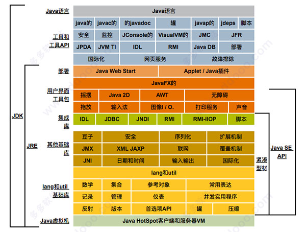

## java测试

第一个软件--二分法


人工智能--鬼（机器人）

智能程序：今日头条，淘宝，微信，忽视了他的置信度，不靠谱的信息。 买了一堆差的商品，无法评论信息的真伪新闻，忽略人与人的相处。


**JDK的基本组件**

1、javac – 编译器，将源程序转成字节码。

2、jar – 打包工具，将相关的类文件打包成一个文件。
3、javadoc – 文档生成器，从源码注释中提取文档。
4、jdb – debugger，查错工具。
5、java – 运行编译后的java程序（.class后缀的）。
6、appletviewer：小程序浏览器，一种执行HTML文件上的Java小程序的Java浏览器。
7、Javah：产生可以调用Java过程的C过程，或建立能被Java程序调用的C过程的头文件。
8、Javap：Java反汇编器，显示编译类文件中的可访问功能和数据，同时显示字节代码含义。
9、Jconsole: Java进行系统调试和监控的工具。


**jdk8 mac版新特性**

1、Java 8允许我们给接口添加一个非抽象的方法实现，只需要使用 default关键字即可。
2、新增lambda表达式。
3、提供函数式接口。
4、Java 8 允许你使用 :: 关键字来传递方法或者构造函数引用。
5、我们可以直接在lambda表达式中访问外层的局部变量。




```
30亿设备运行java

Java SE Development Kit 8 for mac版是一个可以在苹果电脑上使用的Java语言的软件开发工具包，主要用于移动设备、嵌入式设备上的java应用程序，也可以简称其为“jdk8”。JDK是整个java开发的核心，它包含了JAVA的运行环境（JVM+Java系统类库）和JAVA工具。新版本的JDK多了许多有用的功能，比如说新增了一个依懒性分析工具jdeps，可由开发人员理解他们的应用程序和库的静态依赖关系；新的jar文件属性切入点，确定进场点有助于防止未经授权的代码被运行时JAR文件与main()方法的多个类，多个Applet类，或多个JavaFX应用程序类；新的JAXP处理属性maxelementdepth，被添加到提供应用程序设置最大元素深度限制在一个xml文件当中。想要学好Java，那么JDK是比不可少的，有需要的小伙伴赶紧来下载吧。
https://pan.baidu.com/s/1vvrnHmpo3gLDJJNOeD289g

```


**终端 运行2019-09-04**

二分法

```

Last login: Wed Sep  4 19:17:20 on ttys001
➜  ~ git:(master) ✗ cd /Users/tianzi/Desktop/时间复杂度 
➜  时间复杂度 git:(master) ✗ javac  erfen.java
上面是编译
➜  时间复杂度 git:(master) ✗ java  erfen                         
这个是运行；
3
➜  时间复杂度 git:(master) ✗ 


Java 二分法查找
//https://blog.csdn.net/happyzwh/article/details/80398519
```

**二分法**

```java

public class erfen{
    
    public static int binerySearch(int[] arr, int searchNum) {
        // 初始化左侧索引
        int leftIndex = 0;
        // 初始化右侧索引
        int rightIndex = arr.length - 1;
        while (leftIndex <= rightIndex) {
            // 计算中间索引
            int mid = (leftIndex + rightIndex) >>> 1;//主要防止溢出，就是除以2的意思
            // 如果查询的数等于中间索引对应的数组里的数，则返回mid索引，并退出循环
            if (searchNum == arr[mid]) {
                return mid;
            }
            // 判断并计算右侧索引
            if (searchNum < arr[mid]) {
                rightIndex = mid - 1;
            }
            // 判断并计算左侧索引
            if (searchNum > arr[mid]) {
                leftIndex = mid + 1;
            }
        }
        return -1;
    }
    public static void main(String[] args) {
        int[] arr ={1,2,3,4,5,6,7};
        int x = er.binerySearch(arr, 4);
        System.out.println(x);
    }
}
```


