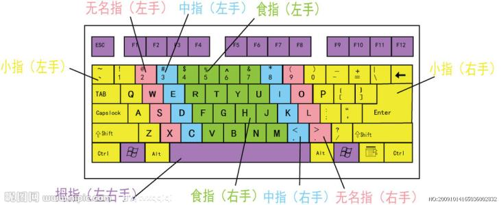
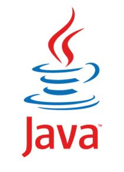

```
Microsoft Windows [版本 10.0.18363.418]
(c) 2019 Microsoft Corporation。保留所有权利。
我是谁
C:\Users\ww>whoami
tianzi\ww
C:\Users\ww>
```


## 计算机的硬件

cpu 内存 硬盘

- cpu 中央处理器

  - 主要处理各种计算机的指令以及软件中的数据
  - 自带集成显卡

- 内存 ：存储部件；金士顿，威刚，东芝，三星

  - 主要用于临时存放cpu访问的数据内容，优点：cpu直接访问且效率高
  - 缺点：容量小，一旦断电会造成数据的丢失

- 硬盘：三星固态做的好，希捷和西部数据都是机械硬盘。

  - 计算机中的存储部件；
  - cpu不能直接访问硬盘中的数据，缺点：效率比较低
  - 优点：容量大，若断电不会造成数据丢失

- 显卡：adm 1080ti ，读：太 ，T

- 键盘

- 显示器

- 鼠标

  

1字节= 1byte  = 8bit

bit是二进制位，在计算机的底层识别0和1组成的二进制序列





## 操作系统

（计算机的体系结构）java的执行顺序:

1. 应用程序/java 应用 application
2. 操作系统外壳（GUI/命令） OS Shell（KDE bash csh）
3. 操作系统内核 OS kernel
4. 硬件 Hardware（最底层的）

- 基于硬件之上是操作系统

- 操作系统上面操作的是  应用程序
- 系统软件分为：内核（kernel）和外壳（shell）


## java诞生




- c++是1983年诞生的 cpp plus＋

- java是1995年诞生的

- go （又称**Golang**），罗伯特·格瑞史莫等，Go于2009年11月正式宣布推出
  - [Google](https://baike.baidu.com/item/Google)开发的一种[静态](https://baike.baidu.com/item/静态)[强类型](https://baike.baidu.com/item/强类型)、编译型、并发型，并具有垃圾回收功能的[编程语言](https://baike.baidu.com/item/编程语言)。

- Swift  苹果公司的  上  
- Objective-C：1980年代初布莱德·考克斯(Brad Cox)，在其公司Stepstone

1.    Oracle在数据库领域中是老大，在整个市场50%以上，在java的市场是70%
2.    sun公司是卖系统的

**20世纪90年代**（1990年），技术：**单片机系统**发展，这是一个**商机**，把这个技术放在**家电设备**，时的更加**智能化**；

**sun**公司（太阳）开展绿色计划，**詹姆斯-高斯林**（java之父，James Gosling），用c++但是 它不能跨平台，所以开发了；之前的名字叫oak语言（橡树），程序员喜欢喝咖啡，所以图标是热咖啡，名字 是爪哇岛，盛产咖啡。

java吸收了C++语言的各种优点，还摒弃了C++里难以理解的多继承、指针等概念，

- 1991年 sun Green
- 1992年 Oak
- 1995 java问世
- 1996年 java1.0
- 1999年 java1.2发布 java SE / java EE /java ME
- ;;;；；；；；；；；；；；；；；；；；；
- 2004年 ，    tiger 发布（java5.0），java登上火星
- 2007年，     java6.0 
- 2009年，     sun 被甲骨文公司  （Oracle）以70亿买下
- 2011年，     发布7.0 
- 2014-3-19，发布java8.0正式版；外界叫1.8
- 2017-9-21，java9.0
- 2018-3-21 ，java10
- 2018-9-25，java 11
- 2019-3月 ， java122019年9月24日
- 2019年9月24日 ,java13

.jpg)

.jpg)


2019-11月标题：C接近Java，Swift进入前10名，Rust得分均创历史新高

| Nov 2019 | Nov 2018-11月  | Change                                           | Programming Language            | Ratings | Change |
| :------- | :------------- | :----------------------------------------------- | :------------------------------ | :------ | :----- |
| 1        | 1              |                                                  | Java  (2004年火爆)              | 16.246% | -0.50% |
| 2        | 2              | 国外用多                                         | C    （写操作系统，驱动，内核） | 16.037% | +1.64% |
| 3        | 4              | 上升                                             | Python                          | 9.842%  | +2.16% |
| 4        | 3              |  | C++                             | 5.605%  | -2.68% |
| 5        | 6              | 上升                                             | C#                              | 4.316%  | +0.36% |
| 6        | 5              |  | Visual Basic .NET               | 4.229%  | -2.26% |
| 7        | 7              |                                                  | JavaScript                      | 1.929%  | -0.73% |
| 8        | 8              |                                                  | PHP                             | 1.720%  | -0.66% |
| 9        | 9              |                                                  | SQL                             | 1.690%  | -0.15% |
| 10       | 12  苹果公司的 | 上                                               | Swift                           | 1.653%  | +0.20% |
| 11       | 16             | 上升上升                                         | Ruby                            | 1.261%  | +0.17% |
| 12       | 11             |  | Objective-C                     | 1.195%  | -0.28% |
| 13       | 13             |                                                  | Delphi/Object Pascal            | 1.142%  | -0.28% |

编程语言的流行排名，与一年前相比，2019年11月:

| Rank |                            Change                            | Language    |  Share  | Trend  |
| :--: | :----------------------------------------------------------: | :---------- | :-----: | :----: |
|  1   |                                                              | Python      | 29.62 % | +4.2 % |
|  2   |                                                              | Java        | 19.52 % | -2.2 % |
|  3   |                                                              | Javascript  | 8.43 %  | +0.2 % |
|  4   |                                                              | C#          | 7.27 %  | -0.4 % |
|  5   |                                                              | PHP         | 6.39 %  | -1.0 % |
|  6   |                                                              | C/C++       | 5.89 %  | -0.3 % |
|  7   |                                                              | R           | 3.76 %  | -0.2 % |
|  8   |                                                              | Objective-C | 2.55 %  | -0.7 % |
|  9   |                                                              | Swift       | 2.44 %  | -0.2 % |
|  10  |  | TypeScript  | 1.85 %  | +0.3 % |
|  11  |                        | Matlab      | 1.82 %  | -0.2 % |


## java版本

1. java SE（java平台的标准版 java Platform，Standard Edition）
   1. 主要学习Java语言的语法规范和常见类。
   2. 认字、组词、造句、一句话
2. java EE（java 平台的企业版）“java platform，Enterprise Edition”
   1. 主要学习java后台开发技术，编写B/S（浏览器和服务器）架构项目（即有个浏览器就可以访问的）
   2. 写论文，文章
3. java ME（java平台的微型版 ）“java PLatforrm ， Micro Edition”
   1. Symbian的 小游戏，就是用me编写的； 随着Android的迅速普及走向淘汰。


## 开发软件的搭建

1. <u>jdk</u> :**java开发工具包**（java development kit），只要java开发就要下载和安装该软件（开发者用）
   1. www.sun.com
   2. www.oracle.com  选择Product Help -->Downloads（产品帮助下载）
   3.  exe安装包，直接安装，对于jdk的路径一定是不要有中文（有的时候会出错）
   4. zip直接解压完就可以用；主流1.8； **用低版本**，是大公司不想换
      1. bin 主要是exe文件
      2. db 小型数据库
      3. include 保存   头文件
         1. 头文件作为一种包含功能函数、数据接口声明的载体文件，
         2. 主要用于保存程序的声明，而定义文件用于保存程序的实现。
      4. <u>jre</u> ： **java运行时环境** （jdk包含jre）（客户机用）
      5. lib ：库
      6. src 解压完的src
      7. <u>jvm</u>  ： java虚拟机(是**应用软件**)，是**java程序**与**操作系统**之间的桥梁
   5. javac.exe :翻译（编译器），主要用于java程序 翻译生成 **字节码文件**  （中 翻译成 英语）
   6. java.exe  ：解释器，主要用于启动 java虚拟机对 字节码文件 进行解释执行 （英语 翻译成  韩语）


## 编写流程

1.  以java 结尾
2. dos 窗口， （黑窗口）切换到 路径
3. javac xx.java 编译生成  xx.class 字节码文件
4. java xx进行解释执行，最终打印（每一个文件必须有输出）


```java
只要见到左大括号，下一行，就四个空格，不要按空格键
左大括号前，一个空格
类名 ：HelloWorld 
类体 ：{里面的}
主方法main ：程序的入口；大门
  方法体：{里面的}
```

5. 快捷键 ctrl +s (保存)  +c（复制） +v 粘贴 ，+ f 查找 ，+x 剪切 ， + z撤销  ，+a 全选
6. windows 键 + r 运行（输入cmd 进入dos窗口）， +e 打开计算机,+ l 锁 屏 ，+tab 切换任务 ，
7. alt +tab 切换任务 （常用） 按住alt


## 运行文件

1. 方法一： 在地址栏，直接输出cmd
2. 方法二：按住shift 右击 
3. 加入环境变量， 就是bin目录下 有javac文件

不认识注释！！！！

```JAVA
/*
*	项目名称：编写第一个java程序
*	项目功能： 打印一句话，一行代码5毛
*	作	者：		fibncci
*	版	本：	v1.0
*	所有者：无名科技有限公司
*	备	注： 看仔细学习	
 */

// 只要见到左大括号，下一行，就四个空格，不要按空格键
// 左大括号前，一个空格
// 类名 ：HelloWorld 
// 类体 ：{里面的}
// 主方法 ：程序的入口；大门
//   方法体：{里面的}
```


## 参考文献

```
TIOBE指数-排行榜查询
TIOBE-软件质量公司排名
https://www.tiobe.com/tiobe-index/

PYPL PopularitY of Programming Language
PYPL编程语言的流行排名
http://pypl.github.io/PYPL.html

2014年9月出任甲骨文公司CEO 。2019年10月18日，马克·赫德去世，享年62岁。
https://www.oracle.com/index.html

jdk下载地址
https://www.oracle.com/technetwork/java/javase/downloads/jdk13-downloads-5672538.html
https://www.oracle.com/technetwork/java/javase/downloads/jdk8-downloads-2133151.html
```

