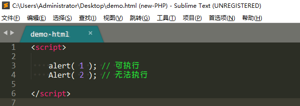

JS 基础


## 终端运行js文件

```sh
➜  code-19-09 git:(master) ✗ pwd                                                     
/Users/tianzi/Desktop/云课堂4.3g/H5/4-javascript核心语法/code-19-09
➜  code-19-09 git:(master) ✗ node 1     
this is 1.js
➜  code-19-09 git:(master) ✗ node 1.js 
this is 1.js
➜  code-19-09 git:(master) ✗ node 1.js
this is 1.js
adsadsad
➜  code-19-09 git:(master) ✗ 

```


## Js训练-3

> ​	ECMAScript是一种由Ecma国际（前身为欧洲计算机制造商协会,英文名称是European Computer Manufacturers Association）通过ECMA-262标准化的脚本程序设计语言。
> ECMA-262规范 定义了ECMAScript支持的一套关键字，这些关键字标识了ECMAScript语句的开头和/或结尾。根据规定，关键字是保留的，不能用作变量名或函数名。
>
> ECMAScript实际上是一种脚本在语法和语义上的标准。实际上JavaScript是由ECMAScript，DOM和BOM三者组成的。 所以说，在JavaScript，JScript和ActionScript中声明变量，操作数组等语法完全一样，因为它们都是ECMAScript。但是在操作浏览器对象等方面又有各自独特的方法，这些都是各自语言的扩展。

```
1997年，ECMAScript1.0发布
1998年6月，ECMAScript2.0 发布
1999年12月，ECMAScript3.0发布。 3.0版本是一个巨大的成功，得到了广泛的支持，奠定了JavaScript的基础，我们一开始学习的JavaScript其实就是3.0版本。
ECMAScript4 由于改变过于激进，所以未能成功发布。但是其中大部分内容被ES6继承了
2009年12月，ECAMScript5.0 正式发布
2011年ECMAScript 5.1 发布


2015年6月 ECMAScript 6.0 发布,正式名称是《ECMAScript 2015标准》（简称 ES2015）。
2016年6月，小幅修订的《ECMAScript 2016标准》（简称 ES2016）发布，这个版本可以看作是 ES6.1 版，也被称作ES7
2017年6月发布 ES2017 标准，也被称作ES8
2018年6月。es2018
2019年6月。es2019

因此，有时候我们用ES6来代指ECMAScript2015以及之后的版本

```


> **1.编辑器**
>
> 工欲善其事，必先利其器
> 想要写好程序, 学好编程,  必须先有一个趁手的IDE(编辑器)
> 目前市场常用编辑器: 
>
> 1. Sublime Text 3
> 2. Visual Studio
> 3. HBuilder
> 4. ATom
> 5. WebStorm
> 推荐Sublime Text 3, 小巧轻便, 就是一个变态版记事本. 


**JavaScript**

> ​	这是一门肥肠神奇的语言, 可以说, 当今IT, 绝大多数项目都需要用到JavaScript ( 俗称Js ). 无论是开发网站, 制作App, 桌面程序, 还是游戏, 都要用到Js. 所以一名程序员不会Js, 程序员这条路走的不会太远太久.
>
> 未来如何判定一名新人程序员是否具有培养价值?  那么 **逻辑思维, 编程思想** 是一个重要指标
>
> 我们前期通过 Js 先锻炼逻辑思维,  慢慢具备编程思想, 会非常有利于我们学习编程

> ​	2**第一次编程**
>
> 1. 创建文件
>
>    在桌面新建一个HTML文件,  取名 `demo.html`


> ​	2.打开`Sublime Text3 编辑器`, 并编写代码


> ​	运行 demo.html 
>
> 在编辑器任意位置, 鼠标右键 -> 选择"在浏览器中打开"


> ​	自动打开默认浏览器, 并看到一个 `弹窗`, `弹窗`就是 `alert()` 实现的
>
> ​	以上, 是我们第一次写代码, 并成功运行代码.


> ​	**3.控制台**
>
> `alert` 来弹出内容的话, 其实还是比较繁琐的. 
>
> 浏览器自带`开发者工具`的`控制台` 来查看内容, 简单方便直观.
>
> 1. 开发者工具
>
>    每个浏览器基本都有开发者工具, 我推荐大家使用 `chrome`的开发者工具, 是Js最理想的实验环境.
>
>    打开开发者工具的方式: 
>
>    - 在浏览器的空白处, 右击选择 `检查` 或 `审查元素` 即可打开开发者工具
>    - 直接按 `F12` 也能打开开发者工具
>
> 2. 控制台
>
>    在开发者工具中, 选择 `Console`, 这就是`控制台`
>
>    在控制台中, 可以查看内容 or 运算


 


> ​	4浏览器内核
>
> 为什么在控制台输入`1+1` 就会得到`2`?
>
> 为什么百度,淘宝网站有各种各样的字体颜色, 背景颜色?
>
> 这些功能都归功于`浏览器内核`
>
> Def 浏览器内核分成两部分: `渲染引擎` 和 `Js引擎`


**渲染引擎**

根据HTML代码, 向网页显示各种文字、图形,  也能给文字, 图形添加各种颜色,  还可以对文字、图形做各种排版

各大浏览器的渲染引擎

- firefox - gecko引擎
- IE - Trident引擎
- Opera - Presto引擎
- Chrome/Safari - webKit 引擎
- Chrome+Opera 联合开发 Blink引擎


**Js引擎**

本来也是渲染引擎里面的一部分, 但后来Js越做越大, 便独立出来了.

**Js引擎主要作用**: 读取网页中的 Js代码, 并对其进行处理. 例如 算术运算, 变量声明, 事件调用等等

各大浏览器的Js引擎

- 旧 IE - Jscript引擎
- IE9 - Chakra引擎
- IE Edge - Chakra引擎
- Firefox - monkey引擎
- Safari - SquirrelFish引擎
- Opera - Carakan引擎
- Chrome - V8引擎    ( Node.Js 也封装了V8引擎 )


**Js标准**				

ECMAScript 是JavaScript语言的国际标准, 简称`ES`

目前市场常用标准版本为 `ES5`, `ES6`


> 5. Js语句
>
> 在控制台中, 了解一下Console


**发现:**

Console 有 `>` 等待输入,  也有 `<` 输出结果. 那么每一次输入的东西, 被我们称之为 `语句`

在将来, 我们要编程的代码会越来越多, 一个正式的项目不会让程序员一边写代码, 一边让客户看结果. 所以我们会把代码写好,一次性导入项目中.


> 书写Js
>
> 项目中常见有两种写法:
>
> - 内部书写
> - 外部导入
>
> 第一种:(script)内部直接书写Js代码


> **第二种: **外部导入Js代码


> 注意: 
>
> ​	用了 src 就不能直接在 script 内直接书写js, 
>
> 除非在下面新写一个 script


> ​	分隔符
>
> 分隔符:  `分号;`


> 每一条Js 写完后, 强烈建议加上`;`  虽说不是必须品, 但能提高代码可读性
>
> 横排写时,  程序员一般都喜欢把字符个数控制在80个以内, 
>
> 亦可提高代码可读性


**空格/换行**

在 Js代码中, 连续多个空格 or 换行会被忽略, 所以我们随意使用空格or换行.

那么, 强烈推荐大家利用空格 or 换行对代码进行排版, 形成统一风格, 从而提高代码`可读性`

例如: 

```
x = 10 + 2
x=10+2
```

两种写法在js引擎中没任何区别, 但对于我们程序员而言, 在 `=` 两边添加空格, 可以提高整体代码可读性


**大小写**

Js 严格区分大小写




> ​	**注释**
>
> Js 注释具备两种功效:
>
> - 对代码进行描述
> - 注释代码无法执行
>
> 
>
> 注释分类:
>
> - 单行注释
> - 多行注释
>
> 
>
> **单行注释**:  `// 注释内容`
>
> **多行注释**: `/* 注释内容 */`


> 注意哦,  注释可是程序员的保命技能, 国外曾发生因不写注释而被枪毙的事情哦, 吓人!!!!!


> ​	6.变量定义
>
> 变量: 就是存储数据的容器,  与数学中的未知数是一个意思, 只是在程序中我们称之为`变量`而已
>
> 

```

声明格式variable

var 变量名;
var 变量名 = 值;
```

例如: 

```
var x = 10

```

- 关键字: var
- 变量名: x       也被称之为`标识符, 标记符`
- 值: 10

> 变量名可以是 短名称(例如 x 和 y),  也可以更具有描述性( 例如 name 和 tel )

命名规范

- 可包含`数字`, `字母`, `汉字`,`下划线`和`美元符$`
- 常用`字母`开头, 很少以`汉字`, `_` 或 `$` 开头, 不能以 `数字`开头
- 区分大小写
- 不能使用`关键字`, `保留字`


> ​	控制台查看变量
>
> 常用 `console.log()`在控制台查看变量,  平时会经常这么查看, 而非用 alert


>数据类型
>
>分类
>
>常用数据类型:
>
>- 基本类型
>- 引用类型

**基本数据类型**

- number 数字2
- string 字符串4
- boolean 布尔3
- null 空 类型 5
- undefined 未定义6
- symbol（es6）独一无二的值	；第七类数据类型

**引用类型**

- object 对象1
- array 数组
- function 函数


> ​	简单使用
>
> number 数字
>
> 数字就是 整数, 小数, 科学计数


```
var x = 10; 	// 整数
var y = 10.5; 	// 小数
var z = -5; 	// 负数
```

```
var x = 2e3; 	// 科学计数, 相当于 2*10的3次方, 结果: 2000
var y = 2e-3;	// 科学计数, 相当于 2*10的-3次方, 结果: 0.002
```


> ​	string 字符串
>
> 字符串可以含有数字, 字母, 汉字, 标点等任意字符.
>
> 字符串基本是用 `引号`包起来的, 单双引号均可.

```
var x = '三国'
var y = "曹操"
```


> ​	boolean 布尔
>
> 布尔只有两个值: `true` 和 `false`
>
> 经常被用于做比较, 判断等状态值
>
> 注意:  boolean 只能识别小写

```
var x = 5;
var y = 8;
console.log( x > y ); # false
console.log( x < y ); # true
```


> ### null   undefined
>
> null 和 undefined 在一定意义上都代表 `空值`
>
> 一般情况下, null 都是程序员主动赋值 or 意料之中的
>
> 而undefined 是 始料未及的 or 系统级的错误等
>
> 注意: null 是关键字,  而undefined 不是

> ​	2.array 数组
>
> 能将很多值 存放到一起, 这些值都是平行关系

```
var x = [
            '刘备',
            '关羽',
            '张飞',
            100,
            5.5,
            true,
        ]
```

获取数组中的值

```
console.log( x[0] ); 	// 刘备 
console.log( x[1] ); 	// 关羽
```

**小结: **

- 数组都是由键值组成, 以上案例我们只写了值
- 键默认从 0 开始, 依次递增
- 数组被`[ ] `包含


> ​	object 对象
>
> 对象有着 `一切皆对象`的口号, 上面的`数组`其实就是对象的一种

```
  var x = {
            'name': '张全蛋',
            'age': 18,
            'address': '富士康',
          }
```

获取对象中的值

```
console.log( x.name ); 	// 张全蛋
console.log( x.age ); 	// 18
```

**小结**

- 数组大多是  数字键+值
- 对象大多是  字母键+值
- 对象被 `{}` 包含


> ​	function 函数
>
> 函数也被称之为功能, 虽说也是类型之一, 但我们其实很少把他看成数据类型, 只是看做能执行特定任务的代码块

```
// 定义一个函数
var x = function demo(){ 
	// 代码块, 功能
} 	

```


> 以上只是对数据类型, 做了简单的介绍, 后面会有详细的介绍
>
> typeof 类型检测
>
> 用于获取一个数据的类型
>
> **格式:** 


```
typeof(数据)
或
typeof 数据

```

**案例:** 

```
var x = 10; 		// number
var x = 1.5; 		// number
var x = 2e3; 		// number
var x = 'abc'; 		// string
var x = '123'; 		// string
var x = true; 		// boolean
var x = false; 		// boolean
var x = null; 		// object
var x = undefined; 	// undefined
var x = [1,2,3]; 	// object
var x = {'name':'刘邦', 'age':58}; // object
var x = function (){} 	// function
console.log( typeof x );

```

> 注:  `null` 并没有返回 null类型, 而是 object类型, 这是 Js历史遗留BUG, 本应是 null类型.

经过 typeof 测试, 基本将数据分为两类人: 

- 原始数据
- 复杂数据


**原始数据**

- number
- string
- boolean
- undefined

**复杂数据**

- object
- function 


> 8	Number 数字
>
> 很多编程语言, 都会有整数、小数之分, 但是在Js中, 统称为`number`
>
> number形式

- 整形
- 浮点型
- Infinity
- NaN


> ​	整型
>
> 整型并非整容, 而是指 整数. 例如 `1`, `2`, `0`, `-1`, `-2` 等
>
> **如何判断一个值是否为整型**

```
Number.isInteger(10); 	// true
Number.isInteger(10.5); // false
```

**其他类型如何转成 整型**

```
var x = parseInt(1.2); 		// 1 	
var x = parseInt(1.7);		// 1 	
var x = parseInt('1.2'); 	// 1 	
var x = parseInt('1.7'); 	// 1 	
var x = parseInt('0.9'); 	// 0
var x = parseInt('.9'); 	// NaN
var x = parseInt('1.a');	// 1
var x = parseInt('a.1'); 	// NaN
var x = parseInt('2e3'); 	// 2
console.log( x );
```

**进制**

常见进制: 二进制Bin, 八进制Oct, 十进制Dec, 十六进制Hex


|          | 基数          |
| -------- | ------------- |
| 二进制   | 0 ~ 1         |
| 八进制   | 0 ~ 7         |
| 十进制   | 0 ~ 9         |
| 十六进制 | 0 ~ 9   a ~ f |

> ​	其他进制 -> 十进制:
>
> **公式: **基数 * 进制数 ^ 次方


```
var x = 10100;
console.log( parseInt(x, 2) ) 	// 20

var x = 24;
console.log( parseInt(x, 8) ) 	// 20

var x = 14;
console.log( parseInt(x, 16) ) 	// 20
```

> ​	十进制->其他进制:
>
> **规则:**  将 十进制 除以 当前进制, 直到商为0, 结果`倒取余`

```
var x = 20

console.log( x.toString(2) ); 	// 10100
console.log( x.toString(8) ); 	// 24
console.log( x.toString(16) ); 	// 14
```

**浮点型**

数字中可以含有一个小数点, 例如: `0.1`, `0.123`, `-0.456`

**17有效位数**

```
var x = 0.123456789012345678901234567890123456789;
console.log(x); 	// 0.12345678901234568 

var x = 123.456789012345678901234567890123456789;
console.log( x, typeof x); 	// 123.45678901234568 
```

最大是2的

```js
console.log(Number(2e307))
console.log(Number(2e308))
2e4 = 20000
//2e+307
//Infinity

```


其他类型如何转为 浮点型

```
var x = parseFloat(10); 	// 10
var x = parseFloat(10.5); 	// 10.5
var x = parseFloat('1.5'); 	// 1.5
var x = parseFloat('a.5'); 	// NaN
var x = parseFloat('5.a'); 	// 5
var x = parseFloat('.9'); 	// 0.9
var x = parseFloat('2e3'); 	// 2000
var x = parseFloat('-2.5'); // -2.5
var x = parseFloat('2.5.6'); // 2.5
console.log(x);
```


>Infinity代表无穷大


```
console.log(x); 	// Infinity

var x = -2e30000;
console.log(x); 	// -Infinity
```


>
>
>### NaN
>
>一个特殊值, 代表 `Not a Number` 意为`不是一个数`, 只要不是number数字, 都认为是 NaN
>
>**检测是否为 NaN**

```
var x = 10; 	// false
var x = 1.5; 	// false
var x = 'a'; 	// true
var x = 'a.5'; 	// true
var x = true; 	// true
var x = NaN; 	// true
var x = 0/0;
console.log( isNaN(x) );
```

**奇葩NaN**

- 只要是纯数字, 就不是NaN
- NaN 与 任何人 都不相等 ( 包括自己 )
- NaN  与 任何人运算结果都为NaN
- 0 / 0  的结果为 NaN


> ​	Number类型转换
>
> 其余类型 -> number类型
>
> - Number()
> - 骚操作
>
> 
>
> Number() 

```
var x = Number('a'); 	// NaN
var x = Number('a2'); 	// NaN
var x = Number('2a'); 	// NaN
var x = Number('2.a'); 	// NaN
var x = Number('2.'); 	// 2
var x = Number('.2'); 	// 0.2
var x = Number('2e3'); 	// 2000
var x = Number('2.5e3');	// 2500

console.log( x, typeof x);
```


> ​	骚操作
>
> 在数值之前加上`+`, 也能转为number类型
>
> 之前的 parseInt 和 parseFloat 也是类型转换的方法

```
var x = +true;      // 1
var x = +false;     // 0
var x = +'2';       // 2
var x = +'.2';      // 0.2
var x = +'a.2';     // NaN
var x = +'1.2';     // 1.2

console.log( x, typeof x);
```


> ​	9 String 字符串
>
> 在计算机中, 除了用数字表达一些东西之外, 还需要一些字母, 汉字, 标点等, 那么这些我们统称为`字符串`
>
> string 形式
>
> - 单引号
> - 双引号
> - 反引号

**单引号**

```
var x = 'Hi, 美女';
```

**双引号**

```
var x = "哇, 好大的猫";
```

**反引号**

```
var x = `这鸡真香啊`
```


> ​	区别
>
> 单双引号本身其实没多大区别, 在于使用时有部分影响, 有如下影响:
>
> - 单双引号不能自插 ( 单引号不能嵌套单引号,  双引号同理 ) 
> - 单双引号可以互插 ( 单引号可以嵌套双引号,  双引号同理 )

```
console.log( 'I give you face, you don't want a face' );  	# 报错

console.log( 'I give you face, you don\'t want a face' ); 	# 解决方法1: 将单引号 转义为普通单引号
console.log( 'I give you face, you don"t want a face' ); 	# 解决方法2: 将单引号 变为双引号
```

> ​	**转义符**
>
> `\`就是转义符, 能将特殊字符-> 普通字符. 也能将普通字符 -> 特殊字符
>
> **特殊字符 -> 普通字符**
>
> 在Js 中有不少字符本身就具有特殊意义, 例如 单引号, 双引号.  
>
> 引号一输出就被认为是字符串,  若只想输出普通的引号, 而不具备特殊意义, 可以这么做 ` \'` 或 `\"`, 在引号前面加上`\`即可.
>
> 
>
> **普通字符 -> 特殊字符**
>
> - \n  换行
> - \r  回车
> - \t  制表符

> ​	变量识别
>
> `反引号`内可以识别变量, 而单双引号无法识别
>
> **格式:** `${变量名}`

```
var name = '刘亦菲';

console.log(' ${name} 真漂亮 ');
console.log(" ${name} 真漂亮 ");
console.log(` ${name} 真漂亮 `);
```


> ​	**注意**
>
> - 单双引号的内容不能直接断行,  如需断行,  可用 `+` 连接
> - 非纯数字值 不加引号会被认为是 `变量`

```
var x = '窗前明月光' + 
		'疑是地上霜';
console.log(x);   
```

```
var x = 10; 		// 正常执行
var x = 'Hello';  	// 正常执行
var x = Hello; 		// 报错, 说 Hello 未定义
```


> ​	常用属性
>
> **.length**		获取字符串的长度

```
var x = 'abc';
console.log( x.length ); 	// 3 	变量x的字符串长度
```


> ​	常用方法
>
> - .split(分割符)	按分割符拆分到 数组中
> - .toUpperCase()		字符串转大写
> - .replace( 搜索值, 替换值 )** 	字符串替换

```
var x = 'abc-ijk-xzy';
console.log(x.split('-')); 		// ["abc", "ijk", "xzy"] 	分割字符串到数组
```

```
var x = 'abc-ijk-xzy';
console.log(x.toUpperCase()); 	// ABC-IJK-XZY 				字符串转大写
```

```
var x = 'abc-ijk-xzy';
console.log(x.replace('-','?')) // abc?ijk-xzy 				字符串替换
```


> ​	10Array 数组
>
> 为什么学习数组? 大家看下面的例子就明白了

```
// 普通变量写法, 好像有点乱

var 同学1 = '胡歌';
var 亲戚1 = '张飞';
var 同学2 = '霍建华';
var 亲戚2 = '李云龙';
var 同学3 = '刘德华';
var 亲戚3 = '孙悟空';


// 数组写法, 一目了然

var 同学 = [ 
            '胡歌',
            '霍建华',
            '刘德华',
           ];

var 亲戚 = [
            '张飞',
            '李云龙',
            '孙悟空',
           ];
```


> ​	array形式
>
> - 中括号
>
> **中括号**
>
> 中括号里面的`值`也被称之为 `元素`

```
var x = []; 			// 空数组
var x = [10, 20, 30]; 	
```

> ​	值的类型不限

```
var x = [
		10,
		1.5,
		true,
		'abc'
];
```

> ​	数组嵌套,  称之为`多维数组`

```
var x = [
		[10],
		[20],
		[[[30]]],
];
```

> ​	**获取元素**
>
> 每个值都有一个索引,  第一个值的索引为0, 第二个为1, 以此类推...

```
var x = ['大哥', '小哥', '胡哥'];

console.log( x[0] ); 	// 大哥
console.log( x[1] ); 	// 小哥
console.log( x[2] ); 	// 胡哥
console.log( x[999] );  // undefined  索引不存在
```

```
var x = [
    ['熊大','熊二','光头强'],
    ['你妹','他妹','傣妹'],
    ['百度','腾讯','阿里'],
];

console.log( x[0][1] );     // 熊二
console.log( x[1][1] );     // 他妹
console.log( x[1][2] );     // 傣妹
```


**添加/修改元素**

```
var x = ['大哥', '小哥', '胡哥'];

x[3] = '磊哥'; 	// 添加, 索引已存在
x[1] = '老哥'; 	// 修改, 索引不存在
console.log(x);		// ["大哥", "老哥", "胡哥", "磊哥"]


x[10] = '马哥';
console.log( x ); 	// ["大哥", "小哥", "胡哥", empty × 7, "马哥"]
console.log(x[10]); // 马哥
console.log(x[8]);  // undefined
```


> 数字索引必须是 连续的, 如果中间的索引没有设置, 则默认undefined
>
> 数组的索引只能是 数字
>
> 数组的索引不能 主动命名


> ​	常用属性
>
> **.length 	获取数组的长度**

```
var x = [10,20,30];
console.log( x.length ); 	// 3
或
console.log( [10,20,30].length ); 	// 3
```


> ​	常用方法
>
> **.push(元素)**  	从尾部添加元素

```
var x = [10,20,30];
x.push(90);
console.log(x); 	//  [10, 20, 30, 90]

```

**.pop()** 		从尾部删除元素

```
var x = [10,20,30];
x.pop();
console.log(x); 	//  [10, 20]

```

**.unshift(元素)** 		从头部添加元素

```
var x = [10,20,30];
x.unshift(88);
console.log(x); 	//  [88, 10, 20, 30]

```

**.shift()** 			从头部删除元素

```
var x = [10,20,30];
x.shift();
console.log(x); 	//  [20, 30]

```

**.reverse()**	颠倒数组值的顺序

```
var x = [10,20,30];
x.reverse();
console.log(x); 	//  [30, 20, 10]

```

**.splice(从哪剪,  剪几个, 插入值1, 插入值2, 插入值3, 更多插入值... )**

```
var x = ['a','b','c','d'];
x.splice(1,2); 		// 从索引1开始剪, 向后剪去2个值
console.log(x);		// ["a", "d"]


var x = ['a','b','c','d'];
x.splice(1,2,'x','y','z'); 	// 从索引1开始剪, 向后剪去2个值, 并插入x,y,z 3个值
console.log(x); 	// ["a", "x", "y", "z", "d"]


```

**.forEach( 回调函数 )** 	数组迭代 	( 将数组中的值一个一个拿出来,  直到拿完为止 )

```
var x = ['a','b','c','d'];

x.forEach(function(索引对应值, 索引){
    console.log(  '第 '+索引+' 条: '+索引对应值 );
})

运结果: 
    第 0 条: a
    第 1 条: b
    第 2 条: c
    第 3 条: d

```


> 11	Object 对象
>
> 为啥学 `对象`?  我还没对象呢 ! ! !
>
> 通过两个对比, 一看就明白, 用对象来描述一些东西, 比普通变量看起来更直观, 整体写法, array跟object长得差不多.

```
// 原始写法
var 姓名1 = '叶修';
var 性别1 = '男';
var 姓名2 = '冷巴';
var 性别2 = '女';
var 年龄1 = 23;
var 年龄2 = 18;


//对象写法
var 叶修 = {
    姓名: '叶修',
    性别: '男',
    年龄: 23,
};

var 冷巴 = {
    姓名: '迪丽冷巴',
    性别: '女',
    年龄: 18,
};
```


> ​	object形式
>
> - 大括号
>
> **大括号**
>
> 左侧不再称之为`索引`, 而是键
>
> 右侧依旧称之为`值`, 也可以是`属性`


```
var x = { }  	// 空对象
var x = {
	键1: '值1',
	键2: '值2',
	...
}
```

键 含有空格or特殊字符

```
var 叶修 = {
    'Your name': '叶修',
    '性+别': '男',
};
```

值 可以是任意类型, 甚至是对象

```
var 叶修 = {
    姓名: '叶修',
    年龄: 23,
    擅长职业: {
        剑客: '狂战士',
        神枪: '机械师',
        法师: '战斗法师',
        格斗: '气功师'
    }
};
```

**小结:** 

- 键 一般用字母or数字, 本身啥字符都能用
- 键 存在空格or特殊字符 必须加引号
- 键 不能重复, 一旦重复, 就会覆盖
- 值 可以为任意类型


> ​	对象操作
>
> **获取对象属性**

```
var 同学 = {
	姓名: '黄磊',
	年龄: 18,
}

console.log( 同学.姓名 );
```

复杂点的对象

```
var 同学 = {
    姓名: '黄磊',
    年龄: 18,
    爱好: {
        美女: '小可爱',
        运动: '约跑',
    }
}

console.log( 同学.爱好.运动 );
```

奇葩的对象

```
var 符号 = {
    '☆': '星星'
}

console.log( 符号.'☆' ); 	// 报错
console.log( 符号['☆']); 	// 以数组的方式来获取, 运行成功
```


**添加/修改属性**

```
var 对象 = {} 	// 先定义一个对象

对象.姓名 = '咪咪';  // 添加属性: 姓名
对象.年龄 = 18; 	// 添加属性: 年龄

对象.年龄 = 23; 	// 修改属性年龄为23 	由于年龄已存在, 所以才是修改, 不存在就是添加
```


> ​	
>
> # 12类型转换
>
> 在js中, 只有同等类型的数据才能进行运算, 例如: number与number 运算, string与string运算 ...
>
> 如果发生不同类型的数据进行运算, 那么,  部分类型会偷偷转换类型再进行运算. 这种行为被称之为`自动类型转换`
>
> 有自动类型转换, 自然也有`强制类型转换`
>
> #### 自动类型转换
>
> **数字类型**
>
> 小结
>
> - boolean
>   - true => 1
>   - false => 0
> - string
>   - number字符串 = >  保留数字 		( 包括正常的科学计数法 ) 
>   - 其余字符串 = > NaN
>
> 只要是与 string 相加的, 都不会做加法, 都变成了 拼接

```
var x = 10;
console.log( x + 1 ); 		// 11
console.log( x + 1.5 ); 	// 11.5
console.log( x + true ); 	// 11 		
console.log( x + false ); 	// 10 		
console.log( x - '2' ); 	// 8 		
console.log( x - 'a' ); 	// NaN 		
console.log( x - '2a' ); 	// NaN  	
console.log( x - 'true' );	// NaN  	
console.log( x - 'false' );	// NaN  	
console.log( x - '2e3' ); 	// -1990
```

> 布尔型


```
var x = true;
console.log( x + 1 ); 		// 2
console.log( x + 1.5 ); 	// 2.5
console.log( x + true ); 	// 2 		
console.log( x + false ); 	// 1		
console.log( x - '2' ); 	// -1 		
console.log( x - 'a' ); 	// NaN 		
console.log( x - '2a' ); 	// NaN  	
console.log( x - 'true' );	// NaN  	
console.log( x - 'false' );	// NaN  
console.log( x - '2e3' );	// -1999
```

**小结**

- 只有 boolean 自动转成别人的份, 要么`1`, 要么`0`


> ​	强制类型转换
>
> 转为number类型:  `Number()`, `parseInt()`,  `parseFloat()`
>
> 转为string类型: `toString()`, `String()`
>
> 转为boolean类型: `Boolean()`


**重点: **

以下值 在boolean转换时为false, 其余都是true

- false

- 0

- 0.0

- -0

- NaN

- null

- undefined

- "" 空字符串

  


> ​	13运算符
>
> - 算术运算符
>   - +
>   - -
>   - \*   乘法
>   - /   除法
>   - %  取模
>   - ++  自增
>   - --    自减
>   - **    幂
> - 赋值运算符
>   - =
>   - +=  -=  *=  /=  %=
> - 字符串运算符
>   - \+ 实则还有`拼接`的意思, 也可以使用 `+=` 拼接
> - 比较运算符
> - 逻辑运算符
> - 类型运算符
> - 位运算符
> - 三元运算符
> - void运算符
>
> 


> 算术运算符
>
> 算术只要计算的是: number之间的运算, 其他类型都会自动转为 number类型


```
# 加法 + 
var x = 10;
var y = 20;
console.log( x + y ); 	# 30


# 乘法 *
var x = 10;
var y = 20;
console.log( x * y ); 	# 200

# 除法 /
var x = 10;
var y = 20;
console.log( x / y ); 	# 0.5

取商
parseInt(x/y)

# 取模 %   求余数
console.log( x % y ); 	# 1 	5除以2的余数为1

# 幂
console.log( x ** y ); 	# 25 	5的2次方为25


# 自增 ++
var x = 5;
console.log( x++ ); 	# 5 	先遇到x, 则优先返回x, 再给x+1
console.log( x ); 		# 6

var x = 5;
console.log( ++x ); 	# 6 	先遇到++, 则优先x+1, 再返回x
console.log( x ); 		# 6 	

var x = 5;
var y = x++ + ++x;
console.log(x, y); 		# x=7  y=13

var x = 5;
var y = 2;
var z = x++ - y-- - ++x;
console.log(x, y, z); 	# x=7  y=1  z=-4

```


> ​	
>
> 赋值运算符
>
> - =
> - +=  -=  *=  /=  %=

```
# 赋值
var x = 10; 	# 将 数值10 赋给 变量x

# 加等 +=
var x = 5;
var y = 10;
x += y; 	# 相当于 x = x+y 	
console.log( x, y ); 	# 15 10


# 乘等 *=
var x = 5;
var y = 10;
x *= y; 	# 相当于 x = x*y 	
console.log( x, y ); 	# 50 10

```


> ## 字符串运算符
>
> - \+  
>
> `+` 看似只是`加法`的意思,  实则还有`拼接`的意思
>
> 当然, 也可以使用 `+=` 拼接
>
> **小结:** 在 `+ `运算过程中, 只要有一边出现字符串, 那么就是`拼接`, 如果两边都是number, 那么就是`加法`
>
>  

```
var x = 10;
var y = 5;
console.log( x + y ); 	# 15 	加法


var x = 10; 	# 数字10
var y = '5'; 	# 字符串5		
console.log( x + y ); 	# 105 	拼接

var x = 'Hello ';
var y = 'boy';
x += y;
console.log( x ); 	# Hello boy
console.log( y ); 	# boy

```


> ​	比较运算符
>
> - \>    
> - \>=
> - \<    
> - \<=
> - ==
> - ===
> - !=
> - !==
>
> 注意: 比较运算符的结果只有 boolean 值

```
console.log( 5 > 10 ); 		# false
console.log( 5 >= 10 );		# false 
console.log( 5 < 10 ); 		# true
console.log( 5 <= 10 ); 	# true
console.log( 5 == 10 ); 	# false 	判断数值大小是否相等
console.log( 5 == 5 ); 		# true
console.log( 5 === 5); 		# true 		判断数值大小是否相等 且 数据类型是否相等 ( 全等 )
console.log( 5 === '5'); 	# false 	
console.log( 5 != 10 ); 	# true 		判断数值大小是否不相等
console.log( 5 !== 5 ); 	# false 	只要全等即为false, 其余都是true

```


> ## 逻辑运算符
>
> - &&
> - \| |
> - !
>
> **逻辑与 &&**
>
> 运算规则:  `与全真才为真(最后一个), 否则就是第一个假(第一个)

```
console.log( true && true );    // true
console.log( true && false );   // false 
console.log( false && true );   // false 
console.log( false && false );  // false 

var x = 3;
var y = 0;
var z = 5;
var o = false;
console.log( x && y );  // y 0 
console.log( x && z );  // z 5
console.log( x && o );  // o false 
console.log( y && o );  // y 0
```


> ​	**逻辑或 | |**
>
> 运算规则: `或全假才为假(最后一个), 否则就是第一个真(第一个)`

```
console.log( true || true );    // true
console.log( true || false );   // true
console.log( false || true );   // true
console.log( false || false );  // false 

var x = 3;
var y = 0;
var z = 5;
var o = false;
console.log( x || y );  // x 3
console.log( x || z );  // x 3 
console.log( x || o );  // x 3
console.log( y || o );  // y false
```


> ​	**逻辑非 ! **
>
> 运算规则: `真即是假, 假即是真`

```
console.log(!true); 	// false
console.log(!false); 	// true

console.log(!1); 		// false
console.log(!0); 		// true
```


> ​	类型运算符
>
> - typeof 主要
> - instanceof 
>
> **返回数据的类型**

```
var x = 10;
console.log( typeof x ); 	// number

var x = '李寻欢';
console.log( typeof x ); 	// string

var x = null
console.log( typeof x ); 	// Object 历史坑

var x = [1,2];
console.log( typeof x );  	// Object 历史坑
console.log( Array.isArray(x) ); 	// true 	这是可以只检测是否为array, 而不是object的

```


> ​	位运算符
>
> - \& 按位与
> - \| 按位或
> - ^ 按位异或
> - ~ 按位取反
> - \>> 左移
> - \<<  右移
> - \>>> 带符号右移
>
> `位运算`基本都要是转化为 `32位二进制`再运算的, `位运算`的结果都是整数

```
console.log( 5 & 1 ); // 1 	
console.log( 5 | 1 ); // 5 	
console.log( 5 ^ 1 ); // 4 	
console.log( ~5 );    // -6 	
console.log( 5 << 1 );  // 10 
console.log( 5 >> 1 );  // 2  
console.log( 5 >>> 1 ); // 2  
console.log( -5 >>> 1 ); // 2147483645 	负数需要先转补码,再位移
```

| 运算符 | 名词     | 运算规则                                  |
| ------ | -------- | ----------------------------------------- |
| &      | 按位与   | 有一个为0,即为0, 否则为1                  |
| \|     | 按位或   | 有一个为1, 即为1, 否则为0                 |
| ^      | 按位异或 | 相异为1, 相同为0；转成二进制；            |
| ~      | 按位取反 | ~x = -x-1  ；最后取整，直接去小数         |
| \<<    | 左移     | 左移n位, 低位补0                          |
| \>>    | 右移     | 右移n位<br>正数: 高位补0<br>负数: 高位补1 |
| \>>>   | 右移     | 右移n位, 高位补0 , 带符号                 |

> **正负数位移原理**

```
掌握位移之前, 必须先掌握 原码, 反码, 补码
例如: 
var x = 10;

10 的原码: 00000000000000000000000000001010 	(32位, 也是 10的二进制)
10 的反码: 11111111111111111111111111110101 	全部取反
10 的补码: 11111111111111111111111111110110    反码+1 , 同时也是 -10的二进制

```

```
>> 或 >>> 或 << 正数位移: 只需要原码即可, 再左右位移
>> 或 << 负数位移: 
            - 将负数当正数用
            - 先求补码
            - 再位移
            - 再减1
            - 再反码
            - 填充符号

>>> 负数位移:  
	- 将负数当正数用
	- 先求补码
	- 再位移

```


**技巧运用**

1. 互换两个变量

   ```js
   var a = 10;
   var b = 20;
   a ^= b, b ^= a, a ^= b; 	// 互换a 和 b 的值
   console.log(a);
   console.log(b);
   
   或者加个中间变量
   ```

2. 取整

   ```
   console.log( 3.5 | 0 );     // 3
   console.log( 3.5 ^ 0 );     // 3
   console.log( 3.5 << 0 );    // 3
   console.log( ~~3.5 );       // 3
   
   var x = -4.7
   var y = 5.9
   console.log(~~x,~~y);
   console.log(~x,~y);
   // -4 5
   // 3 -6
   
   
   
   ```

3. 倍数

   ```
   console.log( 3 << 0 );  // 3        3*2的0次方
   console.log( 3 << 1 );  // 6        3*2的1次方
   console.log( 3 << 2 );  // 12       3*2的2次方
   console.log( 3 << 3 );  // 24       3*2的3次方
   				    // 		  以此类推
   
   console.log( 10 >> 0 ); // 10       10/2的0次方
   console.log( 10 >> 1 ); // 5        10/2的1次方
   console.log( 10 >> 2 ); // 2        10/2的2次方
   console.log( 10 >> 3 ); // 1        10/2的3次方
   				    // 		  以此类推
   				    // 左乘右除
   ```

   


> 三元运算符运算规则:
>
> 当 `表达式1 成立`, 则执行`true环境`, 否则执行 `false环境`
>
> 三元运算符 与 将来的if-else分支功能相似, 不过 三元只能处理简单分支, if-else可以处理复杂分支 


```
# 格式
表达式1 ? true环境 :  false环境

# 例如
console.log(   5%2 == 0 ? '偶数' : '奇数'    );
```

> ​	void 运算符
>
> 意为: 无效的, 空白的
>
> 可以理解为 `没有返回值` or `undefined`
>
> void的语法格式就两种: 带小括号 和 不带小括号.  `推荐: 带小阔号`
>
> **作用:** 常被用于 `超链接的禁止刷新跳转`

```
console.log(  void 10 ); 	// undefined
console.log(  void(10) ); 	// undefined
```

2

```
<a href=""> 刷新当前页面 </a>
<a href="javascript: void(0)"> 不刷新也不跳转 </a>
```

> ​	void的语法格式就两种: 带小括号 和 不带小括号.  `推荐: 带小阔号`
>
> **作用:** 常被用于 `超链接的禁止刷新跳转`

```
console.log( 2 + 5 * 8 ); 	// 先乘法, 再加法
console.log( (2+5) * 8 ); 	// 先加法, 再乘法
```

**复杂运算**

```
var x = 10;
var y =  x++ + x % 2 == 0 ? 2 : 1 ; // 结果为: 1
console.log(y);
```


># 14-分支
>
>根据 `不同的条件` 来执行`不同的功能`
>
>例如: 登录成功与失败, 显示时间为上午与下午, 购买成功与失败...
>
>
>
>## 分支语句
>
>- 单向分支
>- 双向分支
>- 多向分支
>- switch分支

**单向分支**  

```
# 格式1
if( 条件 ){
	如果条件最终结果为 true 时执行的代码
}

# 格式2
if( 条件 )  
	如果条件最终结果为 true 时执行的一行代码
```

**案例**: 早上6:00 闹钟提醒

```
var time = new Date(); 		// 获取时间对象
var hour = time.getHours(); // 获取时间对象中的小时

# 写法1
if( hour == 6 ){
	console.log("懒虫起床");
}

# 写法2
if( hour == 6 ) console.log('懒虫起床');

```


**双向分支**

```
# 格式
if ( 条件 ) {
    如果条件最终结果为 true 时执行的代码
} else {
    如果条件最终结果为 false 时执行的代码
}
```


**案例: ** 早上 9:00 之前进公司提示"早上好, xxx",  9:00 之后进公司提示"迟到了哟"

```
var time = new Date(); 		// 获取时间对象
var hour = time.getHours(); // 获取时间对象中的小时


if ( hour < 9 ) {
    console.log('早上好');
} else {
    console.log('迟到了哦');
}

```


**多向分支**

```
# 格式1
if ( 条件1 ) {
    条件1最终结果为true 时执行的代码
} else if( 条件2 ) {
    条件2最终结果为true 时执行的代码
} else if( 条件3 ) {
    条件3最终结果为true 时执行的代码
}

# 格式2
if ( 条件1 ) {
    条件1最终结果为true 时执行的代码
} else if( 条件2 ) {
    条件2最终结果为true 时执行的代码
} else if( 条件3 ) {
    条件3最终结果为true 时执行的代码
} else{
    以上条件都不满足 时执行的代码
}
```

> 多向分支: 必须从上往下依次进行判断,   前面一旦有满足的条件


**案例: ** 根据成绩 来判定级别

```
var 成绩 =  98
if ( 成绩 < 60 ) {
    console.log('不及格');
} else if( 成绩 < 70 ) {
    console.log('及格');
} else if( 成绩 < 80 ) {
    console.log('中等');
} else if( 成绩 < 90 ){
    console.log('良好');
} else if( 成绩 <= 100 ){   // 成绩有上限: 100
    console.log('优秀');
}

或 

var 成绩 =  98
if ( 成绩 < 60 ) {
    console.log('不及格');
} else if( 成绩 < 70 ) {
    console.log('及格');
} else if( 成绩 < 80 ) {
    console.log('中等');
} else if( 成绩 < 90 ){
    console.log('良好');
} else{ 					// 成绩没有上限, 只要超过90都是优秀
    console.log('优秀');
}

```


**练习:**

```
天梯分:  可小数
	0~3: 青铜
	3~4: 白银
	4~5: 黄金
	5~6: 白金
	6~7: 钻石
	7~8: 大师
	8~9: 星耀
	9~10: 王者
	其余: 系统繁忙

```


**switch分支**

```
# 格式
switch( 表达式 ){
	case 标识1: 
		代码块
		break;
	case 标识2:
		代码块
		break;
	case 标识3:
		代码块
		break;
	case ...
	
	default: 
		默认代码块
}
```

**注意:**

- switch 表达式只执行一次

- 根据表达式, 选择相应的标识, 并执行对应的代码块

- 根据表达式, 始终匹配不到标识, 则执行default的代码块

- break 具有直接结束switch分支的效果

  


**案例: ** 根据数字 显示星期几

```
var x = 5;
switch (x){
    case 1: console.log('星期一'); break; 
    case 2: console.log('星期二'); break; 
    case 3: console.log('星期三'); break; 
    case 4: console.log('星期四'); break; 
    case 5: console.log('星期五'); break; 
    case 6: console.log('星期六'); break; 
    case 7: console.log('星期日'); break; 
    default: console.log('系统有误'); break; 
}
```


**案例: **

```
b = false;
switch(b) {
     case true:
          console.log( 'true' );
          break;
     case false:
          console.log( 'false' );
          break;
     case '':
          console.log( '空字符串');
          break;
     default:
          console.log( 'default' );
}

结果: default
```


># 15.循环
>
>将 部分位置相同, 功能相似的代码块 重复执行好几遍, 即可使用循环
>
>**常用循环:**
>
>- while
>- do/while
>- for
>- for/in
>
>
>
>**循环三要素:**
>
>- 初始值
>- 循环条件
>- 循环增


**1-while**

```
# 格式

初始值
while( 循环条件 ){
	条件成立, 执行的代码区域
}
```

**执行顺序: **


> 有人问: 循环增量呢??? 
>
> 在while循环中,  初始值通常在 while 之前就声明好, 增量有时会出现在 代码区域中, 有时不出现,  由需求决定


**案例1:   输出 1~10**

```
var i = 1;
while( i < 11 ){
	console.log(i);
	i++;
}
```

**案例分析:**

- i = 1 为初始化步骤
- i < 11 为循环条件
- i++ 为循环增量

------


**案例2: 输出 10~1**

```
var i = 10;
while( i > 0 ){
	console.log(i);
	i--
}
```

**案例分析: **

- i = 10 为初始化步骤
- i > 0 为循环条件
- i-- 为循环增量

> 问: 循环增量不是 增量吗, 怎么减呢???
>
> 答: 这里的增量的只是一个代名词, 代表改变条件的变量, 具体是增是减是不确定的, 而是也不一定是自增, 自减, 还可以是乘除, 取模等所有运算符 


**2-do/while**

```
# 格式

初始化
do{
	执行代码的区域
}while(循环条件)
```


**执行顺序:**


**案例1: 输出 1~10**

```
var i = 1;
do{
	console.log(i);
	i++;
}while(i<11)
```


**案例2: 输出 10~1**

```
var i = 10;
do{
    console.log(i);
    i--;
}while(i>0)
```


**while 和 do/while 之间的区别?**

while 是先条件判断, 再决定是否执行代码

do/while 第一次是先执行代码, 再条件判断,  决定是否执行第二次. 也就意味着第一次无论条件是否成立, 都会执行.


**3-for**

```
# 格式

for( 初始化; 循环条件; 循环增量 ){
	条件成立, 执行代码的区域
}
```

**执行顺序:**


> 相比while而言,  for 专门为 初始化, 循环增量 设立了位置


**案例1:  输出 1~10**

```
for(var i = 1; i < 11; i++){
    console.log(i);
}
```

**案例2: 输出 10~1 **

```
for (var i = 10; i > 0; i--) {
    console.log(i);
}
```


**for/in**

```
# 格式
for( 变量 in 对象 ){
	执行代码的区域
}
```

> for/in 一般用于遍历 对象


**案例:  获取对象的所有键和值**

```
var man = {
    '姓名': '张百忍',
    '身份': '玉皇大帝',
    '称号': '昊天上帝',
    '引路人': '太白金星'
}


for( var i in man ){
    console.log( '键 = ' + i );
    console.log( '值 = ' + man[i] );
}
```

```
# 运行结果

键 = 姓名
值 = 张百忍
--------------------------------------
键 = 身份
值 = 玉皇大帝
--------------------------------------
键 = 称号
值 = 昊天上帝
--------------------------------------
键 = 引路人
值 = 太白金星
--------------------------------------
```

**案例分析: **

- 对象键 是通过 变量i 每次循环获取一个键
- 对象值 是通过 对象变量[ 键 ] 的方式来获取


**5-无限循环**

无限循环, 又称"死循环", 只要循环条件永远成立 or 转为bool时永远为true, 即可形成无限循环

**案例: 从 数字1 开始递增, 一直输出**

```
# 条件永远成立
for(var i=1; i>0; i++){}
	console.log(i);
}
```

```
# 条件永远为true
for(var i=1; true; i++){}
	console.log(i);
}
```

```
# 条件转为boolean时, 永远为true
for(var i=1; 1; i++){}
	console.log(i);
}
```

```
# 条件转为boolean时, 永远为true
for(var i=1; 100; i++){}
	console.log(i);
}
```

**应用场景:   轮播图无限滚动, 字幕无限滚动**


**保留关键字**

- continue
- break


**continue**

**作用:** 当满足某些条件时,  则跳过当前一轮循环, 准备进入下一轮循环


**案例: 输出1~10, 遇到5时, 则跳过**

```
# while 写法

var i = 1;
while(i < 11){
    if(i == 5){
        i++;
        continue;
    }
    console.log(i);
    i++;
}
```

```
# for写法

for(var i=1; i<11; i++){
    if (i==5) {
        continue;
    }
    console.log(i);
}
```

**注意:**

- 在while中,  遇到continue, 则直接跳转到**循环条件**
- 在for中, 遇到continue, 则直接跳转到**循环增量**


**break**

**作用: ** 当满足某些条件时, 则立马结束循环, 准备执行循环之外的代码


**案例: 输出 1~10, 遇到5时, 则立马结束**

```
# while 写法

var i = 1;
while(i<11){
    if (i==5) {
        break;
    }
    console.log(i);
    i++;
}
```

```
# for 写法

for(var i=1; i<11; i++){
    if (i==5) {
        break;
    }
    console.log(i);
}
```

**注意: **

- 大循环嵌套小循环时, 如果**小循环嵌套break**, 那么只终止小循环, 不影响大循环.
- 大循环嵌套小循环时, 如果**大循环嵌套break**, 那么直接终止整个循环.
- break 只会终止包含自己的最近的一层循环


> ​	函数
>
> ## 定义
>
> **函数是专门执行特定任务的代码块。** 
>
> 主要有以下定义方式: 
>
> - 函数声明
> - 函数表达式
> - 函数构造器
> - 箭头函数
>
> 


1-函数声明

```
# 格式
function 函数名( 参数 ){
	代码块
}
```

**案例: **

```
function add(num1, num2){
	console.log( num1 + num2 );
}
```

**特征: ** 函数声明后, 并不会自动执行,  只有后期调用后, 才能起作用. 

由于函数声明不是**可执行语句**, 所以末尾很少加分号


2-函数表达式

对于函数声明, 通常需要一个有意义的名字, 这是一个艺术活.

如果不想取名字, 通常会用 **函数表达式**来代替, 因为不用取名, 此行为也被称之为 **匿名函数**

```
# 格式
var 变量 = function (参数){ 代码块 }
```

**案例**

```
var x = funtion (num1, num2){ console.log( num1 + num2 ) }
```


3-构造器

构造器其实就是通过 实例化function对象实现的

```
var 变量 = new Function('参数1', '参数2', '参数3', ... '代码块')
```

其中, **参数1**, **参数2**, **参数3**, **代码块** 都是以 string 形式出现的


**案例**

```
var x = new Function ('num1', 'num2', 'console.log( num1 + num2 )');
```

构造器的写法, 其实在js中, 很少用到


4-箭头函数

这是 ES6 新加的函数写法, 适用于 简短的函数

```
ES5 写法
var x = function (n1, n2){
	return n1 + n2  		// 代表返回 n1+n2 的值
}

ES6 写法
const x = (n1, n2) => n1+n2 	// 自带return
```


2.1函数调用

函数主要由三种调用方式: 

- 主动
- 被动
- 自主


2.1.1主动

在 javascript 代码块区域主动调用函数

```
# 格式1
函数名()  

# 格式2 
函数名( 参数 ) 
```


**2.1.2被动**

在 js 事件中触发函数, 例如 onclick.  后期学期了前端之后, 学习该方法会更好理解


**2.1.3自主**

函数在定义好后, 自主调用自己

```
(function(参数){
	代码块
})()
```

本质其实: `()()`, 主动调用函数, 就是在函数名后面添加 `()`,  那么直接将 函数名所对应的函数代码块 替代掉, 就能直接声明完就立马调用自己了.


**函数名**

组成

可以包含**字母**, **数字**, **下划线**, **$符** , 但不能以数字开头  ( 其实与变量的命名规则一样 )

函数名在设计时, 尽可能取得**有意义**, 具有**可读性**

函数名区分大小写

函数可以重复, 但不推荐, 如果重复, 优先使用最后一个函数声明

**命名形式**

- 驼峰式命名法
- 帕斯卡命名法


**驼峰式命名法**

js中最常用的函数命名形式, 格式: `从第二个单词开始, 首字母均大写`. 例如: addUserName,  getMessage


**帕斯卡命名法**

在后期js对象中的方法, 最常用的一种方式, 格式: `每个单词的首字母均大写`. 例如: AddUserName, GetMessage


**返回值**

关键字: `return`

**作用:**  当执行到函数中的return时, 立马终止函数, 并返回到调用函数的地方

**返回值类型:** 任意类型

**案例**

```
function demo(){
    return 100;
}

var x = demo(); // 调用demo函数, 并将 返回值 交给变量x
console.log(x); // 输出 100
```


> 问题1: 如何一次性返回多个值?


参数

形参( parameter | parame) : 在定义函数时给的参数

实参( argument | arg ) : 在调用函数时给的参数


**形参 **

```
function 函数名( 形参1, 形参2, 形参3=值3, 形参4=值4, ...){
	代码块
}
```

形参格式有两种: 

- 没有默认值 	: 显示undefined
- 有默认值        : 显示指定默认值


**实参 **

```
# 定义函数
function demo(num1, num2){
	var sum = num1 + num2;
	console.log( sum );
}

# 调用函数
demo(10,20)
```

在调用函数时, 提供的参数10 和 20 即为 **实参**

在定义函数时, 提供的参数 num1 和 num2 即为 **形参**


**参数规则**

- 不限制参数数据类型
- 不检查参数数据类型
- 不限制参数个数


参数数量

**实参个数 = 形参个数**  完美

```
function demo( x, y ){
	console.log( x, y ); 	// x=10, y=20
}

demo( 10, 20 )
```


**实参个数 < 形参个数**

```
function demo( x, y ){
	console.log( x, y ); 	// x=10, y=undefined
}

demo( 10 )
```


**实参个数 > 形参个数**

```
function demo( x, y ){
	console.log( x, y ); 	// x=10, y=20 	 30和40则被抛弃掉
}

demo( 10, 20, 30, 40 )
```


**实参个数不确定时**

```
function demo(  ){
	console.log( arguments ); 	// arguments 对象获取到所有的实参
	console.log( arguments[0] ); // 输出10   第一个实参
	console.log( arguments.length); // 输出4  一共传递了4个实参
}

demo( 10, 20, 30, 40 )
```

**注意: ** arguments 带`s` , 是个复数, 而且是个对象


参数传递

**值传递**

将实参的值 传递给 形参,  **记住:** 仅仅是将值 传递过去而已

```
function demo( x ){
	x += 5;
	console.log( x ); 	// 函数内部是: 15
}
var x = 10;
demo(x); 				// 将 实参x的值给了形参x
console.log( x ); 		// 函数结束后, 在外部, x 依旧是 10

```


**引用传递**

将实参的内存地址 传递给 形参, **记住: ** 是内存地址

```
function demo( 猴子 ){
    猴子.师傅 = '唐三藏';
    console.log( 猴子.师傅 ); 	// 在函数内部是: 唐三藏
}

var 猴子 = {
    '姓名': '孙悟空',
    '师傅': '菩提祖师',
}

demo( 猴子 ); 				// 将 实参对象猴子 传递给 形参对象猴子
console.log( 猴子.师傅 ); 	   // 函数结束后, 在外部, 猴子.师傅改为了 唐三藏
```


**小结: ** 参数只有在 传递对象时, 才是引用传递.  函数内部发生,  外部也会发生改变. 


**window对象**

js 经常在HTML中使用, HTML主要是在  浏览器窗口 中进行展示, 那么 js 也属于浏览器窗口的一部分.

浏览器窗口被我们称之为: **window对象**

平常我们所定义的函数, 也可以通过window来调用. 例如:  window.demo( ) 

```
function demo(){
	console.log('Hello, 大家好, 我叫黄磊');
}

demo(); 		// 普通调用
window.demo(); 	// window对象调用
```

在window对象中, 还有很多方法, 例如: alert( ), prompt( ) ...


**方法**

方法是函数的一种特殊形式, 通常在对象中进行定义

```
var 猴子 = {
    '姓名': '孙悟空',
    '师傅': '菩提祖师',
    
    // 定义方法: 描述
    描述: function (){
        console.log( '我叫 %s, 师承 %s', 猴子.姓名, 猴子.师傅);
    }
}

猴子.描述();  // 调用方法
```


**this 关键字**

this 是一个关键字, 代表当前对象.

- 在普通函数使用, 代表window对象
- 在对象方法中使用, 代表当前对象

```
# 函数

function demo(){
    console.log(this); 	// 输出 window对象
}

demo();
```


```
# 方法
var 猴子 = {
    '姓名': '孙悟空',
    '师傅': '菩提祖师',
    
    // 方法
    描述: function (){
    	console.log( '我叫 %s, 师承 %s', 猴子.姓名, 猴子.师傅);
        console.log( '我叫 %s, 师承 %s', this.姓名, this.师傅); // this 等同于 猴子对象
    }
}

猴子.描述();
```


**作用域**

- 局部作用域
- 全局作用域


**局部作用域: ** 在函数内部定义的变量即为 局部变量

**全局作用域: ** 在函数外部定义的变量即为 全局变量

```
function demo(){
    var y = 20; // 局部变量
}

var x = 10; // 全局变量
```


**注意: **

- 默认情况下, 全局变量可以在 局部环境中使用
- 默认情况下, 局部变量不可以在 全局环境中使用
- 变量 不适用var声明, 则认为是全局变量

```
function demo(){
	x = 10; 		// 在函数内部, 没有用var 声明变量x
    var y = 20;		// 在函数内部, 用var 声明变量y
}
demo();
console.log( x,y ); 	// x=10   y报错
```


**生命周期**

全局变量的声明周期: 整个网页开着, 就一直活着, 网页一关, 生命就到期了

局部变量的声明周期: 调用函数时, 才有了生命.  关闭函数/函数结束时, 声明就到期了


> 思考题
>
> 问题1: 当 函数声明 与 函数表达式 重名混合出现时?

## 对比python

> python：	bool别的类型转换成 布尔类型

```
>>> bool([])
False
>>> bool({})
False
>>> bool(())
False
>>> bool("")
False
>>> bool(0)
False
>>> bool(0.0)
False
>>> bool()
False
```

node


```js
Last login: Sat Sep 28 09:45:37 on ttys000
➜  ~ git:(master) ✗ node              
> 10>>1
5
> -10>>!
... 
... ee
Thrown:
ReferenceError: ee is not defined
> -10>>1
-5
> 10<<1
20
> 10<<<@
Thrown:
10<<<@
    ^

SyntaxError: Unexpected token <
> 10<<<2
Thrown:
10<<<2
    ^

SyntaxError: Unexpected token <
> 10 <<< 2
Thrown:
10 <<< 2
     ^

SyntaxError: Unexpected token <
> 10 >>>3
1
> -10 >>> 3
536870910
> -10 >>> 1
2147483643
> -10 >>> 2
1073741821
> 9>>>2
2
> -9>>>2'
Thrown:
-9>>>2'
      ^

SyntaxError: Invalid or unexpected token
> -9>>>2
1073741821
> -10>>>1
2147483643
> 2**32
4294967296
> 2**31
2147483648
>  -9>>>1
2147483643
> -1>>>1
2147483647
> -2>>>1
2147483647
> -3>>>1
2147483646
> -4>>>-2
3
> -4>>>2
1073741823
> -4>>>1
2147483646
> -4>>>1
2147483646
> 10>>-2
0
> 10>>-1
0
> -100>>-2
-1
> 100>@
Thrown:
100>@
    ^

SyntaxError: Invalid or unexpected token
> 100>2
true
> 100>>2
25
> 2**31>>2
-536870912
> 2**31-1>>2
536870911
> 2**32>>2
0
> 2**33>>2
0
> 2**31321>>2
0
> -10>>>1
2147483643
> 2**31 - (10>>1)
2147483643
> -5 >>>1
2147483645
> 2**31 - (5>>1)
2147483646
> 2**31 + (-5>>1)
2147483645
> 2**31 + (-7>>1)
2147483644
> -7>>>1
2147483644
> 0>>>1
0
> 0>>1
0
> 2**31 >>1
-1073741824
> 2**32 >>1
0
> 2**31-1 >>1
1073741823
> 2**31+1 >>1
-1073741824
> 2**32+1 >>1
0
> 2**64 >>1
0
> 2**31>>2  
-536870912
> (2**31-1)>>2  
536870911
> clear
Thrown:
ReferenceError: clear is not defined
> cle

```


```js
Last login: Fri Sep 27 23:26:30 on ttys001
➜  ~ git:(master) ✗ pythpmn
>>> 
>>> 1 and 2
2
>>> 1 and 2
2
>>> 0 and 2
0
>>> 0 or 0
0
>>> 0 or 2
2
>>> 1 and 0
0
>>> 1 or 0
1
>>> not 1
False
>>> not 2
False
>>> not 0
True
>>> 0 or False
False
>>> 0 or 2
2
>>> # and 和偶然
... or 返回都是前后

>>> x = 1

>>> y= 2
>>> z= 0
>>> x=5 and z
>>> 
>>> 
>>> 
>>> x= 5 and z=8
  File "<stdin>", line 1
SyntaxError: can't assign to operator
>>> bin(1073741821)
'0b111111111111111111111111111101'
>>> bin(2**31-1)
'0b1111111111111111111111111111111'
>>> 

```


## 常见报错

> ​	1·He11 o is not defined
>
> 意思:He11o是没有定义
>
> 解决
>
> - 定义一个变量 Hello
> - 不要用He11o

> ​	属性、方法的区别
>
> 属性是没有括号 console.log(str.length)
>
> 方法是有括号的；                                                       

> ​	\>>> ;2D
>
> 用shift+键盘左键


## 快捷键


```
MAC 下Sublime text 同时编辑多行内容
control + shift+ ↕️

window是 ctrl+ alt + 上箭头（条件必须是一样长度的）
```


## 自己的笔记

> '/\r'是回车，前者使光标到行首，（carriage return）  
> '\n'是换行，后者使光标下移一格，（line feed）
>
> \r 是回车，return
> \n 是换行，newline
> 对于换行这个动作，unix下一般只有一个0x0A表示换行("\n")，windows下一般都是0x0D和0x0A两个字符("\r\n")，苹果机(MAC OS系统)则采用回车符CR表示下一行(\r)
>
> 
>
> Unix系统里，每行结尾只有“<换行>”，即“\n”；
>
> Windows系统里面，每行结尾是“<回车><换行>”，即“\r\n”；
>
> Mac系统里，每行结尾是“<回车>”,即“\r”。


JS特点

•跨平台

•安全性

•事件驱动

•弱类型

•解释性


**数据类型（布尔类型转换）bsofun**

•Boolean  		false

•String				 ''

•Object 			null

•Function 		无

•Undefined  	undefined

•Number 			 0  0.0  NaN


**js 中引入外部文件**

**必须**需要写`<script src = "1.js"></script>`    ;

同样也可以显示外部调用的函数，只需要在同一个文件夹下面就可以了。

你可以将脚本放置于` <head>` 或者` <body>`中，放在` <script> `标签中的脚本与外部引用的脚本运行效果完全一致。


```
var ar = new Array();
    // document.write(ar) //ar  这个就不显示了
    document.write('<hr>')
    console.log(ar)//Array(0)
```

**API**

API（Application Programming Interface，应用（编程）程序接口）是一些预先定义的函数，或指软件系统不同组成部分衔接的约定。 

目的是提供应用程序与开发人员基于某软件或硬件得以访问一组例程的能力，而又无需访问原码，或理解内部工作机制的细节。

要连接某个东西，a给b提供的就是接口。

**JavaScript 输出数据：**

- 使用 **window.alert()** 弹出警告框。	（写在script中）			

- ```
  你可以弹出警告框来显示数据：
  ```

  

- 使用  **document.write()** 方法将内容写到 HTML 文档中

```
document.write() 方法可以用在两个方面：
 1、 页面载入过程中用实时脚本创建页面内容，用来追加一些标签。
 2、清除当前页面内容(包括源文档的任何变量或值)。重新生成内容。
		在清除全部页面内容，然后生成新的内容，即“覆盖文档"。
```


- 使用 **innerHTML** 写入到 HTML 元素。

```
<script>
document.getElementById("demo").innerHTML = "段落已修改。";
</script>
 document.getElementById(id) 方法
请使用 "id" 属性来标识 HTML 元素，并 innerHTML 来获取或插入元素内容
只是替换了 id 为 three 里的内容，没有覆盖页面。
```


- 使用 **console.log()** 写入到浏览器的控制台。

```
浏览器中使用 F12 来启用调试模式， 在调试窗口中点击 "Console" 菜单。
```


Date()显示时间Mon Aug 12 2019 10:51:41 GMT+0800 (中国标准时间)


**javascript语法**

```
1. sublime的插件 emmet.
2. 火狐的插件 firebug.  按下F12即可打开调试工具.
3. 多行注释是不能嵌套的
4. typeof是函数用来检测变量类型.
5. console.log输出打印变量的功能.
6. NaN `not a number`
7. js中单双引号定义字符串的功能是一样的
8. js的字符串内容中不能直接敲换行.
9. NaN 防止程序报错
10. `else if`中间必须要加空格
11. switch case  用在具体的个数中星期 等。
    1. 比对的值必须要全等于.
    2. 多个case可以简写.


```


**js对象**声明方式

•new Object

•{}

•构造函数 

```
var phone = new Object();

		//添加属性
		phone.name = 'iphone';
		phone['price'] = 2000;
		
		console.log(phone);

--------------------
<script>
		var computer = {
			brand: 'apple',
			
			

		console.log(computer);

	</script>
------------------
//构造函数形式
		function Meinv(name,height,weight,sanwei) {
			this.name = name;
			this.height = height;
			

			this.sing = function(){
				alert('我可以唱歌');
			}
		}

		//创建
		var bingbing = new Meinv('范冰冰','180cm');
 y

		bingbing.sing();

		alert(bingbing.name);
		alert(bingbing['sanwei']);

```


**成员操作**

```
•.

•[] 当变量获取一个phone中的属性的时候，必须用这个。
```


**this**

```
•对象内部等于当前这个对象.

•对象外部等于window
```


## Js笔记

1. 认识什么是JS
   JS是JavaScript的简称
   JavaScript是什么？

   作用区分：

   - HTML:  呈现网页的内容          -- 定义一个人(有鼻子有眼)
   - CSS:   用于设置网页的样式     -- 进行化妆

- JavaScript：设置页面特效     -- 你想飞，你想上天

  JS的作用：

  1. 用于校验用户输入的表单数据
  2. 用于与用户进行交互式体验
  3. Ajax 异步加载技术
  4. 实现瀑布流、无刷新加载数据

2. 如何在HTML中使用JS

3. JS的内容：
   JS：
      客户端浏览器的JS

   ```
     1. ECMAScript的核心语法结构(如何使用JS、如何定义JS的变量)
     2. 包含DOM对象
   ```

   3. 包含BOM对象

   

   > ​	变量名的格式：

   - 字母数字下划线 以及（$）
   - 首字母不能为数字
   - 严格区分大小写
   - 不能使用关键字

   ```
   变量的命名规则：
     首字符必须是英文字母、下划线、$
     后跟任意长度的数字、字母、下划线、$
     严格区分大小写
     不允许使用JS的关键字和保留字
        关键字：JS已经使用的名字
        保留字：系统打算去用，但是目前还没有用
     命名尽量有意义
     推荐使用驼峰命名法
        变量名如果是由多个单词组成，第一个单词的首字母小写，其他单词的首字母要进行大写
   ```

```
var bool =true;
alert(typeof bool)// boolean  布尔
小数（浮点数） -- 精度，不准确的数！
      任何情况下都不要比较两个浮点数的大小
 */ 
console.log(typeof(0.1+0.2));     // 0.30000000000000004 
NaN 一个不是数字的数值类型
   1. 应该返回一个数字结果，但是返回发不了，此时返回NaN

   特点：
      a. NaN与任何一个数进行运算返回的结果都是NaN
      b. NaN不与任何一个数相等
// alert(Number);//function Number() { [native code] }

var max =Number.MAX_VALUE;  //1.7976931348623157e+308
// alert(max)
alert(Number.MIN_VALUE)//5e-324
alert(Number.MIN_VALUE>0.1) //false
alert(3**2)
alert(Number.MAX_VALUE**2) //Infinity
// 字符串string
var str = '有一天我去杨思涵的家里，看到他老婆满身大汉！';
console.log(typeof str);      // string

// 对象 object
var obj = new Object();
// 属性
obj.name = '蜘蛛侠';
obj.tusi = function () {
   console.log('我可以做吐司面包...');
}
console.log(typeof obj);   // object
console.log(obj); //[object Object]

```

> ++ 符号优先级比=要高，所以先运算a++表达式，a++表达式运行时有规律的！
>  ++在后，先执行表达式的运算，再执行自身的+1
>  ++在前，先执行自身+1，再执行表达式的运算
>
> -- 执行规律：
>    --在前，先执行自减操作 自身-1，再参与表达式的运算--a
>    --在后，先参与表达式的运算，再执行自身-1

|      | 值（++ --在后面不变）                                        | a的自身变化（都会加或减） |
| :--- | :----------------------------------------------------------- | :------------------------ |
| a++  | 3（除了这个值不变）<br />var b=1;a = b++; a= a; console.log(a) ;a=1 | 4累加 自身加一            |
| ++a  | 4                                                            | 4                         |
| a--  | 3（除了这个值不变）                                          | 2 累减自身减一            |
| --a  | 2                                                            | 2                         |
|      | a++  = > a = a+1  牛皮                                       |                           |

```
        
运算符的优先级： ++ > - > =
var a = 3;

   var c = ++a - a++
表达式的值： 4  - 4 = 0
a自身的值：  4    5

var c = a++ + ++a; 
    表达式的值：   3 +  5 = 8
    a自身的值：    4   5   5
------------------------------
运算符的优先级： -- > - > =
  
      var c = a-- - --a
    表达式的值：3  - 1 = 2
    a自身的值： 2   1
    
      运算符的优先级：++ > -- > - > =
      var c = a++ - --a
    表达式的值： 3 -  3 = 0
    a自身的值：   4    3
    
    
    a = 2;
    alert(1+ ++a) //4
```


```js
   var a = 3;
        var c = a++;

        console.log(a);	// 4
        console.log(c);	// 3

        var a = 3;
        var c = ++a;
        console.log(a);	// 4
        console.log(c);	// 4


        var a = 3;
        var c = a--;

        console.log(a);	// 2
        console.log(c);	// 3

        var a = 3;
        var c = --a;
        console.log(a);	// 2
        console.log(c);	// 2

			var a=3 ;
    var aa =  a-- + a++  - --a + a--  //5
    //alert(b)
        // 值    3  + 2     - 2 +2  =5
        // 自身 2 3   2 1
    alert(aa)
    var a= 3;
    alert(a-- + a++  - --a + a-- +'haole 有氧的 ')  //5
```


**减法**


**加法规律：**

查看类型

alert提示信号

alter改变


**变量的类型：**

```
	显式变量类型 -- typeof函数返回的变量类型为标准
​		
​			Boolean	布尔类型 ；String	字符串类型	；Object	对象类型
​			
​			FunctIon函数类型
​		
​			Undefined 未定义

​			Number	数值类型
```

```
		简短记忆缩写：bsofun(be so fun 如此有趣)
```


```
function makebe() {
    alert("FDSDFDSFDS")

}
alert(makebe)
alert(makebe()) //undefined
// console.log(makebe())
//FDSDFDSFDS 函数调用
//未定义 是 console出来的
```


parseInt() 将其他类型的变量尝试转为数值类型的整数
			1. 数值类型：
				整数 原样输出
				小数 去除小数的位数，保留整数
			2. 布尔值类型全部转为NaN
			3. 字符串类型
				首字母是否是数值类型：
					不是，直接转为NaN
					是，只识别对应有效的整数
			4. undefined 转为NaN


parseFloat() 尝试将其他类型的变量转为数值类型的小数
		1. 数值类型直接原样输出
		2. 布尔值类型全部转为NaN
		3. 字符串类型
			首字符是否为数字
				是，进行识别为有效的小数
				不是，直接转为NaN
		4. 未定义类型转为NaN类型


其他类型变量转为布尔值为假的情况：
			1. 布尔值类型的假
			2. 数值类型
				0/0.0/NaN
			3. 未定义类型 undefined
			4. 字符串类型的 空字符串 ''


**js 用var 和不用var的区别**

```
(1).在函数作用域内 加var定义的变量是局部变量，不加var定义的就成了全局变量。

(2).在全局作用域下，使用var定义的变量不可以delete,没有var定义的变量可以delete.也就说明隐含全局变量严格来说不是真正的变量，而是全局对象的属性，因为属性可以通过delete删除，而变量不可以。

(3).使用var 定义变量还会提升变量声明

等不等==；===；

==和===的区别："==" 只要求值相等; "===" 要求值和类型都相等


```


**逻辑运算符**

：最终返回的结果，一般来说都是布尔值	
	 

```
	逻辑或 ||
	逻辑与 &&
		逻辑与左右两侧都有表达式，当左右两侧都为布尔值true，最终返回true
	逻辑非 !
	
	逻辑与：
​				当左右两侧为布尔值表达式时，执行逻辑判断，最终返回布尔值
​				当左右两侧不是布尔值表达式时，
​					当左侧为真，返回右侧数据
​					当左侧为假, 返回左侧数据
​	逻辑或：
​				当左右两侧表达式为布尔值表达式时，执行逻辑判断，返回布尔值
​				当左右两侧不是布尔值表达式:
​					当左侧为真，返回左侧的值；
​					当左侧为假，返回右侧的值
```

​			

**运算符划分**

```
运算符划分：
			作用：算术、比较、赋值、逻辑判断、连接
			参与运算的变量数量：
				一元运算符：参与运算的变量有一个
					a++ a-- !a
				二元运算符: 参与运算的变量要有两个
					+ - / * % += ...
				三元运算符(三目运算符)：
					表达式?真区间:假区间
					执行规则：表达式为真，走真区间，否则走假区间
					真的是前面，假的走后面
```


​			


**ajax**  

不太会用


1. 实现ajax相关的效果时,一定要讲firebug(web调试工具)打开.(F12)

   请求中 -> 响应  是服务器返回的结果.

2. readyState是一个成员属性, 用来表示对象的状态.
   状态有5种,  0,1,2,3,4

   0   请求未初始化
   1   建立了链接
   2   服务器接收到了请求
   3   服务器正在处理中
   4   处理完毕, 数据已经返回给客户端

3. `status`是一个成员属性, 用来表示服务器的响应状态.
   200   ok
   404   not found
   403   forbidden

4. `responseText` 是一个成员属性, 用来存储服务器返回的数据的.

5. 在实现ajax效果的时候, 有些情况是不需要刷新客户端页面的. 就是没有更改客户端代码, 只是改了服务器端代码情况. 

6. `x.setRequestHeader('content-type','application/x-www-form-urlencoded');` 发送post参数的时候,一定要加.

7. 建议大家在firebug的网络控制台查看ajax请求.(XHR是筛选功能).

8. 表示状态的时候 , 0为成功, 非0数字代表失败.

9. json_encode是一个函数, 能够将数组转成字符串, 而且字符串的形式是json形式. (json 形式其实跟js的对象的形式是一样的);

10. 针对服务器返回数组形式的数据,

    - 服务器端要使用`json_encode`转化数据
    - 客户端要使用`eval`函数转变,转成合法的js数据

11. ajax请求对象,就好比是一个微型的http客户端.

12. 同源策略: 当前页面的url和要请求的远程url, 两者的协议, 端口和域名必须要保持一致.

    ajax发送前提: 同源策略.

13. 服务器的错误信息其实也是html代码.

14. firebug网路控制台的请求的`响应` 是错误的分水岭. 
    如果响应数据是ok的 , 服务器就是ok的, 错误肯定是在客户端
    如果响应数据是不对的, 那么服务器一定是有问题的.


**jQuery**

•jquery是一个免费,开源的javascript库;是一个工具可以帮我们做一些事情。

https://code.jquery.com/jquery-3.4.1.js

```
cdn第三方的
https://docs.microsoft.com/en-us/aspnet/ajax/cdn/overview#jQuery_Releases_on_the_CDN_0
<script src="https://ajax.aspnetcdn.com/ajax/jQuery/jquery-3.4.1.js">
百度用的jQuery
https://ss1.bdstatic.com/5eN1bjq8AAUYm2zgoY3K/r/www/cache/static/protocol/https/jquery/jquery-1.10.2.min_65682a2.js
```


ctrl+s保存

1. jquery其实是一个独立的js文件.

2. 下载软件的时候,尽量到官网下载.

3. 善于积累,发现并解决慢的情况.

4. 动静分离,可以提高网站的访问速度.  一个是本地服务器 一个是第三方服务器

5. eq  equal 等于

6. lt  `less than` 小于

7. gt  `greater than` 大于

8. 获取元素的方式并非只有一种.

9. 获取样式的时候,必须要将样式名写全才行.

10. `<span class="a b"></span>` 代表当前元素有两个类名, jquery中可以使用addClass添加多个类名.

11. 如果发送异步的ajax,建议大家使用 `$.get`  `$.post`, 如果发送同步请求只能使用 `$.ajax`.

12. 跨域 跨的是`域名`.

13. link的href属性, script的src属性, img标签 src属性, 在设置url的时候, 跟url的后缀关系不大. 

    其实这些属性的功能,主要是向服务器发送一次http请求, 获取相应的资源.

14. 搭建虚拟主机的流程

    - 修改http.conf 打开虚拟主机子配置文件. (去掉前面的#) 

    - 修改 虚拟主机配置文件  `httpd-vhosts.conf`

      ```
      <VirtualHost *:80>
      	ServerName server.com
      	DocumentRoot D:\wamp64\www\lesson\012
      	<Directory  "D:\wamp64\www\lesson\012">
      		Options +Indexes +Includes +FollowSymLinks +MultiViews
      		AllowOverride All
      		Require local
      	</Directory>
      </VirtualHost>
      ```

    - 重启wampserver(apache  nginx);

    - 修改hosts文件.

15. 检测域名是否解析成功
    `ping  server.com`

16. 跨域的原理  script标签本身具有跨域功能,  所以服务器返回结果的时候, 形式是`函数调用的形式`, 参数是服务器要返回的数据 eg:  `callback(json_encode($data))`,  此时客户端一定要有一个事先声明好的函数, 名字要跟服务器返回的名字一致 eg: `function callback(data) {...}`

17. 客户端 eg:

    ```
    $.getJSON('http://server.com/server.php?callback=?', {a:100,b:200}, function(data){
    	console.log(data);
    });
    ```

    服务器端 eg:

    ```
    $str = json_encode(['name'=>'xiaobai','age'=>20]);
    $func = $_GET['callback'];
    echo "$func($str)";
    ```

18. 一般都是讲jquery代码放置在方法中

    ```
    $(document).ready(function(){...})
    
    $(function(){...})
    ```


## Js学习(h5)

**1JavaScript介绍和基本类型**

认识什么是JS
    	JS是JavaScript的简称
    	JavaScript是什么？

```
	作用区分：
		HTML:	呈现网页的内容			-- 定义一个人(有鼻子有眼)
		CSS:	用于设置网页的样式		-- 进行化妆
		JavaScript：设置页面特效		-- 你想飞，你想上天

	JS的作用：
		1. 用于校验用户输入的表单数据
		2. 用于与用户进行交互式体验
		3. Ajax 异步加载技术
		4. 实现瀑布流、无刷新加载数据

2. 如何在HTML中使用JS

3. JS的内容：
	JS：
		客户端浏览器的JS
		1. ECMAScript的核心语法结构(如何使用JS、如何定义JS的变量)
		2. 包含DOM对象
		3. 包含BOM对象
```


**2javaScript运算符**

运算符
	变量 -- 是存储值的容器
	将变量进行相关的数学运算、逻辑运算等其他运算的符号

运算符的种类：

```
	算术运算符：
​		+ - * /
​	赋值运算符：
​		=
​	比较运算符：
​		> < 
​	连接运算符：
​		+
​	逻辑运算符：
​		逻辑与 && ||
​	位运算符：
​		& | >> << 


```

**3流程控制**

```
在任何一门语言中：变量、运算符、流程控制
	变量：存储值，用于计算
	运算符：算术运算、逻辑运算...
	流程控制：
		流程：如何走
		控制：根据条件进行控制

JS三大流程控制结构：
	顺序结构：
		指程序自上而下依次执行

	分支结构：
		根据一定的条件，有不同的分支

	循环结构：
		根据一定的条件，循环往复的做某一件事情
```

​		


**分支结构**

```
			单分支 if
				格式： 
					if (表达式) {
						流程体
					}
				规则：表达式为真，执行流程体

			双分支 if ... else
				格式：
					if (表达式) {
						// 真流程体
					} else {
						// 假流程体
					}

				规则：表达式为真执行真流程，否则执行假流程

			多分支
				if else if
				switch // 具体的就用这个呗，不是范围

```


**循环结构**

```
			固定结构+执行规则
			while循环
				while (条件表达式) {
					// 循环体
				}

				执行规则：
					当表达式为真，执行循环体；
					循环体执行完毕，会自动再次判断条件表达式
					满足条件，再次执行循环体
					不满足条件，跳出循环

			do...while循环
				do {
					// 循环体
				} while(条件表达式) 
				执行规则：
					先执行循环体，再次判断条件表达式
					满足条件，继续执行循环体
					不满足结束循环
			for 循环
```


循环练习题：

```
01 02 03 04 05 06 07 08 09 10
11 12 13 14 15 16 17 18 19 20
21 22 23 24 25 26 27 28 29 30
31 32 33 34 35 36 37 38 39 40
41 42 43 44 45 46 47 48 49 50
```


**4JavaScript函数**

函数：
	概念：
		函数是一段完成指定任务的已命名代码块

```
作用：
	将重复的功能进行封装，进行独立，在需要的位置进行复用
	一次声明，多次调用
	便于后期维护和更新
```

​	
应用场景


```
函数的组成：函数名 + 函数体

	函数的结构：
		function 函数名 () {
			// 函数体
		}

	函数的调用：
		函数名()

	函数名的命名规范：和变量的命名规范是一致！
		1. 首字符必须是字母、下划线或者是$
		2. 后跟任意长度的数字、字母、下划线、$
		3. 严格区分大小写
		4. 不能使用系统的关键字和保留字
		5. 命名尽量有意义
		6. 推荐使用驼峰命名法
```

​	

**按照函数格式(形式)的不同，进行划分：**

```js
1. 有参数的函数、无参数的函数
2. 匿名函数、回调函数、立即执行函数
3. 闭包函数、递归函数

设置函数参数的默认值：
1. 直接在函数定义的位置的小括号中进行赋值
2. 低版本默认值的处理
在函数内部判断该参数是否有默认值，如果没有，赋值初始值


1. 使用function关键字定义函数 -- 具有优先级，优先将function关键字定义的函数优先执行
function table() {
        document.write('<table border="1" width="666"' +
            'height = "300" cellpadding="3" cellspacing="0" align=" center">');
    }
    table();
2. 使用函数表达式的形式定义函数  将匿名函数赋值给变量
var memeda = function () {
        document.write('Iyutet');
    }
    console.log(typeof memeda);    // function
    document.write(memeda())
3. 使用 new Function 构造函数定义函数 new Function() 调用中最末尾的参数是函数体，其他前面的都是参数
var hehe = new Function('uname','alert("Hello,"+uname)');
    document.write(typeof (hehe))
    hehe('np')
    
    函数一旦声明，允许任意调用(在任意的位置调用函数 -- 函数定义前、函数定义后、函数的内部)
			适用于function关键字定义的函数
			使用函数表达式、new Function构造函数定义的函数，不能在函数定义前调用
```

局部作用域：函数的内部
		全局作用域：函数的外部

```
	局部变量：
		在函数的内部使用var关键字定义的变量

	全局变量：
		在函数的外部使用var关键字定义的变量

	特点：
		1. 局部变量是无法直接影响全局变量的
		2. 在局部作用域中可以使用全局作用域的变量
```

作用域链：
			函数内部变量在进行查询时，遵守的规则：
				1. 首先从函数自身所在的作用域进行查找
				2. 如果没有，向父级或者是先辈作用域进行查找
				3. 如果没有，最终的值就是undefined

```js
function ss() {
    var money = 0;
    return money;
    // 将money的值返回到函数的外部，返回到函数调用的位置
}

document.write(ss()) //0
```

```
函数执行规律：
    主程序遇到函数，进入到函数的内部进行执行，执行完毕，将返回值返回到函数调用的位置，继续向下执行
```


```
head是头部，body是整个页面的显示部分。
 
在HTML body部分中的JavaScripts会在页面加载的时候被执行。
在HTML head部分中的JavaScripts会在被调用的时候才执行。
<html>
<head>
<title>这是我的测试</title>
</head>
<body>
my test
</body>
</html>

没有把信息写在head标签中的。 

/**
* 定义实现表格的函数table()
* @param number row 表格的行数
* @param number col 表格的列数
*/

```


```sh
1.五种IO模型包括：

阻塞IO、非阻塞IO、信号驱动IO、IO多路转接、异步IO。其中，前四个被称为同步IO。


阻塞程度：阻塞IO>非阻塞IO>多路转接IO>信号驱动IO>异步IO，效率是由低到高的。


2.虚拟内存-3g[哈哈]—
内存地址是假的，操作系统给的，
地址一样，实际上指向不同


3.流：1.液体移动。 2.像水那样流动不定。


二进制流是指流动的是二进制数字序列，若流中有字符，则用一个字节的二进制ASCII码表示，若是数字，则用一个字节的二进制数表示。

FIFO存储器：
    First Input First Output ：队列，
    先进先出 ； 
    
    
物理内存：
操作系统的虚拟内存。
32位，内存地址只有4g的 个。  
内存放在硬盘中去，切到桌面的时候，就很卡。怎么把内存的东西放在c盘中的，怎么转化的？
初始化内存，如果有变量、就会出现映射表，
不同的进程中，是没办法共享的。


操作系统是另外一个进程，程序也是一个进程，他们没有办法操作数据；
R
q（） 然后 n 结束
Save workspace image? [y/n/c]: 

python
exit（）


node

（To exit, press ^C again or type .exit  
要退出，再次按^C或键入.exit）


 ~ git:(master) ✗ ps
 
 （ PID TTY           TIME CMD
 8358 ttys000    0:00.29 -zsh
 8775 ttys000    0:00.10 node
 8838 ttys001    0:00.13 -zsh）
➜  ~ git:(master) ✗ kill -9 8838
终端进程杀不掉，必须用这个- 9


```


**5对象 Object**

​	一切皆对象！
​	

```
.和[]的区别！！！
console.log(obj[0]); // 如果对象的属性名是数字，必须使用中括号[]的形式进行访问操作
使用[]中括号的形式动态访问对象的属性
```

JS中没有数组类型！JS中数组是以内置对象的形式存在！

```
	数组：
		存储多个值(数组单元)的集合(仓库)
		数组在进行定义时，每一个值(单元)都有一个编号---索引
			JS中数组的索引一定是从0开始的，依次递增，一定是数值类型
```

​		数组元素的遍历：将数组元素一一的进行取出


**foreach**

```
	forEach(function(value, index, arrSelf) {
			value 指向当前元素的值
			index 指向当前元素的索引
			arrSelf 指向当前数组本身
		})
	
	自动将数组单元一一进行取出，放到回调函数中进行操作
```


**JS特效：**

```
		1. 获取元素
		2. 设置元素的操作
```

​	

```
	获取元素的方式：
	1. 使用ID的方式获取元素，返回的是一个具体的对象
		document.getElementById(ID名)
	2. 使用className 类名的方式获取元素，返回类数组对象
		document.getElementsByClassName('类名')
	3. 使用tagName标签名的方式获取元素，返回类数组对象	
		document.getElementsByTagName('标签名') 
	4. 使用name名字的方式获取元素，返回类数组对象
		document.getElementsByName('name值')
```

**轮播图**

```
轮播图特效原理分析：
    1. 页面布局
        容器         定位 相对定位
            图片        定位：绝对定位
            左右箭头   定位：绝对定位
            圆点列表   定位：绝对定位

    2. 轮播图的逻辑运行原理
        轮播图：轮显 ： 轮着显示
            有一张进行显示，其他的都是隐藏的

            约定：li身上有类名active，进行显示
            将active类名移动到指定的元素身上，那么当前的元素就会显示
            将active类名从某个元素身上移除，那么该元素就会隐藏

            圆点列表是跟随图片一起运动的
```

```
  鼠标移入和移出事件：
       第一组
           特点：阻止冒泡
           onmouseenter    鼠标移入
           onmouseleave    鼠标移出

       第二组
           特点：有冒泡
           onmouseover     鼠标移入
           onmouseout     鼠标移出


       冒泡事件：子元素触发某个类型的事件后，该元素的父级以及先辈元素触发同类型的事件

```


```
定义数组的方式：
		1. 使用 new Array() 方式定义数组
		2. 使用字面量 [] 的方式定义数组

```


```
filter() 过滤数组单元,将满足条件的元素进行过滤 

当数组调用filter方法时，自动将数组的每一个单元从左向右依次放入到回调函数中进行判断处理，如果返回true，当前的数组单元会被返回到新数组中，否则无任何操作
```


```
作为筛选的条件，返回true元素会被返回到新数组中
形参value接收的是每一个数组单元的值, 形参index 接收的数组单元的索引
console.log(value, index);

字符串的长度.length
console.log(value.length);
```

```
map() 对数组单元进行回调函数的处理,结果返回到新数组中
    自动将数组的单元从左向右依次放入到回调函数中进行处理
```

```
some() 数组中只要有一个元素满足即可，返回true；否则返回false

    some对数组的单元从左向右依次检测，满足条件即返回true，终止遍历；如果不满足，继续向下执行
```

```
every() 数组中每一个元素都要满足，才会返回true；否则返回false

       every() 将数组单元进行一一的遍历，如果有一个不满足条件，立刻返回false，终止遍历；如果都满足最终才会返回true


reduce() 将数组的元素从左到有依次进行操作
 利用reduce()方法进行数组单元的累加操作
```

```
prevValue   上一个值
nowValue   当前单元的值
index     当前单元的索引
arrSelf    当前数组本身

回调函数的4个参数：
    prevValue 自动获取数组第一个单元的值，回调函数返回的值会自动放到prevValue中

reduce() 方法的第2个参数，设置prevValue的初始值


    reduceRight() 从右侧开始，向左侧一一进行执行

```


```
/**
 * 定义数组去重的函数 arr_unique()
 * @param array arr 要进行数组去重的数组
 * return array newArr 返回的包含所有不重复单元的数组
 */
 
  /**
     * 定义反转数组单元的方法 arr_reverse()
     * @param array arr 要进行数组单元反转的数组
     */
     
     
 /**
     * 自定义统计数组单元个数的函数 arr_count()
     * @param array arr 用于计算数组单元个数的数组
     * return number num 最终的arr的单元个数
     */
```

**6-内置对象**


```
1. JS中的内置对象
2. 数组 Array 
3. 数学对象 Math 
4. 时间对象 Date 
5. 字符串.对象 String 
6. 正则对象 RegExp 
在JS中有.一个特殊类型的数据是定义好的对象，直接拿来使.用
包含有数组、数学对象、时间对象、正则对象、字符串.对象
数组是存储数据的仓库，每个储藏室都有.一个数字编号(索引 index) 
1. 使.用 new Array()定义数组
// 如果定义时只传.入.一个数字，表示声明.一个.长度为该数字的数组，默认值为undefined 
var arr = new Array(10); 
// 常规定义
var users = new Array('.二郎神','孙悟空','猪.八戒'); 
2. 使.用[]定义数组
// 定义数组
var arr = ['.玉皇.大帝','王.母','宋江']; 
JavaScript 第六章
本章主要内容
.一、JS中的内置对象
.二、数组 Array 
概念
定义.方式

// 在数组对象中有属性length 
var len = arr.length; 
1. 每.一个数组单元的值都是有.一个编号对应的，这个编号就称之为索引(index) 
2. 索引的值从0开始
3. 索引的最.大值为数组.长度-1 
1. 使.用循环遍历数组
for(var i=0;i<arr.length;i++>){ 
// i 当前数组的索引 
// arr[i] 就是当前数组的值
} 
2. 使.用forEach()函数遍历数组
arr.forEach(function(value,index,arrSelf){ 
/* 
第.一个参数 value 获取的是当前数组单元的值 
第.二个参数 index 获取的是当前数组单元的索引 
第三个参数 arrSelf 获取的是当前数组本身 
*/ 
}) 
1. Array.isArray() 判断是否是数组
如果是数组，返回true, 
如果不.是数组，返回false 
2. concat() 连接两个或多个数组，返回结果
// 连接值
arr.concat('美.女.'); 
// 连接数组
arr.concat([2,3],[4,3]); 
数组.长度
索引 index 
数组遍历
数组常.用.方法

3. join() 将数组单元的值拼接成字符串.，可以指定连接符
// 默认返回以逗号(,)分割的字符串.
arr.join(',') 
4. reverse() 翻转数组的单元的顺序
arr.reverse() 
5. toString() 将数组转为字符串.，并返回结果
6. pop() 弹出数组最后.一个单元的值，并返回
7. push() 从数组的尾部压.入值，返回新的数组.长度
8. shift() 删除并返回数组第.一个单元的值
9. unshift() 从数组头部压.入值，并返回数组的新.长度
10. slice() 从数组中截取
11. splice() 删除数组，并向数组中添加元素
12. indexOf() 正序查询数组单元的值
如果存在，返回符合查询条件的第.一个结果所在的位置
13. lastIndexOf() 倒序查询数组单元的值
如果存在，返回符合查询条件的第.一个结果所在的位置
如果不.存在，返回-1 
14. map() 映射，原数组单元经回调函数处理.后，返回新的结果

arr.map(function(value){ 
return value*value; 
}) 
// 使.用map()获取对象数组中特定的属性值
var users = [ 
{ 
username : '宋江', 
email : 'songjiang@liangshan.com' 
}, 
{ 
username : '吴.用', 
email : 'zhiduoxing@liangshan.com' 
} 
]
// 获取邮箱地址
users.map(function(user){ 
return user.email; 
}) 
15. filter() 过滤，返回符合条件的结果的值
// 获取数组中的偶数
arr.filter(function(i){ 
// 返回真，对应的值i，就会返回到新数组中 
return i%2==0; 
}) 
16. some() 筛选，只要有.一个符合条件就返回true 
// 只要有.一个男的，就返回真
var users = ['男','.女.','.女.']; 
// 此时res的值为true 
var res = users.some(function(value){ 
if(value == '男'){ 
return true; 
} 
}); 
17. every() 筛选，只有当每.一个单元都符合条件时才整体返回真

// 判断是否全部是男.生
var users = ['男','男','.女.']; 
// 此时res的值为false 
var res = users.every(function(value){ 
if(value == '男'){ 
return true; 
} 
}); 
18. sort() 数组排序
在使.用sort()函数时，需要传.入对应的.比较函数，作为判断条件
19. reduce() 
arr.reduce(function(prevValue,currentValue,currentIndex,arrSelf){ 
}[,initValue]) 
20. reduceRight() 
// 等.比于reduce()，只不.过是从右侧开始计算
1. 计算数组单元的个数
2. 翻转数组
3. 查询出如下格式数组中所有money>1000的.人
// 数组格式
var uses = [ 
{ 
username : '张三', 
money : 10000 
} 
... 
]; 
4. 求数组中的最.大值
5. .自定义数组排序函数--冒泡排序
6. 数组去重
实战案例.

Math.PI 圆周率 PI 
Math.random() 获取[0,1)随机数
Math.round() 四舍五.入
Math.floor() 舍去取整、向下取整
Math.ceil() 向上取整、进.一取整
Math.abs() 返回数值的绝对值
Math.max() 返回所传参数的最.大值
Math.min() 返回所传参数的最.小值
Math.pow(x,y) 返回x的y次幂
Math.sin() 正弦值
Math.cos() 余弦值
Math.tan() 正切值
1. 定义获取随机数的函数
2. 随机点名器.
.用于处理.时间和.日期的对象，默认.自动将当前的.日期时间（时间戳）存储为初始值，该值是从1970年.1 
.月1.日0:0:0到现在的毫秒数
三、数学对象 Math 
数学常量.
数学.方法
实战案例.
四、时间对象 Date 
获取时间戳对象

// 获取当前此刻的时间戳
var now = new Date(); 
// 获取指定时间的时间戳
// 1. 传.入合法的时间字符串.
var time = new Date('2017-1-1 11:0:0'); 
var time = new Date('2017/2/14 10:00:00'); 
// 2. 传.入时间戳(毫秒数)或者是时间戳对象
var time = new Date(0); 
getTime() // 返回1970年.1.月1.日到指定.日期的时间戳，毫秒数
now() // 返回1970年.1.月1.日到此刻的时间戳
getFullYear() // 获取年.份
getMonth() // 获取.月份(实际.月份=getMonth()+1) 
getDate() // 获取.日
getHours() // 获取.小时
getMinutes() // 获取分钟
getSeconds() // 获取秒
getMilliseconds() // 获取毫秒
toString() // 将时间对象转为字符串.格式显示
toLocaleString() // 将时间对象转为本地化的字符串.格式显示
1. .网站时间显示
2. 抢购倒计时
1. 单引号
var str = '床前明.月光'; 
2. 双引号
var str = "疑是地上霜"; 
时间对象常.用.方法
实战案例.
五、字符串.对象 String 
定义字符串.的.方式

3. 反引号
var str = `举头望明.月`; 
4. new String() 
var str = new String('低头思故乡'); 
该.方式获取的字符串.，使.用typeof打印类型为object 
转义符号是.一些特殊的字符字.面量.，.用于表示.非打印字符，或者具有其他特殊.用途的字符 
\n 换.行. 
\t 制表 
\b 退格 
\r 回.车 
\f 进纸 
\\ 反斜线 
\' 转义' 
\" 转义" 
\xnn 以.十六进制代码nn表示.一个字符(其中n为0-F) 
\unnnn 以.十六进制代码nnnn表示的.一个Unicode字符(其中n为0-F) 
在JS中定义的字符串.是不.解析变量.的，所以使.用字符串.连接运算符 + 拼接变量.与字符串.
var str = 'mumuda'; 
console.log(str.length); // 6 
// 类似于数组的取值.方式
str[index] 
转义符号
字符串.连接变量.
字符串..长度
字符串.取值
字符串.常.用.方法

charAt() // 返回指定索引位置的字符
charCodeAt() // 返回指定字符的unicode值
concat() // 拼接两个或多个字符串.
indexOf() // 正序查找 
如果存在，返回第.一个符合条件的数据的索引 
如果不.存在，返回-1 
lastIndexOf() // 倒序查找 
如果存在，返回第.一个符合条件的数据的索引 
如果不.存在，返回-1 
trim() // 去除.首尾空.白字符
toUpperCase() // 全部转为.大写
toLowerCase() // 全部转为.小写
slice() // 截取字符串.
split() // 使.用指定的分割符分割字符串.
match() // 使.用正则表达式进.行.匹配，并返回包含结果的数组
repeat() // 字符串.重复拼接
replace() // 替换
search() // 查询
substr() // 截取
substring() // 截取
1. 测.一测你是王者荣耀的谁
概念：正则表达式是.一种描述.文本的特定模式(使.用.一些特定的符号) 
作.用：执.行.字符串.的查找匹配以及替换等操作
1. 使.用new RegExp()构造函数
var pattern = new RegExp(表达式,模式); 
2. 使.用字.面量.//定义正则表达式
var pattern = /表达式/模式; 
实战案例.
六、正则对象 RegExp 
概念和作.用
定义正则表达式的.方式
正则表达式的组成部分

正则表达式由原.子、元字符和模式修正符共同组成
原.子：描述字符
元字符：修饰描述原.子的数量.、位置等信息
模式修正符：描述是否要进.行.全局匹配、多.行.匹配、是否忽略..大.小写等
1. 普通的字符
a-z A-Z 0-9 -_等
2. .非打印字符
\n 换.行.符
\r 回.车符
\f 换.页符
\s 匹配任何空.白字符
\S 匹配任何.非空.白符
\t 制表符
\w 匹配字.母、下划线、数字
\W 匹配除了. 字.母、下划线、数字以外的字符
\d 匹配0-9的数字
\D 匹配除了.0-9数字以外的任意.一个字符
3. 特殊的转义转义字符(转义元字符) 
转义具有特殊意义的 . * ? ^ $等符号
.用于描述原.子所在位置、数量.、模式单元等信息的符号
描述数量.
* 匹配0个、1个或多个
? 匹配0个或1个
+ 匹配1个或多个
{n} n为.非负整数，匹配恰好n次
{n,} n为.非负整数，匹配.至少n次
{m,n} m,n为.非负整数，匹配出现.至少m次，最多n次
描述位置
原.子
元字符

^ 表示开始位置
$ 表示结束位置
\b 表示单词边界位置
\B 表示.非单词边界位置
特殊元字符
. 匹配换.行.符\n以外的任意.一个字符
[] 原.子列.表，匹配列.表中的任意.一个
[^] .非原.子列.表，匹配除了.列.表中字符的任意.一个
| 或者
\un n是4位由16进制数字，.用于表示.一个unicode字符
模式单元
() 匹配模式单元，.小括号内匹配的内容会进.行.存储
(?:) 匹配模式单元，.小括号匹配的内容不.会进.行.存储
\n 表示模式单元的引.用
g 全局匹配
i 忽略..大.小写
m 表示多.行.匹配
贪婪模式： 
+*元字符在进.行.模式匹配时，尽可能获取最多的可能
.非贪婪模式
使.用特定的.方式取消贪婪模式
.*? 取消*的贪婪模式
.+? 取消+的贪婪模式
正则.方法
模式修正符
贪婪模式和.非贪婪模式
正则表达式.方法

test() 检测是否能匹配结果 
存在，返回true 
不.存在，返回false 
exec() 执.行..一次正则表达式匹配 
存在，返回包含结果信息的数组 
不.存在，返回null 
字符串..方法
search() 
match() 
split() 
replace() 
1. 邮箱
/^([a-z0-9_\.-]+)@([\da-z\.-]+)\.([a-z\.]{2,6})$/ 
/^[a-z\d]+(\.[a-z\d]+)*@([\da-z](-[\da-z])?)+(\.{1,2}[a-z]+)+$/ 
2. Unicode编码中的汉字范围
\u4E00-\u9FA5 
3. IP地址
/((2[0-4]\d|25[0-5]|[01]?\d\d?)\.){3}(2[0-4]\d|25[0-5]|[01]?\d\d?)/ 
/^(?:(?:25[0-5]|2[0-4][0-9]|[01]?[0-9][0-9]?)\.){3}(?:25[0-5]|2[0-4][0-9]|[01] 
?[0-9][0-9]?)$/ 
4. HTML标签
/^<([a-z]+)([^<]+)*(?:>(.*)<\/\1>|\s+\/>)$/ 
1. .用户注册信息验证
2. 字符串.表情替换为表情图.片
3. 数据查询获取(图.片地址、.文章内容等) 
常.用正则表达式
实战案例.


```


**7.7JavaScript获取方式**

内置对象

​	Math 数学对象
​	Date 时间对象

```
变量在内存中的存储方式：
		基本类型值：
			内存中存储的是对应的值
			操作的是具体的值
			
			包含的类型：undefined null number boolean string
		引用类型值：
			内存中存储的是地址
			操作的是地址，实际存储的值是没有改变
			包含的类型：object
```


```
15位9是3
14位9是2
因为他最多小数位是17？

var a = 2.499999999999999999;
var a = 2.399999999999999999;
var newA = Math.round(a);
console.log(newA+'cnm');

弧度2π 和 度360 ===> 2π = 360
        Math.sin() 求正弦值,需要的是弧度
        Math.cos() 求余弦值，需要的是弧度
        90 * 2 * Math.PI / 360
        var value = Math.sin(30 * Math.PI / 180);			// 趋向于 1/2
        
通过目前学习的这些函数，定义获取m,n之间随机整数的函数 rand()
            rand(m, n)
            rand(1, 3) 返回1-3之间的随机整数 1 2 3
            rand(0, 5) 返回0-5之间的随机整数 0 1 2 3 4 5
```

**rand()**

```
/**
	 * 定义获取m,n之间的随机整数 rand()
	 * @param number m 表示随机数的起始值
	 * @param number n 表示随机数的结束值
	 * return number num 最终获取的随机数
	 */
	 
	 
	 
	 m,n之间的值。
	  function rand(m,n){
        var num = Math.floor(Math.random()*(n-m+1))+m
        return num
    }
    
     var num = rand(4,5);
    console.log(num)
    
```

```
Date 时间对象
		存储的是和时间相关的信息
		计时：
			从1970年1月1日0时0分0秒开存储获取的
			0时区为参考点 -- 本初子午线
			
			获取时间对象，返回的是一个时间戳对象，返回的是从1970年1月1日0时0分0秒到现在此刻的毫秒数
```

```
时间戳：返回1970年1月1日0时0分0秒到此刻的毫秒数
		new Date() 获取的此刻的时间戳对象
		
		获取指定时间的时间对象的方式：
			1. 传入时间戳
			2. 传入合法的、可识别的时间格式字符串
			3. 按照年月日时分秒毫秒的顺序传入参数，定义指定的时间，注意：月份会自动+1
		
    
    var now =new Date()
    console.log(now.toLocaleString())			获取1970年1月1
			1970/1/1 上午8:00:00
			
			
var time = new Date('2019/11/11 11:11:11')
    console.log(time.toLocaleString())
    var time = new Date(2019,11,22,11,11,11,999)				//传入的月份是会自动+1
    console.log(time.toLocaleString())
    // 2019/11/11 上午11:11:11
    // 2019/12/22 上午11:11:11
```


```
定义获取当前时间字符串的函数 setTime()


   /**
     *  定义补充前导零的函数 fillZero()
     *  @param number i 需要判断是否要进行补充前导的变量
     *  return number i 返回最终处理后的结果
     */
```

**8.字符串**

​	

```
JS中基本变量类型的一种
声明方式、常用的属性和方法

	字符串定义方式：
			1. 使用单引号定义字符串
			2. 使用双引号定义字符串
			3. 使用实例化构造函数定义字符串对象
			4. 使用反引号定义字符串，允许换行存在
```


```js
var str = `菇凉多少钱\$\{\}，

${money}块钱/晚`;
	console.log(str);
	
//	菇凉多少钱${}， 
	
	1000块钱/晚
```

特殊转义符号：
			\n 		换行符
			\r 		回车符
			\t		制表符

```
计算机只识别二进制，字符如何用二进制进行表示：	 	
		计算机电子协会约定：如何表示字符 -- ASCII 256个
		每一个国家都有自己的符号 -- 中国 GBK GB2312
		当符号不能够被识别时，就会乱码！

		W3C组织约定一个叫做万国码 Unicode 字符
```


 使用\unnnn 4位十六进制表示Unicode字符

```
// 中文在Unicode字符中的表示范围：
var str = '\u4e00';	// 中文的起始位置 一
var str = '\u9fa5'; // 中文的结束位置  龥

    console.log('\u6211'); //我 
```


```
viewport 视图窗口
		width = device-width 设置页面的宽度为设备的宽度
		initial-scale 页面初始化的缩放比例
		maximum-scale 页面允许的最大缩放比例
		minimum-scale 页面允许的最小缩放比例
		user-scalable 页面是否允许缩放
			no/0 表示禁止用户缩放页面
			yes/1 表示允许用户缩放页面
移动端的页面：
		视图viewport
		
		默认情况下，当一个PC端的页面在移动端打开时，会自动进行缩放
			PC端 默认视口宽度为980px  移动端iphone 6 实际宽度为375px 浏览器为了保证将页面的数据都进行显示 -- 页面缩小

		为了解决上述的问题：设置视图窗口，设置页面的宽度、高度根据设备实际的宽度、高度
```

```

测一测、算一算案例：
        界面：
            提供一个供用户输入名字的位置

        功能：
            根据用户输入的名字，结合一定的算法(随机数)，得出结果
            用户输入的相同名字，得出的结果要保持一致！增大可信度！

    移动端的页面：
        视图viewport

        默认情况下，当一个PC端的页面在移动端打开时，会自动进行缩放
            PC端 默认视口宽度为980px  移动端iphone 6 实际宽度为375px 浏览器为了保证将页面的数据都进行显示 -- 页面缩小

        为了解决上述的问题：设置视图窗口，设置页面的宽度、高度根据设备实际的宽度、高度
```


**9正则表达**

正则对象 RegExp

正则表达式：
	由一些特殊的特定字符以特定的形式，组合在一起，能够进行字符串的描述、规则的验证、替换、查找操作

应用场景：
	1. 用户数据的格式验证
	2. 爬虫 -- 数据匹配格式
	3. 网站中进行敏感词汇的替换

```
正则表达式中：
		原子 表示你想要匹配的字符
		元字符 用于描述位置、数量等信息
		模式修正符 区分大小写、是否全局匹配等
```

​			
​	元字符：修饰、描述原子的位置、数量等信息
​		*/
​	
​		// 匹配字符串 -- aa 更多的a数量: 指定个数3个、至少3个、最多3个
​		/*
​			{} 描述原子的数量
​				{m} 	描述其前原子恰好出现m次
​				{m,}	描述其前原子至少出现m次
​				{m,n} 	描述其前原子至少出现m次，最多n次


```
贪婪模式：
			.+或者是.* 获取最多的符合条件的数据

		拒绝贪婪模式：
			.+?或者.*?拒绝贪婪模式


    // 想使用模式单元，但是不想储存的结果 (?:)表示当前的模式单元不进行存储

```

模式修正：
			g 	表示的全局匹配
			i 	表示的忽略大小写
			m 	表示将包含\n换行符在内的字符，视为多行


```
常见域名：
				.com
				.com.cn
				.net
				.edu
				.cn
				var emailReg = /^[a-z0-9-_]+?@[0-9a-z-]+?\.[a-z.]+?$/i
				
				
				
				读正则表达式
			1. 如果能够没有就不给！
			2. 先整体再局部

			/((2[0-4]\d|25[0-5]|[01]?\d\d?)\.){3}(2[0-4]\d|25[0-5]|[01]?\d\d?)/
			匹配的结果：
				200.200.200.250
				0.0.0.0
```


**a事件 event**

​	概念：用户与页面的元素发送交互性行为

```
事件具有三要素：
	事件源：
		触发事件的元素

	事件类型
		事件的类型：
			鼠标的移入、移出
			鼠标的单击
			...

	事件处理句柄(handle 处理的方法或者函数)
		针对当前的时间进行什么样的操作

```


```
鼠标事件：
			单击事件o nclick
			双击事件
			右键事件
			鼠标移入事件
			鼠标移出事件
			鼠标移动事件
			鼠标按下事件
			鼠标抬起事件

	// 单击事件
	red.onclick = function () {
		console.log('现在是单击事件...');
	}

	// 双击事件
	red.ondblclick = function () {
	}

	// 右键事件
	red.oncontextmenu = function () {
	}

	// 鼠标移入事件
	red.onmouseover = function () {
	}

	// 鼠标移出
	red.onmouseout = function () {
	}

	// 鼠标移动事件
	red.onmousemove = function () {
	}

	// 鼠标按下
	red.onmousedown = function () {
	}

	// 鼠标抬起
	red.onmouseup = function () {
	}

键盘事件：
    onkeydown  按下
    onkeyup    抬起
    onkeypress 按下
```


## 参考文献

```
es5和es6的区别
https://my.oschina.net/u/3214926/blog/877908

ES5/ES6 的继承除了写法以外还有什么区别？
https://github.com/Advanced-Frontend/Daily-Interview-Question/issues/20

ES6 class		es6类
https://github.com/xiaohesong/TIL/blob/master/front-end/es6/understanding-es6/class.
http://post.pinee.xin/
http://xiaohesong.github.io


ES5/ES6的继承的区别
https://segmentfault.com/a/1190000019971909

javascript声明对象时 带var和不带var的区别
https://www.cnblogs.com/vincent2d/p/4886920.html

JS 基础 —— JavaScript 关键字（keyword）与保留字
https://blog.csdn.net/qq_19865749/article/details/78128894


JavaScript 保留关键字
https://www.runoob.com/js/js-reserved.html


ECMAScript 6 入门 
http://es6.ruanyifeng.com/#docs/symbol

js中map文档
https://developer.mozilla.org/zh-CN/docs/Web/JavaScript/Reference/Global_Objects/Map


JavaScript 数据类型和数据结构
https://developer.mozilla.org/zh-CN/docs/Web/JavaScript/Data_structures

菜鸟 中国人的
https://www.runoob.com/js/js-type-conversion.html

w3c
https://www.w3cschool.cn/javascript/javascript-skillmap.html


博客
团队合作开发的；

sprite雪碧；

JavaScript 保留关键字
https://www.runoob.com/js/js-reserved.html


表达式和运算符
https://developer.mozilla.org/zh-CN/docs/Web/JavaScript/Guide/Expressions_and_Operators
```


 查看各大浏览器的最新版本对ES6的支持情况:

http://kangax.github.io/compat-table/es6/
