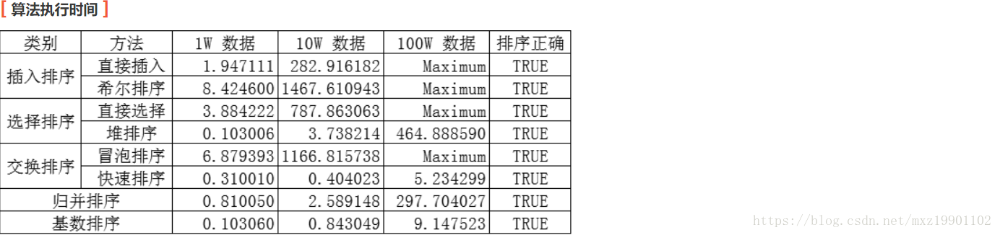
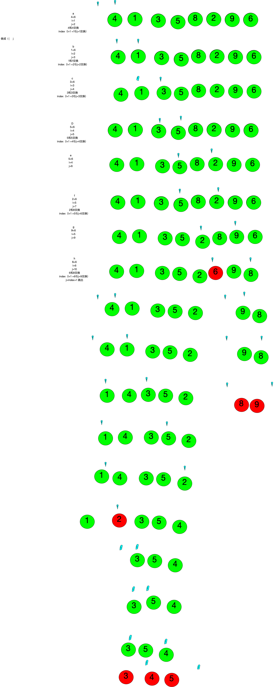
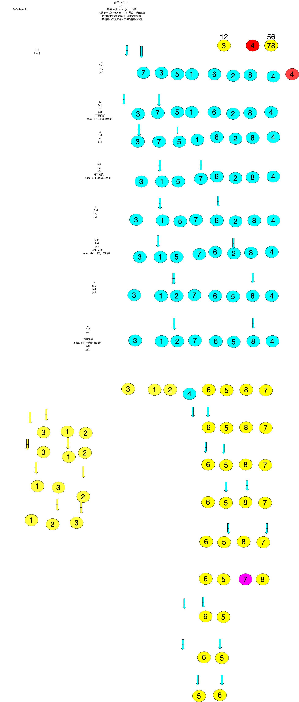
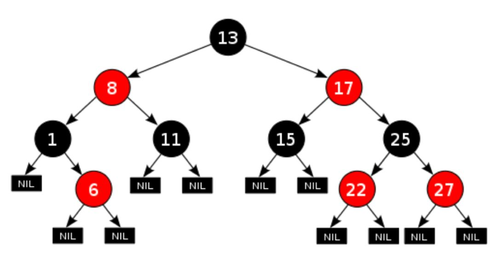
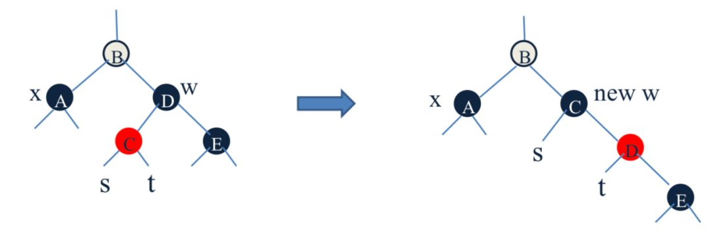

## ADS

Algorithms and Data Structures

算法和数据结构

graph: 关于图的各种数据结构和算法

search: 关于查找的各种数据结构和算法（二分查找/二叉排序树/红黑树/哈希表）

sort: 关于各种排序算法

string: 关于字符串的各种算法

other: 其他的一些数据结构

```
dataStructure
1.数据结构可视化-旧金山大学的网站
神软件
Data Structure Visualizations 数据结构可视化
https://www.cs.usfca.edu/~galles/visualization/Algorithms.html
2.Python语言参考
https://docs.python.org/3/reference/index.html
3.Python教程
https://docs.python.org/3/tutorial/index.html
```


1.各种排序的复杂度对比：


2.算法执行的时间：



3.排序的内存使用：


## 为什么要学习算法

计算机科学家经常通过经验学习。我们通过看别人解决问题和自己解决问题来学习。接触不同的问题解决技术，看不同的算法设计有助于我们承担下一个具有挑战性的问题。通过思考许多不同的算法，我们可以开始开发模式识别，以便下一次出现类似的问题时，我们能够更好地解决它。

算法通常彼此完全不同。考虑前面看到的 `sqrt` 的例子。完全可能的是，存在许多不同的方式来实现细节以计算平方根函数。一种算法可以使用比另一种更少的资源。一个算法可能需要 10 倍的时间来返回结果。我们想要一些方法来比较这两个解决方案。即使他们都工作，一个可能比另一个“更好”。我们建议使用一个更高效，或者一个只是工作更快或使用更少的内存的算法。当我们研究算法时，我们可以学习分析技术，允许我们仅仅根据自己的特征而不是用于实现它们的程序或计算机的特征来比较和对比解决方案。

在最坏的情况下，我们可能有一个难以处理的问题，这意味着没有算法可以在实际的时间量内解决问题。重要的是能够区分具有解决方案的那些问题，不具有解决方案的那些问题，以及存在解决方案但需要太多时间或其他资源来合理工作的那些问题。

经常需要权衡，我们需要做决定。作为计算机科学家，除了我们解决问题的能力，我们还需要了解解决方案评估技术。最后，通常有很多方法来解决问题。找到一个解决方案，我们将一遍又一遍比较，然后决定它是否是一个好的方案。


归并(nlogn)<希尔(nlog2n)<插入（n^2）

```python
python ./*.py

➜  p git:(master) ✗ python3 ./p.py
在p文件夹下，对p.py作出的处理
[0, 1, 2, 3, 4, 5, 6, 7, 8]
➜  p git:(master) ✗ python ./p.py 
[0, 1, 2, 3, 4, 5, 6, 7, 8]

>>> li = [1,2,3,4,5,6,7,8,9]
>>> [x**2 for x in li if x>5]
[36, 49, 64, 81]

>>> dict([(x,x*10) for x in li])
{1: 10, 2: 20, 3: 30, 4: 40, 5: 50, 6: 60, 7: 70, 8: 80, 9: 90}
>>> [(x,x*10) for x in li]
[(1, 10), (2, 20), (3, 30), (4, 40), (5, 50), (6, 60), (7, 70), (8, 80), (9, 90)]

>>> dict([(1,2)])
{1: 2}
数列转换成字典形式
>>> [(x, y) for x in range(10) if x % 2 if x > 3 for y in range(10) if y > 7 if y != 8]
[(5, 9), (7, 9), (9, 9)]
>>> [ (x, y) for x in range(10) if x % 2 if x > 3 for y in range(10) if y > 7 if y != 8 ]
[(5, 9), (7, 9), (9, 9)]

pip list --format=columns pip列表——format=列
```


**冒泡排序js**


找最大值，第二大的值。

简单来说就是比较前后，找到一个大的数再与其他后面的数比较，最后确定最大值；

举例子

``` 
1 5 7 6 3 2 9  (原始数据)
1 5 6 3 2 7 9 （选找到最大数据 5 6 7 9依次交换；找到9 ）
1 5 3 2 6 7 9 （找到7）
1 3 2 5 6 7 9	（找到6）
1 2 3 5 6 7 9 （找到5，无交换）
1 2 3 5 6 7 9 （1 2 比较）
```

```python
#  冒泡排序：它重复的走访过要排序的数列，一次比较两个元素，如果他们的顺序错误就把他们交换过来，走访数列的工作是重复的执行到没有再需要交换，也就是说该数列已经完成排序。
#时间复杂度 O(n^2)
#空间复杂度：O(1)
#稳定性：稳定

def bubble_sort(blist):
    count = len(blist)
    for i in range(0,count):
        for j in range(i+1,count):
            if blist[i] > blist[j]:
                blist[i],blist[j] = blist[j],blist[i]
    return blist

print(bubble_sort([4,5,6,7,34,8,2,3,1,0]))


# [0, 1, 2, 3, 4, 5, 6, 7, 8, 34]
# [Finished in 0.7s]
```

**列表推导式**


```python
列表推导式书写形式：　　

[表达式 for 变量 in 列表]    或者  
[表达式 for 变量 in 列表 if 条件]

testList = [1,2,3,4]
def mul2(x):
    return x*2
print([mul2(i) for i in testList])


```


```python
def ds(b):
	c=0
	[ b[i],b[j]=b[j],b[i] if b[i]>b[j] for i in range(len(b)) for j in range(i+1 , len(b))]
	return b
print(ds([1,6,3,2]))


# ( c= b[i],b[i]= b[j],b[j]=c)
b = [1,,6,3,2]
[b[i],b[j]=b[j],b[i] if b[i]>b[j] for i in range(len(b)) for j in range(i+1 , len(b))]
print(b)
```


## 1、冒泡排序（Bubble Sort）

冒泡排序是一种简单的排序算法。它重复地走访过要排序的数列，一次比较两个元素，如果它们的顺序错误就把它们交换过来。走访数列的工作是重复地进行直到没有再需要交换，也就是说该数列已经排序完成。这个算法的名字由来是因为越小的元素会经由交换慢慢“浮”到数列的顶端。 

<u>1.1 算法描述</u>

- 比较相邻的元素。如果第一个比第二个大，就交换它们两个；
- 对每一对相邻元素作同样的工作，从开始第一对到结尾的最后一对，这样在最后的元素应该会是最大的数；
- 针对所有的元素重复以上的步骤，除了最后一个；
- 重复步骤1~3，直到排序完成。

<u>1.3 代码实现(js)</u>

```js
function bubbleSort(arr) {
    var len = arr.length;
    for (var i = 0; i < len - 1; i++) {
        for (var j = 0; j < len - 1 - i; j++) {
            if (arr[j] > arr[j+1]) {        // 相邻元素两两对比
                var temp = arr[j+1];        // 元素交换
                arr[j+1] = arr[j];
                arr[j] = temp;
            }
        }
    }
    return arr;
}
```

## 2.插入排序

最前面两个先比较，然后第三个与前面做比较。

类似于冒泡排序；优化算法，如果加入一些判断，当做比较的时候，小于第一个数，或者大于最后一个数直接停止。

```
举例子
4 5 2 3 9 1
4 5 2 3 9 1 (5与4 比较，4的位置确定)
4 5 2 3 9 1 （2 与 4 5 分别比较，确定245）
2 4 5 3 9 1 （3与2 4 5 分别比较，确定2453）
2 3 4 5 9 1 （9与 5 比较 ，确定23459 ）
2 3 4 5 9 1	（1分别与1 2 3 4 5 9做比较）
1 2 3 4 5 9 （输出）  
```

```python
#1 插入排序:插入排序的基本操作就是将一个数据插入到已经排好序的有序数据中，从而得到一个新的，个数加1 的有序数据，算法用于少量数据的排序，首先将第一个作为已经排好序的，然后每次从后的取出插入到前面并排序。
''' 
时间复杂度 O(n^2)
空间复杂度：O(1)
稳定性：稳定
'''
def insert_sort(ilist):
    for i in range(len(ilist)):
        for j in range(i):
            if ilist[i] < ilist[j]:
                ilist.insert(j,ilist.pop(i))
                break
    return ilist

print(insert_sort([4,6,7,3,2,1,8,0]))

```

插入排序（Insertion-Sort）的算法描述是一种简单直观的排序算法。它的工作原理是通过构建有序序列，对于未排序数据，在已排序序列中从后向前扫描，找到相应位置并插入。

算法描述js

一般来说，插入排序都采用in-place在数组上实现。具体算法描述如下：

- 从第一个元素开始，该元素可以认为已经被排序；
- 取出下一个元素，在已经排序的元素序列中从后向前扫描；
- 如果该元素（已排序）大于新元素，将该元素移到下一位置；
- 重复步骤3，直到找到已排序的元素小于或者等于新元素的位置；
- 将新元素插入到该位置后；
- 重复步骤2~5。

 动图演示


代码实现js

```js
console.time()
function cr(){
	var j=1 
	var i=0
	if (num[i]>num[j]) {
		num[j] ^= num[i],num[i] ^= num[j],num[j] ^= num[i]
	}
    for(var j=1; j< num.length;j++){
      if(num[j-1] > num[j]  ){
      	for(var i=0;i<j;i++ ){
      		if (num[i]< num[j] && num[i+1]>num[j]) {
      			num[i+1] ^= num[j], num[j] ^= num[i+1], num[i+1] ^= num[j] 
            //换位置不是 插入排序
      		}
      	}
      }
	}
	return num
}
var num =  [5,2,8,3,7,9,4]
console.log(cr(num))


console.timeEnd()


//[ 2, 3, 4, 5, 7, 8, 9 ]
//default: 5.842ms
//[Finished in 0.1s]
```

js

```js
console.time()
function insertionSort(arr) {
    var len = arr.length;
    var preIndex, current;
    for (var i = 1; i < len; i++) {
        preIndex = i - 1;
        current = arr[i];
        while (preIndex >= 0 && arr[preIndex] > current) {
            arr[preIndex + 1] = arr[preIndex];
            preIndex--;
        }
        arr[preIndex + 1] = current;
    }
    return arr;
}

console.log(insertionSort([5,2,8,3,7,9,4]))

console.timeEnd()
// [ 2, 3, 4, 5, 7, 8, 9 ]
// default: 3.873ms
// [Finished in 0.1s]
```


算法分析

插入排序在实现上，通常采用in-place排序（即只需用到O(1)的额外空间的排序），因而在从后向前扫描过程中，需要反复把已排序元素逐步向后挪位，为最新元素提供插入空间。

## 3.快速排序（基于冒泡）

快速排序（Quick Sort）

快速排序的基本思想：通过一趟排序将待排记录分隔成独立的两部分，其中一部分记录的关键字均比另一部分的关键字小，则可分别对这两部分记录继续进行排序，以达到整个序列有序。

6.1 算法描述

快速排序使用分治法来把一个串（list）分为两个子串（sub-lists）。具体算法描述如下：

- 从数列中挑出一个元素，称为 “基准”（pivot）；
- 重新排序数列，所有元素比基准值小的摆放在基准前面，所有元素比基准值大的摆在基准的后面（相同的数可以到任一边）。在这个分区退出之后，该基准就处于数列的中间位置。这个称为分区（partition）操作；
- 递归地（recursive）把小于基准值元素的子数列和大于基准值元素的子数列排序。

确定元素的位置，从后往前；时间复杂度：最好和平均情况是O(nlogn)；最坏事O（n^2）(123456顺序数列)；适合超过100个数字排序。

```
规则：

如果 i= 0   ；
j= 1；
如果j>4,则index j+1；I不变
如果,j<=4,则index I++ j++  然后I+1与j交换
I所指定的位置都是小于4制定的位置
J所指定的位置都是大于4所指定的位置

```

```
规律
4>I
I<4<j
不是真正的指针，元素是存放在数组里面的，i和j定义为整数，为下标
左边都要是小于号，
右边是大于号
```


**时间复杂度**

```
第一次是n-1次
深度是 logn
一般来说是n（logn）
```

```
第一次是n-1次
深度是 n
是n^2
T(N) = O(N)+T(N-1)
=O(N)+O(N-1)+O(N-2)
=O(N)+O(N-1)+…+O(1)
=O(N^2)
这个好理解。
自身比较，n+ （n-1）+(n-2)+...+1 = n^2
```


**举例子**

```
7 3 5 1 6 2 8 4 
3 7 5 1 6 2 8 4 第一步，找位置 i为7前面，j为7上；第二步 ，7>4 ，则3为j，7 为 i；第三步，3<4 ，则交换
i   j
3 1 5 7 6 2 8 4 i+1与j+1交换
3 1 2 7 6 5 8 4
312 4 6587 最后确定4 的位置；分为2类 第一次
1 3 2 
1 2 3 末尾，就调整换 ；i+1 与j
6 5 8 7 
65 7 8  第二次分类
123 4 5678 结束
```

Python

```python
"""

 快速排序：是目前基于比较的内部排序中被认为是最好的方法，当待排序的关键字是随机分布时，快速排序的平均时间最短；

通过一趟排序将要排序的数据分割成独立的两部分，其中一部分的所有数据都比另外一部分的所有数据都要小，然后再按此方法对这两部分数据分别进行快速排序，整个排序过程可以递归进行，以此达到整个数据变成有序序列
时间复杂度：O(nlog₂n)
空间复杂度：O(nlog₂n)
稳定性：不稳定

"""
#快排的主函数，传入参数为一个列表，左右两端的下标
def QuickSort(array,leftIndex=0,rightIndex=None):
    #数组的长度
    arrayLen = len(array)
    #长度为1 的话 或者 空 的话 直接返回 数组
    if arrayLen <= 1:
        return array
    #程序一开始 如果没有给一个最右边的索引值导入话，那么我们就给它 赋值一个 就是数组的最右边的 那个索引值。
    if rightIndex == None:
        rightIndex = arrayLen - 1
    # 保护条件，只有满足  左边索引小于右边索引的时候 再开始排序
    if leftIndex < rightIndex:
        #找到 基准的 索引值 传入参数，通过Partitions函数，获取k下标值
        pivot = partition(array,leftIndex,rightIndex)
        #递归前后半区 对基准前面不部分继续快排
        QuickSort(array,leftIndex,pivot - 1)
        #对基准后半积分继续快排
        QuickSort(array,pivot + 1,rightIndex)

def partition(array,leftIndex,rightIndex):

    pivotValue = array[rightIndex]
    #将最左侧的 索引值 给 i
    i  = leftIndex
    #将最右侧的 索引的前一个 给j
    j = rightIndex -1
    #当left下标，小于right下标的情况下，此时判断二者移动是否相交，若未相交，则一直循环
    while i < j:
        # 当left对应的值大于锚点 基准点 参考值，就一直向左移动
        while j > leftIndex and array[j] > pivotValue:
            j -= 1
        #当left对应的值小于基准点参考值，就一直向右移动
        while i < rightIndex and array[i] <= pivotValue:
            i += 1
        #若移动完，二者仍未相遇则交换下标对应的值
        if i < j:
            array[j],array[i] = array[i],array[j]
            i+=1
            j-=1
    #若移动完，已经相遇，则交换right对应的值和参考值
    array[i],array[rightIndex] = array[rightIndex],array[i]
    # 返回 一个 索引值
    return i


if __name__ == '__main__':
    array = [14,33,27,10,35,19,42,44]
    QuickSort(array)
    print(array)
```

Python

```python

def QuickSort(array,leftIndex=0,rightIndex=None):
    arrayLen = len(array)
    if arrayLen <= 1:
        return array
    if rightIndex == None:
        rightIndex = arrayLen - 1
    if leftIndex < rightIndex:
        pivot = partition(array,leftIndex,rightIndex)
        QuickSort(array,leftIndex,pivot - 1)
        QuickSort(array,pivot + 1,rightIndex)

def partition(array,leftIndex,rightIndex):

    pivotValue = array[rightIndex]
    i  = leftIndex
    j = rightIndex -1
    while i < j:
        while j > leftIndex and array[j] > pivotValue:
            j -= 1
        while i < rightIndex and array[i] <= pivotValue:
            i += 1
        if i < j:
            array[j],array[i] = array[i],array[j]
            i+=1
            j-=1
    array[i],array[rightIndex] = array[rightIndex],array[i]
    return i

# 《算法导论》中的快排程序
def partition2(array,leftIndex,rightIndex):
    i = leftIndex -1
    for j in range(leftIndex,rightIndex):
        if array[j] < array[rightIndex]:
            array[j],array[i+1] = array[i+1],array[j]
            i += 1
    array[rightIndex],array[i+1] = array[i+1],array[rightIndex]
    return i+1


if __name__ == '__main__':
    array = [14,33,27,10,35,19,42,44]
    QuickSort(array)
    print(array)


#     [10, 14, 19, 27, 33, 35, 42, 44]
# [Finished in 0.4s]
```


## 3快速排序2

Python3

```python

# 《算法导论》中的快排程序
def partition2(array,leftIndex,rightIndex):
    #设置一个 左边的指针位置 为 左侧的 前一个
    i = leftIndex -1
    #遍历 除 基准数之外的 数
    for j in range(leftIndex,rightIndex):
        #比较 遍历的数 和 基准数 ，若是小于基准数 则 换到数组前面去
        if array[j] < array[rightIndex]:
            #交换位置，将遍历的比 基准数小的数 放到 我们指针 的 后一个上，然后 这个时候指针向后移一位。当遍历的数大于我们的基准数的时候，不移动，而且 指针也不发生变化，那么 当我们遍历完一圈以后，把 我们的基准数 放到 索引i 的后一个 位置，那么就形成了 一个 基准数 左边都是比它小的数，基准数右边 都是比它大的数 这样的模式。然后要把 索引 i 的后一个位置 作为基准数 与 原基准数 交换位置，进而可以第二次来 遍历比较。
            array[j],array[i+1] = array[i+1],array[j]
            i += 1
    #遍历完了以后，将 left 位置上的数 和 最后一个 数  即 right 上的数互换位置，就 重置 基准数了。
    array[rightIndex],array[i+1] = array[i+1],array[rightIndex]
    #返回基准的下标
    return i+1


```

```
时间复杂度
3+5+4+9= 21
```


**《算法导论》中的快排程序**

python

```js
def QuickSort(array,leftIndex,rightIndex):
   
    if leftIndex < rightIndex:
        pivot = partition(array,leftIndex,rightIndex)
        QuickSort(array,leftIndex,pivot - 1)
        QuickSort(array,pivot + 1,rightIndex)


def partition(array,leftIndex,rightIndex):
    i = leftIndex -1
    for j in range(leftIndex,rightIndex):
        if array[j] < array[rightIndex]:
            array[j],array[i+1] = array[i+1],array[j]
            i += 1
    array[rightIndex],array[i+1] = array[i+1],array[rightIndex]
    return i+1


if __name__ == '__main__':
    array = [14,33,27,10,35,19,42,44]
    QuickSort(array,0,7)
    print(array)


#     [10, 14, 19, 27, 33, 35, 42, 44]
# [Finished in 0.5s]
```








动图演示


 js代码实现

```js
function quickSort(arr, left, right) {
    var len = arr.length,
        partitionIndex,
        left = typeof left != 'number' ? 0 : left,
        right = typeof right != 'number' ? len - 1 : right;
 
    if (left < right) {
        partitionIndex = partition(arr, left, right);
        quickSort(arr, left, partitionIndex-1);
        quickSort(arr, partitionIndex+1, right);
    }
    return arr;
}
 
function partition(arr, left ,right) {     // 分区操作
    var pivot = left,                      // 设定基准值（pivot）
        index = pivot + 1;
    for (var i = index; i <= right; i++) {
        if (arr[i] < arr[pivot]) {
            swap(arr, i, index);
            index++;
        }       
    }
    swap(arr, pivot, index - 1);
    return index-1;
}
 
function swap(arr, i, j) {
    var temp = arr[i];
    arr[i] = arr[j];
    arr[j] = temp;
}
```


## 4.并排排序

大数据里面 Hadoop计算Map-reduce的思想；1变多是map；多变1是reduce

map 先对数据 分成一个一个；/或者2个2个 ；拆分是logn 。

然后 两两排序；之后 另外两个分别与这两个排序；每次是n次 

举例子

```
3425176
3 42 51 76
3 4 2 5 1 7 6		每一个都是泡脚序的（扩散）；以空间换时间？
3 24 15 67
234 1567 结束
时间复杂度：（n-1）*（logn+1） = nlogn +n-logn+1 取最大项
```

```python
#      当n较大，则应采用时间复杂度为O(nlog2n)的排序方法：快速排序、堆排序或归并排序序。

"""
归并排序：采用分治法（Divide and Conquer）的一个非常典型的应用。将已有序的子序列合并，得到完全有序的序列；即先使每个子序列有序，再使子序列段间有序。若将两个有序表合并成一个有序表，称为二路归并

时间复杂度：O(nlog₂n)
空间复杂度：O(1)
稳定性：稳定

"""

# 归并排序 Merge_Sort

def MergeSort(arrayList):
    arrayLen = len(arrayList)
    #判断输入参数的正确性,如果长度小于1，就说明为1
    if arrayLen <= 1:
        return arrayList
    midIndex = arrayLen//2
    #左边的部分去做 MergeSort
    leftArray = MergeSort(arrayList[:midIndex])
    #右边的去做 MergeSort
    rightArray = MergeSort(arrayList[midIndex:])
    #将左右两边合并，称为一个新的数组，并已经排序成功
    retArray = MergeCore(leftArray,rightArray)
    return retArray

def MergeCore(leftArray,rightArray):
    #首先需要定义两个指针,这两个指针，分别指向这两个数组的第一个元素
    leftIndex = 0
    rightIndex = 0
    #获取两个数组的长度，用于指出上面两个指针的边界是什么
    leftLen = len(leftArray)
    rightLen = len(rightArray)
    #定义一个返回的列表,这一步就代表空间复杂度至少是 O(n)
    retList = []
    #循环两个数组寻找最小值加入到返回值的数组中
    while leftIndex < leftLen and rightIndex < rightLen:
        if leftArray[leftIndex] < rightArray[rightIndex]:
            retList.append(leftArray[leftIndex])
            leftIndex += 1
        else:
            retList.append(rightArray[rightIndex])
            rightIndex += 1
    #下面的代码是将剩余的数组中内容放置在返回的数组中
    retList.extend(leftArray[leftIndex:])

    # while leftIndex < leftLen:
    #     retList.append(leftArray[leftIndex])
    #     leftIndex += 1

    retList.extend(rightArray[rightIndex:])

    # while rightIndex < rightLen:
    #     retList.append(rightArray[rightIndex])
    #     rightIndex += 1
    return retList


if __name__ == '__main__':
    # 14,33,27,10,35,19,42,44

    retList = MergeSort([14,33,27,10,35,19,42,44])
    print(retList)
```


归并排序是建立在归并操作上的一种有效的排序算法。该算法是采用分治法（Divide and Conquer）的一个非常典型的应用。将已有序的子序列合并，得到完全有序的序列；即先使每个子序列有序，再使子序列段间有序。若将两个有序表合并成一个有序表，称为2-路归并。 

**归并排序（Merge Sort） 算法描述**

- 把长度为n的输入序列分成两个长度为n/2的子序列；
- 对这两个子序列分别采用归并排序；
- 将两个排序好的子序列合并成一个最终的排序序列。

**归并排序（Merge Sort）动图演示**


<u>归并排序（Merge Sort）代码实现</u>

```js
function mergeSort(arr) {
    var len = arr.length;
    if (len < 2) {
        return arr;
    }
    var middle = Math.floor(len / 2),
        left = arr.slice(0, middle),
        right = arr.slice(middle);
    return merge(mergeSort(left), mergeSort(right));
}
 
function merge(left, right) {
    var result = [];
 
    while (left.length>0 && right.length>0) {
        if (left[0] <= right[0]) {
            result.push(left.shift());
        } else {
            result.push(right.shift());
        }
    }
 
    while (left.length)
        result.push(left.shift());
 
    while (right.length)
        result.push(right.shift());
 
    return result;
}
```

**归并排序（Merge Sort）算法分析**

归并排序是一种稳定的排序方法。和选择排序一样，归并排序的性能不受输入数据的影响，但表现比选择排序好的多，因为始终都是O(nlogn）的时间复杂度。代价是需要额外的内存空间。

## 5.选择排序(发展成堆)

选择排序同样是一个比较简单的排序算法，这个算法也是要维护两个部分的数组。第一个部分的数组是已经排好序的数组，另一部分是没有排好序的数组。初始的时候是排好序的部分是空，没有排序的部分是整个数组。

选择排序的主要的工作流程就是，在没排好序的数组中，找到最小的那个值，然后和没排好序的最左边的那个数字进行交换。这样再将最左边的那个元素纳入到已经排好序的那个队列中，就能够将排好序的序列增大一个元素，而没排好序的序列减少一个元素。插入排序的时间复杂度依然是O(n^2)，不适合大量数据的排序。

再次应用我们之前的那个没有排序的数组来看选择排序的过程。

举例子

```
14 33 27 10 35 19 42 44
14 33 27 10 35 19 42 44
（上面）一开始，没排序的最左边是14这个元素，然后寻找整个没有排序的数组中哪个是最小的元素，发现是10这个元素
10 33 27 14 （35 19 42 44）			交换10和14，在交换之后，排序的序列就出现了，只有一个元素是10
10 33 27 14（35 19 42 44）
然后继续选取没有排序的数组的最左侧，是33，然后寻找整个没有排序的数组，发现最小的那个值是14。
10 14 27 33（35 19 42 44）

```


```python
# 选择排序 ： 第一趟，在待排序记录r1 。。。r(n)中选出最小的记录，将它与r1 交换，第二趟，在待排序记录r2 ~ r(n) 中选出最小的记录，将它与 r2 交换，以此类推，第i趟在待排序记录 r[i]~r[n]中选出最小的记录，将它与r[i]交换，使有序序列不断增长直到全部排序完毕。

#时间复杂度 O(n^2)
#空间复杂度：O(1)
#稳定性：不稳定

def select_sort(slist):
    #外层循环控制循环次数
    for i in range(len(slist)):
        #假设找到的最小元素下标为j
        x = i
        #寻找最小元素的过程
        for j in range(i,len(slist)):
            #假设最小下标的值，大于循环中一个元素，那么就改变最小值的下标
            if slist[j] < slist[x]:
                x = j
        #循环一开始就假设把最小值的下标赋值给变量 x
        # 在不停的循环中，不停的交换两个不一样大小的值
        slist[i],slist[x] = slist[x],slist[i]
    #返回 排好序的列表
    return slist


if __name__ == '__main__':
    arrayList = [4,5,6,7,3,2,6,9,8]
    select_sort(arrayList)
    print(arrayList)
```


<u>选择排序（Selection Sort）js</u>

选择排序(Selection-sort)是一种简单直观的排序算法。它的工作原理：首先在未排序序列中找到最小（大）元素，存放到排序序列的起始位置，然后，再从剩余未排序元素中继续寻找最小（大）元素，然后放到已排序序列的末尾。以此类推，直到所有元素均排序完毕。 

<u>2.1 算法描述</u>

n个记录的直接选择排序可经过n-1趟直接选择排序得到有序结果。具体算法描述如下：

- 初始状态：无序区为R[1..n]，有序区为空；
- 第i趟排序(i=1,2,3…n-1)开始时，当前有序区和无序区分别为R[1..i-1]和R(i..n）。该趟排序从当前无序区中-选出关键字最小的记录 R[k]，将它与无序区的第1个记录R交换，使R[1..i]和R[i+1..n)分别变为记录个数增加1个的新有序区和记录个数减少1个的新无序区；
- n-1趟结束，数组有序化了。

**2.2 动图演示**

　　

2.3 代码实现

```js
function selectionSort(arr) {
    var len = arr.length;
    var minIndex, temp;
    for (var i = 0; i < len - 1; i++) {
        minIndex = i;
        for (var j = i + 1; j < len; j++) {
            if (arr[j] < arr[minIndex]) {     // 寻找最小的数
                minIndex = j;                 // 将最小数的索引保存
            }
        }
        temp = arr[i];
        arr[i] = arr[minIndex];
        arr[minIndex] = temp;
    }
    return arr;
} 
```

2.4 算法分析

表现最稳定的排序算法之一，因为无论什么数据进去都是O(n2)的时间复杂度，所以用到它的时候，数据规模越小越好。唯一的好处可能就是不占用额外的内存空间了吧。理论上讲，选择排序可能也是平时排序一般人想到的最多的排序方法了吧。

## 6.希尔排序（基于插入）

最好的时间复杂度：O（log2n） shell排序

python中的集合set就是哈希排序

希尔排序是一种高效的排序方式，它是基于插入排序的一种排序算法。它相比插入排序能够有效的避免大量的移动操作。

这种算法使用插入排序，只是比较的时候使用的是很远的数据进行比较，然后将它们排序。这个比较远的距离是通过下面的计算式子得出的：

```
h = h * 3 + 1  （总结出来的经验。。。）
```

这种算法的时间复杂度是 O(n^2) ~ O(n*log2n).	

下面介绍这个希尔排序：

我们先通过之前的例子再次看下希尔排序的工作方式。首先是计算h的值，h是从1开始的，带入上面的公式发现，h=4. 然后就发现 4 这个值小于数组长度 8.

然后继续计算h的值，带入上面的公式得出，h=13. 大于了数组的长度8.由此可知，我们的初始距离就应该选择4.  那么下面的数组就能够被分成四组分别排序。{35, 14}, {33, 19}, {42, 27}, {10, 44}


然后就是比较每组内的这两个数，如果发现不是升序排列的，就交换这两个数字。那么第一次交换以后的模样应该是：14 19 27 10 35 33 42 44

那下一次的h的值就是1了，所以我们按照间隔1分组，就会分成一组，那么就是按照上面的数组进行插入排序，如下图：

先分割之后（取间隔） ，然后再进行插入排序；解决，大量元素的挪动；


```python
#4 希尔排序 ： 希尔排序 是把记录按下标的一定增量分组，对每组使用直接插入排序算法排序；随着增量逐渐减少，每组包含的关键词越来越多，当增量减至1时，整个文件恰好被分成一组，算法终止

#时间复杂度 O(n^2)
#空间复杂度：O(nlogn)  
#稳定性：不稳定

def shell_sort(slist):
    count = len(slist)
    step = 2
    group = count // step
    while group>0:
        for i in range(group):
            j = i + group
            while j < count:
                key = slist[j]
                k = j - group
                while k >= 0:
                    if slist[k] > key:
                        slist[k+group] = slist[k]
                        slist[k] = key
                    k = k - group
                j = j + group
        group = group // step
    return slist

# print(shell_sort([4,5,7,3,2,6,9,8,0]))
# -----------------------------------
def ShellSort(arrList):
    arrayLen = len(arrList)
    h = 1
    while h < arrayLen//3:
        h = h * 3 + 1
        #插入排序的方法，判断是不是后一个比前一个要小
        #如果是则交换
    while h >= 1:
        for i in range(h,arrayLen):
            j = i
            while j >= h and arrList[j] < arrList[j-h]:
                arrList[j] ,arrList[j-h] = arrList[j-h],arrList[j]
                j -= h
        h  //= 3


if __name__ == '__main__':
    arrList = [14,33,27,10,35,19,42,44]
    ShellSort(arrList)
    print(arrList)
```


希尔排序（Shell Sort）

1959年Shell发明，第一个突破O(n2)的排序算法，是简单插入排序的改进版。它与插入排序的不同之处在于，它会优先比较距离较远的元素。希尔排序又叫**缩小增量排序**。

 **希尔排序（Shell Sort）算法描述**

先将整个待排序的记录序列分割成为若干子序列分别进行直接插入排序，具体算法描述：

- 选择一个增量序列t1，t2，…，tk，其中ti>tj，tk=1；
- 按增量序列个数k，对序列进行k 趟排序；
- 每趟排序，根据对应的增量ti，将待排序列分割成若干长度为m 的子序列，分别对各子表进行直接插入排序。仅增量因子为1 时，整个序列作为一个表来处理，表长度即为整个序列的长度。

**希尔排序（Shell Sort）动图演示**


希尔排序（Shell Sort） 代码实现js

```js
function shellSort(arr) {
    var len = arr.length;
    for (var gap = Math.floor(len / 2); gap > 0; gap = Math.floor(gap / 2)) {
        // 注意：这里和动图演示的不一样，动图是分组执行，实际操作是多个分组交替执行
        for (var i = gap; i < len; i++) {
            var j = i;
            var current = arr[i];
            while (j - gap >= 0 && current < arr[j - gap]) {
                 arr[j] = arr[j - gap];
                 j = j - gap;
            }
            arr[j] = current;
        }
    }
    return arr;
}
```

**希尔排序（Shell Sort） 算法分析**

希尔排序的核心在于间隔序列的设定。既可以提前设定好间隔序列，也可以动态的定义间隔序列。动态定义间隔序列的算法是《算法（第4版）》的合著者Robert Sedgewick提出的。　


## 海量数据处理

----外部归并排序 - 分治.cppp

分治包括 大数据的 map-reduce和 归并排序的思想，把一个大问题，分解成很多很多小问题，然后再合并。


数据结构与算法处理的都是大数据，大量的数据。现在有100亿的数字排序，100亿个 int 型数字放在文件里面大概有 37.2GB，非常大，内存一次装不下了。那么肯定是要拆分成小的文件一个一个来处理，最终在合并成一个排好序的大文件。

**实现思路**

1.把这个37GB的大文件，用哈希分成1000个小文件，每个小文件平均38MB左右（理想情况），把100亿个数字对1000取模，模出来的结果在0到999之间，每个结果对应一个文件，所以我这里取的哈希函数是 h = x % 1000，哈希函数取得”好”，能使冲突减小，结果分布均匀。

2.拆分完了之后，得到一些几十MB的小文件，那么就可以放进内存里排序了，可以用快速排序，归并排序，堆排序等等。

3.1000个小文件内部排好序之后，就要把这些内部有序的小文件，合并成一个大的文件，可以用二叉堆来做1000路合并的操作，每个小文件是一路，合并后的大文件仍然有序。
首先遍历1000个文件，每个文件里面取第一个数字，组成 (数字, 文件号) 这样的组合加入到堆里（假设是从小到大排序，用小顶堆），遍历完后堆里有1000个 (数字，文件号) 这样的元素
然后不断从堆顶拿元素出来，每拿出一个元素，把它的文件号读取出来，然后去对应的文件里，加一个元素进入堆，直到那个文件被读取完。拿出来的元素当然追加到最终结果的文件里。
按照上面的操作，直到堆被取空了，此时最终结果文件里的全部数字就是有序的了。
最后我用c++写了个实验程序，具体代码在这里可以看到。

如**何拆分大文件？**

一个32G的大文件，用fopen()打开不会全部加载到内存的，然后for循环遍历啊，把每个数字对1000取模，会得到0到999种结果，然后每种结果在写入到新的文件中，就拆分了

对 2 亿个数字进行排序, 约 10 G 的文件, 每个数字 int 能表示；


**c语言**

```c
// 算法流程
 // 将 10 G 的文件散列到 300 个文件中, 每个文件大约 35 MB
 // 对 35 MB 的小文件内部排序, 或者分发到多台计算机中, 并行处理 MapReduce
 // 最后使用最小堆, 进行 300 路归并排序, 合成大文件
 // 再写一个算法判断 2 亿个数字是否有序
  
 #include <stdio.h>
 	#include <stdlib.h>
 	#include <time.h>
 	#include <io.h>
 	#include <queue>
 
 	#define FILE_NUM 300 // 哈希文件数
 	#define HASH(a) (a % FILE_NUM)

 	int num = 6000000; // 2 亿个数字, 手动改
 	char path[20] = "c:\\data.dat"; // 待排文件
 	char result[20] = "c:\\result.dat"; // 排序后文件
 	char tmpdir[100] = "c:\\hashfile"; // 临时目录
 	22	 
 	// 随机生成 2 亿个数字
 	int write_file(void)
 	{
 	　　FILE *out = NULL;
 	　　int i;
 	 
 	　　printf("\n正在生成 %d 个数字...\n\n", num);
 		　　out = fopen(path, "wt");
 　if (out == NULL) return 0;
 		 
 		　　unsigned int s, e;
 		　　e = s = clock();
 		　　for (i=0; i<num; i++)
 		　　{
 		　　　　e = clock();
 		　　　　if (e - s > 1000) // 计算进度
 		　　　　{
 		　　　　　　printf("\r处理进度 %0.2f %%\t", (i * 100.0) / num);
 		　　　　　　s = e;
 		　　　　}
 		　　　　fprintf(out, "%d\n",
 		　　　　　　　　(rand() % 31623) * (rand() % 31623));
 		　　}
 		　　fclose(out);
 		　　return 1;
 		}
 		 
 		// 对 2 亿个数字进行哈希, 分散到子文件中
 		// 入口参数: path, tmpdir
 		int map(void)
 		{
 		　　FILE *in = NULL;
 		　　FILE *tmp[FILE_NUM + 5];
 		　　char hashfile[512]; // 哈希文件地址
 		　　int data, add;
 		　　int i;
 		 
 		　　printf("\r正在哈希 %s\n\n", path);
 		　　in = fopen(path, "rt");
 		　　if (in == NULL) return 0;
 		　　for (i=0; i<FILE_NUM; i++) tmp[i] = NULL;
 		 
 		　　// 开始哈希, 核心代码要尽可能的加速
 		　　unsigned int s, e;
 		　　e = s = clock();
 		　　i = 0;
 		　　while (fscanf(in, "%d", &data) != EOF)
 		　　{
 		　　　　add = HASH(data);
 		　　　　if (tmp[add] == NULL)
 		　　　　{
 		　　　　　　sprintf(hashfile, "%s\\hash_%d.~tmp", tmpdir, add);
 		　　　　　　tmp[add] = fopen(hashfile, "a");
 		　　　　}
 		　　　　fprintf(tmp[add], "%d\n", data);
 		 
 		　　　　i++;
 		　　　　e = clock(); // 计算进度
 		　　　　if (e - s > 1000)
 		　　　　{
 		　　　　　　printf("\r处理进度 %0.2f %%\t", (i * 100.0) / num);
 		　　　　　　s = e;
 		　　　　}
 		}　
 		　　for (i=0; i<FILE_NUM; i++)
 		　　if (tmp[i]) fclose(tmp[i]);
 		　　fclose(in);
 		 
 		　　return 1;
 		}
 		 
 		// 对 300 个文件逐个排序, 采用堆排序 STL 的优先队列
 		void calc(void)
 		{
 		　　int fileexist(char *path); // 判断文件存在
 		　　std::priority_queue<int> q; // 堆排序
 		　　char hashfile[512];
 		　　FILE *fp = NULL;
 		　　int i, data;
 		 
 		　　// 逐个处理 300 个文件, 或者将这些文件发送到其它计算机中并行处理
 		　　for (i=0; i<FILE_NUM; i++)
 		　　{
 		　　　　sprintf(hashfile, "%s\\hash_%d.~tmp", tmpdir, i);
 		　　　　if (fileexist(hashfile))
 		　　　　{
 		　　　　　　printf("\r正在排序 hash_%d.~tmp\t", i);
 		 
 		　　　　　　// 小文件从磁盘加入内存中
 		　　　　　　fp = fopen(hashfile, "rt");
 		　　　　　　while (fscanf(fp, "%d", &data) != EOF)
 		　　　　　　{
 		　　　　　　　　q.push(data);
 		　　　　　　　　// 优先队列默认是大顶堆, 即降序排序
 		　　　　　　　　// 要升序需要重载 () 运算符
 		　　　　　　}
 		　　　　　　fclose(fp);
 		 
 		　　　　　　// 排序后再从内存写回磁盘
 		　　　　　　fp = fopen(hashfile, "wt"); // 覆盖模式写
 		　　　　　　while (!q.empty())
 		　　　　　　{
 		　　　　　　　　fprintf(fp, "%d\n", q.top());
 		　　　　　　　　q.pop();
 		　　　　　　}
 		　　　　　　fclose(fp);
 		　　　　}
 		　　}
 		}
 		 
 		typedef struct node // 队列结点
 	{
 		　　int data;
 		　　int id; // 哈希文件的编号
 		　　bool operator < (const node &a) const
 		　　{ return data < a.data; }
 		}node;
 		 
 		// 将 300 个有序文件合并成一个文件, K 路归并排序
 		int reduce(void)
 		{
 		　　int fileexist(char *path);
 		　　std::priority_queue<node> q; // 堆排序
 		　　FILE *file[FILE_NUM + 5];
 		　　FILE *out = NULL;
 		　　char hashfile[512];
 		　　node tmp, p;
 		　　int i, count = 0;
 		 
 		　　printf("\r正在合并 %s\n\n", result);
 		　　out = fopen(result, "wt");
 		　　if (out == NULL) return 0;
 		　　for (i=0; i<FILE_NUM; i++) file[i] = NULL;
 		　　for (i=0; i<FILE_NUM; i++) // 打开全部哈希文件
 		　　{
 		　　　　sprintf(hashfile, "%s\\hash_%d.~tmp", tmpdir, i);
 		　　　　if (fileexist(hashfile))
 		　　　　{
 	　　　　　　file[i] = fopen(hashfile, "rt");
 		　　　　　　fscanf(file[i], "%d", &tmp.data);
 		　　　　　　tmp.id = i;
 		　　　　　　q.push(tmp); // 初始化队列
 		　　　　　　count++; // 计数器
 		　　　　　　printf("\r入队进度 %0.2f %%\t", (count * 100.0) / FILE_NUM);
 		　　　　}
 		　　}
 		　　unsigned int s, e;
 		　　e = s = clock();
 		　　while (!q.empty()) // 开始 K 路归并
 		　　{
 	　　　　tmp = q.top();
 		　　　　q.pop();
 		　　　　// 将堆顶的元素写回磁盘, 再从磁盘中拿一个到内存
 		　　　　fprintf(out, "%d\n", tmp.data);
 		　　　　if (fscanf(file[tmp.id], "%d", &p.data) != EOF)
 		　　　　{
 		　　　　　　p.id = tmp.id;
 		　　　　　　q.push(p);
 		　　　　　　count++;
 		　　　　}
 		 
 		　　　　e = clock(); // 计算进度
 		　　　　if (e - s > 1000)
 		　　　　{
 		　　　　　　printf("\r处理进度 %0.2f %%\t", (count * 100.0) / num);
 		　　　　　　s = e;
 		　　　　}
 		　　}
 	　　for (i=0; i<FILE_NUM; i++)
 	　　if (file[i]) fclose(file[i]);
 	　　fclose(out);
 	 
 	　　return 1;
 	}
 	 
 	int check(void) // 检查是否降序排序
 	{
 	　　FILE *in = NULL;
 	　　int max = 0x7FFFFFFF;
 	　　int data;
 	　　int count = 0;
 	 
 	　　printf("\r正在检查文件正确性...\n\n");
 	　　in = fopen(result, "rt");
 	　　if (in == NULL) return 0;
 	 
 	　　unsigned int s, e;
 	　　e = s = clock();
 	　　while (fscanf(in, "%d", &data) != EOF)
 	　　{
 	　　　　if (data <= max) max = data;
 	　　　　else
 	　　　　{
 	　　　　　　fclose(in);
 	　　　　　　return 0;
 	　　　　}
 	　　　　count++;
 	　　　　e = clock(); // 计算进度
 	　　　　if (e - s > 1000)
 	　　　　{
 	　　　　　　printf("\r处理进度 %0.2f %%\t", (count * 100.0) / n
 	　　　　　　s = e;
 	　　　　}
 	　　}
 	　　fclose(in);
 	　　return 1;
 	}
 	 
 	// 判断文件存在
 	int fileexist(char *path)
 	{
 	　　FILE *fp = NULL;
 	 
 	　　fp = fopen(path, "rt");
 	　　if (fp)
 	　　{
 	　　　　fclose(fp);
 	　　　　return 1;
 	　　}
 	　　else return 0;
 	}
 	 
 	int main(void)
 	{
 	　　char cmd_del[200]; // 删除目录
 	　　char cmd_att[200]; // 设置隐藏
 	　　char cmd_mkdir[200]; // 建立目录
 	 
 	　　// 初始化 cmd 命令, 建立工作目录
 	　　sprintf(cmd_del, "rmdir /s /q %s", tmpdir);
 	　　sprintf(cmd_att, "attrib +h %s", tmpdir);
 	　　sprintf(cmd_mkdir, "mkdir %s", tmpdir);
 	　　if (access(path, 0) == 0) system(cmd_del);
 	　　system(cmd_mkdir); // 建立工作目录
 	　　system(cmd_att); // 隐藏目录
 	 
 	　　// 随机生成 2 亿个数字
 	　　if (!write_file()) return 0;
 	 
 	　　map(); // 对 2 亿个数字进行哈希, 即 Map
 	　　calc(); // 对 300 个文件逐个排序
 	　　reduce(); // 最后将 300 个有序文件合并成一个文件, 即 reduce
 	　　if (check()) printf("\r排序正确!\t\t\t\n\n");
 	　　else printf("\r排序错误!\t\t\t\n\n");
 	 
 	　　system(cmd_del); // 删除哈希文件
 	　　remove(path); // 删除 2 亿数字文件
 	　　remove(result); // 删除排序后的文件
 	 
 		　　return 0;
 	}
```


## 7、堆排序（Heap Sort）

堆排序（Heapsort）是指利用堆这种数据结构所设计的一种排序算法。堆积是一个近似完全二叉树的结构，并同时满足堆积的性质：即子结点的键值或索引总是小于（或者大于）它的父节点。

7.1 算法描述

- 将初始待排序关键字序列(R1,R2….Rn)构建成大顶堆，此堆为初始的无序区；
- 将堆顶元素R[1]与最后一个元素R[n]交换，此时得到新的无序区(R1,R2,……Rn-1)和新的有序区(Rn),且满足R[1,2…n-1]<=R[n]；
- 由于交换后新的堆顶R[1]可能违反堆的性质，因此需要对当前无序区(R1,R2,……Rn-1)调整为新堆，然后再次将R[1]与无序区最后一个元素交换，得到新的无序区(R1,R2….Rn-2)和新的有序区(Rn-1,Rn)。不断重复此过程直到有序区的元素个数为n-1，则整个排序过程完成。

7.2 动图演示


7.3 代码实现js

```js
var len;    // 因为声明的多个函数都需要数据长度，所以把len设置成为全局变量
 
function buildMaxHeap(arr) {   // 建立大顶堆
    len = arr.length;
    for (var i = Math.floor(len/2); i >= 0; i--) {
        heapify(arr, i);
    }
}
 
function heapify(arr, i) {     // 堆调整
    var left = 2 * i + 1,
        right = 2 * i + 2,
        largest = i;
 
    if (left < len && arr[left] > arr[largest]) {
        largest = left;
    }
 
    if (right < len && arr[right] > arr[largest]) {
        largest = right;
    }
 
    if (largest != i) {
        swap(arr, i, largest);
        heapify(arr, largest);
    }
}
 
function swap(arr, i, j) {
    var temp = arr[i];
    arr[i] = arr[j];
    arr[j] = temp;
}
 
function heapSort(arr) {
    buildMaxHeap(arr);
 
    for (var i = arr.length - 1; i > 0; i--) {
        swap(arr, 0, i);
        len--;
        heapify(arr, 0);
    }
    return arr;
}
```


## 8、计数排序（Counting Sort）

计数排序不是基于比较的排序算法，其核心在于将输入的数据值转化为键存储在额外开辟的数组空间中。 作为一种线性时间复杂度的排序，计数排序要求输入的数据必须是有确定范围的整数。

8.1 算法描述

- 找出待排序的数组中最大和最小的元素；
- 统计数组中每个值为i的元素出现的次数，存入数组C的第i项；
- 对所有的计数累加（从C中的第一个元素开始，每一项和前一项相加）；
- 反向填充目标数组：将每个元素i放在新数组的第C(i)项，每放一个元素就将C(i)减去1。

8.2 动图演示


8.3 代码实现

```js
function countingSort(arr, maxValue) {
    var bucket = new Array(maxValue + 1),
        sortedIndex = 0;
        arrLen = arr.length,
        bucketLen = maxValue + 1;
 
    for (var i = 0; i < arrLen; i++) {
        if (!bucket[arr[i]]) {
            bucket[arr[i]] = 0;
        }
        bucket[arr[i]]++;
    }
 
    for (var j = 0; j < bucketLen; j++) {
        while(bucket[j] > 0) {
            arr[sortedIndex++] = j;
            bucket[j]--;
        }
    }
 
    return arr;
}
```

8.4 算法分析

计数排序是一个稳定的排序算法。当输入的元素是 n 个 0到 k 之间的整数时，时间复杂度是O(n+k)，空间复杂度也是O(n+k)，其排序速度快于任何比较排序算法。当k不是很大并且序列比较集中时，计数排序是一个很有效的排序算法。

## 9、桶排序（Bucket Sort）

桶排序是计数排序的升级版。它利用了函数的映射关系，高效与否的关键就在于这个映射函数的确定。桶排序 (Bucket sort)的工作的原理：假设输入数据服从均匀分布，将数据分到有限数量的桶里，每个桶再分别排序（有可能再使用别的排序算法或是以递归方式继续使用桶排序进行排）。

9.1 算法描述

- 设置一个定量的数组当作空桶；
- 遍历输入数据，并且把数据一个一个放到对应的桶里去；
- 对每个不是空的桶进行排序；
- 从不是空的桶里把排好序的数据拼接起来。 

9.2 图片演示


9.3 代码实现

```js
function bucketSort(arr, bucketSize) {
    if (arr.length === 0) {
      return arr;
    }
 
    var i;
    var minValue = arr[0];
    var maxValue = arr[0];
    for (i = 1; i < arr.length; i++) {
      if (arr[i] < minValue) {
          minValue = arr[i];                // 输入数据的最小值
      } else if (arr[i] > maxValue) {
          maxValue = arr[i];                // 输入数据的最大值
      }
    }
 
    // 桶的初始化
    var DEFAULT_BUCKET_SIZE = 5;            // 设置桶的默认数量为5
    bucketSize = bucketSize || DEFAULT_BUCKET_SIZE;
    var bucketCount = Math.floor((maxValue - minValue) / bucketSize) + 1;  
    var buckets = new Array(bucketCount);
    for (i = 0; i < buckets.length; i++) {
        buckets[i] = [];
    }
 
    // 利用映射函数将数据分配到各个桶中
    for (i = 0; i < arr.length; i++) {
        buckets[Math.floor((arr[i] - minValue) / bucketSize)].push(arr[i]);
    }
 
    arr.length = 0;
    for (i = 0; i < buckets.length; i++) {
        insertionSort(buckets[i]);                      // 对每个桶进行排序，这里使用了插入排序
        for (var j = 0; j < buckets[i].length; j++) {
            arr.push(buckets[i][j]);                     
        }
    }
 
    return arr;
}
```

9.4 算法分析

桶排序最好情况下使用线性时间O(n)，桶排序的时间复杂度，取决与对各个桶之间数据进行排序的时间复杂度，因为其它部分的时间复杂度都为O(n)。很显然，桶划分的越小，各个桶之间的数据越少，排序所用的时间也会越少。但相应的空间消耗就会增大。 

## 10、基数排序（Radix Sort）

基数排序是按照低位先排序，然后收集；再按照高位排序，然后再收集；依次类推，直到最高位。有时候有些属性是有优先级顺序的，先按低优先级排序，再按高优先级排序。最后的次序就是高优先级高的在前，高优先级相同的低优先级高的在前。

10.1 算法描述

- 取得数组中的最大数，并取得位数；
- arr为原始数组，从最低位开始取每个位组成radix数组；
- 对radix进行计数排序（利用计数排序适用于小范围数的特点）；

10.2 动图演示

 

10.3 代码实现

```js
var counter = [];
function radixSort(arr, maxDigit) {
    var mod = 10;
    var dev = 1;
    for (var i = 0; i < maxDigit; i++, dev *= 10, mod *= 10) {
        for(var j = 0; j < arr.length; j++) {
            var bucket = parseInt((arr[j] % mod) / dev);
            if(counter[bucket]==null) {
                counter[bucket] = [];
            }
            counter[bucket].push(arr[j]);
        }
        var pos = 0;
        for(var j = 0; j < counter.length; j++) {
            var value = null;
            if(counter[j]!=null) {
                while ((value = counter[j].shift()) != null) {
                      arr[pos++] = value;
                }
          }
        }
    }
    return arr;
}
```

10.4 算法分析

基数排序基于分别排序，分别收集，所以是稳定的。但基数排序的性能比桶排序要略差，每一次关键字的桶分配都需要O(n)的时间复杂度，而且分配之后得到新的关键字序列又需要O(n)的时间复杂度。假如待排数据可以分为d个关键字，则基数排序的时间复杂度将是O(d*2n) ，当然d要远远小于n，因此基本上还是线性级别的。

基数排序的空间复杂度为O(n+k)，其中k为桶的数量。一般来说n>>k，因此额外空间需要大概n个左右。


## 树（二叉树）

二叉查找树

我们已经看到了两种不同的方法来获取集合中的键值对。回想一下，这些集合实现了 `map` 抽象数据类型。我们讨论的 `map` ADT 的两个实现是在列表和哈希表上的二分搜索。在本节中，我们将研究二叉查找树作为从键映射到值的另一种方法。 在这种情况下，我们对树中项的确切位置不感兴趣，但我们有兴趣使用二叉树结构来提供高效的搜索。

python 3 二叉 树

数据结构是啥：就是树模型；；

```python
class TreeNode(object):
    def __init__(self,value):
        self.x = value
        self.left = None
        self.right = None
        #当很多数据的时候，可以用数组 self.children = []
          
root = TreeNode(5)
node_left = TreeNode(3)
node_right = TreeNode(9)

root.left = node_left
root.right =node_right

node_left3 = TreeNode(1)
node_right3 = TreeNode(4)
node_left.left =node_left3
node_left.right = node_right3

node_left9 = TreeNode(6)
node_right9 = TreeNode(10)

node_right.left = node_left9
node_right.right = node_right9
# 先根遍历
def preroot(root):
    if root:
        print(root.x,end=',')
        preroot(root.left)
        preroot(root.right)
preroot(root)
# 5,3,1,4,9,6,10,

,
# 中根遍历
def midroot(root):
    if root:
        midroot(root.left)
        print(root.x,end= ',')
        midroot(root.right)
midroot(root)
# 1,3,4,5,6,9,10,

# 中根遍历
def beroot(root):
    if root:
        beroot(root.left)
        beroot(root.right)
        print(root.x,end= ',')
        
beroot(root)

#1,4,3,6,10,9,5,
```

树的遍历（是否用递归）

```python
# -*- coding:utf-8 -*-

class TreeNode(object):
    def __init__(self, x):
        self.val = x
        self.left = None
        self.right = None

# 1.深度优先
# 2.广度优先

'''
对于深度优先来说：
    1.先序遍历（根、左、右）
    2.中序遍历（左、根、右）
    3.后序遍历（左、右、根）
    注意：先序、中序后序都是对应于根节点来说的，左右节点都是先左后右
'''

# 递归
# 前序法
def preOrderRecusive(root):
    if root == None:
        return None
    print('[%2d]' %root.val, end=' ')
    preOrderRecusive(root.left)
    preOrderRecusive(root.right)

# 中序法
def midOrderRecusive(root):
    if root == None:
        return None
    midOrderRecusive(root.left)
    print('[%2d]' %root.val, end=' ')
    midOrderRecusive(root.right)

# 后序法
def latOrderRecusive(root):
    if root == None:
        return None
    latOrderRecusive(root.left)
    latOrderRecusive(root.right)
    print('[%2d]' %root.val, end=' ')


# 非递归的形式，先根，中根，后跟
# 前序法
def preOrder(root):
    if root == None:
        return None

    stack = []
    tmpNode = root
    while tmpNode or stack:
        while tmpNode:
            print(tmpNode.val)
            stack.append(tmpNode)
            tmpNode = tmpNode.left
        node = stack.pop()
        tmpNode = node.right

# 中序法
def midOrder(root):
    if root == None:
        return None

    stack = []
    tmpNode = root
    while tmpNode or stack:
        while tmpNode:
            stack.append(tmpNode)
            tmpNode = tmpNode.left
        node = stack.pop()
        print(node.val)
        tmpNode = node.right

# 后序法
def latOrder(root):
    if root == None:
        return None

    stack = []
    tmpNode = root
    while tmpNode or stack:
        while tmpNode:
            stack.append(tmpNode)
            tmpNode = tmpNode.left
        node = stack[-1]
        tmpNode = node.right
        if node.right == None:
            print(node.val)
            node = stack.pop()
            while stack and node == stack[-1].right:
                node = stack.pop()
                print(node.val)


if __name__ == '__main__':
    t1 = TreeNode(1)
    t2 = TreeNode(2)
    t3 = TreeNode(3)
    t4 = TreeNode(4)
    t5 = TreeNode(5)
    t6 = TreeNode(6)
    t7 = TreeNode(7)
    t8 = TreeNode(8)

    t1.left = t2
    t1.right = t3
    t2.left = t4
    t2.right = t5
    t3.left = t6
    t3.right = t7
    t6.right = t8
    # preOrderRecusive(t1)
    # midOrderRecusive(t1)
    # latOrderRecusive(t1)
    # preOrder(t1)
    # midOrder(t1)
    latOrder(t1)
```


## 2-3 树(经典版)

(奥斯康星)

对于二叉搜索树，在剑指offer中多有涉及。我们也都看过其定义，比较好的情况下能够达到 log(n) 的搜索时间复杂度。然而，二叉搜索树一样可能出现极端的情况，例如一颗二叉搜索树只包含右子树。其右子树节点也只包含右子树。循环下去一直到叶节点。如下所示：


当这样的情况出现的时候，二叉搜索树的搜索时间复杂度就由 O(log(n)) 退化到了 O(n)，这在计算机的大规模查找中效率下降的很严重，是不可以接受的。前辈们为了防止这样的情况发生，就创造出了2-3树，进而创造出了红黑树。今天我们就来了解2-3树的样子，也就能为后面的红黑树做好铺垫，更好的理解红黑树。一旦能够让树保持平衡的状态，那么时间复杂度也就能稳定的保持在O(log(n)), 这样稳定的性能才是计算机追求的。


**2-3树的定义(维基百科的定义)**

就是B树的特殊情况；

如果一个内部节点拥有一个数据元素、两个子节点，则此节点为2节点。

如果一个内部节点拥有两个数据元素、三个子节点，则此节点为3节点。

当且仅当以下叙述中有一条成立时，*T*为2–3树：

- *T*为空。即*T*不包含任何节点。

- *T*为拥有数据元素*a*的2节点。若*T*的左孩子为*L*、右孩子为*R*，则

- - *L*和*R*是等高的非空2–3树；（等高，到叶子结点长度一样）
  - *a*大于*L*中的所有数据元素；同时  （中间大于左边的）
  - *a*小于等于*R*中的所有数据元素。（中间大于右边的）

- *T*为拥有数据元素*a*和*b*的3节点，其中*a* < *b*。若*T*的左孩子为*L*、中孩子为*M*、右孩子为*R*，则

- - *L*、*M*、和*R*是等高的非空2–3树；
  - *a*大于*L*中的所有数据元素，并且小于等于*M*中的所有数据元素；同时
  - *b*大于*M*中的所有数据元素，并且小于等于*R*中的所有数据元素


**2-3树的查找**

2-3树的查找操作与二叉搜索树的查找很相似，下面我们就来看下，如何查找一个数据。


\1. 假设T是一个 2-3 树，假设 d 是需要查找的数据。如果 T 是空，那么d不在T中，结束。

\2. 让r是T的跟节点

\3. 假设r是叶节点，如果d没有在r内，那么d也就不在T内。相反，d就在T内。

\4. 假设r是一个2元的节点，包含左子树L和右子树R。让e是r中的一个元素。我们需要思考一下三种情况：

​    a) 如果d等于e，我们就发现了d在T中，并且结束了。

​    b) 如果d小于e，将L设置给T，然后就返回到第二步。

​    c) 如果d大于e，将R设置给T，然后返回到第二步。

\5. 假设r是一个三元节点，包含左子树L，中子树M，右子树R。a 和 b 是 r 中的两个元素，a < b, 就包含以下四种情况：

​    a) 如果d等于a或者b，那么d就在T中，结束

​    b) 如果 d < a, 然后就将L设置给T，然后返回第二步

​    c) 如果 a < d < b, 然后就将M设置给T，返回第二步

​    d) 如果 d > b，然后就将R设置给T，返回到第二步


**2-3树的插入**（都在业界点插入）

先找到需要插入的位置，插入的内容是k，位置就是按照查找的方式找到叶节点 n。这个叶节点有两种情况：

\1. 这个节点是2节点

​    将k放入到节点n中。然后n变成了一个3节点。

（图一是原始的，图二变化后的；前开后闭；）


\2. 这个节点是3节点

​    a) 假设2-3树只包含一个节点，这个节点又是叶节点。也就是说这个树内只包含一个节点。这个节点是三元的。那么向这个节点插入数据的时候，首先这个节点会临时的变成四个节点，内部有三个元素。这三个元素中中间的新生成一个node叫做m，右边的元素也新生成一个node叫做n，原来的跟节点叫做l。那么n和l和m都是二元的节点。将m变成新的跟节点，l是m的左子树，n是m的右子树。图形如下：


​    b) 如果不是只有一个节点，那么我们通过查找的方式一直查找到叶节点，发现叶节点是三元的，那么就需要像a)中描述的那样，先插入生成临时的4节点，然后将右侧的元素取出，单独生成一个节点。而后将中间节点插入到上层。就循环这个插入过程，直到插入完成。


例二：当插入B时候（一个递归的过程）

首先判断 在AC下 ，然后写入 ABC ，=> B 上去 ，B与E J结合 =>然后 E上去 => EM在一起；B J R 并列 ；下面分别对应 A C       H KL       M  SX

\#end


**2-3树的插入**

## 2-3树(奥斯康星)

当这样的情况出现的时候，二叉搜索树的搜索时间复杂度就由 O(log(n)) 退化到了 O(n)，这在计算机的大规模查找中效率下降的很严重，是不可以接受的。前辈们为了防止这样的情况发生，就创造出了2-3树，进而创造出了红黑树。今天我们就来了解2-3树的样子，也就能为后面的红黑树做好铺垫，更好的理解红黑树。一旦能够让树保持平衡的状态，那么时间复杂度也就能稳定的保持在O(log(n)), 这样稳定的性能才是计算机追求的。

**2-3 树**

解决上述的问题，前辈们想到的办法是：使用平衡树来替代二叉搜索树的不平衡的性能问题。2-3树 就是一个平衡树。下面来介绍下什么是2-3树。


2-3树需要满足的条件：

\1. 每一个非叶子结点都有两到三个孩子节点

\2. 所有的叶子节点都在同一深度上

\3. 数据(key 和 相关的数据)都存储在叶节点(内部的节点都只是查找使用的索引)

\4.  在叶子节点上的数据是从左向右排序好的

\5. 非叶子节点存储的索引是：

​    a) 第一个值是左子树的最大值

​    b) 第二个值是中间子树的最大值

\6. 如果一个树有两个孩子，那么他们是左孩子和中孩子（没有右孩子）


对于同样的一串排序的数字，同时可以有几种不同的2-3树。例如排序的数组是：2, 4, 7, 10, 12, 15, 20, 30


**2-3 树的操作**

对于一个经常使用的数据结构，我们通常需要关心：查，增，删（通常说的增删改查，改可以被看作是：改 = 删 + 增）


**2-3树的查询操作**

与二叉搜索树十分类似，2-3的查询操作定义如下：

\1. 递归的退出条件（k是想要查找的关键字，T是查找到的那个节点）

1. a) T是空，返回False

2. b) T是叶子节点：如果 T 的值是 k，返回True 

\2. 递归的情况

​       a) k <= T.leftMax: 继续查找左子树

​       b) T.leftMax < k <= T.middleMax: 继续查找中子树

​       c) T.middleMax < k: 继续查找右子树


**2-3树的插入操作**

插入一个节点的操作可以表述成一般形式，叫做插入k到存在的T树中，必须保持前面已经存在的 2-3 树的属性。特殊的情况就是：这个树当前是空树，或者只存在一个节点的树。这时，插入操作将是如下的形式：


\1. 如果T是空，创建一个节点包含k作为新

\2. 如果T只有一个节点 m

​    a) 创建一个新的叶子节点n，值是k

​    b) 创建一个新的内部节点，m和n是它的孩子

​    c) 新节点的 leftMax 和 rmiddleMax 的值根据m和n处理好

\3. 除了上述情况，执行辅助的插入函数


辅助插入函数使用的是递归的方式进行查找的需要插入k的位置。需要找到插入k的位置的上层的节点。


递归的过程去寻找k需要插入的位置的福节点n：


\1. 递归退出条件：T的孩子是叶子节点，T就是要寻找的n节点。


\2. 递归场景：

​    a) k < T.leftMax: 将k插入到T的左子树

​    b) T.leftMax < k < T.middleMax, 或者是 T 只有两个孩子，将k插入到T的中间子树

​    c) k > T.middleMax 并且 T 有三个子树，插入到T的右子树


找到n以后，有两个场景需要考虑，取决于n是否还有空间留给新的孩子节点。


Case 1: n只有两个孩子


 这种情况只需要将k插入到合适的位置就可以了：

​    a) 如果 k < n.leftMax. 就让k变成n的左孩子，然后将 n.leftMax 和 n.middleMax 调整成正确的数字。注意，这时的n的祖先节点不需要改变，因为n的最大值并没有变化

​    b) 如果 k 介于 n.leftMax 和 n.middleMax 之间，让 k 成为 n 的中间节点，然后调整 n.middleMax. 这时也是不需要处理祖先节点的，因为n的最大值没有变化

​    c) 如果 k 大于 n.middleMax, 直接将k插入到n的右孩子。这时就需要修改它的祖先节点的值，如果n是n的父节点的左子树，则修改n.parent.leftMax, 如果n是n.parent的中间节点，则修改n.parent.middleMax，若此时不存在右子树，则继续向上寻找. 如果n是n.parent 的右节点，则继续向上寻找。


Case 2: n已经有了三个孩子


​    a) 让k成为n的一个新的孩子(这步是虚拟的), 然后根据大小关系将n的 leftMax 和 middleMax 进行调整成为正确的值。

​    b) 新生成一个节点m，使得m的左节点是n的第三个节点， m的中间节点是n的第四个节点。然后调整m的leftMax和middleMax。

​    c) 将 m 变成 n 的 父节点的一个字节点，如果父节点包含两个孩子节点，那么，直接将m插入即可，此时可能需要调整leftMax或者middleMax，就回到了Case 1 的情况。如果父节点包含三个孩子节点， 就继续创建新的节点，就回到了Case2的情景，直到如果是root节点包含了4个孩子，则新建一个节点让n和m是它的子节点就可以了，注意调整leftMax和middleMax。


以上就是2-3树的插入过程。


**插入过程的图形说明**：


插入C后的情况是：


\1. 因为B < C < H, 所以 C 会找BH的中子树

\2. DE 是叶子节点的父节点，所以找到了需要插入的父节点(n)。

\3. 插入C，则父节点调整后的 n.leftMax = C，n.middleMax = D

\4. 由于n目前有四个孩子，需要分裂，将后面的两个孩子单独成一个新的节点

\5. 则变成CD节点和EH节点，需要向上层(p)新插入 EH 节点

\6. p插入EH节点以后，发现需要调整leftMax和middleMax，middleMax = D

\7. p 依然有四个孩子，需要分裂。分裂成BD一个占用原来的p节点，右边两个节点单独生成一个父节点l, l.leftMax = E, l.middleMax = X

\8. 由于p节点之前是root，所以新生成一个root节点，left = p， middle = l。

\9. 调整 新的root节点的leftMax=D，rmiddleMax=X


最终输出的插入C情况是：


如果此时需要插入F，则以下步骤

\1. D < F < X 找到HX节点


\2. F < H 找到 EH 节点， n节点找到

\3. 插入 F 到中子树，H到右子树

\4. 调整 middleMax = F


结果如下：


**2-3树的删除操作**


删除操作实际上与添加操作很类似：特殊的情况就是，如果树只包含一个节点(这个节点就是叶节点)，那么就直接删除这个节点。要么就是找到这个需要删除的节点，删除它，然后再将树调整成2-3树的样子即可。


一旦需要被删除的节点的父节点n被找到，那么根据n有多少孩子就包含两种情况：


 Case 1: n 包含 3 个孩子

​    直接删除k这个孩子，调整 n.leftMax, middleMax，如果删除的是右子树，需要调整祖先的 leftMax 和 middleMax


Case 2: n 只有两个孩子


​    a) 如果 n 是root节点，则删除k代表的节点，然后用root的另一个字节点替代当前的root节点成为新的root节点。

​    b) 如果 n 有一个左兄弟节点或者右兄弟节点包含三个孩子，那么：

​        I. 删除这个包含k的节点

​        II. 从它的兄弟节点拿来一个最靠近它的节点

​        III. 处理n.leftMax, n.middleMax, 兄弟节点的leftMax, middleMax。如果需要处理祖先节点的 leftMax 和 middleMax，则处理之。

​    c) 如果n的左右兄弟只有两个孩子，那么：

​        I. 删除这个第k个节点

​        II. 让n剩余的这个节点成为它的兄弟的孩子

​        III. 处理好n的那个兄弟的 leftMax 和 middleMax的值

​        IX. 删除节点 n，然后就是递归上面的那个过程。


**删除元素的过程的图形说明：**


删除相面的图的X元素：


\1. 先找到X的父元素KX，就是要找的n节点

\2. 它属于 Case 2 中的 b 的情况，删除 X节点

\3. 将 DE 中的 H 借过来组成新的节点是HK

\4. 调整 DE 的父节点，因为最大值变化了，BH=》BE


最终的图像就变成了：


此时，如果在删除掉H呢：


\1. 先找到H的父元素 HK，就是要找到的n节点

\2. 这种情况属于 Case 2 的 c情况

\3. 首先删除H节点，然后将 K 节点挂在 DE 节点上，调整leftMax和middleMax

\4. 然后删除n节点，发现此时属于是Case 1 的情况


最终的结果就是：


## 红黑树

 2-3 查找树，我们应该知道它是为了应对二叉搜索树的不均衡的情况。不均衡的情况会严重影响搜索效率。将2-3树的思想铺开，能够得到2-3-4树。这次要说的是红黑树，红黑树是根据2-3-4树的思想，对2-3-4树进行实现。先来看看红黑树的样子。





红黑树和2-3-4树的关系：

红色节点可以看作是与其父节点组成的多元节点，比如 3 右子树是 4，4是红色，所以可以看作是 3，4多元节点。

左右的图效果相同；


按照上面的红黑树与2-3-4树的关系，我们可以这样来看红黑树：


**定义：**

```
\1. 红黑树是二叉搜索树
\2. 每一个节点或者是红的，或者是黑的
\3. 跟节点必须是黑的
\4. 每一个叶节点都是空，并且是黑的
\5. 红节点的孩子必须是黑的（需要组成三节点）
\6. 所有的从跟节点到叶节点的黑色节点个数都必须一样。


经过上面的定义，我们可以发现下面几个事实：
\1. 两个红节点不能相连
\2. 从 x 到 x 的后代叶节点的路径上，黑色节点的数量是相同的。我们可以把这个数量定义称为 bh(x). 其中不包含x。
\3. 从跟节点到叶节点的长度差不会超过一倍。
\4. 包含n个内部节点的红黑树，height <= 2log(n+1)
```


**查找：**

就是按照二叉搜索树的查找，不必赘述。


**插入：**


将需要插入的元素z按照常规的二叉搜索树进行插入，颜色是红色。

然后需要处理对于红黑树的定义违反之处。

​    a) 跟节点是红色的，那么就让跟节点变成黑色。

​    b) z 和 z 的父节点都是红色的。处理这种情况，总共有三种


六种冲突情况的处理，假设新加入的节点是z：

\1. 父节点和父节点的兄弟节点都是红色的处理方法

​    a) 将z的父节点和父的兄弟节点都变成黑色

​    b) 将z的祖父节点变成红色

​    c) z的祖父节点变成红色后，循环处理冲突


\2. z的父节点是红色，叔叔节点是黑色, z 的父节点是左孩子，z是右孩子。

​    a) 在z的父节点执行左移操作

​    b) 让 z 的左孩子成为新的新插入的z节点，继续处理冲突。


​    z的父节点是红色，叔叔节点是黑色, z 的父节点是右孩子，z是左孩子。

​    a) 在z的父节点执行右移操作

​    b) 让 z 的右孩子成为新的新插入的z节点，继续处理冲突。


\3. z的父节点是红色，叔叔节点是黑色, z 的父节点是左孩子，z是左孩子。

​    a) 在z的祖父节点右移一次

​    b) 将z的parent和z的兄弟节点交换颜色


​    z的父节点是红色，叔叔节点是黑色, z 的父节点是右孩子，z是右孩子。

​    a) 在z的祖父节点左移一次

​    b) 将z的parent和z的兄弟节点交换颜色


**删除：**


先回顾二叉搜索树的删除操作：

1. 如果删除的节点是z，z没有孩子节点，直接删除

2. 如果z包含有一个孩子, 那么就将z去除掉，让z的这个孩子替代之前z的位置。

3. 如果z包含两个孩子，我们就去寻找一个successor y 来替代z，然后将y删除。又是一个递归的过程。

successor y 的寻找顺序：

z右孩子的最左节点

z左孩子的最右节点

举个例子（**删除节点中的32**）：


**下面的过程是删除节点65:**


**红黑树的删除操作：**


```
\1. 就像是普通的搜索二叉树一样删除一个节点z
\2. 如果z包含有两个孩子，那么拷贝y的值给z的时候，不要复制颜色
\3. 让y成为需要被删除的那个节点
\4. 如果 y 是红色的，那么不影响红黑树的属性
\5. 如果 y 是黑色的，那么就一定产生了红黑树的冲突。
\6. 假设 x 是 y 的那个唯一的孩子节点，x也有可能为空。
​    a) 假设 x 是 红色的, 直接将x改成黑色即可
​    b) 假设 x 是黑色的
​        **I** x的兄弟节点 w 是红色的。
​            左移一位，然后修改B和D的颜色，就变成了 II，III，IX
```


​        **II** x的兄弟节点 w 是黑色的，w的两个孩子也是黑色的。w变为红色

​            将 x 变成它的父节点，继续循环第六步

​            


​        **III** x的兄弟节点 w 是黑的，w的左孩子是红色的，右孩子是黑色的

​            右旋转w，交换w和它的孩子的颜色。转变成了 IX




​        **IX** x的兄弟节点 w 是黑色的，w的右孩子是红色的。

​                以x的父节点为基准左旋转，然后改变w的的右孩子的颜色。


**图片加水印**

```
from PIL import Images,ImageDrow,Image
```


## 参考文献

```
微信号：
code秘密花园
乌龟🐢

快速排序quick sort
https://www.cs.usfca.edu/~galles/visualization/ComparisonSort.html


b+tree
https://www.cs.usfca.edu/~galles/visualization/BTree.html


作为程序员一定要知道的十大经典排序算法+700集编程教程限时免费
https://www.seoxiehui.cn/article-129612-1.html

十大经典排序算法（动图演示）
https://www.cnblogs.com/onepixel/p/7674659.html


有道云数据结构与算法
http://note.youdao.com/noteshare?id=97a13326da6dae2ad1855728d4bfc72e
```


