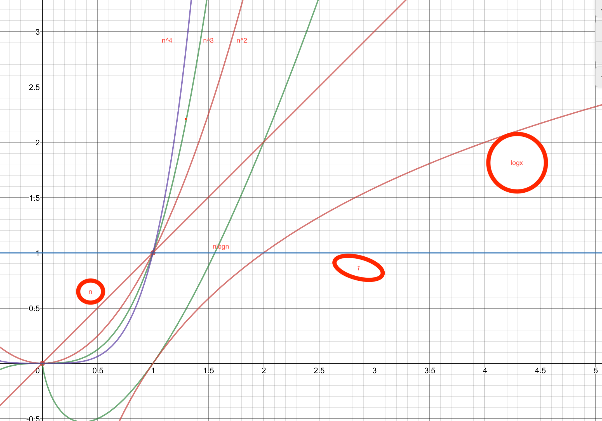

数据结构与算法 c语言

```
  1.数组实现
  2.链表
二、栈与队列
三、树与二叉树
  1.树
  2.二叉树基本概念
  3.二叉查找树
  4.平衡二叉树
  5.红黑树
四、图
五、总结

```

(c++)

```

先广度-后深度
堆：在集合中取出最小值和最大值。可以取和添值；优先队列pq ：斐波那契队列
科学刷题：题目是对知识的抽象，题目是检验正确性，量的积累。（捷径）
目的性：20-30分钟的时间，5分钟是做过的；分类和总结
条件就是突破口，解决新算法问题
```


## 数据结构

```c++
学科的定义：
主要是为研究和解决如何使用计算机处理非数值问题而产生的理论、技术和方法。

在程序设计时就已经遇到过。
一维数组是一个数据结构
 例如：一维数组A=（a1,a2,a3,a4）
 							int a[4];//定义并创建一维整型
     //数组(a[0],a[1],a[2],a[3])
 
 x=a[2]; //读数组元素a[2]的值
 a[2]=x; //置a[2]的值为x

数据结构由数据元素依某种逻辑关系组织起来，在数据结构上需要定义一组操作（运算）。
```

一、数据和数据元素 

```

1. 数据：是信息的载体,是计算机加工处理的对象.
 2. 数值数据和非数值数据
 (1)数值数据：包括整数、实数或复数。主要用于工程计算、科学计算。
 (2)非数值数据：包括字符、文字、图形、图象、语音等。
 用于情报检索、企业管理、图形图象、人工智能、远程教育、远程医疗、电子商务、电子图书馆和办公自动化等诸多领域。
3. 数据元素：组成数据的基本单位
```

**1.数据结构举例** 

```c++
二、什么是数据结构 
例如：一维数组A=（a1,a2,a3,a4）
 (1) 数据元素间的逻辑关系：
    B=（D，R）
其中，D是数据元素的有限集合，R是D上关系的有限集合。本书中一般只考虑R包含一个关系的情况，即R={r}。
    D={ a1,a2,a3,a4}
    r={ <a1,a2>,<a2,a3>,<a3,a4>}
    R={r}

(2) 数据在计算机内的表示
顺序存储表示 a1 a2 a3 a4从上到下，102 104 106 108
链接存储表示：first ->a1-->a2-->a3-->a4
一维数组A=（a1,a2,a3,a4）

3) 运算的定义和算法
Create():　 建立一个数组。
Retrieve(i): 返回下标为i的元素值。
Store(i,x): 将下标为i的数据元素
            的值置为x。
例如：
 int a[4]; //定义一个一维整型数组   
           //(a[0],a[1],a[2],a[3])
 x=a[2];   //读数组元素a[2]的值
 a[2]=x;   //置a[2]的值为x

```


**2.4种基本的逻辑结构**

**集合结构：**

结构中的数据元素之间除了“同属于一个集合”的关系外，别无其它关系； 集合和字典

**线性结构：**

结构中的数据元素之间存在 一对一 的关系；有前面和后面之分
				线性表，堆栈，队列，字符串，数组，文件

**树形结构：**

结构中的数据元素之间存在 一对多 的关系；				树是更简单的图
				树 二叉树 堆 优先权队列。

**图结构：**

结构中的数据元素之间存在 多对多 的关系。 网and 图

链表就是一叉树


**3.什么是数据结构**

```
数据结构包括以下四个方面：
(1) 数据元素及特性
    是数据结构中的最基本信息单元。
(2) 数据的逻辑结构
    对数据元素间的逻辑关系的描述。
(3) 数据的存储表示（存储结构）
    数据在计算机内的组织方式。
(4) 运算的定义和算法
    数据结构上执行的运算和实现。
   

```


 **1.5 数据结构的描述** 


```
 1.数据结构的抽象层次  
 数据结构抽象为一种聚集结构。
数据结构被看成是一个类属抽象数据类型，用格式化的自然语言来描述之。
  另外，数据结构可以形式地用一个C++的抽象模板类描述之。

```

用ADT描述数据结构——堆栈的例子

```c++
ADT 1.1  栈抽象数据类型

ADT Stack { 
Data :
  零个或多个元素的线性序列（a1，a2， ，an)，遵循LIFO
  原则。
Operations:
  Create()：创建一个空栈。
  Push(x)：在栈中插入元素x。
  Pop()：删除栈顶元素。
  Top()：返回栈顶元素。
  IsEmpty()：若栈空，则返回true，否则返回false。
  IsFull()：若栈满，则返回true， 否则返回false。
}　


----------------
程序 1-2 栈的C++抽象类
template<class T>
class Stack
{
public:
  Stack(){};                     	  
  virtual void Push(const T &x)=0;	   
  virtual void Pop()=0;          
  virtual T Top()const=0;         
  virtual int IsEmpty() const=0;   	   
  virtual int IsFull() const=0;    
};
    除了构造函数，其余成员函数都是纯虚函数。顺序栈类SeqStack是类Stack在顺序存储表示下的一种实现，它是从抽象类Stack派生出来的，它可以实例化。

-----------------
整数堆：
从上到下； 1 0  底层是top

堆栈：
从上到下：n-1，···，1，0  an····a2 a1 ，an是top
                                                                           
```

**1.6.1 算法及其性能分析** 

```

1.什么是算法  
   一个算法(algorithm)是对特定问题的求解步骤的一种描述，它是指令的有限序列；此外，算法具有下列五个特征：
   (1)输入  算法有零个或多个输入。
   (2)输出  算法至少产生一个输出
   (3)确定性  算法的每一条指令都有确切的定义，没有二义性。
   (4)能行性  算法的每一条指令都足够基本，它们可以通过已经实现的基本运算执行有限次来实现。
   (5)有穷性  算法必须总能在执行有限步之后终止。  
   
 2. 算法描述方法 
 
    算法可以自然语言、表格法、流程图或程序设计语言描述。
    当一个算法用程序设计语言描述时，便成为程序。
    
    // 本书中主要使用C++语言描述。

3. 算法的性能标准  
(1) 正确性  算法的执行结果应当满足预先规定的功能和性能要求。
(2) 简明性  一个算法应当思路清晰、层次分明、简单明了、易读易懂。
(3) 健壮性  当输入不合法数据时，应能做适当处理，不至于引起严重后果。**
(4) 效率  有效使用存储空间和有高的时间效率。
(5) 最优性  解决同一个问题可能有多种算法，应进行比较，选择最佳算法。   

```


**1.6.2 算法的空间复杂度** 

```

算法的空间复杂度 
   是程序运行从开始到结束所需的存储量。  
问题实例的特征 : 
    与问题的具体实例有关的量。
    
    例如，对一组特定个数的元素进行排序，对该组元素的排序是排序问题的一个实例。元素的个数可视为该实例的特征。


程序运行所需的存储空间包括两部分：
（1）固定部分  这部分空间与所处理数据的大小和个数无关，或者称与问题的实例的特征无关。主要包括程序代码、常量、简单变量、定长成分的结构变量所占的空间。
（2）可变部分  这部分空间大小与算法在某次执行中处理的特定数据的大小和规模有关。例如，分别为100个元素的两个数组相加，与分别为10个元素的两个数组相加，所需的存储空间显然是不同的。    

```


**1.6.3 算法的时间复杂度** 

```c++


算法的时间复杂度 
   是程序运行从开始到结束所需的时间。  
程序步  
        一个程序步是指在语法上或语义上有意义的程序段，该程序段的执行时间与问题实例的特征无关。
        
        
程序1.2  求一个数组元素的累加之和
float sum(float list[],const int n)
{ 
  float tempsum=0.0;  
  count ++;   //针对赋值语句 
  for (int i=0; i<n; i++ ){
    count ++；//针对for语句
    tempsum += list[i];
    count ++;  //针对赋值语句
  }
  count ++; //针对for的最后一次执行
  count ++; //针对return语句
  return tempsum;
}
返回


count 是全局变量，用来计算程序步数。
       每一程序步均与问题实例的规模n无关。
      
       程序步数为2n+3。


```

**1.6.4 渐近时间复杂度** 

```c++

（一） 大O记号 
   如果存在两个正常数c 和 n0，使得对所有的n，n> n0 ，有
f(n)<= cg(n) 则有 f(n)=O(g(n))。
即函数f(n)当n充分大时上有界，且 g(n)是它的一个上界，也称f(n)的阶不高于g(n)的阶。

例1:
    T(n)= 3.6*n3 + 2.5 * n**2 + 2.8，取n0=1,则当n>=n0 时，
		T(n) <= 3.6n3+2.5n3+2.8n3 =8.9n**3;
		取c=8.9,则根据大O记号的定义得：       
          									T(n)= O(n**3)


渐近时间复杂性：
   使用大O记号表示的算法的时间复杂性，称为算法的渐近时间复杂性。  

在大O记号下，可用程序步来估计算法的执行时间。
    很多情况下，可以通过考察一个算法中的关键操作（关键操作被认为是一个程序步）的执行次数来计算算法的渐近时间复杂性。

--------------------------

例如，程序1.2为求一个数组元素的累加之和的算法。
（1）其总的程序步数为2n+3，则渐近时间复杂性为O(n)。
（2）语句tempsum += list[i]可认为是关键操作，它的执行次数为n次，则渐近时间复杂性为O(n)。

例二：
void Mult(int a[n][n], b[n][n], c[n][n], int n)
{ // nn矩阵a与b 相乘得到c。
   for (int i=0;i<n;i++)              // n+1
     for(int j=0;j<n;j++)             // n(n+1)
     {
	 c[i][j]=0;                     // n2
	 for (int k=0;k<n;k++)          // n2（n+1)
	   c[i][j]+=a[i][k]*b[k][j];    // n3
     }
} 

    程序步为：2n3 +3n2 + 2n+1 
    渐近时间复杂度为：T(n)=O(n3)

```


常见的渐近时间复杂性从小到大排列有：
O(1)< O(log2 n) < O(n)< O(nlog2 n)< O(n2)< O(n**3)


**（二） Ω记号**

```

   如果存在两个正常数c 和 n0，使得对所有的n，n n0 ，有f(n)cg(n) ，则有 f(n)=Ω(g(n))。
即函数f(n)当n充分大时下有界，且g(n)是它的一个下界，也称f(n)的阶不低于g(n)的阶。

（三）θ记号 
f(n)=θ(g(n))，当且仅当f(n)=O(g(n))且f(n)=Ω(g(n)) ，这时称f(n)与g(n)同阶。

（四）对于O、Ω和θ的定义，可用求极限的方法作判断：若lim(f(n)/g(n))=C(当n->∞时） 
（1）当C≠0时，说明f(n)与g(n)同阶，记为f(n)=θ(g(n))
（2）当C=0时，说明f(n)比g(n)低阶，记为
f(n)= O (g(n))
（3）当C=∞时，说明f(n)比g(n)高阶，记为f(n)=Ω(g(n))

```

**对于O、Ω和θ的定义，重点是理解O**

```
一）O的运算性质：
 (1) 0(f)+ O(g)=0(max(f,g))
 (2) 0(f)+ O(g)=0(f+g)
 (3) 0(f)O(g)=0(fg)
 (4) 若g(n)=0(f),则0(f)+0(g)=0(f)
 (5) 0(cf(n))=0(f(n))
 (6) f=O(f)

（二）O的运算性质的证明：
性质(1) 0(f)+ O(g)=0(max(f,g))
证明：设F(N)=0(f),根据0的定义，存在正常数C1和自然数N1，
使得对所有的N>=N1，有 F(N)<=C1f(N),
同理，设G(N)=0(g), 根据0的定义，存在正常数C2和自然数N2，使得对所有的N>=N2，有 F(N)<=C2f(N).
现在令C3=max(C1,C2),N3=max(N1,N2),h(N)=max(f(N),g(N)),
则当N>=N3时，必有：
①F(N)  <=  C1f(N)  <=  C3f(N)  <=  C3h(N)和 
②G(N)  <=  C2g(N)  <=  C3g(N)  <=  C3h(N) 
上面两式相加,得:F(N)+G(N) <=  2C3h(N),
取C=2C3,则当 N >=  N3时，有:0(f)+0(g) <=  Ch(N)=Cmax(f,g),
再根据0的定义可得, 0(f)+0(g)=0(max(f,g))
```

**小节**

```
首先给出传统的数据结构的概念，继而介绍抽象数据类型和面向对象的基本概念，回顾C++语言的基本特征，以及算法的效率和算法分析的基本方法。
    本章的学习将贯穿全书。
    通过本章学习，希望掌握如下内容：
1. 了解下列有关数据结构的术语和概念：
    数据、数据元素、数据结构、逻辑结构、存储结构、  
数据类型、抽象数据类型、数据结构的规范和实现。
2. 复习下列面向对象的术语和概念：
    对象、属性、服务、对象类、 继承、父类、子类

3.复习下列 C++概念：
    传值参数、引用参数、常量引用参数、函数原型、动态存储分配、操作符重载、友元函数、友元类、继承、基类、派生类、多态性、虚函数、动态联编、纯虚函数、抽象类、模板函数和模板类。
    
4.了解数据结构的抽象层次。
5. 学会使用类属抽象数据类型和模板抽象类描述数据结构的方法。 
6. 算法、算法的空间复杂性、算法的时间复杂性、程序步和渐近时间复杂性。
7. 学会使用程序步来分析一个算法的渐近时间复杂度。
8. 会根据0的定义对0的一些性质给出证明.

```


冒泡排序：

就是比较，然后交换 

排序： O(n*log(n))

```
sort (arr ,1 ,n):
return arr[1,k]    

局部排序：O（n*k）
堆： 分治法O（n*log（k））
```


## 算法效率的度量方法

dataStructure-algorithm（已经讲过）py3和c

**1.事后统计方法**

这种方法主要是通过设计好的测试程序和数据，利用计算机计时器对不同算法编制的程序的运行时间进行比较，从而确定算法效率的高低。

**2.事前分析估算方法**

在计算机程序编写前，依据统计方法对算法进行估算。

经过总结，我们发现一个高级语言编写的程序在计算机上运行时所消耗的时间取决于下列因素：

1. 算法采用的策略，方案
2. 编译产生的代码质量
3. 问题的输入规模
4. 机器执行指令的速度

> >由此可见，抛开这些与计算机硬件、软件有关的因素，一个程序的运行时间依赖于算法的好坏和问题的输入规模。（所谓的问题输入规模是指输入量的多少）


**算法的空间复杂度** 

```
算法的空间复杂度 约为占用内存
   是程序运行从开始到结束所需的存储量。  
问题实例的特征 : 
    与问题的具体实例有关的量。
    
    例如，对一组特定个数的元素进行排序，对该组元素的排序是排序问题的一个实例。元素的个数可视为该实例的特征。


程序运行所需的存储空间包括两部分：
（1）固定部分  这部分空间与所处理数据的大小和个数无关，或者称与问题的实例的特征无关。主要包括程序代码、常量、简单变量、定长成分的结构变量所占的空间。
（2）可变部分  这部分空间大小与算法在某次执行中处理的特定数据的大小和规模有关。例如，分别为100个元素的两个数组相加，与分别为10个元素的两个数组相加，所需的存储空间显然是不同的。    

```


**算法的时间复杂度** 

```c++
算法的时间复杂度	
   是程序运行从开始到结束所需的时间。  
程序步  
        一个程序步是指在语法上或语义上有意义的程序段，该程序段的执行时间与问题实例的特征无关。
        
算法时间复杂度的本质是算法的执行时间，也就是算法中所有语句的频度之和。语句频度就是语句的执行次数，它与算法求解问题的规模大小息息相关。

运行时间与时间复杂度：
运行时间随着输入量增大而增大，复杂度越高，运行时间增加速度越快。
一般计算的时候认为计算机1s可以进行10^9次运算，那么输入数量当n=1000时，复杂度n^3的程序需要运行1s。而复杂度log n 的只需要极少的时间（不到1毫秒）
```

**渐近时间复杂度** 

```c++
（一） 大O记号 
如果存在两个正常数c 和 n0，使得对所有的n，n> n0 ，有
f(n)<= cg(n) 则有 f(n)=O(g(n))。
即函数f(n)当n充分大时上有界，且 g(n)是它的一个上界，也称f(n)的阶不高于g(n)的阶。


渐近时间复杂性：
   使用大O记号表示的算法的时间复杂性，称为算法的渐近时间复杂性。  

在大O记号下，可用程序步来估计算法的执行时间。
    很多情况下，可以通过考察一个算法中的关键操作（关键操作被认为是一个程序步）的执行次数来计算算法的渐近时间复杂性。

---渐进和时间复杂的区别
假设对于给定的算法，目前问题规模为n，则语句频度可以表示成一个关于问题规模的函数 T(n)，那么算法时间复杂度也就可以用T(n)表示，其含义是算法在输入规模为n时的运行时间。
当问题规模很大时，精确的计算T(n)是很难实现而且也是没有必要的。对于算法时间性能的分析无需非要得到时间复杂度T(n)的精确值，它的变化趋势和规律也能清楚地反映算法的时间耗费。基于此，引入了渐进时间复杂度作为时间性能分析的依据，它的含义就是：在问题规模 n趋于无穷大时算法时间复杂度T(n)的渐进上界，即函数 T(n)的数量级(阶)。

算法时间复杂度和渐进算法时间复杂度:
在实际的算法分析过程中是不予区分的，渐进时间复杂度可以简称为时间复杂度，记为T(n)=O(f(n))。其中，通过统计算法中基本操作重复执行的次数就可近似地得到算法的执行效率，用O(n)表示，称为时间复杂度。    
```


常见的渐近时间复杂性从小到大排列有：
O(1)< O(log2 n) < O(n)< O(nlog2 n)< O(n2)< O(n**3)<o(2^n)


大O表示法中都是以logn/log2  = 以log2为底数





```
Are we out of Numbers?	我们的人数不够了吗?
Get a number randomly from the available numbers	从可用的数字中随机抽取一个数字
Does it conflict?	冲突吗?
Use it!	使用它!
go forward 1 square	向前走1平方
Replenish this squares numbers and go back 1 square	补充这个平方数，回到1
Remove from available numbers for this square	从此方块的可用号码中移除
```


```flow
st=>start: 开始:>https://fibncci.github.io
e=>end

op1=>operation: 从可用的数字中随机抽取一个数字1|past
op2=>operation: 使用他2|current
sub1=>subroutine: 使用它2|current
op3=>operation: 补充这个平方数，回到1|current
op4=>operation: 从此方块的可用号码中移除|current
op5=>operation: 向前走1的平方

cond1=>condition: 我们的人数不够了吗?
cond2=>condition: 对吗？

io1=>inputoutput: 继续循环

st->cond1


cond1(yes)->op3->io1->
cond1(no)->op1->cond2

cond2(no)->sub1->op5
cond2(yes)->op4
```


**时间复杂度**

**算法的时间复杂度，用来度量算法的运行时间，记作: T(n) = O(f(n))。它表示随着 输入大小n 的增大，算法执行需要的时间的增长速度可以用 f(n) 来描述。**

f(n) 的增长速度是大于或者等于 T(n) 的，即T(n) = O(f(n))，所以我们可以用 f(n) 的增长速度来度量 T(n) 的增长速度，所以我们说这个算法的时间复杂度是 O(f(n))。


**计算时间复杂度**

```python
# 这个方法需要执行 2 次运算
def void():
    for i  in range(1):
        print('hello,worid',end='') #需要执行1次
    return 0                 # #需要执行1次
void() #hello,worid 0


```

```c
int aFunc(void) {
    printf("Hello, World!\n");      //  需要执行 1 次
    return 0;       // 需要执行 1 次
}
--------------
#include <stdio.h>
int main(int argc, char const *argv[])
{
        printf("hello，world\n");
        return 0;
}
```


```
# 这个方法需要执行 2n+1 次运算

def aFun(n):
    for i in range(n):     #需要执行n次
        print('hello,worid',end='') #需要执行n次
    return 0;   #需要执行1次
aFun(4)

# hello,woridhello,woridhello,woridhello,worid
# 0
```


```c
int aFunc(int n) {
    for(int i = 0; i<n; i++) {         // 需要执行 (n + 1) 次
        printf("Hello, World!\n");      // 需要执行 n 次
    }
    return 0;       // 需要执行 1 次
}
```


```
比如
f(n) 的增长速度是大于或者等于 T(n) 的，即T(n) = O(f(n))，所以我们可以用 f(n) 的增长速度来度量 T(n) 的增长速度，所以我们说这个算法的时间复杂度是 O(f(n))。

比如
T(n) = n^3 + n^2 + 29，此时时间复杂度为 O(n^3)。

比如
T(n) = 3n^3，此时时间复杂度为 O(n^3)。
```

**综合起来：如果一个算法的执行次数是 T(n)，那么只保留最高次项，同时忽略最高项的系数后得到函数 f(n)，此时算法的时间复杂度就是 O(f(n))。为了方便描述，下文称此为 大O推导法。**

**时间复杂度分析的基本策略是：从内向外分析，从最深层开始分析。如果遇到函数调用，要深入函数进行分析。**


**例1.单循环O(n)**

```python
# 单循环 O(n×m) ,循环体的时间复杂度为 O(n),循环次数为 m
# 时间复杂度为 O(n × 1)，即 O(n)

def aFun(n):
    for i in range(n): # 循环次数为 n
        print('hi') #循环体时间复杂度为 O(1)
aFun(3)

# hi
# hi
# hi
```

```c
void aFunc(int n) {
    for(int i = 0; i < n; i++) {         // 循环次数为 n
        printf("Hello, World!\n");      // 循环体时间复杂度为 O(1)
    }
}

#include <stdio.h>
int main(int argc, char const *argv[])
{

for(int i = 0;i<3;i++){
        printf("nihao\n" );
}
return 0;
}


```


**例2.多循环 O(n^2)**

```
# 多循环 ：循环体的时间复杂度为 O(n)，各个循环的循环次数分别是a, b, c...，
# 则这个循环的时间复杂度为 O(n×a×b×c...)。分析的时候应该由里向外分析这些循环。
# 时间复杂度为 O(n × n × 1)，即 O(n^2)

def aFun(n):
    for i in range(n):#循环次数为 n
        for j in range(n):#循环次数为 n
            print('hi',end=',');#循环体时间复杂度为 O(1)
aFun(3)
#hi,hi,hi,hi,hi,hi,hi,hi,hi,

```


```c
void aFunc(int n) {
    for(int i = 0; i < n; i++) {         // 循环次数为 n
        for(int j = 0; j < n; j++) {       // 循环次数为 n
            printf("Hello, World!\n");      // 循环体时间复杂度为 O(1)
        }
    }
}
```


**3顺序执行 O(n^2)**

```
# 对于顺序执行 的语句或者算法，总的时间复杂度 等于 其中最大的时间复杂度
# 时间复杂度为 max(  O(n^2), O(n)  )
# 即 O(n^2)。
def aFun(n):
    #第一部分时间复杂度为 O(n^2)
    for i in range(n):
        for j in range(n):
               
            print('hhe',end='')
    for j in range(n): #第二部分时间复杂度为 O(n)
        print('ss')

aFun(3)

# hhehhehhehhehhehhehhehhehhess
# ss
# ss
```


```c
void aFunc(int n) {
    // 第一部分时间复杂度为 O(n^2)
    for(int i = 0; i < n; i++) {
        for(int j = 0; j < n; j++) {
            printf("Hello, World!\n");
        }
    }
    // 第二部分时间复杂度为 O(n)
    for(int j = 0; j < n; j++) {
        printf("Hello, World!\n");
    }
}
```


4条件判断O(n^2)

```
# 条件判断语句，总的时间复杂度等于其中 时间复杂度最大的路径 的时间复杂度。
# 时间复杂度为 max(O(n^2), O(n))，即 O(n^2)
# 时间复杂度分析的基本策略是：
# 从内向外分析，从最深层开始分析。如果遇到函数调用，要深入函数进行分析。
def aFun(n):
    if n> 0:
        for i in range(n):
            for j in range(n):
                print('cc',end = ',')
    else:
        for j in range(n):
            print('ddd',end= '.')
aFun(2)

# cc,cc,cc,cc,
```


```c
void aFunc(int n) {
    if (n >= 0) {
        // 第一条路径时间复杂度为 O(n^2)
        for(int i = 0; i < n; i++) {
            for(int j = 0; j < n; j++) {
                printf("输入数据大于等于零\n");
            }
        }
    } else {
        // 第二条路径时间复杂度为 O(n)
        for(int j = 0; j < n; j++) {
            printf("输入数据小于零\n");
        }
    }
}
```


**例1. O(log n)** 

```python
# 假设循环次数为 t，则循环条件满足 2^t < n。
# 可以得出，执行次数t = log(2)(n)，即 T(n) = log(2)(n)，
# 可见时间复杂度为 O(log(2)(n))，即 O(log n)。
def aFun(n):
    count= 0
    for i in range(2,n):
        i *= 2
        #i=i*2
        print('哦哦哦',end= '')
        count += 1
    print(count)    
    
print(aFun(8))

# 哦哦哦哦哦哦哦哦哦哦哦哦哦哦哦哦哦哦6 None


#二分法的基本思想如下：假设数据是按升序排序的,对于给定值x,从序列的中间位置开始比较,如果当前位置值等于x,则查找成功；若x小于当前位置值,则在数列的前半段中查找；若x大于当前位置值则在数列的后半段中继续查找,...
```


```c
void aFunc(int n) {
    for (int i = 2; i < n; i++) {
        i *= 2;
        printf("%i\n", i);
    }
}
```


**例2.指数级别O(2^n)-fib**

```python
# 1  1 2 3 5 8 13
# T(0) = T(1) = 1，同时 T(n) = T(n - 1) + T(n - 2) + 1，
# 这里的 1 是其中的加法算一次执行。
# 显然 T(n) = T(n - 1) + T(n - 2) 是一个斐波那契数列，
# 通过归纳证明法可以证明，当 n >= 1 时 T(n) < (5/3)^n，
# 同时当 n > 4 时 T(n) >= (3/2)^n。

# 所以该方法的时间复杂度可以表示为 O((5/3)^n)，简化后为 O(2^n)。
# 可见这个方法所需的运行时间是以指数的速度增长的。
# 如果大家感兴趣，可以试下分别用 1，10，100 的输入大小来测试下算法的运行时间，
# 相信大家会感受到时间复杂度的无穷魅力。


def aFun(n):
    if n  <= 1 :
        return 1
        
    return aFun(n-1)+aFun(n-2)

print(aFun(1))  #1
print(aFun(10)) # 89
print(aFun(32)) #35245
# print(aFun(100))
# aFun(1000)
1
89
3524578
```

**c**

```c
long aFunc(int n) {
    if (n <= 1) {
        return 1;
    } else {
        return aFunc(n - 1) + aFunc(n - 2);
    }
}
```

**py**

```python
%%time 
def fibonacci_num(n):
    if n ==1:
        return 1
    if n ==2 :
        return 1
    return fibonacci_num(n-1)+fibonacci_num(n-2)
print(fibonacci_num(40))

#102334155
#CPU times: user 21.6 s, sys: 31.1 ms, total: 21.6 s
#Wall time: 21.7 s(我的电脑32g)（使用 系统  全部时间）

#102334155
#CPU times: user 25.8 s, sys: 8.2 ms, total: 25.9 s
#Wall time: 25.9 s（天池16g）
```

```python
%%time 

def fibonacci_num(n):
    if n == 1:
        return 1 
    if n==2 :
        return 1
    a = 1
    b= 1
    for i in range(n-2):
        b= a+b 
        
        a = b-a
        
    return b 
print(fibonacci_num(40))

# 102334155
# CPU times: user 123 µs, sys: 17 µs, total: 140 µs
# Wall time: 100 µs = 0.0001s
```


fibonacci数列5种求解方法：

1.$$a^n$$减治法

 n为偶数： r = $a^{\frac{n}{2}}$

n为奇数： n-1为偶数 r = $$a^{\frac{n-1}{2}}$$ 每次减半 $a^n$的 O(lgn) =n


2.求解通项公式：

f(n) =f(n-1)+ f(n-2)   ;  $x^2$ =x+1 ==>{$x_1$= $\frac{1+\sqrt{5}}{2}$  ;$x_2$= $\frac{1-\sqrt{5}}{2}$}

$f_n$ = $a_1x_1^n+a_2x_2^n$   ==> 
$$
\begin{cases}
f(0)= 0\\
f(1)=1\\
\end{cases}
$$
$\begin{cases} a_1 = \frac{1}{\sqrt{5}}\\  a_2 = -\frac{1}{\sqrt{5}}\\ \end{cases}$ ==>$ f_n$ = $\frac{1}{\sqrt{5}}[(\frac{1+\sqrt{5}}{2})^n-(\frac{1-\sqrt{5}}{2})^n]$ 


3.查表法：空间换时间

return return[n]===>O[1]

4.正推O[n]

a[n] =0 ;  a[1] = 1

for  a[n] = a [i-1]+a[i+1]

5.递归法

f(45) 跑死机 

```python
%%time 
def fibonacci_num(n):
    if n ==1:
        return 1
    if n ==2 :
        return 1
    return fibonacci_num(n-1)+fibonacci_num(n-2)
print(fibonacci_num(45))
1134903170
CPU times: user 3min 54s, sys: 307 ms, total: 3min 55s
Wall time: 3min 55s
```


**CPU时间**

进程时间也称CPU时间，用以度量进程使用的中央处理器资源。进程时间以时钟嘀嗒计算，

实际时间（Real），实际时间指实际流逝的时间；

用户时间和系统时间 指特定进程使用的CPU时间：用户CPU时间（User），系统CPU时间（Sys）

- real time是从进行开始执行到完成所经历的墙上时钟时间（wall clock）时间，包括其他进程使用的时间片（time slice）和本进程耗费在阻塞（如等待I/O操作完成）上的时间。
- user time是进程执行用户态代码（内核外）耗费的CPU时间，仅统计该进程执行时实际使用的CPU时间，而不计入其他进程使用的时间片和本进程阻塞的时间
- sys time 是该进程在内核态运行所耗费的CPU时间，即内核执行系统调用所使用的CPU时间


CPU总时间（user + sys）是CPU执行用户进程操作和内核（代表用户进程执行）系统调用所耗时间的总和，即该进程（包括线程和子进程）所使用的实际CPU时间。若程序循环遍历数组，则增加用户CPU时间；若程序执行exec或fork等系统调用，则增加系统CPU时间。


在多核处理器机器上，若进程含有多个线程或通过fork调用创建子进程，则实际时间可能小于CPU总时间，因为不同线程或进程可并行执行，但其时间会计入主进程的CPU总时间。若程序在某段时间处于等待状态而并未执行，则实际时间可能大于CPU总时间：

1. real < CPU  表明进程为计算密集型（CPU bound），利用多核处理器的并行执行优势
2. real ≈ CPU  表明进程为计算密集型，未并行执行
3. real > CPU  表明进程为I/O密集型 （I/O bound），多核并行执行优势并不明显


## 算法概述

十种常见排序算法可以分为两大类：

- **比较类排序**：通过比较来决定元素间的相对次序，由于其时间复杂度不能突破O(nlogn)，因此也称为非线性时间比较类排序。
- **非比较类排序**：不通过比较来决定元素间的相对次序，它可以突破基于比较排序的时间下界，以线性时间运行，因此也称为线性时间非比较类排序。 


**算法复杂度**


**0.3 相关概念**

- **稳定**：如果a原本在b前面，而a=b，排序之后a仍然在b的前面。
- **不稳定**：如果a原本在b的前面，而a=b，排序之后 a 可能会出现在 b 的后面。
- **时间复杂度**：对排序数据的总的操作次数。反映当n变化时，操作次数呈现什么规律。
- **空间复杂度：**是指算法在计算机

内执行时所需存储空间的度量，它也是数据规模n的函数。 

### 


## 堆栈

**堆栈空间分配（百度百科）**

栈（操作系统）：由操作系统自动分配释放 ，存放函数的参数值，局部变量的值等。其操作方式类似于数据结构中的栈。

堆（操作系统）： 一般由程序员分配释放， 若程序员不释放，程序结束时可能由OS（操作系统）回收，分配方式倒是类似于链表。

**堆栈缓存方式**

栈使用的是一级缓存， 他们通常都是被调用时处于存储空间中，调用完毕立即释放。
堆则是存放在二级缓存中，生命周期由虚拟机的垃圾回收算法来决定（并不是一旦成为孤儿对象就能被回收）。所以调用这些对象的速度要相对来得低一些。

**堆栈数据结构区别**

堆（数据结构）：堆可以被看成是一棵树，如：堆排序。
栈（数据结构）：一种先进后出的数据结构。


**堆栈（stack）（维基百科）**

又称为栈或堆叠，是计算机科学中的一种抽象数据类型，只允许在有序的线性数据集合的一端（称为堆栈顶端，英语：top）进行加入数据（英语：push）和移除数据（英语：pop）的运算。

因而按照后进先出（LIFO, Last In First Out）的原理运作。

//常与另一种有序的线性数据集合队列相提并论。

堆栈常用一维数组或链表来实现


**操作**

堆栈使用两种基本操作：推入（压栈，push）和弹出（弹栈，pop）：

推入：将数据放入堆栈顶端，堆栈顶端移到新放入的数据。
弹出：将堆栈顶端数据移除，堆栈顶端移到移除后的下一笔数据。
特点

**堆栈的基本特点：**

先入后出，后入先出。
除头尾节点之外，每个元素有一个前驱，一个后继。


## 软件工程

**（测试的方法，设计模式）**

```
耦合性：也称块间联系。指软件系统结构中各模块间相互联系紧密程度的一种度量。模块之间联系越紧密，其耦合性就越强，模块的独立性则越差。模块间耦合高低取决于模块间接口的复杂性、调用的方式及传递的信息

内聚性：又称块内联系。指模块的功能强度的度量，即一个模块内部各个元素彼此结合的紧密程度的度量。若一个模块内各元素（语名之间、程序段之间）联系的越紧密，则它的内聚性就越高。

所谓高内聚是指一个软件模块是由相关性很强的代码组成，只负责一项任务，也就是常说的单一责任原则。

耦合：一个软件结构内不同模块之间互连程度的度量。

对于低耦合，粗浅的理解是：
一个完整的系统，模块与模块之间，尽可能的使其独立存在。也就是说，让每个模块，尽可能的独立完成某个特定的子功能。模块与模块之间的接口，尽量的少而简单。如果某两个模块间的关系比较复杂的话，最好首先考虑进一步的模块划分。这样有利于修改和组合。 
```


## 全方位准备da和算法

程序员有相当一部分对“数据结构”和“算法”的基础概念都不是很清晰;

全方位准备数据结构和算法;

实际上，当你了解了“数据结构”和“算法”存在的真正意义，以及一些实际的应用场景，对它有了一个整体的认知之后，你可能会对它产生强烈的兴趣。当然，它带将带给你的收益也是相当可观的。

很多同学在看到“数据结构”和“算法”后会有一定的抵触心理，或者尝试去练习，但是被难倒，从而放弃。

**这很大一部分原因是因为你还不够了解学习他们的意义，或者没有掌握合理的练习方法**。实际上，当你有了一定的目的性，并且有了合理的练习方法，再来学习这部分内容会变得得心应手。

在本文中，我就来分享一下我学习“数据结构”和“算法”的一些经验和方法。

**1.1 类别说明**

数据结构和算法的种类非常之多，拿树举例，树的种类包括：二叉树、B树、B+树、Trie树、红黑树等等，本文只选择了二叉树。

对初学者来讲，没有必要对某些比较偏的类型和解法多做了解，一是浪费宝贵的时间，二是应用的不多。

本文选择的数据结构和算法的类别均是出现频率最高，以及应用最广的类别。

**1.2 题目说明**

另外，做题时找对典型题目非常重要，可以让你更快速更高效的掌握知识，本文后面也会给出每种类型的典型题目供大家参考。

题目来源：


- `awesome-coding-js`：一个前端算法开源项目，包括我做过的题目以及详细解析
- `leetcode`
- `剑指offer`


**二、为什么要学习数据结构和算法**


在学习某块内容之前，我们一定要首先明确为什么要学，而不是盲目的跟风。

这将更有利于你从学习的过程中获得收益，而且会为你的学习带来动力。

首先明确一点，学习数据结构和算法不一定就是记住二叉树、堆、栈、队列等的解题方法也不是死记硬背一些题目，如果你仅仅停留在这样的表面思想，那么你学习起来会非常痛苦。


**2.1 解决问题的思想**


计算机只是一个很冰冷的机器，你给他下发什么样的指令，它就能作出什么样的反应。

而开发工程师要做的是如何把实际的问题转化成计算机的指令，如何转化，来看看《数据结构》的经典说法：


> 设计出数据结构， 在施加以算法就行了。


所以，很重要的一点，数据结构和算法对建立解决问题的思想非常重要。


> 如果说 Java 是自动档轿车，C 就是手动档吉普。数据结构呢？是变速箱的工作原理。你完全可以不知道变速箱怎样工作，就把自动档的车子从 A 开到 B，而且未必就比懂得的人慢。写程序这件事，和开车一样，经验可以起到很大作用，但如果你不知道底层是怎么工作的，就永远只能开车，既不会修车，也不能造车。如果你对这两件事都不感兴趣也就罢了，数据结构懂得用就好。但若你此生在编程领域还有点更高的追求，数据结构是绕不开的课题。

**2.2 面试**


这是非常现实的一点，也是很多同学学习数据结构和算法的原因。

一般对待算法的态度会分为以下几类：

`Google`、 `Microsoft`等知名外企在面试工程师时，算法是起决定性因素的，基本是每一轮都会考察，即使你有非常强的背景，也有可能因为一两道算法答的不好而与这样的企业失之交臂。

第二类，**算法占重要因素的，国内的某些大厂在面试时**，也会把数据结构和算法作为重要的参考因素，基本是面试必考，如果你达不到一定的要求，会直接挂掉。

第三类，**起加分作用**，很多公司不会把数据结构和算法作为硬性要求，但是也会象征性的出一些题目，当你把一道算法题答的很漂亮，这绝对是加分项。

可见，学好数据结构和算法对你跳槽更好的公司或者拿到更高的薪水，是非常重要的。


**三、如何准备**

了解了数据结构和算法的重要性，那么究竟该用什么样的方法去准备呢？


**3.1 全方位了解**


在学习和练习之前，你一定要对数据结构和算法做一个全方位的了解，对数据结构和算法的定义、分类做一个全面的理解，如果这部分做的不好，你在做题时将完全不知道你在做什么，从而陷入盲目寻找答案的过程，这个过程非常痛苦，而且往往收益甚微。

本文后面的章节，我会对常见的数据结构和算法做一个全方位的梳理。


**3.2 分类练习**


当你对数据结构和算法有了一个整体的认知之后，就可以开始练习了。

注意，一定是分类练习！分类练习！分类练习！重要的事情说三遍。

我曾见过非常多的同学带着一腔热血就开始刷题了，从 `leetcode`第一题开始，刚开始往往非常有动力，可能还会发个朋友圈或者沸点什么的😅，然后就没有然后了。

因为前几题非常简单，可能会给你一定的自信，但是，按序号来的话，很快就会遇到 `hard`。或者有的人，干脆只刷简单，先把所有的简单刷完。

但是，这样盲目的刷题，效果是非常差的，有可能你坚持下来，刷了几百道，也能有点效果，但是整个过程可能非常慢，而且效果远远没有分类练习要好。

所谓分类练习，即按每种类别练习，例如：这段时间只练习二叉树的题目，后面开始练习回溯算法的题目。

在开始练习之前，你往往还需要对这种具体的类别进行一个详细的了解，对其具体的定义、相关的概念和应用、可能出现的题目类型进行梳理，然后再开始。

```
😅
```


**3.3 定期回顾和总结**


在对一个类型针对练习一些题目之后，你就可以发现一定的规律，某一些题目是这样解，另一些题目是那样解...这是一个很正常的现象，每种类型的题目肯定是存在一定规律的。

这时候就可以开始对此类题目进行总结了，针对此类问题，以及其典型的题目，发现的解题方法，进行总结。当下次你再遇到这种类型的题目，你就能很快想到解题思路，从而很快的解答。

所以，当你看到一个题目，首先你要想到它属于哪种数据结构或算法，然后要想到这是一个什么类型的问题，然后是此类问题的解决方法。

如果你看到一个新的问题还不能做到上面这样，那说明你对此类题目的掌握程度还不够，你还要多花一些经历来进行练习。

当然，后面我会把我在这部分的总结分享出来，帮助大家少走一些弯路。


**3.4 题目的选择**


关于题目来源，这里我推荐先看《剑指 `offer`》，然后是 `leetcode`，《剑指 `offer`》上能找到非常多的典型题目，这对你发现和总结规律非常重要。看完再去刷 `leetcode`你会发现更加轻松。

关于难度的选择， 这里我建议 `leetcode`简单、中等难度即可，因为我们要做的是寻找规律，即掌握典型题目即可，当你掌握了这些规律，再去解一些 `hard`的问题，也是可以的，只是多花些时间的问题。切忌不要一开始就在很多刁钻古怪的问题上耗费太多时间。

经过上面的方法，我在练习一段时间后，基本 `leetcode`中等难度的问题可以在 `20min`内 `AC`，另外在最近跳槽的过程中，基本所有的算法问题我都能很快的手写出来，或者很快的想到解题思路。希望大家在看到我的经验和方法后也能达到这样的效果，或者做的比我更好。


**四、时间复杂度和空间复杂度**


在开始学习之前，我们首先要搞懂时间复杂度和空间复杂度的概念，它们的高低共同决定着一段代码质量的好坏：

**4.1 时间复杂度**

一个算法的时间复杂度反映了程序运行从开始到结束所需要的时间。把算法中基本操作重复执行的次数（频度）作为算法的时间复杂度。

没有循环语句，记作 `O(1)`，也称为常数阶。只有一重循环，则算法的基本操作的执行频度与问题规模n呈线性增大关系，记作 `O（n）`，也叫线性阶。

常见的时间复杂度有：

- `O(1):`Constant Complexity: Constant 常数复杂度
- `O(log n)`: Logarithmic Complexity: 对数复杂度
- `O(n)`: Linear Complexity: 线性时间复杂度
- `O(n^2)`: N square Complexity 平⽅方
- `O(n^3)`: N square Complexity ⽴立⽅方
- `O(2^n)`: Exponential Growth 指数
- `O(n!)`: Factorial 阶乘


**4.2 空间复杂度**


一个程序的空间复杂度是指运行完一个程序所需内存的大小。利用程序的空间复杂度，可以对程序的运行所需要的内存多少有个预先估计。

一个程序执行时除了需要存储空间和存储本身所使用的指令、常数、变量和输入数据外，还需要一些对数据进行操作的工作单元和存储一些为现实计算所需信息的辅助空间。


**五、数据结构**

数据结构这个词相信大家都不陌生，在很多场景下可能都听过，但你有没有考虑过“数据结构”究竟是一个什么东西呢？


> 数据结构即数据元素相互之间存在的一种和多种特定的关系集合。


一般你可以从两个维度来理解它，逻辑结构和存储结构。


**5.1 逻辑结构**


简单的来说逻辑结构就是数据之间的关系，逻辑结构大概统一的可以分成两种：线性结构、非线性结构。

线性结构：是一个有序数据元素的集合。其中数据元素之间的关系是一对一的关系，即除了第一个和最后一个数据元素之外，其它数据元素都是首尾相接的。

常用的线性结构有: 栈，队列，链表，线性表。

—非线性结构：各个数据元素不再保持在一个线性序列中，每个数据元素可能与零个或者多个其他数据元素发生联系。

常见的非线性结构有 二维数组，树等。


5.2 **存储结构**


逻辑结构指的是数据间的关系，而存储结构是逻辑结构用计算机语言的实现。常见的存储结构有顺序存储、链式存储、索引存储以及散列存储。

例如：数组在内存中的位置是连续的，它就属于顺序存储；链表是主动建立数据间的关联关系的，在内存中却不一定是连续的，它属于链式存储；还有顺序和逻辑上都不存在顺序关系，但是你可以通过一定的方式去放问它的哈希表，数据散列存储。


**5.3 数据结构-二叉树**


树是用来模拟具有树状结构性质的数据集合。根据它的特性可以分为非常多的种类，对于我们来讲，掌握二叉树这种结构就足够了，它也是树最简单、应用最广泛的种类。


> 二叉树是一种典型的树树状结构。如它名字所描述的那样，二叉树是每个节点最多有两个子树的树结构，通常子树被称作“左子树”和“右子树”。


**5.3.1 二叉树遍历**

> 重点中的重点，最好同时掌握递归和非递归版本，递归版本很容易书写，但是真正考察基本功的是非递归版本。

- 二叉树的中序遍历
- 二叉树的前序遍历
- 二叉树的后序遍历

> 根据前序遍历和中序遍历的特点重建二叉树，逆向思维，很有意思的题目

- 重建二叉树
- 求二叉树的遍历

**5.3.2 二叉树的对称性**

- 对称的二叉树
- 二叉树的镜像

**5.3.3 二叉搜索树**

> 二叉搜索树是特殊的二叉树，考察二叉搜索树的题目一般都是考察二叉搜索树的特性，所以掌握好它的特性很重要。

1.若任意节点的左⼦子树不不空，则左⼦子树上所有结点的值均⼩小于它的 根结点的值;

\2. 若任意节点的右⼦子树不不空，则右⼦子树上所有结点的值均⼤大于它的 根结点的值;

\3. 任意节点的左、右⼦子树也分别为⼆二叉查找树。

- 二叉搜索树的第k个节点
- 二叉搜索树的后序遍历

**5.3.4 二叉树的深度**

> 二叉树的深度为根节点到最远叶子节点的最长路径上的节点数。
>
> 平衡二叉树：左右子树深度之差大于1

- 二叉树的最大深度
- 二叉树的最小深度
- 平衡二叉树

**5.4 数据结构-链表**


用一组任意存储的单元来存储线性表的数据元素。一个对象存储着本身的值和下一个元素的地址。


- 需要遍历才能查询到元素，查询慢。
- 插入元素只需断开连接重新赋值，插入快。


链表在开发中也是经常用到的数据结构， `React16`的 `FiberNode`连接起来形成的 `FiberTree`, 就是个单链表结构。


**5.4.1 基本应用**

> 主要是对链表基本概念和特性的应用，如果基础概念掌握牢靠，此类问题即可迎刃而解

- 从尾到头打印链表
- 删除链表中的节点
- 反转链表
- 复杂链表的复制

**5.4.2 环类题目**

> 环类题目即从判断一个单链表是否存在循环而扩展衍生的问题

- 环形链表
- 链表环的入口节点
- 约瑟夫环

**5.4.3 双指针**

> 双指针的思想在链表和数组中的题目都经常会用到，主要是利用两个或多个不同位置的指针，通过速度和方向的变换解决问题。

- 两个指针从不同位置出发：一个从始端开始，另一个从末端开始；
- 两个指针以不同速度移动：一个指针快一些，另一个指针慢一些。


对于单链表，因为我们只能在一个方向上遍历链表，所以第一种情景可能无法工作。然而，第二种情景，也被称为慢指针和快指针技巧，是非常有用的。


- 两个链表的公共节点
- 链表倒数第k个节点
- 相交链表

**5.4.4 双向链表**


双链还有一个引用字段，称为 `prev`字段。有了这个额外的字段，您就能够知道当前结点的前一个结点。


- 扁平化多级双向链表

**5.5 数据结构-数组**


数组是我们在开发中最常见到的数据结构了，用于按顺序存储元素的集合。但是元素可以随机存取，因为数组中的每个元素都可以通过数组索引来识别。插入和删除时要移动后续元素，还要考虑扩容问题，插入慢。

数组与日常的业务开发联系非常紧密，如何巧妙的用好数组是我们能否开发出高质量代码的关键。


**5.5.1 双指针**

> 上面链表中提到的一类题目，主要是利用两个或多个不同位置的指针，通过速度和方向的变换解决问题。注意这种技巧经常在排序数组中使用。

- 调整数组顺序使奇数位于偶数前面
- 和为S的两个数字
- 和为S的连续正整数序列

**5.5.2 N数之和问题**

> 非常常见的问题，基本上都是一个套路，主要考虑如何比暴利法降低时间复杂度，而且也会用到上面的双指针技巧

- 两数之和
- 三数之和
- 四数之和

**5.5.3 二维数组**

> 建立一定的抽象建模能力，将实际中的很多问题进行抽象

- 构建乘积数组
- 顺时针打印矩阵

**5.5.4 数据统计**

> 数组少不了的就是统计和计算，此类问题考察如何用更高效的方法对数组进行统计计算。

- 数组中出现次数超过数组长度一半的数字
- 连续子数组的最大和
- 扑克牌顺子
- 第一个只出现一次的字符

**5.6 数据结构-栈和队列**


在上面的数组中，我们可以通过索引随机访问元素，但是在某些情况下，我们可能要限制数据的访问顺序，于是有了两种限制访问顺序的数据结构：栈（后进先出）、队列（先进先出）


- 队列和栈的互相实现
- 包含min函数的栈
- 栈的压入弹出序列
- 滑动窗口最大值
- 接雨水

**5.7 数据结构-哈希表**


哈希的基本原理是将给定的键值转换为偏移地址来检索记录。

键转换为地址是通过一种关系（公式）来完成的，这就是哈希（散列）函数。

虽然哈希表是一种有效的搜索技术，但是它还有些缺点。两个不同的关键字，由于哈希函数值相同，因而被映射到同一表位置上。该现象称为冲突。发生冲突的两个关键字称为该哈希函数的同义词。


> 如何设计哈希函数以及如何避免冲突就是哈希表的常见问题。好的哈希函数的选择有两条标准：

- 1.简单并且能够快速计算
- 2.能够在址空间中获取键的均匀人分布


例如下面的题目：


- 常数时间插入、删除和获取随机元素

> 当用到哈希表时我们通常是要开辟一个额外空间来记录一些计算过的值，同时我们又要在下一次计算的过程中快速检索到它们，例如上面提到的两数之和、三数之和等都利用了这种思想。

- 两数之和
- 三数之和
- 字符流中第一个不重复的字符
- 宝石与石头

**5.8 数据结构-堆**


堆的底层实际上是一棵完全二叉树，可以用数组实现


- 每个的节点元素值不小于其子节点 - 最大堆
- 每个的节点元素值不大于其子节点 - 最小堆

> 堆在处理某些特殊场景时可以大大降低代码的时间复杂度，例如在庞大的数据中找到最大的几个数或者最小的几个数，可以借助堆来完成这个过程。

- 堆的基本操作
- 数据流中的中位数
- 最小的k个数


**六、算法**


**6.1 排序**


排序或许是大家接触最多的算法了，很多人的算法之路是从一个冒泡排序开始的，排序的方法有非常多中，它们各自有各自的应用场景和优缺点，这里我推荐如下6种应用最多的排序方法，如果你有兴趣也可以研究下其他几种。


- [快速排序](http://mp.weixin.qq.com/s?__biz=MzUyNjQxNjYyMg==&mid=2247484184&idx=1&sn=62965b401aa42107b3c17d1d8ea17454&chksm=fa0e6c99cd79e58f298e9026f677f912bd8c8e55edb48fc509b2b5834f05e529a9b47d59d202&scene=21#wechat_redirect)

> 选择一个目标值，比目标值小的放左边，比目标值大的放右边，目标值的位置已排好，将左右两侧再进行快排。

- [归并排序](http://mp.weixin.qq.com/s?__biz=MzUyNjQxNjYyMg==&mid=2247484184&idx=1&sn=62965b401aa42107b3c17d1d8ea17454&chksm=fa0e6c99cd79e58f298e9026f677f912bd8c8e55edb48fc509b2b5834f05e529a9b47d59d202&scene=21#wechat_redirect)

> 将大序列二分成小序列，将小序列排序后再将排序后的小序列归并成大序列。

- [选择排序](http://mp.weixin.qq.com/s?__biz=MzUyNjQxNjYyMg==&mid=2247484184&idx=1&sn=62965b401aa42107b3c17d1d8ea17454&chksm=fa0e6c99cd79e58f298e9026f677f912bd8c8e55edb48fc509b2b5834f05e529a9b47d59d202&scene=21#wechat_redirect)

> 每次排序取一个最大或最小的数字放到前面的有序序列中。

- [插入排序](http://mp.weixin.qq.com/s?__biz=MzUyNjQxNjYyMg==&mid=2247484184&idx=1&sn=62965b401aa42107b3c17d1d8ea17454&chksm=fa0e6c99cd79e58f298e9026f677f912bd8c8e55edb48fc509b2b5834f05e529a9b47d59d202&scene=21#wechat_redirect)

> 将左侧序列看成一个有序序列，每次将一个数字插入该有序序列。插入时，从有序序列最右侧开始比较，若比较的数较大，后移一位。

- [冒泡排序](http://mp.weixin.qq.com/s?__biz=MzUyNjQxNjYyMg==&mid=2247484184&idx=1&sn=62965b401aa42107b3c17d1d8ea17454&chksm=fa0e6c99cd79e58f298e9026f677f912bd8c8e55edb48fc509b2b5834f05e529a9b47d59d202&scene=21#wechat_redirect)

> 循环数组，比较当前元素和下一个元素，如果当前元素比下一个元素大，向上冒泡。下一次循环继续上面的操作，不循环已经排序好的数。

- [堆排序](http://mp.weixin.qq.com/s?__biz=MzUyNjQxNjYyMg==&mid=2247484184&idx=1&sn=62965b401aa42107b3c17d1d8ea17454&chksm=fa0e6c99cd79e58f298e9026f677f912bd8c8e55edb48fc509b2b5834f05e529a9b47d59d202&scene=21#wechat_redirect)

> 创建一个大顶堆，大顶堆的堆顶一定是最大的元素。交换第一个元素和最后一个元素，让剩余的元素继续调整为大顶堆。从后往前以此和第一个元素交换并重新构建，排序完成。

**6.2 二分查找**


查找是计算机中最基本也是最有用的算法之一。它描述了在有序集合中搜索特定值的过程。


二分查找维护查找空间的左、右和中间指示符，并比较查找目标或将查找条件应用于集合的中间值；如果条件不满足或值不相等，则清除目标不可能存在的那一半，并在剩下的一半上继续查找，直到成功为止。如果查以空的一半结束，则无法满足条件，并且无法找到目标。


- 二维数组查找
- 旋转数组的最小数字
- 在排序数组中查找数字
- x 的平方根
- 猜数字大小

**6.3 递归**


递归是一种解决问题的有效方法，在递归过程中，函数将自身作为子例程调用。


你可能想知道如何实现调用自身的函数。诀窍在于，每当递归函数调用自身时，它都会将给定的问题拆解为子问题。递归调用继续进行，直到到子问题无需进一步递归就可以解决的地步。

为了确保递归函数不会导致无限循环，它应具有以下属性：


- 一个简单的基本案例 —— 能够不使用递归来产生答案的终止方案。
- 一组规则，也称作递推关系，可将所有其他情况拆分到基本案例。

**6.3.1 重复计算**


一些问题使用递归考虑，思路是非常清晰的，但是却不推荐使用递归，例如下面的几个问题：


- 斐波拉契数列
- 跳台阶
- 矩形覆盖

这几个问题使用递归都有一个共同的缺点，那就是包含大量的重复计算，如果递归层次比较深的话，直接会导致JS进程崩溃。


你可以使用 `记忆化`的方法来避免重复计算，即开辟一个额外空间来存储已经计算过的值，但是这样又会浪费一定的内存空间。因此上面的问题一般会使用动态规划求解。


> 所以，在使用递归之前，一定要判断代码是否含有重复计算，如果有的话，不推荐使用递归。


递归是一种思想，而非一个类型，很多经典算法都是以递归为基础，因此这里就不再给出更多问题。


**6.4 广度优先搜索**


广度优先搜索（ `BFS`）是一种遍历或搜索数据结构（如树或图）的算法，也可以在更抽象的场景中使用。

它的特点是越是接近根结点的结点将越早地遍历。

例如，我们可以使用 `BFS`找到从起始结点到目标结点的路径，特别是最短路径。

在 `BFS`中，结点的处理顺序与它们添加到队列的顺序是完全相同的顺序，即先进先出，所以广度优先搜索一般使用队列实现。


- 从上到下打印二叉树
- 单词接龙
- 员工的重要性
- 岛屿数量

**6.5 深度优先搜索**


和广度优先搜索一样，深度优先搜索（ `DFS`）是用于在树/图中遍历/搜索的一种重要算法。

与 `BFS`不同，更早访问的结点可能不是更靠近根结点的结点。因此，你在 `DFS`中找到的第一条路径可能不是最短路径。


在 `DFS`中，结点的处理顺序是完全相反的顺序，就像它们被添加到栈中一样，它是后进先出。所以深度优先搜索一般使用栈实现。


- 二叉树的中序遍历
- 二叉树的最大深度
- 路径总和
- 课程表
- 岛屿数量

**6.6 回溯算法**


从解决问题每一步的所有可能选项里系统选择出一个可行的解决方案。

在某一步选择一个选项后，进入下一步，然后面临新的选项。重复选择，直至达到最终状态。

回溯法解决的问题的所有选项可以用树状结构表示。


- 在某一步有n个可能的选项，该步骤可看作树中一个节点。
- 节点每个选项看成节点连线，到达它的n个子节点。
- 叶节点对应终结状态。
- 叶节点满足约束条件，则为一个可行的解决方案。
- 叶节点不满足约束条件，回溯到上一个节点，并尝试其他叶子节点。
- 节点所有子节点均不满足条件，再回溯到上一个节点。
- 所有状态均不能满足条件，问题无解。


回溯算法适合由多个步骤组成的问题，并且每个步骤都有多个选项。


- 二叉树中和为某一值的路径
- 字符串的排列
- 和为sum的n个数
- 矩阵中的路径
- 机器人的运动范围
- N皇后问题

**6.7 动态规划**


动态规划往往是最能有效考察算法和设计能力的题目类型，面对这类题目最重要的是抓住问题的阶段，了解每个阶段的状态，从而分析阶段之间的关系转化。

适用于动态规划的问题，需要满足最优子结构和无后效性，动态规划的求解过程，在于找到状态转移方程，进行自底向上的求解。


自底向上的求解，可以帮你省略大量的复杂计算，例如上面的斐波拉契数列，使用递归的话时间复杂度会呈指数型增长，而动态规划则让此算法的时间复杂度保持在 `O(n)`。


**6.7.1 路径问题**

- 最小路径和
- 不同路径
- 不同路径 II
- 形成字符串的最短路径

**6.7.2 买卖股票类问题**

- 买卖股票的最佳时机
- 买卖股票的最佳时机 III
- 打家劫舍
- 打家劫舍 II

**子序列问题**

- 不同的子序列
- 乘积最大子序列
- 最长上升子序列
- 最长回文子序列

**6.8 贪心算法**


贪心算法：对问题求解的时候，总是做出在当前看来是最好的做法。

适用贪心算法的场景：问题能够分解成子问题来解决，子问题的最优解能递推到最终问题的最优解。这种子问题最优解成为最优子结构


**6.8.1 买卖股票类问题**

- 买卖股票的最佳时机 II
- 买卖股票的最佳时机含手续费

**6.8.2 货币选择问题**

- 零钱兑换
- 零钱兑换 II

**6.9 贪心算法、动态规划、回溯的区别**


贪心算法与动态规划的不同在于它对每个子问题的解决方案都作出选择，不能回退，动态规划则会保存以前的运算结果，并根据以前的结果对当前进行选择，有回退功能，而回溯算法就是大量的重复计算来获得最优解。


有很多算法题目都是可以用这三种思想同时解答的，但是总有一种最适合的解法，这就需要不断的练习和总结来进行深入的理解才能更好的选择解决办法。


**七、小结**


本文并没有对每个点进行深入的分析，而是从为什么、怎么做、做什么的角度对数据结构和算法进行的全面分析，希望看完本片文章能对你有如下帮助：


- 对数据结构和算法建立一个较全面的认知体系

- 掌握快速学习数据结构和算法的方法

- 了解数据结构和算法的重要分类和经典题型

  


## 他山之石


```
end

```

