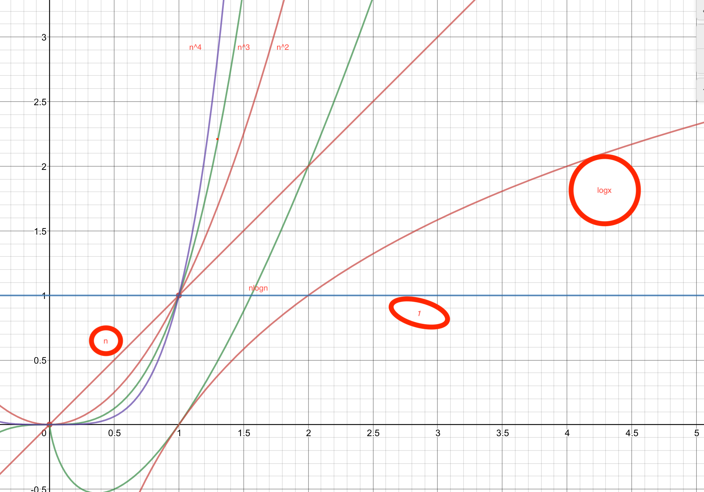

# dataStructure-algorithm

### 算法的空间复杂度 

```
算法的空间复杂度 
   是程序运行从开始到结束所需的存储量。  
问题实例的特征 : 
    与问题的具体实例有关的量。
    
    例如，对一组特定个数的元素进行排序，对该组元素的排序是排序问题的一个实例。元素的个数可视为该实例的特征。


程序运行所需的存储空间包括两部分：
（1）固定部分  这部分空间与所处理数据的大小和个数无关，或者称与问题的实例的特征无关。主要包括程序代码、常量、简单变量、定长成分的结构变量所占的空间。
（2）可变部分  这部分空间大小与算法在某次执行中处理的特定数据的大小和规模有关。例如，分别为100个元素的两个数组相加，与分别为10个元素的两个数组相加，所需的存储空间显然是不同的。    

```


### 算法的时间复杂度 

```c++

算法的时间复杂度 
   是程序运行从开始到结束所需的时间。  
程序步  
        一个程序步是指在语法上或语义上有意义的程序段，该程序段的执行时间与问题实例的特征无关。
        


```

###  渐近时间复杂度 

```c++
（一） 大O记号 
如果存在两个正常数c 和 n0，使得对所有的n，n> n0 ，有
f(n)<= cg(n) 则有 f(n)=O(g(n))。
即函数f(n)当n充分大时上有界，且 g(n)是它的一个上界，也称f(n)的阶不高于g(n)的阶。


渐近时间复杂性：
   使用大O记号表示的算法的时间复杂性，称为算法的渐近时间复杂性。  

在大O记号下，可用程序步来估计算法的执行时间。
    很多情况下，可以通过考察一个算法中的关键操作（关键操作被认为是一个程序步）的执行次数来计算算法的渐近时间复杂性。


```


常见的渐近时间复杂性从小到大排列有：
O(1)< O(log2 n) < O(n)< O(nlog2 n)< O(n2)< O(n**3)


大O表示法中都是以logn/log2  = 以log2为底数





### 主要做时间复杂度

**算法的时间复杂度，用来度量算法的运行时间，记作: T(n) = O(f(n))。它表示随着 输入大小n 的增大，算法执行需要的时间的增长速度可以用 f(n) 来描述。**

f(n) 的增长速度是大于或者等于 T(n) 的，即T(n) = O(f(n))，所以我们可以用 f(n) 的增长速度来度量 T(n) 的增长速度，所以我们说这个算法的时间复杂度是 O(f(n))。


### 计算时间复杂度

```

# 这个方法需要执行 2 次运算
def void():
    for i  in range(1):
        print('hello,worid',end='') #需要执行1次
    return 0                 # #需要执行1次
void() #hello,worid 0


```

```c
int aFunc(void) {
    printf("Hello, World!\n");      //  需要执行 1 次
    return 0;       // 需要执行 1 次
}


```


```
# 这个方法需要执行 2n+1 次运算

def aFun(n):
    for i in range(n):     #需要执行n次
        print('hello,worid',end='') #需要执行n次
    return 0;   #需要执行1次
aFun(4)

# hello,woridhello,woridhello,woridhello,worid
# 0
```


```c
int aFunc(int n) {
    for(int i = 0; i<n; i++) {         // 需要执行 (n + 1) 次
        printf("Hello, World!\n");      // 需要执行 n 次
    }
    return 0;       // 需要执行 1 次
}
```


```
比如
f(n) 的增长速度是大于或者等于 T(n) 的，即T(n) = O(f(n))，所以我们可以用 f(n) 的增长速度来度量 T(n) 的增长速度，所以我们说这个算法的时间复杂度是 O(f(n))。

比如
T(n) = n^3 + n^2 + 29，此时时间复杂度为 O(n^3)。

比如
T(n) = 3n^3，此时时间复杂度为 O(n^3)。
```

**综合起来：如果一个算法的执行次数是 T(n)，那么只保留最高次项，同时忽略最高项的系数后得到函数 f(n)，此时算法的时间复杂度就是 O(f(n))。为了方便描述，下文称此为 大O推导法。**

**时间复杂度分析的基本策略是：从内向外分析，从最深层开始分析。如果遇到函数调用，要深入函数进行分析。**


### 例子

#### 1.单循环O(n)

```
# 单循环 O(n×m) ,循环体的时间复杂度为 O(n),循环次数为 m
# 时间复杂度为 O(n × 1)，即 O(n)

def aFun(n):
    for i in range(n): # 循环次数为 n
        print('hi') #循环体时间复杂度为 O(1)
aFun(3)

# hi
# hi
# hi
```

```c
void aFunc(int n) {
    for(int i = 0; i < n; i++) {         // 循环次数为 n
        printf("Hello, World!\n");      // 循环体时间复杂度为 O(1)
    }
}
```


### 2多循环 O(n^2)

```
# 多循环 ：循环体的时间复杂度为 O(n)，各个循环的循环次数分别是a, b, c...，
# 则这个循环的时间复杂度为 O(n×a×b×c...)。分析的时候应该由里向外分析这些循环。
# 时间复杂度为 O(n × n × 1)，即 O(n^2)

def aFun(n):
    for i in range(n):#循环次数为 n
        for j in range(n):#循环次数为 n
            print('hi',end=',');#循环体时间复杂度为 O(1)
aFun(3)
#hi,hi,hi,hi,hi,hi,hi,hi,hi,

```


```c
void aFunc(int n) {
    for(int i = 0; i < n; i++) {         // 循环次数为 n
        for(int j = 0; j < n; j++) {       // 循环次数为 n
            printf("Hello, World!\n");      // 循环体时间复杂度为 O(1)
        }
    }
}
```


#### 3顺序执行 O(n^2)

```
# 对于顺序执行 的语句或者算法，总的时间复杂度 等于 其中最大的时间复杂度
# 时间复杂度为 max(  O(n^2), O(n)  )
# 即 O(n^2)。
def aFun(n):
    #第一部分时间复杂度为 O(n^2)
    for i in range(n):
        for j in range(n):
               
            print('hhe',end='')
    for j in range(n): #第二部分时间复杂度为 O(n)
        print('ss')

aFun(3)

# hhehhehhehhehhehhehhehhehhess
# ss
# ss
```


```c
void aFunc(int n) {
    // 第一部分时间复杂度为 O(n^2)
    for(int i = 0; i < n; i++) {
        for(int j = 0; j < n; j++) {
            printf("Hello, World!\n");
        }
    }
    // 第二部分时间复杂度为 O(n)
    for(int j = 0; j < n; j++) {
        printf("Hello, World!\n");
    }
}
```


### 4条件判断O(n^2)

```
# 条件判断语句，总的时间复杂度等于其中 时间复杂度最大的路径 的时间复杂度。
# 时间复杂度为 max(O(n^2), O(n))，即 O(n^2)
# 时间复杂度分析的基本策略是：
# 从内向外分析，从最深层开始分析。如果遇到函数调用，要深入函数进行分析。
def aFun(n):
    if n> 0:
        for i in range(n):
            for j in range(n):
                print('cc',end = ',')
    else:
        for j in range(n):
            print('ddd',end= '.')
aFun(2)

# cc,cc,cc,cc,
```


```c
void aFunc(int n) {
    if (n >= 0) {
        // 第一条路径时间复杂度为 O(n^2)
        for(int i = 0; i < n; i++) {
            for(int j = 0; j < n; j++) {
                printf("输入数据大于等于零\n");
            }
        }
    } else {
        // 第二条路径时间复杂度为 O(n)
        for(int j = 0; j < n; j++) {
            printf("输入数据小于零\n");
        }
    }
}
```


###  例1.    O(log n) 

```
# 假设循环次数为 t，则循环条件满足 2^t < n。
# 可以得出，执行次数t = log(2)(n)，即 T(n) = log(2)(n)，
# 可见时间复杂度为 O(log(2)(n))，即 O(log n)。
def aFun(n):
    count= 0
    for i in range(2,n):
        i *= 2
        print('哦哦哦',end= '')
        count += 1
    print(count)    
    
print(aFun(8))

# 哦哦哦哦哦哦哦哦哦哦哦哦哦哦哦哦哦哦6 None


```


```c
void aFunc(int n) {
    for (int i = 2; i < n; i++) {
        i *= 2;
        printf("%i\n", i);
    }
}
```


### 例2:指数级别O(2^n)

```
# 1  1 2 3 5 8 13
# T(0) = T(1) = 1，同时 T(n) = T(n - 1) + T(n - 2) + 1，
# 这里的 1 是其中的加法算一次执行。
# 显然 T(n) = T(n - 1) + T(n - 2) 是一个斐波那契数列，
# 通过归纳证明法可以证明，当 n >= 1 时 T(n) < (5/3)^n，
# 同时当 n > 4 时 T(n) >= (3/2)^n。

# 所以该方法的时间复杂度可以表示为 O((5/3)^n)，简化后为 O(2^n)。
# 可见这个方法所需的运行时间是以指数的速度增长的。
# 如果大家感兴趣，可以试下分别用 1，10，100 的输入大小来测试下算法的运行时间，
# 相信大家会感受到时间复杂度的无穷魅力。


def aFun(n):
    if n  <= 1 :
        return 1
        
    return aFun(n-1)+aFun(n-2)

print(aFun(1))  #1
print(aFun(10)) # 89
print(aFun(32)) #35245
# print(aFun(100))
# aFun(1000)
1
89
3524578
```


```c
long aFunc(int n) {
    if (n <= 1) {
        return 1;
    } else {
        return aFunc(n - 1) + aFunc(n - 2);
    }
}
```

