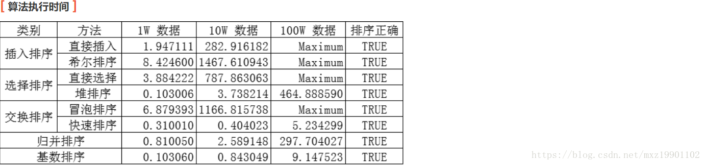
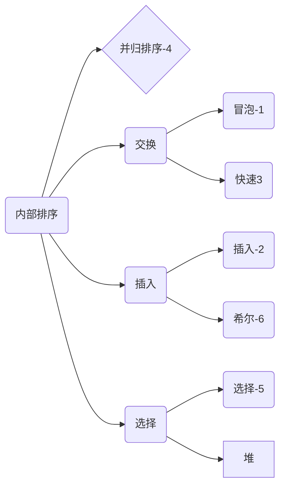
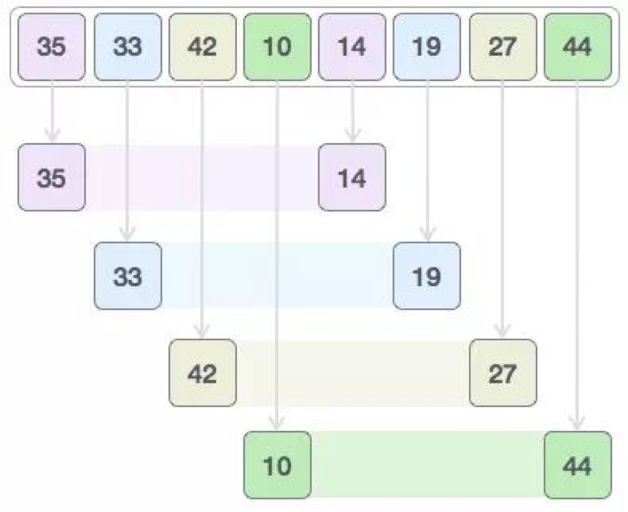
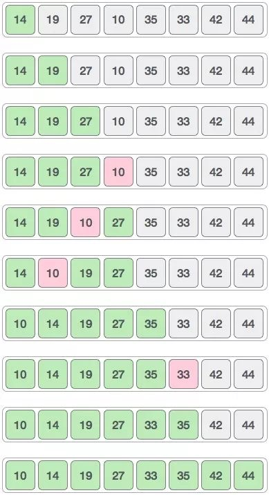

## Algorithms and Data Structures

算法和数据结构

```
1.数据结构可视化-旧金山大学的网站
神软件
https://www.cs.usfca.edu/~galles/visualization/Algorithms.html
2.Python语言参考
https://docs.python.org/3/reference/index.html
3.Python教程
https://docs.python.org/3/tutorial/index.html
```


1.各种排序的复杂度对比：


2.算法执行的时间：



3.排序的内存使用：





## 为什么要学习算法

计算机科学家经常通过经验学习。我们通过看别人解决问题和自己解决问题来学习。接触不同的问题解决技术，看不同的算法设计有助于我们承担下一个具有挑战性的问题。通过思考许多不同的算法，我们可以开始开发模式识别，以便下一次出现类似的问题时，我们能够更好地解决它。

算法通常彼此完全不同。考虑前面看到的 `sqrt` 的例子。完全可能的是，存在许多不同的方式来实现细节以计算平方根函数。一种算法可以使用比另一种更少的资源。一个算法可能需要 10 倍的时间来返回结果。我们想要一些方法来比较这两个解决方案。即使他们都工作，一个可能比另一个“更好”。我们建议使用一个更高效，或者一个只是工作更快或使用更少的内存的算法。当我们研究算法时，我们可以学习分析技术，允许我们仅仅根据自己的特征而不是用于实现它们的程序或计算机的特征来比较和对比解决方案。

在最坏的情况下，我们可能有一个难以处理的问题，这意味着没有算法可以在实际的时间量内解决问题。重要的是能够区分具有解决方案的那些问题，不具有解决方案的那些问题，以及存在解决方案但需要太多时间或其他资源来合理工作的那些问题。

经常需要权衡，我们需要做决定。作为计算机科学家，除了我们解决问题的能力，我们还需要了解解决方案评估技术。最后，通常有很多方法来解决问题。找到一个解决方案，我们将一遍又一遍比较，然后决定它是否是一个好的方案。


归并(nlogn)<希尔(nlog2n)<插入（n^2）


## 1.冒泡排序

找最大值，第二大的值。

简单来说就是比较前后，找到一个大的数再与其他后面的数比较，最后确定最大值；

举例子

``` 
1 5 7 6 3 2 9  (原始数据)
1 5 6 3 2 7 9 （选找到最大数据 5 6 7 9依次交换；找到9 ）
1 5 3 2 6 7 9 （找到7）
1 3 2 5 6 7 9	（找到6）
1 2 3 5 6 7 9 （找到5，无交换）
1 2 3 5 6 7 9 （1 2 比较）
```

```python
#  冒泡排序：它重复的走访过要排序的数列，一次比较两个元素，如果他们的顺序错误就把他们交换过来，走访数列的工作是重复的执行到没有再需要交换，也就是说该数列已经完成排序。
#时间复杂度 O(n^2)
#空间复杂度：O(1)
#稳定性：稳定

def bubble_sort(blist):
    count = len(blist)
    for i in range(0,count):
        for j in range(i+1,count):
            if blist[i] > blist[j]:
                blist[i],blist[j] = blist[j],blist[i]
    return blist

print(bubble_sort([4,5,6,7,8,2,3,1,0]))
```


## 2.插入排序

最前面两个先比较，然后第三个与前面做比较。

类似于冒泡排序；优化算法，如果加入一些判断，当做比较的时候，小于第一个数，或者大于最后一个数直接停止。

```
举例子
4 5 2 3 9 1
4 5 2 3 9 1 (5与4 比较，4的位置确定)
4 5 2 3 9 1 （2 与 4 5 分别比较，确定245）
2 4 5 3 9 1 （3与2 4 5 分别比较，确定2453）
2 3 4 5 9 1 （9与 5 比较 ，确定23459 ）
2 3 4 5 9 1	（1分别与1 2 3 4 5 9做比较）
1 2 3 4 5 9 （输出）  
```

```python
#1 插入排序:插入排序的基本操作就是将一个数据插入到已经排好序的有序数据中，从而得到一个新的，个数加1 的有序数据，算法用于少量数据的排序，首先将第一个作为已经排好序的，然后每次从后的取出插入到前面并排序。
''' 
时间复杂度 O(n^2)
空间复杂度：O(1)
稳定性：稳定
'''
def insert_sort(ilist):
    for i in range(len(ilist)):
        for j in range(i):
            if ilist[i] < ilist[j]:
                ilist.insert(j,ilist.pop(i))
                break
    return ilist

print(insert_sort([4,6,7,3,2,1,8,0]))

```


## 3.快速排序

确定元素的位置，从后往前；时间复杂度：最好和平均情况是O(nlogn)；最坏事O（n^2）(123456顺序数列)

举例子

```
满足：1.比6小于等于就交换；2 大于就与i+1 与 j+1 交换。
4 1 3 5 8 2 9 6
i j
1 4 3 5 8 2 9 6
1 3 4 5 8 2 9 6
1 3 5 4 8 2 9 6
1 3 5 4 2 8 9 6
1 3 5 4 2 6 8 9 第一次确定了6的位置。分为两类了 13542 89
1 3 5 4 2 
1 3 5 4 2 ...
1 2 3 5 4 第二次确定2 的位子 1 354 
3 5 4
3 4 5 
1 2 3 4 5 6 8 9结束
```

举例子2

```
7 3 5 1 6 2 8 4 
3 7 5 1 6 2 8 4 第一步，找位置 i为7前面，j为7上；第二步 ，7>4 ，则3为j，7 为 i；第三步，3<4 ，则交换
i   j
3 1 5 7 6 2 8 4 i+1与j+1交换
3 1 2 7 6 5 8 4
312 4 6587 最后确定4 的位置；分为2类 第一次
1 3 2 
1 2 3 末尾，就调整换 ；i+1 与j
6 5 8 7 
65 7 8  第二次分类
123 4 5678 结束
```

```python
"""

 快速排序：是目前基于比较的内部排序中被认为是最好的方法，当待排序的关键字是随机分布时，快速排序的平均时间最短；

通过一趟排序将要排序的数据分割成独立的两部分，其中一部分的所有数据都比另外一部分的所有数据都要小，然后再按此方法对这两部分数据分别进行快速排序，整个排序过程可以递归进行，以此达到整个数据变成有序序列
时间复杂度：O(nlog₂n)
空间复杂度：O(nlog₂n)
稳定性：不稳定

"""
#快排的主函数，传入参数为一个列表，左右两端的下标
def QuickSort(array,leftIndex=0,rightIndex=None):
    #数组的长度
    arrayLen = len(array)
    #长度为1 的话 或者 空 的话 直接返回 数组
    if arrayLen <= 1:
        return array
    #程序一开始 如果没有给一个最右边的索引值导入话，那么我们就给它 赋值一个 就是数组的最右边的 那个索引值。
    if rightIndex == None:
        rightIndex = arrayLen - 1
    # 保护条件，只有满足  左边索引小于右边索引的时候 再开始排序
    if leftIndex < rightIndex:
        #找到 基准的 索引值 传入参数，通过Partitions函数，获取k下标值
        pivot = partition(array,leftIndex,rightIndex)
        #递归前后半区 对基准前面不部分继续快排
        QuickSort(array,leftIndex,pivot - 1)
        #对基准后半积分继续快排
        QuickSort(array,pivot + 1,rightIndex)

def partition(array,leftIndex,rightIndex):

    pivotValue = array[rightIndex]
    #将最左侧的 索引值 给 i
    i  = leftIndex
    #将最右侧的 索引的前一个 给j
    j = rightIndex -1
    #当left下标，小于right下标的情况下，此时判断二者移动是否相交，若未相交，则一直循环
    while i < j:
        # 当left对应的值大于锚点 基准点 参考值，就一直向左移动
        while j > leftIndex and array[j] > pivotValue:
            j -= 1
        #当left对应的值小于基准点参考值，就一直向右移动
        while i < rightIndex and array[i] <= pivotValue:
            i += 1
        #若移动完，二者仍未相遇则交换下标对应的值
        if i < j:
            array[j],array[i] = array[i],array[j]
            i+=1
            j-=1
    #若移动完，已经相遇，则交换right对应的值和参考值
    array[i],array[rightIndex] = array[rightIndex],array[i]
    # 返回 一个 索引值
    return i

# 《算法导论》中的快排程序
def partition2(array,leftIndex,rightIndex):
    #设置一个 左边的指针位置 为 左侧的 前一个
    i = leftIndex -1
    #遍历 除 基准数之外的 数
    for j in range(leftIndex,rightIndex):
        #比较 遍历的数 和 基准数 ，若是小于基准数 则 换到数组前面去
        if array[j] < array[rightIndex]:
            #交换位置，将遍历的比 基准数小的数 放到 我们指针 的 后一个上，然后 这个时候指针向后移一位。当遍历的数大于我们的基准数的时候，不移动，而且 指针也不发生变化，那么 当我们遍历完一圈以后，把 我们的基准数 放到 索引i 的后一个 位置，那么就形成了 一个 基准数 左边都是比它小的数，基准数右边 都是比它大的数 这样的模式。然后要把 索引 i 的后一个位置 作为基准数 与 原基准数 交换位置，进而可以第二次来 遍历比较。
            array[j],array[i+1] = array[i+1],array[j]
            i += 1
    #遍历完了以后，将 left 位置上的数 和 最后一个 数  即 right 上的数互换位置，就 重置 基准数了。
    array[rightIndex],array[i+1] = array[i+1],array[rightIndex]
    #返回基准的下标
    return i+1


if __name__ == '__main__':
    array = [14,33,27,10,35,19,42,44]
    QuickSort(array)
    print(array)
```


## 4.并排排序

大数据里面 Hadoop计算Map-reduce的思想；1变多是map；多变1是reduce

map 先对数据 分成一个一个；/或者2个2个 ；拆分是logn 。

然后 两两排序；之后 另外两个分别与这两个排序；每次是n次 

举例子

```
3425176
3 42 51 76
3 4 2 5 1 7 6		每一个都是泡脚序的（扩散）；以空间换时间？
3 24 15 67
234 1567 结束
时间复杂度：（n-1）*（logn+1） = nlogn +n-logn+1 取最大项
```

```python
#      当n较大，则应采用时间复杂度为O(nlog2n)的排序方法：快速排序、堆排序或归并排序序。

"""
归并排序：采用分治法（Divide and Conquer）的一个非常典型的应用。将已有序的子序列合并，得到完全有序的序列；即先使每个子序列有序，再使子序列段间有序。若将两个有序表合并成一个有序表，称为二路归并

时间复杂度：O(nlog₂n)
空间复杂度：O(1)
稳定性：稳定

"""

# 归并排序 Merge_Sort

def MergeSort(arrayList):
    arrayLen = len(arrayList)
    #判断输入参数的正确性,如果长度小于1，就说明为1
    if arrayLen <= 1:
        return arrayList
    midIndex = arrayLen//2
    #左边的部分去做 MergeSort
    leftArray = MergeSort(arrayList[:midIndex])
    #右边的去做 MergeSort
    rightArray = MergeSort(arrayList[midIndex:])
    #将左右两边合并，称为一个新的数组，并已经排序成功
    retArray = MergeCore(leftArray,rightArray)
    return retArray

def MergeCore(leftArray,rightArray):
    #首先需要定义两个指针,这两个指针，分别指向这两个数组的第一个元素
    leftIndex = 0
    rightIndex = 0
    #获取两个数组的长度，用于指出上面两个指针的边界是什么
    leftLen = len(leftArray)
    rightLen = len(rightArray)
    #定义一个返回的列表,这一步就代表空间复杂度至少是 O(n)
    retList = []
    #循环两个数组寻找最小值加入到返回值的数组中
    while leftIndex < leftLen and rightIndex < rightLen:
        if leftArray[leftIndex] < rightArray[rightIndex]:
            retList.append(leftArray[leftIndex])
            leftIndex += 1
        else:
            retList.append(rightArray[rightIndex])
            rightIndex += 1
    #下面的代码是将剩余的数组中内容放置在返回的数组中
    retList.extend(leftArray[leftIndex:])

    # while leftIndex < leftLen:
    #     retList.append(leftArray[leftIndex])
    #     leftIndex += 1

    retList.extend(rightArray[rightIndex:])

    # while rightIndex < rightLen:
    #     retList.append(rightArray[rightIndex])
    #     rightIndex += 1
    return retList


if __name__ == '__main__':
    # 14,33,27,10,35,19,42,44

    retList = MergeSort([14,33,27,10,35,19,42,44])
    print(retList)
```


## 5.选择排序

选择排序同样是一个比较简单的排序算法，这个算法也是要维护两个部分的数组。第一个部分的数组是已经排好序的数组，另一部分是没有排好序的数组。初始的时候是排好序的部分是空，没有排序的部分是整个数组。

选择排序的主要的工作流程就是，在没排好序的数组中，找到最小的那个值，然后和没排好序的最左边的那个数字进行交换。这样再将最左边的那个元素纳入到已经排好序的那个队列中，就能够将排好序的序列增大一个元素，而没排好序的序列减少一个元素。插入排序的时间复杂度依然是O(n^2)，不适合大量数据的排序。

再次应用我们之前的那个没有排序的数组来看选择排序的过程。

举例子

```
14 33 27 10 35 19 42 44
14 33 27 10 35 19 42 44
（上面）一开始，没排序的最左边是14这个元素，然后寻找整个没有排序的数组中哪个是最小的元素，发现是10这个元素
10 33 27 14 （35 19 42 44）			交换10和14，在交换之后，排序的序列就出现了，只有一个元素是10
10 33 27 14（35 19 42 44）
然后继续选取没有排序的数组的最左侧，是33，然后寻找整个没有排序的数组，发现最小的那个值是14。
10 14 27 33（35 19 42 44）

```


```python
# 选择排序 ： 第一趟，在待排序记录r1 。。。r(n)中选出最小的记录，将它与r1 交换，第二趟，在待排序记录r2 ~ r(n) 中选出最小的记录，将它与 r2 交换，以此类推，第i趟在待排序记录 r[i]~r[n]中选出最小的记录，将它与r[i]交换，使有序序列不断增长直到全部排序完毕。

#时间复杂度 O(n^2)
#空间复杂度：O(1)
#稳定性：不稳定

def select_sort(slist):
    #外层循环控制循环次数
    for i in range(len(slist)):
        #假设找到的最小元素下标为j
        x = i
        #寻找最小元素的过程
        for j in range(i,len(slist)):
            #假设最小下标的值，大于循环中一个元素，那么就改变最小值的下标
            if slist[j] < slist[x]:
                x = j
        #循环一开始就假设把最小值的下标赋值给变量 x
        # 在不停的循环中，不停的交换两个不一样大小的值
        slist[i],slist[x] = slist[x],slist[i]
    #返回 排好序的列表
    return slist


if __name__ == '__main__':
    arrayList = [4,5,6,7,3,2,6,9,8]
    select_sort(arrayList)
    print(arrayList)
```

------

## 6.希尔排序（基于插入）

最好的时间复杂度：O（log2n） shell排序

python中的集合set就是哈希排序

希尔排序是一种高效的排序方式，它是基于插入排序的一种排序算法。它相比插入排序能够有效的避免大量的移动操作。

这种算法使用插入排序，只是比较的时候使用的是很远的数据进行比较，然后将它们排序。这个比较远的距离是通过下面的计算式子得出的：

```
h = h * 3 + 1  （总结出来的经验。。。）
```

这种算法的时间复杂度是 O(n^2) ~ O(n*log2n).	

下面介绍这个希尔排序：

我们先通过之前的例子再次看下希尔排序的工作方式。首先是计算h的值，h是从1开始的，带入上面的公式发现，h=4. 然后就发现 4 这个值小于数组长度 8.

然后继续计算h的值，带入上面的公式得出，h=13. 大于了数组的长度8.由此可知，我们的初始距离就应该选择4.  那么下面的数组就能够被分成四组分别排序。{35, 14}, {33, 19}, {42, 27}, {10, 44}





然后就是比较每组内的这两个数，如果发现不是升序排列的，就交换这两个数字。那么第一次交换以后的模样应该是：14 19 27 10 35 33 42 44

那下一次的h的值就是1了，所以我们按照间隔1分组，就会分成一组，那么就是按照上面的数组进行插入排序，如下图：

先分割之后（取间隔） ，然后再进行插入排序；解决，大量元素的挪动；




```python
#4 希尔排序 ： 希尔排序 是把记录按下标的一定增量分组，对每组使用直接插入排序算法排序；随着增量逐渐减少，每组包含的关键词越来越多，当增量减至1时，整个文件恰好被分成一组，算法终止

#时间复杂度 O(n^2)
#空间复杂度：O(nlogn)  
#稳定性：不稳定

def shell_sort(slist):
    count = len(slist)
    step = 2
    group = count // step
    while group>0:
        for i in range(group):
            j = i + group
            while j < count:
                key = slist[j]
                k = j - group
                while k >= 0:
                    if slist[k] > key:
                        slist[k+group] = slist[k]
                        slist[k] = key
                    k = k - group
                j = j + group
        group = group // step
    return slist

# print(shell_sort([4,5,7,3,2,6,9,8,0]))
# -----------------------------------
def ShellSort(arrList):
    arrayLen = len(arrList)
    h = 1
    while h < arrayLen//3:
        h = h * 3 + 1
        #插入排序的方法，判断是不是后一个比前一个要小
        #如果是则交换
    while h >= 1:
        for i in range(h,arrayLen):
            j = i
            while j >= h and arrList[j] < arrList[j-h]:
                arrList[j] ,arrList[j-h] = arrList[j-h],arrList[j]
                j -= h
        h  //= 3


if __name__ == '__main__':
    arrList = [14,33,27,10,35,19,42,44]
    ShellSort(arrList)
    print(arrList)
```

## 拓展：海量数据处理

----外部归并排序 - 分治.cppp

分治包括 大数据的 map-reduce和 归并排序的思想，把一个大问题，分解成很多很多小问题，然后再合并。


数据结构与算法处理的都是大数据，大量的数据。现在有100亿的数字排序，100亿个 int 型数字放在文件里面大概有 37.2GB，非常大，内存一次装不下了。那么肯定是要拆分成小的文件一个一个来处理，最终在合并成一个排好序的大文件。

#### 实现思路

1.把这个37GB的大文件，用哈希分成1000个小文件，每个小文件平均38MB左右（理想情况），把100亿个数字对1000取模，模出来的结果在0到999之间，每个结果对应一个文件，所以我这里取的哈希函数是 h = x % 1000，哈希函数取得”好”，能使冲突减小，结果分布均匀。

2.拆分完了之后，得到一些几十MB的小文件，那么就可以放进内存里排序了，可以用快速排序，归并排序，堆排序等等。

3.1000个小文件内部排好序之后，就要把这些内部有序的小文件，合并成一个大的文件，可以用二叉堆来做1000路合并的操作，每个小文件是一路，合并后的大文件仍然有序。
首先遍历1000个文件，每个文件里面取第一个数字，组成 (数字, 文件号) 这样的组合加入到堆里（假设是从小到大排序，用小顶堆），遍历完后堆里有1000个 (数字，文件号) 这样的元素
然后不断从堆顶拿元素出来，每拿出一个元素，把它的文件号读取出来，然后去对应的文件里，加一个元素进入堆，直到那个文件被读取完。拿出来的元素当然追加到最终结果的文件里。
按照上面的操作，直到堆被取空了，此时最终结果文件里的全部数字就是有序的了。
最后我用c++写了个实验程序，具体代码在这里可以看到。

#### 如何拆分大文件？

一个32G的大文件，用fopen()打开不会全部加载到内存的，然后for循环遍历啊，把每个数字对1000取模，会得到0到999种结果，然后每种结果在写入到新的文件中，就拆分了

对 2 亿个数字进行排序, 约 10 G 的文件, 每个数字 int 能表示；


#### c语言

```c
// 算法流程
 // 将 10 G 的文件散列到 300 个文件中, 每个文件大约 35 MB
 // 对 35 MB 的小文件内部排序, 或者分发到多台计算机中, 并行处理 MapReduce
 // 最后使用最小堆, 进行 300 路归并排序, 合成大文件
 // 再写一个算法判断 2 亿个数字是否有序
  
 #include <stdio.h>
 	#include <stdlib.h>
 	#include <time.h>
 	#include <io.h>
 	#include <queue>
 
 	#define FILE_NUM 300 // 哈希文件数
 	#define HASH(a) (a % FILE_NUM)

 	int num = 6000000; // 2 亿个数字, 手动改
 	char path[20] = "c:\\data.dat"; // 待排文件
 	char result[20] = "c:\\result.dat"; // 排序后文件
 	char tmpdir[100] = "c:\\hashfile"; // 临时目录
 	22	 
 	// 随机生成 2 亿个数字
 	int write_file(void)
 	{
 	　　FILE *out = NULL;
 	　　int i;
 	 
 	　　printf("\n正在生成 %d 个数字...\n\n", num);
 		　　out = fopen(path, "wt");
 　if (out == NULL) return 0;
 		 
 		　　unsigned int s, e;
 		　　e = s = clock();
 		　　for (i=0; i<num; i++)
 		　　{
 		　　　　e = clock();
 		　　　　if (e - s > 1000) // 计算进度
 		　　　　{
 		　　　　　　printf("\r处理进度 %0.2f %%\t", (i * 100.0) / num);
 		　　　　　　s = e;
 		　　　　}
 		　　　　fprintf(out, "%d\n",
 		　　　　　　　　(rand() % 31623) * (rand() % 31623));
 		　　}
 		　　fclose(out);
 		　　return 1;
 		}
 		 
 		// 对 2 亿个数字进行哈希, 分散到子文件中
 		// 入口参数: path, tmpdir
 		int map(void)
 		{
 		　　FILE *in = NULL;
 		　　FILE *tmp[FILE_NUM + 5];
 		　　char hashfile[512]; // 哈希文件地址
 		　　int data, add;
 		　　int i;
 		 
 		　　printf("\r正在哈希 %s\n\n", path);
 		　　in = fopen(path, "rt");
 		　　if (in == NULL) return 0;
 		　　for (i=0; i<FILE_NUM; i++) tmp[i] = NULL;
 		 
 		　　// 开始哈希, 核心代码要尽可能的加速
 		　　unsigned int s, e;
 		　　e = s = clock();
 		　　i = 0;
 		　　while (fscanf(in, "%d", &data) != EOF)
 		　　{
 		　　　　add = HASH(data);
 		　　　　if (tmp[add] == NULL)
 		　　　　{
 		　　　　　　sprintf(hashfile, "%s\\hash_%d.~tmp", tmpdir, add);
 		　　　　　　tmp[add] = fopen(hashfile, "a");
 		　　　　}
 		　　　　fprintf(tmp[add], "%d\n", data);
 		 
 		　　　　i++;
 		　　　　e = clock(); // 计算进度
 		　　　　if (e - s > 1000)
 		　　　　{
 		　　　　　　printf("\r处理进度 %0.2f %%\t", (i * 100.0) / num);
 		　　　　　　s = e;
 		　　　　}
 		}　
 		　　for (i=0; i<FILE_NUM; i++)
 		　　if (tmp[i]) fclose(tmp[i]);
 		　　fclose(in);
 		 
 		　　return 1;
 		}
 		 
 		// 对 300 个文件逐个排序, 采用堆排序 STL 的优先队列
 		void calc(void)
 		{
 		　　int fileexist(char *path); // 判断文件存在
 		　　std::priority_queue<int> q; // 堆排序
 		　　char hashfile[512];
 		　　FILE *fp = NULL;
 		　　int i, data;
 		 
 		　　// 逐个处理 300 个文件, 或者将这些文件发送到其它计算机中并行处理
 		　　for (i=0; i<FILE_NUM; i++)
 		　　{
 		　　　　sprintf(hashfile, "%s\\hash_%d.~tmp", tmpdir, i);
 		　　　　if (fileexist(hashfile))
 		　　　　{
 		　　　　　　printf("\r正在排序 hash_%d.~tmp\t", i);
 		 
 		　　　　　　// 小文件从磁盘加入内存中
 		　　　　　　fp = fopen(hashfile, "rt");
 		　　　　　　while (fscanf(fp, "%d", &data) != EOF)
 		　　　　　　{
 		　　　　　　　　q.push(data);
 		　　　　　　　　// 优先队列默认是大顶堆, 即降序排序
 		　　　　　　　　// 要升序需要重载 () 运算符
 		　　　　　　}
 		　　　　　　fclose(fp);
 		 
 		　　　　　　// 排序后再从内存写回磁盘
 		　　　　　　fp = fopen(hashfile, "wt"); // 覆盖模式写
 		　　　　　　while (!q.empty())
 		　　　　　　{
 		　　　　　　　　fprintf(fp, "%d\n", q.top());
 		　　　　　　　　q.pop();
 		　　　　　　}
 		　　　　　　fclose(fp);
 		　　　　}
 		　　}
 		}
 		 
 		typedef struct node // 队列结点
 	{
 		　　int data;
 		　　int id; // 哈希文件的编号
 		　　bool operator < (const node &a) const
 		　　{ return data < a.data; }
 		}node;
 		 
 		// 将 300 个有序文件合并成一个文件, K 路归并排序
 		int reduce(void)
 		{
 		　　int fileexist(char *path);
 		　　std::priority_queue<node> q; // 堆排序
 		　　FILE *file[FILE_NUM + 5];
 		　　FILE *out = NULL;
 		　　char hashfile[512];
 		　　node tmp, p;
 		　　int i, count = 0;
 		 
 		　　printf("\r正在合并 %s\n\n", result);
 		　　out = fopen(result, "wt");
 		　　if (out == NULL) return 0;
 		　　for (i=0; i<FILE_NUM; i++) file[i] = NULL;
 		　　for (i=0; i<FILE_NUM; i++) // 打开全部哈希文件
 		　　{
 		　　　　sprintf(hashfile, "%s\\hash_%d.~tmp", tmpdir, i);
 		　　　　if (fileexist(hashfile))
 		　　　　{
 	　　　　　　file[i] = fopen(hashfile, "rt");
 		　　　　　　fscanf(file[i], "%d", &tmp.data);
 		　　　　　　tmp.id = i;
 		　　　　　　q.push(tmp); // 初始化队列
 		　　　　　　count++; // 计数器
 		　　　　　　printf("\r入队进度 %0.2f %%\t", (count * 100.0) / FILE_NUM);
 		　　　　}
 		　　}
 		　　unsigned int s, e;
 		　　e = s = clock();
 		　　while (!q.empty()) // 开始 K 路归并
 		　　{
 	　　　　tmp = q.top();
 		　　　　q.pop();
 		　　　　// 将堆顶的元素写回磁盘, 再从磁盘中拿一个到内存
 		　　　　fprintf(out, "%d\n", tmp.data);
 		　　　　if (fscanf(file[tmp.id], "%d", &p.data) != EOF)
 		　　　　{
 		　　　　　　p.id = tmp.id;
 		　　　　　　q.push(p);
 		　　　　　　count++;
 		　　　　}
 		 
 		　　　　e = clock(); // 计算进度
 		　　　　if (e - s > 1000)
 		　　　　{
 		　　　　　　printf("\r处理进度 %0.2f %%\t", (count * 100.0) / num);
 		　　　　　　s = e;
 		　　　　}
 		　　}
 	　　for (i=0; i<FILE_NUM; i++)
 	　　if (file[i]) fclose(file[i]);
 	　　fclose(out);
 	 
 	　　return 1;
 	}
 	 
 	int check(void) // 检查是否降序排序
 	{
 	　　FILE *in = NULL;
 	　　int max = 0x7FFFFFFF;
 	　　int data;
 	　　int count = 0;
 	 
 	　　printf("\r正在检查文件正确性...\n\n");
 	　　in = fopen(result, "rt");
 	　　if (in == NULL) return 0;
 	 
 	　　unsigned int s, e;
 	　　e = s = clock();
 	　　while (fscanf(in, "%d", &data) != EOF)
 	　　{
 	　　　　if (data <= max) max = data;
 	　　　　else
 	　　　　{
 	　　　　　　fclose(in);
 	　　　　　　return 0;
 	　　　　}
 	　　　　count++;
 	　　　　e = clock(); // 计算进度
 	　　　　if (e - s > 1000)
 	　　　　{
 	　　　　　　printf("\r处理进度 %0.2f %%\t", (count * 100.0) / n
 	　　　　　　s = e;
 	　　　　}
 	　　}
 	　　fclose(in);
 	　　return 1;
 	}
 	 
 	// 判断文件存在
 	int fileexist(char *path)
 	{
 	　　FILE *fp = NULL;
 	 
 	　　fp = fopen(path, "rt");
 	　　if (fp)
 	　　{
 	　　　　fclose(fp);
 	　　　　return 1;
 	　　}
 	　　else return 0;
 	}
 	 
 	int main(void)
 	{
 	　　char cmd_del[200]; // 删除目录
 	　　char cmd_att[200]; // 设置隐藏
 	　　char cmd_mkdir[200]; // 建立目录
 	 
 	　　// 初始化 cmd 命令, 建立工作目录
 	　　sprintf(cmd_del, "rmdir /s /q %s", tmpdir);
 	　　sprintf(cmd_att, "attrib +h %s", tmpdir);
 	　　sprintf(cmd_mkdir, "mkdir %s", tmpdir);
 	　　if (access(path, 0) == 0) system(cmd_del);
 	　　system(cmd_mkdir); // 建立工作目录
 	　　system(cmd_att); // 隐藏目录
 	 
 	　　// 随机生成 2 亿个数字
 	　　if (!write_file()) return 0;
 	 
 	　　map(); // 对 2 亿个数字进行哈希, 即 Map
 	　　calc(); // 对 300 个文件逐个排序
 	　　reduce(); // 最后将 300 个有序文件合并成一个文件, 即 reduce
 	　　if (check()) printf("\r排序正确!\t\t\t\n\n");
 	　　else printf("\r排序错误!\t\t\t\n\n");
 	 
 	　　system(cmd_del); // 删除哈希文件
 	　　remove(path); // 删除 2 亿数字文件
 	　　remove(result); // 删除排序后的文件
 	 
 		　　return 0;
 	}
```


## 树（二叉树）

二叉查找树

我们已经看到了两种不同的方法来获取集合中的键值对。回想一下，这些集合实现了 `map` 抽象数据类型。我们讨论的 `map` ADT 的两个实现是在列表和哈希表上的二分搜索。在本节中，我们将研究二叉查找树作为从键映射到值的另一种方法。 在这种情况下，我们对树中项的确切位置不感兴趣，但我们有兴趣使用二叉树结构来提供高效的搜索。

python 3 二叉 树

数据结构是啥：就是树模型；；

```python
class TreeNode(object):
    def __init__(self,value):
        self.x = value
        self.left = None
        self.right = None
        #当很多数据的时候，可以用数组 self.children = []
          
root = TreeNode(5)
node_left = TreeNode(3)
node_right = TreeNode(9)

root.left = node_left
root.right =node_right

node_left3 = TreeNode(1)
node_right3 = TreeNode(4)
node_left.left =node_left3
node_left.right = node_right3

node_left9 = TreeNode(6)
node_right9 = TreeNode(10)

node_right.left = node_left9
node_right.right = node_right9
# 先根遍历
def preroot(root):
    if root:
        print(root.x,end=',')
        preroot(root.left)
        preroot(root.right)
preroot(root)
# 5,3,1,4,9,6,10,

,
# 中根遍历
def midroot(root):
    if root:
        midroot(root.left)
        print(root.x,end= ',')
        midroot(root.right)
midroot(root)
# 1,3,4,5,6,9,10,

# 中根遍历
def beroot(root):
    if root:
        beroot(root.left)
        beroot(root.right)
        print(root.x,end= ',')
        
beroot(root)

#1,4,3,6,10,9,5,
```

树的遍历（是否用递归）

```python
# -*- coding:utf-8 -*-

class TreeNode(object):
    def __init__(self, x):
        self.val = x
        self.left = None
        self.right = None

# 1.深度优先
# 2.广度优先

'''
对于深度优先来说：
    1.先序遍历（根、左、右）
    2.中序遍历（左、根、右）
    3.后序遍历（左、右、根）
    注意：先序、中序后序都是对应于根节点来说的，左右节点都是先左后右
'''

# 递归
# 前序法
def preOrderRecusive(root):
    if root == None:
        return None
    print('[%2d]' %root.val, end=' ')
    preOrderRecusive(root.left)
    preOrderRecusive(root.right)

# 中序法
def midOrderRecusive(root):
    if root == None:
        return None
    midOrderRecusive(root.left)
    print('[%2d]' %root.val, end=' ')
    midOrderRecusive(root.right)

# 后序法
def latOrderRecusive(root):
    if root == None:
        return None
    latOrderRecusive(root.left)
    latOrderRecusive(root.right)
    print('[%2d]' %root.val, end=' ')


# 非递归的形式，先根，中根，后跟
# 前序法
def preOrder(root):
    if root == None:
        return None

    stack = []
    tmpNode = root
    while tmpNode or stack:
        while tmpNode:
            print(tmpNode.val)
            stack.append(tmpNode)
            tmpNode = tmpNode.left
        node = stack.pop()
        tmpNode = node.right

# 中序法
def midOrder(root):
    if root == None:
        return None

    stack = []
    tmpNode = root
    while tmpNode or stack:
        while tmpNode:
            stack.append(tmpNode)
            tmpNode = tmpNode.left
        node = stack.pop()
        print(node.val)
        tmpNode = node.right

# 后序法
def latOrder(root):
    if root == None:
        return None

    stack = []
    tmpNode = root
    while tmpNode or stack:
        while tmpNode:
            stack.append(tmpNode)
            tmpNode = tmpNode.left
        node = stack[-1]
        tmpNode = node.right
        if node.right == None:
            print(node.val)
            node = stack.pop()
            while stack and node == stack[-1].right:
                node = stack.pop()
                print(node.val)


if __name__ == '__main__':
    t1 = TreeNode(1)
    t2 = TreeNode(2)
    t3 = TreeNode(3)
    t4 = TreeNode(4)
    t5 = TreeNode(5)
    t6 = TreeNode(6)
    t7 = TreeNode(7)
    t8 = TreeNode(8)

    t1.left = t2
    t1.right = t3
    t2.left = t4
    t2.right = t5
    t3.left = t6
    t3.right = t7
    t6.right = t8
    # preOrderRecusive(t1)
    # midOrderRecusive(t1)
    # latOrderRecusive(t1)
    # preOrder(t1)
    # midOrder(t1)
    latOrder(t1)
```


## 2-3 树(经典版)

(奥斯康星)

对于二叉搜索树，在剑指offer中多有涉及。我们也都看过其定义，比较好的情况下能够达到 log(n) 的搜索时间复杂度。然而，二叉搜索树一样可能出现极端的情况，例如一颗二叉搜索树只包含右子树。其右子树节点也只包含右子树。循环下去一直到叶节点。如下所示：


当这样的情况出现的时候，二叉搜索树的搜索时间复杂度就由 O(log(n)) 退化到了 O(n)，这在计算机的大规模查找中效率下降的很严重，是不可以接受的。前辈们为了防止这样的情况发生，就创造出了2-3树，进而创造出了红黑树。今天我们就来了解2-3树的样子，也就能为后面的红黑树做好铺垫，更好的理解红黑树。一旦能够让树保持平衡的状态，那么时间复杂度也就能稳定的保持在O(log(n)), 这样稳定的性能才是计算机追求的。


**2-3树的定义(维基百科的定义)**

就是B树的特殊情况；

如果一个内部节点拥有一个数据元素、两个子节点，则此节点为2节点。

如果一个内部节点拥有两个数据元素、三个子节点，则此节点为3节点。

当且仅当以下叙述中有一条成立时，*T*为2–3树：

- *T*为空。即*T*不包含任何节点。

- *T*为拥有数据元素*a*的2节点。若*T*的左孩子为*L*、右孩子为*R*，则

- - *L*和*R*是等高的非空2–3树；（等高，到叶子结点长度一样）
  - *a*大于*L*中的所有数据元素；同时  （中间大于左边的）
  - *a*小于等于*R*中的所有数据元素。（中间大于右边的）

- *T*为拥有数据元素*a*和*b*的3节点，其中*a* < *b*。若*T*的左孩子为*L*、中孩子为*M*、右孩子为*R*，则

- - *L*、*M*、和*R*是等高的非空2–3树；
  - *a*大于*L*中的所有数据元素，并且小于等于*M*中的所有数据元素；同时
  - *b*大于*M*中的所有数据元素，并且小于等于*R*中的所有数据元素


**2-3树的查找**

2-3树的查找操作与二叉搜索树的查找很相似，下面我们就来看下，如何查找一个数据。


\1. 假设T是一个 2-3 树，假设 d 是需要查找的数据。如果 T 是空，那么d不在T中，结束。

\2. 让r是T的跟节点

\3. 假设r是叶节点，如果d没有在r内，那么d也就不在T内。相反，d就在T内。

\4. 假设r是一个2元的节点，包含左子树L和右子树R。让e是r中的一个元素。我们需要思考一下三种情况：

​    a) 如果d等于e，我们就发现了d在T中，并且结束了。

​    b) 如果d小于e，将L设置给T，然后就返回到第二步。

​    c) 如果d大于e，将R设置给T，然后返回到第二步。

\5. 假设r是一个三元节点，包含左子树L，中子树M，右子树R。a 和 b 是 r 中的两个元素，a < b, 就包含以下四种情况：

​    a) 如果d等于a或者b，那么d就在T中，结束

​    b) 如果 d < a, 然后就将L设置给T，然后返回第二步

​    c) 如果 a < d < b, 然后就将M设置给T，返回第二步

​    d) 如果 d > b，然后就将R设置给T，返回到第二步


**2-3树的插入**（都在业界点插入）

先找到需要插入的位置，插入的内容是k，位置就是按照查找的方式找到叶节点 n。这个叶节点有两种情况：

\1. 这个节点是2节点

​    将k放入到节点n中。然后n变成了一个3节点。

（图一是原始的，图二变化后的；前开后闭；）


\2. 这个节点是3节点

​    a) 假设2-3树只包含一个节点，这个节点又是叶节点。也就是说这个树内只包含一个节点。这个节点是三元的。那么向这个节点插入数据的时候，首先这个节点会临时的变成四个节点，内部有三个元素。这三个元素中中间的新生成一个node叫做m，右边的元素也新生成一个node叫做n，原来的跟节点叫做l。那么n和l和m都是二元的节点。将m变成新的跟节点，l是m的左子树，n是m的右子树。图形如下：


​    b) 如果不是只有一个节点，那么我们通过查找的方式一直查找到叶节点，发现叶节点是三元的，那么就需要像a)中描述的那样，先插入生成临时的4节点，然后将右侧的元素取出，单独生成一个节点。而后将中间节点插入到上层。就循环这个插入过程，直到插入完成。


例二：当插入B时候（一个递归的过程）

首先判断 在AC下 ，然后写入 ABC ，=> B 上去 ，B与E J结合 =>然后 E上去 => EM在一起；B J R 并列 ；下面分别对应 A C       H KL       M  SX

\#end


**2-3树的插入**

## 2-3树(奥斯康星)

当这样的情况出现的时候，二叉搜索树的搜索时间复杂度就由 O(log(n)) 退化到了 O(n)，这在计算机的大规模查找中效率下降的很严重，是不可以接受的。前辈们为了防止这样的情况发生，就创造出了2-3树，进而创造出了红黑树。今天我们就来了解2-3树的样子，也就能为后面的红黑树做好铺垫，更好的理解红黑树。一旦能够让树保持平衡的状态，那么时间复杂度也就能稳定的保持在O(log(n)), 这样稳定的性能才是计算机追求的。

**2-3 树**

解决上述的问题，前辈们想到的办法是：使用平衡树来替代二叉搜索树的不平衡的性能问题。2-3树 就是一个平衡树。下面来介绍下什么是2-3树。


2-3树需要满足的条件：

\1. 每一个非叶子结点都有两到三个孩子节点

\2. 所有的叶子节点都在同一深度上

\3. 数据(key 和 相关的数据)都存储在叶节点(内部的节点都只是查找使用的索引)

\4.  在叶子节点上的数据是从左向右排序好的

\5. 非叶子节点存储的索引是：

​    a) 第一个值是左子树的最大值

​    b) 第二个值是中间子树的最大值

\6. 如果一个树有两个孩子，那么他们是左孩子和中孩子（没有右孩子）


对于同样的一串排序的数字，同时可以有几种不同的2-3树。例如排序的数组是：2, 4, 7, 10, 12, 15, 20, 30


**2-3 树的操作**

对于一个经常使用的数据结构，我们通常需要关心：查，增，删（通常说的增删改查，改可以被看作是：改 = 删 + 增）


**2-3树的查询操作**

与二叉搜索树十分类似，2-3的查询操作定义如下：

\1. 递归的退出条件（k是想要查找的关键字，T是查找到的那个节点）

1. a) T是空，返回False

2. b) T是叶子节点：如果 T 的值是 k，返回True 

\2. 递归的情况

​       a) k <= T.leftMax: 继续查找左子树

​       b) T.leftMax < k <= T.middleMax: 继续查找中子树

​       c) T.middleMax < k: 继续查找右子树


**2-3树的插入操作**

插入一个节点的操作可以表述成一般形式，叫做插入k到存在的T树中，必须保持前面已经存在的 2-3 树的属性。特殊的情况就是：这个树当前是空树，或者只存在一个节点的树。这时，插入操作将是如下的形式：


\1. 如果T是空，创建一个节点包含k作为新

\2. 如果T只有一个节点 m

​    a) 创建一个新的叶子节点n，值是k

​    b) 创建一个新的内部节点，m和n是它的孩子

​    c) 新节点的 leftMax 和 rmiddleMax 的值根据m和n处理好

\3. 除了上述情况，执行辅助的插入函数


辅助插入函数使用的是递归的方式进行查找的需要插入k的位置。需要找到插入k的位置的上层的节点。


递归的过程去寻找k需要插入的位置的福节点n：


\1. 递归退出条件：T的孩子是叶子节点，T就是要寻找的n节点。


\2. 递归场景：

​    a) k < T.leftMax: 将k插入到T的左子树

​    b) T.leftMax < k < T.middleMax, 或者是 T 只有两个孩子，将k插入到T的中间子树

​    c) k > T.middleMax 并且 T 有三个子树，插入到T的右子树


找到n以后，有两个场景需要考虑，取决于n是否还有空间留给新的孩子节点。


Case 1: n只有两个孩子


 这种情况只需要将k插入到合适的位置就可以了：

​    a) 如果 k < n.leftMax. 就让k变成n的左孩子，然后将 n.leftMax 和 n.middleMax 调整成正确的数字。注意，这时的n的祖先节点不需要改变，因为n的最大值并没有变化

​    b) 如果 k 介于 n.leftMax 和 n.middleMax 之间，让 k 成为 n 的中间节点，然后调整 n.middleMax. 这时也是不需要处理祖先节点的，因为n的最大值没有变化

​    c) 如果 k 大于 n.middleMax, 直接将k插入到n的右孩子。这时就需要修改它的祖先节点的值，如果n是n的父节点的左子树，则修改n.parent.leftMax, 如果n是n.parent的中间节点，则修改n.parent.middleMax，若此时不存在右子树，则继续向上寻找. 如果n是n.parent 的右节点，则继续向上寻找。


Case 2: n已经有了三个孩子


​    a) 让k成为n的一个新的孩子(这步是虚拟的), 然后根据大小关系将n的 leftMax 和 middleMax 进行调整成为正确的值。

​    b) 新生成一个节点m，使得m的左节点是n的第三个节点， m的中间节点是n的第四个节点。然后调整m的leftMax和middleMax。

​    c) 将 m 变成 n 的 父节点的一个字节点，如果父节点包含两个孩子节点，那么，直接将m插入即可，此时可能需要调整leftMax或者middleMax，就回到了Case 1 的情况。如果父节点包含三个孩子节点， 就继续创建新的节点，就回到了Case2的情景，直到如果是root节点包含了4个孩子，则新建一个节点让n和m是它的子节点就可以了，注意调整leftMax和middleMax。


以上就是2-3树的插入过程。


**插入过程的图形说明**：


插入C后的情况是：


\1. 因为B < C < H, 所以 C 会找BH的中子树

\2. DE 是叶子节点的父节点，所以找到了需要插入的父节点(n)。

\3. 插入C，则父节点调整后的 n.leftMax = C，n.middleMax = D

\4. 由于n目前有四个孩子，需要分裂，将后面的两个孩子单独成一个新的节点

\5. 则变成CD节点和EH节点，需要向上层(p)新插入 EH 节点

\6. p插入EH节点以后，发现需要调整leftMax和middleMax，middleMax = D

\7. p 依然有四个孩子，需要分裂。分裂成BD一个占用原来的p节点，右边两个节点单独生成一个父节点l, l.leftMax = E, l.middleMax = X

\8. 由于p节点之前是root，所以新生成一个root节点，left = p， middle = l。

\9. 调整 新的root节点的leftMax=D，rmiddleMax=X


最终输出的插入C情况是：


如果此时需要插入F，则以下步骤

\1. D < F < X 找到HX节点


\2. F < H 找到 EH 节点， n节点找到

\3. 插入 F 到中子树，H到右子树

\4. 调整 middleMax = F


结果如下：


**2-3树的删除操作**


删除操作实际上与添加操作很类似：特殊的情况就是，如果树只包含一个节点(这个节点就是叶节点)，那么就直接删除这个节点。要么就是找到这个需要删除的节点，删除它，然后再将树调整成2-3树的样子即可。


一旦需要被删除的节点的父节点n被找到，那么根据n有多少孩子就包含两种情况：


 Case 1: n 包含 3 个孩子

​    直接删除k这个孩子，调整 n.leftMax, middleMax，如果删除的是右子树，需要调整祖先的 leftMax 和 middleMax


Case 2: n 只有两个孩子


​    a) 如果 n 是root节点，则删除k代表的节点，然后用root的另一个字节点替代当前的root节点成为新的root节点。

​    b) 如果 n 有一个左兄弟节点或者右兄弟节点包含三个孩子，那么：

​        I. 删除这个包含k的节点

​        II. 从它的兄弟节点拿来一个最靠近它的节点

​        III. 处理n.leftMax, n.middleMax, 兄弟节点的leftMax, middleMax。如果需要处理祖先节点的 leftMax 和 middleMax，则处理之。

​    c) 如果n的左右兄弟只有两个孩子，那么：

​        I. 删除这个第k个节点

​        II. 让n剩余的这个节点成为它的兄弟的孩子

​        III. 处理好n的那个兄弟的 leftMax 和 middleMax的值

​        IX. 删除节点 n，然后就是递归上面的那个过程。


**删除元素的过程的图形说明：**


删除相面的图的X元素：


\1. 先找到X的父元素KX，就是要找的n节点

\2. 它属于 Case 2 中的 b 的情况，删除 X节点

\3. 将 DE 中的 H 借过来组成新的节点是HK

\4. 调整 DE 的父节点，因为最大值变化了，BH=》BE


最终的图像就变成了：


此时，如果在删除掉H呢：


\1. 先找到H的父元素 HK，就是要找到的n节点

\2. 这种情况属于 Case 2 的 c情况

\3. 首先删除H节点，然后将 K 节点挂在 DE 节点上，调整leftMax和middleMax

\4. 然后删除n节点，发现此时属于是Case 1 的情况


最终的结果就是：


## 红黑树


 2-3 查找树，我们应该知道它是为了应对二叉搜索树的不均衡的情况。不均衡的情况会严重影响搜索效率。将2-3树的思想铺开，能够得到2-3-4树。这次要说的是红黑树，红黑树是根据2-3-4树的思想，对2-3-4树进行实现。先来看看红黑树的样子。


红黑树和2-3-4树的关系：

红色节点可以看作是与其父节点组成的多元节点，比如 3 右子树是 4，4是红色，所以可以看作是 3，4多元节点。

左右的图效果相同；


按照上面的红黑树与2-3-4树的关系，我们可以这样来看红黑树：


**定义：**


\1. 红黑树是二叉搜索树

\2. 每一个节点或者是红的，或者是黑的

\3. 跟节点必须是黑的

\4. 每一个叶节点都是空，并且是黑的

\5. 红节点的孩子必须是黑的（需要组成三节点）

\6. 所有的从跟节点到叶节点的黑色节点个数都必须一样。


经过上面的定义，我们可以发现下面几个事实：

\1. 两个红节点不能相连

\2. 从 x 到 x 的后代叶节点的路径上，黑色节点的数量是相同的。我们可以把这个数量定义称为 bh(x). 其中不包含x。

\3. 从跟节点到叶节点的长度差不会超过一倍。

\4. 包含n个内部节点的红黑树，height <= 2log(n+1)


**查找：**


就是按照二叉搜索树的查找，不必赘述。


**插入：**


将需要插入的元素z按照常规的二叉搜索树进行插入，颜色是红色。

然后需要处理对于红黑树的定义违反之处。

​    a) 跟节点是红色的，那么就让跟节点变成黑色。

​    b) z 和 z 的父节点都是红色的。处理这种情况，总共有三种


六种冲突情况的处理，假设新加入的节点是z：

\1. 父节点和父节点的兄弟节点都是红色的处理方法

​    a) 将z的父节点和父的兄弟节点都变成黑色

​    b) 将z的祖父节点变成红色

​    c) z的祖父节点变成红色后，循环处理冲突


\2. z的父节点是红色，叔叔节点是黑色, z 的父节点是左孩子，z是右孩子。

​    a) 在z的父节点执行左移操作

​    b) 让 z 的左孩子成为新的新插入的z节点，继续处理冲突。


​    z的父节点是红色，叔叔节点是黑色, z 的父节点是右孩子，z是左孩子。

​    a) 在z的父节点执行右移操作

​    b) 让 z 的右孩子成为新的新插入的z节点，继续处理冲突。


\3. z的父节点是红色，叔叔节点是黑色, z 的父节点是左孩子，z是左孩子。

​    a) 在z的祖父节点右移一次

​    b) 将z的parent和z的兄弟节点交换颜色


​    z的父节点是红色，叔叔节点是黑色, z 的父节点是右孩子，z是右孩子。

​    a) 在z的祖父节点左移一次

​    b) 将z的parent和z的兄弟节点交换颜色


**删除：**


先回顾二叉搜索树的删除操作：

1. 如果删除的节点是z，z没有孩子节点，直接删除

2. 如果z包含有一个孩子, 那么就将z去除掉，让z的这个孩子替代之前z的位置。

3. 如果z包含两个孩子，我们就去寻找一个successor y 来替代z，然后将y删除。又是一个递归的过程。

successor y 的寻找顺序：

z右孩子的最左节点

z左孩子的最右节点

举个例子（**删除节点中的32**）：


**下面的过程是删除节点65:**


**红黑树的删除操作：**

\1. 就像是普通的搜索二叉树一样删除一个节点z

\2. 如果z包含有两个孩子，那么拷贝y的值给z的时候，不要复制颜色

\3. 让y成为需要被删除的那个节点

\4. 如果 y 是红色的，那么不影响红黑树的属性

\5. 如果 y 是黑色的，那么就一定产生了红黑树的冲突。

\6. 假设 x 是 y 的那个唯一的孩子节点，x也有可能为空。

​    a) 假设 x 是 红色的, 直接将x改成黑色即可

​    b) 假设 x 是黑色的

​        **I** x的兄弟节点 w 是红色的。

​            左移一位，然后修改B和D的颜色，就变成了 II，III，IX


​        **II** x的兄弟节点 w 是黑色的，w的两个孩子也是黑色的。w变为红色

​            将 x 变成它的父节点，继续循环第六步

​            


​        **III** x的兄弟节点 w 是黑的，w的左孩子是红色的，右孩子是黑色的

​            右旋转w，交换w和它的孩子的颜色。转变成了 IX


​        **IX** x的兄弟节点 w 是黑色的，w的右孩子是红色的。

​                以x的父节点为基准左旋转，然后改变w的的右孩子的颜色。


\# 结束 


## 图片加水印

```
from PIL import Images,ImageDrow,Image
```


## 如何全方位的准备数据结构和算法

程序员有相当一部分对“数据结构”和“算法”的基础概念都不是很清晰


实际上，当你了解了“数据结构”和“算法”存在的真正意义，以及一些实际的应用场景，对它有了一个整体的认知之后，你可能会对它产生强烈的兴趣。当然，它带将带给你的收益也是相当可观的。


很多同学在看到“数据结构”和“算法”后会有一定的抵触心理，或者尝试去练习，但是被难倒，从而放弃。


**这很大一部分原因是因为你还不够了解学习他们的意义，或者没有掌握合理的练习方法**。实际上，当你有了一定的目的性，并且有了合理的练习方法，再来学习这部分内容会变得得心应手。

在本文中，我就来分享一下我学习“数据结构”和“算法”的一些经验和方法。


### 1.1 类别说明


数据结构和算法的种类非常之多，拿树举例，树的种类包括：二叉树、B树、B+树、Trie树、红黑树等等，本文只选择了二叉树。

对初学者来讲，没有必要对某些比较偏的类型和解法多做了解，一是浪费宝贵的时间，二是应用的不多。

本文选择的数据结构和算法的类别均是出现频率最高，以及应用最广的类别。


### 1.2 题目说明


另外，做题时找对典型题目非常重要，可以让你更快速更高效的掌握知识，本文后面也会给出每种类型的典型题目供大家参考。

题目来源：


- `awesome-coding-js`：一个前端算法开源项目，包括我做过的题目以及详细解析
- `leetcode`
- `剑指offer`


**二、为什么要学习数据结构和算法**


在学习某块内容之前，我们一定要首先明确为什么要学，而不是盲目的跟风。

这将更有利于你从学习的过程中获得收益，而且会为你的学习带来动力。

首先明确一点，学习数据结构和算法不一定就是记住二叉树、堆、栈、队列等的解题方法也不是死记硬背一些题目，如果你仅仅停留在这样的表面思想，那么你学习起来会非常痛苦。


### 2.1 解决问题的思想


计算机只是一个很冰冷的机器，你给他下发什么样的指令，它就能作出什么样的反应。

而开发工程师要做的是如何把实际的问题转化成计算机的指令，如何转化，来看看《数据结构》的经典说法：


> 设计出数据结构， 在施加以算法就行了。


所以，很重要的一点，数据结构和算法对建立解决问题的思想非常重要。


> 如果说 Java 是自动档轿车，C 就是手动档吉普。数据结构呢？是变速箱的工作原理。你完全可以不知道变速箱怎样工作，就把自动档的车子从 A 开到 B，而且未必就比懂得的人慢。写程序这件事，和开车一样，经验可以起到很大作用，但如果你不知道底层是怎么工作的，就永远只能开车，既不会修车，也不能造车。如果你对这两件事都不感兴趣也就罢了，数据结构懂得用就好。但若你此生在编程领域还有点更高的追求，数据结构是绕不开的课题。

### 2.2 面试


这是非常现实的一点，也是很多同学学习数据结构和算法的原因。

一般对待算法的态度会分为以下几类：

`Google`、 `Microsoft`等知名外企在面试工程师时，算法是起决定性因素的，基本是每一轮都会考察，即使你有非常强的背景，也有可能因为一两道算法答的不好而与这样的企业失之交臂。

第二类，**算法占重要因素的，国内的某些大厂在面试时**，也会把数据结构和算法作为重要的参考因素，基本是面试必考，如果你达不到一定的要求，会直接挂掉。

第三类，**起加分作用**，很多公司不会把数据结构和算法作为硬性要求，但是也会象征性的出一些题目，当你把一道算法题答的很漂亮，这绝对是加分项。

可见，学好数据结构和算法对你跳槽更好的公司或者拿到更高的薪水，是非常重要的。


**三、如何准备**

了解了数据结构和算法的重要性，那么究竟该用什么样的方法去准备呢？


### 3.1 全方位了解


在学习和练习之前，你一定要对数据结构和算法做一个全方位的了解，对数据结构和算法的定义、分类做一个全面的理解，如果这部分做的不好，你在做题时将完全不知道你在做什么，从而陷入盲目寻找答案的过程，这个过程非常痛苦，而且往往收益甚微。

本文后面的章节，我会对常见的数据结构和算法做一个全方位的梳理。


### 3.2 分类练习


当你对数据结构和算法有了一个整体的认知之后，就可以开始练习了。

注意，一定是分类练习！分类练习！分类练习！重要的事情说三遍。

我曾见过非常多的同学带着一腔热血就开始刷题了，从 `leetcode`第一题开始，刚开始往往非常有动力，可能还会发个朋友圈或者沸点什么的😅，然后就没有然后了。

因为前几题非常简单，可能会给你一定的自信，但是，按序号来的话，很快就会遇到 `hard`。或者有的人，干脆只刷简单，先把所有的简单刷完。

但是，这样盲目的刷题，效果是非常差的，有可能你坚持下来，刷了几百道，也能有点效果，但是整个过程可能非常慢，而且效果远远没有分类练习要好。

所谓分类练习，即按每种类别练习，例如：这段时间只练习二叉树的题目，后面开始练习回溯算法的题目。

在开始练习之前，你往往还需要对这种具体的类别进行一个详细的了解，对其具体的定义、相关的概念和应用、可能出现的题目类型进行梳理，然后再开始。


### 3.3 定期回顾和总结


在对一个类型针对练习一些题目之后，你就可以发现一定的规律，某一些题目是这样解，另一些题目是那样解...这是一个很正常的现象，每种类型的题目肯定是存在一定规律的。

这时候就可以开始对此类题目进行总结了，针对此类问题，以及其典型的题目，发现的解题方法，进行总结。当下次你再遇到这种类型的题目，你就能很快想到解题思路，从而很快的解答。

所以，当你看到一个题目，首先你要想到它属于哪种数据结构或算法，然后要想到这是一个什么类型的问题，然后是此类问题的解决方法。

如果你看到一个新的问题还不能做到上面这样，那说明你对此类题目的掌握程度还不够，你还要多花一些经历来进行练习。

当然，后面我会把我在这部分的总结分享出来，帮助大家少走一些弯路。


### 3.4 题目的选择


关于题目来源，这里我推荐先看《剑指 `offer`》，然后是 `leetcode`，《剑指 `offer`》上能找到非常多的典型题目，这对你发现和总结规律非常重要。看完再去刷 `leetcode`你会发现更加轻松。

关于难度的选择， 这里我建议 `leetcode`简单、中等难度即可，因为我们要做的是寻找规律，即掌握典型题目即可，当你掌握了这些规律，再去解一些 `hard`的问题，也是可以的，只是多花些时间的问题。切忌不要一开始就在很多刁钻古怪的问题上耗费太多时间。

经过上面的方法，我在练习一段时间后，基本 `leetcode`中等难度的问题可以在 `20min`内 `AC`，另外在最近跳槽的过程中，基本所有的算法问题我都能很快的手写出来，或者很快的想到解题思路。希望大家在看到我的经验和方法后也能达到这样的效果，或者做的比我更好。


**四、时间复杂度和空间复杂度**


在开始学习之前，我们首先要搞懂时间复杂度和空间复杂度的概念，它们的高低共同决定着一段代码质量的好坏：

### 4.1 时间复杂度

一个算法的时间复杂度反映了程序运行从开始到结束所需要的时间。把算法中基本操作重复执行的次数（频度）作为算法的时间复杂度。

没有循环语句，记作 `O(1)`，也称为常数阶。只有一重循环，则算法的基本操作的执行频度与问题规模n呈线性增大关系，记作 `O（n）`，也叫线性阶。

常见的时间复杂度有：

- `O(1):`Constant Complexity: Constant 常数复杂度
- `O(log n)`: Logarithmic Complexity: 对数复杂度
- `O(n)`: Linear Complexity: 线性时间复杂度
- `O(n^2)`: N square Complexity 平⽅方
- `O(n^3)`: N square Complexity ⽴立⽅方
- `O(2^n)`: Exponential Growth 指数
- `O(n!)`: Factorial 阶乘


### 4.2 空间复杂度


一个程序的空间复杂度是指运行完一个程序所需内存的大小。利用程序的空间复杂度，可以对程序的运行所需要的内存多少有个预先估计。

一个程序执行时除了需要存储空间和存储本身所使用的指令、常数、变量和输入数据外，还需要一些对数据进行操作的工作单元和存储一些为现实计算所需信息的辅助空间。

**>>戳此拿下 复杂度分析**


**五、数据结构**

数据结构这个词相信大家都不陌生，在很多场景下可能都听过，但你有没有考虑过“数据结构”究竟是一个什么东西呢？


> 数据结构即数据元素相互之间存在的一种和多种特定的关系集合。


一般你可以从两个维度来理解它，逻辑结构和存储结构。


### 5.1 逻辑结构


简单的来说逻辑结构就是数据之间的关系，逻辑结构大概统一的可以分成两种：线性结构、非线性结构。

线性结构：是一个有序数据元素的集合。其中数据元素之间的关系是一对一的关系，即除了第一个和最后一个数据元素之外，其它数据元素都是首尾相接的。

常用的线性结构有: 栈，队列，链表，线性表。

—非线性结构：各个数据元素不再保持在一个线性序列中，每个数据元素可能与零个或者多个其他数据元素发生联系。

常见的非线性结构有 二维数组，树等。


### 5.2 存储结构


逻辑结构指的是数据间的关系，而存储结构是逻辑结构用计算机语言的实现。常见的存储结构有顺序存储、链式存储、索引存储以及散列存储。

例如：数组在内存中的位置是连续的，它就属于顺序存储；链表是主动建立数据间的关联关系的，在内存中却不一定是连续的，它属于链式存储；还有顺序和逻辑上都不存在顺序关系，但是你可以通过一定的方式去放问它的哈希表，数据散列存储。


### 5.3 数据结构-二叉树


树是用来模拟具有树状结构性质的数据集合。根据它的特性可以分为非常多的种类，对于我们来讲，掌握二叉树这种结构就足够了，它也是树最简单、应用最广泛的种类。


> 二叉树是一种典型的树树状结构。如它名字所描述的那样，二叉树是每个节点最多有两个子树的树结构，通常子树被称作“左子树”和“右子树”。


#### 5.3.1 二叉树遍历

> 重点中的重点，最好同时掌握递归和非递归版本，递归版本很容易书写，但是真正考察基本功的是非递归版本。

- 二叉树的中序遍历
- 二叉树的前序遍历
- 二叉树的后序遍历

> 根据前序遍历和中序遍历的特点重建二叉树，逆向思维，很有意思的题目

- 重建二叉树
- 求二叉树的遍历

#### 5.3.2 二叉树的对称性

- 对称的二叉树
- 二叉树的镜像

#### 5.3.3 二叉搜索树

> 二叉搜索树是特殊的二叉树，考察二叉搜索树的题目一般都是考察二叉搜索树的特性，所以掌握好它的特性很重要。

1.若任意节点的左⼦子树不不空，则左⼦子树上所有结点的值均⼩小于它的 根结点的值;

\2. 若任意节点的右⼦子树不不空，则右⼦子树上所有结点的值均⼤大于它的 根结点的值;

\3. 任意节点的左、右⼦子树也分别为⼆二叉查找树。

- 二叉搜索树的第k个节点
- 二叉搜索树的后序遍历

#### 5.3.4 二叉树的深度

> 二叉树的深度为根节点到最远叶子节点的最长路径上的节点数。
>
> 平衡二叉树：左右子树深度之差大于1

- 二叉树的最大深度
- 二叉树的最小深度
- 平衡二叉树

### 5.4 数据结构-链表


用一组任意存储的单元来存储线性表的数据元素。一个对象存储着本身的值和下一个元素的地址。


- 需要遍历才能查询到元素，查询慢。
- 插入元素只需断开连接重新赋值，插入快。


链表在开发中也是经常用到的数据结构， `React16`的 `FiberNode`连接起来形成的 `FiberTree`, 就是个单链表结构。


#### 5.4.1 基本应用

> 主要是对链表基本概念和特性的应用，如果基础概念掌握牢靠，此类问题即可迎刃而解

- 从尾到头打印链表
- 删除链表中的节点
- 反转链表
- 复杂链表的复制

#### 5.4.2 环类题目

> 环类题目即从判断一个单链表是否存在循环而扩展衍生的问题

- 环形链表
- 链表环的入口节点
- 约瑟夫环

#### 5.4.3 双指针

> 双指针的思想在链表和数组中的题目都经常会用到，主要是利用两个或多个不同位置的指针，通过速度和方向的变换解决问题。

- 两个指针从不同位置出发：一个从始端开始，另一个从末端开始；
- 两个指针以不同速度移动：一个指针快一些，另一个指针慢一些。


对于单链表，因为我们只能在一个方向上遍历链表，所以第一种情景可能无法工作。然而，第二种情景，也被称为慢指针和快指针技巧，是非常有用的。


- 两个链表的公共节点
- 链表倒数第k个节点
- 相交链表

#### 5.4.4 双向链表


双链还有一个引用字段，称为 `prev`字段。有了这个额外的字段，您就能够知道当前结点的前一个结点。


- 扁平化多级双向链表

### 5.5 数据结构-数组


数组是我们在开发中最常见到的数据结构了，用于按顺序存储元素的集合。但是元素可以随机存取，因为数组中的每个元素都可以通过数组索引来识别。插入和删除时要移动后续元素，还要考虑扩容问题，插入慢。

数组与日常的业务开发联系非常紧密，如何巧妙的用好数组是我们能否开发出高质量代码的关键。


#### 5.5.1 双指针

> 上面链表中提到的一类题目，主要是利用两个或多个不同位置的指针，通过速度和方向的变换解决问题。注意这种技巧经常在排序数组中使用。

- 调整数组顺序使奇数位于偶数前面
- 和为S的两个数字
- 和为S的连续正整数序列

#### 5.5.2 N数之和问题

> 非常常见的问题，基本上都是一个套路，主要考虑如何比暴利法降低时间复杂度，而且也会用到上面的双指针技巧

- 两数之和
- 三数之和
- 四数之和

#### 5.5.3 二维数组

> 建立一定的抽象建模能力，将实际中的很多问题进行抽象

- 构建乘积数组
- 顺时针打印矩阵

#### 5.5.4 数据统计

> 数组少不了的就是统计和计算，此类问题考察如何用更高效的方法对数组进行统计计算。

- 数组中出现次数超过数组长度一半的数字
- 连续子数组的最大和
- 扑克牌顺子
- 第一个只出现一次的字符

### 5.6 数据结构-栈和队列


在上面的数组中，我们可以通过索引随机访问元素，但是在某些情况下，我们可能要限制数据的访问顺序，于是有了两种限制访问顺序的数据结构：栈（后进先出）、队列（先进先出）


- 队列和栈的互相实现
- 包含min函数的栈
- 栈的压入弹出序列
- 滑动窗口最大值
- 接雨水

### 5.7 数据结构-哈希表


哈希的基本原理是将给定的键值转换为偏移地址来检索记录。

键转换为地址是通过一种关系（公式）来完成的，这就是哈希（散列）函数。

虽然哈希表是一种有效的搜索技术，但是它还有些缺点。两个不同的关键字，由于哈希函数值相同，因而被映射到同一表位置上。该现象称为冲突。发生冲突的两个关键字称为该哈希函数的同义词。


> 如何设计哈希函数以及如何避免冲突就是哈希表的常见问题。好的哈希函数的选择有两条标准：

- 1.简单并且能够快速计算
- 2.能够在址空间中获取键的均匀人分布


例如下面的题目：


- 常数时间插入、删除和获取随机元素

> 当用到哈希表时我们通常是要开辟一个额外空间来记录一些计算过的值，同时我们又要在下一次计算的过程中快速检索到它们，例如上面提到的两数之和、三数之和等都利用了这种思想。

- 两数之和
- 三数之和
- 字符流中第一个不重复的字符
- 宝石与石头

### 5.8 数据结构-堆


堆的底层实际上是一棵完全二叉树，可以用数组实现


- 每个的节点元素值不小于其子节点 - 最大堆
- 每个的节点元素值不大于其子节点 - 最小堆

> 堆在处理某些特殊场景时可以大大降低代码的时间复杂度，例如在庞大的数据中找到最大的几个数或者最小的几个数，可以借助堆来完成这个过程。

- 堆的基本操作
- 数据流中的中位数
- 最小的k个数


**六、算法**


### 6.1 排序


排序或许是大家接触最多的算法了，很多人的算法之路是从一个冒泡排序开始的，排序的方法有非常多中，它们各自有各自的应用场景和优缺点，这里我推荐如下6种应用最多的排序方法，如果你有兴趣也可以研究下其他几种。


- [快速排序](http://mp.weixin.qq.com/s?__biz=MzUyNjQxNjYyMg==&mid=2247484184&idx=1&sn=62965b401aa42107b3c17d1d8ea17454&chksm=fa0e6c99cd79e58f298e9026f677f912bd8c8e55edb48fc509b2b5834f05e529a9b47d59d202&scene=21#wechat_redirect)

> 选择一个目标值，比目标值小的放左边，比目标值大的放右边，目标值的位置已排好，将左右两侧再进行快排。

- [归并排序](http://mp.weixin.qq.com/s?__biz=MzUyNjQxNjYyMg==&mid=2247484184&idx=1&sn=62965b401aa42107b3c17d1d8ea17454&chksm=fa0e6c99cd79e58f298e9026f677f912bd8c8e55edb48fc509b2b5834f05e529a9b47d59d202&scene=21#wechat_redirect)

> 将大序列二分成小序列，将小序列排序后再将排序后的小序列归并成大序列。

- [选择排序](http://mp.weixin.qq.com/s?__biz=MzUyNjQxNjYyMg==&mid=2247484184&idx=1&sn=62965b401aa42107b3c17d1d8ea17454&chksm=fa0e6c99cd79e58f298e9026f677f912bd8c8e55edb48fc509b2b5834f05e529a9b47d59d202&scene=21#wechat_redirect)

> 每次排序取一个最大或最小的数字放到前面的有序序列中。

- [插入排序](http://mp.weixin.qq.com/s?__biz=MzUyNjQxNjYyMg==&mid=2247484184&idx=1&sn=62965b401aa42107b3c17d1d8ea17454&chksm=fa0e6c99cd79e58f298e9026f677f912bd8c8e55edb48fc509b2b5834f05e529a9b47d59d202&scene=21#wechat_redirect)

> 将左侧序列看成一个有序序列，每次将一个数字插入该有序序列。插入时，从有序序列最右侧开始比较，若比较的数较大，后移一位。

- [冒泡排序](http://mp.weixin.qq.com/s?__biz=MzUyNjQxNjYyMg==&mid=2247484184&idx=1&sn=62965b401aa42107b3c17d1d8ea17454&chksm=fa0e6c99cd79e58f298e9026f677f912bd8c8e55edb48fc509b2b5834f05e529a9b47d59d202&scene=21#wechat_redirect)

> 循环数组，比较当前元素和下一个元素，如果当前元素比下一个元素大，向上冒泡。下一次循环继续上面的操作，不循环已经排序好的数。

- [堆排序](http://mp.weixin.qq.com/s?__biz=MzUyNjQxNjYyMg==&mid=2247484184&idx=1&sn=62965b401aa42107b3c17d1d8ea17454&chksm=fa0e6c99cd79e58f298e9026f677f912bd8c8e55edb48fc509b2b5834f05e529a9b47d59d202&scene=21#wechat_redirect)

> 创建一个大顶堆，大顶堆的堆顶一定是最大的元素。交换第一个元素和最后一个元素，让剩余的元素继续调整为大顶堆。从后往前以此和第一个元素交换并重新构建，排序完成。

### 6.2 二分查找


查找是计算机中最基本也是最有用的算法之一。它描述了在有序集合中搜索特定值的过程。


二分查找维护查找空间的左、右和中间指示符，并比较查找目标或将查找条件应用于集合的中间值；如果条件不满足或值不相等，则清除目标不可能存在的那一半，并在剩下的一半上继续查找，直到成功为止。如果查以空的一半结束，则无法满足条件，并且无法找到目标。


- 二维数组查找
- 旋转数组的最小数字
- 在排序数组中查找数字
- x 的平方根
- 猜数字大小

### 6.3 递归


递归是一种解决问题的有效方法，在递归过程中，函数将自身作为子例程调用。


你可能想知道如何实现调用自身的函数。诀窍在于，每当递归函数调用自身时，它都会将给定的问题拆解为子问题。递归调用继续进行，直到到子问题无需进一步递归就可以解决的地步。

为了确保递归函数不会导致无限循环，它应具有以下属性：


- 一个简单的基本案例 —— 能够不使用递归来产生答案的终止方案。
- 一组规则，也称作递推关系，可将所有其他情况拆分到基本案例。

#### 6.3.1 重复计算


一些问题使用递归考虑，思路是非常清晰的，但是却不推荐使用递归，例如下面的几个问题：


- 斐波拉契数列
- 跳台阶
- 矩形覆盖


这几个问题使用递归都有一个共同的缺点，那就是包含大量的重复计算，如果递归层次比较深的话，直接会导致JS进程崩溃。


你可以使用 `记忆化`的方法来避免重复计算，即开辟一个额外空间来存储已经计算过的值，但是这样又会浪费一定的内存空间。因此上面的问题一般会使用动态规划求解。


> 所以，在使用递归之前，一定要判断代码是否含有重复计算，如果有的话，不推荐使用递归。


递归是一种思想，而非一个类型，很多经典算法都是以递归为基础，因此这里就不再给出更多问题。


### 6.4 广度优先搜索


广度优先搜索（ `BFS`）是一种遍历或搜索数据结构（如树或图）的算法，也可以在更抽象的场景中使用。

它的特点是越是接近根结点的结点将越早地遍历。

例如，我们可以使用 `BFS`找到从起始结点到目标结点的路径，特别是最短路径。

在 `BFS`中，结点的处理顺序与它们添加到队列的顺序是完全相同的顺序，即先进先出，所以广度优先搜索一般使用队列实现。


- 从上到下打印二叉树
- 单词接龙
- 员工的重要性
- 岛屿数量

### 6.5 深度优先搜索


和广度优先搜索一样，深度优先搜索（ `DFS`）是用于在树/图中遍历/搜索的一种重要算法。

与 `BFS`不同，更早访问的结点可能不是更靠近根结点的结点。因此，你在 `DFS`中找到的第一条路径可能不是最短路径。

在 `DFS`中，结点的处理顺序是完全相反的顺序，就像它们被添加到栈中一样，它是后进先出。所以深度优先搜索一般使用栈实现。


- 二叉树的中序遍历
- 二叉树的最大深度
- 路径总和
- 课程表
- 岛屿数量

### 6.6 回溯算法


从解决问题每一步的所有可能选项里系统选择出一个可行的解决方案。

在某一步选择一个选项后，进入下一步，然后面临新的选项。重复选择，直至达到最终状态。

回溯法解决的问题的所有选项可以用树状结构表示。


- 在某一步有n个可能的选项，该步骤可看作树中一个节点。
- 节点每个选项看成节点连线，到达它的n个子节点。
- 叶节点对应终结状态。
- 叶节点满足约束条件，则为一个可行的解决方案。
- 叶节点不满足约束条件，回溯到上一个节点，并尝试其他叶子节点。
- 节点所有子节点均不满足条件，再回溯到上一个节点。
- 所有状态均不能满足条件，问题无解。


回溯算法适合由多个步骤组成的问题，并且每个步骤都有多个选项。


- 二叉树中和为某一值的路径
- 字符串的排列
- 和为sum的n个数
- 矩阵中的路径
- 机器人的运动范围
- N皇后问题

### 6.7 动态规划


动态规划往往是最能有效考察算法和设计能力的题目类型，面对这类题目最重要的是抓住问题的阶段，了解每个阶段的状态，从而分析阶段之间的关系转化。

适用于动态规划的问题，需要满足最优子结构和无后效性，动态规划的求解过程，在于找到状态转移方程，进行自底向上的求解。


自底向上的求解，可以帮你省略大量的复杂计算，例如上面的斐波拉契数列，使用递归的话时间复杂度会呈指数型增长，而动态规划则让此算法的时间复杂度保持在 `O(n)`。


#### 6.7.1 路径问题

- 最小路径和
- 不同路径
- 不同路径 II
- 形成字符串的最短路径

#### 6.7.2 买卖股票类问题

- 买卖股票的最佳时机
- 买卖股票的最佳时机 III
- 打家劫舍
- 打家劫舍 II

#### 子序列问题

- 不同的子序列
- 乘积最大子序列
- 最长上升子序列
- 最长回文子序列

### 6.8 贪心算法


贪心算法：对问题求解的时候，总是做出在当前看来是最好的做法。

适用贪心算法的场景：问题能够分解成子问题来解决，子问题的最优解能递推到最终问题的最优解。这种子问题最优解成为最优子结构


#### 6.8.1 买卖股票类问题

- 买卖股票的最佳时机 II
- 买卖股票的最佳时机含手续费

#### 6.8.2 货币选择问题

- 零钱兑换
- 零钱兑换 II

### 6.9 贪心算法、动态规划、回溯的区别


贪心算法与动态规划的不同在于它对每个子问题的解决方案都作出选择，不能回退，动态规划则会保存以前的运算结果，并根据以前的结果对当前进行选择，有回退功能，而回溯算法就是大量的重复计算来获得最优解。


有很多算法题目都是可以用这三种思想同时解答的，但是总有一种最适合的解法，这就需要不断的练习和总结来进行深入的理解才能更好的选择解决办法。


**七、小结**


本文并没有对每个点进行深入的分析，而是从为什么、怎么做、做什么的角度对数据结构和算法进行的全面分析，希望看完本片文章能对你有如下帮助：


- 对数据结构和算法建立一个较全面的认知体系

- 掌握快速学习数据结构和算法的方法

- 了解数据结构和算法的重要分类和经典题型

  


