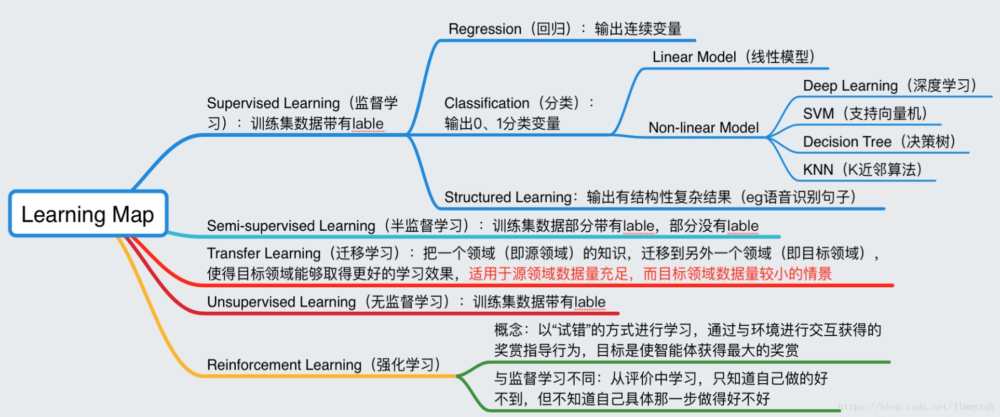
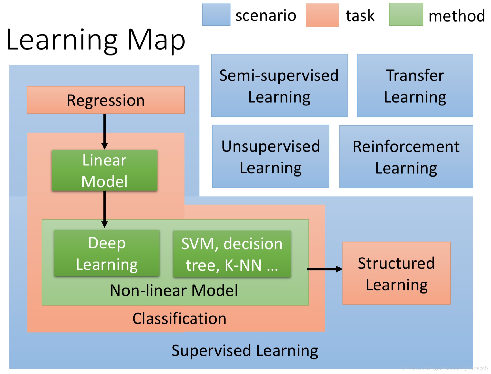
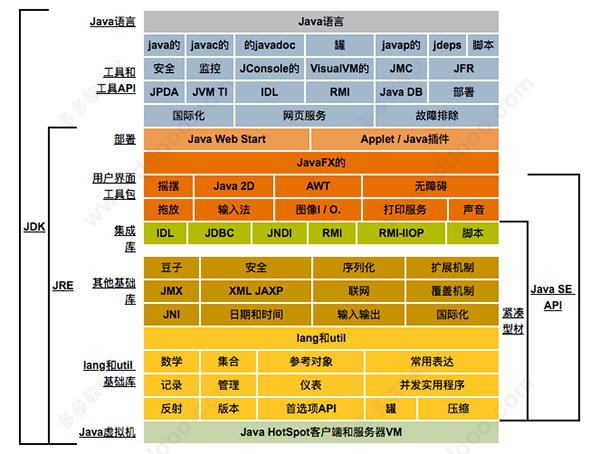

Java机器学习库


### 机器学习的标准范式表达

对于一个Task及其Performance的度量方法，给出特定的Algorithm，能够通过利用Experience Data不断提高在该Task上的Performance的方法，就称为机器学习。

其实这个定义就是“学习”的全部含义，这个事情按照机器的思路来做，就是机器学习

只要算法合理，每次学习都能有提高，机器有足够的运算能力，就能将机器的能力达到极致从而超越人类。机器学习的本质就是建立（"数据"——"认知"）关系库。

机器学习说白了跟人类学习是一样的，只不过机器可以无止境的学习，并且，机器学习时完全不需要懂什么原理，只要知道怎么去实现就行。就如Alpha Go，你们觉得它懂得棋理吗？我觉得肯定不懂，但通过对无数的棋谱的学习，让人觉得它肯定掌握了围棋的真谛。


### 感知机

感知机（perceptron）是二分类的线性分类模型，输入为实例的特征向量，输出为实例的类别（取+1和-1）。感知机对应于输入空间中将实例划分为两类的分离超平面。感知机旨在求出该超平面，为求得超平面导入了基于误分类的损失函数，利用梯度下降法 对损失函数进行最优化（最优化）。感知机的学习算法具有简单而易于实现的优点，分为原始形式和对偶形式。感知机预测是用学习得到的感知机模型对新的实例进行预测的，因此属于判别模型。感知机由Rosenblatt于1957年提出的，是神经网络和支持向量机的基础。


感知机要做的，就是根据各点坐标，将错误的直线纠正为正确的，这样得到的直线就是训练的结果。

```java
    /*
     * 判断所有点的位置关系,进行分类
     */
    public boolean classify() {
        boolean flag = false;
        while (!flag) {
            for (int i = 0; i < arrayList.size(); i++) {
                if (Anwser(arrayList.get(i)) <= 0) {
                    Update(arrayList.get(i));
                    break;
                }
                if (i + 1 == arrayList.size()) {
                    flag = true;
                }
            }
        }
        return true;
    }


    /*
     * 点乘返回sum
     */
    private double Dot(double[] w, double[] x) {
        double sum = 0;
        for (int i = 0; i < x.length; i++) {
            sum += w[i] * x[i];
        }
        return sum;
    }

    /*
     * 返回函数计算的值
     */
    private double Anwser(Point point) {
        System.out.println(Arrays.toString(w));
        System.out.println(b);
        return point.y * (Dot(w, point.x) + b);
    }
```


```
  public void Update(Point point) {
        for (int i = 0; i < w.length; i++) {
            w[i] += eta * point.y * point.x[i];
        }
        b += eta * point.y;
        return;
    }
```


结果

```
1         Point p1 = new Point(new double[] { 0, 0, 0, 1 }, -1);
2         Point p2 = new Point(new double[] { 1, 0, 0, 0 }, 1);
3         Point p3 = new Point(new double[] { 2, 1, 0, 0 }, 1);
4         Point p4 = new Point(new double[] { 2, 1, 0, 1 }, -1);
```


### 云标签

```
离散数学 C语言游戏 经济刑法 神经网络SVM 决策树 javafx 协同进化wxpython PAT web Sci-hub MatlabCSS HTML 计算机组成原理 socketWindows 贪心算法 PyQt JavaScriptwordpress 格雷码 机器学习 googlewin10 PEP8 AUC 数字逻辑 网络原理 朴素贝叶斯 多线程 JAVA TensorFlow 编程语言概述 SEE 动态规划 ROC ideasVNS 特征选择 算法 人工智能 软件工程 Cyber Crime nltk Linux 操作系统原理app 汇编语言 GUI NSGA-II 聚类 k-means KMP算法 数据库 课程设计C++ 正则表达式 深度学习 CSO算法 生命周期模型 tkinter SAA numpy 量化投资Github 多目标优化算法 PythonPSO算法 knn MIC 数据结构 SQL C语言 Android json ACO算法
```


### 机器学习及人工智能

机器学习与深度学习可以看作人工智能的内部模型提炼过程，人工智能则是对外部的智能反应。

人工智能
人工智能（Artificial Intelligence），学术定义为用于研究，模拟及扩展人的智能应用科学；AI在计算机领域研究涉及机器人，语言识别，图像识别，自然语言处理等。AI的研究会横跨多门学科，如计算机，数学，生物，语言，声音，视觉甚至心理学和哲学。

其中AI的核心是做到感知，推断，行动及根据经验值进行调整，即类似人类的智慧体智能学习提升。

深度学习


深度学习则泛指深度神经网络学习，如卷积神经网络（Convolutional Neural Nets，CNN），把普通神经网络从3-4层升华到8-10层从而获取更精准模型，其应用如图像视频识别等。

人工智能，神经网络并非什么新鲜事物，早在20-30年前就已经诞生，而深度学习则借助因互联网而诞生的大数据，及近些年发展的强大运算能力（图形处理GPU）而大放光彩，甚至推动引爆了新一代的人工智能。

机器学习

机器学习的学究的定义为“计算机程序如何随着经验积累自动提高性能”，经典英文定义为

“A computer program is said to learn from experience E with respect to some class of tasks T and performance measure P, if its performance at tasks in T, as measured by P, improves with experience E.”，即“对于某类任务T和性能度量P，如果一个计算机程序在T上以P衡量的性能随着经验E而自我完善，那么我们称这个计算机程序在从经验E学习”， 通俗点说既是让机器来模拟人类来学习新的知识与技能，重点是不是通过某精妙算法而达成，而是让程序去通过学习发现提高，举一反三， 正所谓授之以鱼不如授之以渔。




### 机器学习框架图

**蓝色**：情景，取决于数据的具体情况，比如在没有数据label的情景下不得不放弃监督学习，选择无监督学习，在建模的过程中应考虑的情景
**红色**：问题，即机器学习的目的
**绿色**：算法




### 机器学习分类

```
机器学习在学习的方法广义上分为有监督学习与无监督学习。
有监督学习（Supervised Learning）
监督学习，通常对具有标记分类的训练样本特征进行学习，标记即已经知道其对应正确分类答案；而学习则本质是找到特征与标签（正确答案）之间的关系（函数），从而当训练结束，输入无标签的数据时，可以利用已经找出的关系方法进行分析得出数据标签。
监督学习类似我们在学校的学习，通常的题目都会有“正确答案”，以便于我们每学期学习结束（训练），参加未知的考试作为检验。

监督学习的模型及流程:
获取数据并确定所处理数据类型
确定并提取训练数据集的特征（feature）
选择机器学习方法如向量机或决策树
获取最终机器模型
对机器学习模型进行评估

监督学习方法及用途
常用的监督机器学习方法有如人工神经网络，决策树，传统贝叶斯分类器，支撑向量机（SVM）等。
监督学习的主要用途通常用来进行样本分类与回归（找到最为接近的函数用于预测），而又根据其输出结果连续还是离散分为回归分析（Regression）与分类（Classification）。

无监督学习（Unsupervised Learning）
反之，无监督学习则通常学习数据只有特征向量，没有标签（答案），学习模型通过学习特征向量发现其内部规律与性质，从而把数据分组聚类（Clustering）。
无监督学习更类似我们的真实世界，去探索发现一些规律及分类。
举个例子，如果把监督学习看作未成年时在家长及老师的“监督”下做告知正确的事，则无监督学习就是成年后踏入社会，自己去探索，发现，适应社会了。

无监督学习方法及用途
常用的无监督学习方法有： K-Means， 层次化聚类（Hierarchical Clustering），社交网络分析，一些数据挖掘算法等。
无监督学习的用途则主要用来在未知（无标签）数据中发现相似或者隐藏结构并进行聚类（Clustering），或者发现数据对应输入空间的分布之密度估计等。
当然对于数据样本介于无标记及部分标记之间，这种机器学习则被称为半监督学习（semi-supervised learning），我们暂不介绍。

3线性回归算法
总体来说，机器学习中的回归算法的本质是通过对样本数据的收集，给出假设的函数模型，而此函数包含未知参数，机器学习的过程就是解方程或者找到最优解，当验证通过后，从而可以用该函数去预测测试新数据。

线性回归

回归，统计学术语，表示变量之间的某种数量依存关系，并由此引出回归方程，回归系数。
线性回归（Linear Regression），数理统计中回归分析，用来确定两种或两种以上变量间相互依赖的定量关系的一种统计分析方法，其表达形式为y = w'x+e，e为误差服从均值为0的正态分布，其中只有一个自变量的情况称为简单回归，多个自变量的情况叫多元回归。

```


### 机器学习基本概念

```

1、机器学习算法类型
  根据训练数据提供的信息以及反馈方式的不同，可以分为： 
* 有监督学习(Supervised Learning)：每组训练数据都有一个明确的标签和结果，利用这些已知的数据来学习模型的参数，使得模型预测的目标标签和真实标签尽可能接近。涉及的应用：预测房屋的价格，股票的涨停，垃圾邮件检测。神经网络也是一种监督学习的方式。常见算法有逻辑回归(Logistic Regression)和反向传递神经网络(Back Propagation Neural Network)。根据目标标签的类型不同，又可以分为： 
* 回归(Regression)问题：目标标签y是连续值（实数或连续整数）,f(x)的输出也是连续值。 
* 分类(Classification)问题：目标标签y是离散的类别（符号）。在此问题中，通过学习得到的决策函数也叫分类器。


无监督学习(Unsupervised Learning)：学习的数据不包含目标标签，需要学习算法自动学习到一些有价值的信息。一个典型的问题就是聚类，常见算法包括Apriori算法以及k-Means算法。


半监督学习(Semi-supervised Learning)：少量有目标标签的样本和大量没有目标标签的样本。先试图对未标识数据进行建模，在此基础上对标识的数据进行预测，如图论推理算法或者拉普拉斯支持向量机等。


强化学习(Reinforcement Learning)：输入数据直接反馈到模型，模型必须立刻做出调整。也就是常说的从经验中总结提升。常见的应用场景包括动态系统以及机器人控制等，Google的AlphaGo就是运用了这种学习方式。算法本身会总结失败和成功的经验来达到很高的成功率。常见算法包括Q-Learning以及时间差学习（Temporal difference learning）。


遗传算法(Genetic Algorithm)：模拟进化理论，适者生存不适者淘汰，通过淘汰机制选择最优化的模型。


  在企业数据应用的场景下， 人们最常用的可能就是监督式学习和非监督式学习的模型。 在图像识别等领域，由于存在大量的非标识的数据和少量的可标识数据， 目前半监督式学习是一个很热的话题。 而强化学习更多的应用在机器人控制及其他需要进行系统控制的领域。

2、风险函数与损失函数
  我们需要建立一些准则来衡量决策函数的好坏，一般是定义一个损失函数L(y,f(x,θ))，然后在所有的训练样本上来评价决策函数的风险。

损失函数
  给定一个实例(x,y)，真实目标是y，机器学习模型预测的结果为f(x,θ)，损失函数就是用来估量模型的预测值和真实值的不一致程度，它是一个非负实值函数，损失函数越小，模型的鲁棒性就越好。损失函数是经验风险函数的核心部分，也是结构风险函数的重要组成部分。 
常见的损失函数有如下几类： 
* 0-1损失函数：0-1损失函数（0-1 loss function）是 

L(y,f(x,θ))=={01if y=f(x,θ)if y≠f(x,θ)I(y≠f(x,θ))

* 平方损失函数：通常为线性回归的损失函数。 
L(y,y^)=(y−f(x,θ))2

  最小二乘法和梯度下降法都是通过求导来求损失函数的最小值。 
* 最小二乘法：直接对L(y,f(x,θ))求导找出全局最小，是非迭代法； 
* 梯度下降法：迭代法，先给定一个，然后向下降最快的方向调整，在若干次迭代之后找到局部最小。其缺点是到最小点的时候收敛速度变慢，并且对初始点的选择极为敏感。 
* 交叉熵损失函数：对于分类问题，预测目标为y为离散的类别，模型输出f(x,θ)为每个类的条件概率。 
  假设y∈{1,...,C}，模型预测的第i个类的条件概率P(y=i∣x)=fi(x,θ)，则f(x,θ)满足 
fi(x,θ)∈[0,1]，∑i=1Cfi(x,θ)=1

  f_y(x,\theta)可以看做真实类别y的似然函数。参数可以用最大似然估计来优化。考虑到计算问题，我们经常使用最小化负对数似然，也就是负对数似然损失函数。 
L(y,f(x,θ))=−logfy(x,θ)

  如果我们用one-hot向量y来表示目标类别c，其中只有yc=1，其余的向量元素都为0. 
  负对数似然函数可以写为： 
L(y,f(x,θ))=−∑i=1Cyilogfi(x,θ)

  yi也可以看成是真实类别的分布，这样上面的公式恰好是交叉熵的形式，因此，负对数似然函数也常叫做交叉熵损失函数。 
* Hinge损失函数：对于两类分类问题，假设y和f(x,θ)的取值为{−1,+1}。Hinge损失函数的定义如下： 
L(y,f(x,θ))=max(0,1−yf(x,θ))=|1−yf(x,θ)|+.
风险函数
经验风险：Remp(θ)，在已知的训练样本（经验数据）上计算得来。用对参数θ求经验风险来逐渐逼近理想的期望风险的最小值，这一原则我们称为经验风险最小化原则。
结构风险：Rstruct(θ)，在经验风险最小化的原则上加上参数的正则化，叫做结构风险最小化原则。
3、常见的基本概念
数据
  所有能由计算机程序处理的对象的总称，可以是数字、字母和符号等。

特征
  在现实世界中，原始数据通常并不都是以连续变量或离散变量的形式存在的，我们首先需要抽取出一些可以表征这些数据的数值型特征，这些数值型特征可以表示为向量形式，也称为特征向量。

参数与超参数
  需要通过学习算法学习得来的就是参数。超参数是参数的参数。

特征学习
  如何自动地学习有效的特征也成为机器学习中一个重要的研究内容，也就是特征学习，也叫表示学习。特征学习分成两种，一种是特征选择，是在很多特征集合选取有效的子集；另一种是特征提取，是构造一个新的特征空间，并将原始特征投影到新的空间中。

样本
  按照一定的抽样规则从从全部数据中取出的一部分数据，是实际观测到的数据。

训练集和测试集
  一组样本的集合就称为数据集。为了检验机器学习算法的好坏，一般将数据集分成两部分：训练集和测试集。训练集用来进行模型学习，测试集用来进行模型验证。

正例和负例
  对于两类分类问题，常用正例和负例来分别表示属于不同类别的样本。

判别函数
  经过特征提取后，一个样本可以表示为k维特征空间中的一个点。为了对这些点进行分类，需要一些超平面来将这个特征空间分成一些互不重叠的子区域，使得不同类别的点分布在不同的子区域中，这些超平面就是判别界面。 
为了定义这些超平面，就需要引入判别函数。假设变量z∈Rm为特征空间中的点，这个超平面由所有满足函数f(z)=0的点组成。这里的的f(z)就是判别函数。
```


## java测试

第一个软件--二分法


人工智能--鬼（机器人）

智能程序：今日头条，淘宝，微信，忽视了他的置信度，不靠谱的信息。 买了一堆差的商品，无法评论信息的真伪新闻，忽略人与人的相处。


**JDK的基本组件**

1、javac – 编译器，将源程序转成字节码。

2、jar – 打包工具，将相关的类文件打包成一个文件。
3、javadoc – 文档生成器，从源码注释中提取文档。
4、jdb – debugger，查错工具。
5、java – 运行编译后的java程序（.class后缀的）。
6、appletviewer：小程序浏览器，一种执行HTML文件上的Java小程序的Java浏览器。
7、Javah：产生可以调用Java过程的C过程，或建立能被Java程序调用的C过程的头文件。
8、Javap：Java反汇编器，显示编译类文件中的可访问功能和数据，同时显示字节代码含义。
9、Jconsole: Java进行系统调试和监控的工具。


**jdk8 mac版新特性**

1、Java 8允许我们给接口添加一个非抽象的方法实现，只需要使用 default关键字即可。
2、新增lambda表达式。
3、提供函数式接口。
4、Java 8 允许你使用 :: 关键字来传递方法或者构造函数引用。
5、我们可以直接在lambda表达式中访问外层的局部变量。




```
30亿设备运行java

Java SE Development Kit 8 for mac版是一个可以在苹果电脑上使用的Java语言的软件开发工具包，主要用于移动设备、嵌入式设备上的java应用程序，也可以简称其为“jdk8”。JDK是整个java开发的核心，它包含了JAVA的运行环境（JVM+Java系统类库）和JAVA工具。新版本的JDK多了许多有用的功能，比如说新增了一个依懒性分析工具jdeps，可由开发人员理解他们的应用程序和库的静态依赖关系；新的jar文件属性切入点，确定进场点有助于防止未经授权的代码被运行时JAR文件与main()方法的多个类，多个Applet类，或多个JavaFX应用程序类；新的JAXP处理属性maxelementdepth，被添加到提供应用程序设置最大元素深度限制在一个xml文件当中。想要学好Java，那么JDK是比不可少的，有需要的小伙伴赶紧来下载吧。
https://pan.baidu.com/s/1vvrnHmpo3gLDJJNOeD289g

```


**终端 运行2019-09-04**

```

Last login: Wed Sep  4 19:17:20 on ttys001
➜  ~ git:(master) ✗ cd /Users/tianzi/Desktop/时间复杂度 
➜  时间复杂度 git:(master) ✗ javac  erfen.java
上面是编译
➜  时间复杂度 git:(master) ✗ java  erfen                         
这个是运行；
3
➜  时间复杂度 git:(master) ✗ 


Java 二分法查找
//https://blog.csdn.net/happyzwh/article/details/80398519
```


```java

public class erfen{
    
    public static int binerySearch(int[] arr, int searchNum) {
        // 初始化左侧索引
        int leftIndex = 0;
        // 初始化右侧索引
        int rightIndex = arr.length - 1;
        while (leftIndex <= rightIndex) {
            // 计算中间索引
            int mid = (leftIndex + rightIndex) >>> 1;//主要防止溢出，就是除以2的意思
            // 如果查询的数等于中间索引对应的数组里的数，则返回mid索引，并退出循环
            if (searchNum == arr[mid]) {
                return mid;
            }
            // 判断并计算右侧索引
            if (searchNum < arr[mid]) {
                rightIndex = mid - 1;
            }
            // 判断并计算左侧索引
            if (searchNum > arr[mid]) {
                leftIndex = mid + 1;
            }
        }
        return -1;
    }
    public static void main(String[] args) {
        erfen er = new erfen();
        int[] arr ={1,2,3,4,5,6,7};
        int x = er.binerySearch(arr, 4);
        System.out.println(x);

    }

}
```


