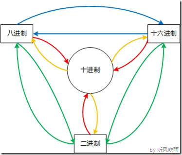

## 进制转换

```
Into the system
进制
Hexadecimal conversion进制	转换
```





 二进制常用表示，0b开头;  0b开头，后面接01组成的数字

八进制常用表示，0o或者0O开头，后面接数字	 ;0o或者0O开头，后面接数字

十六进制常用表示，0x或者0X开头	;0x或者0X开头，后面接0-9,A-F

|进制|用代码写|
|-|-|
|2->10|ob10000=16;    int('10000')=16;     int('0b10',2)=2;     eval('ob10')=2|
|10->2|bin(64) = '0b1000000'  ;     "{0:0b}".format(3)=11|
|||
|8->10|0o377 =255;    int('100',8)= 64;    eval('0o12')=10|
|10->8|oct(64) = 0o100;     "{o:0o}".format(64)='100' ; "%0o"%(64) =100|
|||
|16->10|0x10 =16;    0xFF=255;    int('40',16) =64. ;int('0x40',16)=64|
|10->16|Hex(196)="0x31x"; "{0:0x}".format(64) = 40;"%0x"%(255) =ff; %0X"%(255) =FF;|
|||
|8-2|327 = 011 010 111|
|16-2|D7 = 1101 0111|
|8-16=8-2-16|(必须先转成2进制) D7=11010111 = 327|
|||
|||


```python
Python整数能够以十六进制，八进制和二进制来编写，作为一般以10位基数的十进制计数法的补充。

一: 上面三种进制的常用表示	（下面的都是0开头）
>>> 0b1, 0b10000, 0b11111111,			 0o1, 0o20, 0o377,  		0x01, 0x10, 0xFF        
(1, 16, 255, 1, 16, 255, 1, 16, 255)
```


**一、（二，八，十六进制）转十进制**

方法：假设我们要将n进制转换为十进制，首先我们从n进制的右边为第一位数（从低位到高位），其权值是n的0次方，第二位是n的1次方，依次递增下去，把最后的结果相加的值就是十进制的值了。

（1101）n  =  1*（n）^3  + 1 * (n) ^ 2  +  0 * (n) ^ 1 + 0 * (n) ^ 0 

n进制转成10进制

```python
使用int函数来转换
10 
>>> int("64"), int("100", 8), int("40", 16), int("1000000", 2)
(64, 64, 64, 64)
 
>>> int("0x40", 16), int("0b1000000", 2)
(64, 64)
 
使用eval函数来转换
>>> eval("64"), eval("0o100"), eval("0x40"), eval("0b1000000")
(64, 64, 64, 64)
```


**二、十进制 转换为（二，八，十六进制）**

\>>> hex(796)		'0x31c'

方法：除n取余法，即每次将整数部分除以n，余数为该位权上的数，而商继续除以n，余数又为上一个位权上的数，这个步骤一直持续下去，直到商为0为止，最后读数时候，从最后一个余数读起，一直到最前面的一个余数。

举例子

将十进制的(796)D转换为十六进制的步骤如下：

1. 将商796除以16，商49余数为12，对应十六进制的C；  796 /16  = 49···12

2. 将商49除以16，商3余数为1；									49 /16 = 3···1 

3. 将商3除以16，商0余数为3； 									  3 / 16  =0 ···3

4. 读数，因为最后一位是经过多次除以16才得到的，因此它是最高位，

  **最后**：读数字从最后的余数向前读，31C，即(796)D=(31C)H

  ```
  1. 反过来推一下 12 + 1*16 + 3*16*16=796
  辗转相除法
  >>> hex(796)		'0x31c'
  ```

```python
使用内置函数来转换
>>> oct(64), hex(64), bin(64)
('0o100', '0x40', '0b1000000')  

使用字符串格式化来转化
>>> "{0:0o}, {1:0x}, {2:0b}".format(64, 64, 64)
'100, 40, 1000000'
 
>>> "%0o, %0x, %0X" % (64, 255, 255)
'100, ff, FF'
 
```


**三、（二进制） ↔ （八、十六进制）**

二进制 → 八进制b-o
　　方法：取三合一法，即从二进制的小数点为分界点，向左（向右）每三位取成一位，接着将这三位二进制按权相加，然后，按顺序进行排列，小数点的位置不变，得到的数字就是我们所求的八进制数。如果向左（向右）取三位后，取到最高（最低）位时候，如果无法凑足三位，可以在小数点最左边（最右边），即整数的最高位（最低位）添0，凑足三位。

举例子  11010111.0100111

```
(0)11 010 111.010 011 1(00)
1. 小数点前111 = 7；
2. 010 = 2；
3. 11补全为011，011 = 3；
4. 小数点后010 = 2；
5. 011 = 3；
6. 1补全为100，100 = 4；
7. 读数，读数从高位到低位，
最后：以小数点做做分割线； 即(11010111.0100111)B=(327.234)O。

```


八进制 → 二进制0-b
　　方法：取一分三法，即将一位八进制数分解成三位二进制数，用三位二进制按权相加去凑这位八进制数，小数点位置照旧。

例：327

```
3	2	7 
1. 3 = 011；
2. 2 = 010；
3. 7 = 111；
4. 读数，读数从高位到低位，011010111，
最后：即(327)O=(11010111)B。
```

---


二进制 → 十六进制
　　方法：取四合一法，即从二进制的小数点为分界点，向左（向右）每四位取成一位，接着将这四位二进制按权相加，然后，按顺序进行排列，小数点的位置不变，得到的数字就是我们所求的十六进制数。如果向左（向右）取四位后，取到最高（最低）位时候，如果无法凑足四位，可以在小数点最左边（最右边），即整数的最高位（最低位）添0，凑足四位。

　　例：(11010111)B

```
1101  0111
1. 0111 = 7；
2. 1101 = D；
3. 读数，读数从高位到低位，
end :即(11010111)B=(D7)H。

```


十六进制 → 二进制
　　方法：取一分四法，即将一位十六进制数分解成四位二进制数，用四位二进制按权相加去凑这位十六进制数，小数点位置照旧。

　(D7)H

```
D		7
1. D = 1101；
2. 7 = 0111；
3. 读数，读数从高位到低位，
end :即(D7)H=(11010111)B。
```

---


八进制 → 十六进制
　　方法：将八进制转换为二进制，然后再将二进制转换为十六进制，小数点位置不变。

　　例：(327)O

```
3 2 7
1. 3 = 011；
2. 2 = 010；
3. 7 = 111；
4. 0111 = 7；
5. 1101 = D；
6. 读数，读数从高位到低位，D7，即(327)O=(D7)H
    
```


十六进制 → 八进制
　　方法：将十六进制转换为二进制，然后再将二进制转换为八进制，小数点位置不变。

　　例：将十六进制的(D7)H转换为八进制的步骤如下：

```
D 7
1. 7 = 0111；
2. D = 1101；
3. 0111 = 7；
4. 010 = 2；
5. 011 = 3；
6. 读数，读数从高位到低位，327，
end :即(D7)H=(327)O。
```


**扩展**
负数的进制转换稍微有些不同。

先把负数写为其补码形式（在此不议），然后再根据二进制转换其它进制的方法进行。

包含小数的进制换算：

(ABC.8C)H=10x16^2+11x16^1+12x16^0+8x16^-1+12x16^-2

=2560+176+12+0.5+0.046875

=(2748.546875)D


## IP


IP地址计算器、子网掩码计算器、网络主机计算器

http://ip.chacuo.net/ipcalc

各种进制转换（二，八，十，十六进制间转换）详解附代码

https://blog.csdn.net/qq_41785863/article/details/84101711

**机器语言**

最初的计算机使用的是又"0"和"1"组成的二进制数，二进制是计算机语言的基础，将一串二进制数字转换为高低电平，驱动计算机运行。在计算机中，所有的数据都能使用二进制数表达。


```
>>> int('110110',2)
54
>>> int('1011101',2)
93
>>> int('1011101',8)
266817
>>> bin(13)
'0b1101'
>>> bin(192)
'0b11000000'
>>> bin(111)
'0b1101111'
>>> bin(100)
'0b1100100'
>>> bin(254)
'0b11111110'
>>> bin(192)
'0b11000000'
>>> bin(252)
'0b11111100'
>>> bin(3232235521)
'0b11000000101010000000000000000001'


0000 0000（二进制数）表示0(十进制数)
1111 1111（二进制数）表示255(十进制数)
```


**一. 机器数和真值**

**1、机器数**

一个数在计算机中的二进制表示形式, 叫做这个数的机器数。机器数是带符号的，在计算机用一个数的最高位存放符号, 正数为0, 负数为1.

比如，十进制中的数 +3 ，计算机字长为8位，转换成二进制就是00000011。如果是 -3 ，就是 10000011 。

那么，这里的 00000011 和 10000011 就是机器数。

**2、真值**

因为第一位是符号位，所以机器数的形式值就不等于真正的数值。例如上面的有符号数 10000011，其最高位1代表负，其真正数值是 -3 而不是形式值131（10000011转换成十进制等于131）。所以，为区别起见，将带符号位的机器数对应的真正数值称为机器数的真值。


我们可以轻松的用二进制表示一个正数，但负数如何用计算机表达呢？这就需要知道原码，补码和反码。其实数分为有符号数和无符号数，原码，反码和补码都是有有符号数的表示方法，

在计算机中，负值以其正值的补码形式表达;

正数的原码，补码和反码都为他本身;

原码, 反码, 补码是机器存储一个具体数字的编码方式.

**二. 原码, 反码, 补码的基础概念和计算方法.**

**1. 原码**

原码就是符号位加上真值的绝对值, 即用第一位表示符号, 其余位表示值. 比如如果是8位二进制:

[+1]原 = 0000 0001

[-1]原 = 1000 0001

第一位是符号位. 因为第一位是符号位, 所以8位二进制数的取值范围就是:

[1111 1111 , 0111 1111]

即[-127 , 127]

原码是人脑最容易理解和计算的表示方式;

一个整数，按照绝对值大小转换成二进制数为原码，原码的最高位为符号位，"0"表示正，''1"表示负，其余位表示数值大小。
例如
1的原码为0000 0001
-1的原码为1000 0001

**2. 反码**

反码的表示方法是:

​	正数的反码是其本身

​	负数的反码是在其原码的基础上, 符号位不变，其余各个位取反.

[+1] = [00000001]原 = [00000001]反

[-1] = [10000001]原 = [11111110]反

可见如果一个反码表示的是负数, 人脑无法直观的看出来它的数值. 通常要将其转换成原码再计算.

将二进制数按位取反，所得的新二进制数称为原二进制数的反码。
取反（''1''变为''0'',''0''变为''1''）
例如
0000 0101取反为1111 1010
0000 0011取反为1111 1100
**正数取反**
10的原码是0000 1010 ，取反是1111 0101，即-11
5的原码是0000 0101，取反是1111 1010，即-6
**负数取反**
-10的二进制是1111 0110，取反是0000 1001，即9
-5的二进制是1111 1011，取反是0000 0100，即4
由此观之，正整数按位取反等于其负数减1。负整数按位取反等于其正数减1.

**3. 补码**

补码的表示方法是:

正数的补码就是其本身

负数的补码是在其原码的基础上, 符号位不变, 其余各位取反, 最后+1. (即在反码的基础上+1)

[+1] = [00000001]原 = [00000001]反 = [00000001]补

[-1] = [10000001]原 = [11111110]反 = [11111111]补

对于负数, 补码表示方式也是人脑无法直观看出其数值的. 通常也需要转换成原码在计算其数值.


**三. 为何要使用原码, 反码和补码** 

在开始深入学习前, 我的学习建议是先”死记硬背”上面的原码, 反码和补码的表示方式以及计算方法.

现在我们知道了计算机可以有三种编码方式表示一个数. 对于正数因为三种编码方式的结果都相同:

[+1] = [00000001]原 = [00000001]反 = [00000001]补

所以不需要过多解释. 但是对于负数:

[-1] = [10000001]原 = [11111110]反 = [11111111]补


可见原码, 反码和补码是完全不同的. 既然原码才是被人脑直接识别并用于计算表示方式, 为何还会有反码和补码呢?

首先, 因为人脑可以知道第一位是符号位, 在计算的时候我们会根据符号位, 选择对真值区域的加减. (真值的概念在本文最开头). 但是对于计算机, 加减乘数已经是最基础的运算, 要设计的尽量简单. 计算机辨别”符号位”显然会让计算机的基础电路设计变得十分复杂! 于是人们想出了将符号位也参与运算的方法. 我们知道, 根据运算法则减去一个正数等于加上一个负数, 即: 1-1 = 1 + (-1) = 0 , 所以机器可以只有加法而没有减法, 这样计算机运算的设计就更简单了.

于是人们开始探索 将符号位参与运算, 并且只保留加法的方法. 首先来看原码:

计算十进制的表达式: 1-1=0

1 - 1 = 1 + (-1) = [00000001]原 + [10000001]原 = [10000010]原 = -2

如果用原码表示, 让符号位也参与计算, 显然对于减法来说, 结果是不正确的.这也就是为何计算机内部不使用原码表示一个数.

为了解决原码做减法的问题, 出现了反码:

计算十进制的表达式: 1-1=0


1 - 1 = 1 + (-1) = [0000 0001]原 + [1000 0001]原= [0000 0001]反 + [1111 1110]反 = [1111 1111]反 = [1000 0000]原 = -0

发现用反码计算减法, 结果的真值部分是正确的. 而唯一的问题其实就出现在”0”这个特殊的数值上. 虽然人们理解上+0和-0是一样的, 但是0带符号是没有任何意义的. 而且会有[0000 0000]原和[1000 0000]原两个编码表示0.

于是补码的出现, 解决了0的符号以及两个编码的问题:

1-1 = 1 + (-1) = [0000 0001]原 + [1000 0001]原 = [0000 0001]补 + [1111 1111]补 = [0000 0000]补=[0000 0000]原

这样0用[0000 0000]表示, 而以前出现问题的-0则不存在了.而且可以用[1000 0000]表示-128:

(-1) + (-127) = [1000 0001]原 + [1111 1111]原 = [1111 1111]补 + [1000 0001]补 = [1000 0000]补


-1-127的结果应该是-128, 在用补码运算的结果中, [1000 0000]补 就是-128. 但是注意因为实际上是使用以前的-0的补码来表示-128, 所以-128并没有原码和反码表示.(对-128的补码表示[1000 0000]补算出来的原码是[0000 0000]原, 这是不正确的)

使用补码, 不仅仅修复了0的符号以及存在两个编码的问题, 而且还能够多表示一个最低数. 这就是为什么8位二进制, 使用原码或反码表示的范围为[-127, +127], 而使用补码表示的范围为[-128, 127].

因为机器使用补码, 所以对于编程中常用到的32位int类型, 可以表示范围是: [-231, 231-1] 因为第一位表示的是符号位.而使用补码表示时又可以多保存一个最小值.


**四 原码, 反码, 补码 再深入**

计算机巧妙地把符号位参与运算, 并且将减法变成了加法, 背后蕴含了怎样的数学原理呢?

将钟表想象成是一个1位的12进制数. 如果当前时间是6点, 我希望将时间设置成4点, 需要怎么做呢?我们可以:

1. 往回拨2个小时: 6 - 2 = 4

2. 往前拨10个小时: (6 + 10) mod 12 = 4

3. 往前拨10+12=22个小时: (6+22) mod 12 =4

2,3方法中的mod是指取模操作, 16 mod 12 =4 即用16除以12后的余数是4.

所以钟表往回拨(减法)的结果可以用往前拨(加法)替代!

现在的焦点就落在了如何用一个正数, 来替代一个负数. 上面的例子我们能感觉出来一些端倪, 发现一些规律. 但是数学是严谨的. 不能靠感觉.

首先介绍一个数学中相关的概念: 同余

 

**同余的概念**
两个整数a，b，若它们除以整数m所得的余数相等，则称a，b对于模m同余

记作 a ≡ b (mod m)

读作 a 与 b 关于模 m 同余。

举例说明:

4 mod 12 = 4

16 mod 12 = 4

28 mod 12 = 4

所以4, 16, 28关于模 12 同余.

 

**负数取模**
正数进行mod运算是很简单的. 但是负数呢?

下面是关于mod运算的数学定义:

公式的意思是:

```
x mod y等于 x 减去 y 乘上 x与y的商的下界.
以 -3 mod 2 举例:

-3 mod 2
= -3 - 2xL -3/2 J
= -3 - 2xL-1.5J
= -3 - 2x(-2)
= -3 + 4 = 1

所以:
(-2) mod 12 = 12-2=10
(-4) mod 12 = 12-4 = 8
(-5) mod 12 = 12 - 5 = 7
```


开始证明
再回到时钟的问题上:

```
回拨2小时 = 前拨10小时
回拨4小时 = 前拨8小时
回拨5小时= 前拨7小时
注意, 这里发现的规律!

结合上面学到的同余的概念.实际上:
(-2) mod 12 = 10
10 mod 12 = 10
-2与10是同余的.
(-4) mod 12 = 8
8 mod 12 = 8
-4与8是同余的.
```

距离成功越来越近了. 要实现用正数替代负数, 只需要运用同余数的两个定理:

```
反身性:
a ≡ a (mod m)
这个定理是很显而易见的.

线性运算定理:
如果a ≡ b (mod m)，c ≡ d (mod m) 那么:
(1)a ± c ≡ b ± d (mod m)
(2)a * c ≡ b * d (mod m)

如果想看这个定理的所以:
7 ≡ 7 (mod 12)
(-2) ≡ 10 (mod 12)
7 -2 ≡ 7 + 10 (mod 12)
```

现在我们为一个负数, 找到了它的正数同余数. 但是并不是7-2 = 7+10, 而是 7 -2 ≡ 7 + 10 (mod 12) , 即计算结果的余数相等.

接下来回到二进制的问题上, 看一下: 2-1=1的问题.

2-1=2+(-1) = [0000 0010]原 + [1000 0001]原= [0000 0010]反 + [1111 1110]反

先到这一步, -1的反码表示是1111 1110. 如果这里将[1111 1110]认为是原码, 则[1111 1110]原 = -126, 这里将符号位除去, 即认为是126.

发现有如下规律:

```
(-1) mod 127 = 126
126 mod 127 = 126
即:

(-1) ≡ 126 (mod 127)
2-1 ≡ 2+126 (mod 127)
```

2-1 与 2+126的余数结果是相同的! 而这个余数, 正式我们的期望的计算结果: 2-1=1

所以说一个数的反码, 实际上是这个数对于一个膜的同余数. 而这个膜并不是我们的二进制, 而是所能表示的最大值! 这就和钟表一样, 转了一圈后总能找到在可表示范围内的一个正确的数值!

而2+126很显然相当于钟表转过了一轮, 而因为符号位是参与计算的, 正好和溢出的最高位形成正确的运算结果.

既然反码可以将减法变成加法, 那么现在计算机使用的补码呢? 为什么在反码的基础上加1, 还能得到正确的结果?

2-1=2+(-1) = [0000 0010]原 + [1000 0001]原 = [0000 0010]补 + [1111 1111]补

如果把[1111 1111]当成原码, 去除符号位, 则:

```
[0111 1111]原 = 127
其实, 在反码的基础上+1, 只是相当于增加了膜的值:
(-1) mod 128 = 127
127 mod 128 = 127
2-1 ≡ 2+127 (mod 128)
```

此时, 表盘相当于每128个刻度转一轮. 所以用补码表示的运算结果最小值和最大值应该是[-128, 128].

但是由于0的特殊情况, 没有办法表示128, 所以补码的取值范围是[-128, 127]


## 数据类型

无类型： 汇编
弱类型、静态类型 ： C/C++
弱类型、动态类型检查： Perl/PHP
强类型、静态类型检查 ：Java/C#
强类型、动态类型检查 ：Python, Scheme
静态**显式**类型 ：Java/C
静态隐式类型 ：Ocaml, Haskell


c语言下标越界---java

php动态扩容；


**原码反码补码**

```
原码：
补码：方便做加法运算；
反码：（取反；正数等于原码）做加法

根据定义  [-128，127）;
怎么区分二进制，怎么区分第一个字符是正（0） ，负（1），128；
还是就是255；

131 就是131 ；负3就是负3 ，看程序怎么定义的；
bit位 1000 0011 ；1个字节就可以做到； 
从16- 32- 64位的字节。
```


## 他山之石

```
原码、反码、补码知识详细讲解
https://blog.csdn.net/zl10086111/article/details/80907428

同余定理(百度百科)
http://baike.baidu.com/view/79282.htm

弱类型、强类型、动态类型、静态类型语言的区别是什么？
https://www.cnblogs.com/feng9exe/p/7338160.html
```


