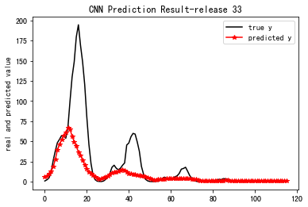
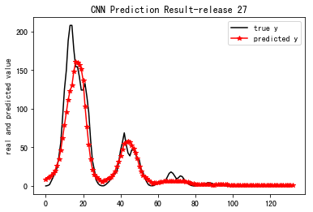
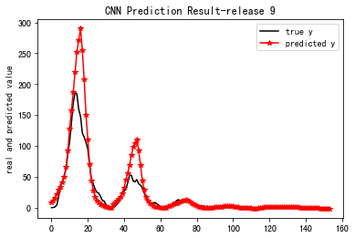
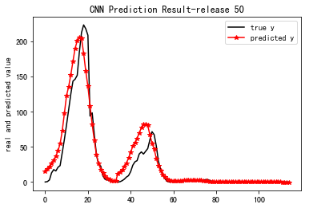
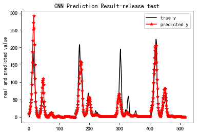
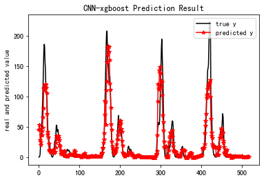

****

**[ss]()**


## pandas官方

**Pandas:功能强大的Python数据析具包**

最新发布的	 最新发布的v0.25.1 
 最新发布的anaconda cloud 0.25.1 
包状态	 状态stable(稳定的)
执照	 执照BSD（加州大学伯克利分校软件（Berkeley Software Distribution））
建立状态	 travis构建状态
 Azure管道构建状态（填充）
覆盖	 			覆盖（93%）
下载				 conda-forge下载（6m全部 total）
小胶质gitter （加入聊天）	


​	

**它是什么？**
pandas是一个Python包，提供快速，灵活和富有表现力的数据结构，旨在使“关系”或“标记”数据的使用既简单又直观。它旨在成为在Python中进行实际，真实世界数据分析的基础高级构建块。此外，它还有更广泛的目标，即成为任何语言中最强大，最灵活的开源数据分析/操作工具。它已朝着这一目标迈进。


**主要特点**
以下是熊猫做得很好的一些事情：

- 轻松处理浮点中的缺失数据 missing data（表示为 NaN）以及非浮点数据

- 大小可变性：可以从DataFrame和更高维对象插入和删除列

- 自动和显式数据对齐：对象可以明确地对齐一组标签，或者用户可以简单地忽略标签和让Series，DataFrame等自动对齐数据你计算

- 功能强大，灵活的分组功能，可对数据集执行拆分应用组合操作，以便聚合和转换数据

- 可以轻松地将其他Python和NumPy数据结构中的不规则索引数据转换为DataFrame对象

- 基于智能标签的切片，花式索引和大数据集的子集化

- 直观的**合并和连接**数据集

- 灵活的数据集**整形和旋转**

- 轴的分层标记（每个刻度可能有多个标签）

- 强大的IO工具，用于从平面文件 （CSV和分隔的），Excel文件，数据库加载数据，以及从超快HDF5格式保存/加载数据

- 时间序列 Time series- 特定功能：日期范围生成和频率转换，移动窗口统计，移动窗口线性回归，日期转换和滞后等。

  

**在哪里得到它**
源代码目前托管on GitHub at: https://github.com/pandas-dev/pandas

最新发布版本的二进制安装程序可在Python包索引和conda上获得。

```
＃康达 康达安装熊猫# 									conda install pandas
＃或PyPI pip安装pandas;# or PyPI;		 pip install pandas

```


**依赖**

NumPy：				1.13.3或更高
python-dateutil：2.5.0或更高版本（标准Python日期时间功能的有用扩展）
pytz：					2015.4或更高（pytz  -  Python的世界时区定义）

搜索：https://github.com/search?utf8=%E2%9C%93&q=pytz&type=Repositories

**从源头安装**

```
要从源代码安装pandas，除了上面的常规依赖项外，还需要Cython。可以从pypi安装Cython：
pip安装cython								pip install cython


在pandas目录（克隆git repo后找到此文件的目录）中，执行：
python setup.py安装					python setup.py install


或者在开发模式下安装：python setup.py开发		python setup.py develop

或者，您可以使用，pip如果您希望自动引入所有依赖项（该-e选项用于在开发模式下安装它）：
pip install -e .


```


**文档**
官方文档托管on PyData.org: https://pandas.pydata.org/pandas-docs/stable
官方文档：https://pandas.pydata.org/pandas-docs/stable/install.html#installing-from-source

**执照**  ：BSD 3


**背景**
2008年pandas开始在AQR（一家定量对冲基金）开展工作，此后一直处于积极发展阶段。

**获得帮助**
对于使用问题，最好去的地方是StackOverflow。此外，一般问题和讨论也可以在pydata邮件列表上进行。

**讨论与发展**
大多数开发讨论都在这个回购中的github上进行。此外，pandas-dev邮件列表还可用于专门的讨论或设计问题，Gitter通道可用于快速开发相关问题。


## 一、Pandas 数据结构

Pandas的数据结构，缺失数据处理，层次化索引等等

**1. Series**

```
The page build failed for the `master` branch with the following error:
There was a YAML syntax error on line 5 column 1 in `<unknown>`: `could not find expected ':' while scanning a simple key`. For more information, see https://help.github.com/en/articles/page-build-failed-invalid-yaml-in-data-file.
For information on troubleshooting Jekyll see:
  https://help.github.com/articles/troubleshooting-jekyll-builds
If you have any questions you can contact us by replying to this email.

----------------------
不知道为啥不行哈
imput YAML Front Matter
layout: post
title: "pandas的学习"
date: 2019-09-04
tag: ml
```


**1）Series的创建**

- 通过一维数组创建序列

  ```
  import numpy as np, pandas as pd
  arr1 = np.arange(10)
  arr1
  type(arr1)
  s1 = pd.Series(arr1)
  s1
  type(s1)
  
  ```

- 通过字典的方式创建序列

  ```
  dic1 = {'a':10,'b':20,'c':30,'d':40,'e':50}
  dic1
  type(dic1)
  s2 = pd.Series(dic1)
  s2
  type(s2)
  ```

- 通过DataFrame中的某一行或某一列创建序列

- 带有独特索引的Series数据

  ```
  seriesdata_1=pd.Series(['Profession','student','bechelor','professor','informatics developer'],index=['Name','Linker','Hamacher','Schuhmacher','Heintze'])
  ```

- **s1.values** 获取数据

- **s1.index** 获取索引

**2) Series数据过滤**

```
seriesdata_2=pd.Series([34,-4,-45,-37,32,9,1,3],index=['a','d','e','y','f','t','u','o'])

seriesdata_2
Out[34]: 
a 34
d -4
e -45
y -37
f 32
t 9
u 1
o 3
dtype: int64

seriesdata_2[seriesdata_2>1]
Out[35]: 
a 34
f 32
t 9
o 3
dtype: int64

```

**3) Series数据计算**

```
seriesdata_2=pd.Series([34,-4,-45,-37,32,9,1,3],index=['a','d','e','y','f','t','u','o'])

seriesdata_2*3
Out[37]: 
a 102
d -12
e -135
y -111
f 96
t 27
u 3
o 9
dtype: int64

np.sin(seriesdata_2)
Out[38]: 
a 0.529083
d 0.756802
e -0.850904
y 0.643538
f 0.551427
t 0.412118
u 0.841471
o 0.141120
dtype: float64

```

**4) 应用字典函数**

- **in**

  ```
  datas_pys=pd.Series(range(4),index=['i','want','to','do'])
  
  datas_pys
  Out[35]: 
  i 0
  want 1
  to 2
  do 3
  dtype: int32
  
  'want' in datas_pys
  Out[36]: True
  
  
  ```

- **updata** 对号更改 index相同，不能添加

  ```
  datas_pys.update(pd.Series([2,3,4],index=['want','to','do']))
  
  datas_pys
  Out[57]: 
  i 0
  want 2
  to 3
  do 4
  dtype: int32
  
  ```

- **append**				末尾添加

  ```
  s1 = pd.Series([1, 2, 3])
  
  In [59]: s2 = pd.Series([4, 5, 6])
  
  In [60]: s3 = pd.Series([4, 5, 6], index=[3,4,5])
  
  s1.append(s2)
  Out[61]: 
  0 1
  1 2
  2 3
  0 4
  1 5
  2 6
  dtype: int64
  
  s1.append(s3)
  Out[62]: 
  0 1
  1 2
  2 3
  3 4
  4 5
  5 6
  dtype: int64
  
  s1.append(s2, ignore_index=True)
  # 忽略索引,重新编号
  Out[63]: 
  0 1
  1 2
  2 3
  3 4
  4 5
  5 6
  dtype: int64
  
  
  ```

**5)  检测数据缺失（重要）**

- **pd.isnull(series)   是就是True    / series.isnull()**

  ```
  dit_113={'lin':139,'zhang':134,'wang':173,'tan':None}
  serie_123=pd.Series(dit_113)
  
  serie_123
  Out[81]: 
  lin 139.0
  tan NaN
  wang 173.0
  zhang 134.0
  dtype: float64
  
  pd.isnull(serie_123)
  Out[82]: 
  lin False
  tan True
  wang False
  zhang False
  dtype: bool
  
  
  ```

- **pd.notnull(series)    这个可以 / series.notnull()**

  ```
  pd.notnull(serie_123)
  Out[83]: 
  lin True
  tan False
  wang True
  zhang True
  dtype: bool
  
  serie_123.notnull()
  Out[85]: 
  lin       True
  tan      False
  wang      True
  zhang     True
  dtype: bool
  
  
  ```

**6) Series 索引**

- 修改索引

  ```
  dit_113={'lin':139,'zhang':134,'wang':173,'tan':None}
  serie_123=pd.Series(dit_113)
  serie_123.index
  Out[87]: Index(['lin', 'tan', 'wang', 'zhang'], dtype='object')
  
  In [88]: serie_123.index=['lin', 'tan', 'shan', 'zhang']
  
  In [90]: serie_123
  Out[90]: 
  lin 139.0
  tan NaN
  shan 173.0
  zhang 134.0
  dtype: float64
  
  
  ```

- 索引重建

  > reindex方法可以为series和dataframe添加或者删除索引。
  > 方法：serise.reindex()、dataframe.reindex()
  > 如果新添加的索引没有对应的值，则默认为nan。如果减少索引，就相当于一个切片操作。

  ```
  Seriestest_1=pd.Series([10,-34,-89,36,50],index=['a','b','c','d','e'])
  
  In [5]: Seriestest_1
  Out[5]: 
  a 10
  b -34
  c -89
  d 36
  e 50
  dtype: int64
  
  Seriestest_2=Seriestest_1.reindex(['c','b','d','a','e','f'],fill_value=0)
  
  In [11]: Seriestest_2
  Out[11]: 
  c -89
  b -34
  d 36
  a 10
  e 50
  f 0
  dtype: int64
  
  
  
  ```

  > 使用ffill 可以自动向前 nan= [0,2]  23 = [3,6] ;22 = [7,8];34= [9,10] 
  >
  > bfill 函数和向后补充缺失索引。
  >
  > 23= [0,3];22 = [4,7];34= [8,9] ; 		nan= {10}

  ```
  testarray1=pd.Series([23,22,34],index=[3,7,9])
  In [10]: test_12=testarray1.reindex(range(11),method='ffill')
  
  In [11]: test_12
  Out[11]: 
  0 NaN
  1 NaN
  2 NaN
  3 23.0
  4 23.0
  5 23.0
  6 23.0
  7 22.0
  8 22.0
  9 34.0
  10 34.0
  dtype: float64
  
  test_12=testarray1.reindex(range(11),method='bfill')
  
  In [13]: test_12
  Out[13]: 
  0 23.0
  1 23.0
  2 23.0
  3 23.0
  
  
  4 22.0
  5 22.0
  6 22.0
  7 22.0
  
  
  8 34.0
  9 34.0
  10 NaN
  dtype: float64
  
  
  ```

**7) Series 删除**

- drop

  ```
  In [46]: Seriestest_1=pd.Series([233,356,997],index=['as','a','sample'])
  In [47]: Seriestest_1
  Out[47]: 
  as 233
  a 356
  sample 997
  dtype: int64
  
  Seriestest_1.drop('a')
  Out[95]: 
  as        233
  sample    997
  dtype: int64
  # drop函数或者说方法返回的是一个在指定轴上删除指定值的新对象
  
  
  ```

  

**2. DataFrame**

**1）DataFrame 的创建**

- 通过二维数组创建数据框

  ```
  arr2 = np.array(np.arange(12)).reshape(4,3)
  arr2
  type(arr2)
  df1 = pd.DataFrame(arr2)
  df1
  type(df1)
  
  
  ```

- 通过字典的方式创建数据框

  ```
  以下以两种字典来创建数据框，一个是字典列表，一个是嵌套字典。
  dic2 = {'a':[1,2,3,4],'b':[5,6,7,8],
  'c':[9,10,11,12],'d':[13,14,15,16]}
  dic2
  type(dic2)
  df2 = pd.DataFrame(dic2)
  df2
  type(df2)
  
  dic3 = {'one':{'a':1,'b':2,'c':3,'d':4},
  'two':{'a':5,'b':6,'c':7,'d':8},
  'three':{'a':9,'b':10,'c':11,'d':12}}
  dic3
  type(dic3)
  df3 = pd.DataFrame(dic3)
  df3
  type(df3)
  
  
  ```

- 指定标签

  ```
  frame_1=pd.DataFrame(np.arange(9).reshape(3,3),index=['row1','row2','row3'],columns=['one','two','three'])
  
  frame_1
  Out[19]: 
  one two three
  row1 0 1 2
  row2 3 4 5
  row3 6 7 8
  
  
  
  ```

- 通过数据框的方式创建数据框

  ```
  df4 = df3[['one','three']]
  df4
  type(df4)
  s3 = df3['one']
  s3
  type(s3)
  
  
  ```

- **df.values** 获取数据框的值 

**2) DataFrame 索引**

- **df.columns** 列数据索引

  ```
  # 获取列数据
  df[列标签]
  
  
  ```

- **df.index** 行数据索引

  ```
  # 获取行数据
  df.loc[行标签]
  
  
  ```

- 索引修改

  ```
  df.index=[]
  # 赋新值
  
  
  ```

- 添加新列

  ```
  df.[新列标签]=[] # 给新标签赋数据
  
  
  ```

- 数据框的索引修改

  > reindex可以任意删除，添加，交换行列

  - 增加索引

    ```
    frame_1=pd.DataFrame(np.arange(9).reshape(3,3),index=['row1','row2','row3'],columns=['one','two','three'])
    
    frame_1
    Out[19]: 
    	one two three
    row1 0 1 2
    row2 3 4 5
    row3 6 7 8
    
    frame2=frame_1.reindex(['row0','row1','row2','row3'])
    
    frame2
    Out[21]: 
    	one two three
    row0 NaN NaN NaN
    row1 0.0 1.0 2.0
    row2 3.0 4.0 5.0
    row3 6.0 7.0 8.0
    
    
    ```

  - reindex 修改列

    ```
    frame3=frame2.reindex(columns=['four','three'])
    
    frame3
    Out[29]: 
    	four three
    row0 NaN NaN
    row1 NaN 2.0
    row2 NaN 5.0
    row3 NaN 8.0
    
    
    ```

  - 同时修改列和行索引(必须之前的表有，可以做)

    ```
    frame4=frame_1.reindex(['row1','row2','row3','row4'],columns=['five','three','six'])
    
    In [32]: frame_1
    Out[32]: 
    one two three
    row1 0 1 2
    row2 3 4 5
    row3 6 7 8
    
    In [33]: frame4
    Out[33]: 
    five three six
    row1 NaN 2.0 NaN
    row2 NaN 5.0 NaN
    row3 NaN 8.0 NaN
    row4 NaN NaN NaN
    
    
    ```

- loc 函数修改数据框行索引与列

  ```
  frame5=frame_1.reindex(columns=['one','four','two','three'])
  
  In [36]: frame5
  Out[36]: 
  	one four two three
  row1 0 NaN 1 2
  row2 3 NaN 4 5
  row3 6 NaN 7 8
  
  In [40]: frame5['four']=pd.Series([34,56,78],index=['row1','row2','row3'])
  
  In [41]: frame5
  Out[41]: 
  one four two three
  row1 0 34 1 2
  row2 3 56 4 5
  row3 6 78 7 8
  
  In [44]: frame5.loc[['row2','row1','row3'],['one','two','four','three']]
  Out[44]: 
  one two four three
  row2 3 4 56 5
  row1 0 1 34 2
  row3 6 7 78 8
  
  
  
  ```

  

**3) DataFrame 赋值 / 删除**

- 使用 Series 赋值

  ```
  # 可以精确地赋值到行列交叉位，没有指定的行列交叉位不会被赋值，将会以NAN的形式显示。
  
  val_Series=pd.Series([0,1,1],index=[6,7,9])
  In [19]: framesample_1['Profit']=val_Series
  
  framesample_1
  Out[20]: 
  SalesQuantity Seller Sales Profit
  5 213 zhanghui 12365 NaN
  6 305 dongyibo 34563 0.0
  7 452 yangqian 45673 1.0
  8 302 liujuntao 23461 NaN
  9 190 zhangshanshan 89034 1.0
  
  
  
  ```

  ```
  # 为不存在的列赋值会产生新的列
  framesample_1['loss']=pd.Series([165,0,0,34,0],index=range(5,10,1))
  
  In [22]: framesample_1
  Out[22]: 
  SalesQuantity Seller Sales Profit loss
  5 213 zhanghui 12365 NaN 165
  6 305 dongyibo 34563 0.0 0
  7 452 yangqian 45673 1.0 0
  8 302 liujuntao 23461 NaN 34
  9 190 zhangshanshan 89034 1.0 0
  
  
  ```

- **del df[标签]** 删除列

- **df.drop()**

  > Drop函数删除指定值时必须指定轴，如果不指定轴，默认零轴。
  >
  > np.random.rand（4，4）全是正的
  >
  > 行是 axis= 0

  ```
  In [53]: Dataframe_1_test=pd.DataFrame(np.floor(np.random.randn(4,4)),index=['xu','liu','zhang','feng'],columns=['stufe','klasse','degree','group'])
  
  In [54]: Dataframe_1_test
  Out[54]: 
  stufe klasse degree group
  xu -1.0 0.0 -1.0 1.0
  liu 0.0 -2.0 -1.0 -1.0
  zhang 0.0 -3.0 -2.0 1.0
  feng -1.0 0.0 -1.0 0.0
  
  In [57]: Dataframe_1_test.drop(['stufe','klasse'],axis=1)
  Out[57]: 
  degree group
  xu -1.0 1.0
  liu -1.0 -1.0
  zhang -2.0 1.0
  feng -1.0 0.0
  
  In [59]: Dataframe_1_test.drop(['xu','feng'])
  Out[59]: 
  stufe klasse degree group
  liu 0.0 -2.0 -1.0 -1.0
  zhang 0.0 -3.0 -2.0 1.0
  
  In [60]: Dataframe_1_test.drop(['liu'])
  Out[60]: 
  stufe klasse degree group
  xu -1.0 0.0 -1.0 1.0
  zhang 0.0 -3.0 -2.0 1.0
  feng -1.0 0.0 -1.0 0.0
  
  
  ```

- **df.T** 数据框转置


4**) 标签添加名字**

- 列标签

  ```
  df.columns.name ='Name'
  
  
  ```

- 行标签

  ```
  df.index.name = 'Name'
  
  
  ```


**3. 索引与选取**

**1) Series 的索引**

- 按默认索引检索

  ```
  Testser_1=pd.Series([23,43,789,674,90,65],index=['apple','pear','persimmon','watermelon','strawberry','orange'])
  
  In [7]: Testser_1
  Out[7]: 
  apple 23
  pear 43
  persimmon 789
  watermelon 674
  strawberry 90
  orange 65
  dtype: int64
  
  In [9]: Testser_1[2:4]
  Out[9]: 
  persimmon 789
  watermelon 674
  dtype: int64
  
  
  ```

- 按给定索引切片

  ```
  In [25]: Testser_1['apple':'watermelon']
  Out[25]: 
  apple 23
  pear 43
  persimmon 789
  watermelon 674
  dtype: int64
  
  
  ```

  ```
  In [26]: Testser_1[['apple','watermelon']]
  Out[26]: 
  apple 23
  watermelon 674
  dtype: int64
  
  
  ```

- 单个索引

  ```
  # 按默认和按给定索引（也叫标签）均可检索
  In [27]: Testser_1['apple']
  Out[27]: 23
  
  In [28]: Testser_1[0]
  Out[28]: 23
  
  
  ```

- bool值索引

  ```
  In [30]: Testser_1[Testser_1>100]
  Out[30]: 
  persimmon 789
  watermelon 674
  dtype: int64
  
  
  ```

**2) Series 赋值**

```
# 选取赋值
Testser_1['apple':'watermelon']=[112,22,32,42]

In [32]: Testser_1
Out[32]: 
apple 112
pear 22
persimmon 32
watermelon 42
strawberry 90
orange 65
dtype: int64

# 选取广播赋值
In [34]: Testser_1['apple':'watermelon']=56

In [35]: Testser_1
Out[35]: 
apple 56
pear 56
persimmon 56
watermelon 56
strawberry 90
orange 65
dtype: int64

# 等同于[2:3]
In [37]: Testser_1[[2,3]]=34

In [38]: Testser_1
Out[38]: 
apple 56
pear 56
persimmon 34
watermelon 34
strawberry 90
orange 65
dtype: int64

# 单个索引赋值
In [39]: Testser_1['apple']=34

In [40]: Testser_1
Out[40]: 
apple 34
pear 56
persimmon 34
watermelon 34
strawberry 90
orange 65
dtype: int64


```


**3) DataFrame 的索引**

- 列索引选取

  ```
  In [5]: Data=pd.DataFrame(np.arange(16).reshape(4,4),index=('one','two','three','four'),columns=('wir','sie','ihr','ich'))
  
  In [6]: Data
  Out[6]: 
  wir sie ihr ich
  one 0 1 2 3
  two 4 5 6 7
  three 8 9 10 11
  four 12 13 14 15
  
  # 指定列索引
  In [7]: Data['wir']
  Out[7]: 
  one 0
  two 4
  three 8
  four 12
  Name: wir, dtype: int32
  
  In [8]: Data[['wir','ihr']]
  Out[8]: 
  wir ihr
  one 0 2
  two 4 6
  three 8 10
  four 12 14
  
  
  ```

- bool值索引

  ```
  In [23]: Data>8
  Out[23]: 
  wir sie ihr ich
  one False False False False
  two False False False False
  three False True True True
  four True True True True
  In [25]: Data[Data>8]=0
  
  
  ```

- bool值选区

  ```
  # 用“bool”值来检索时只能先检索出列数据，然后再与设定值比较，得出bool值Series
  In [22]: Data[Data['ihr']>6]
  Out[22]: 
  wir sie ihr ich
  three 8 9 10 11
  four 12 13 14 15
  
  Data[pd.Series([True,False,True,False],index=['one','two','three','four'])]
  Out[44]: 
         wir  sie  ihr  ich
  one      0    1    2    3
  three    8    9   10   11
  
  
  ```

- bool值选区赋值

  ```
  In [25]: Data[Data>8]=0
  
  In [26]: Data
  Out[26]: 
  wir sie ihr ich
  one 0 1 2 3
  two 4 5 6 7
  three 8 0 0 0
  four 0 0 0 0
  
  
  ```

- loc函数能指定行列索引进行检索

  ```
  # 指定行索引
  In [31]: Data.loc['two']
  Out[31]: 
  wir 4
  sie 5
  ihr 6
  ich 7
  Name: two, dtype: int32
  
  # 指定行列索引
  In [33]: Data.loc['four','wir':'ihr']
  Out[33]: 
  wir 12
  sie 13
  ihr 14
  Name: four, dtype: int32
  
  In [34]: Data.loc['four',['wir','ihr']]
  Out[34]: 
  wir 12
  ihr 14
  Name: four, dtype: int32
  
  Data.loc[['one','four'],['wir','ich']]
  Out[136]: 
        wir  ich
  one     0    3
  four   12   15
  
  In [35]: Data.loc['one':'three','ich']
  Out[35]: 
  one 3
  two 7
  three 11
  Name: ich, dtype: int32
  
  In [38]: Data.loc['one':,'wir']
  Out[38]: 
  one 0
  two 4
  three 8
  four 12
  Name: wir, dtype: int32
  
  # bool值索引
  In [45]: Data.loc[Data.wir>5,:'ich']
  Out[45]: 
  wir sie ihr ich
  three 8 9 10 11
  four 12 13 14 15
  
  
  ```

**4) 修改索引**

- **data.reindex( index=[ ] ,columns=[ ] )**

  ```
  In [50]: Data
  Out[50]: 
  	wir sie ihr ich
  one 0 1 2 3
  two 4 5 6 7
  three 8 9 10 11
  four 12 13 14 15
  
  # 修改行索引
  In [51]: Data.reindex(index=['one','three','four','two'])
  Out[51]: 
  	wir sie ihr ich
  one 0 1 2 3
  three 8 9 10 11
  four 12 13 14 15
  two 4 5 6 7
  
  # 修改列索引
  In [52]: Data.reindex(columns=['wir','ihr','sie','ich'])
  Out[52]: 
  wir ihr sie ich
  one 0 2 1 3
  two 4 6 5 7
  three 8 10 9 11
  four 12 14 13 15
  
  
  ```

  ```
  xs方法：根据标签选取单行和单列，返回‘Series’
  In [66]: Data.xs('one')
  Out[66]: 
  wir 0
  sie 1
  ihr 2
  ich 3
  Name: one, dtype: int32
  
  
  ```

5**) DataFrame 选取数据**

- data.xs()

  ```
  xs方法：根据标签选取单行和单列，返回‘Series’
  
  # 默认 axis = 0
  In [66]: Data.xs('one')
  Out[66]: 
  wir 0
  sie 1
  ihr 2
  ich 3
  Name: one, dtype: int32
  
  # 选取列需指定轴
  In [69]: Data.xs('sie',axis=1)
  Out[69]: 
  one 1
  two 5
  three 9
  four 13
  Name: sie, dtype: int32
  
  
  ```

- **data.get_value()**

  ```
  # get_value 方法得到数据框内单个值
  Data.get_value('three','ihr')
  Out[72]: 10
  
  # 获取单个值效果相同
  Data.loc['three','ihr']
  
  
  ```


## 二、Pandas 计算

1. Series

1) 加法

> Series数据相加必须按照索引一一相加，如果索引不能配对，将返回空值。

```
Se1=pd.Series([2.3,78,2.5,3.8],index=['as','a','pupil','and'])
Se2=pd.Series([2,7.7,2.1,3.3,9,12],index=['as','a','studen','teacher','and','or'])
tesseq_1=Se1+Se2

In [7]: tesseq_1
Out[7]: 
a 85.7
and 12.8
as 4.3
or NaN
pupil NaN
studen NaN
teacher NaN
dtype: float64


```

**2) 减法**

```
In [32]: S1=pd.Series([3,6,9])
In [34]: S2=pd.Series([4,3.2,3])
S3=S1-S2

S3
Out[38]: 
0   -1.0
1    2.8
2    6.0
dtype: float64


```

**3) 乘法**

```
S4=S1*S2

S4
Out[40]: 
0    12.0
1    19.2
2    27.0
dtype: float64


```

**4) 除法**

```
S5=S1/S2

S5
Out[42]: 
0    0.750
1    1.875
2    3.000
dtype: float64


```


### 2. DataFrame

#### 1) 加法

> DataFrame数据相加必须按照行索引和列一一相加，如果索引和列不能配对（也就是两个数据的行列标签不相等时），将返回空值。（先行索引匹配，然后在进行列匹配）

```
In [22]: add1=pd.DataFrame(np.arange(9).reshape(3,3),index=['ein','zwei','drei'],columns=list('bde'))

In [23]: add2=pd.DataFrame(np.arange(12).reshape(4,3),index=['zwei','sechs','drei','seven'],columns=list('bef'))
In [26]: add1
Out[26]: 
b d e
ein 0 1 2
zwei 3 4 5
drei 6 7 8

In [27]: add2
Out[27]: 
b e f
zwei 0 1 2
sechs 3 4 5
drei 6 7 8
seven 9 10 11

In [24]: Test_add=add1+add2

In [25]: Test_add
Out[25]: 
b d e f
drei 12.0 NaN 15.0 NaN
ein NaN NaN NaN NaN
sechs NaN NaN NaN NaN
seven NaN NaN NaN NaN
zwei 3.0 NaN 6.0 NaN


```

#### 2) 减法

```
Frame1=pd.DataFrame([[2,2,1],[1,1,3],[0,2,3]],index=['Nr1','Nr2','Nr3'],columns=['mon','tue','wen'])
Frame2=pd.DataFrame([[1,3,1],[0,1,2],[2,0,1]],index=['Nr1','Nr2','Nr3'],columns=['mon','tue','wen'])

Frame3=Frame1-Frame2

In [46]: Frame3
Out[46]: 
mon tue wen
Nr1 1 -1 0
Nr2 1 0 1
Nr3 -2 2 2


```

#### 3) 乘法

```
In [47]: Frame4=Frame1*Frame2

In [48]: Frame4
Out[48]: 
mon tue wen
Nr1 2 6 1
Nr2 0 1 6
Nr3 0 0 3


```

#### 4) 除法

```
In [49]: Frame5=Frame1/Frame2

In [50]: Frame5
Out[50]: 
mon tue wen
Nr1 2.000000 0.666667 1.0
Nr2 inf 1.000000 1.5
Nr3 0.000000 inf 3.0


```

- **df.sum()**

  ```
  只要不是整行都是NaN值，python自动排除NAN值然后进行计算。通过skipna可以禁止该功能。
  df.sum(axis=1,skipan=False)
  
  
  ```

- **df.idxmax()** 求出每列最大值对应的索引

- **df.idxmin** 求出每行最小值索引，空值不参与比较。

  ```
  #修改skipna的默认值”True”,可以修改NaN值自动忽略功能。
  df.idxmin(axis=1,skipna=False)
  
  
  ```

- **df.cumsum()**

  ```
  按列累计加，遇到NaN值自动忽略，不参与运算。
  df.cumsum(1) # 按行
  
  
  ```

- **df.describe()** 分位数

  ```
  ount	3.000000	3.000000	3.000000
  mean	4.666667	3.333333	3.333333
  std	6.429101	0.577350	2.081666
  min	0.000000	3.000000	1.000000
  25%	1.000000	3.000000	2.500000
  50%	2.000000	3.000000	4.000000
  75%	7.000000	3.500000	4.500000
  max	12.000000	4.000000	5.000000
  
  ```

  

  

### 3. DataFrame 与 Series 运算

> 数据框与Serie是之间的加减运算分为
>
> 沿行和沿列运算的。(对好索引，计算)
>
> 匹配列索引，沿行运算

```
Frame1=pd.DataFrame([[2,2,1],[1,1,3],[0,2,3]],index=['Nr1','Nr2','Nr3'],columns=['mon','tue','wen'])

In [4]: Frame1
Out[4]: 
mon tue wen
Nr1 2 2 1
Nr2 1 1 3
Nr3 0 2 3
In [7]: S1=pd.Series([2,2,1],index=['mon','tue','wen'])

In [8]: Frame1-S1
Out[8]: 
mon tue wen
Nr1 0 0 0
Nr2 -1 -1 2
Nr3 -2 0 2
# 数据框沿着行一行行的被Series减去。这种计算方法在Python里被称作广播。

In [9]: S1=pd.Series([2,2,1],index=['mon','wen','fri'])

In [10]: Frame1-S1
Out[10]: 
fri mon tue wen
Nr1 NaN 0.0 NaN -1.0
Nr2 NaN -1.0 NaN 1.0
Nr3 NaN -2.0 NaN 1.0

# 如果某个索引不出现在在数据框的列索引或Series的索引里就会出现NaN。这对数据分析也是不利的，因此要求我们在设置索引时一定要一一对应。


```

```
 In [11]: S2=pd.Series([2,1,0],index=['Nr1','Nr2','Nr3'])
In [15]: Frame1.sub(S2,axis=0)
Out[15]: 
mon tue wen
Nr1 0 0 -1
Nr2 0 0 2
Nr3 0 2 3
# 乘法和除法可以按照.Multiply 和.devide方法  #？


加载numpy,pandas和Series,DataFrame。
生成一个3乘3的DataFrame，命名为frame，用frame的第二列生成Series，命名为series1

import numpy as np,pandas as pd
from pandas import Series,DataFrame
frame = DataFrame(np.arange(9).reshape(3,3),columns = list('abc'),index = ['one','two','three'])
series1 = frame['b']


加法运算。
frame.add(series1,axis=0)
减法运算。
frame.sub(series1,axis=0)
乘法运算。
frame.mul(series1,axis=0)
除法运算。
frame.div(series1,axis=0)

```

### 4. DataFrame 运用函数

- frame.apply()

  > 用在dataframe上，用于对row或者column进行计算

  ```
  frame12=pd.DataFrame(np.arange(12).reshape(4,3),index=['r1','r2','r3','r4'],columns=['c1','c2','c3'])
  
  In [18]: frame12
  Out[18]: 
  c1 c2 c3
  r1 0 1 2
  r2 3 4 5
  r3 6 7 8
  r4 9 10 11
  
  f=lambda x:x.max()-x.min()
  In [24]: frame12.apply(f)
  Out[24]: 
  c1 9
  c2 9
  c3 9
  dtype: int64
  
  In [25]: frame12.apply(f,axis=1)
  Out[25]: 
  r1 2
  r2 2
  r3 2
  r4 2
  dtype: int64
  
  
  ```

  ```
  frame11=pd.DataFrame(np.arange(12).reshape(3,4),index=['r1','r2','r3'],columns=['c1','c2','c3','c4'])
  
  def table_extrem (x):
  	return pd.Series([x.min(),x.max()],index=['min','max'])
  	
  例子1：
  In [14]: table_extrem(frame11)
  Out[14]: 
  min c1 0
  c2 1
  c3 2
  c4 3
  dtype: int32
  max c1 8
  c2 9
  c3 10
  c4 11
  dtype: int32
  dtype: object
  
  例子2.
  In [15]: frame11.apply(table_extrem)
  Out[15]: 
  c1 c2 c3 c4
  min 0 1 2 3
  max 8 9 10 11
  
  
  ```

- **frame.applymap()**

  用于dataframe上，是元素级别的操作

- **frame.min()**

- **frame.max()**

> 不做声明，默认轴为‘0’意思为沿行标签操作

- DataFrame 的格式化(保留2位小数)

  ```
  In [16]: frame11=pd.DataFrame(np.random.randn(3,4),index=['r1','r2','r3'],columns=['c1','c2','c3','c4'])
  
  In [17]: frame11
  Out[17]: 
  c1 c2 c3 c4
  r1 -2.061714 0.584658 -0.540976 0.090904
  r2 -0.517271 -0.077818 0.163807 0.418174
  r3 0.321513 0.769480 2.131075 -0.535560
  
  In [18]: formatierung=lambda x:'%.2f' % x
  
  In [19]: frame11.applymap(formatierung)
  Out[19]: 
  c1 c2 c3 c4
  r1 -2.06 0.58 -0.54 0.09
  r2 -0.52 -0.08 0.16 0.42
  r3 0.32 0.77 2.13 -0.54
  
  
  ```

  


## 三、排序和排名

### 1. Series 排序

- **series.sort_index()**

  ```
  # 默认 ascending=False
  In [120]: project_1=pd.Series(np.arange(1,5),index=['a','z','e','f'])
  
  In [121]: project_1
  Out[121]: 
  a 1
  z 2
  e 3
  f 4
  dtype: int32
  
  In [122]: project_1.sort_index()
  Out[122]: 
  a 1
  e 3
  f 4
  z 2
  dtype: int32
  
  
  ```

- **series.sort_values()** 值排序


### 2. DataFrame 排序

> 排序可以对数据值本身和标签进行操作。而排名通常对数据本身操作。

- 行标签排序

  ```
  DataFrame_12=pd.DataFrame(np.arange(8).reshape(2,4),index=['r1','r2'],columns=['ted','lie','qiu','send'])
  
  In [125]: DataFrame_12.sort_index()
  Out[125]: 
  ted lie qiu send
  r1 0 1 2 3
  r2 4 5 6 7
  
  
  ```

- 列标签排序

  ```
  DataFrame_12.sort_index(axis=1)
  Out[126]: 
  lie qiu send ted
  r1 1 2 3 0
  r2 5 6 7 4
  
  
  ```

- 值排序

  ```
  Dataffdic=pd.DataFrame({'liu':[-1,0,2,-3],'wang':[3,2,-5,7],'jiang':[1,0,1,5]})
  
  In [19]: Dataffdic
  Out[19]: 
  jiang liu wang
  0 1 -1 3
  1 0 0 2
  2 1 2 -5
  3 5 -3 7
  
  Dataffdic.sort_values(by='liu')
  Out[22]: 
  jiang liu wang
  3 5 -3 7
  0 1 -1 3
  1 0 0 2
  2 1 2 -5
  
  
  ```


### 3. Series 排名

```
In [1]: import numpy as np 

In [2]: import pandas as pd

In [3]: Series_1=pd.Series(np.array([3,8,34,33]),index=['r1','r2','r3','r4'])

In [4]: Frame_1=pd.DataFrame(np.array([[3,2,5,0],[7,4,12,13],[1,0,1,-3],[3,6,2,0]]),index=['r1','r2','r3','r4'],columns=['a','b','c','d'])


```

> ascending 默认为 True

#### 1) average 法

```
In [6]: Series_1.rank(method='average')
Out[6]: 
r1 1.0
r2 2.0
r3 4.0
r4 3.0
dtype: float64


```

#### 2) min 法

```
In [8]: Series_1.rank(method='min')
Out[8]: 
r1 1.0
r2 2.0
r3 4.0
r4 3.0
dtype: float64


```

#### 3) max 法

```
In [7]: Series_1.rank(method='max')
Out[7]: 
r1 1.0
r2 2.0
r3 4.0
r4 3.0
dtype: float64


```

#### 4) first 法

```
In [9]: Series_1.rank(method='first')
Out[9]: 
r1 1.0
r2 2.0
r3 4.0
r4 3.0
dtype: float64


```


### 4. DataFrame 排名

```
# 按列排名 axis 默认为 0
# 按行排名 axis=1
In [14]: Frame_1.rank(method='first')
Out[14]: 
a b c d
r1 2.0 2.0 3.0 2.0
r2 4.0 3.0 4.0 4.0
r3 1.0 1.0 1.0 1.0
r4 3.0 4.0 2.0 3.0

In [15]: Frame_1.rank(method='average')
Out[15]: 
a b c d
r1 2.5 2.0 3.0 2.5
r2 4.0 3.0 4.0 4.0
r3 1.0 1.0 1.0 1.0
r4 2.5 4.0 2.0 2.5

In [16]: Frame_1.rank(method='min')
Out[16]: 
a b c d
r1 2.0 2.0 3.0 2.0
r2 4.0 3.0 4.0 4.0
r3 1.0 1.0 1.0 1.0
r4 2.0 4.0 2.0 2.0

In [17]: Frame_1.rank(method='max')
Out[17]: 
a b c d
r1 3.0 2.0 3.0 3.0
r2 4.0 3.0 4.0 4.0
r3 1.0 1.0 1.0 1.0
r4 3.0 4.0 2.0 3.0


```


## 四、带有重复轴索引

- DataFrame 重复轴索引

  ```
  In [3]: framne_repeat=pd.DataFrame(np.arange(16).reshape(4,4),index=['r1','r2','r3','r1'],columns=['a','b','b','c'])
  
  In [4]: framne_repeat
  Out[4]: 
  a b b c
  r1 0 1 2 3
  r2 4 5 6 7
  r3 8 9 10 11
  r1 12 13 14 15
  
  In [5]: framne_repeat['b']
  Out[5]: 
  b b
  r1 1 2
  r2 5 6
  r3 9 10
  r1 13 14
  In [8]: framne_repeat.loc['r1']
  Out[8]: 
  a b b c
  r1 0 1 2 3
  r1 12 13 14 15
  
  
  ```

- Series 重复轴索引

  ```
  In [7]: testserie_1=pd.Series(np.array([1,2,3,9,10,3]),index=['a','b','a','d','e','a'])
  
  In [8]: testserie_1
  Out[8]: 
  a 1
  b 2
  a 3
  d 9
  e 10
  a 3
  dtype: int32
  
  In [9]: testserie_1['a']
  Out[9]: 
  a 1
  a 3
  a 3
  dtype: int32
  
  
  ```

- **is_unique()**

  ```
  # 通过is_unique 函数来判断是否存在重复轴索引
  In [3]: testserie_1=pd.Series(np.array([1,2,3,9,10,3]),index=['a','b','a','d','e','a'])
  
  In [4]: testserie_1.is_unique
  Out[4]: False
  
  
  ```


## 五、去重，值计数值资格判断

- Series去除重复项目 **series.unique()**

- 对数组排序 **array.sort()**

- **value_counts()** 求出指定元素出现的次数

  ```
  # Series value_count()
  series.value_counts()
  pd.value_counts(series)
  也可以不把计算内容做降序处理：
  pd.value_counts(series,sort=False)
  
  
  ```

  ```
  # DataFrame value_count()
  dataFrame_1
  Out[69]: 
       c1   c2   c3   c4
  r1  0.0  1.0  2.0  3.0
  r2  NaN  2.0  3.6  0.9
  r3  1.2  4.0  6.0  7.0
  r4  3.4  7.9  0.4  8.0
  
  dataFrame_1.fillna(0)
  Out[71]: 
       c1   c2   c3   c4
  r1  0.0  1.0  2.0  3.0
  r2  0.0  2.0  3.6  0.9
  r3  1.2  4.0  6.0  7.0
  r4  3.4  7.9  0.4  8.0
  
  dataFrame_2=dataFrame_1.fillna(0)
  
  result=dataFrame_2.apply(pd.value_counts).fillna(0)
  
  result
  Out[74]: 
        c1   c2   c3   c4
  0.0  2.0  0.0  0.0  0.0
  0.4  0.0  0.0  1.0  0.0
  0.9  0.0  0.0  0.0  1.0
  1.0  0.0  1.0  0.0  0.0
  1.2  1.0  0.0  0.0  0.0
  2.0  0.0  1.0  1.0  0.0
  3.0  0.0  0.0  0.0  1.0
  3.4  1.0  0.0  0.0  0.0
  3.6  0.0  0.0  1.0  0.0
  4.0  0.0  1.0  0.0  0.0
  6.0  0.0  0.0  1.0  0.0
  7.0  0.0  0.0  0.0  1.0
  7.9  0.0  1.0  0.0  0.0
  8.0  0.0  0.0  0.0  1.0
  
  
  ```

- series.isin([list])

  ```
  # 判断列表中内容是否在序列中,返回一个布尔 Series
  
  
  ```

- **df.fillna(100)** 用100填充缺失值

- **df.drop_duplicates**

  ```
  # fr21.drop_duplicates(subset=None, keep='first', inplace=False)
  
  fr21=pd.DataFrame([[1,2,3,2,4],[1,3,4,3,4],[1,6,3,8,9],[1,3,4,3,4],[7,3,1,5,4]])
  
  fr21
  	0	1	2	3	4
  0	1	2	3	2	4
  1	1	3	4	3	4
  2	1	6	3	8	9
  3	1	3	4	3	4
  4	7	3	1	5	4
  
  fr21.drop_duplicates([0,4],keep='first')#第一个参数subset通过选取列确定判断重复的所在子集，第二个参数keep，确定保留重复数据的第一次出现，
  #还是保留重复数据的最后一次出现，或者所有的重复数据包括源数据一起全部删掉。
  
  0	1	2	3	4
  0	1	2	3	2	4
  2	1	6	3	8	9
  4	7	3	1	5	4
  
  
  ```

  


## 六、 缺失数据处理

> NaN值和None值都可以被当做空值处理

### 1. 缺失值得快速补充法

```python
frame_123=pd.DataFrame([[1,np.nan,np.nan,2,3],[1,2,3,None,8],[6,2.3,8,None,3],[2,3,2,3,2],[3.2,8.9,3,4.5,3],[2,3,0.45,None,8]])

frame_123
Out[8]: 
     0    1     2    3  4
0  1.0  NaN   NaN  2.0  3
1  1.0  2.0  3.00  NaN  8
2  6.0  2.3  8.00  NaN  3
3  2.0  3.0  2.00  3.0  2
4  3.2  8.9  3.00  4.5  3
5  2.0  3.0  0.45  NaN  8

pd.isnull(frame_123)
Out[9]: 
       0      1      2      3      4
0  False   True   True  False  False
1  False  False  False   True  False
2  False  False  False   True  False
3  False  False  False  False  False
4  False  False  False  False  False
5  False  False  False   True  False

boolmatrix_1=pd.isnull(frame_123)
frame_123[boolmatrix_1]=0
frame_123
Out[13]: 
     0    1     2    3  4
0  1.0  0.0  0.00  2.0  3
1  1.0  2.0  3.00  0.0  8
2  6.0  2.3  8.00  0.0  3
3  2.0  3.0  2.00  3.0  2
4  3.2  8.9  3.00  4.5  3
5  2.0  3.0  0.45  0.0  8


```


### 2. Dropna过滤NaN数据

- **series.drop()**

  ```
  series_23=pd.Series([1,4,3,np.nan,4.5,None,3.4,4.5,6,np.nan,4,5,3])
  
  series_23
  Out[20]: 
  0     1.0
  1     4.0
  2     3.0
  3     NaN
  4     4.5
  5     NaN
  6     3.4
  7     4.5
  8     6.0
  9     NaN
  10    4.0
  11    5.0
  12    3.0
  dtype: float64
  
  series_23.dropna()
  Out[21]: 
  0     1.0
  1     4.0
  2     3.0
  4     4.5
  6     3.4
  7     4.5
  8     6.0
  10    4.0
  11    5.0
  12    3.0
  dtype: float64
  
  
  ```

- **series.notnull()**

  ```
  series_23[series_23.notnull()]
  Out[22]: 
  0     1.0
  1     4.0
  2     3.0
  4     4.5
  6     3.4
  7     4.5
  8     6.0
  10    4.0
  11    5.0
  12    3.0
  dtype: float64
  
  
  ```

- **df.dropna()**

  > Dropna 用于DataFrame和用于Series稍有不同。用于DataFrame，含有NaN值的行会被删去。

  ```
  frame_123=pd.DataFrame([[1,np.nan,np.nan,2,3],[1,2,3,None,8],[6,2.3,8,None,3],[2,3,2,3,2],[3.2,8.9,3,4.5,3],[2,3,0.45,None,8]])
  
  frame_123
  Out[28]: 
       0    1     2    3  4
  0  1.0  NaN   NaN  2.0  3
  1  1.0  2.0  3.00  NaN  8
  2  6.0  2.3  8.00  NaN  3
  3  2.0  3.0  2.00  3.0  2
  4  3.2  8.9  3.00  4.5  3
  5  2.0  3.0  0.45  NaN  8
  
  frame_123.dropna()
  Out[27]: 
       0    1    2    3  4
  3  2.0  3.0  2.0  3.0  2
  4  3.2  8.9  3.0  4.5  3
  
  # how=’all’只会消除全为NaN的行：
  matrix_2=frame_123.dropna(how='all')
  
  matrix_2
  Out[32]: 
       0    1     2    3  4
  0  1.0  NaN   NaN  2.0  3
  1  1.0  2.0  3.00  NaN  8
  2  6.0  2.3  8.00  NaN  3
  3  2.0  3.0  2.00  3.0  2
  4  3.2  8.9  3.00  4.5  3
  5  2.0  3.0  0.45  NaN  8
  
  
  ```

  

**3. 缺失值的补充**

- **df.fillna()**

  ```
  frame_1
  Out[67]: 
            0         1         2         3
  0 -0.668146       NaN       NaN  1.444138
  1 -1.167959       NaN       NaN -1.100771
  2 -1.657068       NaN       NaN  2.525831
  3 -1.869547       NaN  0.275511 -0.459739
  4 -0.287525       NaN  2.145633  0.703735
  5  0.499207 -0.385792 -1.192131 -1.679805
  6 -0.529885  2.053872  0.970785 -0.733382
  
  frame_1.fillna({1:5,2:4})
  Out[7]: 
            0         1         2         3
  0  1.651360  5.000000  4.000000 -0.600997
  1 -0.020649  5.000000  4.000000 -0.529843
  2 -0.850476  5.000000  4.000000 -0.893813
  3  0.812226  5.000000  0.614715  0.112509
  4  0.074320  5.000000  1.145727  0.168718
  5 -0.516371 -1.022050  0.774645  0.705847
  6  0.617606  0.881843 -0.619870 -1.527961
  
  frame_1.fillna({1:pd.Series([2,3,7,9,0],index=[0,1,2,3,4]),2:pd.Series([1,9,8],index=[0,1,2])})
  Out[108]: 
            0         1         2         3
  0 -0.748195  2.000000  1.000000 -0.539246
  1 -2.360077  3.000000  9.000000 -0.061078
  2 -1.743350  7.000000  8.000000 -0.233060
  3 -2.100371  9.000000  0.187509  0.893321
  4 -0.477253  0.000000  1.876733  0.208389
  5  0.770411 -2.262797  0.321646 -2.490215
  6  1.265209 -0.453140  0.045817  0.951077
  
  
  ```


## 七、层次化索引

1. **创建层次化索引**

```
series_1=pd.Series(np.random.randn(12),index=[['r1','r1','r1','t1','t1','s1','s1','s1','s1','p1','q1','q1'],[9,8,7,6,5,4,3,2,1,0,12,11]])

series_1
Out[8]: 
r1  9     1.536272
    8     0.378965
    7    -0.292986
t1  6    -0.254990
    5     0.765191
s1  4     2.204928
    3     0.662662
    2    -0.595029
    1    -1.905753
p1  0    -1.029524
q1  12   -1.038748
    11   -1.192589
dtype: float64

series_1.index
Out[9]: 
MultiIndex(levels=[['p1', 'q1', 'r1', 's1', 't1'], [0, 1, 2, 3, 4, 5, 6, 7, 8, 9, 11, 12]],
           labels=[[2, 2, 2, 4, 4, 3, 3, 3, 3, 0, 1, 1], [9, 8, 7, 6, 5, 4, 3, 2, 1, 0, 11, 10]])


```

```
Gamedata=pd.DataFrame(np.array([[31,27,24,60],[26,28,13,29],[27,17,12,27],[29,9,5,18],[31,12,4,70],[45,11,12,12]]),index=[['Morning','Morning','Morning','Afternoon','Afternoon','Afternoon'],[1,2,3,1,2,3]],columns=[['Junior','Junior','Youth','Youth'],['Zhang','Wang','Li','Zhao']])

Gamedata
Out[35]: 
            Junior      Youth     
             Zhang Wang    Li Zhao
Morning   1     31   27    24   60
          2     26   28    13   29
          3     27   17    12   27
Afternoon 1     29    9     5   18
          2     31   12     4   70
          3     45   11    12   12


```


**2. 检索外层索引**

```
series_1['s1'][内层标签]
或者 series_1['s1',内层标签]
Out[6]: 
4   -0.012306
3    0.800679
2   -0.862986
1    0.048458
dtype: float64
#对于Series，中括号的第一个位置是代表外层标签，第二位置代表内存标签


```


### 3. 切片

```
外层标签必须是经过排序的，每个外层标签的第一个字母不能不一致，要大写，全大写，要小写全小写。

Series_123=pd.Series(np.random.randint(10),index=[['apple','apple','apple','apricot','apricot','apricot','banana','banana','blackberry','cherry'],[3,2,5,6,0,4,9,11,21,17]])

Series_123['apple']
Out[4]: 
3    9
2    9
5    9
dtype: int64

Series_123['apple':'banana']
Out[64]: 
apple    3     5
         2     5
         5     5
apricot  6     5
         0     5
         4     5
banana   9     5
         11    5
dtype: int64

Series_123['apple':'apricot']
Out[65]: 
apple    3    5
         2    5
         5    5
apricot  6    5
         0    5
         4    5
dtype: int64

Series_123['apple':'blackberry']
Out[67]: 
apple       3     5
            2     5
            5     5
apricot     6     5
            0     5
            4     5
banana      9     5
            11    5
blackberry  21    5
dtype: int64


```


### 3. 数据框重排

- **series.unstack()**

  > unstack()方法是针对索引或者标签的，即将列索引转成最内层的行索引；

  ```
  Series_67=pd.Series(np.random.randint(10),index=[['apple','apple','apple','apricot','apricot','apricot','banana','banana','blackberry','cherry'],[3,2,5,6,5,4,9,5,21,17]])
  
  Series_67.unstack(1)
  # 默认 axis=1 内层索引转化为行标签
  Out[20]: 
               2    3    4    5    6    9    17   21
  apple       4.0  4.0  NaN  4.0  NaN  NaN  NaN  NaN
  apricot     NaN  NaN  4.0  4.0  4.0  NaN  NaN  NaN
  banana      NaN  NaN  NaN  4.0  NaN  4.0  NaN  NaN
  blackberry  NaN  NaN  NaN  NaN  NaN  NaN  NaN  4.0
  cherry      NaN  NaN  NaN  NaN  NaN  NaN  4.0  NaN
  
  #Series的内层索引变化为列标签，外层索引转化为行标签,并且重复索引删除，索引保持唯一性。
  
  
  ```

- **df.stack()**

  > stack()是unstack()的逆操作
  >
  > 带有层次化索引的Series可以立马转化为数据框，反之，数据框也可以转化为带有层次化索引的Series

- 层次化索引数据框

  ```
  Gamedata=pd.DataFrame(np.array([[31,27,24,60],[26,28,13,29],[27,17,12,27],[29,9,5,18],[31,12,4,70],[45,11,12,12]]),index=[['Morning','Morning','Morning','Afternoon','Afternoon','Afternoon'],[1,2,3,1,2,3]],columns=[['Junior','Junior','Youth','Youth'],['Zhang','Wang','Li','Zhao']])
  
  Gamedata
  Out[35]: 
              Junior      Youth     
               Zhang Wang    Li Zhao
  Morning   1     31   27    24   60
            2     26   28    13   29
            3     27   17    12   27
  Afternoon 1     29    9     5   18
            2     31   12     4   70
            3     45   11    12   12
  
  
  ```

- **df.swaplevel()**（调整某条轴上各级别的顺序） 下面两个不好用

  ```
  Gamedata
  Out[50]: 
  age                  Junior      Youth     
  name                  Zhang Wang    Li Zhao
  time        sequence                       
  A_Morning   1            31   27    24   60
              2            26   28    13   29
              3            27   17    12   27
  B_Afternoon 1            29    9     5   18
              2            31   12     4   70
              3            45   11    12   12
  
  
  Gamedata.swaplevel('sequence','time')
  Out[52]: 
  age                  Junior      Youth     
  name                  Zhang Wang    Li Zhao
  sequence time                              
  1        A_Morning       31   27    24   60
  2        A_Morning       26   28    13   29
  3        A_Morning       27   17    12   27
  1        B_Afternoon     29    9     5   18
  2        B_Afternoon     31   12     4   70
  3        B_Afternoon     45   11    12   12
  
  
  Gamedata.swaplevel('age','name',axis=1)
  Out[60]: 
  name                  Zhang   Wang    Li  Zhao
  age                  Junior Junior Youth Youth
  time        sequence                          
  A_Morning   1            31     27    24    60
              2            26     28    13    29
              3            27     17    12    27
  B_Afternoon 1            29      9     5    18
              2            31     12     4    70
              3            45     11    12    12
  
  
  ```

- **df.sortlevel()**（根据指定级别上的值对数据进行排序）

### 4. 根据级别计算

```
Gamedata
Out[62]: 
age                  Junior      Youth     
name                  Zhang Wang    Li Zhao
time        sequence                       
A_Morning   1            31   27    24   60
            2            26   28    13   29
            3            27   17    12   27
B_Afternoon 1            29    9     5   18
            2            31   12     4   70
            3            45   11    12   12

Gamedata.sum(level='sequence')
Out[64]: 
age      Junior      Youth     
name      Zhang Wang    Li Zhao
sequence                       
1            60   36    29   78
2            57   40    17   99
3            72   28    24   39
# 每个级别包含两个元素，（因为此级别标签分别重复两次。）


```

```
Gamedata.sum(level='name',axis=1)
Out[68]: 
name                  Li  Wang  Zhang  Zhao
time        sequence                       
A_Morning   1         24    27     31    60
            2         13    28     26    29
            3         12    17     27    27
B_Afternoon 1          5     9     29    18
            2          4    12     31    70
            3         12    11     45    12

# 每个级别只包含一个元素，因此无法相加，只能排序。


```

```
Gamedata.sum(level='age',axis=1)
Out[69]: 
age                   Junior  Youth
time        sequence               
A_Morning   1             58     84
            2             54     42
            3             44     39
B_Afternoon 1             38     23
            2             43     74
            3             56     24
            
#每个级别包含两个元素，分别两两相加。


```

```
Gamedata.sum(level='time')
Out[71]: 
age         Junior      Youth     
name         Zhang Wang    Li Zhao
time                              
A_Morning       84   72    49  116
B_Afternoon    105   32    21  100

每个级别包含三个元素，分别相加即可


```


### 5. 数据框列转行索引

- **df.set_index()**

  ```
  frame_1123=pd.DataFrame({'a':range(4),'b':range(4,0,-1),'c':['one','one','two','two'],'d':[0,1,2,3]})
  
  frame_1123
  Out[73]: 
     a  b    c  d
  0  0  4  one  0
  1  1  3  one  1
  2  2  2  two  2
  3  3  1  two  3
  
  frame_1224=frame_1123.set_index(['c','d'])
  
  frame_1224
  Out[76]: 
         a  b
  c   d      
  one 0  0  4
      1  1  3
  two 2  2  2
      3  3  1
      
  frame_1123.set_index(['c','d'],drop=False)
  Out[79]: 
         a  b    c  d
  c   d              
  one 0  0  4  one  0
      1  1  3  one  1
  two 2  2  2  two  2
  	3  3  1  two  3
  
  
  ```

- **df.reset_index()**

  ```
  # 把双重索引再转化到数据框的数据区域。
  frame_1123.reset_index()
  Out[82]: 
     index  a  b    c  d
  0      0  0  4  one  0
  1      1  1  3  one  1
  2      2  2  2  two  2
  3      3  3  1  two  3
  
  
  ```

 

## 八、pandas拼接

- concat：可以沿一条轴将多个对象连接到一起
- merge：可以根据一个或多个键将不同的`DataFrame`中的行连接起来。
- join：`inner`是交集，`outer`是并集。

### pd.concat

> 制定按某个轴进行连接（可横向可纵向），也可以指定连接方法。

```
def concat(objs, axis=0, join='outer', join_axes=None, ignore_index=False,
           keys=None, levels=None, names=None, verify_integrity=False,
           sort=None, copy=True):


```

| 属性         | 描述                                    |
| ------------ | --------------------------------------- |
| objs         | 合并的对象集合。可以是Series、DataFrame |
| axis         | 合并方法。默认0，表示纵向，1横向        |
| join         | 默认outer并集，inner交集。只有这两种    |
| join_axes    | 按哪些对象的索引保存                    |
| ignore_index | 默认Fasle忽略。是否忽略原index          |
| keys         | 为原始DataFrame添加一个键，默认无       |

```
s1 = pd.Series(['a', 'b'])
s2 = pd.Series(['c', 'd'])
s3 = pd.concat([s1, s2])
s4 = pd.concat([s1, s2], ignore_index=True)
print(s3)
print(s4)

0    a
1    b
dtype: object
0    c
1    d
dtype: object
0    a
1    b
0    c
1    d
dtype: object
0    a
1    b
2    c
3    d
dtype: object


```

```
df1 = pd.DataFrame([['a', 1], ['b', 2]], columns=['A', 0])
df2 = pd.DataFrame([['a', 1], ['b', 2]], columns=['B', 0])
df3 = pd.concat([df1, df2], join='inner')
print(df3)

   0
0  1
1  2
0  1
1  2


```

```
df1 = pd.DataFrame([['a', 1], ['b', 2]], columns=['A', 0])
df2 = pd.DataFrame([['a', 1], ['b', 2]], columns=['B', 0])
df3 = pd.concat([df1, df2], axis=1, join_axes=[df1.index])
print(df3)

   A  0  B  0
0  a  1  a  1
1  b  2  b  2


```


### pd.join

> join方法将两个`DataFrame`中不同的列索引合并成为一个`DataFrame`
> 参数的意义与`merge`基本相同，只是`join`方法默认左外连接`how=left`

```
join(self, other, on=None, how='left', lsuffix='', rsuffix='',sort=False):

df1 = pd.DataFrame({'A': ['A0', 'A1', 'A1'],
                    'B': ['B0', 'B1', 'B2']},
                   index=['K0', 'K1', 'K2'])
df2 = pd.DataFrame({'C': ['C1', 'C2', 'C3'],
                    'D': ['D0', 'D1', 'D2']},
                   index=['K0', 'K1', 'K3'])
df3 = df1.join(df2)
df4 = df1.join(df2, how='outer')
df5 = df1.join(df2, how='inner')
print(df3)
print(df4)
print(df5)

     A   B    C    D
K0  A0  B0   C1   D0
K1  A1  B1   C2   D1
K2  A1  B2  NaN  NaN
      A    B    C    D
K0   A0   B0   C1   D0
K1   A1   B1   C2   D1
K2   A1   B2  NaN  NaN
K3  NaN  NaN   C3   D2
     A   B   C   D
K0  A0  B0  C1  D0
K1  A1  B1  C2  D1


```


### pd.merge

> `merge` 函数通过**一个或多个键**将数据集的行连接起来。
> 场景：针对**同一个主键**存在的两张包含不同特征的表，通过主键的链接，将两张表进行合并。合并之后，两张表的行数不增加，列数是两张表的列数之和。

```
# pandas提供了一个类似于关系数据库的连接(join)操作的方法merage,可以根据一个或多个键将不同DataFrame中的行连接起来
pd.merge(df1,df2,on = '') 

merge(left, right, how='inner', on=None, left_on=None, right_on=None,
      left_index=False, right_index=False, sort=True,
      suffixes=('_x', '_y'), copy=True, indicator=False)
left与right：两个不同的DataFrame
how：指的是合并(连接)的方式有inner(内连接),left(左外连接),right(右外连接),outer(全外连接);默认为inner
on : 指的是用于连接的列索引名称。必须存在右右两个DataFrame对象中，如果没有指定且其他参数也未指定则以两个DataFrame的列名交集做为连接键
left_on：左则DataFrame中用作连接键的列名;这个参数中左右列名不相同，但代表的含义相同时非常有用。
right_on：右则DataFrame中用作 连接键的列名
left_index：使用左则DataFrame中的行索引做为连接键
right_index：使用右则DataFrame中的行索引做为连接键
sort：默认为True，将合并的数据进行排序。在大多数情况下设置为False可以提高性能
suffixes：字符串值组成的元组，用于指定当左右DataFrame存在相同列名时在列名后面附加的后缀名称，默认为('_x','_y')
copy：默认为True,总是将数据复制到数据结构中；大多数情况下设置为False可以提高性能
indicator：在 0.17.0中还增加了一个显示合并数据中来源情况；如只来自己于左边(left_only)、两者(both)


```

```
特性:
1.默认以重叠的列名当做连接键。
2.默认做inner连接（取key的交集），连接方式还有（left,right,outer)，制定连接方式加参数：how=''
3.多键连接时将连接键组成列表传入，例：pd.merge(df1,df2,on=['key1','key2']
4.如果两个对象的列名不同，可以分别指定，例：pd.merge(df1,df2,left_on='lkey',right_on='rkey')


```

```
# 默认：以重叠的列名当作连接键
df1 = pd.DataFrame({'key': ['one', 'two', 'two'],
                    'data1': np.arange(3)})
df2 = pd.DataFrame({'key': ['one', 'three', 'three'],
                    'data2': np.arange(3)})
df3 = pd.merge(df1, df2)
print(df1)
print(df2)
print(df3)

   key  data1
0  one      0
1  two      1
2  two      2
     key  data2
0    one      0
1  three      1
2  three      2
   key  data1  data2
0  one      0      0


```

```
# 默认：做inner连接，取key的交集
连接方式还有left right outer
df1 = pd.DataFrame({'key': ['one', 'two', 'two'],
                    'data1': np.arange(3)})
df2 = pd.DataFrame({'key': ['one', 'three', 'three'],
                    'data2': np.arange(3)})
df3 = pd.merge(df1, df2)
df4 = pd.merge(df1, df2, how='left')
print(df3)
print(df4)

   key  data1  data2
0  one      0      0
   key  data1  data2
0  one      0    0.0
1  two      1    NaN
2  two      2    NaN


```

```
# 多键连接时将连接键做成列表传入。
on默认是两者同时存在的列
df1 = pd.DataFrame({'key': ['one', 'two', 'two'],
                    'value': ['a', 'b', 'c'],
                    'data1': np.arange(3)})
df2 = pd.DataFrame({'key': ['one', 'two', 'three'],
                    'value': ['a', 'c', 'c'],
                    'data2': np.arange(3)})
df5 = pd.merge(df1, df2)
df6 = pd.merge(df1, df2, on=['key', 'value'], how='outer')
print(df5)
print(df6)

   key value  data1  data2
0  one     a      0      0
1  two     c      2      1
     key value  data1  data2
0    one     a    0.0    0.0
1    two     b    1.0    NaN
2    two     c    2.0    1.0
3  three     c    NaN    2.0


```

```
# 两个对象的列名不同，需要分别制定。
df7 = pd.merge(df1, df2, left_on=['key1','data1'], right_on=['key2','data2'], how='outer')
print(df7)

  key1 value_x  data1   key2 value_y  data2
0  one       a    0.0    one       a    0.0
1  two       b    1.0    two       c    1.0
2  two       c    2.0    NaN     NaN    NaN
3  NaN     NaN    NaN  three       c    2.0


```


## 九、Panel面板

> 面板是具有异构数据的三维数据结构。在图形表示中很难表示面板。但是一个面板可以说明为`DataFrame`的容器。

### 面板创建

> 创建的三维数组，分别对应相应的item，主轴和次轴。

```
pandas.Panel(data, items, major_axis, minor_axis, dtype, copy)

items		相当于上图中的分类标签。在item确定之后，就可以将其看作dataframe 
Major_axis	即为dataframe中的index。 
Minor_axis	为dataframe中的columns。


```

- 通过3维数组创建面板

  ```
  import pandas as pd
  import numpy as np
  df = pd.Panel(np.random.rand(2,3,4))
  print (df)
  
  <class 'pandas.core.panel.Panel'>
  Dimensions: 2 (items) x 3 (major_axis) x 4 (minor_axis)
  Items axis: 0 to 1
  Major_axis axis: 0 to 2
  Minor_axis axis: 0 to 3
  
  
  ```

  ```
   pan = pd.Panel(np.random.randn(2,5,4),items=['Item1','Item2'],major_axis=pd.date_range('2000-01-01','2000-01-05'),minor_axis=['A','B','C','D'])
   Out[107]: 
  <class 'pandas.core.panel.Panel'>
  Dimensions: 2 (items) x 5 (major_axis) x 4 (minor_axis)
  Items axis: Item1 to Item2
  Major_axis axis: 2000-01-01 00:00:00 to 2000-01-05 00:00:00
  Minor_axis axis: A to D
  
  
  ```

- 通过字典dataframe创建面板

  ```
  import pandas as pd
  
  d = {"one": pd.DataFrame([1, 2, 3],index=["a","b","c"], columns=["hh"])}
  
  df = pd.Panel(d)
  print (df)
  
  <class 'pandas.core.panel.Panel'>
  Dimensions: 1 (items) x 3 (major_axis) x 1 (minor_axis)
  Items axis: one to one
  Major_axis axis: a to c
  Minor_axis axis: hh to hh
  
  
  ```

  ```
  data = {'Item1' : pd.DataFrame(np.random.randn(4, 3),index=pd.date_range('2017-09-05','2017-09-08'),columns=['X','D','F']),'Item2' : pd.DataFrame(np.random.randn(4, 2),index=pd.date_range('2017-09-05','2017-09-08'),columns=['X','D'])}
  
  panel_1=pd.Panel(data)
  
  panel_1
  Out[115]: 
  <class 'pandas.core.panel.Panel'>
  Dimensions: 2 (items) x 4 (major_axis) x 3 (minor_axis)
  Items axis: Item1 to Item2
  Major_axis axis: 2017-09-05 00:00:00 to 2017-09-08 00:00:00
  Minor_axis axis: D to X
  
  
  ```

- 通过层次化索引数据框创建

  ```
  import pandas as pd
  import numpy as np
  
  Gamedata=pd.DataFrame(np.array([[31,27,24,60],[26,28,13,29],[27,17,12,27],[29,9,5,18],[31,12,4,70],[45,11,12,12]]),index=[['Morning','Morning','Morning','Afternoon','Afternoon','Afternoon'],[1,2,3,1,2,3]],columns=[['Junior','Junior','Youth','Youth'],['Zhang','Wang','Li','Zhao']])
  
  pan = Gamedata.to_panel()
  
  print(pan['Junior','Wang'])
  
              1   2   3
  Afternoon   9  12  11
  Morning    27  28  17
  [Finished in 1.2s]
  
  
  ```

### 面板操作

```
import pandas as pd
import numpy as np

df = pd.Panel(np.random.rand(2,3,4),
              items=["aa","bb"],major_axis=["a","b","c"],minor_axis=["q","w","e","f"])
print (df)
print("选择项目",df["aa"])
print("选择主轴",df.major_xs("b"))
print("选择次轴",df.minor_xs("q"))
print("选择某元素",df["aa","b","q"])


<class 'pandas.core.panel.Panel'>
Dimensions: 2 (items) x 3 (major_axis) x 4 (minor_axis)
Items axis: aa to bb
Major_axis axis: a to c
Minor_axis axis: q to f
选择项目           q         w         e         f
a  0.488587  0.855737  0.032916  0.106395
b  0.950385  0.251045  0.051626  0.427011
c  0.271140  0.774883  0.066487  0.129807
选择主轴          aa        bb
q  0.950385  0.235801
w  0.251045  0.353422
e  0.051626  0.595372
f  0.427011  0.314126
选择次轴          aa        bb
a  0.488587  0.695660
b  0.950385  0.235801
c  0.271140  0.757256
选择某元素 0.9503852814428109


```

- **panel.major_axis** 获取主轴标签


## 十、数据加载与存储

> 数据加载，存储，清理，转换，合并与重塑

**csv 文件**

- **pd.read_csv()**

  ```
  frame_1=pd.read_csv('Desktop\example_1.csv')
  frame_1
  Out[10]: 
     Liu  Zhang  Wang  Li           Class
  0   23     34    78  32       'primary'
  1   77     32    89  66  'intermediate'
  2   99     34    78  66        'senior'
  3   66     34     6  33  'intermediate'
  
  # 自动加列名
  frame_3=pd.read_csv('Desktop\example_2.csv',header=None)
  
  frame_3
  Out[21]: 
      0   1   2   3               4
  0  23  34  78  32       'primary'
  1  77  32  89  66  'intermediate'
  2  99  34  78  66        'senior'
  3  66  34   6  33  'intermediate'
  
  # 添加列标签
  frame_3=pd.read_csv('Desktop\example_2.csv',names=['a','b','c','d','class'])
  
  frame_3
  Out[23]: 
      a   b   c   d           class
  0  23  34  78  32       'primary'
  1  77  32  89  66  'intermediate'
  2  99  34  78  66        'senior'
  3  66  34   6  33  'intermediate'
  
  # 列数据转化成行索引列
  frame_3=pd.read_csv('Desktop\example_2.csv',names=['a','b','c','d','class'],index_col='class')
  
  frame_3
  Out[28]: 
                   a   b   c   d
  class                         
  'primary'       23  34  78  32
  'intermediate'  77  32  89  66
  'senior'        99  34  78  66
  'intermediate'  66  34   6  33
  
  # 读取为多重索引的数据框
  pd.read_csv('Desktop\example_5.csv',index_col=['group','games'])
  Out[45]: 
               a  b  c  a.1  b.1  c.1  a.2  b.2  c.2
  group games                                       
  one   Att    4  3  4    2    4    3    4    2    1
        Cgt    4  3  4    2    4    3    4    2    1
        Aer    4  3  4    2    4    3    4    2    1
  two   Att    4  3  4    2    4    3    4    2    1
        Cgt    4  3  4    2    4    3    4    2    1
        Aer    4  3  4    2    4    3    4    2    1
  
  # 对于那些用数量不等空格或者字符串隔开的数据，我们可以通过正则操作符一步处理到位，把数据处理整齐：
  pd.read_csv('Desktop\exampel_6.csv',sep='\s+')
  Out[63]: 
           A      B      C'
  aaa -3.450  2.360   8.90'
  bbb  0.334  0.457   -4.5'
  ccc  0.760 -7.340  -8.99'
  ddd  0.370 -7.800  -4.45'
  
  # 利用skiprows语句可以跳过任意无意义行信息。
  pd.read_csv('Desktop\example_9.csv',skiprows=[0,1,3,4,7])
  Out[69]: 
           a   b   c   d      name
  group1  12   2   2   3    robert
  group2  10  19  18  17      linz
  group3  29  28  27  27      hans
  group4  34  35  35  36  manfried
  
  
  
  ```

  

- **pd.read_table()**

  ```
  frame_1=pd.read_table('Desktop\example_1.csv')
  
  frame_1
  Out[15]: 
        Liu,Zhang,Wang,Li,Class
  0       23,34,78,32,'primary'
  1  77,32,89,66,'intermediate'
  2        99,34,78,66,'senior'
  3   66,34,6,33,'intermediate'
  
  # 加上分割符号‘，’
  frame_1=pd.read_table('Desktop\example_1.csv',sep=',')
  
  frame_1
  Out[13]: 
     Liu  Zhang  Wang  Li           Class
  0   23     34    78  32       'primary'
  1   77     32    89  66  'intermediate'
  2   99     34    78  66        'senior'
  3   66     34     6  33  'intermediate'
  
  # 通过nrows属性函数可以选择所需要的行数
  pd.read_table('Desktop\example_14.csv',sep=',',nrows=8)
  Out[21]: 
     one  two  three  four
  0    0    1      2     3
  1    4    5      6     7
  2    8    9     10    11
  3   12   13     14    15
  4   16   17     18    19
  5   20   21     22    23
  6   12   13     14    15
  7   16   17     18    19
  
  
  ```

  ```
  # 通过na_values python可以用字符串标识NAN值
  pd.read_table('Desktop\example_12.csv',na_values=['me'],sep=',')
  Out[14]: 
      A     B   C     D
  0   1   2.0   3   4.0
  1   5   NaN   7   8.0
  2   8  10.0  11   NaN
  3  12  13.0  14  16.0
  
  
  ```

  ```
  # 可以用字符串字典的形式标识多空值数据框
  !type Desktop\example_13.csv
  A,B,C,D
  1,2,3,4
  too,to,56,33
  45,dee,78,69
  12,21,34,43
  
  pd.read_table('Desktop\example_13.csv',na_values={'A':'too','B':['to','dee']},sep=',')
  Out[18]: 
        A     B   C   D
  0   1.0   2.0   3   4
  1   NaN   NaN  56  33
  2  45.0   NaN  78  69
  3  12.0  21.0  34  43
  
  
  ```


**Excel 文件**

- pd.read_excel()

  ```
  pd.read_excel(r'Desktop\1.xls' ,sheetname=[0,1],header = None,index_col=None,names=None)
  # sheetname=表格时，返回多个指定的在一个workbook里面的表格，sheetname=none，将返回一个workbook里的所有表格。sheetname=int时，int指的是表格索引号，sheetname=’sheet1‘返回指定表格。
  
  pd.read_excel(r'Desktop\1.xls' ,sheetname=None)
  
  #sheetname=整数时，整数表示表格编号，编号从0开始。
  pd.read_excel(r'Desktop\1.xls' ,sheetname=2)
  
  #用字符串‘Sheet3’来调用表格三数据
  pd.read_excel(r'Desktop\1.xls' ,sheetname='Sheet3')
  
  # header : int, list of ints, default 0 指定列索引行，默认0，即取第一行，即数据第一行被自动读取为列索引，这一点我们并不希望，因为会丢失掉第一行数据，因此通常设定 header = None，这种情况下，计算机自动为整个数据添加新的列索引。
  
  pd.read_excel(r'Desktop\1.xls' ,sheetname='Sheet3',header=None)
  Out[10]: 
        0   1   2   3     4
  0   234  22  44  78   990
  1   235  23  45  79   991
  2   236  24  46  80   992
  3   237  25  47  81   993
  4   238  26  48  82   994
  5   239  27  49  83   995
  
  # skiprows : list-like，跳过指定行数的数据 
  pd.read_excel(r'Desktop\1.xls' ,sheetname='Sheet3',header=None,skiprows=[1,5,19,10])
  
  # skip_footer : int,default 0, 省略从尾部数的整数行数据 
  
  pd.read_excel(r'Desktop\1.xls' ,sheetname='Sheet3',header=None,skip_footer=8)	# 从下向上数8行，然后跳过这8行
  
  # index_col : int, list of ints, default None指定某列为索引列
  pd.read_excel(r'Desktop\1.xls' ,sheetname='Sheet3',header=None,index_col=4)
  Out[15]: 
          0   1   2   3
  4                    
  990   234  22  44  78
  991   235  23  45  79
  992   236  24  46  80
  993   237  25  47  81
  994   238  26  48  82
  
  #names : array-like, default None, 给所有列索引重新命名。
  pd.read_excel(r'Desktop\1.xls' ,sheetname='Sheet3',names=['col_1','col_2','col_3','col_4','col_5'])
  Out[17]: 
      col_1  col_2  col_3  col_4  col_5
  0     235     23     45     79    991
  1     236     24     46     80    992
  2     237     25     47     81    993
  3     238     26     48     82    994
  
  
  
  ```

  

## 娃子的cnn

```
test = pd.read_csv('./datalab/38156/test_xg.csv')
```


**cnn**

````
reader = csv.reader(open('./datalab/38156/train.csv', 'r'))
reader = csv.reader(open('./datalab/38156/trainlabel.csv', 'r'))
reader = csv.reader(open('./datalab/38156/testlabel.csv', 'r'))
z.to_csv('./datalab/38156/train_xg.csv',index=False)
z.to_csv('./datalab/38156/test_xg.csv',index=False)
train = pd.read_csv('./datalab/38156/train_xg.csv')
test = pd.read_csv('./datalab/38156/test_xg.csv')
import


import numpy as np
import csv
from sklearn import preprocessing
import tensorflow as tf
from sklearn.model_selection import train_test_split
from sklearn.metrics import mean_squared_error, r2_score
import timeit
import matplotlib.pyplot as plt
# important step

````


Cnn跑出来的结果：

```
##################################################################
0 误差= 7916.1
100 误差= 2138.83
200 误差= 837.204
300 误差= 535.708
400 误差= 610.987
model has been saved
Computation total time: 189.463818s
==================================================================================


MSE_train: 290.024

R-Square_train: 0.963
==================================================================================
```


![img](data:image/png;base64,iVBORw0KGgoAAAANSUhEUgAAAYcAAAEFCAYAAAAIZiutAAAABHNCSVQICAgIfAhkiAAAAAlwSFlzAAALEgAACxIB0t1+/AAAADl0RVh0U29mdHdhcmUAbWF0cGxvdGxpYiB2ZXJzaW9uIDIuMi4yLCBodHRwOi8vbWF0cGxvdGxpYi5vcmcvhp/UCwAAIABJREFUeJzsnXmYFcW1wH9nhmUGkB1kADdco0YFcUFREJcoccPkuaEmGhdEY8yq5kVFfYnRvCRGRdS8GGPcEhVDVDQxCu6gIJsKio4bMjPCIDuz3np/dPedvn17v32Xmanf9803t6uXqu6urlN16tQ5opRCo9FoNBo7ZcUugEaj0WhKDy0cNBqNRpOFFg4ajUajyUILB41Go9FkoYWDRqPRaLLQwkGj0Wg0WWjh0A4RkZEi8q6I1IrIL820aSKy1HbMXBH5rle6z7W/KyKNIlIvIjUicnVCZZ4rIuNt2z8TkZ8lcN3DRWRWrtfxuLYSkbUisl5E5ojIiDzl84mI7JyPawfkm/FOOgoicoeInFnscrR3tHBoZ4hIF+Bx4DpgJ+AYETnO3P11ERnjcppXuhdPKqUGAPsD54vIoTkV2gWl1K1KqVvDHu/VgCqlXlNKnZJk2RwMB/oDbwG/zWM+GZhC+v5C5VdsRGS8iMxN4lpKqe8rpR5N4lqdGS0c2h+HAw1KqSeUUo3Ak8DR5r6NwCUu53il+6KU+hJ4BhgXs6wdAqVUCngU2LPYZdFoCoUWDu2PrwMrbNt/Bu4xfz8GnCIi/RzneKWHJQVpNcS3ReQfIvKitVNEzheRj00110W29GkiUicizwHb2S9o7pvmSDtWRFaIyBoR+b2ZdoWIrAV2AN421Tw9bedk9ThFZISIvCQiX4rIg9bx5ujjAhH50CzX+DA3LyJlwKmYz11EtheRp03V2wsiMthM311E3jLTXxaRQbbnNt78vbOIfBKQ3yrgDuBM835vCFFGJSKjRGSBiNxkpnURkdvM97IiaATodbyIVIrI4+bzfFdERprpFSLyhPm+PrBGpzHyfQOYBRxu3u99tn2fiMgEU633FzOtTERmmO+w2jZyts65X2yqU6uOiMhvReQr891UBj3Tzo4WDu2PvsBma0MpVaeUqjY31wJPA+c6zvFK90VEhgEnAi/akn8F3AdMMo/ZB/gRcDAwCphmNp6HAOcDewPTgJEBeQ0EHgBOB3YBJojIsUqp25VSA4HPgVFKqYFKqS0BRX8Ao6dfBbRgqOAsJgMHALeZ5Q7iE2ATcILt+NuB2cD2wBvAf5vp3wdeBgYC/wSODHH9LJRSw81rPWre7/VgCA2z8bT/2XXrvwG+B9xsbl8EDAB2Bq6grRPhhdfxxwNrzPv9H+AaM30isKOZfjnGM4qcr1JqDHAK8Jp5vxc4Dvlf4FozD4CDgMEYKr/JZpmCOBSjDg3B+IZO8D9c06XYBdBEphnobm2IyDhgmG3/3cC9GB8zIdLdOEVEaoEtwO+UUgtt++5TSv3Ttj0BGAEsM7crMdQvo4BnlFL1QL3YJsU9GAMsVkotNe9rJBDZ8ZeIbGfmfYRSSonIHzCExVXmIb9WSm0WkXnAN0JccmfgSuDrSqlPzLRjgPEYQqccsJ7Pa8CNQA3wb+tenEWMek8WptDw47+VUkts28dgvJ9PzO1KEemilGrxON/r+CdFZAtGI20JCoAlGHXvRmAucH3MfIO4VSn1qrWhlJovIv8L3GDmNTjENdYAfzDrxCKgd8yydBr0yKH98RGwq217AkZPGDAmaIFWHD11r3QPZimlhiildlVKTXfsm+fYFuAB8/ghGJPkb5rpKdtxKaJxCDA64jle2Bvkj8z/UQTPH4FvWuoj83r7mfdbBZwDoJT6G/BNjJHG38TdKmyYS1oiKKXc3s0U27vZHf/34Hq8GBZrPwVeoG3UgFLqI2A/4B3gxxgjyjj5BpFxXyJyFnAnsACYGvIaH6s2L6Pa22gItHBof/wb2FlEjhOR3hhqmDmOY2bg3jPySs+FOcBEERkqIn2BxRgjhzeBE0Skn4gciNGI+DEPGCki+4lIBXArhtrAYi2wixgM8LqIUmoTsAi4yJwr+D6GCsgiciNljn6ewFCXgNFIWhP8V2CMyDB15Ycppe7BmOexdO0bMYSmdXwY1mKMWrDmLmLwAvBdc27gQIxG3G/k4nX8WAzDh7lAWo0lIhdgjBoex1BpjQm4jh9rgR1EpFxE+otIuc+xh5t5PAWcEXBdi1yEU6dEC4d2hlJqI0bv9FbgA+AxpdSzjsMexDYvESI9l/Isw2ggXgfeA+5QSi0xRyqPAu9jmIC+G3CdNcB3MRrVj4F5SqknbYdcB9wPrAOOc57v4FyM3nwd0A1D/ZArtwOXmI3W94FDRWQNcBrwQ/OY3wM/EJF1wMkYk8oAfwCuFZHngVdC5vcvYL0Yk/HPxyzzPcCHGM/zEeBspVRrjONnYOj8lwG1wAjzOTyGIcDrMAwjro2ZL0qpdzDusxZDmHTzOfx+4Nvm9VPAIBHp43d9TXREx3PQaDQajRM9ctBoNBpNFnkRDiLSVUSeMn9XiGETvkRE/mrqjEOl5aNsGo1GowkmceFgLi5ZCBxrJp0DrFJK7Q/0M9PDpmk0Go2mCCQuHJRS25RS+wGrzKQJtE2ovQgcFSFNo9FoNEWgEIvgBgAbzN8bMcwcw6ZlICIXAxcD9OzZ88C99torf6XWaDSaDsjChQvXKqUCzaMLIRzWApaZWR9zu1fItAyUUvdi2pSPHj1aLViwIH+l1mg0mg6IiHwa5rhCWCu9QJtd+gSMRVNh0zQajUZTBAohHB4Chpm+ddZhCIGwaRqNRqMpAnlTKymldjP/N2J49rQTNk2j0Wg0RUB7ZdVoNAWnubmZVatW0dDQUOyidFgqKioYPnw4Xbt2jXW+Fg4ajabgrFq1iu22246dd94Zvd41eZRS1NfXs2rVKnbZZZdY19DuMzQaTcFpaGhgwIABWjDkCRFhwIABOY3MtHDQaDRFQQuG/JLr89XCQaPRdHqam5v56quvil2MkkILB41G0ylZvHgxixcvBuCDDz7go48+orXVN+xEp0ILB41G0ymxC4fGxsYil6b00NZKGo2mqFx55ZXpRjopDjjgAG677TbP/VdddRVPPmkEGrz//vv53e9+B8CECRM47LDDWLRoEc899xzTpk1j/PjxjB8/nvvvvx+A008/nfPOO4+amhoOOOAApk93hlk3uOyyy5g0aRLHHHMMl19+OaeeeirHHHNMoveZT/TIQaPRdDpuueUWfv7zn/Pzn/+cuXPnptPffPNNDjroIJ577jnPc++991723XdfXnvtNWpqali6dKnrceeddx4PPfQQra2tzJs3jwkTJiR9G3lFjxw0Gk1R8evhF5p99tmH0047zXXftm3bqKys5P333+f1119n7ty5rF+/ni+++IL99tsv6/hDDjmEK664gmeffZZjjjmGsrL21RfXwkGj0XRKKisrWbvWcP6slAKgZ8+eGcd069aNNWvWAPDcc88xadIk9txzTw4++GDOP/98Zs2axQ477OCZx8knn8zll1/O7Nmz83QX+aN9iTKNJgRNTU16glETyLHHHssTTzzBmDFjPOc8TjnlFO644w6mTJnCgAEDALjooouYPXs2hx12GPfeey877rijZx7f+ta3GDhwIHvvvXde7iGf6JGDpsOx4447UldXl+4NajRu9O/fnxdffBGAt99+m1Qqld622GeffXj55Zezzn3ssccCr//aa68xdepUrr322mQKXGC0cNB0OOrq6opdBI2Gww8/nCVLlhS7GLHRaiWNRqPRZKGFg0aj0Wiy0MJBo9FoNFlo4aDRaDSaLLRw0Gg07YOaGhg3Dmpri12SNOPHj0//XrRoEffdd1/gOZYbjjh5FBItHDQaTfvgppvg1VfhxhuLXRJXRo4cyQUXXBB4XFThUCy0cNBoNMXlyith/Hjvv/JyEIEZMyCVMv6LGOle51x5pW+W06ZNY+LEiRx++OGcfvrpaVfdEyZM4JprruH4448HDLPo448/nkMOOYSbb74ZMNZEjBo1im9+85sZZtNz585l2rRp6e0FCxZw2GGHMXLkSO666y42bNjA2LFjWbRoEWPHjuWWW24B4I033uDwww/nwAMP5PnnnwcMATJy5Ei+973ved5DbW1telRRV1eX+AhDCweNRlPaHHwwDB4Mlm+isjJj+5BDcrrsYYcdxmuvvcaAAQN46aWXgGzHezfffDNnnnkm8+fPZ9asWdTX1/OLX/yCP/3pTzzyyCO+a2ouu+wyHn30URYsWMCyZcvo06cPr776KiNHjuTVV1/lqquuAmDq1Kk8+OCD/Pvf/+YXv/gFra2t/PKXv+T111/nu9/9ruf1hwwZQs+ePfnkk0947LHHOPvss3N6Hk70IjiNRlNcwjjeu/RSuPdeqKiApib41rfgrrtyyvaggw4CDPfeK1asALId773//vu88cYb3H///WzevJnVq1fz8ccfs//++1NWVsaee+7pef2vvvoq7Vrj9ttv9zzu448/5vzzzwcM535r1qyhqqqKyspKDj74YN97OOecc3jkkUd44YUXePzxx8PdeEj0yEGj0ZQ+dXUwZQrMm2f8T2BSev78+YChJho+fDiQ7Xhvzz335Ne//jVz587lJz/5Cf369WOHHXbgnXfeYfPmzXzwwQee1+/Xrx+fffYZqVSKAw44gK1btwKGw78tW7ak3bvsu+++PPXUU/znP/9h8uTJDBw4kNWrV9PY2Mjbb7/tew+nnnoqDz/8MAMHDqRv376xn4UbeuSg0WhKn5kz2357BNeJyoIFCxg7dizDhw/nyCOPdD3m6quv5oILLuCaa65ht91245xzzuHGG2/kO9/5DgMHDkw743Pjjjvu4IwzzqC1tZUf/OAH9OjRA4CLL76YCRMm0Lt3b55//nluueUWJk6cyObNmzn33HPp0qULP/3pTzn00EMDHfZVVlayzz77cM4558R/EB5Ie3VONnr0aLVgwYJiF0NTgogIgHa8V8IsX76cr33ta0XL3x7hDWDZ22+zcypFj333pbyiomjlisr555/Pp59+yvPPP095eXnWfrfnLCILlVKjg66tRw6aDscQ4FEwVA9DhhS5NJpSxG5VBDBEKXoBqrYWdt65GEWKxZ///Oe8XVvPOWg6HNcCY6Fk7eE1BiUxslu4EBYsYJBSCFC2di0sWGCkt3Nyfb5aOGg6DpWVIMJUoBza7OErK4tcMI2TiooK6uvriy8gvv516N8fqxSqrAz69weXsJ/tCaUU9fX1VOSgItNqpajU1MCZZ8Lf/qZVFqVGdTX85Cfw8MPGdo8eMGkS/O//FrdcmiyGDx/OqlWr0iE4i0p9PWze3La9dSt0gEiCFRUVaSusOGjhEBX7Ev4c7aw1CVNVBb17t203NBjbWoiXHF27dmWXXXYpdjEMTjuNpiefpBvQ9J3v0G3jxkzrqE6KFg5hqaw0GhuLGTOMv4oK2LateOXSZGJfsTplijHS02j8mDmTRhG6AY2/+hXdhg4tdolKAj3nEJbqarAvT+/RAyZPho8/jn/NEvQy2a6pqTFUBBbTp8PMmTz44IMckqOrBY2ms1EQ4SAiPUVkloi8JiK3ishAEXlFRJaJyK/NY7LSSop8qCxK3Mtku+Paa43n6eDcc8/lzTffLEKBNJr2S6FGDpOBeUqpw4F9gHuAZ4D9gRNEZA/gSpe00sKpsojb4zetarK8TGqrmnhYz/NPfzKepz1do9HEolDCYT3QS0TKgUrgMOB5pVQKeAk4CpjgklZaOJfwx520qq6G//qvtu0kVFSdmepqOOmk7HTH81y/fj3/+c9/ClQojaZ9Uyjh8CRwPPARsBzYCGww920E+gMDXNIyEJGLRWSBiCwoCRO4uFRVZfZqtVVNblRVQa9exm/TdQaQ9TxPO+00jj32WL766qsCFk6jaZ8USjhcA8xQSu2M0ejvAfQx9/UB1pp/zrQMlFL3KqVGK6VGDxo0KO+FziuWcOvXLzEvk50aayLax9Lk3XffBaCpqakQJdJo2jWFEg7bAZYdaCPwBnCciJQB44A5wAsuaR0XyydK1665qag0Btaak+7dPQ8Z3NrKXKDsyy8LUiSNpj1TKOEwHbhURN7AmHOYBEwElgLPKKU+BG53SdNoorF6teeuH23Zwlig529/W7jyaDTtlIIsglNKfQIc7kg+wnHMWmeaJo90VDcg9oWKJlsxeiTWvh5/+Qv85S96AaNG44NeBNdZ6UhrLCorYbfd3NOBEcBD0OZcraJCW4dpNAFo4RCTl19+udhFiEdHXGNRXQ1mPOAMzMa/FsP8LU1jo7YO07hSdC+xJYQWDjEZN25csYsQj3y4ASk2VVWZi98sbI3/YNosIhpOP11bh2k0AWjHe52Njuq51O5y2YVvA1+KUKkUm3/xCyr33bcw5dK0K8S+TqaTo0cOxaYYw9ik3ICYbNy4sfgrj08/vbj5azQdjFDCQUT6icg+IjLUXIegac8k5QbE5IwzzuDYY4+lzi50OiPay66mAxHY0IvIVcBs4BHgWOD+PJepc9EBhrHvvfceAA0uZqSdio5kAabp9IQZBZyqlBoD1Cul/gLsnucyaTTti45oAabp9IQRDutF5DygQkTGAevyXKZ2wVzQ6gONQUe0ANN0esIIh+8AI4GvgFOAC/JaonbCWNDqA41Be7YA0/MkGg/CCIe9MFxu3wL8A9gzryUqZWxqgnLQ6gNNGwlbgBUMPU+i8SDMOgcr6E4lxoT0SqCdLg/OkerqTJfQPXrApEnwv/9bvDJpSoOZM9uMC6ZPL25ZwlBZmemHasYM40/7m9KYBI4clFI3mH9XAwdjRHXrnFRVZWyq9qQ+0Gjs6HkSTQBhTFl3tP6AAwAXD2edlEsuaT/qg/ZEDD341q1b81igDkh7nifRFIQwcw432P4uAn6Z1xK1J3SQnvwQQw/e0NiYxwIVl+bmZk499VSWLFmS7IXb6zxJHtGO99oInHNQSp1fiIJ0WnRlbCMHPXhHDv25dOlSZs2axeeff87ChQuTu3B7myfRFBTtCqNYdICV0YlTXQ1nnNG2HUEPvmL58tDZ6N6hxgvteK8Nz5GDiPyZtvgo6WRAKaX0WgeMRiZ2ZdINVDZVVaR69KAMo+JJ0npwEf3cNZqQ+KmVphWqEJ0a3VPJoLW2ljKM0J49p0wxJqeTQgsGjSY0nsJBKfVpIQvSWUkppXV7Nhr+7//oOmwYKcibHlyrDjSaYCK3SyKibd0SYONGI3Dlhg0bilySTogeQWi80HUjTaC1koj8D3Ay0NNM2gzsn89CdQYaTdPLlubmIpekNInatw8zGlDtfM5BT6RrCkmYkcNRwGHAPGA/oJNHdGlDJakP1xjkUeUj7bRx1WqwAqKfdZowwqEVY2V0TwzhMCyvJWpHyE03FbsIHY6CNIS6AdBoAgkjHE4HGoHrgEvpzFZMDu+rZffco72yAoNbW5kLlH35ZX4ziuleeghG/I32OnLQ6qQSp4O6PQ8jHHZVSr2llFqqlDpPKfVY3ktVqlRXZ2yqykrtrAz4/vr1jAX63H577hfzawh93Gr4NZ/XYsTf6OlzTHtAq5dKlA7q9jyMcJgkIi+IyO0iMk46cw11eGWlsTH+Iq2O8BjN8JjnbdlCOdD7wQfzM5IKEYbT9Wma503FiL9hHT3wwAOTLZ+mwxBplNbBw8OGcdn9E6XU0cBvMSanqwNO6TSoiy+OPZQMK2PXrFnDypUrY+WRd0y3zy3mZqqiIveRlNtziete2nGe9dnXP/dc/PIVkWKolxoaGnj77bcLnm9eSUoN1MHdnodx2T1GRG4EpgMD6cBhQr+MqDNP3XFH3r2y7rLLLuyxxx55zSM2ptvncnNTchlJhcgnTVi3Gs7zTFIDByZbviBybIyKOVi/8MILOfDAA6ntSPr0pNRAHdzteRi10lnAf4CTlFKXK6Xm5LlMReGhhx5i++23Z968eclcMKhBCNkL3LJlSzLlyRd1dVgl3HLqqfmblIvrXtp2XoPPYXmlHeuk58+fD8CmTZuKXJIECKOejCqIO7Db8zBqpSuUUi+rDm4yMXfuXACWLVsW/qSYk6cZlwifW2kycybry42xw/of/zixkVTWJ2q/rkscDc+P2nbcZvOYRHriYUYDHVwnXRJEGZVVV8Npp7VtJ6EGCqiXFs899xyPPPJI/HyKgHbrkzS6QciNPKpQ0oI4iX5OGOFv6aRN4UnXrh1KJ10KqBtvRIUdlVVVQa9ebdtuaqA89YFPOOEEzrbPT7QDtHBImupqOOCAtu0ONklVqhRsYBtF+Fs66dZWY7ulpUPppIuK+R7k7ruRKJ2wNWuM//36dTg1UNIUTDiIyM9EZJ6IPCsig0XkFRFZJiK/NvcPdKaVOq4NUlUVdO9u/C4v95yk6swWwX6U/HOJaqFSVwd77238PvJI3RglhfkeUuamCmsp9+c/G/+7dnVXA5V6/SsgBREOIjIC2EcpdSjwLHAb8AyGA78TRGQP4EqXtHbJVrN3UnPssbp3UiAiCZVcGoCoFiozZ8LYscbvs87SMceTwnwP6TcZ0lIulTLESVMRHV4uWrSIbt268cUXXxStDGHwFA4icqTXX4x8jgb6icjLwBHALsDzSqkU8BLG+okJLmnOMl0sIgtEZMEaa3hYgrxpmp6+v26d7yQVRPc+GpoOuqTfi4JO7Ee0ULHcs2/uCBY/pURdHVvNn/crFaqu19fXA7Bh/fo8Fiwby4ULtbXceeedNDc381yJr7fxGzkcZf5dh+GB4Hjg58D/xMhnELBGKXUkMBw4GLACGWwE+gMDXNIyUErdq5QarZQaPWjQoBjFKB2kLM+DtnZsPhlES0sLf//734vncyikhYrFoiVLAHjn9ddjC+whwB8/+KDgwr6kjRRnzmSj+fPn5nZYCq08sly4tKfv0bOFUkrdoJS6AShXSh2rlPq5Uur4mPlsBN43f1cDnwB9zO0+wFrzz5lWMEr6I4hCJ7CWuuWWWzjjjDN4/PHH02ntQVO847JlsQX2tcDILVvaVeMSmgKOcgv+lTtcuDBjBn+67770iKeUCdN9bRaRH4jIeBG5HMOFd1QWAqPN37thCIrjRKQMGAfMAV5wSStpggRKUcSNNWFqjUy6d+9w1lKrVq0CYO3aeP2HQncExq5YAcDQDz+MLrArKxl14IFMxfxYCyzsLY+75S5q3G3btjF9+vS0Hj82BRzlFrwT4WLA8MaIEexS6HLEIIxw+C+gG3AG0Av4dtRMlFJvAPUi8haGYDgPmAgsBZ5RSn0I3O6SVjAStZJJ8Fp2XWUorAlT64NtatLmk0XmzV13zUyIYt5cXc2GMWPinZsAl61bx1ig/513Zu27/vrrufzyy3nssZiOmos4yvXqHiTecXAxYNjWrVu7iJgWRjhsBFYAC4BXgO5xMlJKXaqUOsh0+71WKXWEUmpfpdQ15v6stJInl4oU8txYusq6ujYPsief3C4npfMRJrRYNHft2rYhEs0HT1UVKbOxTEHh/PeYDffkjRspB/o+8khWw21N7m7evDleHgk7rnvkkUcYMmQILS0twQcXEocBQ59t24pXlgiEEQ5/A8YDl2CozR7OZ4E6G3YRUVNT06YqcdFVhu5VzZwJu+9u/L7yyvZlPlmARr6oYmS33SKbN3cxrZ0+7t69cKbRjnUEqXyoJxN2XDd16lTq6upKzw+Uw4DhrqOPLl5ZIhBGOAxRSv0Y2KyUehnSTjg1XoQYFbj1dIcOHUraCivXXlUJ96T9CDMC6L1lC3OByg0bgg7NoCRMDiorQ1k42Vl15ZUANJaVRT43No51BJIv9WSJOa5rn19NfggjHFaIyH1AlYhcDyzPc5naDXmd2Ozg7oBzYeLChYwFRs+eXeyiRKalNY49h0HBG666OjaZwnrTiSfmp+G2C7o774wt+GYCg3OdGA/JUUcdxRlnnFGQvIpJGK+sFwOzgD8DizHUSxo/kuq1+/WqEnIJngRBd9vU1MSJJ57I0qVLgy8Wotzj3nuPcmDfV16JNIFZrF6hstWHzz77rEiliMHMmazr0gWAdd//vmfDHdRJqq2tZfHixYkXz87BwE8bgp2yWyX1rAshvt25c+fy97//PWzR2i1hgv0MUErNUkrdqpSaRQxrpfZAoc0bQ02g+i22CjD/a2xqAsjdzDABFi5cyDPPPMMllwT3K8K8h1bz2bWWl6dVbZHeXhFVbs1FdNuQNGGNAHbbbTdGjhyZfAEqK7EC95YDFzY1oYC+znC+JUafrVtjqUULTRi10pOO7SvyUZDOSthmauHChcaPkOZ/K0zb+kjxKWKS7o0l0eiGuEaZKUDKWltzUrU99dRTfPXVV7HOjUtJzHsUmLwFrKquxm6XtBV4ENjgM0ophTmFExcvZiww8qmnil0UX/x8K40z5xh2FJHrzL9bgXWFK17hyIsppF8vOGJ+o0ebawhDTlSnzLwLOSJKIq8w72F1v37G/912S6vV3M5q8FEz1NTUcPLJJ3P66afHKmdc4tSyUmjQ3Ei8bkW9XlUVXWyb3THs7tX22wdnFS2n5BBhwooVlANfmzu3pL0X+I0cPsFYf7URwxHeS8DjdFC1Uhy8Po4wH3NsYdSOJ6qTakw+MtUGH40e7TuB+cMf/tBznyU4PvywoGst41FENVgSdTnyQs6YPNq1K/8FSF0JLzE7+2xXtWgp4udb6VOl1EvAfUqpl8y/N5VSHUdpaiOWHtCjsetmNjzdfPTLOTWUJWb+F0SxFqhVV1e7phd8fqmguRWeoOdZKKdz20ToD1T85jd5zScnYde7d2Jq0XwTZs7hYRGZKCLlInKjiAzIe6mKwDfffpuxwKinn875WjuavdGd8+WvPYJX0PbaMHWkFdLtGb9mP/CZ57KQMwYXNjVRDlTcd19e88lJ2NXVUdPH8C+6es89S7pjF0o4AGVKqVZgJcacT8fBrMBHmXrAvV96KX7FMq817PPPARi2Zg2IZLpPMGkPjdkVV1zB0KFDQx/vd09DgLveey+Rj+Hd997LSitVr7pXXXWVa3mjUKr3FjjajrqQM8f7DBMVLigH32ftJeyiMHNSn4BQAAAgAElEQVQmHw0eDED1oYeWtPeCMMKhp1LqaQCl1F+B3gHHty/MCtyShB7Q8TG0iPAgcKA5gZpBgT74XHK54447qKmpCZ+Xzz1dCxywaVNBXU7/5s033YWRrZz5bnhvvfXWxCY/S607ceKiRf5WNwWeH4sSFS7Ws/QSdh2UMMJhoYjMEJHzReRuYEm+C1VQzApcHkMPmNWwOD6GcqXYCKwp9/Y4Upp9wmj4fmiVlRw6Zkx4l9MxG2u3Ucu+69e7CiMRKdrILc7d5T0wVFSijLYLOD/WZP2fPDl+Pn71z0vY5UqJRm0Ms0L6cmA2MBDDlfbUvJeq0NTVsdrSA+6xR24vyfYxfNKvH15GdYVqnIre26yuZv3BB7dtB6gWLIEbuRF1eZ5pYeSTT7ugBMqaUV/NHrRlbtHapYv3O40YNS8Xtpll3HbjjZ75eH0PoZ9wPoTdDTeUZNTGUF0SpdRTSqnfKKVKe9VGXGbO5CNzpPDRIYfkVoFt574zZEgku99Cmfwlje+HVVVFa0UFEM3ldGJCzdbrdrtmvoX0EOBUe345XKuYIiJDmJo9aGuNQVlLSzLqooSEYBjB7zwi9HtJUNgd9uCDRqfmnntKMmpjiY1XOx/2SllqcWajCiuvhraL6UL5o4qKgprepgDl5j6kgCqla4GknDkUYxTomWddXdoDZ1JWNyUxmitg3Xhr0qRE41kkjd8K6T+Y/+eIyIvm3xwRebFwxWv/DAFm1tdnfzz2Slhgk7+whBVW1p14fdyrphqayMby8sK5nMao3PZPfaBL+fLWINneqb0Mu4dwDpdFKVq2zZzJG+bPnEfbnQ3zfTb16FHSC1r9FsH9wPx/lFJqgvl3lFJqQuGKVzgkRiMRpmG5Fji4udm/gU04IlbOJC2sCtG4hXgXdr8veZ/zcb5TK7l7rECKBhHq6Mcff8yjjz4aPy8ryxDHlJro8n23pSBo7e+xhBe0arVSLgR8rCctX+7ZwLrpcNMUuwcRUVjlZDseg1Ninme5zi6I+sL5Tk1aYjROcQTZqFGjOOussyKfFwXrKSb2PAvwXkpCdWUiIgWdsI+Kn1rpepvDvYy/QhawUKg89Ci+7NGjbSNoNBCzB3HTTTfxRdIrsUtAWPm9DTcdfkkuKiyij5/169cXLe+oFMOpfEnUFoegCvPOLj31VL7YffeCjDD8Rg5zMZztHYDx/uZhmBIf7HOOxkaLaSmjILiBjdmDuO666zjzzDNzK6gbEYRVOpSkRwOdSMNtU2lZVzvy0UfdR2KlQkK9QOve8tqgxbC1t7o+XbdtyynrUlJf1NXVsdGM2Z0vvDqixx13XOC5X581iyEfflgQoxW/OYeXTMd7g5VS/6OU+rdS6teAy3LfDkCMxuX9999n69atnvu7mSEh14nkrE+cC57n+5Uh9lA9hrBKpIH2uoaLE726nXZKj8TCCKBS6C2WQhlcCQge5YYVvmenMBH+2gmjDjyQvfbaK695eM1vvvXWW94nFcFoJYzQXioiT4rINBF5HFiRt9K0Mw46+GC+9a1vee5fbvqVbxXJbmAjNqRRTVwL2Y9OMi/PRXAu0b1au3aNp+oqxVFGCPKh+kzjETzKasjExbrua+bm0A8+SKShcjU7jnOdGOsc7ERxGZMLkWphEYxWwqyQngr8ClgO/FYp9b28laaYxPzw/vOf/wBGhXz55Zcz9oV5+b7H2D42v96C38dQkuqWEIR5GxnqjBDvL9GIdRYlZF2SCF6NjssKaYtc4xIUcs4h6N0XZGQXp/4VYR4wTAzpYcCZwDHAriIyPm+lKSJxTFnt3H333YwbN44nn3RGVQ3AL1+nKiVCb6Gk1Bd56vEuP+KIvFw3Cp9ffHHhMsuzoPebG8vo1TsaqlKPSxCGdtGFKrDZa1iX3XOBPTEmqPMbSaOd8sEHHwDwySefpNPCqAF8j3CqUmL0FgphxRM0IR1IgRyPuZUu8sjKiuFtssNTT0VSqcRyvGfml+83uQmyGh3POmxrqHL2R5bOLJkm2qseNn/2GS0nneR+TiI5hySugUGBzV7DCIfuwDNAi1Lqc9qcH3YoctXn9t6yhblAD5ulg+9oJE5+EXoLxegJeTW0gQ1wjMnQOKSfeC5eWZ0qlbKy/C9YjFHWOH66Um5zY17Yjsl1hXSh6uqi005jcAm4pvBqa+ZCSakpwwiHPwPLgL1F5N/AX/NbpPbJsfPmMRY49N//DnV8rLkAlw93CPDHDz4oaqWK/XFbvXDbZGgvl4nnksKpUkmlSlKlEsdPV7tQrcTBrGcHL1yI5Tx/kFJFd0/jpJT8qkG4Cel7gPHAycDZSqm7812o9oIAG1taQISxy5ZRDuz/+uuux+WL64GRW7aUVKVy4tlLd7HAaD7tNOOcqHlEPD6pGN5f7LBDJMEcqy5EKWsRTB5zFSp5V+k4AnoBNEDR3NNkaBRCGp0UgzAT0icppdYopd5USq0tRKGKQszGYo/ycqPimQveWmyBfWKrqiLo36fgH0QnKfNAP2J/3C4WGGq77SJd4sUXX6SlpSVSY28dOwT4e11d9FGXbfS2cp998q77jSTIzIYwfUYBTB5zNeawyJspqyOgF5gCLdfRnjVXFhMFORmd5JswaqWfiUhF3kvSTqkVMSqeWbHLzYVvORFH/+6oVHm1ifcga4RgfjxdzBjDro2IwwJDvvwydH4rV67k6KOP5oYbbghXPkf+1wOjGxtLetQFRJtzMBvC9BlxTB5tBgKu6xxyKZ8LiauzPOpZjV0dmEQ+1lxZVOzPKwGjk3wR5hk9CjwjIhNF5EgROTLfhSoGOVXvujpWDxgAwOqdd267ZlR1gIV9MVII3ILohPqoE8LzLs2PZ5BXjGHIssBo/NOfQue7wZz8tyzFwjJo9Gh23mUXplB6Q3k3Ir/DXE0e3QwE/MrQHtbSzJzJR4MHpzc3JvFdWHNlFknUnxLyzBpGOAwEXgYOAo7CmH+IhYj8SET+IyIDReQVEVkmIr8292WlFYPWlhbWro2oPZs5kw933BGAlfvvn06OvALSToTg5Z907+5dqQo4gkgP5x0Tzf3nzAHga35uPhzXiNrcRGlA62fPZusxx7QllNBQPhFimjz2VSrLQGCnlpbQ2ba0tPD+++9HLW3yFMsJY8T641rKEvLMGmZC+gbHX6wxuIjsBHzH3LwSwzx2f+AEEdnDI61gWGqYhx95hEGDBoU6ZwjwQkuLp6QPo9pJN4K24WXGYqQQNJaVeVeqAvTqsu7SMdGc6tYNgJURelaRJ5gjHJMaNIhUz55tabkM5XN4vosXL+b666+PfX7SrIcsA4HNlptzn/kAS6D/7Gc/Y6+99uLTTz+NV4A8r3PIOyHrTzsYZwHhJqSPEpGFIrJCRN7MQa30B+Aa8/cE4HmlVApjYd1RHmklzX8Dh4OnztpXreSzb6vfSCAkxZhzSPfYHBPN0myEoo8TyyBJ7Iv1yr/6CoC6srKiDeUPOuggbrzxRlIFMBoIgzLnz9I0NNASocF+6aWXACKPvJNqLNOq1DVr4l8jobJ0BMKolX4LnKSU2gv4FnBb1ExE5GxgCfCemTQA2GD+3gj090hzXudiEVkgIgvW5FABksKusx63aJHncX4Vzu3DSPmNBCKSqG+loJXMHhGuvjqq9OT8ul/+EoDmKAu/EqbFVNm49nRtz7qgPU3HfEW595Fpcq1jSTXIltVMxe23R87TuoPtyf9itKSsu/JNGOGwhrZGez0QJ4LJicDRGJPbB2LMY/Qx9/UB1pp/zrQMlFL3KqVGK6VGh1X9RKUPMSpHjx7U9TM9mdvN5dqJG+mwrP3BD0i9/DKpadMy0ltMC63PPvusLdHW2Naee24hiheJkv88bZPCBa0jjvmKUF+BWefffvtthgB7XHRRrMY1VyFjBWDt/tBDkQ0MrGf8M/K/GM26y1fiWDoVkDDCYWfgExF5HfgU2ElEXoySiVLqbKXUWAwHfguB6cBxIlIGjAPmAC+4pBUOs2J+k2iVw9JZW+scQmfns6+yoSHRnsvrTzzBl3vvHf+a5eUgwsDHHqMMKLvnHtePb/bs2b6XKRlBKFI6ZXHismp8TzOYU8kKNFujfi3Qa/HieI1rUuslKioiGxj0Mv9fSP4t2FrNztRHLjFKgIL5GgsizIT0nkqpQUqpw5RS/ZVSeyulJuSY7+3ARGAp8IxS6kOPtIJxmGkOeRTRKkcLwJQpdLOsOhLQq5crFenj8humigiLv/1tBixf7j03IsJJHg7JAOOj3X33tGvlVLduGR9f4B1bk5pBx9lPiXBsh6K6GkaNatvu0YMNhx8OFOeZhMlTACorUcBUzPoYoXFNXOg1NkY2MNjiTMijBZs4/mdRIF9jQRQ0Qp9S6hOl1DFKqbVKqSOUUvsqpa4x92WlFYq1a9fyN2dilMoxfTrvjRiRnR5znYNApHUOfuz/4x8HulIYAvzk6aczeyr2Y5SClSvTlUWam93dOhdal2rPL0TepSpwMp5bVRV06WL8Li+HhgZS9ljk+SyHS5o151DuE99YKQXV1TxkTyyieXDj2WcH9rpTSvHss8+mt+33HtuCLawwDFpQ6BF4qdCUUvjWorBlyxY2bNhAlgV+TPPG2JNNOaxz8GPdyJFtGx4frKuTNmd5yspoNH9u+MY3Mt06B5QhdKNcW1sQ01ulVGK91byUdvNm4/9558GUKXQJEXg+X1hWIX3+6u1vs9vWrVBVRUbk5SKu9N12442BBgZlQI+JE12FyAaIZ8GWRKyVs89u6xTGUI8lSacXDr169WK33XbL3uGsHDH8qFg9hFACw2sZfY6kKmyeT9w+WC8nbS7eURvMeZW1l1zi+vF52ZeHHlHceGO0RXA5jKyKZgsfBmsCf/BgmD6dL3784+KUQyRtIdLbJ27FTu++C8Bge2KcxjVObA0X+u69d+CpPfCeW2yFeBZsIYWh/S5XrHBEXe7du+05xFCPJUmnFw6eOCrHhp/8BPXKK4GnJdaTTMj2vsumTf7XDBuXdsqUNsdljobV2vIUAl4NsSNwDjNm0HuHHdyP9WAIcP2cOXRtbAw8NoN2Yk44b948Vq9eXZzM7QsZu3dvqxuO9zasuhpEmGg/txDmwR4Tuhsd4Xrd6EFmh6hXwPGhCPm9Wp3Fu4C9vva1zJ13351uQ1rOOKOok9JaOARhfgh9Hn64sPbJOX5cVkk//e53/a9p8yLrqwqYPp26rl1D5RkaF5fdTaeeCkBXCPVhXAvstWYNw6MMvQPeY3V1Nc8991z460XAnnOYgDxjxozhhz/6EVCEORP7Qsampra64RFD+tEcs4s6Z9U8cKD7daKYuZsdoqwJ6TjYvq0HHniAYcOG+S5w/AyoGTMmM3HyZFab32TNpZcW1ZWGp3AQkTki8qKIvCEiH4jIayKyUkTmF7KAxSJdUc0PIfQaVluPylOY1NTQ65xzciqfnXKlskzfwjYkXz39dNtGyNGKp0om4OPOOsvHZbdAoLXGj1auZCpGJR4asXftV9LddtuNE044IdL14hAnIE9BsS2I23TiiW11wy2G9EMPcb793DxPpD7wwAN0M92yOInk+tvsECXd7bvoootYvXo1zaZ3gAzM72cE0HPVqsx9eShLXDyFg1LqKNNk9TPgWKXU4RguLoo0xs0vno2p+SEkOsS66Sa6LFyY2OUGtrR4m74F6Nb7mW4kALjrLrBZcNi55ZZb0pXWWXkDK7NfGewrckXobk58ZlhseTQy62wjmdaI60z8yKfVlWX2aZ/r8Vo3klWuvJXK4/q2Xuu6738/sxdre2+1O+4Iw4eT0QzGmUiN8Nwfe+yxaNf2Ik+uU4Yo5T4qrKxk/EcfAUbj2/vzzzP3l4hHVginVtqTNjPgLcAu+StO8XB+lhkNRF34ReH20YLdZC2VShl6W9NUzTpuMOTcw+rX2upt+halofP5oK+++mqam4zw4c6RQ07qDnuDM3o0zccf37YdYA6ZMsuRwgzXGUBf87/kEkPaSRxB4gjIoyor3e+zlOZFnM/L9t4+GD0aTjyRLvb9ESZSo9zlsmXLgn1RRXm3pqo16Sd9TWsrY4Fy001LmupqvjSdPgK0dO+euX/mzOL4RXMhjHC4CnheRN7HWLV8bX6LVBxGOrYzhENcvZ/tGr/85S8Z1tTEOnvjB2yD5EzVbI1prMoe9oP2qLxen2zoqv7WW4jZqwICzSG7mI3E0u23p2bYsMDLN5n/33zzzfT7dStbmLmAnHAG5GlsNOZ+zAnIenM0t7a+PuO0YjYZgcK0ro4Mb2d5eHYLFixgv/3240xzxXgYpk2bxj333BM7z4aGBnfVkBfmqHBKKkU50OWPf8wK7tNq2y5vasq+RokQZoX0v5RSI82V0vsrpXwit7Q/tmL0XJzGb2W94tkvuDXKgtEg1UKmLbh1fFKmarbGNFZDkuMH7TXH4qumcQQ56rJyZdt2wJD/Y7MHtq1rV6r33DOwfFbP9nsXXsg//vEPz+MKMhdgG42qiy+GV15JqwaXLlkCwLvvvMMQIHz4o5B4uGeI23tWSsHMmWQoSOJ0qNzqia2slivwKCqlG264gSlTpgQe5/W97FJZyeK+fcN/G445yvSo0EY3W7TITwswtxWXMC677xCR5ebk9ItR/SqVOiOAJ1zSWyNGF3PDbXjY3bGgKcm5DHXJJTSZOsxYH3rAB+31AeU05+AwR1T2dRkJm0OmTW6BTz75JP07jWMuIK2mKyvLKWaHK7b7Krv7bmP0aKoGj/rXv9L7rgVGuZwel+XLl3u6Z/C9kzyuQPe9cgxXEvZRTq6jwGuBUVu3pvP/3ve+53+C26jQsV7pfVtEuncuvTTrEqXitTVM23S4UuprSqkJ1l/eS1VAaoHNbju23z4v+S34+c8ztp0jCV8CKvh1AwbQ/emnqbepI/KhihBz8vfZZ5/lR6aZJcScyHUutou6XgGzgY7QeNUBNz/5ZPYBZq8v3a/r0QN23934ndAowq2UKbuapEcPas1nMm7+/LQ1FsAeDQ05zU+1duvG1/beO9M9QxLkw2W3iwPCb33729meDAIIOwrMKoNHR+HO++4LzrSuLl2HWs8/v6QmmaMQRji8KCITgw9rv7hZS8e2WLGbsiZ5XQis4HMefpi5wFfLl8fPwwd7sByAiRMn8vvf/z5QAFnHh+kRNUUw8bXnG2WC+XHgV+ZwPuMss9eXXvmxdSusXGk0fh6WU36qtOuuu86l0C7lNM13AWhooNX0rVTXPzOkycayspzmp6b/+MfMsic4fDb5vR3fehsztKtvHtZaCmsdTo8efHbEERyCMRLo29DgXx6Xxv2ID118eY4bB0uWkOW9ymUNDpMnh7PGmTkTK7hq829+E3n0254mpA8E7jSjwM3paGqlIbhEFYLYvaEMa6VYV7Dh7CUGmHZOra9nLDBg+vTkymAylzYnbJ7X9KrUESp7w//8T/hCWZeP+K42ARvt6is7dss0a9QAnn5uvBrNt956i5tuuilcgb78su33lCl0M0dPLfYFipjWWTnMT23p3RurSU2BMUdVSjgdEPbuDZZ+vqGBlh49mIIxEjjLPjeVdRnl2rjXuc0jvvwyHHBARkM4AGDEiKw1OPTuHSuYTVb5gr6HMHN3BRiNhJmQPkopNUIpdbBt7UOH4VrgYJf0SAtpCN8IRzKh9HLG59F7PHvDBsqBfo8+yuiEnbWNxX2ElYFXI10gZ3phGey3097LO/roNnPTiH5uWm2TjnbcBFnq739v25g+nXdMl91pN/Am5bmqb0SMhg/4vGtXY8I/JOXr1uWUtx+ed+VYAzPiX/9KjwQmfvqp/zfnssAy7FoYBcY35oiKV2z10DPPPNO2UYCFk2EmpE8WkWdsE9Jv571UhcA57MwR+2RnYng54/NooNLxFrp3p95aIOZsUJz+jEJSTts6gZ1POSVjn5VDr61bXa1gLIGYLxGhRCLd0/cIORdTV8cGs0FxeqItBO/aRy5AjceK4Cj80PzfZIWiteH3fvo89JD3zpBCa8aMGYgIDz74IK+E8FPGzJmGMQDAxx+zxuZQrwGfkJRWXXA07t08BLaTRjC+MUdUvHy4snDr1HjNwZxoj7lSAHfeYUTpz4GfAB8AlwP5UWgXkIsuuojbrrgic9jpIOrIISw5zTkE9F7ScwJNTWlb6qwFQ87hdgSskq+6//6MdEu4fmPJEtSrr3JXVRW/+c1vPMvXbpg5kzWmkF1z0UXujYNLb3TAgAHU1NSEzmatMx56HnXO1ujPbRSSlautHH5eWQ949VWorc1cBOfCnXfeCcC5557LkUceGa7AVhmGDCFlvguFERLUdwQIWY37chdPw9b1MrIE/vyrX7GoT5+sY6Mq9dzaEfvo8aSTT3bsFIZZQsxeD6qrqbObaxcgXkYY4dANQ007FFgB7JW30hSIp//v/xh5661tQVVcSEI4hBEDkZqBgN7LJrMybZw4ka5m+Wc6j3cOtyNglbV1wICMdGv52UGffoqkUkwFfvqzn6X3xxaHAeESrevGMf17ImQv0GpEy+1uRjIKkZ33unXrmDVrlmtD4lbS7zoWRlrXdN5XEiaOl5j/+ztUVq7YOhGqSxfPxqjPunVw4424N70R8Lu/3r3Z3lz/Iba/JNjqaAc2A9v++7/Zb2O2LWHYGbGwb2qVU0juYpvydszBpOzlLEC8jDDC4YfAGOBhDOEwJ2+lKRBp87YwQ9uEyWccgXqz8tRfdhkfmZNv1sKhDCK4A3HDMmW1FhA670gBT3hN+Ebhhht8bdzjNpWDgUdCNrRWI9rfa+GVz+ShqysBl/f/bYdPf88Jy7B1xzZqSY9UKyu5+pprsIxm+6ZSWdfLuhN7J6KlJbMxcolcmNGTz0HlUVdXxz//+c/MxBUrWGtzb+339qJ+Y0sdZusDIFvdbKouA1Y5hMJe9hZnlL+PP05/TzuMG5fxDLtttRnyFmAOJMyE9EtKqceUUo8qpfZQSv0kryXKJ855Bp8hWdyRg71aOicUXfOJlUt4+rjpWRPSnY4AnJpohTH3scmubokrEO+5J9NnlAN7ShR13Q+Bg8IcKGI0okDff/0rdIO3FXjgr39lasjyXGivJyKMsy2CszOssTFcg2C3krKOr66mztbLTEFwpEG7c73ttsvM2yVSYAYxVB7WOzzuuOM45ZRT2LZtW4ZaqdXph8j7Qq7JXb2+R0fdcl1ps3hxbHWsH85FsXa2HHNMxjNcYV9NXYB4GZ0rnoOb7XIQISdw3arjLi4vvtBxlk/Z7LrELyesnpmbO5CWoUN5ADhp27Z4F3d7PgEhU6PahZ9PW69weGur9wroSZPSP1PduoVu8EYAyzz0225kNFmTJzNv/HjX4yqV8rdSsS8cM5GhQ9OR/VpsagmBYPWirfGpHjQoszFy3p+zM5WDyuNDcz2Cc76s65a2qAvbyr3NSFy/sdpadgxpceX6he6/fyx17IGjRvn6ZqqaN89zX6pnz4xnWOg5u84lHFzM27xQ1tC8ujqjkfDCenHjbMPh4WYUtn5KFTws5ShTMB1jb6QTsm4os31kzklBUYptQF/bB7pjhLUL9zsmuwHPkKnpCfgcnm/6s3VrdN9/vy2v5ubQDV4t0Ogxn+U2b5DRzPXuTbOHSs7LjXlzc3Obbb+buaa5srqbzcnbBheBmFUy+6S6o9xbtmSGx8kKsBNH5eHII6ORV4qVtu/wHce8VyBVVQx1mUNww7MmRVDHWiX/9LPPWLt2bcY+u0Zh7b77el4jn+bDYehcwgGybZc96HrrrcaPqqpIrjTqbN5BLYuhDSQ7Yjj//PMDj1nm1stJyLqhz4MPpn9/27GvS01Nlr62h6lTVxA4yewagc1Dv1pu71lGfL7W0V2tc91MA997L/1TlDLUXE48hFKPCG5AMu4sqFF1uPduaGigW7duXHPNNUZddYywlBmljY8/5t1RbV6a1nTtGqyWsKmnnE93vWNUvNhZJ12u/Z7teWaU0bHtKuiVCq+etN5jzA6D51g7hhrnX0CZbZGjUoo+X3yR3vZTldU7O1UF7mB2PuHgtF32oOv997dVsgg9BvvQvcxyK2B3qeHxgkOZ9i1dCnj0rh00u/UgE7JusMwa3fzcNLuEErXueO9t22CHHSI7UvPSr1bF8MNkkdUnCzAN3HjEEWD7qC28hP5jo8K7y/vI/q7s9+nsSQNs25bxHrds2cIQ4KTf/tYQLE41Ymtr6PeeVTNt6qmxVuxokzLHN7EtT6utU+YzWLZsWbQTnSrk8vKc5/c2hhx52Dkc6PW736W3payMPWz7t/cJ+lVobYOTziccQqIqK2n41re4/hvfoNVph24/zrHdzdZgfeGyXN+rMVkZxnJqzJjQw/VRbhNdM2Ykolaygs27+ZnpGuT73i8wkRcevcCBpprkEGeoxRBkuEwpLw9eYFhZGUmwen3YbvMjgcFrrGtaPxzv8Vrg0JYWQ+A6hWhCVi1f9uyZITi3+8MfMg9w1muXEaLlITWKS0trpfkhhxzCosWLw5/oVCG3trLFIwZ6WKERZsQOQGVl2ldTGdDzgQfSuzYccEDGoX5qpULPTzrRwsGLhgbeePddtp81i7LXXvM8zLky+r2D25xxfGAGQFcE9wJudr2445ytWw17Z98rGSzNo1rJCjbvN55yq9YZ/fwoi3g8Fu5Zz+HtqqrIvcIsS6eARrTcw6qk4H07+3OrrGTAwIHZLsZtqDvvbBMYAXXQ7xm2lJUZwtEU1L1sDR7AoXfdlXmCi6tty4TcxR2hWYDsOQcrZQhQEzFOeEbMjEsvpcFrhXnIHrrl5j2Q6uqMkKl2N/TdHXUsKxJcCeEpHETkehG5zu2vkAUsGmVlHLViBVPJffGRAH23bWMu0N2xmGoQgAjfdZ5UWQmLFnleL4gWD7XS7GeeoWnMmBBX8GbzySdDbW2br/yQZJQ7yiIej4V71vWay8tz0sfWHX10oGlgzcrZOWoAABtCSURBVE/CW3DPBXrkoGbxrW3251ZdTaN9hW2AVVcupF1PVFfD2LFZ+xeed15mgotbcEuITcW8R0fD6NZTtuauXgV62kala3xG8+maYHuf/zj2WM8V0on7/vJxQ1/hEA7bv+3jjchZp0tozmEu8JLHX4dn0/z5LN5hh9DHB722M1euZCww9P/+L9wFlQLHENTISHgwOxWAlgDfMU2ff84nF15IFx/zuTB8deWVMHMmNwNeMyVu8xGNdoEVRd1RUwMui9DW2nuCOXzgqRAL9qIM8ccC49zcQyeB/blVVaHMaHgKPK26kmCFJcSrqlwbqX/OmpWVBriai7dilncXN8WkwVZgO5v79KHAz2yLBVMR33dtgf1i2Z/Q1m87zTbaWPSDH3hfpMhqJU//EUqpTiEEvFDbb0+DObnstgrY8zz7b/Mj6qcUE82Vyl9/9dWM49cB/XbdlTJ77GQAlyGswhjFeC2tE5vu2k233e3pp0MvzPJjh298A5qaskc7NraK0NNRub/o3p29LNNaH2OALG66CVzcV6yqrGRQUxOfr1rF8lWrOCL8FROjq9UrtM0BlAMHff65+wkhSKsg3RoHx3MrM80kNwG9p0zJND+NiO+qY3tZHHUY4CYvs0uXEVTaku3990EEp7JHRBgBrC4ry6jTYXET5H7C/Ws5egxwo5G2xnXT1VfT02OFfbM9loeDdjchLSK5u4ZsD9TW0sv88Df3d434APh/UKNMHWkTbQudnJ9KCtjqZgXhom5ZPHw4TJ3q2QgGWX43OJ18xSVEj6aH2wfqTHCZaH7WbVRjqSgc7L9hQ2A5wlAWQgW0w/XXu450drFWCjtWDLd6fNhh3G5H6S9uNnX9rSJ5XTWb0dm45ZbwJwa5Bd95Z9KrL2zPphZoOv30zM6W7bevYjRio9o3yIgiLB4GFn6l8XvXJT8hLSJTzEA/C0VkCdAxXHYH0P0Pf+BhUzef8nHQ50dfU7go2npLTgXGIKCHY5GMF19ftQruuotdPfb3M//vfMoprg24Mof4uVa5mr//HXbbzfeYni5pWXM3LhPNL0ZY3PSuT68rCr1CxAuvfP99Y3LVIdB2WLXK2B4xIuP4Mo8Pe6BLQ+TmFTQqSilmuIX9tI0kcumHZpTRxVupJ0EjxJ49Petj2ebNnvv8aknLqlW+a2mchH0uA4Pc4dgMLOzlHuwzx7f3X/4SMndYYVuUWQjCjBy+A0wElgLHAR/5H94xqHjwQX71xBOA4WXTC6e10hFPP521r7ttf1t0Z4NtwFMhY/k+DWwL0SB+8fvfu6ZbKojo1tqZpAYONCyncsVlonn/CLbkrpPuMej16adGA+/lRgNTsM2YYahJbMKhtazM1eqqxkP336+1NaeV6gs97OIFmDrVRWloX0gVZK2kFP/4xz/cr28XdkmpO/bZB3y+rW0PPeQpHPxKsODMM7MspZ566qm0W44gXAVPZSXfC7KW8jCwWON0Imhju88+89z3wF//mrH97+ef988/YcJ8XeUYlmQDzeNH+B/eMVAVFbzaz+iLt4Rxb2xys5sdO7DQbAycPlIV0NC3r/MUV44FupsuOfzoPXu2a/qG228HvFUeYXtbw44+GqKaFXrh0Pf2T2qIHwEl0hYS1G9xnmUNdMwx6aSyVMq1UfjI6U7CJO3wziZM3LzaevGjH/0oM8H5Lh1Cp+yee0ILozJgkoermK4tLW31I4q6wy/fd95xrUdDlGIuIHV1GSahi8L4QgNOqKnJspRa5Lby3gPXpZUNDZweNML3WEeUGugdQ9FPyP0xrPFKnggjHL4LVAG/B/4G/CmfBSoZGhvZ6uPcy4n1kte5WAwJMNQUME51S5S+b8+Qx/eZPZuD4oQJDblyWWw+eiLhJpQcOvK4fdJc+rKiFKxc2eZGwwvTGmizrZFYNXy4u0D1cDyYdnjn08D6TUT2b2z0F+KOuQ+7+4wgXCIspxlUW4t65ZXo4SndLO4sHA2p5Qn5qqYmxgLdfv3rjP2boq6ItwmT6wivTnVdeXD22cHri7yec8y5A/fuReEI47L7PWABRlS+s4Db42QkIn8RkXki8k8R6SUiT4vIEhH5qxhUONPi5JMUjWedlZ6oGh7hPLdqIMAw81rO+YLuwBlnnuk8JaeVzKnu3VnrsRrU/8RwK5ebY7rgsKsmvNQXUUhqui5D1PmZtZpmpB/Y5kmG1NTAtGlZhw70GFmtLy83GnZbI7uf45j0fbk0Khd8+qmrEE9/LI65D2lthYcecjUbbXUsCuuJ9zMd0dzcplq75BKPo7JR8+d773Q0pBW77goiXNjcTDnQ/b77suboImFTfU4FLsjhUurRR4M7ILYRZNi66Xfc05DRCQinX0iOMBPSVwGzgUeAo4H7o2YiImOBLkqpQ4HeGO9plVJqf4x51GOBc1zSisbm667jt7saTblfBXW+XC8rc6vX4eyX1gP/cTth3jyjhxgDe5hQO6GsH0KsXO6SgM34pEmTWJ2jamqraa1UQW6CosH+rPx6py7WQF1aW11Xb38tK8WgT2srPPkk3H13Os350fs1QifV1mYI8X777JN5gNvIYfhw43066sRwFxVe4JRneTnYvAAE4buA1GxILXOP1pNOyuihq8rKDLPtcSFjQKexxeBuJPxkqZsSeXYqxVdBmoQY30Wdz7zZ9mDMy5kdtdMiXz03wmgpTlVKjQHqlVIPALsHneBCHWA5YykDpgHW7MqLwFHABJe0DETkYhFZICIL/FZIhsZncDJwr734m7l60e9jde7zkmjWcc5p3BS4D1fvucfVnjwM9jChdoKEg5tjNzdS/fp57gu8vskQoN+kSTn5/bH6wl/HsJqISzm0qSDOPTfw+JE//Wn6twC8+260Sdqzz/YWZiFHjMr0zrr+pZfaygHZq3OVgpNOcn2fbk9+T5e0DFpb4c03Q5UxkIoKEEkLhy5PPAEPP9x2Lw4T48irEY4+Ov2zK44Rog9uIqAXjkWXbniYET/x+OOepzSGMaowjSCOs6cl5H7fjzDCYb2InAdUiMg4XBxaBqGUWqmUelNEJmG0hYswPFmDYTzTH8NIwJnmvM69SqnRSqnRgzwm/KLQ7LMCetvRRzM/gsneWNMpWLZjAYNNPpXANRcP2/4w1F92GR/GNfPce+/ABrv2mWdiXXpHW6/8WqDizTdpcPZ8I2A5R98F2Dn2VaCua1ewjAJ++cvA4587LbMPpwC1006h8ioD+NvfvA9w6eG7sm0bdOmSHUfBgbrookgCOKjGqfJyiNk5yOKMMzLjVHfvDsOHp3vuTeeem9H5Cm8WYnLvvemfrwC5NKVjaXP0GJUxNq+sTkJ1KQYMAHsUOEjMT5ofYU1ZRwJfAacQU3UnIicDVwAnYXRarDaxD7DW/HOmJYvDRr2rzypWNWAAGyLo7ecHNHJfmWslnJVBAO+qkyxBo610L/jJJ/PSK6m0jVymmvlVFDmgCQBKhXJmaHGrSw/RcmMRxIbycjjuOCPYjhsh53MEIIyN/LvvgtMpHjmo4VIpIypaEjzwADz8cNt2YyOcdFLaQmnbr36V0duPvPrW5mL9b8CckKe5NdjlQP+oai2TA3ws8EK9h/p6ePbZzLSE3O/7EWZC+kul1A+VUhOVUj9SSkUe3YnIEOCnwIlKqU3AC5AeJU3AeG9uaclSXQ0HtUUPVj69+bL6evqEMKssB6itdY1j4MbPHNuDgL+6HZgDIyZOZLSLu4nxR2Vp6twpK8tLr6S4zgB8EKG+3liB4remxcL5Qb8DiMvzdiMFMHt2OIOBEHNE/c15Ma9nK6++CldfbW60HeW1UntpQH5NkydDQivTnQjAjBmePfzlEawHgQwVm5C7AUOUDoTd8isvrq8L4CsqzIS0u9F8NL6DYQ77LxF5FUMFOExElmKoqV7AiFXvTEuWqiqwf5Q+H9+G3/6WP+24Y+AlBVA33BB4nOWX3pljA/B9r5NiOlHbNH48S3xUYv2DGp1zz/XtlURZ9+FFcR0DZCJK0WJ2BBp9JqRvu+029twzWyu/H7j6fnLNK6j3OW4c3cJ6dO3Rg8ZTTvHPD4wRhghjbetfBni8w6Ae2dZp0+Cyy8KVLwj7+hJM19aTJxMz+ng2Dg+1uXZOwpw/78kneUmELcGHRsO5xiNPblLshPELsVhETlFKebhdDEYpdQvgdMjijLnYCJwYN4/Q2BaRbZk0iV4eD3nwwQdzbwgdowDcfTdBdkUjzEbBbcGTl19G1aVLrAqd6tHDNRKcFWSlEQ9bbjBWrQasUj7iyCPxXtcZjlIaRWT4DfIRnD/84Q8Bo5fjpHnFCrrtvHNgXh9j6Gg9efVVdgrrDbihAeUSUMoLe1jVvqlU8QX0pZeCfcFmY2Nmh6iuztO3UigS9lC7vrzcWOHug7rxRsaSOT/i57hzp7AdrTxF2vMjzIhnDPCI6V9pjoi8mO9C5ZO6b34z/Xujj4/+KAu9VGUldQGTdF5X6wrs5bFvm8dCqiC6eCyAs+7WV3e7xx6BvZJcBUOHxCtWQFRSKYaZHnzHBkQ+e3zQIBb/+9+A8SF/BelQsnYs99hbbfNIKXB1/R60BlmlUnyeg8fZDKZPh5FtorJl8mSorcUa21fcdltu17epXpJQK9UEBeYRYczixcYaDVvyOh8Dg1CiYcyYYAeG+UAp1S7/DjzwQBWHOaeeqpTRP1RfvP56+rfzb+tRR6lWj33Ov1RZmVo1cKDvMWGvZf+rF4l8jgL10ezZan6/ft7l9Tvfjscxs2OUqdT/rGeyev58z2OGgJoL6lRHOqAaGxtD5bMQlKqo8D2mpbxcKVCv7buv73FbQb1inWPdwz77hH7fzS5piwPKX//yy2rOuecm89wd9SzVvbv/c4l4/XXr1qV/XwbqvhzLG/gNn322aikry0qvdUkLejcZf8cdl/095gCwQKngNrZThwn1W4Sd6tcvtOojdeGFVAQs7Y/zoHONQOfEWmPhe18hrJROCDyifbFZpG0xks8zt8Jc/tGRvj2gQr6r3QHmzfM1bS4zVRfNAd6AH8UIYA+GYUTa2sxB61lnGQvhbDTiHsUvyA4pdeutAUdEwOEGZNvLL8OxbSuFFJmTwG9FdLTY38fVfhwCc+/d2/C15SDKOqlSolMLBz/KIphYtv7ud/QL4RAvKnGNSWuWLnWNCmcNdX3FWJ5tp0uRVhFSZkfBr5G3wlw63ahFiZvbC+Cee/DTXK8OMXcBcD7hGpfymTNh1aqMtO7AeJdjg+zzBj79NOP/mox9XZavJhF4oc0ORchsoJpy8KiThFop0LNTXR2rBw/OMRe3jBtje0vIhc4nHGwVrP+ll3oetu7mm1kaciFZt169Ah9knIoZ16/M4VdfzRiXSeU/hzn5jDMKYiZXSnTJcYQ2FegeItQotJlr9vVZ4LhyP8PbUkOMRVdud/L6ffe5pruNS4KMRZMcy6Z9NZl0vf12Gvbe2zO/qHk7j8+1lx4w4wAzZ7LS4dsqET76KLa3hFzo1MKh25Il3oetWcMuIWMWbI1gMRKFXD5Etw/hap99aV55BXXDDfzhD3/wO6pDUVNWFhh/249tQIub80QvevRgk18v2Nx39HvvRS6L21VHTZ5MvUMl41W3wtT4sGt6otL1wQepeOcd7/0RhbhXrPVCk7PqaNWq2N4SciFeiLN2zBE2b6B+Ov3e99xDz5ANRsXmzTmXq5D4ftpKIXff7Wle2xFpaW1NW3AN9Yna5UUF0BplgVZDA91CNHQPlJVxQQKNwuPA5JDXCermCNA1oZgbimgN55iIz+K/bL+3A4K9ZuVITQ0HuMz5tFc63chh/vHHhzqu1zPPhK64YR5inM8povf6QKzmaEMI3W2yU+GlTS/a3LJvi6nbLbe7gQgilfJVUawy5wc2JdRbPJfsOppLbzapPuw2oNEWbtatzonH7zDYTbZPwBCSeeWmm+jjMvc4KA+9/jlz5iR+TSedTjg059mToReR/cIQQscZkXRI0xDCoZStKJJmKLaQrvPmRT5fiGhZ5hFtzWKBRyjQUiGputED6G4L3ZnaPY7DZ2/s5TwCiKD4i8eMGa7PJh/L12bfd18erppJpxMOicW/jUgcjXa+StoroCfTmUYNYHwE1rMuixptzERFUSttv33wMXivnC82WyJ4K/bDuRBPuQQkymVC2k4zEC6CdPLkFLDIg/9+4om8G450OuHQLeaq41yJ6DIsL1iOCjrdRFMBCPSZZOdTZyRxd0p1JqtXQo73BCN6WHo7ILRtfJMB4/vLgx1RKPLR2eq7bVtGIKB80OmEw47Llxe7CEXDit8VNCLpTCqlpIg0cghYx2A5jciPDVzuJNXYNWMEfbIoe+st12MsculgOddMFJK8fk8NDXkTEJ1HOJixHIY5wihqsulsaqVEiDJymOEMFpvJAvN/4Y0Xw5FUY9fNcS23eRu7ki/XfDtcve7SJa9BfzqPcKiuzohPq/FGjxyiE+mZOd0vO7DqqH4PySF0rOepAFpa8hr0p/Oon6uqoHfvDlVBNKWDEglvsRTgfjms+q+j4bbuIWaw2w7Pop12YtQ3vwk1NXnLo/OMHADq6oKDhGs0cYhiyloM98vtADdhmMxyu47HlooKw+V5HoP+dC7hMHMmA2IGCddo/IjUy58+PV/F6HB0HtVGNJL22OxG5xIOwLK+fYtdBI1GE5LcA9Jq4tK5hENlJfsH2FJrNJrSQY8c3Pnww/wv6etcwqG6mno956DRtBs626R8WCamUnqFdKJUVdFaJPcZGk2agNjQGk0QgyAzUFIe6FzCgdwDu2g0OTN5crFLoGnnWEGjENErpBOhspL+2lpJU2xiBPHRaFwpK9MrpBNBzzloNJqOxLnn5m2FdOcSDiNG6HUOGo2mY7DdduASKz4pOpdwqK6msaxz3bJGo+mgHHOMXiGdGFVVdCtCoG6NRqNJnDwKBuhswkGj0Wg6Cnm0VIJOKByWDhhQ7CJoNBpN7uTRUgk6oXDYqq2VNBpNRyCVMkIR5InO5bqkspIxAb70NRqNpl1QUQHz5+ft8p1r5FBd3fFCBWo0ms5JQwPst1/eLl8ywkFEKkTkaRFZIiJ/FcmDE6ShQ7UjL41G03HoJO4zzgFWKaX2B/oBxxa5PBqNRlP6dAL3GROA583fLwJHJXr1PJp8aTQaTdHI06R0KQmHAcAG8/dGoL/zABG5WEQWiMiCNWvWRLt6dTXst5+ec9BoNB2HigpYsiQvly4l4bAW6GP+7mNuZ6CUulcpNVopNXrQoEHRrl5VBYcdpuccNBpNx2HXXfM2KV1KwuEF4Djz9wRgTuI51NUlfkmNRqMpCuXlsG5d3i5fSsLhIWCYiCwF1mEIi2T5//buL0SqMozj+Pe37rbrkNrmCg174S5CF64ktGtkCdFEgmHRMVxFQ8kL3V0iwuyii6CboAsJitZAKIgIEsmgEgqtiJRKVlKDbvKiQHaT/kB/MPHf08U7w8zumV2P+8eZOef5wGHOeWfmfd/nfc+cZ87OzplDh8AsLAMDoWzevPCJf08PRFG4L4riz924EYaGyo8pLVEUyk+dgu7usBQKob5CIdQ/mUWLwrccK7W2htuenlBnZZv5fChftQra26Gjo9xmqf1cLtTZ0hIe09IS6qzsc9IlikIdlRYsCG0sWwZr10Jzc9iujH9ivycbr9JjSmWV4zY0BOvWwZYt5TGZPz/8UM62bSHGtrZwu3x5ebuawcHqbdxIfzs6wlguWRJiz+Wgq2t8u6U5S1LvwED1516vH5X9z+XCfBw4EMpaW+NjO1W7TU1hbKazb1zvNXQjS1dXqKf0WliwIMTS0xNiK+1zhUJY7+yE/v4wxvl8uO3vH1821ThEUainss3u7vgYd3SU2+vsDOulfbPyWFH5+s/lyn3J5crbnZ3htTKx79X6OXHfkGDhQli9evzr+coVGB2d/PgyU2bWkEtvb6/NSBSZDQ2ZnToVbqMolLe1Vd+Fm5qm187oqNmmTWbNzaGeXM5s61azsTGzgYFQb6nNnp54f2otnw/9OnAg3ObzN7f9yjFqajIbHIzPXT5f3u7uDmPc3x+W7u65G8vJ9qG5fu5MzGa7s1VXLcaiVuOfxBz3DRixBMdYhcc2nr6+PhsZGZn9isfGYM8eOHgQLl8OmT+KYO/e6f+oxuAg7N8Pt9wCly7Brl2wbx9s2BDePezcGe4fG5vzKy02HB8j52aVpJNm1ne9x2Xr8hlJ5PPhFO7q1XBad/Fi2J7Jry2dPx9OFSsPcDD+IDc8PLN+p5WPkXM14cmhmskO5tPlBzjnXIPx5FCNH8ydcxlXT/+t5Jxzrk54cnDOORfjycE551yMJwfnnHMxnhycc87FeHJwzjkX07DfkJb0G/DLNJ/eQZWrvqZQFuLMQoyQjTizECPUPs6lZnbdy1o3bHKYCUkjSb4+3uiyEGcWYoRsxJmFGKFx4vQ/KznnnIvx5OCccy4mq8lhf607cJNkIc4sxAjZiDMLMUKDxJnJzxycc85NLatnDs4556bgycE551xMppKDpDZJn0g6LeldSap1n2ZCUoukj4vrsdiSltU6jqlIekfSt5I+knRr2mKU1CzpoKTjkt5O6zwCSNot6aikDklfS/pB0ivF+xKV1TNJqySdk3SsuKxs5LnMVHIAngTOmdlKoB14uMb9mTZJ84GTlGOoFlvSsrokaQ3QbGb3AguBHaQsRuBx4LSZ3Q/kgadJX4xIWgpsL24+CxwGVgLrJN15A2X1rB1408zWmNkaYBUNPJdZSw4F4Ehx/QvgwRr2ZUbM7D8zuws4VyyqFlvSsnp1HnituN4EvET6YvwUeFVSM3AbcDfpixHCPL5QXC8AR8zsGvAVFfEkKKtn7cATkk5I+gB4iAaey6wlh8XAX8X1v4Hba9iX2VYttqRldcnMfjKzE5Ii4BrwPemL8V8zuwAcJyTD1M2jpC3AaeDHYlHqYiw6C7xoZvcQzgI30MBxZi05/A4sKq4vIl3XcakWW9KyuiXpMeAZ4FHgV1IWo6TFklqB+wjvPFeQshiB9YR30e8DvYRrC6UtRoCfgaMV69do4Dizlhw+B9YW1wvAlzXsy2yrFlvSsrok6Q7geWC9mf1DCmMEngM2mtlV4ALwMimL0cy2FP8Gv5nwOdkwsFZSE/AAFfEkKKtnu4HNxf6uIMxtw85l1pLDe0CnpDPAn4RJSYtqsSUtq1fbCafnn0k6BrSQvhiHgR2SvgH+AN4ifTFO9DrwCHAGOGxmZ2+grJ69ATwFfAd8SIPPpX9D2jnnXEzWzhycc84l4MnBOedcjCcH55xzMZ4cnHPOxXhycM45F+PJwTnnXMz/oVQLI/PEkbIAAAAASUVORK5CYII=)

```
Pretraining total time: 0.028569s
==================================================================================


MSE_33: 1059.476

R-Square_33: 0.335
==================================================================================
```




```
Pretraining total time: 0.006676s
==================================================================================


MSE_27: 257.609

R-Square_27: 0.883
==================================================================================
```




```
Pretraining total time: 0.008323s
==================================================================================


MSE_9: 572.492

R-Square_9: 0.598
==================================================================================
```




````
Pretraining total time: 0.007592s
==================================================================================


MSE_50: 336.224

R-Square_50: 0.871
==================================================================================
````





```
Pretraining total time: 0.027014s
==================================================================================


MSE: 548.245

R-Square: 0.717
==================================================================================
```





**xgboost**

```
reader = csv.reader(open('./datalab/38156/train.csv', 'r'))
reader = csv.reader(open('./datalab/38156/trainlabel.csv', 'r'))
reader = csv.reader(open('./datalab/38156/33label.csv', 'r'))
reader = csv.reader(open('./datalab/38156/9label.csv', 'r'))
reader = csv.reader(open('./datalab/38156/27label.csv', 'r'))
reader = csv.reader(open('./datalab/38156/50label.csv', 'r'))
reader = csv.reader(open('./datalab/38156/testlabel.csv', 'r'))
saver.save(sess, "model_saved/model.ckpt")
211
csvFile2 = open('./datalab/38156/pre_train.csv','w', newline='') # 设置newline，否则两行之间会空一行
csvFile2 = open('./datalab/38156/pre_train.csv','w', newline='') # 设置newline，否则两行之间会空一行
csvFile2 = open('./datalab/38156/pre_test.csv','w', newline='') # 设置newline，否则两行之间会空一行

```

```
#cnn with xgboost
import numpy as np
np.random.seed(1337)  # for reproducibility
from keras.models import Sequential, Model
from keras.layers import Dense, Activation, Convolution2D, MaxPooling2D, Flatten, Input, Dropout
from keras.optimizers import Adam
from sklearn import preprocessing
import csv
from sklearn.model_selection import train_test_split
from sklearn.metrics import mean_squared_error, r2_score
import timeit

#with xgboost
import xgboost
import pandas as pd
import numpy as np
from sklearn import metrics
import matplotlib.pyplot as plt

```


xgboost跑出的结果

```
[[ 101.76]]
[[ 101.76]]
Training ------------
Epoch 1/150
5300/5300 [==============================] - 3s 507us/step - loss: 7298.1312
Epoch 2/150
5300/5300 [==============================] - 2s 436us/step - loss: 6626.7701
...
Epoch 149/150
5300/5300 [==============================] - 2s 435us/step - loss: 1274.4401
Epoch 150/150
5300/5300 [==============================] - 2s 444us/step - loss: 1161.1033

Testing ------------
518/518 [==============================] - 0s 248us/step

test loss:  260.271826545
[0]	train-rmse:84.2783
[1]	train-rmse:73.6748
[2]	train-rmse:64.549
[3]	train-rmse:56.647
[4]	train-rmse:49.8402
[5]	train-rmse:43.9786
...
[298]	train-rmse:0.568647
[299]	train-rmse:0.564586
Computation total time: 375.055456s
Pretraining total time: 0.010018s
[  4.50477638e+01   5.30155029e+01   4.56669884e+01   2.87846756e+01
   2.51728363e+01   2.04993858e+01   3.57979546e+01   3.65655746e+01
   ...
  -2.15689182e-01   4.67609853e-01   2.97492981e-01   5.78347325e-01
   5.48953831e-01   4.92109001e-01]
==================================================================================


MSE_test: 380.939

R-Square_test: 0.803
==================================================================================
```




## 数据分析pandas

csv文件-文件完整取值

```
序言：困惑：
1.很容易的读取了CSV文件内容；
2.通常采用","作为分隔符，但一直没有发现一个严重的错误；
3.如果在CSV文件里头的某一个数据也含有","采集，就会出现数据缺漏的情况，好比如这一行数据："xxx,深圳湾一号,2018,“1,000,000”"，那么我们可能在这个双引号“1,000,000”取错了值。
🌹

(PS：基于Mac硬件环境、Jupyter Notebook软件工具环境编写)
```

```python
# 代码
import csv

path = "/Users/Chaorenyuan/Desktop/商铺数据.csv"
test = "，。；" # 将CSV文件定制成自己想要的分隔符
csvData = []

with open(path, newline='') as csvfile:
    spamreader = csv.reader(csvfile, delimiter=',')
    for row in spamreader:
        csvData.append(test.join(row))
print(csvData)
```


****


CSV (Comma‐Separated Value, 逗号分隔值)
CSV是一种常见的文件格式，用来存储批量数据

注意：python3.01此版本的`csv`模块不支持Unicode输入。此外，目前有一些关于ASCII NUL字符的问题。因此，所有输入应为UTF-8或可打印的ASCII以确保安全; 

城市,环比,同比,定基
北京,101.5,120.7,121.4
上海,101.2,127.3,127.8
广州,101.3,119.4,120.0
深圳,102.0,140.9,145.5
沈阳,100.1,101.4,101.6

`np.savetxt(frame, array, fmt='%.18e', delimiter=None)`
• frame : 文件、字符串或产生器，可以是.gz或.bz2的压缩文件
• array : 存入文件的数组
• fmt : 写入文件的格式，例如：%d %.2f %.18e
• delimiter : 分割字符串，默认是任何空格


## 他山之石

```

python-csv官网
https://docs.python.org/3.0/library/csv.html
```

