```
特拉维斯 AzurePipelines AppVeyor Codecov LGTM 的PyPI 小胶质 NUMFocus GitTutorial
当前活跃的分支是
主
这将是Matplotlib 3.0。文档3.1.1版的文档。支持Python 3.5+。
v2.2.x
Matplotlib 2.2 LTS的维护分支。支持Python 2.7,3.4 +
v2.2.N-DOC
当前版本的文档。在修补程序版本中，它将被新版本的正确命名分支替换。
我们总是会向后移植到2.2.x

关键错误修复（段错误，导入失败，用户无法解决的问题）
修复了针对2.0或2.1的回归

3.1.1稳定版本。
2.2.4 LTS LTS版本。
3.2.x最新的git master（不稳定）
3.0.3较旧的稳定版本。
```


## Matplotlib

Matplotlib是一个Python 2D绘图库，可以跨平台生成各种硬拷贝格式和交互式环境的出版品质数据。Matplotlib可用于Python脚本，Python和IPython shell（简称MATLAB或Mathematica），Web应用程序服务器和各种图形用户界面工具包。

注意：当前的主分支现在只是Python 3。Python 2支持正在被删除。

**主页**:(翻墙)	https://matplotlib.org/

**安装**
有关安装说明和要求，请参阅INSTALL.rst文件或 安装文档。如果您认为您可能想要为matplotlib做贡献，请查看使用源代码的指南。

**测试**

```python
安装后，您可以启动测试套件：pytest

或者从Python解释器：
import matplotlib
matplotlib.test()

请注意，测试套件需要pytest。请使用pip或您选择的包管理器进行安装。
引用的包
import numpy as np
import pandas as pd
import matplotlib.pyplot as plt # mb的模块


from mpl_toolkits.mplot3d import Axes3D
from matplotlib import cm
#从matplotlib导入cm
from numpy.random import rand
from numpy.random import normal,rand
from pylab import *       #常用
```

请阅读http://matplotlib.org/devel/coding_guide.html#testing以获取更多信息。


Matplotlib试图让简单的事情变得简单而艰难。您只需几行代码即可生成:

绘图，直方图，功率谱，条形图，错误图，散点图等。

对于简单的绘图，pyplot模块提供了类似MATLAB的接口，特别是与IPython结合使用时。对于高级用户，您可以通过面向对象的界面或MATLAB用户熟悉的一组函数完全控制线型，字体属性，轴属性等。


**需要帮忙？**
Matplotlib是一个热情，包容的项目，我们遵循Python软件基金会的行为准则。

**查看常见问题解答和API文档。**

如需帮助，请加入gitter通道和matplotlib-users， matplotlib-devel和matplotlib-announce邮件列表，或查看stackoverflow上的Matplotlib标记。该搜索工具搜索所有的文件，包括全文搜索，其行使几乎每一个角落Matplotlib的超过350个完整的例子。

matplotlib是Python编程语言及其数值数学扩展包 NumPy的可视化操作界面。它利用通用的图形用户界面工具包，如Tkinter, wxPython, Qt或GTK+，向应用程序嵌入式绘图提供了应用程序接口（API）。此外，matplotlib还有一个基于图像处理库（如开放图形库OpenGL）的pylab接口，其设计与MATLAB非常类似--尽管并不怎么好用[来源请求]。SciPy就是用matplotlib进行图形绘制。

```
matplotlib最初由John D. Hunter撰写，它拥有一个活跃的开发社区，并且根据BSD样式许可证分发。 在John D. Hunter2012年去世前不久，Michael Droettboom被提名为matplotlib的主要开发者。

截至到2015年10月30日，matplotlib 1.5.x支持Python 2.7到3.5版本。Matplotlib 1.2是第一个支持Python 3.x的版本。Matplotlib 1.4是支持Python 2.6的最后一个版本。
```

**工具包**
Matplotlib附带了几个附加工具包，包括3D绘图mplot3d，轴辅助器axes_grid1和轴辅助器axisartist。

**第三方包**
大量第三方软件包 扩展并构建在Matplotlib功能上，包括几个更高级别的绘图界面（seaborn，holoviews，ggplot，...），以及两个投影和绘图工具包（底图和图谱）。

**引用Matplotlib** 
Matplotlib是John Hunter（1968-2012）的心血结晶，他和许多贡献者一起投入了大量的时间和精力来制作一套全球数千名科学家使用的软件。

如果Matplotlib为一个导致科学出版物的项目做出贡献，请引用该项目来确认这项工作。提供现成的引文条目。

**开源**
NUMFocus的财政赞助项目
Matplotlib是NumFOCUS的赞助项目，NumFOCUS是美国501（c）（3）非营利性慈善机构。NumFOCUS为Matplotlib提供财政，法律和行政支持，以帮助确保项目的健康和可持续性。访问numfocus.org了解更多信息。

对Matplotlib的捐款由NumFOCUS管理。对于美国的捐赠者，您的礼物在法律规定的范围内可以免税。与任何捐赠一样，您应该咨询您的税务顾问，了解您的特定税务情况。

该Matplotlib许可证是基于Python软件基金会（PSF）的许可。


**实例$10^x; e^x ; 2^x$**

```python
#matlab与python的一个插件matplotlib作图质量
import numpy as np
import matplotlib.pyplot as plt

x = np.linspace(-4, 4, 200)
f1 = np.power(10, x)
f2 = np.power(np.e, x)
f3 = np.power(2, x)

plt.plot(x, f1, 'r', x, f2, 'b', x, f3, 'g', linewidth = 2)
plt.axis([-4, 4, -0.5, 8])
plt.text(1, 7.5, r'$10^x$', fontsize = 16)
plt.text(2.2, 7.5, r'$e^x$', fontsize = 16)
plt.text(3.2, 7.5, r'$2^x$', fontsize = 16)

plt.show()
#python下matplotlib画出来的效果更好。matlab画出来的图有更多的锯齿现象
```


**与MATLAB的比较**
pyplot是matplotlib的一个模块，它提供了一个类似MATLAB的接口。 matplotlib被设计得用起来像MATLAB，具有使用Python的能力。免费是其优点。

**与 Gnuplot的比较**

gnuplot和matplotlib都是成熟的开源项目。 它们都可以产生多种不同绘图类型。 虽然很难指定一种某人能做而他人不能做的图形类型，但它们仍然具有不同的优点和缺点：

|            |                             优点                             |                             缺点                             |
| :--------: | :----------------------------------------------------------: | :----------------------------------------------------------: |
| Matplotlib | 带有内置代码的默认绘图样式与Python的深度集成Matlab风格的编程接口（对一些人来说是优点，但对于其他人来说可能是缺点）。图形绘制相较Gnuplot更加美观 | 高度依赖其他包，如Numpy。只适用于Python：很难/不可能在Python以外的语言中使用。 （但可以从Julia通过PyPlot软件包使用） |
|  Gnuplot   | 跨语言解决方案：可以用作通过管道或文件以不同语言编写的应用程序（例如GNU Octave，Maxima，JavaGnuplotHybrid）中的绘图引擎。独立程序：没有外部依赖。处理大型数据集时非常快。更容易操纵绘图细节 | 旧的默认绘图样式：通常需要小的调整以产生有吸引力的图。在开发中活跃成员的数量较少（与Matplotlib相比）。 |

## 一、简单绘图（plt）

```python
import numpy as np 
from matplotlib import pyplot as plt 
 
x = np.arange(1,11) 
y =  2  * x +  5 
plt.title("Matplotlib demo") # 标题
plt.xlabel("x axis caption") # x轴标签
plt.ylabel("y axis caption") # y轴标签
plt.plot(x,y) 
plt.show()


```

> 
>
> np.arange() 函数创建 x 轴上的值。y 轴上的对应值存储在另一个数组对象 y 中。 这些值使用 matplotlib 软件包的 pyplot 子模块的 plot() 函数绘制。
>
> 图形由 show() 函数显示。


**图形中文显示**

> Matplotlib 默认情况不支持中文，我们可以使用以下简单的方法来解决：
>
> 首先下载字体（注意系统）：<https://www.fontpalace.com/font-details/SimHei/>
>
> SimHei.ttf 文件放在当前执行的代码文件中：

```
 import numpy as np 
from matplotlib import pyplot as plt 
import matplotlib

# fname 为 你下载的字体库路径，注意 SimHei.ttf 字体的路径
zhfont1 = matplotlib.font_manager.FontProperties(fname="/Users/tianzi/Documents/ipynb机器学习/simhei.ttf") 

x = np.arange(1,11) 
y =  2  * x +  5 
# fontproperties 设置中文显示，fontsize 设置字体大小
plt.title("测试", fontproperties=zhfont1) 
plt.xlabel("x 轴", fontproperties=zhfont1)
plt.ylabel("y 轴", fontproperties=zhfont1)
plt.plot(x,y) 
plt.show()


import numpy as np 
from matplotlib import pyplot as plt 
import matplotlib
x = np.arange(1,11) 
y =  2  * x +  5 
plt.title("测试") 
plt.xlabel("x 轴")
plt.ylabel("y 轴")
plt.plot(x,y) 
plt.show()


import numpy as np 
from matplotlib import pyplot as plt 
import matplotlib
x = np.arange(1,11) 
y =  2  * x +  5 
plt.scatter(x,y) 
plt.show()
```


**曲线图**

```python
import matplotlib.pyplot as plt
import numpy as np
a = np.linspace(0,10,10) # 这个地方最后一个参数是10个
b = np.exp(-a)
#print(a,b)
plt.plot(a,b)
plt.show()

# https://zh.wikipedia.org/wiki/Matplotlib
#[ 0.    1.25  2.5   3.75  5.    6.25  7.5   8.75 10.  ]
#[1.00000000e+00 2.86504797e-01 8.20849986e-02 2.35177459e-02
 #6.73794700e-03 1.93045414e-03 5.53084370e-04 1.58461325e-04
 #4.53999298e-05]
#e（-x）次方
#过（0，1）的指数函数
```


**直方图**

```python
import matplotlib.pyplot as plt
from numpy.random import normal,rand
x = normal(size=200)  #改成1000 就会更加集中，像正态分布
plt.hist(x,bins=30)  # 这个30也可以，分成30份。直方图看概率
plt.show()


# x.mean()
Out[60]: 0.00544567655935054
```

**散点图**

```python
import matplotlib.pyplot as plt
from numpy.random import rand
a = rand(1000)
b = rand(1000)
plt.scatter(a,b)
plt.show()

import matplotlib.pyplot as plt
import numpy as np 
a = np.random.rand(2)
b = np.random.rand(2)
plt.scatter(a,b)
plt.show()

# 横纵坐标 scatter
# 撒播；散开
```


**3D 图**

```python
from matplotlib import cm
from mpl_toolkits.mplot3d import Axes3D
import matplotlib.pyplot as plt
import numpy as np

fig = plt.figure()
ax = fig.gca(projection='3d')
X = np.arange(-5, 5, 0.25)
Y = np.arange(-5, 5, 0.25)
X, Y = np.meshgrid(X, Y)	#产生数据； 
R = np.sqrt(X**2 + Y**2)
Z = np.sin(R)
surf = ax.plot_surface(X, Y, Z, rstride=1, cstride=1, cmap=cm.coolwarm)
#cm=matplotlib.cm = ‘hot’ 热力图
plt.show()

# meshgrid 用于三维曲面的分格线座标；产生“格点”矩阵

```


**格式化字符**

> 作为线性图的替代，可以通过向 plot() 函数添加格式字符串来显示离散值。 可以使用以下格式化字符。
>
> 

| 字符       | 描述         |
| :--------- | :----------- |
| `'-'`      | 实线样式     |
| `'--'`     | 短横线样式   |
| `'-.'`     | 点划线样式   |
| `':'`      | 虚线样式     |
| `'.'`      | 点标记       |
| `','`      | 像素标记     |
| `'o'`      | 圆标记       |
| `'v'`      | 倒三角标记   |
| `'^'`      | 正三角标记   |
| `'&lt;'`   | 左三角标记   |
| `'&gt;'`   | 右三角标记   |
| `'1'`      | 下箭头标记   |
| `'2'`      | 上箭头标记   |
| `'3'`      | 左箭头标记   |
| `'4'`      | 右箭头标记   |
| `'s'`      | 正方形标记   |
| `'p'`      | 五边形标记   |
| `'*'`      | 星形标记     |
| `'h'`      | 六边形标记 1 |
| `'H'`      | 六边形标记 2 |
| `'+'`      | 加号标记     |
| `'x'`      | X 标记       |
| `'D'`      | 菱形标记     |
| `'d'`      | 窄菱形标记   |
| `'&#124;'` | 竖直线标记   |
| `'_'`      | 水平线标记   |

以下是颜色的缩写：

| 字符  | 颜色   |
| :---- | :----- |
| `'b'` | 蓝色   |
| `'g'` | 绿色   |
| `'r'` | 红色   |
| `'c'` | 青色   |
| `'m'` | 品红色 |
| `'y'` | 黄色   |
| `'k'` | 黑色   |
| `'w'` | 白色   |

要显示圆来代表点，而不是上面示例中的线，请使用 ob 作为 plot() 函数中的格式字符串。

```python
import numpy as np 
from matplotlib import pyplot as plt 
 
x = np.arange(1,11) 
y =  2  * x +  5 
plt.title("Matplotlib demo") 
plt.xlabel("x axis caption") 
plt.ylabel("y axis caption") 
plt.plot(x,y,"ob") 
plt.show()


import numpy as np 
from matplotlib import pyplot as plt 
x = np.arange(1,11)  # 10个点
y =  np.exp(-x)
plt.title("title") 
plt.xlabel("x") 
plt.ylabel("y") 
plt.plot(x,y) 
plt.show()
# ‘ob’ 形成10个点的图； 没有‘ob’ 就是那个轨迹


```


**subplot()**

> subplot() 函数允许你在同一图中绘制不同的东西。

```python
import numpy as np 
import matplotlib.pyplot as plt 
# 计算正弦和余弦曲线上的点的 x 和 y 坐标 
x = np.arange(0,  3  * np.pi,  0.1) #（0，9.4 ，0.1）间距
y_sin = np.sin(x) 
y_cos = np.cos(x)  
# 建立 subplot 网格，高为 1/2，宽为 1 ； 在1*1的面板中；
# 激活第一个 subplot
plt.subplot(2,  1,  1)   
# 绘制第一个图像 
plt.plot(x, y_sin) 
plt.title('Sine')  
# 将第二个 subplot 激活，并绘制第二个图像 ；也是在1*1的面板中，被压缩高为宽的一半；
plt.subplot(2,  1,  2)    
plt.plot(x, y_cos) 
plt.title('Cosine')  
# 展示图像
plt.show()


import numpy as np 
import matplotlib.pyplot as plt 
x= np.arange(0,3*np.pi,0.1) #Arange（整理） # range范围
y_sin = np.sin(x)
y_cos = np.cos(x)
plt.subplot(3,1,1)
plt.plot(x,y_sin)
plt.title('sin')
plt.subplot(3,1,3)
plt.plot(x,y_cos)
plt.title('cos')
plt.show() #不加这句会出现 Text(0.5,1,'cos')


import numpy as np
import matplotlib.pyplot as plt
x= np.arange(0,3*np.pi ,0.1)
y_sin = np.sin(x)
y_cos = np.cos(x)
plt.subplot(10,2,2) # 产生一个sin曲线
plt.title('sin')
plt.xlabel('x')
plt.ylabel('y')
plt.plot(x,y_sin)
plt.subplot(10,2,8)# 产生一个cos曲线
plt.title('cos')
plt.xlabel('x')
plt.ylabel('y')
plt.plot(x,y_cos)
plt.subplot(10,2,5)
plt.plot(y_sin,y_cos)# 产生一个 圆形⭕️ ，极坐标
plt.show()
```


bar() 条形图

> pyplot 子模块提供 bar() 函数来生成条形图。
>
> 以下实例生成两组 x 和 y 数组的条形图。

```python
from matplotlib import pyplot as plt 
x =  [5,8,10] 
y =  [12,16,6] 
x2 =  [6,9,11] 
y2 =  [6,15,7] 
plt.bar(x, y, align =  'center') 
plt.bar(x2, y2, color =  'g', align =  'center') # 居中排列没看出来
plt.show()


from matplotlib import pyplot as plt 
x =  [1]  # x对应x轴
y =  [6] # y对应的高度
x2 =  [3,4,5,9] 
y2 =  [4,3,4,3] 
plt.bar(x, y) 
plt.bar(x2, y2，color = 'bgrcmykw') 
plt.show()
```


**hist() 直方图**

> Matplotlib 可以将直方图的数字表示转换为图形。 pyplot 子模块的 plt() 函数将包含数据和 bin 数组的数组作为参数，并转换为直方图。

```python
from matplotlib import pyplot as plt 
import numpy as np  
 
a = np.array([22,87,5,43,56,73,55,54,11,20,51,5,79,31,27]) 
plt.hist(a, bins =  [0,20,40,60,80,100])#高度代表集中程度 
plt.title("histogram") 
plt.show()
#----
from matplotlib import pyplot as plt 
import numpy as np
a= np.array([1,23,4,3])
plt.hist(a,bins = [0,10,20,30])
plt.title('直方图')
plt.show()

from matplotlib import  pyplot as plt 
import numpy as np
x = np.arange(0,3*np.pi,0.2)
plt.hist(x,bins=[3,5,15])
plt.title('sda')
plt.show()
```


**创建画布画框**

```python
import matplotlib.pyplot as plt
import numpy as np
figure_1=plt.figure()
aapic_1=figure_1.add_subplot(2,2,1)
aapic_2=figure_1.add_subplot(2,2,2)
aapic_3=figure_1.add_subplot(2,2,3)

plt.plot(np.random.randn(50).cumsum(),'k--')
aapic_1.scatter(np.arange(30),np.arange(30)+3*np.random.randn(30))
aapic_2.hist(np.random.randn(100),bins=20,color='k',alpha=0.3)


```

```
pic,axes=plt.subplots(2,3)		#次要情节subplot axes轴
axes[0][1].scatter(np.arange(30),					np.arange(30)+3*np.random.randn(30))


# 测试：
 a= 3* np.random.randn(300)
 a.mean() = -0.018436026212245302
```


## 二、plt-初级绘制

[Matplotlib 教程](<https://liam.page/2014/09/11/matplotlib-tutorial-zh-cn/>)

Matplotlib-初级绘制.

这一节中，我们将从简到繁：先尝试用默认配置在同一张图上绘制正弦和余弦函数图像，然后逐步美化它。

第一步，是取得正弦函数和余弦函数的值：

```
from pylab import *

X = np.linspace(-np.pi, np.pi, 256,endpoint=True)
C,S = np.cos(X), np.sin(X)


```

`X` 是一个 `numpy` 数组，包含了从 −π−π 到 +π+π 等间隔的 256 个值。`C` 和 `S` 则分别是这 256 个值对应的余弦和正弦函数值组成的 `numpy` 数组。

你可以在 IPython 的交互模式下测试代码，也可以下载代码（下载链接就是这些示例图），然后执行：

```
python exercise_1.py


```

**使用默认配置**

Matplotlib 的默认配置都允许用户自定义。你可以调整大多数的默认配置：图片大小和分辨率（dpi）、线宽、颜色、风格、坐标轴、坐标轴以及网格的属性、文字与字体属性等。不过，matplotlib 的默认配置在大多数情况下已经做得足够好，你可能只在很少的情况下才会想更改这些默认配置。

```
from pylab import *

X = np.linspace(-np.pi, np.pi, 256,endpoint=True)
C,S = np.cos(X), np.sin(X)

plot(X,C)
plot(X,S)

show()


```


**默认配置的具体内容**

下面的代码中，我们展现了 matplotlib 的默认配置并辅以注释说明，这部分配置包含了有关绘图样式的所有配置。代码中的配置与默认配置完全相同，你可以在交互模式中修改其中的值来观察效果。

```
# 导入 matplotlib 的所有内容（nympy 可以用 np 这个名字来使用）
from pylab import *
#matplotlib还有一个基于图像处理库（如开放图形库OpenGL）的pylab接口；
# 创建一个 8 * 6 点（point）的图，并设置分辨率为 80
figure(figsize=(8,6), dpi=80)

# 创建一个新的 1 * 1 的子图，接下来的图样绘制在其中的第 1 块（也是唯一的一块）
subplot(1,1,1)

X = np.linspace(-np.pi, np.pi, 256,endpoint=True)
C,S = np.cos(X), np.sin(X)

# 绘制余弦曲线，使用蓝色的、连续的、宽度为 1 （像素）的线条
plot(X, C, color="blue", linewidth=1.0, linestyle="-")

# 绘制正弦曲线，使用绿色的、连续的、宽度为 1 （像素）的线条
plot(X, S, color="green", linewidth=1.0, linestyle="-")

# 设置横轴的上下限
xlim(-4.0,4.0)

# 设置横轴记号
xticks(np.linspace(-4,4,9,endpoint=True))

# 设置纵轴的上下限
ylim(-1.0,1.0)

# 设置纵轴记号
yticks(np.linspace(-1,1,5,endpoint=True))

# 以分辨率 72 来保存图片
# savefig("exercice_2.png",dpi=72)

# 在屏幕上显示
show()


```


**改变线条的颜色和粗细**

首先，我们以蓝色和红色分别表示余弦和正弦函数，而后将线条变粗一点。接下来，我们在水平方向拉伸一下整个图。

```
...
figure(figsize=(10,6), dpi=80)
plot(X, C, color="blue", linewidth=2.5, linestyle="-")
plot(X, S, color="red",  linewidth=2.5, linestyle="-")
...


```


**刻度与标题**

> Xlim（X值范围）、xticks（X轴刻度值）和xticklabels（X轴刻度标签）

```
ticks_1=ax.set_xticks([0,25000,50000,75000,100000])

scale_name=ax.set_xticklabels(['step1','step2','step3','step4','step5'],rotation=45,fontsize=12)


```

```
ax=table_1.add_subplot(1,1,1)
ax.set_title('Python-03 Practice')
~~~~~~~~~~~~~~~~~~~~~~~~~~~~~~~~~~~~~~~~~~~~~~~
plt.subplot(2,  1,  1) 
plt.title('Cosine')


```


**设置图片边界**

当前的图片边界设置得不好，所以有些地方看得不是很清楚。

```
...
xlim(X.min()*1.1, X.max()*1.1)
ylim(C.min()*1.1, C.max()*1.1)
...


```

更好的方式是这样：

```
xmin ,xmax = X.min(), X.max()
ymin, ymax = Y.min(), Y.max()

dx = (xmax - xmin) * 0.2
dy = (ymax - ymin) * 0.2

xlim(xmin - dx, xmax + dx)
ylim(ymin - dy, ymax + dy)


```


```
subpic.set_xlim([0,100])
subpic.set_ylim([0,100])


```


**设置记号**

我们讨论正弦和余弦函数的时候，通常希望知道函数在 ±π±π 和 ±π2±π2 的值。这样看来，当前的设置就不那么理想了。

```
...
xticks( [-np.pi, -np.pi/2, 0, np.pi/2, np.pi])
yticks([-1, 0, +1])
...


```


**设置记号的标签**

记号现在没问题了，不过标签却不大符合期望。我们可以把 3.1423.142 当做是 ππ，但毕竟不够精确。当我们设置记号的时候，我们可以同时设置记号的标签。注意这里使用了 LaTeX。

```
...
xticks([-np.pi, -np.pi/2, 0, np.pi/2, np.pi],
       [r'$-\pi$', r'$-\pi/2$', r'$0$', r'$+\pi/2$', r'$+\pi$'])

yticks([-1, 0, +1],
       [r'$-1$', r'$0$', r'$+1$'])
...


```


**移动脊柱**

坐标轴线和上面的记号连在一起就形成了脊柱（Spines，一条线段上有一系列的凸起，是不是很像脊柱骨啊~），它记录了数据区域的范围。它们可以放在任意位置，不过至今为止，我们都把它放在图的四边。

实际上每幅图有四条脊柱（上下左右），为了将脊柱放在图的中间，我们必须将其中的两条（上和右）设置为无色，然后调整剩下的两条到合适的位置——数据空间的 0 点。

```
...
ax = gca()
ax.spines['right'].set_color('none')
ax.spines['top'].set_color('none')
ax.xaxis.set_ticks_position('bottom')
ax.spines['bottom'].set_position(('data',0))
ax.yaxis.set_ticks_position('left')
ax.spines['left'].set_position(('data',0))
...


```


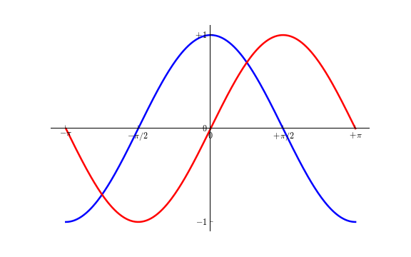

**添加图例**

我们在图的左上角添加一个图例。为此，我们只需要在 `plot` 函数里以「键 - 值」的形式增加一个参数。

```
ax.legend(loc='best')/ plt.legend


```

```
...
plot(X, C, color="blue", linewidth=2.5, linestyle="-", label="cosine")
plot(X, S, color="red",  linewidth=2.5, linestyle="-", label="sine")

legend(loc='upper left')
...


```


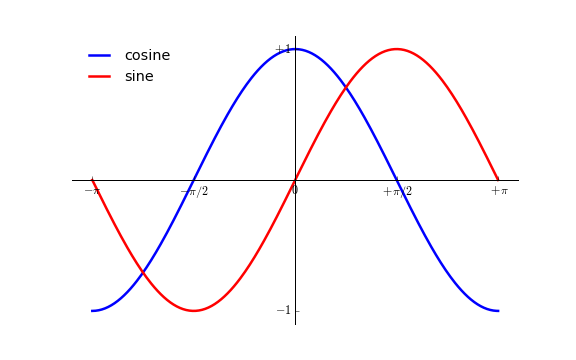

**给一些特殊点做注释**

> 用text、arrow和annotate等函数进行添加注解，text可以将文本加到图标的指定坐标。

```
subpic.text(90,35,'key point one',fontsize=10)
Out[15]: Text(90,35,'key point one')

keymenge=[(67,57,'key point two'),(23,66,'key point two')]

for x,y,label in keymenge:
    subpic.text(x,y,label,fontsize=12)


```

我们希望在 2π/32π/3 的位置给两条函数曲线加上一个注释。首先，我们在对应的函数图像位置上画一个点；然后，向横轴引一条垂线，以虚线标记；最后，写上标签。

```
...

t = 2*np.pi/3
plot([t,t],[0,np.cos(t)], color ='blue', linewidth=2.5, linestyle="--")
scatter([t,],[np.cos(t),], 50, color ='blue')

annotate(r'$\sin(\frac{2\pi}{3})=\frac{\sqrt{3}}{2}$',
         xy=(t, np.sin(t)), xycoords='data',
         xytext=(+10, +30), textcoords='offset points', fontsize=16,
         arrowprops=dict(arrowstyle="->", connectionstyle="arc3,rad=.2"))

plot([t,t],[0,np.sin(t)], color ='red', linewidth=2.5, linestyle="--")
scatter([t,],[np.sin(t),], 50, color ='red')

annotate(r'$\cos(\frac{2\pi}{3})=-\frac{1}{2}$',
         xy=(t, np.cos(t)), xycoords='data',
         xytext=(-90, -50), textcoords='offset points', fontsize=16,
         arrowprops=dict(arrowstyle="->", connectionstyle="arc3,rad=.2"))
...


```


**精益求精**

坐标轴上的记号标签被曲线挡住了，作为强迫症患者（雾）这是不能忍的。我们可以把它们放大，然后添加一个白色的半透明底色。这样可以保证标签和曲线同时可见。

```
...
for label in ax.get_xticklabels() + ax.get_yticklabels():
    label.set_fontsize(16)
    label.set_bbox(dict(facecolor='white', edgecolor='None', alpha=0.65 ))
...


```


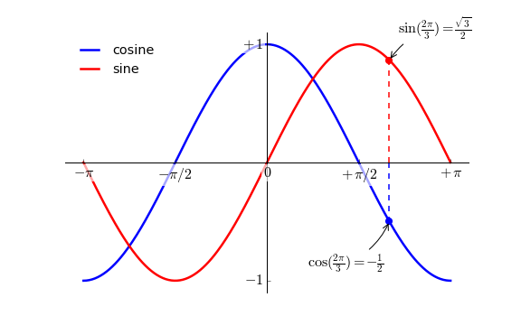

**保存图像**

> Savefig还可以作为对象figure的方法存储画布上的图像

```
plt.savefig('Desktop\python_01.png',dpi=400,bbox_inches='tight')

pic=plt.figure()
pic.savefig('Desktop\dong_123.pdf',dpi=300,bbox_inches='tight')


```

```
Savefig的主要参数如下：
fname: 表示绝对或者相对文件路径的字符串，文件具体格式由后缀来决定，譬如.pdf,.png格式等。
dpi: 图像分辨率，默认100，（每英寸点数）
Facecolor,edgecolor: 背景色，默认为“w”白色
Format: 显示设置文件格式，png，jpeg，pdf等等，但不要与fname里的文件格式发生冲突。
Bbox_inches，常用值是tight，可剪除图表周围的空白部分。


```


## 图像

图像、子图、坐标轴和记号

到目前为止，我们都用隐式的方法来绘制图像和坐标轴。快速绘图中，这是很方便的。我们也可以显式地控制图像、子图、坐标轴。Matplotlib 中的「图像」指的是用户界面看到的整个窗口内容。在图像里面有所谓「子图」。子图的位置是由坐标网格确定的，而「坐标轴」却不受此限制，可以放在图像的任意位置。我们已经隐式地使用过图像和子图：当我们调用 `plot` 函数的时候，matplotlib 调用 `gca()` 函数以及 `gcf()` 函数来获取当前的坐标轴和图像；如果无法获取图像，则会调用 `figure()` 函数来创建一个——严格地说，是用 `subplot(1,1,1)` 创建一个只有一个子图的图像。

**图像**

所谓「图像」就是 GUI 里以「Figure #」为标题的那些窗口。图像编号从 1 开始，与 MATLAB 的风格一致，而于 Python 从 0 开始编号的风格不同。以下参数是图像的属性：

| 参数      | 默认值           | 描述                 |
| :-------- | :--------------- | :------------------- |
| num       | 1                | 图像的数量           |
| figsize   | figure.figsize   | 图像的长和宽（英寸） |
| dpi       | figure.dpi       | 分辨率（点/英寸）    |
| facecolor | figure.facecolor | 绘图区域的背景颜色   |
| edgecolor | figure.edgecolor | 绘图区域边缘的颜色   |
| frameon   | True             | 是否绘制图像边缘     |

这些默认值可以在源文件中指明。不过除了图像数量这个参数，其余的参数都很少修改。

你在图形界面中可以按下右上角的 X 来关闭窗口（OS X 系统是左上角）。Matplotlib 也提供了名为 `close` 的函数来关闭这个窗口。`close` 函数的具体行为取决于你提供的参数：

1. 不传递参数：关闭当前窗口；
2. 传递窗口编号或窗口实例（instance）作为参数：关闭指定的窗口；
3. `all`：关闭所有窗口。

和其他对象一样，你可以使用 `setp` 或者是 `set_something`这样的方法来设置图像的属性。

**子图**

你可以用子图来将图样（plot）放在均匀的坐标网格中。用 `subplot` 函数的时候，你需要指明网格的行列数量，以及你希望将图样放在哪一个网格区域中。此外，[`gridspec`](http://matplotlib.sourceforge.net/users/gridspec.html) 的功能更强大，你也可以选择它来实现这个功能。


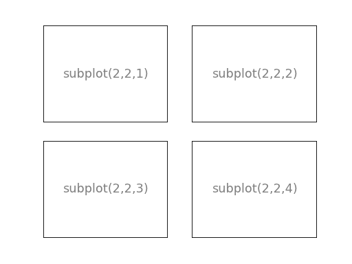


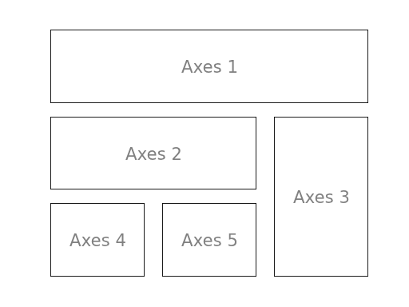


坐标轴

坐标轴和子图功能类似，不过它可以放在图像的任意位置。因此，如果你希望在一副图中绘制一个小图，就可以用这个功能。


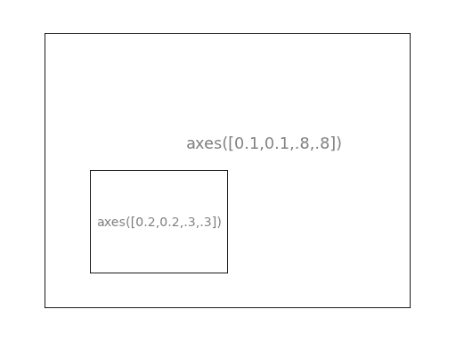


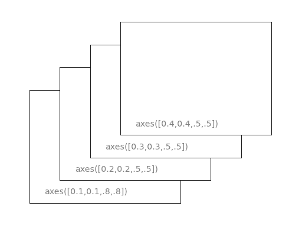

**记号**

良好的记号是图像的重要组成部分。Matplotlib 里的记号系统里的各个细节都是可以由用户个性化配置的。你可以用 Tick Locators 来指定在那些位置放置记号，用 Tick Formatters 来调整记号的样式。主要和次要的记号可以以不同的方式呈现。默认情况下，每一个次要的记号都是隐藏的，也就是说，默认情况下的次要记号列表是空的——`NullLocator`。

**Tick Locators**

下面有为不同需求设计的一些 Locators。

| 类型              | 说明                                                         |
| :---------------- | :----------------------------------------------------------- |
| `NullLocator`     | No ticks.   |
| `IndexLocator`    | Place a tick on every multiple of some base number of points plotted.     |
| `FixedLocator`    | Tick locations are fixed.!   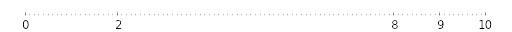 |
| `LinearLocator`   | Determine the tick locations. 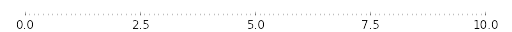 |
| `MultipleLocator` | Set a tick on every integer that is multiple of some base.   |
| `AutoLocator`     | Select no more than n intervals at nice locations.  |
| `LogLocator`      | Determine the tick locations for log axes.  |

这些 Locators 都是 `matplotlib.ticker.Locator` 的子类，你可以据此定义自己的 Locator。以日期为 ticks 特别复杂，因此 Matplotlib 提供了 `matplotlib.dates` 来实现这一功能。

## 其他类型的图

接下来的内容是练习。请运用你学到的知识，从提供的代码开始，实现配图所示的效果。具体的答案可以点击配图下载。

**普通图**

```python
from pylab import *

n = 256
X = np.linspace(-np.pi,np.pi,n,endpoint=True)
Y = np.sin(2*X)

plot (X, Y+1, color='blue', alpha=1.00)
plot (X, Y-1, color='blue', alpha=1.00)
show()


```


**散点图**

```python
from pylab import *

n = 1024
X = np.random.normal(0,1,n)
Y = np.random.normal(0,1,n)

scatter(X,Y)
show()


```


**条形图**

```python
from pylab import *

n = 12
X = np.arange(n)
Y1 = (1-X/float(n)) * np.random.uniform(0.5,1.0,n)
Y2 = (1-X/float(n)) * np.random.uniform(0.5,1.0,n)

bar(X, +Y1, facecolor='#9999ff', edgecolor='white')
bar(X, -Y2, facecolor='#ff9999', edgecolor='white')

for x,y in zip(X,Y1):
    text(x+0.4, y+0.05, '%.2f' % y, ha='center', va= 'bottom')

ylim(-1.25,+1.25)
show()


```


**等高线图**

```python
from pylab import *

def f(x,y): return (1-x/2+x**5+y**3)*np.exp(-x**2-y**2)

n = 256
x = np.linspace(-3,3,n)
y = np.linspace(-3,3,n)
X,Y = np.meshgrid(x,y)

contourf(X, Y, f(X,Y), 8, alpha=.75, cmap='jet')
C = contour(X, Y, f(X,Y), 8, colors='black', linewidth=.5)
show()


```


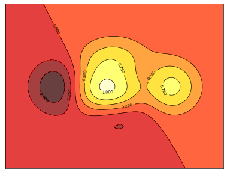

**灰度图（Imshow）**

```python
from pylab import *

def f(x,y): return (1-x/2+x**5+y**3)*np.exp(-x**2-y**2)

n = 10
x = np.linspace(-3,3,4*n)
y = np.linspace(-3,3,3*n)
X,Y = np.meshgrid(x,y)
imshow(f(X,Y)), show()


```


**饼状图**

```python
from pylab import *

n = 20
Z = np.random.uniform(0,1,n)
pie(Z), show()


```


**量场图（Quiver Plots）**

```python
from pylab import *

n = 8
X,Y = np.mgrid[0:n,0:n]
quiver(X,Y), show()


```


**网格**

```python
from pylab import *

axes = gca()
axes.set_xlim(0,4)
axes.set_ylim(0,3)
axes.set_xticklabels([])
axes.set_yticklabels([])
show()
```

图


---


**多重网格**

```python
from pylab import *

subplot(2,2,1)
subplot(2,2,3)
subplot(2,2,4)
show()


```


---


```python
# 极轴图
from pylab import *

axes([0,0,1,1])

N = 20
theta = np.arange(0.0, 2*np.pi, 2*np.pi/N)
radii = 10*np.random.rand(N)
width = np.pi/4*np.random.rand(N)
bars = bar(theta, radii, width=width, bottom=0.0)

for r,bar in zip(radii, bars):
    bar.set_facecolor( cm.jet(r/10.))
    bar.set_alpha(0.5)
show()


```

---


**3D 图**


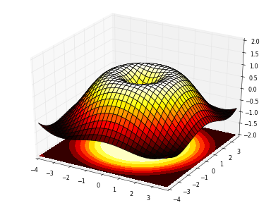

---

这个是三维图

```python
from pylab import *
from mpl_toolkits.mplot3d import Axes3D

fig = figure()
ax = Axes3D(fig)
X = np.arange(-4, 4, 0.25)
Y = np.arange(-4, 4, 0.25)
X, Y = np.meshgrid(X, Y)
R = np.sqrt(X**2 + Y**2)
Z = np.sin(R)

ax.plot_surface(X, Y, Z, rstride=1, cstride=1, cmap='hot')
show()
```


---


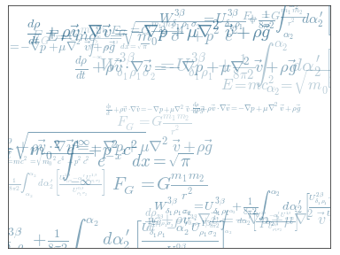

---


手稿:如下图所示

```
:arrow_lower_right:
（外网）	LowerRightArrow—Wolfram 语言参考资料
https://reference.wolfram.com/language/ref/LowerRightArrow.html

the lower right arrow
https://www.easyicon.net/iconsearch/the%20lower%20right%20arrow/?s=addtime_DESC
```


## 三、Pd作图-线性图

> Series 和 DataFrame 都有一个用于生成各类图表的plot方法，默认状态。他只生成线性图。
>
> Series生成线性图，索引（index）直接被绘制成X轴。当然我们也可以关闭使用index绘制X轴。Use_index=False
>
> X轴的刻度和界限可以用xsticks和xlim选项来进行调节，ysticks和ylim可以调节Y轴

- **Series 的 plot**

  | 参数      |                                                              |
  | --------- | ------------------------------------------------------------ |
  | label     | 用于设置图例的标签                                           |
  | ax        | 确定要被绘制的matplotlib subplot对象。如果没有设置，则使用当前matplotlib subplot |
  | style     | 设置传给matplotlib的风格字符串（'g*--'）                     |
  | alpha     | 图表的填充不透明度（数值为0到1之间的数）                     |
  | kind      | 各种图形样式line, bar, barh, kde, density, scatter           |
  | logy      | 在Y轴上使用对数标尺                                          |
  | use_index | 将对象（Series and DataFrame）的索引用作刻度标签             |
  | rot       | 旋转度数（0到360）                                           |
  | xticks    | 用作X轴刻度的值                                              |
  | yticks    | 用作y轴刻度的值                                              |
  | xlim      | x的值域                                                      |
  | ylim      | y的值域                                                      |
  | grid      | 设置是否显示轴网格线                                         |

  

  

  

  ```python
  import pandas as pd 
  ser=pd.Series(np.random.randn(10).cumsum(),index=np.arange(0,100,10))
  ser.plot()
  plt.show()
  ```

---


- **DataFrame 的 plot**

  > DataFrame的plot方法会在一个子图中为各列数据绘制一条线。自动创建的图例的标签与列索引相同。

  | 参数         |                                                              |
  | ------------ | ------------------------------------------------------------ |
  | Subplots     | 将依据数据框中的每个列绘制的图分别放置到单个的subplot（子画框）里 |
  | sharex       | Subplots=true时，设定是否共享X的刻度和值域                   |
  | sharey       | Subplots=true时，设定是否共享y的刻度和值域                   |
  | figsize      | 元组，用来表示图像大小（宽，高）                             |
  | title        | 设置图像标题                                                 |
  | Legend       | 设定是否添加一个subplot图例                                  |
  | sort_columns | 设定是否以字母表中字母先后排列顺序绘制各列。                 |

  ```python
  import pandas as pd
  import matplotlib.pyplot as plt
  
  Frame_01=pd.DataFrame([[2,4,8,16,32,64],[3,6,12,24,48,96],[5,10,15,20,25,30],[1,3,5,7,9,11],[16,8,4,2,1,0.5]],index=range(0,100,20),columns=['A','B','C','D','E','F'])
  
  pic_2,subplot_object=plt.subplots(1,1)
  
  Frame_01.plot(kind='line',ax=subplot_object,subplots=False,layout=False,logx=True,xlim=[0,100])
  plt.show()
  
  Frame_01
  Out[5]: 
       A   B   C   D   E     F
  0    2   4   8  16  32  64.0
  20   3   6  12  24  48  96.0
  40   5  10  15  20  25  30.0
  60   1   3   5   7   9  11.0
  80  16   8   4   2   1   0.5
  
  
  
  ```

---

 


**柱状图**

> 柱状图分为水平柱状图和垂直柱状图。当kind=’bar’生成垂直柱状图；kind=’barh’生成水平柱状图。

- **Series生成柱状图**

  ```python
  import numpy as np
  import pandas as pd
  import matplotlib.pyplot as plt
  figure_1,subplot_object=plt.subplots(2,1)
  datas=pd.Series(np.random.rand(20),index=list('qwertyuiopasdfghjklz'))
  
  datas.plot(kind='barh',ax=subplot_object[0],figsize=(8,12),color='g')
  datas.plot(kind='bar',ax=subplot_object[1],figsize=(8,12),color='r')
  plt.show()
  
  
  ```

---


  

> 应用serie_1.value.counts()在series中寻找数据重复的次数并作为纵坐标，Series中的数据作为横坐标。

```python
  serie_1=pd.Series([3,4.5,5,3,6,9,4.7,4.7,4.7,4.7,4.5,4.5,6,6,3,7,7,7,7])
  
  serie_1.value_counts().plot(kind='bar')
  plt.show()
  
  
```

---


 


- **DataFrame 生成柱状图**

  ```python
  import numpy as np
  import pandas as pd
  import matplotlib.pyplot as plt
  
  plt.rcParams['font.sans-serif']=['SimHei'] 
  plt.rcParams['axes.unicode_minus'] = False
  Framedata_1=pd.DataFrame(np.arange(16).reshape(4,4)**(1/2)+np.arange(16).reshape(4,4)*3+6,index=['spring','sommer','autumn','winter'],columns=['Benz','BMW','Porsche','VW'])
  
  picrange,pic_inf=plt.subplots(2,1)
  
  Framedata_1.plot(kind='bar',ax=pic_inf[0],title='2018年德系车销售额',rot=50,figsize=(8,12))
  
  Framedata_1.plot(kind='barh',ax=pic_inf[1],title='2018年德系车销售额',rot=130,figsize=(8,12))
  plt.show()
  
  Out[11]:
  	Benz	BMW	Porsche	VW
  spring	6.000000	10.000000	13.414214	16.732051
  sommer	20.000000	23.236068	26.449490	29.645751
  autumn	32.828427	36.000000	39.162278	42.316625
  winter	45.464102	48.605551	51.741657	54.872983
  ```

---


## 参考资料

**矩阵相乘**

左边的矩阵的列数等于右边矩阵的行数,两个矩阵才可以进行矩阵的乘法运算 ;

主要方法就是：用左边矩阵的第一行，逐个乘以右边矩阵的列，第一行与第一列各个元素的乘积相加，第一行与第二列的各个元素的乘积相加.

