### 一、简单绘图（plt）

```python
import numpy as np 
from matplotlib import pyplot as plt 
 
x = np.arange(1,11) 
y =  2  * x +  5 
plt.title("Matplotlib demo") # 标题
plt.xlabel("x axis caption") # x轴标签
plt.ylabel("y axis caption") # y轴标签
plt.plot(x,y) 
plt.show()


```

> 
>
> np.arange() 函数创建 x 轴上的值。y 轴上的对应值存储在另一个数组对象 y 中。 这些值使用 matplotlib 软件包的 pyplot 子模块的 plot() 函数绘制。
>
> 图形由 show() 函数显示。


### 图形中文显示

> Matplotlib 默认情况不支持中文，我们可以使用以下简单的方法来解决：
>
> 首先下载字体（注意系统）：<https://www.fontpalace.com/font-details/SimHei/>
>
> SimHei.ttf 文件放在当前执行的代码文件中：

```
import numpy as np 
from matplotlib import pyplot as plt 
import matplotlib
 
# fname 为 你下载的字体库路径，注意 SimHei.ttf 字体的路径
zhfont1 = matplotlib.font_manager.FontProperties(fname="SimHei.ttf") 
 
x = np.arange(1,11) 
y =  2  * x +  5 
plt.title("菜鸟教程 - 测试", fontproperties=zhfont1) 

# fontproperties 设置中文显示，fontsize 设置字体大小
plt.xlabel("x 轴", fontproperties=zhfont1)
plt.ylabel("y 轴", fontproperties=zhfont1)
plt.plot(x,y) 
plt.show()


```


### 格式化字符

> 作为线性图的替代，可以通过向 plot() 函数添加格式字符串来显示离散值。 可以使用以下格式化字符。
>
> 

| 字符       | 描述         |
| :--------- | :----------- |
| `'-'`      | 实线样式     |
| `'--'`     | 短横线样式   |
| `'-.'`     | 点划线样式   |
| `':'`      | 虚线样式     |
| `'.'`      | 点标记       |
| `','`      | 像素标记     |
| `'o'`      | 圆标记       |
| `'v'`      | 倒三角标记   |
| `'^'`      | 正三角标记   |
| `'&lt;'`   | 左三角标记   |
| `'&gt;'`   | 右三角标记   |
| `'1'`      | 下箭头标记   |
| `'2'`      | 上箭头标记   |
| `'3'`      | 左箭头标记   |
| `'4'`      | 右箭头标记   |
| `'s'`      | 正方形标记   |
| `'p'`      | 五边形标记   |
| `'*'`      | 星形标记     |
| `'h'`      | 六边形标记 1 |
| `'H'`      | 六边形标记 2 |
| `'+'`      | 加号标记     |
| `'x'`      | X 标记       |
| `'D'`      | 菱形标记     |
| `'d'`      | 窄菱形标记   |
| `'&#124;'` | 竖直线标记   |
| `'_'`      | 水平线标记   |

以下是颜色的缩写：

| 字符  | 颜色   |
| :---- | :----- |
| `'b'` | 蓝色   |
| `'g'` | 绿色   |
| `'r'` | 红色   |
| `'c'` | 青色   |
| `'m'` | 品红色 |
| `'y'` | 黄色   |
| `'k'` | 黑色   |
| `'w'` | 白色   |

要显示圆来代表点，而不是上面示例中的线，请使用 ob 作为 plot() 函数中的格式字符串。

```
import numpy as np 
from matplotlib import pyplot as plt 
 
x = np.arange(1,11) 
y =  2  * x +  5 
plt.title("Matplotlib demo") 
plt.xlabel("x axis caption") 
plt.ylabel("y axis caption") 
plt.plot(x,y,"ob") 
plt.show()


```


### subplot()

> subplot() 函数允许你在同一图中绘制不同的东西。

```
import numpy as np 
import matplotlib.pyplot as plt 
# 计算正弦和余弦曲线上的点的 x 和 y 坐标 
x = np.arange(0,  3  * np.pi,  0.1) 
y_sin = np.sin(x) 
y_cos = np.cos(x)  
# 建立 subplot 网格，高为 2，宽为 1  
# 激活第一个 subplot
plt.subplot(2,  1,  1)  
# 绘制第一个图像 
plt.plot(x, y_sin) 
plt.title('Sine')  
# 将第二个 subplot 激活，并绘制第二个图像
plt.subplot(2,  1,  2) 
plt.plot(x, y_cos) 
plt.title('Cosine')  
# 展示图像
plt.show()


```

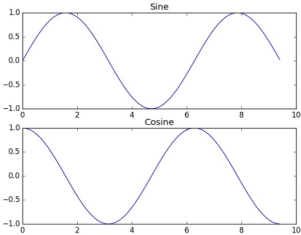


bar() 条形图

> pyplot 子模块提供 bar() 函数来生成条形图。
>
> 以下实例生成两组 x 和 y 数组的条形图。

```
from matplotlib import pyplot as plt 
x =  [5,8,10] 
y =  [12,16,6] 
x2 =  [6,9,11] 
y2 =  [6,15,7] 
plt.bar(x, y, align =  'center') 
plt.bar(x2, y2, color =  'g', align =  'center') 
plt.title('Bar graph') 
plt.ylabel('Y axis') 
plt.xlabel('X axis') 
plt.show()


```

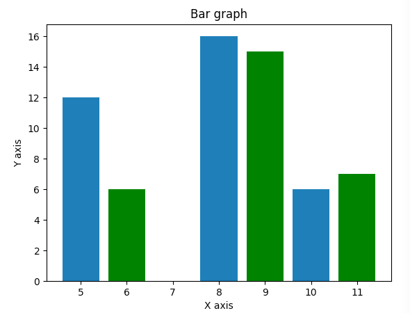


### hist() 直方图

> Matplotlib 可以将直方图的数字表示转换为图形。 pyplot 子模块的 plt() 函数将包含数据和 bin 数组的数组作为参数，并转换为直方图。

```
from matplotlib import pyplot as plt 
import numpy as np  
 
a = np.array([22,87,5,43,56,73,55,54,11,20,51,5,79,31,27]) 
plt.hist(a, bins =  [0,20,40,60,80,100]) 
plt.title("histogram") 
plt.show()


```


### 创建画布画框

```python
import matplotlib.pyplot as plt

import numpy as np

figure_1=plt.figure()

aapic_1=figure_1.add_subplot(2,2,1)

aapic_2=figure_1.add_subplot(2,2,2)

aapic_3=figure_1.add_subplot(2,2,3)

plt.plot(np.random.randn(50).cumsum(),'k--')
aapic_1.scatter(np.arange(30),np.arange(30)+3*np.random.randn(30))
aapic_2.hist(np.random.randn(100),bins=20,color='k',alpha=0.3)


```

```
pic,axes=plt.subplots(2,3)
axes[0][1].scatter(np.arange(30),np.arange(30)+3*np.random.randn(30))


```


### 二、plt-初级绘制

[Matplotlib 教程](<https://liam.page/2014/09/11/matplotlib-tutorial-zh-cn/>)

Matplotlib-初级绘制.

这一节中，我们将从简到繁：先尝试用默认配置在同一张图上绘制正弦和余弦函数图像，然后逐步美化它。

第一步，是取得正弦函数和余弦函数的值：

```
from pylab import *

X = np.linspace(-np.pi, np.pi, 256,endpoint=True)
C,S = np.cos(X), np.sin(X)


```

`X` 是一个 `numpy` 数组，包含了从 −π−π 到 +π+π 等间隔的 256 个值。`C` 和 `S` 则分别是这 256 个值对应的余弦和正弦函数值组成的 `numpy` 数组。

你可以在 IPython 的交互模式下测试代码，也可以下载代码（下载链接就是这些示例图），然后执行：

```
python exercise_1.py


```

#### 使用默认配置

Matplotlib 的默认配置都允许用户自定义。你可以调整大多数的默认配置：图片大小和分辨率（dpi）、线宽、颜色、风格、坐标轴、坐标轴以及网格的属性、文字与字体属性等。不过，matplotlib 的默认配置在大多数情况下已经做得足够好，你可能只在很少的情况下才会想更改这些默认配置。

```
from pylab import *

X = np.linspace(-np.pi, np.pi, 256,endpoint=True)
C,S = np.cos(X), np.sin(X)

plot(X,C)
plot(X,S)

show()


```

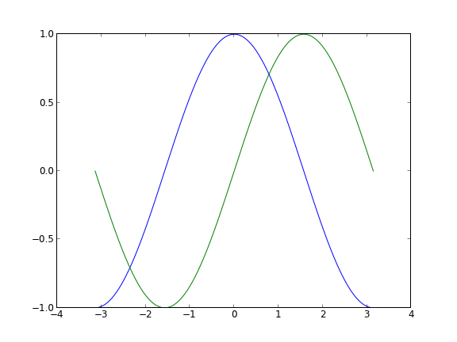


#### 默认配置的具体内容

下面的代码中，我们展现了 matplotlib 的默认配置并辅以注释说明，这部分配置包含了有关绘图样式的所有配置。代码中的配置与默认配置完全相同，你可以在交互模式中修改其中的值来观察效果。

```
# 导入 matplotlib 的所有内容（nympy 可以用 np 这个名字来使用）
from pylab import *

# 创建一个 8 * 6 点（point）的图，并设置分辨率为 80
figure(figsize=(8,6), dpi=80)

# 创建一个新的 1 * 1 的子图，接下来的图样绘制在其中的第 1 块（也是唯一的一块）
subplot(1,1,1)

X = np.linspace(-np.pi, np.pi, 256,endpoint=True)
C,S = np.cos(X), np.sin(X)

# 绘制余弦曲线，使用蓝色的、连续的、宽度为 1 （像素）的线条
plot(X, C, color="blue", linewidth=1.0, linestyle="-")

# 绘制正弦曲线，使用绿色的、连续的、宽度为 1 （像素）的线条
plot(X, S, color="green", linewidth=1.0, linestyle="-")

# 设置横轴的上下限
xlim(-4.0,4.0)

# 设置横轴记号
xticks(np.linspace(-4,4,9,endpoint=True))

# 设置纵轴的上下限
ylim(-1.0,1.0)

# 设置纵轴记号
yticks(np.linspace(-1,1,5,endpoint=True))

# 以分辨率 72 来保存图片
# savefig("exercice_2.png",dpi=72)

# 在屏幕上显示
show()


```


#### 改变线条的颜色和粗细

首先，我们以蓝色和红色分别表示余弦和正弦函数，而后将线条变粗一点。接下来，我们在水平方向拉伸一下整个图。

```
...
figure(figsize=(10,6), dpi=80)
plot(X, C, color="blue", linewidth=2.5, linestyle="-")
plot(X, S, color="red",  linewidth=2.5, linestyle="-")
...


```

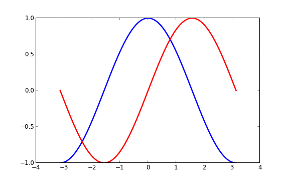


#### 刻度与标题

> Xlim（X值范围）、xticks（X轴刻度值）和xticklabels（X轴刻度标签）

```
ticks_1=ax.set_xticks([0,25000,50000,75000,100000])

scale_name=ax.set_xticklabels(['step1','step2','step3','step4','step5'],rotation=45,fontsize=12)


```

```
ax=table_1.add_subplot(1,1,1)
ax.set_title('Python-03 Practice')
~~~~~~~~~~~~~~~~~~~~~~~~~~~~~~~~~~~~~~~~~~~~~~~
plt.subplot(2,  1,  1) 
plt.title('Cosine')


```


#### 设置图片边界

当前的图片边界设置得不好，所以有些地方看得不是很清楚。

```
...
xlim(X.min()*1.1, X.max()*1.1)
ylim(C.min()*1.1, C.max()*1.1)
...


```

更好的方式是这样：

```
xmin ,xmax = X.min(), X.max()
ymin, ymax = Y.min(), Y.max()

dx = (xmax - xmin) * 0.2
dy = (ymax - ymin) * 0.2

xlim(xmin - dx, xmax + dx)
ylim(ymin - dy, ymax + dy)


```

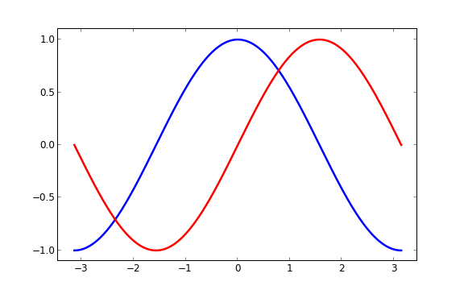


```
subpic.set_xlim([0,100])
subpic.set_ylim([0,100])


```


#### 设置记号

我们讨论正弦和余弦函数的时候，通常希望知道函数在 ±π±π 和 ±π2±π2 的值。这样看来，当前的设置就不那么理想了。

```
...
xticks( [-np.pi, -np.pi/2, 0, np.pi/2, np.pi])
yticks([-1, 0, +1])
...


```


#### 设置记号的标签

记号现在没问题了，不过标签却不大符合期望。我们可以把 3.1423.142 当做是 ππ，但毕竟不够精确。当我们设置记号的时候，我们可以同时设置记号的标签。注意这里使用了 LaTeX。

```
...
xticks([-np.pi, -np.pi/2, 0, np.pi/2, np.pi],
       [r'$-\pi$', r'$-\pi/2$', r'$0$', r'$+\pi/2$', r'$+\pi$'])

yticks([-1, 0, +1],
       [r'$-1$', r'$0$', r'$+1$'])
...


```


#### 移动脊柱

坐标轴线和上面的记号连在一起就形成了脊柱（Spines，一条线段上有一系列的凸起，是不是很像脊柱骨啊~），它记录了数据区域的范围。它们可以放在任意位置，不过至今为止，我们都把它放在图的四边。

实际上每幅图有四条脊柱（上下左右），为了将脊柱放在图的中间，我们必须将其中的两条（上和右）设置为无色，然后调整剩下的两条到合适的位置——数据空间的 0 点。

```
...
ax = gca()
ax.spines['right'].set_color('none')
ax.spines['top'].set_color('none')
ax.xaxis.set_ticks_position('bottom')
ax.spines['bottom'].set_position(('data',0))
ax.yaxis.set_ticks_position('left')
ax.spines['left'].set_position(('data',0))
...


```


#### 添加图例

我们在图的左上角添加一个图例。为此，我们只需要在 `plot` 函数里以「键 - 值」的形式增加一个参数。

```
ax.legend(loc='best')/ plt.legend


```

```
...
plot(X, C, color="blue", linewidth=2.5, linestyle="-", label="cosine")
plot(X, S, color="red",  linewidth=2.5, linestyle="-", label="sine")

legend(loc='upper left')
...


```


#### 给一些特殊点做注释

> 用text、arrow和annotate等函数进行添加注解，text可以将文本加到图标的指定坐标。

```
subpic.text(90,35,'key point one',fontsize=10)
Out[15]: Text(90,35,'key point one')

keymenge=[(67,57,'key point two'),(23,66,'key point two')]

for x,y,label in keymenge:
    subpic.text(x,y,label,fontsize=12)


```

我们希望在 2π/32π/3 的位置给两条函数曲线加上一个注释。首先，我们在对应的函数图像位置上画一个点；然后，向横轴引一条垂线，以虚线标记；最后，写上标签。

```
...

t = 2*np.pi/3
plot([t,t],[0,np.cos(t)], color ='blue', linewidth=2.5, linestyle="--")
scatter([t,],[np.cos(t),], 50, color ='blue')

annotate(r'$\sin(\frac{2\pi}{3})=\frac{\sqrt{3}}{2}$',
         xy=(t, np.sin(t)), xycoords='data',
         xytext=(+10, +30), textcoords='offset points', fontsize=16,
         arrowprops=dict(arrowstyle="->", connectionstyle="arc3,rad=.2"))

plot([t,t],[0,np.sin(t)], color ='red', linewidth=2.5, linestyle="--")
scatter([t,],[np.sin(t),], 50, color ='red')

annotate(r'$\cos(\frac{2\pi}{3})=-\frac{1}{2}$',
         xy=(t, np.cos(t)), xycoords='data',
         xytext=(-90, -50), textcoords='offset points', fontsize=16,
         arrowprops=dict(arrowstyle="->", connectionstyle="arc3,rad=.2"))
...


```


#### 精益求精

坐标轴上的记号标签被曲线挡住了，作为强迫症患者（雾）这是不能忍的。我们可以把它们放大，然后添加一个白色的半透明底色。这样可以保证标签和曲线同时可见。

```
...
for label in ax.get_xticklabels() + ax.get_yticklabels():
    label.set_fontsize(16)
    label.set_bbox(dict(facecolor='white', edgecolor='None', alpha=0.65 ))
...


```

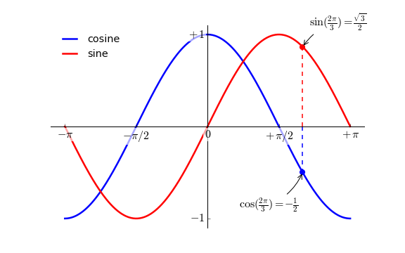


#### 保存图像

> Savefig还可以作为对象figure的方法存储画布上的图像

```
plt.savefig('Desktop\python_01.png',dpi=400,bbox_inches='tight')

pic=plt.figure()
pic.savefig('Desktop\dong_123.pdf',dpi=300,bbox_inches='tight')


```

```
Savefig的主要参数如下：
fname: 表示绝对或者相对文件路径的字符串，文件具体格式由后缀来决定，譬如.pdf,.png格式等。
dpi: 图像分辨率，默认100，（每英寸点数）
Facecolor,edgecolor: 背景色，默认为“w”白色
Format: 显示设置文件格式，png，jpeg，pdf等等，但不要与fname里的文件格式发生冲突。
Bbox_inches，常用值是tight，可剪除图表周围的空白部分。


```


### 图像、子图、坐标轴和记号

到目前为止，我们都用隐式的方法来绘制图像和坐标轴。快速绘图中，这是很方便的。我们也可以显式地控制图像、子图、坐标轴。Matplotlib 中的「图像」指的是用户界面看到的整个窗口内容。在图像里面有所谓「子图」。子图的位置是由坐标网格确定的，而「坐标轴」却不受此限制，可以放在图像的任意位置。我们已经隐式地使用过图像和子图：当我们调用 `plot` 函数的时候，matplotlib 调用 `gca()` 函数以及 `gcf()` 函数来获取当前的坐标轴和图像；如果无法获取图像，则会调用 `figure()` 函数来创建一个——严格地说，是用 `subplot(1,1,1)` 创建一个只有一个子图的图像。

#### 图像

所谓「图像」就是 GUI 里以「Figure #」为标题的那些窗口。图像编号从 1 开始，与 MATLAB 的风格一致，而于 Python 从 0 开始编号的风格不同。以下参数是图像的属性：

| 参数      | 默认值           | 描述                 |
| :-------- | :--------------- | :------------------- |
| num       | 1                | 图像的数量           |
| figsize   | figure.figsize   | 图像的长和宽（英寸） |
| dpi       | figure.dpi       | 分辨率（点/英寸）    |
| facecolor | figure.facecolor | 绘图区域的背景颜色   |
| edgecolor | figure.edgecolor | 绘图区域边缘的颜色   |
| frameon   | True             | 是否绘制图像边缘     |

这些默认值可以在源文件中指明。不过除了图像数量这个参数，其余的参数都很少修改。

你在图形界面中可以按下右上角的 X 来关闭窗口（OS X 系统是左上角）。Matplotlib 也提供了名为 `close` 的函数来关闭这个窗口。`close` 函数的具体行为取决于你提供的参数：

1. 不传递参数：关闭当前窗口；
2. 传递窗口编号或窗口实例（instance）作为参数：关闭指定的窗口；
3. `all`：关闭所有窗口。

和其他对象一样，你可以使用 `setp` 或者是 `set_something`这样的方法来设置图像的属性。

#### 子图

你可以用子图来将图样（plot）放在均匀的坐标网格中。用 `subplot` 函数的时候，你需要指明网格的行列数量，以及你希望将图样放在哪一个网格区域中。此外，[`gridspec`](http://matplotlib.sourceforge.net/users/gridspec.html) 的功能更强大，你也可以选择它来实现这个功能。


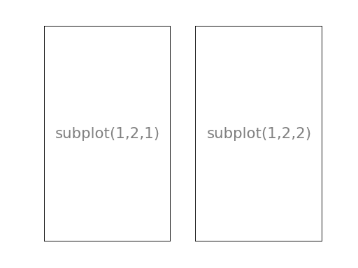


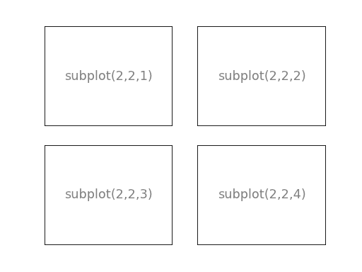


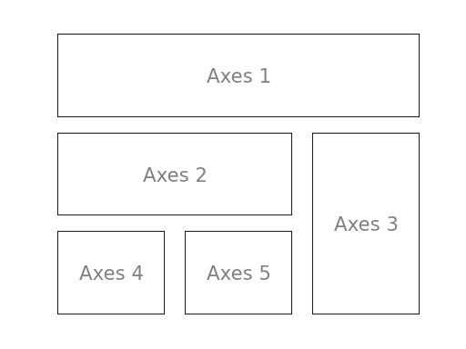


坐标轴

坐标轴和子图功能类似，不过它可以放在图像的任意位置。因此，如果你希望在一副图中绘制一个小图，就可以用这个功能。

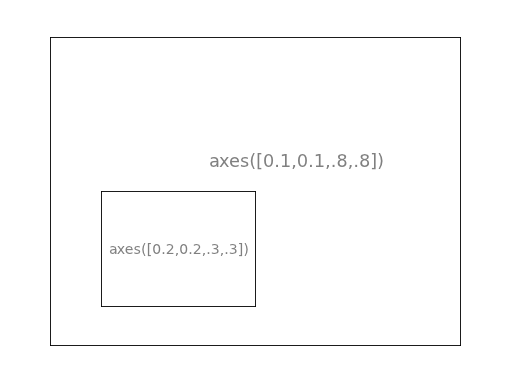


#### 记号

良好的记号是图像的重要组成部分。Matplotlib 里的记号系统里的各个细节都是可以由用户个性化配置的。你可以用 Tick Locators 来指定在那些位置放置记号，用 Tick Formatters 来调整记号的样式。主要和次要的记号可以以不同的方式呈现。默认情况下，每一个次要的记号都是隐藏的，也就是说，默认情况下的次要记号列表是空的——`NullLocator`。

##### Tick Locators

下面有为不同需求设计的一些 Locators。

| 类型              | 说明                                                         |
| :---------------- | :----------------------------------------------------------- |
| `NullLocator`     | No ticks.   |
| `IndexLocator`    | Place a tick on every multiple of some base number of points plotted.     |
| `FixedLocator`    | Tick locations are fixed.!    |
| `LinearLocator`   | Determine the tick locations.  |
| `MultipleLocator` | Set a tick on every integer that is multiple of some base.   |
| `AutoLocator`     | Select no more than n intervals at nice locations.  |
| `LogLocator`      | Determine the tick locations for log axes.  |

这些 Locators 都是 `matplotlib.ticker.Locator` 的子类，你可以据此定义自己的 Locator。以日期为 ticks 特别复杂，因此 Matplotlib 提供了 `matplotlib.dates` 来实现这一功能。

### 其他类型的图

接下来的内容是练习。请运用你学到的知识，从提供的代码开始，实现配图所示的效果。具体的答案可以点击配图下载。

#### 普通图

```python
from pylab import *

n = 256
X = np.linspace(-np.pi,np.pi,n,endpoint=True)
Y = np.sin(2*X)

plot (X, Y+1, color='blue', alpha=1.00)
plot (X, Y-1, color='blue', alpha=1.00)
show()


```


#### 散点图

```python
from pylab import *

n = 1024
X = np.random.normal(0,1,n)
Y = np.random.normal(0,1,n)

scatter(X,Y)
show()


```


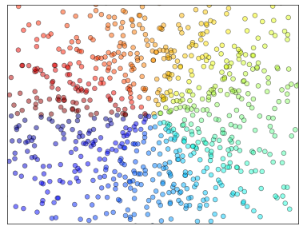


#### 条形图

```python
from pylab import *

n = 12
X = np.arange(n)
Y1 = (1-X/float(n)) * np.random.uniform(0.5,1.0,n)
Y2 = (1-X/float(n)) * np.random.uniform(0.5,1.0,n)

bar(X, +Y1, facecolor='#9999ff', edgecolor='white')
bar(X, -Y2, facecolor='#ff9999', edgecolor='white')

for x,y in zip(X,Y1):
    text(x+0.4, y+0.05, '%.2f' % y, ha='center', va= 'bottom')

ylim(-1.25,+1.25)
show()


```


#### 等高线图

```python
from pylab import *

def f(x,y): return (1-x/2+x**5+y**3)*np.exp(-x**2-y**2)

n = 256
x = np.linspace(-3,3,n)
y = np.linspace(-3,3,n)
X,Y = np.meshgrid(x,y)

contourf(X, Y, f(X,Y), 8, alpha=.75, cmap='jet')
C = contour(X, Y, f(X,Y), 8, colors='black', linewidth=.5)
show()


```


#### 灰度图（Imshow）

```python
from pylab import *

def f(x,y): return (1-x/2+x**5+y**3)*np.exp(-x**2-y**2)

n = 10
x = np.linspace(-3,3,4*n)
y = np.linspace(-3,3,3*n)
X,Y = np.meshgrid(x,y)
imshow(f(X,Y)), show()


```


#### 饼状图

```python
from pylab import *

n = 20
Z = np.random.uniform(0,1,n)
pie(Z), show()


```


#### 量场图（Quiver Plots）

```python
from pylab import *

n = 8
X,Y = np.mgrid[0:n,0:n]
quiver(X,Y), show()


```


#### 网格

```python
from pylab import *

axes = gca()
axes.set_xlim(0,4)
axes.set_ylim(0,3)
axes.set_xticklabels([])
axes.set_yticklabels([])
show()
```

图

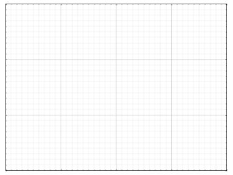


---


#### 多重网格

```python
from pylab import *

subplot(2,2,1)
subplot(2,2,3)
subplot(2,2,4)
show()


```


---


---


#### 

```python
# 极轴图
from pylab import *

axes([0,0,1,1])

N = 20
theta = np.arange(0.0, 2*np.pi, 2*np.pi/N)
radii = 10*np.random.rand(N)
width = np.pi/4*np.random.rand(N)
bars = bar(theta, radii, width=width, bottom=0.0)

for r,bar in zip(radii, bars):
    bar.set_facecolor( cm.jet(r/10.))
    bar.set_alpha(0.5)
show()


```

---


---


#### 3D 图

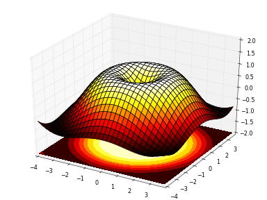


---

这个是三维图

```python
from pylab import *
from mpl_toolkits.mplot3d import Axes3D

fig = figure()
ax = Axes3D(fig)
X = np.arange(-4, 4, 0.25)
Y = np.arange(-4, 4, 0.25)
X, Y = np.meshgrid(X, Y)
R = np.sqrt(X**2 + Y**2)
Z = np.sin(R)

ax.plot_surface(X, Y, Z, rstride=1, cstride=1, cmap='hot')
show()
```

---

这个是手稿

```python
import numpy as np
import matplotlib.pyplot as plt

eqs = []
eqs.append((r"$W^{3\beta}_{\delta_1 \rho_1 \sigma_2} = U^{3\beta}_{\delta_1 \rho_1} + \frac{1}{8 \pi 2} \int^{\alpha_2}_{\alpha_2} d \alpha^\prime_2 \left[\frac{ U^{2\beta}_{\delta_1 \rho_1} - \alpha^\prime_2U^{1\beta}_{\rho_1 \sigma_2} }{U^{0\beta}_{\rho_1 \sigma_2}}\right]$"))

eqs.append((r"$\frac{d\rho}{d t} + \rho \vec{v}\cdot\nabla\vec{v} = -\nabla p + \mu\nabla^2 \vec{v} + \rho \vec{g}$"))

eqs.append((r"$\int_{-\infty}^\infty e^{-x^2}dx=\sqrt{\pi}$"))
eqs.append((r"$E = mc^2 = \sqrt{{m_0}^2c^4 + p^2c^2}$"))
eqs.append((r"$F_G = G\frac{m_1m_2}{r^2}$"))


plt.axes([0.025,0.025,0.95,0.95])

for i in range(24):
    index = np.random.randint(0,len(eqs))
    eq = eqs[index]
    size = np.random.uniform(12,32)
    x,y = np.random.uniform(0,1,2)
    alpha = np.random.uniform(0.25,.75)
    plt.text(x, y, eq, ha='center', va='center', color="#11557c", alpha=alpha,
             transform=plt.gca().transAxes, fontsize=size, clip_on=True)

plt.xticks([]), plt.yticks([])
# savefig('../figures/text_ex.png',dpi=48)
plt.show()


```

---


---


手稿:如下图所示

```
:arrow_lower_right:
（外网）	LowerRightArrow—Wolfram 语言参考资料
https://reference.wolfram.com/language/ref/LowerRightArrow.html

the lower right arrow
https://www.easyicon.net/iconsearch/the%20lower%20right%20arrow/?s=addtime_DESC
```


### 三、Pd作图-线性图

> Series 和 DataFrame 都有一个用于生成各类图表的plot方法，默认状态。他只生成线性图。
>
> Series生成线性图，索引（index）直接被绘制成X轴。当然我们也可以关闭使用index绘制X轴。Use_index=False
>
> X轴的刻度和界限可以用xsticks和xlim选项来进行调节，ysticks和ylim可以调节Y轴

- **Series 的 plot**

  | 参数      |                                                              |
  | --------- | ------------------------------------------------------------ |
  | label     | 用于设置图例的标签                                           |
  | ax        | 确定要被绘制的matplotlib subplot对象。如果没有设置，则使用当前matplotlib subplot |
  | style     | 设置传给matplotlib的风格字符串（'g*--'）                     |
  | alpha     | 图表的填充不透明度（数值为0到1之间的数）                     |
  | kind      | 各种图形样式line, bar, barh, kde, density, scatter           |
  | logy      | 在Y轴上使用对数标尺                                          |
  | use_index | 将对象（Series and DataFrame）的索引用作刻度标签             |
  | rot       | 旋转度数（0到360）                                           |
  | xticks    | 用作X轴刻度的值                                              |
  | yticks    | 用作y轴刻度的值                                              |
  | xlim      | x的值域                                                      |
  | ylim      | y的值域                                                      |
  | grid      | 设置是否显示轴网格线                                         |

  

  

  

  ```python
  import pandas as pd 
  ser=pd.Series(np.random.randn(10).cumsum(),index=np.arange(0,100,10))
  ser.plot()
  plt.show()
  ```

---


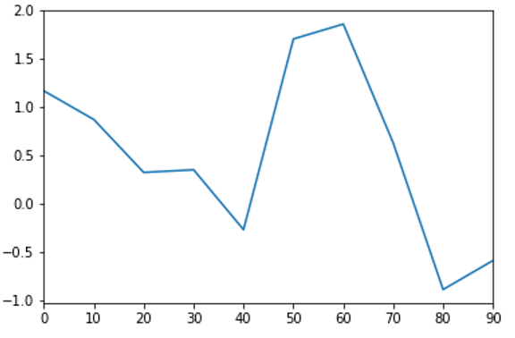


- **DataFrame 的 plot**

  > DataFrame的plot方法会在一个子图中为各列数据绘制一条线。自动创建的图例的标签与列索引相同。

  | 参数         |                                                              |
  | ------------ | ------------------------------------------------------------ |
  | Subplots     | 将依据数据框中的每个列绘制的图分别放置到单个的subplot（子画框）里 |
  | sharex       | Subplots=true时，设定是否共享X的刻度和值域                   |
  | sharey       | Subplots=true时，设定是否共享y的刻度和值域                   |
  | figsize      | 元组，用来表示图像大小（宽，高）                             |
  | title        | 设置图像标题                                                 |
  | Legend       | 设定是否添加一个subplot图例                                  |
  | sort_columns | 设定是否以字母表中字母先后排列顺序绘制各列。                 |

  ```python
  import pandas as pd
  import matplotlib.pyplot as plt
  
  Frame_01=pd.DataFrame([[2,4,8,16,32,64],[3,6,12,24,48,96],[5,10,15,20,25,30],[1,3,5,7,9,11],[16,8,4,2,1,0.5]],index=range(0,100,20),columns=['A','B','C','D','E','F'])
  
  pic_2,subplot_object=plt.subplots(1,1)
  
  Frame_01.plot(kind='line',ax=subplot_object,subplots=False,layout=False,logx=True,xlim=[0,100])
  plt.show()
  
  Frame_01
  Out[5]: 
       A   B   C   D   E     F
  0    2   4   8  16  32  64.0
  20   3   6  12  24  48  96.0
  40   5  10  15  20  25  30.0
  60   1   3   5   7   9  11.0
  80  16   8   4   2   1   0.5
  
  
  
  ```

---

 


### 柱状图

> 柱状图分为水平柱状图和垂直柱状图。当kind=’bar’生成垂直柱状图；kind=’barh’生成水平柱状图。

- **Series生成柱状图**

  ```python
  import numpy as np
  import pandas as pd
  import matplotlib.pyplot as plt
  figure_1,subplot_object=plt.subplots(2,1)
  datas=pd.Series(np.random.rand(20),index=list('qwertyuiopasdfghjklz'))
  
  datas.plot(kind='barh',ax=subplot_object[0],figsize=(8,12),color='g')
  datas.plot(kind='bar',ax=subplot_object[1],figsize=(8,12),color='r')
  plt.show()
  
  
  ```

---


  

> 应用serie_1.value.counts()在series中寻找数据重复的次数并作为纵坐标，Series中的数据作为横坐标。

```python
  serie_1=pd.Series([3,4.5,5,3,6,9,4.7,4.7,4.7,4.7,4.5,4.5,6,6,3,7,7,7,7])
  
  serie_1.value_counts().plot(kind='bar')
  plt.show()
  
  
```

---


 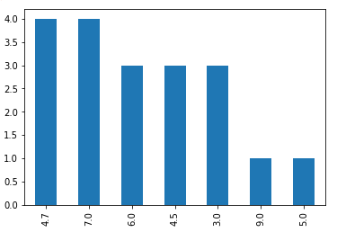


- **DataFrame 生成柱状图**

  ```python
  import numpy as np
  import pandas as pd
  import matplotlib.pyplot as plt
  
  plt.rcParams['font.sans-serif']=['SimHei'] 
  plt.rcParams['axes.unicode_minus'] = False
  Framedata_1=pd.DataFrame(np.arange(16).reshape(4,4)**(1/2)+np.arange(16).reshape(4,4)*3+6,index=['spring','sommer','autumn','winter'],columns=['Benz','BMW','Porsche','VW'])
  
  picrange,pic_inf=plt.subplots(2,1)
  
  Framedata_1.plot(kind='bar',ax=pic_inf[0],title='2018年德系车销售额',rot=50,figsize=(8,12))
  
  Framedata_1.plot(kind='barh',ax=pic_inf[1],title='2018年德系车销售额',rot=130,figsize=(8,12))
  plt.show()
  
  Out[11]:
  	Benz	BMW	Porsche	VW
  spring	6.000000	10.000000	13.414214	16.732051
  sommer	20.000000	23.236068	26.449490	29.645751
  autumn	32.828427	36.000000	39.162278	42.316625
  winter	45.464102	48.605551	51.741657	54.872983
  ```

---


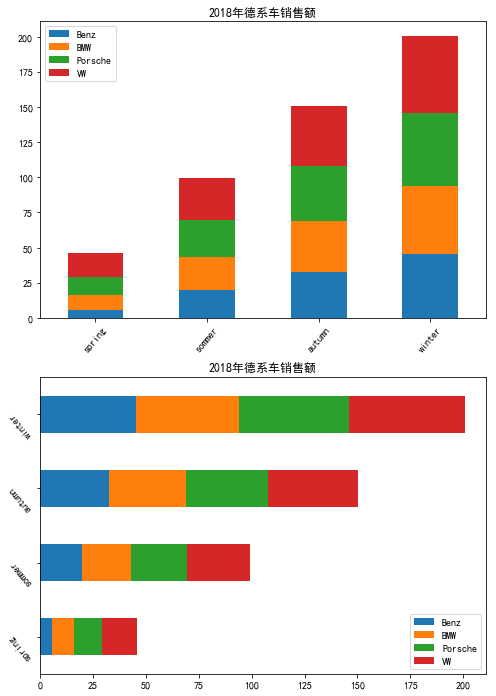


