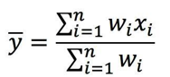
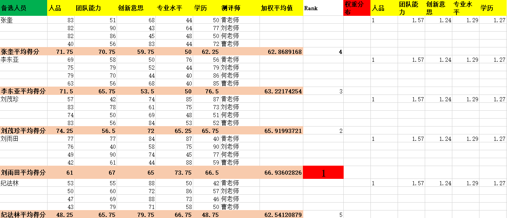
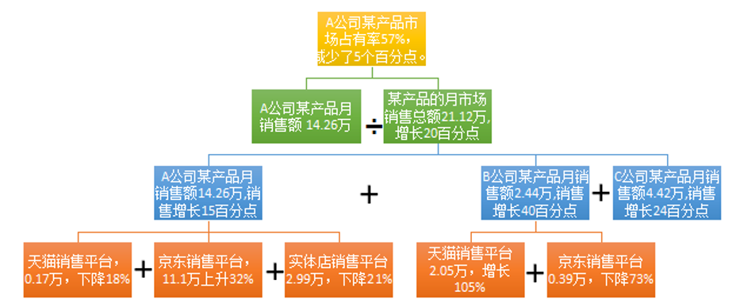
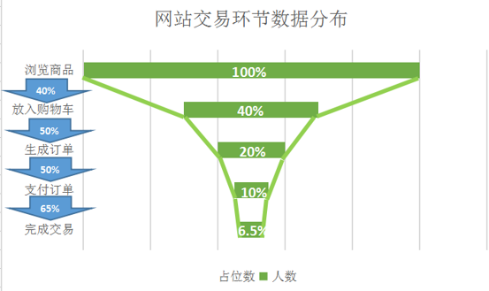

数据分析

### 数据分析步骤

```
Data analysis method
数据  分析  方法
```

数据分析6步法

目标导向

数据收集

数据处理

数据分析

数据展现

数据报告


### 1. 明确分析目的

> 分析前一定要目的明确，知道自己要干什么。然后根据目的选择适合的分析方式。选择恰好的最为简单的分析方式解决复杂的问题是我们每位数据分析师都应该把握的分析哲学。


**分析的目的可分为三类：**

- 对现状进行描述性分析，给决策者提供未来发展方向的依据。
- 原因分析，弄清造成某种结果的原因。
- 为事物将来的发展趋势做出预测。指导决策者做出相关应对措施。向有利方向发展的趋势采取加强或鼓励措施。反之，则是通过有效手段降低和弱化甚至消除不利的发展趋势。

通常在明确分析目的后，还有一个十分重要的环节，即数据分析详细流程图，它通常是“数据分析一般步骤”中“数据处理”和“数据分析”这两个步骤的详细操作和分析流程。


**例：分析影响某款产品价格的主要因素？**

> 明确目的：尽可能寻找所有影响这款产品的因素（包括间接因素），并确定主要因素。
>
> 建立分析指标体系：通过合适的数据分析方法论，寻找指标，组成体系。比如通过逻辑树法（后面会讲）寻找到：人员成本、材料成本、运输成本、仓储成本、税收、政策影响、受欢迎度、竞争对手、市场占有率等等。
>
> 建立分析框架：利用必要的数据处理方法和合适的数据分析方法建立体系化分析框架，最终找出主要影响因素。

### 2. 数据采集

> 就是收集与分析相关，特别是各个分析指标的数据。
>
> 至于数据采集方法多种多样，这里简要的说几种：商场的问卷调查、气象部门的设备测量、网络平台注册，爬虫抓取等等
>
> 目前来看，整个的数据采集方式发展趋于网络采集

### 3. 数据处理

**数据处理常用的方法有三种：**

- 数据清洗

  

- 数据加工

  

- 数据计算

  其目的是把杂乱无章的数据处理成可以分析的数据。


注：

1. 数据分析的数据转换主要指的是数据的行列转换、数据的正则化、标准化等。
2. 以上是数据处理的一般流程，实际工作情况和其有所偏差。
3. 数据抽取就是从数据源中抽取数据的过程。他可以是截取某一字段（索引）的部分信息


### 4. 数据分析方法

#### 比较分析法

- 定义：对比两个或以上数据，发现并分析差异，最终从中得出数据差异所代表的含义和规律。
- 特点：通过比较某个或某些指标，直观的发现事物在某方面的差异与变化，且差异和变化可被准确量化。
- 分类：静态与动态比较


**静态比较**：同一时间，相同指标在不同总体间的比较，也叫横向比较，简称横比。例如北京与上海2018年GDP之间的比较。

常见比较方法：

- 与目标对比

  实际完成值与目标值作对比，是横比。

- 同级地区、单位、部门比较

  属于横比，比较双方必须是同一级别不同总体。

- 个体绝对指标与总体平均指标比较

  例：某公司月产量高于整个行业内的平均水平。

  例：北京市小李的月收入低于北京市人均月收入


**动态比较**：同一总体，相同指标在不同时期间的比较。也叫纵向比较，简称纵比。例如，从2010年以来，北京外来人口的增量有所下降，与2011年相比2012年同比增加30万左右。

- 不同时期对比 

  即选择不同时期的指标值进行比较。这方面有两个重要的对比方式，即同比（当前指标值与上一你同期指标值之间的比较）和环比（当前指标值与上一个统计周期指标值之间的比较，通常与上个月比较。也就是说以每个月为统计周期。

- 活动效果对比

  这里主要说的是促销活动。


**对比分析所需对比指标：**

总量指标（绝对指标）

相对指标

平均指标


**对比分析注意事项：**

- 指标的单位和指标的计算方法必须相同

  例：一个60千克重的人无法与60000克的人无法比较体重，尽管他们的体重是相等的，也就是说我们必须把单位化为相同，也即统计口径必须保持一致。

- 对比双方要有可比性，树木和羊、中国和美洲无法比较。

- 对比的指标通常要保持一致

  无论是绝对数指标、相对数指标还是平均数指标或者其他类型指标，对比时，对比双方必须统一。广州的GDP增速无法与深圳的GDP作比较。

  ​      注意：个体绝对指标与平均指标的比较除外。


#### 分组分析法

- 定义：根据数据特征，按照一定的指标，把数据划分为不同的群组进行研究，以求揭示各群组间的内在联系和规律。

- 目的：通常为了对比，按照一定指标把总体中不同性质的个体区分开，把性质相同的个体合并在一起，保证组内个体属性差别最小，组与组之间属性差异最大。

  注意：从分组的目的可以看出，分组分析通常与比较分析配套使用。


**分组时必须遵循两个原则**：穷尽原则和互斥原则。

- 穷尽原则：总体中的每一个单位都应有组可归，或者说各分组的空间足以容纳总体所有的单位。
- 互斥原则：在分组指标的限制下，总体中的任何一个单位只能归属与某一个组，而不能同时或可能归属与几个组。


**重要的分组参数：组限、组距与组数**

- 组限：各分组间的分界处被称为组限，一个组的最大值称为组上限，一个组的最小值称为组下限。
- 组距：组上限与组下限的差叫组距
- 组数：分组个数


**分组的步骤：**

1. 组数确定

   这个完全依赖于数据分析师自己的经验了。有经验的数据分析师会根据数据本身特点给数据划分合理组数。

   如果组数太少，数据会过于集中；组数太多，数据会过于分散，无论那一种情况，都不利于发现数据分布的规律与特征。

2. 确定组距

   一组数据中的最大值与最小值的差除以组数。即：

   （最大值-最小值）/组数

3. 根据组距划分数据，使其各就各位。


#### 结构分析法

> 被分析总体内的各部分与总体进行对比的分析方法，即部分数量除以总体数量，换句话说，部分占总体的比例，属于相对指标。一般来讲，那个部分占比多，那个部分在总体中所处的地位也就越高，重要性也就越强，对总体影响也就越大，有时也称对总体贡献度大。
>
> 注意分析的对象是总体的结构，也就是总体的组成成分。

**结构分析法的经典应用：**

​	市场占有率=（某种商品销售量/该产品市场销售总量）×100%


#### 平均分析法

> 通过计算平均数来反映总体在一定时间、地点条件下某一数量特征的一般水平。但由于其忽略了个体间可能存在的巨大差异，有时候并不一定反映出某一指标的一般水平。因此，很多时候平均分析法是不可取的。


#### 交叉分析法

> 交叉分析法又称立体分析法，是在纵向分析法和横向分析法的基础上，从交叉、立体的角度出发，由浅入深、由低级到高级的一种分析方法。这种方法虽然复杂，但它弥补了“各自为政”分析方法所带来的偏差（来自百度）


#### 综合评价法

> 随着数据分析的广泛和深入的使用，我们遇到的问题越来越复杂，单靠对单一指标的分析越来越不能解决多指标问题。
>
> 人们通过实践总结，逐步形成了一系列运用多个指标对多个参评单位进行评价的方法，称之为综合评价法。
>
> 综合评价法的本质是把多指标转化为一个能够反映综合情况的量（比如评分，通常不再是统计指标）来进行分析

**步骤：**

1. 确定综合评价指标体系，即用哪些指标来评价一个对象。
2. 收集数据，若有必要，进行标准化处理，比如归一化，以求消除量纲。
3. 确定指标体系中各指标权重，以保证评价的科学性与公平性。
4. 对各个指标的评价数值进行汇总计算，得出综合评价分值。
5. 凭借分值排名并得出结论。

**综合评价法的注意事项：**

1. 综合指标体系里面的各个指标不是让我们一个接个去评定，而是要同时完成。这种要求是为了消除互为相关的指标带来的错误评价结果。

例如：

​	某公司销售额是其他公司好几倍（销售额指标），但是	他销售额与上一年同比下降了一半，（增减幅度指标）且推广投入与上一年相比也增加了好几倍（推广投入指标）。这种情况下，如果我们逐次评价这些指标，而不是同时结合其他关联指标进行同时评价，那么我们很可能会得出极其错误的结论。综合评定第一要义，弄清各指标关系和意义，同时评价。而不能评价那个指标就只盯着那个指标来看。

2. 重要指标不要忘记加权。
3. 结果不再是统计指标，仅仅是对评价对象的评分或排名。
4. 对各指标下的数据要根据实际情况采取数据标准化。


### 知识点

### 1. 归一化()

**作用1：**

消除量纲，在多指标评价体系中，由于各评价指标的性质不同，通常具有不同的量纲和数量级。当各指标间的水平相差很大时，如果直接用原始指标值进行分析，就会突出数值较高的指标在综合分析中的作用，相对削弱数值水平较低指标的作用。因此，为了保证结果的可靠性，需要对原始指标数据进行标准化处理。

**作用2：**

提升模型的收敛速度, 狭长的标量场经过标准化后变得比较圆，这样会大大提升计算的收敛速度。


### 2. 权重的确定与综合评价

方法很多，但很多很难操作，这里推荐一种目标优化矩阵表。（简单，而且十分准确）举例说明：

**step1：**

要确定权重，首先要确定指标体系，这也就是综合评价的第一个步骤。这里的例子是人才综合评价，它的指标体系是


**step2:**

通过以上指标体系收集数据，数据的收集是通过多个人力资源的专家填写下面表格实现的。表格中的数据都是评价分数，所以无需进行归一化处理。（see 表格1. 或参看文件：” 数据分析概述-上\synthetic evaluation.xls”）


**step3:**

建立目标优化矩阵，进行权重确定。(参见”数据分析概述-上\目标矩阵优化表格.xls”)

（1）目标优化矩阵设计如下：


​	表格1.多位候选人多指标平均得分


(2)某位专家填写的真值表表格


（3）权重计算结果


（4）平均权重


**step4：**

通过加权平均对表格1.进行综合计算。

加权平均数通过下列公式进行计算：



把正则化后的权重代入到表格1.计算加权平均值并通过加权平均值进行排名：




### 3. 杜邦分析法

> 金字塔结构层层分析法，各层存在明确的因果关系，更多时候是严格的函数关系。
>
> 个人认为，杜邦分析法应用范围尽管比较单一，主要应用财务分析上。但是杜邦分析法的有现求源，层层分析的金字塔结构使数据分析变得层次清晰明了，思路简单工整（不乱发叉）并且整个分析过程十分严谨。




### 4. 漏斗图分析法

> 漏斗图适用于业务流程比较规范、周期长、环节多的流程分析，通过漏斗各环节业务数据的比较，能够直观地发现和说明问题所在。在网站分析中，通常用于转化率比较，它不仅能展示用户从进入网站到实现购买的最终转化率，还可以展示每个步骤的转化率。

例子：网站各环节监控数据分析：

| 网站交易环节 | 占位数 | 人数 | 环节转化率 | 总体转化率 |
| ------------ | ------ | ---- | ---------- | ---------- |
| 浏览商品     | 0      | 1000 | 100%       | 100.00%    |
| 放入购物车   | 300    | 400  | 40%        | 40.00%     |
| 生成订单     | 400    | 200  | 50%        | 20.00%     |
| 支付订单     | 450    | 100  | 50%        | 10.00%     |
| 完成交易     | 467.5  | 65   | 65%        | 6.50%      |

   占位数=（第一环节人数-当前环节人数）/2  

   总体转化率=累积环节转化率=第一行环节转化率*...*当前环节转化率  





无论是曲线漏斗还是直线漏斗，我们都期望一个边缘陡峭的漏斗。


### 5. 常见的统计学概念

- **相对数与绝对数**

  > 绝对数描述客观事物总体在一定时间和地点条件下的总规模，总水平的指标。
  >
  > 相对数是指两个相关事物的比值。

- **百分数和百分点**

  > 男生占班级总人数的90%，男生人数比上一年增长7个百分点，百分数表示个体占总体的程度。百分点表示相同事物不同时期的增幅。

- **频数频率**

  > 频数是绝对数，频率是相对数。
  >
  > 频数指某种事物或现象在其所在总体出里出现的次数。

- **比例和比率**

  > 比例是个体数值在总体数值中的占比。比如一个班级10个人，男生4个，女生6个，则男生的所占比例是4 ：10；女生所占比例是6 ：10。
  >
  > 比率是总体中各个体数值之间的对比。男女比率是：4 ：6

- **倍数与番数**

  > 倍数是一个数除以另一个数所得的商。比如3是1.5的二倍。
  >
  > 番数指的是某种事物总数的二的n次方倍。

- **同比与环比**

  > 同比是指与历史同时期进行比较得到的数值；这个产品的销售额与上一年相比，同比增长40%；
  >
  > 环比是指与前一个统计期比较所得到的数值。这个商品的销售额与上个月相比，环比增长30%。

