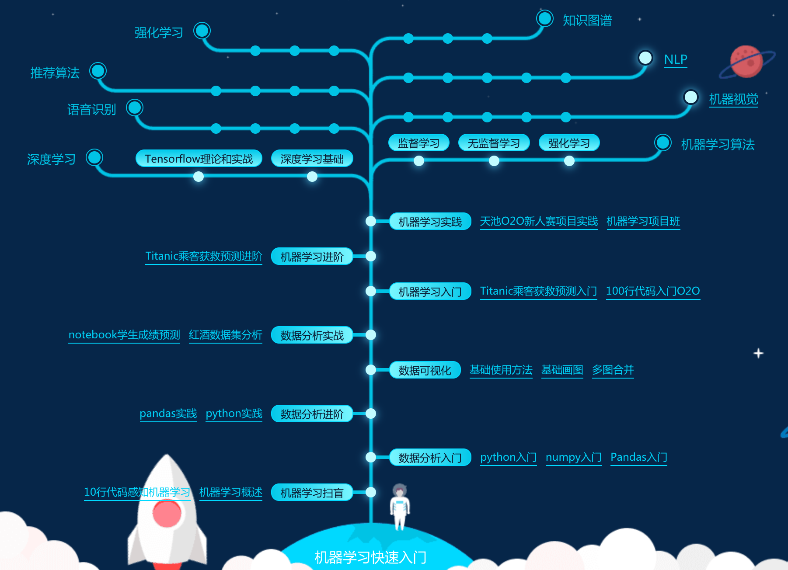
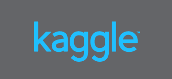

[TOC]


## 机器学习

学习需要从锻炼中成长；

```
机器学习概述10行代码感知机器学习	机器学习扫盲	
数据分析入门	python入门	numpy入门	Pandas入门	
python实践	pandas实践	数据分析进阶	
数据可视化	基础使用方法	基础画图	多图合并	
红酒数据集	分析notebook学生成绩预测	数据分析实战

机器学习入门	Titanic乘客获救预测入门	100行代码入门O2O
Titanic乘客获救预测进阶	机器学习进阶
机器学习实践	天池O2O新人赛项目	实践机器学习项目班
深度学习基础	Tensorflow理论和实战	监督学习	无监督学习	机器视觉	NLP	强化学习

深度学习	机器学习算法 强化学习	推荐算法 	语音识别	知识图谱

```





## 天池

到2019-09-20

**2019广东工业智造创新大赛**

人工智能是国家战略性新兴产业。随着广东制造产业信息建设的不断完善，且产业布局较为完整，诞生了一批信息化程度高的工业制造企业，已沉淀积累了一定数据资源。2019年广东省人民政府联合阿里巴巴集团共同启动“广东工业智造创新大赛”，聚焦布匹疵点智能识别和面料剪裁利用率优化，旨在通过数据开放召集全球众智，将重点围绕工业制造大数据展开，以落地为导向，聚集全球顶级人才，发掘全球先进的智能制造应用成果，推动人工智能技术在广东纺织行业的探索与发展，用技术驱动广东智能制造产业转型升级和变革发展。

**赛场一：布匹疵点 智能识别**

**竞赛课题**

布匹疵点检验是纺织行业生产和质量管理的重要环节，人工智能和计算机视觉技术 应用于纺织行业，其价值无疑是巨大的。本赛场聚焦布匹疵点智能检测，要求选手研究开发高效可靠的**计算机视觉算法**，提升布匹疵点检验的准确度，降低对大量人工的依赖，提升布样疵点质检的效果和效率。初赛阶段考察素色布瑕疵检测和分类能力，复赛阶段考察花色布的瑕疵检测和分类能力。

布匹疵点检验是纺织行业生产和质量管理的重要环节，而布匹疵点智能检测是困扰行业多年的技术瓶颈。目前几乎都是人工检测，易受主观因素影响，缺乏一致性；并且检测人员在强光下长时间工作对视力影响极大。借助人工智能和计算机视觉 等先进技术，实现布匹疵点智能检测，其价值无疑是巨大的。


**数据描述**
深入佛山南海纺织车间现场采集布匹图像，制作并发布大规模的高质量布匹疵点数据集，同时提供精细的标注来满足算法要求。其中，素色布数据约8000张，花色布数据约12000张。

```
https://github.com/lambda-xmu

```

**使用torchvision（0.3.0），像训练分类模型一样训练检测模型**
baseline模型

torchvision在0.3.0版本中集成了Facebook Research检测框架 maskrcnn_benchmark，不用额外编译库，纯python实现，让检测任务更简单，像处理分类任务一样。

本notebook对torchvision detection 训练入口做了部分删减，使更容易理解。

**训练环境**

1. pytorch 1.1.0
2. torchvison 0.3.0
3. 单卡训练

```
论坛
https://tianchi.aliyun.com/competition/entrance/231748/forum

学习资料
https://tianchi.aliyun.com/competition/entrance/231748/learn

https://tianchi.aliyun.com/course/video?spm=5176.12586971.1001.1.61376448KdAkgB&liveId=41083
```

**模型训练**
1.torchvision detection数据dataset采用coco格式，先使用Fabric2COCO转换脚本将数据转换为coco格式。

2.训练入口文件为train.py,train.py包含几部分:(1)生成data_loader &dataset; (2)建立model; (3)创建optimizer&&lr_scheduler;(4)training，整个代码结构与分类基本相似

3.前传文件为inference.py


**赛场二：面料剪裁利用率优化**

**竞赛课题**

面料切割利用率的提升是纺织行业长期追求的目标。如何提升面料切割利用率，既是企业生产精益化的难点，也是痛点。当前纺织行业布匹原材料的成本占到40%左右，价值较高。本赛场要求选手**开发算法模型**，实现在较短时间范围内计算获得高质量可执行的排版结果，减少切割中形成的边角废料，提升面料切割利用率，减少计划时间、提高工作效率和避免人工计算的失误，提升价值降低成本。。

在切割之前，需要确定多个零件在面料上的位置和角度，再充分利用零件在形状上的互补特征，对零件排布的方式进行优化。面料切割问题的特性，是零件存在多种尺寸、形状，比如用作衬衫制作的袖子、后背等零件，用来切割的布匹本身存在多类瑕疵，如破洞、折皱、漏纱等，在排版中需要避开。此外，某些订单，对零件存在个性化排版需求，因此在下料环节中，需要依照订单要求进行排版下料。当前纺织行业布匹原材料的成本占到40%左右，价值较高。

**数据描述**
数据由广东瑞洲科技有限公司提供。比赛每阶段将提供2-3个批次的零件数据及面料数据，1个批次约200-400个零件数据，用于模型算法的研发和测试。同时，会提供零件排版的约束要求，比如满足零件旋转角度、面料瑕疵、最小间距等。


## Kaggle


> 
>
> 由墨尔本大学的Anthony Goldbloom创办，是最早的大数据竞赛平台，拥有庞大的技术分享社区和众多开元代码，面向全球用户；产品2010年上线，累计举办竞赛260+个（含练习赛和自办赛），注册用户数20W+。

- 官方网址：https://www.kaggle.com/

- 开放数据集：https://www.kaggle.com/datasets

- 《[Kaggle Competition Past Solutions](http://www.chioka.in/kaggle-competition-solutions/)》by log0

- 《[Winning solutions of kaggle competitions](https://www.kaggle.com/sudalairajkumar/winning-solutions-of-kaggle-competitions)》by SRK 

- [Kaggle 项目实战（教程）](https://github.com/apachecn/kaggle) by [ApacheCN](http://www.apachecn.org)

- **[Kaggle Past Solutions](http://ndres.me/kaggle-past-solutions/)**

  > Sortable and searchable compilation of solutions to past Kaggle competitions.

下表只列出过去半年内active的competitons，并且按照recently created排序。

| Competiton                                                   |   Categories    | Submission deadline | Prize Money |
| ------------------------------------------------------------ | :-------------: | :-----------------: | :---------: |
| [Traveling Santa 2018 - Prime Paths](https://www.kaggle.com/c/traveling-santa-2018-prime-paths) |    Featured     |  January 10, 2019   |   $25,000   |
| [Don't call me turkey!](https://www.kaggle.com/c/dont-call-me-turkey) |   Playground    |     11/26/2018      |    Swag     |
| [Histopathologic Cancer Detection](https://www.kaggle.com/c/histopathologic-cancer-detection) |   Playground    |   March 30, 2019    |    Swag     |
| [Quora Insincere Questions Classification](https://www.kaggle.com/c/quora-insincere-questions-classification) |    Featured     |    Feb. 5, 2019     |   $25,000   |
| **[PLAsTiCC Astronomical Classification](https://www.kaggle.com/c/PLAsTiCC-2018)** |    Featured     |    Dec. 17, 2018    |   $25,000   |
| **[Human Protein Atlas Image Classification](https://www.kaggle.com/c/human-protein-atlas-image-classification)** |    Featured     |    Jan. 10, 2019    |   $37,000   |
| **[PUBG Finish Placement Prediction (Kernels Only)](https://www.kaggle.com/c/pubg-finish-placement-prediction)** |   Playground    |      1/30/2019      |    Swag     |
| **[Two Sigma: Using News to Predict Stock Movements](https://www.kaggle.com/c/two-sigma-financial-news)** |    Featured     |      1/8/2019       |  $100,000   |
| **[Quick, Draw! Doodle Recognition Challenge](https://www.kaggle.com/c/quickdraw-doodle-recognition)** |    Featured     |  December 4, 2018   |   $25,000   |
| [Costa Rican Household Poverty Level Prediction](https://www.kaggle.com/c/costa-rican-household-poverty-prediction) |   Playground    | September 19, 2018  |             |
| **[Google Analytics Customer Revenue Prediction](https://www.kaggle.com/c/google-analytics-customer-revenue-prediction#Timeline)** |    Featured     |  November 15, 2018  |   $45,000   |
| **[Inclusive Images Challenge](https://www.kaggle.com/c/inclusive-images-challenge)** |    Research     |  November 12, 2018  |   $25,000   |
| [RSNA Pneumonia Detection Challenge](https://www.kaggle.com/c/rsna-pneumonia-detection-challenge) |    Featured     |  October 24, 2018   |   $30,000   |
| [New York City Taxi Fare Prediction](https://www.kaggle.com/c/new-york-city-taxi-fare-prediction) |   Playground    |    Sep. 25, 2018    |      -      |
| [TGS Salt Identification Challenge](https://www.kaggle.com/c/tgs-salt-identification-challenge) |    Featured     |  October 19, 2018   |  $100,000   |
| [Movie Review Sentiment Analysis (Kernels Only)](https://www.kaggle.com/c/movie-review-sentiment-analysis-kernels-only) |   Playground    |          -          |      -      |
| [Flavours of Physics: Finding τ → μμμ (Kernels Only)](https://www.kaggle.com/c/flavours-of-physics-kernels-only) |   Playground    |          -          |      -      |
| [What's Cooking? (Kernels Only)](https://www.kaggle.com/c/whats-cooking-kernels-only) |   Playground    |          -          |      -      |
| **[Store Item Demand Forecasting Challenge](https://www.kaggle.com/c/demand-forecasting-kernels-only)** |   Playground    |          -          |      -      |
| **[Airbus Ship Detection Challenge](https://www.kaggle.com/c/airbus-ship-detection)** |    Featured     |   October 4, 2018   |   $60,000   |
| [Forest Cover Type (Kernels Only)](https://www.kaggle.com/c/forest-cover-type-kernels-only) |   Playground    |          -          |      -      |
| **[Google AI Open Images - Object Detection Track](https://www.kaggle.com/c/google-ai-open-images-object-detection-track)** |    Featured     |    Sep. 3, 2018     |   $30,000   |
| [Santander Value Prediction Challenge](https://www.kaggle.com/c/santander-value-prediction-challenge) |    Featured     |   August 20, 2018   |   $60,000   |
| [The 2nd YouTube-8M Video Understanding Challenge](https://www.kaggle.com/c/youtube8m-2018) |    Featured     |   August 6, 2018    |   $25,000   |
| [Home Credit Default Risk](https://www.kaggle.com/c/home-credit-default-risk#Timeline) |    Featured     |      2018.8.29      |   $70,000   |
| [Freesound General-Purpose Audio Tagging Challenge](https://www.kaggle.com/c/freesound-audio-tagging) |    Research     |      2018.7.24      |      -      |
| [CVPR 2018 WAD Video Segmentation Challenge](https://www.kaggle.com/c/cvpr-2018-autonomous-driving) |    Research     |                     |   $2,500    |
| [Predict Future Sales](https://www.kaggle.com/c/competitive-data-science-predict-future-sales) |   Playground    |          -          |      -      |
| [Avito Demand Prediction Challenge](https://www.kaggle.com/c/avito-demand-prediction) |    Featured     |      2018.6.27      |   $25,000   |
| [iNaturalist Challenge at FGVC5](https://www.kaggle.com/c/inaturalist-2018) |    Research     |      2018.6.4       |      -      |
| [**TrackML Particle Tracking Challenge**](https://www.kaggle.com/c/trackml-particle-identification#Prizes) |    Featured     |      2018.8.13      |   $25,000   |
| [Plant Seedlings Classification](https://www.kaggle.com/c/plant-seedlings-classification) |   Playground    |          -          |      -      |
| [Google Landmark Recognition Challenge](https://www.kaggle.com/c/landmark-recognition-challenge) |    Research     |      2018.5.22      |   $2,500    |
| [Dog Breed Identification](https://www.kaggle.com/c/dog-breed-identification) |   Playground    |          -          |      -      |
| [Humpback Whale Identification Challenge](https://www.kaggle.com/c/whale-categorization-playground) |   Playground    |          -          |      -      |
| [ImageNet Object Detection from Video Challenge](https://www.kaggle.com/c/imagenet-object-detection-from-video-challenge) |    Research     |          -          |      -      |
| [ImageNet Object Detection Challenge](https://www.kaggle.com/c/imagenet-object-detection-challenge) |    Research     |          -          |      -      |
| [House Prices: Advanced Regression Techniques](https://www.kaggle.com/c/house-prices-advanced-regression-techniques) | Getting Started |          -          |      -      |
| [Titanic: Machine Learning from Disaster](https://www.kaggle.com/c/titanic) | Getting Started |          -          |      -      |
| [Digit Recognizer](https://www.kaggle.com/c/digit-recognizer) | Getting Started |          -          |      -      |
| [ImageNet Object Localization Challenge](https://www.kaggle.com/c/imagenet-object-localization-challenge) |    Research     |          -          |      -      |
| [Invasive Species Monitoring](https://www.kaggle.com/c/invasive-species-monitoring) |   Playground    |          -          |      -      |

<br>


## 数据竞争

包括数据竞争笔记，顶级解决方案分析等。

**数据竞争从0到1**

- 数据竞争从0到1第一部分：信用欺诈检测器
  - EDA（探索性数据分析）
  - 不平衡
  - 度量
  - 重采样
  - 交叉验证
- [数据竞争从0到1第二部分：特征工程](https://lambda-xmu.club/2018/08/22/Data-competition-From-0-to-1-Part-II/)
- [数据竞争从0到1第二部分：特征工程（补充）](http://lambda-xmu.club/2018/08/31/Data-competition-From-0-to-1-Part-II(补充)/)

**EDA＆基线**

- [2019年CCF工件EDA第1部分](http://lambda-xmu.club/2018/08/25/2019CCF-Work-Piece-EDA/)
- [2019年CCF工件EDA第2部分](http://lambda-xmu.club/2018/09/04/2019CCF-Work-Piece-EDA-Part2/)
- [2019年CCF汽车销售EDA](http://lambda-xmu.club/2018/08/27/2019CCF-Car-Sales-EDA/)

**效用**

- [Numba教程：加速Python代码](http://lambda-xmu.club/2018/08/20/Speed-Up-Python-Code/)


## environment环境

**yml脚本；**

name: mne外资企业

- channels:渠道:——默认值
  - defaults
- dependencies:依赖关系
  - python>=3.6
  - pip
  - mkl
  - numpy
  - scipy
  - matplotlib
  - pyqt>=5.9
  - vtk>=8
  - pandas
  - scikit-learn
  - h5py
  - pillow
  - statsmodels
  - jupyter
  - nose
  - pytest
  - pytest-cov
  - sphinx
  - joblib
  - psutil
  - numpydoc
  - flake8
  - spyder
  - numexpr
- pip:
  - mne
  - "https://api.github.com/repos/enthought/traits/zipball/a99b3f64d50c5f7f28ffc01bf69419b061f9e976"
  - "https://api.github.com/repos/enthought/pyface/zipball/6a0cac149d56293482bb828a7d98122667c773be"
  - "https://api.github.com/repos/enthought/traitsui/zipball/e366ad3886d3c39bedb96e83bab447d31c4ab725"
  - "https://api.github.com/repos/enthought/mayavi/zipball/master"
  - "https://api.github.com/repos/nipy/PySurfer/zipball/master"
  - nitime
  - nibabel
  - nilearn
  - neo
  - pytest-sugar
  - pytest-faulthandler
  - pydocstyle
  - sphinx_bootstrap_theme
  - "https://api.github.com/repos/sphinx-gallery/sphinx-gallery/zipball/master"
  - python-picard


**game**

```yml
Table of contents	表的内容
Kaggle（新）
天池（新）
DrivenData
CodaLab（新）
Challenge Data
crowdAI（新）
Numer.ai
[SIGNATE](#signate)（新）
Unearthed（新）
Analytics Vidhya
TechGig
HackerEarth
NIPS 2018 Competition Track
GECCO 2018 Competition
Grand Challenges in Biomedical Image Analysis
Kelvins
Unrestricted Adversarial Examples Challenge (不受限对抗样本挑战)
A Conversational Question Answering Challenge (CoQA)
The Stanford Question Answering Dataset (SQuAD2.0)
The Scene Understanding and Modeling Challenge (SUMO)
Open MIC
The SpaceNet Challenge Round 4
Online Data-Driven Multi-Objective Optimization
AI Challenger 全球AI挑战赛2018
IDAO.world – International Data Analysis Olympiad 全球数据分析大赛（新）
MC挑战赛
NIST: Differential Privacy Synthetic Data Challenge (NIST: 综合数据差分隐私挑战)
Yaw Alignment Marathon Challenge (风力涡轮机偏航失准角挑战)
JData
JDDiscovery（新）
点石（新）
TinyMind
Kesci
DataCastle（新）
Biendata
DataFountain


逾期的
第二届易观算法大赛 | 数愿 | 第3届 融360金融算法挑战赛
GeekPwn 2018 国际安全极客大赛 | 对抗样本攻防赛CAAD
2018年国际大学生类脑计算创新应用大赛 | 深圳医疗健康大数据创新应用国际大赛
华为大数据平台 | 2018讯飞AI开发者大赛
ATEC人工智能大赛（蚂蚁金服）
中国法研杯司法人工智能挑战赛
Visual Dialog Challenge 2018
The FashionGen Challenge | 京东AI时尚挑战赛 | 京东JD Dialog Challenge人机对话挑战赛
COLIEE-2018
第三届魔镜杯大赛 | CoNaLa: The Code/Natural Language Challenge
Momenta Car Detection Challenge (MCDC) | 北京市高校校园大数据竞赛
OpenAI 迁移学习竞赛 | CoNLL–SIGMORPHON 2018 Shared Task
智慧金融马上AI全球挑战者大赛 | 第六届-泰迪杯数据挖掘挑战赛
CCDM-2018 | 2018机器阅读理解技术竞赛 | 第二届"讯飞杯"中文机器阅读理解评测
SODA | 数据嗨客 | 竞技乎 | 知数学院 | 第三届数据新闻比赛
```


## 他山之石