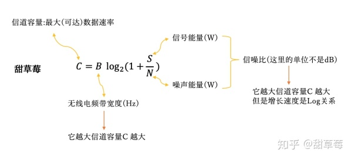

## 关于5G

最高听到5G到来的，是在2019年初高晓松在清华的一次演讲中，当时他代表阿里去做一次关于5G在真实的场景下的一次演讲。 自从去年2018年的，华为的手机，首先把5G技术放在手机里面，5G这个词语一直都在被人们讨论着，但是什么是真正的5G呢？

从文字到印刷术，从信号塔到无线电，从电话到移动互联网，5G是第五代移动通信系统(5th generation mobile/wireless/cellular system）的简称，是4G（LTE/WiMax）之后的新一代移动通信系统。

**国际通信标准**

通信是一种双向行为，收发双方需要事先约定传输方式才能完成顺利完成数据交互。在混乱的移动通信早期，基站和手机厂商可能因为国别的不同，采用不同通信制式，因此当时各国的手机设备难以通用，国际漫游成本高昂。为了国际通信方便，各国厂商需要统一制式，这就是国际通信标准的诞生。

**标准化组织**

在标准设计早期，为了定义标准所需要解决的问题，隶属于联合国的ITU（国际电联）需从各地区的工作小组和论坛中搜集整理需求，发布此次通信的设计目标，并收集技术建议，负责最终评估。而ITU并不参与具体标准制定，其中具体的技术工作主要是由另外的一些行业标准化组织完成，比如3GPP和IEEE。

4G时代，3GPP主导了LTE等标准（我们目前使用的4G技术），IEEE主导了WiMax等标准（曾经在日本，台湾商用）。目前5G的主要标准化工作由3GPP完成。5G的标准进展需要看3GPP的时间表, 目前5G被分为两个阶段：Release 15和Release 16，被称作New Radio (NR)。

**如何提升数据传输速度**

任何对通信数据传输速率的提升都绕不开香农信道容量公式;5G提高数据传输速率: 提升频带宽度(B)和提升信噪比(s/n)。

毫米波(提升频带宽度)；更先进的波束赋形(提升信噪比)；超大规模天线，全双工无线(提升频带宽度和信噪比，空域)。





**5G的六大基本特点**

高速度

泛在网

低功耗

万物互联

重构安全体系

智能交通


**5G的三大场景**

**1.eMBB——3D/超高清视频等大流量/（增强型移动宽带）**

eMBB：（Enhanced Mobile Broadband）增强移动宽带是指在现有移动宽带业务场景的基础上，用户体验速度大幅提升。今天我们使用4G网络，一般的用户实际体验速度上传6Mbps，下载50Mbps，这个速度远不能满足用户的需求；

eMBB可以在独立组网情况下部署，也可以在非独立组网情况下部署：主体网络是4G，但是在重点地区部署增强移动宽带。


**2.mMTC——大规模物(机器通信)/联网业务**

MMTC：（Massive Machine Type Communication）大规模物联网，实现海量机器类通信。5G的最主要价值之一，就是突破了人与人之间的通信，使得人与机器、机器与机器的通信成为可能。大量的物联网应用需要进行通信，物联网应用的通信有两个基本要求：低功耗和海量接入。

大量的物联网应用比如电线杆、车位、井盖、家庭门锁、空气净化器、暖气、冰箱、洗衣机等都要接入网络中，相当多的物联网无法使用固定电源供电，只能使用电池，如果通信部分需要较大的功耗，就意味着部署起来非常困难，这将大大限制物联网的发展。eMTC提供的能力就是要让功耗降至极低的水平，让大量的物量网设备可以一个月甚至更长时间不需要充电，从而方便地进行部署。

大量的物联网应用的加入，也带来另一个问题，就是应用终端会极大增加。预计2025年，中国的移动终端产品会达到100亿，其中有80亿以上物联网终端，这就需要网络有能力支持大量的设备接入，目前的4G网络显然没有能力支持这样庞大的接入数，eMTC将提供低功耗、海量接入的能力，支持大量的物联网设备的接入。

**物联网技术**

物联网已经在加速发展，但5G的推出将为将数十亿台设备连接到互联网提供基础设施。家庭中越来越多的物联网设备为硬件制造商提供了巨大的机会，但真正的潜力在于工业物联网。

这项技术已经在革新各个行业，包括制造业，农业和零售业。

物联网对一个领域进行革新，比如医疗保健，物联网有助于以全新的方式提供治疗。

未来，5G将基于可穿戴健康追踪器的数据实现一系列新的创新，如远程机器人手术和个性化医疗。

监测这种程度的健康状况的能力很可能对保险业产生重大影响，保险费的价格取决于客户的生活方式。敏感数据的规模转移意味着物联网安全将成为未来几年重大投资的瞄准方向。


**3.uRLLC**超可靠和低延迟通信

（Ultra Reliable Low Latency Communications）——无人驾驶、工业自动化等需要低时延、高可靠连接的业务。

uRLLC：超高可靠超低时延通信。传统的通信中，对于可靠性的要求是相对较低的，但是无人驾驶、工业机器人、柔性智能生产线，却对通信提出了更高的要求，这样的通信必须是高可靠和低时延的。

所谓高可靠就是网络必须保持稳定性，保证在运行的过程中，不会拥堵，不会被干扰，不会经常受到各种外界的影响。而以前的4G网络时延最好只能做到20毫秒，但是uRLLC却要求时延做到1~10毫秒，这样的时延才能提供高稳定、高安全性的通信能力，从而让无人驾驶、工业机器人在接受命令时第一时间做出反应，迅速、及时地执行命令。这就需要采用边缘计算、网络切片等多种技术来提供技术支持，保证更多高可靠的通信场景。

**自动驾驶汽车**

5G对自动驾驶汽车的未来至关重要。这些车辆需要检测障碍物，与智能标志互动，遵循精确的地图并相互通信。

需要实时传输和处理大量数据以确保乘客安全，目前只有5G网络能够提供将数百万辆自动驾驶汽车带入道路所需的容量，速度，低延迟和安全性。

自动驾驶汽车不仅可以减少污染和拥堵，提高乘客安全性，而且还可以开辟一个全新的市场。当司机成为乘客时，他们将获得原来无论是工作还是放松时没有的额外空闲时间，。

这可能会为特定的旅程时间量身定制新的全新平台和模式。英特尔将这个全新的行业描述为“乘客经济”，并预测到2050年它的价值将达到7万亿美元。

## 5G是一个复杂系统

**1. 技术能力层**

- 他可以有更大的带宽,能够支持很多需要流量,或者网速支持的一些技术

- 比如: 我们的人工智能所需要的 即使交互功能,以及

- 需要高安全性的无人驾驶技术

- 进行时适零距离的,需要用户体验感极强的一些科技应用,比如 vr技术等;

- 他需要更多的响应速度

  - 比如,信号基站的建设,避免 在高峰期引起的网络堵塞,

  - 可以开发更加庞大的网络游戏,比如,云更新等速度,可以没必要在自己的电脑或者设备里进行下载,而是

    根据网络的实时速度,来传递,这种程序

- 更多的接入设备

  - 一个家庭可以,将所有的设备都进行联网处理,这样 可以实时的掌握家里的动态
  - 增加用户对智能家居的体验,可以更加便捷的使用,家里的一切设备.
  - 定时以及人工语言的功能实时更新速度更快,

虽然,今天主要是设备公司以及技术公司在极力推广5G,但,其只是,生态中最基础的部分

**2. 应用支持层**

- 各大应用平台的出现,在4G时候,就已经有所弊端,比如,网速的上线,应用的体验感或者说是发布时预览的效果不是很好
- 但,如果开发平台可以提供技术体验的技术,比如说,一款游戏,你不用下载,可以直接在平台里开始体验,亦或是,一款应用,可以不用下载,可以暂时取得使用权,进行使用
- 现在,运营商垄断大,但还是依靠流量来赚钱,所以,在5g的时候 运营商并不是出于垄断地位的,更多的可能就是 一些与运营商合作,提供应用是商家

未来真正的发展趋势,运营商依然愿意推到应用支持平台的背后提供服务

**3.应用能力层**

- 远程传输速度
- 实时处理能力
- 多设备接入能力

 应用层是5G精彩的表现，就像说起4G，人们想起的就是4G的移动支付一样.

**4.业务层**

- 物理距离的突破
- 虚实世界的融合
- 万物的智能互联
- 实时的数字生态

5G的业务同样也将会丰富多彩。

 更快的网速一定会带动更多的使用。同样,也会刺激设备在物理上突破。

**5.生态层**

 5G的发展机会在所有人面前是平等的。5G的生态同样也需要大家的维护。

 即需要提供应用的平台保护大家的隐私数据,也需要应用提供商不独占用户,给中小型应用发展的机会.更需要政府的监管,防止应用中途变味.


## **与WiFi的关系**

当然，作为用户来讲，我自己最直观的体验是WiFi比xG要便宜很多，如果我们忽略有线宽带和路由器费用，甚至可以认为用WiFi连接互联网是免费的。然而大部分情况下，价格只能反应一部分技术因素。**如果把一个小小的家庭网络，扩展到全国和世界范围就是xG**。不

为了简单描述这两者的不同，我们需要先从需求说起。

**竞争性**

就WiFi和xG来说，技术上，他们的区别有点类似**区域自治**和**中央集权**，这种思路导致了大部分WiFi节点都是私人(或者公司，或者城市)建设，而xG基站是运营商在全国建设。

换句话说，就是在无线信号传输过程中，因为各个私人路由器之间没有交流且共享相同频谱，所以WiFi的数据传输是竞争性的，而xG的数据传输是非竞争的，有中心化资源调度的。

**私密性**

同时，一般意义上，WiFi连接的是私人有线宽带，而xG的基站连接的是运营商的骨干网，因此，WiFi普遍会有私密性要求，不能未经许可随意接入。  xg安全私密性不高容易被窃取？


**移动性**

因为WiFi连接的是私人有线宽带，私人宽带接入点固定，同时宽带是有线的，它不会到处乱跑。这意味着WiFi对移动性需求很低，覆盖范围小，一般只用考虑步行速度对信号传输的影响，不考虑小区切换，而xG的基站存在很高的移动性和小区切换需求(基站覆盖范围称为小区)，需要考虑比如汽车，火车等高速物体。

> 除非汽车本身有个WiFi，不然应该是没有人在汽车上一直连着WiFi的吧？目前WiFi有WDS模式，但是还是不如运营商的小区切换成熟。

这样的竞争/非竞争，私密性和移动性要求会带来一系列从功能，技术到覆盖，接入，频谱，速度等等的不同。


## 他山之石

```

5g
https://www.zhihu.com/topic/19565565/hot
```

