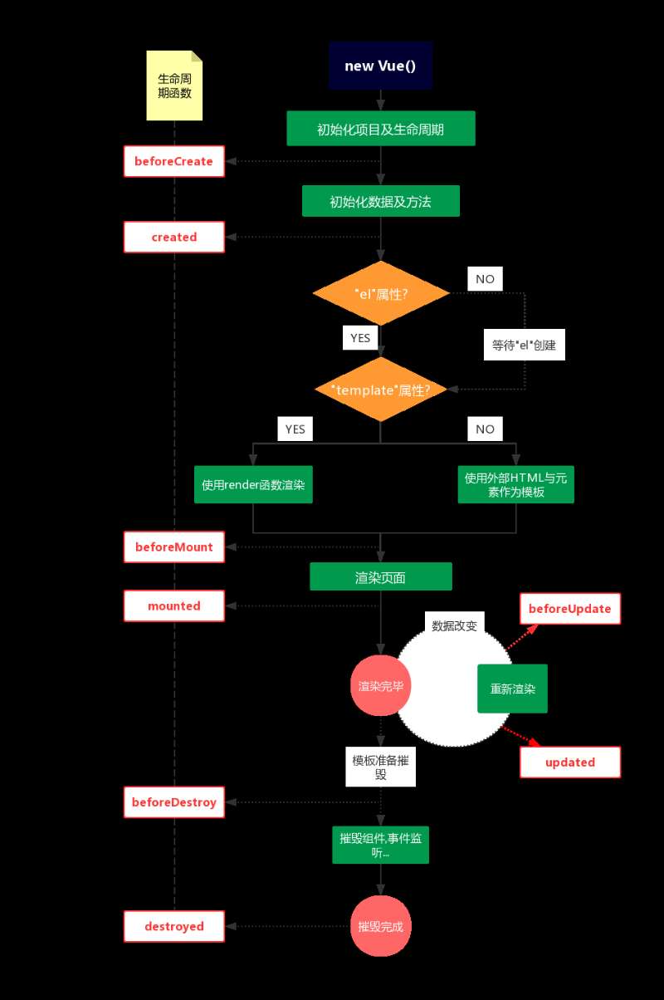

## Vue介绍

Webpack+Vue+vue-Router前端工程搭建

1 Vue是什么

**1.1 定义** 

* Vue 是一套用于构建用户界面的渐进式框架
* 使用Vue框架，可以完全在浏览器端渲染页面，服务端只提供数据
* 使用Vue框架可以非常方便的构建 单页面应用 (SPA)

```
Vue (读音 /vjuː/，类似于 view) 是一套用于构建用户界面的渐进式JavaScript框架。与其它大型框架不同的是，Vue 被设计为可以自底向上逐层应用。Vue 的核心库只关注视图层，方便与第三方库或既有项目整合。
```


**1.2 关于作者**


* 国人 **尤雨溪**
* 百科介绍： https://baike.baidu.com/item/%E5%B0%A4%E9%9B%A8%E6%BA%AA/2281470?fr=aladdin
* 微博： https://weibo.com/arttechdesign?is_hot=1#1528176039582


**1.3 相关网站**

* 官方网站： https://cn.vuejs.org/
* GitHub： https://github.com/vuejs/vue


**2 前端框架**

**2.1 三足鼎立**

* React  
* Angular
* Vue


**2.2 Angular、Vue、React的区别**

**Vue与React**

* React与Vue 都采用虚拟DOM
* 核心功能都在核心库中，其他类似路由这样的功能则由其他库进行处理
* React的生态系统更庞大，由ReactNative来进行混合App开发; Vue更轻量
* React由独特的JSX语法; Vue是基于传统的Web计数进行扩展(HTML、CSS、JavaScript)，更容易学习

**Vue与Angular**

* Angular1和Angular2以后的版本  是完全不同的两个框架； 一般Angular1被称作Angular.js, Angular之后的版本被称作 Angular

* Vue与Angular的语法非常相似

* Vue没有像Angular一样深入开发，只保证了基本功能。 Angular过于笨重

* Vue的运行速度比Angular快得多

* Angular的脏检查机制带来诸多性能问题

  

**2.3 MVVM**

* Model
* View
* ViewModel


### 2.4 Vue的优点

* 不存在依赖
* 轻便（25k min）
* 适用范围广(大中小型项目、PC、移动端、混合开发)
* 本土框架,社区非常活跃
* 语法简单、学习成本低
* 双向数据绑定（所见即所得）


### 2.5 使用框架开展一个项目的时候，需要考虑哪些方面？

1.性能

如果一个网站在性能方面存在问题，它将会损失超过一半以上的用户。

对于框架性能，你可以在网上查询到各类测试，你可以了解框架的代码结构、逻辑处理，判断是否能够满足你对性能的需求。

2.扩展性

对于一个需要长期维护的项目而言，经常会有各种各样的功能添加进来，这时扩展性就显得尤为重要，如果你在前期选择了一款满足前期的框架，但后期你需要使用某个插件来完成某个功能，或者基于什么完成一个功能，这时候你发现网上并没有检索到相关内容，内心是否充满了心塞。

3.维护性

一个项目的生命周期不是三天两天，而前端的发展则是爆炸式的。在你选择框架的时候是否考虑过官方在后续的一段时间是否会一直对框架进行更新维护？如果不确定，是否已经有了官方放弃维护后的解决方案？

4.兼容性

这里的兼容性指的不是浏览器兼容，而是框架与其他框架及工具的兼容，使用这个框架对于你的开发环境是否有影响，对于你的开发 IDE 是否有影响。


 Vue.js 适用具有以下性质的项目：

* 对浏览器兼容要求不高，不需要兼容至IE6-8；
* SPA开发；
* 对性能较高要求;
* 组件化。

总的来说，如果你是一个 MVVM 框架新手，那么 Vue.js 就是你最好的进阶工具，如果你是一个已经掌握了其他 MVVM 框架的老手，那你会发现 Vue.js 更加简单轻便。


**3 多页面应用和单页面应用**

**3.1 多页面应用（MultiPage Application，MPA）**

多页面跳转刷新所有资源，每个公共资源(js、css等)需选择性重新加载，常用于 app 或 客户端等


**3.2 单页面应用（SinglePage Web Application，SPA）**

只有一张Web页面的应用，是一种从Web服务器加载的富客户端，单页面跳转仅刷新局部资源 ，公共资源(js、css等)仅需加载一次，常用于PC端官网、购物等网站


**3.3 两者对比**

|                   | 单页面应用                                                   | 多页面应用                                   |
| ----------------- | ------------------------------------------------------------ | -------------------------------------------- |
| 组成              | 一个外壳页面和多个页面片段组成                               | 多个完整页面构成                             |
| 资源公用(css,js)  | 共用，只需在外壳部分加载                                     | 不共用，每个页面都需要加载                   |
| 刷新方式          | 页面局部刷新或更改                                           | 整页刷新                                     |
| url 模式          | a.com/#/pagetwo                         a.com/#/pagetwo      | a.com/pageone.html  a.com/pagetwo.html       |
| 用户体验          | 页面片段间的切换快，用户体验良好                             | 页面切换加载缓慢，流畅度不够，用户体验比较差 |
| 转场动画          | 容易实现                                                     | 无法实现                                     |
| 数据传递          | 容易                                                         | 依赖 url传参、或者cookie 、localStorage等    |
| 搜索引擎优化(SEO) | 需要单独方案、实现较为困难、适用于追求高度支持搜索引擎的应用 | 实现方法简易                                 |
| 试用范围          | 高要求的体验度、追求界面流畅的应用                           | 适用于追求高度支持搜索引擎的应用             |
| 开发成本          | 较高，常需借助专业的框架                                     | 较低 ，但页面重复代码多                      |
| 维护成本          | 相对容易                                                     | 相对复杂                                     |


**4 Vue入门**

**4.1 安装**

#### 直接`<script>`引入

##### 下载地址

* 开发环境版本 https://vuejs.org/js/vue.js     包含完整的警告和调试模式
* 生成环境版本 https://vuejs.org/js/vue.min.js   删除了警告、进行了压缩
#####CDN

```
https://cdn.jsdelivr.net/npm/vue@2.5.16/dist/vue.min.js
https://cdn.jsdelivr.net/npm/vue@2.5.16/dist/vue.js
# 以手动指定版本号
```

##### NPM

在用 Vue 构建大型应用时推荐使用 NPM 安装[1]。NPM 能很好地和诸如 webpack 或 Browserify 模块打包器配合使用。同时 Vue 也提供配套工具来开发单文件组件。

```
npm install vue
```


#### 构建工具 (CLI)

```
npm install -g @vue/cli
vue create my-project
```


### 4.2 Vue基本演示

#### 创建实例 

```javascript
var app = new Vue({
  el: '#app',

})
```

#### 添加数据

```javascript
var app = new Vue({
  el: '#app',
  data: {
    message: 'Hello Vue!'
  }
})
```

#### 模板渲染（文本差值）

```html
<div id="app">
  {{ message }}
</div>
或者
<div id="app" v-text="message">  
</div>
```

####绑定属性的值

```html
<span v-bind:title="message">
    鼠标悬停几秒钟查看此处动态绑定的提示信息！
 </span>
```

#### 双向数据绑定

```javascript
 <p>{{ message }}</p>
 <input v-model="message">
```

#### 事件

```html
<div id="app">
  <p>{{ message }}</p>
  <button v-on:click="reverseMessage">逆转消息</button>
</div>
```

```javascript
var app = new Vue({
  el: '#app-5',
  data: {
    message: 'Hello Vue.js!'
  },
  methods: {
    reverseMessage: function () {
      this.message = this.message.split('').reverse().join('')
    }
  }
})
```

#### 循环

```html
<ol>
  <li v-for="todo in todos">
      {{ todo.text }}
  </li>
</ol>
```

#### 条件

```html
<p v-if="seen">现在你看到我了</p>
```

#### Vue组件化

```javascript
// 定义名为 todo-item 的新组件
Vue.component('todo-item', {
  template: '<li>这是个待办项</li>'
})
```

```html
<ol>
  <!-- 创建一个 todo-item 组件的实例 -->
  <todo-item></todo-item>
</ol>
```


## Vue实例

**1 创建实例**

```javascript
var vm = new Vue({
  // 选项
})
```

* 每个 Vue 应用都是通过用 Vue 函数创建一个新的 Vue 实例开始的
* 一个 Vue 应用由一个通过 new Vue 创建的根 Vue 实例，以及可选的嵌套的、可复用的组件树组成。


**2 数据与方法**

### 2.1 数据

* 当一个 Vue 实例被创建时，它向 Vue 的响应式系统中加入了其 data 对象中能找到的所有的属性。当这些属性的值发生改变时，视图将会产生“响应”，即匹配更新为新的值。
* 只有当实例被创建时 data 中存在的属性才是响应式的
* 如果你知道你会在晚些时候需要一个属性，但是一开始它为空或不存在，那么你仅需要设置一些初始值

### 2.2 实例方法

Vue 实例还暴露了一些有用的实例属性与方法。它们都有前缀 $，以便与用户定义的属性区分开来

* vm.$el
* vm.$data
* vm.$watch(dataAttr, fn)   


**3 计算属性和侦听器**

**3.1 methods**

methods用来装载可以调用的函数，你可以直接通过 Vue 实例访问这些方法，或者在指令表达式中使用。方法中的 this 自动绑定为 Vue 实例。

> 注意，不应该使用箭头函数来定义 methods 函数（例如 plus: () => this.a++）。理由是箭头函数绑定了父级作用域的上下文，所以 this 将不会按照期望指向 Vue 实例，this.a 将是 undefined。示例代码如下。

如果你要通过对 DOM 的操作来触发这些函数，那么应该使用 v-on 对操作和事件进行绑定

```javascript
var vm = new Vue({
  data: { a: 1 },
  methods: {
    plus: function () {
      this.a++
    }
  }
})

vm.plus()
vm.a // 2
```


### 3.2 computed 计算属性

模板内的表达式非常便利，但是设计它们的初衷是用于简单运算的。在模板中放入太多的逻辑会让模板过重且难以维护,这时候应该使用计算属性

```html
<div id="example">
  {{ message.split('').reverse().join('') }}
</div>

<!--以下是计算属性的用法-->
<div id="example">
  <p>Original message: "{{ message }}"</p>
  <p>Computed reversed message: "{{ reversedMessage }}"</p>
</div>
```

```javascript
var vm = new Vue({
  el: '#example',
  data: {
    message: 'Hello'
  },
  computed: {
    // 计算属性的 getter
    reversedMessage: function () {
      // `this` 指向 vm 实例
      return this.message.split('').reverse().join('')
    }
  }
})
```

### 3.3 watch 监听器

虽然计算属性在大多数情况下更合适，但有时也需要一个自定义的侦听器。这就是为什么 Vue 通过 watch 选项提供了一个更通用的方法，来响应数据的变化。当需要在数据变化时执行异步或开销较大的操作时，这个方式是最有用的

```javascript
var vm = new Vue({
    data: {
        question: ''
    },
    watch: {
        // 如果 `question` 发生改变，这个函数就会运行
        question: function (newQuestion, oldQuestion) {
          this.answer = 'Waiting for you to stop typing...'
          this.debouncedGetAnswer()
        }
  },
})
```


### 3.4 三者区别

它们三者都是以函数为主体，但是它们之间却各有区别。

#### 计算属行与方法

我们可以将同一函数定义为一个方法而不是一个计算属性。两种方式的最终结果确实是完全相同的。然而，不同的是计算属性是基于它们的依赖进行缓存的。计算属性只有在它的相关依赖发生改变时才会重新求值。这就意味着只要 message 还没有发生改变，多次访问 reversedMessage 计算属性会立即返回之前的计算结果，而不必再次执行函数。

相比之下，每当触发重新渲染时，调用方法将总会再次执行函数。

#### 计算属性与侦听属性

* watch擅长处理的场景：一个数据影响多个数据
* computed擅长处理的场景：一个数据受多个数据影响


**4 生命周期**

**4.1 生命周期钩子函数**

**1.beforeCreate **

在实例初始化之后，数据观测（data observer）和 event/watcher 事件配置之前被调用。

**2.created**

在实例创建完成后被立即调用。在这一步，实例已完成以下的配置：数据观测（data observer）、属性和方法的运算、watch/event 事件回调。然而，挂载阶段还没开始，$el 属性目前不可见。

**3.beforeMount**

在挂载开始之前被调用，相关的 render 函数将首次被调用。

注意：该钩子在服务器端渲染期间不被调用。

**4.mounted**

el 被新创建的 vm.el替换，并挂载到实例上去之后调用该钩子。如果root实例挂载了一个文档内元素，当mounted被调用时vm.el 也在文档内。页面渲染完成后初始化的处理都可以放在这里。

注意：mounted 不会承诺所有的子组件也都一起被挂载。

**5.beforeUpdate**

数据更新时调用，发生在虚拟 DOM 重新渲染和打补丁之前。

你可以在这个钩子中进一步地更改状态，这不会触发附加的重渲染过程。

**6.updated**

由于数据更改导致的虚拟 DOM 重新渲染和打补丁，在这之后会调用该钩子。

当这个钩子被调用时，组件 DOM 已经更新，所以你现在可以执行依赖于 DOM 的操作。然而在大多数情况下，你应该避免在此期间更改状态。如果要相应状态改变，通常最好使用计算属性或 watcher 取而代之。

注意：updated 不会承诺所有的子组件也都一起被重绘。

**7.activated**

keep-alive 组件激活时调用。

**8.deactivated**

keep-alive 组件停用时调用。

**9.beforeDestroy**

实例销毁之前调用。在这一步，实例仍然完全可用。

**10.destroyed**

Vue 实例销毁后调用。调用后，Vue 实例指示的所有东西都会解绑定，所有的事件监听器会被移除，所有的子实例也会被销毁。


### 4.2 生命周期图示




## Vue 视图

**1. 基本模板语法**

### 1.1 插值

#### 文本

* 数据绑定最常见的形式就是使用“Mustache”语法 (双大括号) 的文本插值
* `v-text` 指令也可以用于数据绑定，如果要更新部分的 textContent ，需要使用 {{ Mustache }} 插值。
* 通过使用 `v-once` 指令，你也能执行一次性地插值，当数据改变时，插值处的内容不会更新

#### 原始HTML

双大括号会将数据解释为普通文本，而非 HTML 代码。为了输出真正的 HTML，你需要使用 v-html 指令

> 你的站点上动态渲染的任意 HTML 可能会非常危险，因为它很容易导致 XSS 攻击。请只对可信内容使用 HTML 插值，绝不要对用户提供的内容使用插值。


### 1.2 指令

#### 指令

* 指令 (Directives) 是带有 v- 前缀的特殊属性。
* 指令特性的值预期是单个 JavaScript 表达式
* 指令的职责是，当表达式的值改变时，将其产生的连带影响，响应式地作用于 DOM。

#### 指令列表

* v-text
* v-html
* v-show
* v-if
* v-else
* v-else-if
* v-for
* v-on   绑定事件2
* v-bind  绑定属性1
* v-model  双向绑定3 
* v-pre
* v-cloak
* v-once

#### 缩写

**v-bind缩写**

```html
<!-- 完整语法 -->
<a v-bind:href="url">...</a>

<!-- 缩写 -->
<a :href="url">...</a>
```

**v-on缩写**

```html
<!-- 完整语法 -->
<a v-on:click="doSomething">...</a>

<!-- 缩写 -->
<a @click="doSomething">...</a>
```


**2. 条件渲染与列表渲染**

### 2.1 条件渲染

#### 相关指令

* v-if
* v-else
* v-else-if

#### 控制多个元素

```html
<template v-if="ok">
  <h1>Title</h1>
  <p>Paragraph 1</p>
  <p>Paragraph 2</p>
</template>
```

#### 复用已有元素

* Vue 会尽可能高效地渲染元素，通常会复用已有元素而不是从头开始渲染
* 要想每次都重新渲染，只需添加一个具有唯一值的 key 属性

#### v-show

```html
<h1 v-show="ok">Hello!</h1>
```

与 v-if 的区别

* `v-if` 是“真正”的条件渲染，因为它会确保在切换过程中条件块内的事件监听器和子组件适当地被销毁和重建。
* `v-show` 就简单得多——不管初始条件是什么，元素总是会被渲染，并且只是简单地基于 CSS 进行切换。
* 一般来说，v-if 有更高的切换开销，而 v-show 有更高的初始渲染开销。因此，如果需要非常频繁地切换，则使用 v-show 较好；如果在运行时条件很少改变，则使用 v-if 较好。


### 2.2 列表渲染

#### 遍历数组

```html
<ul id="example-1">
  <li v-for="item in items">
    {{ item.message }}
  </li>
</ul>
```

v-for 还支持一个可选的第二个参数为当前项的索引

```html
<ul id="example-2">
  <li v-for="(item, index) in items">
    {{ index }} - {{ item.message }}
  </li>
</ul>
```

#### 遍历对象

```html
<!-- 只取值 -->
<li v-for="value in object">
  {{ value }}
</li>

<!-- 值、属性名 -->
<div v-for="(value, key) in object">
  {{ key }}: {{ value }}
</div>

<!--值、属性名、索引-->
<div v-for="(value, key, index) in object">
  {{ index }}. {{ key }}: {{ value }}
</div>

```

#### key

* 当 Vue.js 用 v-for 正在更新已渲染过的元素列表时，它默认用“就地复用”策略。
* 这个默认的模式是高效的，但是只适用于不依赖子组件状态或临时 DOM 状态  的列表渲染输出。
* 为了给 Vue 一个提示，以便它能跟踪每个节点的身份，从而重用和重新排序现有元素，你需要为每项提供一个唯一 key 属性。因为在遍历，需要用 v-bind 来绑定动态值
* 建议尽可能在使用 v-for 时提供 key，除非遍历输出的 DOM 内容非常简单，或者是刻意依赖默认行为以获取性能上的提升。

#### 更新检测

**数组 **

由于 JavaScript 的限制，Vue 不能检测以下变动的数组：

	当你利用索引直接设置一个项时，例如：vm.items[indexOfItem] = newValue
	当你修改数组的长度时，例如：vm.items.length = newLength

**对象**

还是由于 JavaScript 的限制，Vue 不能检测对象属性的添加或删除

**方法**

* `Vue.set()`
* `vm.$set()`

#### 遍历数字

```html
<div>
  <span v-for="n in 10">{{ n }} </span>
</div>
```


#### `v-for` on `<tmplate>`

```html
<ul>
  <template v-for="item in items">
    <li>{{ item.msg }}</li>
    <li class="divider" role="presentation"></li>
  </template>
</ul>
```

#### `v-for` 和 `v-if`

当它们处于同一节点，v-for 的优先级比 v-if 更高，这意味着 v-if 将分别重复运行于每个 v-for 循环中。

```html
<li v-for="todo in todos" v-if="!todo.isComplete">
  {{ todo }}
</li>
```


**3 样式**

### 3.1 绑定HTML Class

#### 对象语法

```html
<div v-bind:class="{ active: isActive }"></div>
<div class="static"
     v-bind:class="{ active: isActive, 'text-danger': hasError }">
</div>
<div v-bind:class="classObject"></div>
```

#### 数组语法

```html
<div v-bind:class="[activeClass, errorClass]"></div>
```


### 3.2 绑定内联样式

#### 对象语法

```html
<div v-bind:style="{ color: activeColor, fontSize: fontSize + 'px' }"></div>
<div v-bind:style="styleObject"></div>
```

#### 数组语法

数组语法可以将多个样式对象应用到同一个元素上

```html
div v-bind:style="[baseStyles, overridingStyles]"></div>
```

#### 自动添加前缀

当 `v-bind:style` 使用需要添加浏览器引擎前缀的 CSS 属性时，如 transform，Vue.js 会自动侦测并添加相应的前缀。

#### 多重值

从 2.3.0 起你可以为 style 绑定中的属性提供一个包含多个值的数组，常用于提供多个带前缀的值

```html
<div :style="{ display: ['-webkit-box', '-ms-flexbox', 'flex'] }"></div>
```

这样写只会渲染数组中最后一个被浏览器支持的值。在本例中，如果浏览器支持不带浏览器前缀的 flexbox，那么就只会渲染 display: flex。


**4. 事件**

### 4.1 事件绑定

#### 监听事件

```html
<div id="example-1">
  <button v-on:click="counter += 1">Add 1</button>
  <p>The button above has been clicked {{ counter }} times.</p>
</div>
```

#### 事件处理方法

```html
<div id="example-2">
  <!-- `greet` 是在下面定义的方法名 -->
  <button v-on:click="greet">Greet</button>
</div>
```

#### 内联调用方法

```html
<div id="example-3">
  <button v-on:click="say('hi')">Say hi</button>
  <button v-on:click="say('what')">Say what</button>
</div>
```

有时也需要在内联语句处理器中访问原始的 DOM 事件。可以用特殊变量 $event 把它传入方法

```html
<button v-on:click="warn('Form cannot be submitted yet.', $event)">
  Submit
</button>
```

### 4.2 事件修饰符

* `.stop`
* `.prevent`
* `.capture`
* `.self`
* `.once`
* `.passive`

```html
<!-- 阻止单击事件继续传播 阻止事件冒泡-->
<a v-on:click.stop="doThis"></a>

<!-- 提交事件不再重载页面 阻止默认事件-->
<form v-on:submit.prevent="onSubmit"></form>

<!-- 修饰符可以串联 -->
<a v-on:click.stop.prevent="doThat"></a>

<!-- 只有修饰符 -->
<form v-on:submit.prevent></form>

<!-- 添加事件监听器时使用事件捕获模式 -->
<!-- 即元素自身触发的事件先在此处处理，然后才交由内部元素进行处理 -->
<div v-on:click.capture="doThis">...</div>

<!-- 只当在 event.target 是当前元素自身时触发处理函数 -->
<!-- 即事件不是从内部元素触发的 -->
<div v-on:click.self="doThat">...</div>

<!-- 点击事件将只会触发一次 2.1.4新增-->
<a v-on:click.once="doThis"></a>

<!-- 滚动事件的默认行为 (即滚动行为) 将会立即触发 2.3.0新增-->
<!-- 而不会等待 `onScroll` 完成  -->
<!-- 这其中包含 `event.preventDefault()` 的情况 -->
<!--.passive 修饰符尤其能够提升移动端的性能。-->
<div v-on:scroll.passive="onScroll">...</div>
```


### 4.3 按键修饰符

#### 数字

```html
<!-- 只有在 `keyCode` 是 13 时调用 `vm.submit()` -->
<input v-on:keyup.13="submit">
```

#### 按键别名

```html
<!-- 回车键 -->
<input v-on:keyup.enter="submit">
```

* .enter
* .tab
* .delete (捕获“删除”和“退格”键)
* .esc
* .space
* .up
* .down
* .left
* .right

可以通过全局 config.keyCodes 对象自定义按键修饰符别名：

```javascript
// 可以使用 `v-on:keyup.f1`
Vue.config.keyCodes.f1 = 112
```


### 4.4 系统修饰键

可以用如下修饰符来实现仅在按下相应按键时才触发鼠标或键盘事件的监听器。

* .ctrl
* .alt
* .shift
* .meta

> 注意：在 Mac 系统键盘上，meta 对应 command 键 (⌘)。在 Windows 系统键盘 meta 对应 Windows 徽标键 (⊞)。在 Sun 操作系统键盘上，meta 对应实心宝石键 (◆)。在其他特定键盘上，尤其在 MIT 和 Lisp 机器的键盘、以及其后继产品，比如 Knight 键盘、space-cadet 键盘，meta 被标记为“META”。在 Symbolics 键盘上，meta 被标记为“META”或者“Meta”。

```html
<!-- Alt + C -->
<input @keyup.alt.67="clear">

<!-- Ctrl + Click -->
<div @click.ctrl="doSomething">Do something</div>
```


**5 表单输入绑定**

你可以用 `v-model` 指令在表单 `<input>` 及 `<textarea>` 元素上创建双向数据绑定。它会根据控件类型自动选取正确的方法来更新元素。

`v-model` 会忽略所有表单元素的 value、checked、selected 特性的初始值而总是将 Vue 实例的数据作为数据来源。你应该通过 JavaScript 在组件的 data 选项中声明初始值。

### 5.1 基础用法

#### 文本

```html
<input v-model="message" placeholder="edit me">
<textarea v-model="message" placeholder="add multiple lines"></textarea>
```

#### 复选框

单个复选框，绑定到布尔值：

```html
<input type="checkbox" id="checkbox" v-model="checked">

<input
  type="checkbox"
  v-model="toggle"
  true-value="yes"
  false-value="no"
>
```

多个复选框，绑定到同一个数组

```html
<div id='example'>
  <input type="checkbox" id="jack" value="Jack" v-model="checkedNames">
  <label for="jack">Jack</label>
  <input type="checkbox" id="john" value="John" v-model="checkedNames">
  <label for="john">John</label>
  <input type="checkbox" id="mike" value="Mike" v-model="checkedNames">
  <label for="mike">Mike</label>
  <br>
  <span>Checked names: {{ checkedNames }}</span>
</div>
```

#### 单选按钮

绑定value对应的字符串

```html
<div id="example">
  <input type="radio" id="one" value="One" v-model="picked">
  <label for="one">One</label>
  <br>
  <input type="radio" id="two" value="Two" v-model="picked">
  <label for="two">Two</label>
  <br>
  <span>Picked: {{ picked }}</span>
</div>
```

#### 选择框

单选，绑定对应所选的值

```html
<div id="example">
  <select v-model="selected">
    <option disabled value="">请选择</option>
    <option>A</option>
    <option>B</option>
    <option>C</option>
  </select>
  <span>Selected: {{ selected }}</span>
</div>
```

多选时 ，绑定到一个数组

```html
<div id="example">
  <select v-model="selected" multiple style="width: 50px;">
    <option>A</option>
    <option>B</option>
    <option>C</option>
  </select>
  <br>
  <span>Selected: {{ selected }}</span>
</div>
```


### 5.2 修饰符

####`.lazy`

在默认情况下，v-model 在每次 input 事件触发后将输入框的值与数据进行同步

添加 lazy 修饰符，从而转变为使用 change 事件进行同步

```html
<!-- 在“change”时而非“input”时更新 -->
<input v-model.lazy="msg" >
```

#### `.number`

如果想自动将用户的输入值转为数值类型，可以给 v-model 添加 number 修饰符

```html
<input v-model.number="age" type="number">
```

#### `.trim`

自动过滤用户输入的首尾空白字符，可以给 v-model 添加 trim 修饰符

```html
<input v-model.trim="msg">
```


## Vue组件

1 **组件基础**

**1.1 什么是组件**

**组件的概念**

组件（Component）是 Vue.js 最强大的功能之一。组件可以扩展 HTML 元素，封装可重用的代码。在较高层面上，组件是自定义元素，Vue.js 的编译器为它添加特殊功能。在有些情况下，组件也可以表现为用 is 特性进行了扩展的原生 HTML 元素。

所有的 Vue 组件同时也都是 Vue 的实例，所以可接受相同的选项对象（除了一些根级特有的选项）并提供相同的生命周期钩子。

**如何理解组件**

简单理解，组件其实就是一个独立的 HTML，它的内部可能有各种结构、样式、逻辑，某些地方来说有些像 iframe，它都是在页面中引入之后展现另一个页面的内容，但实际上它与 iframe 又完全不同，iframe 是一个独立封闭的内容，而组件既是一个独立的内容，还是一个受引入页面控制的内容。

通常一个应用会以一棵嵌套的组件树的形式来组织：

![](data:image/png;base64,iVBORw0KGgoAAAANSUhEUgAABX4AAAIgCAMAAAAFsYFWAAAByFBMVEX///9HcEz0+/iU2LmL1bOT0LSA0axkyJuAzaowlWiL1LNpyJ5ryp87uoL19fXz8/P4+Pjp6enr6+vMzMzU1NRWp4Lx9/S25c+d3L94kIVtdHFxgHlubm5mZmZlZWVra2vh4eFkZGTExMSLi4uUlJSnp6e7u7vOzs58fHx3d3esrKz09PR4eHixsbGBgYGenp6KiorX19eysrKVlZWoqKjc3NzFxcXv7+/t7e3o6Oje3t7f39/Y2NilpaWZmZm+vr7r9/LY8ObB1cyBh4Tg9Ousu7SQmZXU7eJtyqDK49jE6dlYroaurq63t7fn9u+D06590aqBzKnC6NfN7N9WqoT7+/vx8fHu7u7R0dHLy8vk5OTd3d3b29t9vJ+x1sWRy7G5ubnPz89nZ2erq6t/f3+Pj4+Tk5OGhoZpaWmOjo5sbGy8vLyCgoKfn59vb2/s7Ozi4uKy482UsqWKo5jD5ten0b/m8+275tOUs6aLpJmdwbGy4cx4zadutpVzwJ2e3L+XybI9nHJiroyR17eA0Kxer4p4wqCs4cqCxqZbu5BYsIlpwZnIyMhitY/Y6uJvxJ47mm/C5tew3MmEzqzZ8ee53s59yqeZzrYqJtSlAAAAAnRSTlP/AOW3MEoAABYfSURBVHja7NrVYSMwEIbBf2XdhaH/Cp00EKZnM+NMEZ9gNwDsQI0KAMeSXwDkF0B+AZBfAPkFoPbRXwAqAPh8AJBfAOQXQH4BkF8A+QVAfgHkFwD5BZhPfgHkFwD5BZBfAOQXQH4BkF8A+QVAfgHkF0B+AZBfAPkFQH4B5BcA+QWQXwDkF0B+AZBfAPkFkF8A5BdAfgGQXwD5BUB+AeQXAPkFkF8A5BdAfgHkFwD5BZBfAOQXQH4BkF8A+QVAfgEWIb8A8guA/ALILwDyCyC/AMgvgPwCIL8A8gsgvwDIL4D8AiC/APILgPwCyC8A8gsgvwDIL4D8AsgvAPILIL8AyC+A/AIgvwDyC4D8AsgvALWP/gJQAeA4Ph8AkF8A+QVAfgHkFwCLZ0CrymrqI2xOZUQLcMpa74PV9B62qQU4Ya1XVlMV5BdQX/kF1Bf5BdRXfgH15QTyC6iv/ALqi/wC6iu/gPoiv4D6rkR+AfWVX0B9kV9AfeUXUF/kF1Bf+QXUF4Drm1VdjQkbVKNagFPSVhYW5/MBQH7vHzgjjwGO5vYLgPwCyC+A/AIgvwDyC4D8AsgvAPILIL+NkzQIIL/sQ4CT+3wAkF8A5BdAfgGQXwD5BUB+AeQXAPkFkF8A5BdAfgHkFwD5BZBfAOQXQH4BkF8A+QVAfgHkF4AegIluX8LOb78AtxX2kF9AfZ/DwuQXUF/5BdQX+QXUV34B9UV+AfWVX0B95RdQX+QXUF/5BdQX+QXUV34B9UV+AfWVX0B9kV9AfeUXUF96gFNyU5mmKvWVqb7Vd3Vuv8DTcKrBn+F06rs18gv8hIMhv/DL3n01tXHFARQ/Mrj3C+nayY4A7ZAFCYHS8/0f40p6SHtyE4O7KVEy4LDYQbE3aHeFOb9n+1FnLv+95cgYA2JkfiWVKxyr4Ccv8yvp0lYNaqgC5lfy174eUJnMr6TwDIAJVCbzK2kC+jV4GqPymF9J4Qk7xlB5zK+kyzWgX4P1JiqL+ZWUrMMZ4Bw8aaBymF9J8SPoH4P+n8B6jMpgfiWl52pwYgz4/jjUNmNUPPMrKR1bg7ACwEqA2mYDFc/8StZ3FSau8QiAawFqGw1UAvMrWd/LG3CR3f6y0U5RgcyvpLi2Cpe3ltmWAtdOA71ajApjfiU1ttbI6ssJgB+O92FtaxEVw8eGJKXjPWBiY5kXrMQXVuHO3PEraPjMr6TORg+4dJWX/crMU1hj6ZceGi6HD5LS7t016J+5wT5+nDwH3D7bDuiQu3AxM6E30uTFXZfQ6GvWo78tBHZFUdQhM7/9D+qLKSpB7WVvZn5lftWZ225rE17IbxMyYTraCXBAb0h+J/VG+vjw5FedqShb+u7N7zwv6CxE2xxBHO786ogY/fwq3onvbAKvyG8W4KkEHYT5lflVZynaNp/yktksv/sEeM4ZxP9nfmV+lUwNHicsRFGbfXTa0Y6lT1B+5lfmV+knc1l8983vAvsKM/VoW70bUC7mV+ZXoV3P4psvv5A2FqIdrWZAr8v8yvzqk6loW30+MMB8lt8BS+BcBZb5lflV6D4v52wzBQbnN+I/Naaj3TFwig5hfj+9rME+M78arvSTVrRjOgEOkl8IzVZW4IAOW34/n9BgX1zc48vDxPyOpGQp2lGfeVUtk9fILxDmZ6PnWosxejPza34nDhPzO3o67Xq28H2lTnbpwyvEM7sFnusmoIz5Nb/mV3F3LtoxOx8gR35zFrjedhBsfkeO+VX17a23Y15TFEUJry/enQM7hsiYX/Nrfm1vNnTIkd95ckkb01Exi2DzO46kwyWefLp2i20n/zy9TA7nHpLTMpCculcDqPWgNd77FfnYkGR78zn5kCfk9j3E52urAKxCfeLkTz1UEYcPDh9UhWTPzKGRkl926ji/tNGuZ5PgboKc/Zpf83s0JO36wdoLzERRiwOI51vRrqVmjDLm1/yaX9ub49hbfmnSno3+MefHOPNbGfOr4qWfLEXDaC/QyPJ7EHFzOtrVWvwKmd/qmF8V3956O0k5mE4URTFD0ZnJ5hB1b4cwv9Uxvyq+veSR/9hbfuHFj3FfIfNbAfOrIts7O4z2ZsfehiluLrgINr+VML8qvr0zMTC8/M4zZGkyM7tnERwj81sk86uC9zkU0V6gnuV3qEL2MS6bUcv8Vsj8Kr+4W0R7s3MX0xRk7yLYMYT5rZT5VX6huXuP2bDbmx17K07IJsG+F2d+C2J+VezDFe2EQswUl9/sWEbdApvf6phf5Re6OR6uqObYW46b2qstsPmV+VX+hW+rmcII5zf/7RCtT1JkfitkfjVY2pzLBr6FSgrN7+A3kxNUdX5lfjV46rDQoFDZsbfyC1zvBqpmfmV+tVdoZ8/Ec9jym+vV+qlPqIb5lfnV4PjONlLKEErPLxC369G2+mKgAuZX5leD4rvQIYfqL33IL1mIdrSD+f3HMSRVI+2e7QGEyatXKNEJyvf91Uen+gC9s1MdVOVTm5Kaa/cBwh9/cBT0ejQu3APW705duIKqeGpTDh8AdVrV/C3eiqJ5KtNpR9uqWQE7+5X5RWk3m/mWayGKZqhQeP4ZbimY33EklS2u3QLOPbtKFc5WO4NI158Ct8/EX3PEHUNSyRa31oBLx1Y4ipZ/fBSA2p25jp/eJJUpPXUbuHz/BkdVrxfCM1ij+2TZ1a+kssRjt4FL13+lEo8YBb2fJs8Bt8Zi8yupJPHmKvQnb1CRU4yGK99eAla3GuZXUkn1rcHli1eo0CYj4cbYZWCj7exXUln1Ddeo1Bqj4df01FPotTeXXf2qUh+l+cwBfPh//tNcms+HaFjC3vpq+cfjQG8sdfUrqVjp2Kr1fcFKvFlj9W1Xv5KKdcr6vuzX8XNwu21+JRUpuQ2XN9Fev97qQ69hfiUVJ30E/a1lqrXOiOmN92EjmF9JhVmvwYllKnaGUfPrWeCy+ZVUlPAUJlbQv3x/CtYb5ldSQT4AamgfJ/qwbn4lFaQPE1cYCR1Gy/IJqCXmV1IhOmtwH+1rpQ9b5ldSITaBFbS/0/AsmF9JRRiDCTTAPeCS+ZVUUGC20AC9PoyZX0mln3jQJJw1v5IKEIAzaJBHHEF/sXcPypKcYRyH/9/aUim2bXM29uL2YhfDlUpJMVZxbZu9tieZTm+f57mC92B+9dU7DfmF/8xTT5/VXTfccMPYp8+qX22DjK11kJM99/RZXXXDDZOePqvJHjgJnMtzA+amO2Xyt60c5GQvzU53Bj4pv0BvoldaMEgv6ztHfgH1VV/5BfVVX/kF1Fd95RfUV31bkF9AfdVXfkF91Vd+AfVVX/kF9VXfFtx0DKiv+jr9gvqqr/wC6qu+8gvqq74NJb+gvurrq7eHb+GIR0J91Fd9nX43lnDY0vCvqa/6yi/wWikvpivlu3YOcrK39r2Y7uw+V30tH4CBc2Z3qX9LBznZjNndal595RdAfgGw+wVw+gVAfmHKlED95BfKnEemBeonv/D3rBuvGhWonfzCms0Dpz88JlA7+YWZ//R/bNyUQO3kF/60BubMXPfLH+nCwnTht/RRf/994851mwJtPv2CNTDIL3Q6nfrXwCC/MGPGjE6nr6+BkV94rEZzcsTBAHf69NXAyC/8WaPnTzkCd/6vNTDIL5YQJ6+BA73nwjPo5CTlj2c/D/Sc/KK9M3Lc8z9s2BD1pe/kFyanPuWE9s6YkeMmjL/sk0Cfyi98lPpMPR7fnODFb/4O9Jr8wsnxLddf9kGg9+QXZpy88F0TqIH8Qv0LX5BfqH/hC/IL9S98QX6h5wtfkF+w8EV+wcIX5Bc+CzRWvwDQivwCIL8A8guA/ALIL/DOtwY5lynyC/TEO+8b5FymvCe/gPqqr/yC+qqv/ALqq77yC+qrvvILqK/6yi+or/rKL6C+6iu/cDr1VV/P+wX1VV+nX0B91Vd+QX3VV34B9VVf+QX1VV/5BdRXfeUX1Fd95RcY/r5Buq6v/AJfbu7Wu7UN8vaYMWPeqW2Qk23ZfFaXjRkzZfPZXfL1lV+gf5Kf0kQzg/xCiy1IIz2a5Ma0l/wCQ9JIpSRPpt3kF3zAtzZzrO/HpbXkF9ibZHAaZ1b/ZN/YtJX8ArduLM38kO8tya4b5Bdoqz1JUtJEJdl+jfwCbf7mbW2ap8pBu6+RX6CVbj1c3nFpoKok2X2f/AJttL3koIlpnurlqiRZecc4+QXaZ0Qypkr2pYFKqpJk/bB75Bdom2vWJ1uGJIPTQD+OT1VeTcrqO+6WX6BVbt2VVEP3JRuvSsPsSrKoSvXV8CTr11x7VdrDm46BfiUZ9Putu5NBaaB1V65JtXVktSXZlTsXrwtdGzX6BA+PP+rVezjiyfFHPDL6BOMvJcfHHpM+bz97d8zbNBCGcfyBhQUxHIz3SCc7sRWd7YudqlMEn4UZAD4rEgsD34AdsYDT0hzUhDQOwZfq+U2dqnb562Tf+zp5LckGQENWSAzJDsjYezXnlbzEfffgtlPnVyLlV/4jb0m2uI5cm15+LwHU7HUm8EpVeJw95Vf5VX6lITm/6fAMSXlCco3enL2AmwAzlDie8ivKr0wpkGzijwYpWd/kFxl7jYOZW16pLhyOpPyK8isT19caXDEkV4nmF5klaQvAZwveiwIrv8qv8qv6biM2I9mmlt8nuOYW7OUGgAt2W+A1RlN+RfmVSevLGFxDMkdCOpK44Wfs2Q4b2Yw/2VB6jKL8ivIrE/ErkrZENCdZpJbfqLDsVS02fCww885hBOVXlF+ZhGlIWnf7Epo1SMYF+RqIzJIbK4NBgW24NBhF+X3xXG4ov/I/tHZb36hI6/FDPvhrygU3gsE1XwbLG1W49Eib8qv8Kr/SsdcY3DIjWaSU3zf4na8tN0IMrasbbjUXCZ+ClV/lV/kVn7O39H+egXNIxFuyw20mcMN2Bls+CwtuVSHNBCu/yq/yK6Vlr8YflCQrn9LKh6F2ye0jiMgUM8stuyqc8qv8Kr+SFn/BeOVhYJ7O8MU7kmtgb4Ajt0lwlHdrr/wqv8qvpKKt2Fv6PUsgkhp62x3gVQsMErxg1IRLp/wqv8qvJKDjRo2djCWZIQGXJBHtCHDeYsBkoWFkV91a+VV+lV+ZlGvYa9y+BcDWJTd1MdTOeKW6xB/4sl6SCd2JUH6VX+VXR9+5x18Vibx+e7P3EvLeFcBtMVukcQxWfpVf5VdH30V7wBbKxKYuhkxtuWE7jx1MNm/IKL8ojfKr/Cq/8h8VNh5992hIBkytIjvs5esFN2ww2K2tZ5ZRFQqHSPkV5VdOPWmxaO/+BaIs0Wu/Q9licA9t/zE4PolQfkX5lVOveODM426cJa1L4VNDd1PGi8B7tPXy1tVgKL+i/MrpdHHS4m4yko1P89rvvkmMvVwWFoMEK7+i/MrJVjwYHCBMPv32kuQT4NAA287jDkw5bxjlhVN+RfmVf81V7NU4iG9Ililf+x1yPwNcYK94Nfi0K4OVX+VX+dVm3xYHciStnza/FaJDTsBNiztrf01wc+GU33tD+ZWpZXGz72GKiW+frcgcGBng4HGAct7wBB+PU36VX+VX9Q0eIyxJtqlOXeyW2QPfMw5XBq8uvfJ7/pRfSaC+c4xiSOaT5vcCY/iaGyuPA7liyVhg5ffcKb8yfX0zjDQnmaU/dTFklozPuw89BFtes8Epv2dN+ZUpOR4VUG/J6pzyGxV2/L9ebgtcFV75PV/Kr0zIWJIFxqtJlhPm9+Wx+4UCcGSBg1F+z5XyK9M5fnOOt2SOabwnucYR6tjfMcoZr+Wt8nuelF+Zzpzk7PhfYdKeOd4tYy/HaL5oYoCnzO9DiMhZcV+Bx49wlC8AnuJMfX72HfgWMNbHTx9+sHfXaHIDYRiEa5h5MpNMkZnpVL6cT+B8UZGZWcs0DLlk6H+hH3/vIUpq7rYBej9dAuwujYh4JQMUQ5xEBShwbJ7jZCE7hshl+mVhaac4ngf4xhXlV0T+zIUetBdwNIKNgONwGXdv5/29gIPoRaM5BqKN+/hFc7+a+5XjctXkyoYr88t6vLhxJ/7d0DYx7M9xaO5XRG5tQDnEVViADP5ayEGqhZtwJdMBvmcCjkUWEfHIFoxzuCsd8AuPvb50QO/Ca9y85UIvxdr41oLmfkUkWfsAWiHuskCAx6IxlHH2ercFqR+B8isiyZrAJwz0gDTHI4+BqAUbF3AWLbchNQiUXxFJlIZWhIGwChl8tlKFKgaW5v29ovyKSJJ92MNEASp4LQtrbbP+ZpVfEUkQpKCKiR2OxxOsfAK6WFjqQHRL+RWReAWgh4ki/OIYPMNK1IERJvpj2FR+RSReHggxcYD3dqCIibAFvbbyKyKx0tDBRgVo47UhbFzBxAg4pfyKSKwUps7htQaQx0TYgYzyKyJy5HZg9J/nV0TST+NN2rtL8DbCOIDDXxn15k29N2Mi1SSq3o+ZmYn85t2YyI55Xk7OP3mmyvzl1n9ufV9bSI5+R7SyVlu5dVo70kSrt05rda1Wm+HHu1Ijdm+dVnVoqFrQICyfeRDWpYkGZ/hatdqardPavwie+QC0tt9KeXa2TEpX9v/a/TY14PCZJhiElj2P03gb76U8HcsWw9YvqG9Lbro6Oial62Vufc8XUN/YQZj8KrWNz7Pr+0J+YQbqe6b89T1TgvoG5BdQX/UNyC+gvuobkF9AfdU3IL+A+qpvQH4B9VXfgPwC6qu+MfkF1Fd9o+56A9RXfeO3fgH1Vd/4/ALqq77x+QXUV33j8wuor/rG5xdQX/WNzy+gvuobn1/g6MYNeQ5OSldbX/eGPIcbqu/pz00wCBsn1be7c0OmjPqWL7/AueeZJqUrdbx4nulDasTJZhiEtjRR2/NcL1Lp8wuA/ALILwDyCyC/APILgPwCyC8A8gsgvwDIL4D8bmlhWAJYuFdtnk4AjHLwAUB+AeQXAPkFkF8A5BdAfgGQXwD5rQ8wvXoaY6BMEtDsd739SszRjwTY+gVAfgHkFwD5BZBfAIrPLwDyCyC/AMgvgLve/iQAFmbrFwD5BdpScdbYtx/jdMAXBMqjv8DFubotRTjdmgpTOVvc16rb+gWm19/yprj63ompb/11cfW9W+DX2ia/wAz1/V3++m4rQX0D8guor/oG5BdQX/UNyC+gvuobkF9AfdU3IL+A+qpvQH4B9VXfgPwC6qu+gfkF1Fd94/MLqK/6xucXUF/1jc8voL7qG59fQH3VNz6/gPqqb3x+AfVVXyBef67rS9IEN/pz3UyNON6f6dal4gbhdppoaX+uS+lfaJkoATCe/ALILwDyCyC/AJQ+vwDyC4D8AsgvAPILIL8AyC+A/AIgvwDyCyC/AMgvgPwCIL8A8guA/ALILwDyCyC/AMgvgPwCyC8A8gsgvwDIL4D8AiC/APILgPwCyC8ALRH9BUBtARx8AJBfAOQXQH4BkF8A+QVAfgHkFwD5BZgD+QWQXwDkF0B+AZBfAPkFQH4B5BcA+QWQXwD5bU8AAODgAwDyCyC/AMgvgPwCIL8A8guA/ALIL4D8AiC/APILwP+fXwD5BUB+AeQXAPkFkF8A5BdAfgGQXwD5BZDf1gRAgL+wMu2CEMx3CQAAAABJRU5ErkJggg==)

例如，你可能会有页头、侧边栏、内容区等组件，每个组件又包含了其它的像导航链接、博文之类的组件。


**为什么要使用组件**

举个简单的列子，最近我的项目中有一个日历模块，多个页面都要用这个日历，而每个页面的日历都存在一些差别，如果不使用组件，我要完成这个项目，做到各个页面的日历大体一致，而部分地方存在差异，我可能就需要写几套日历代码了。

而使用组件呢？一套代码，一个标签，然后分别在不同地方引用，根据不同的需求进行差异控制即可。

```html
<calendar></calendar>
```

我可以通过给 calendar 传递值实现在本页面对日历的控制，让它满足我这个页面的某些单独需求。

有人会问，你 calendar 标签是什么鬼？前面有这么一句话，组件是自定义元素。calendar 就是我自定义的元素，它就是一个组件。所以在项目中，你会发现有各种五花八门的标签名，他们就是一个个组件。

#### 

### 1.2 创建组件

#### 注册组件

我们把创建一个组件称为注册组件，如果你把组件理解成为变量，那么注册组件你就可以理解为声明变量。我们通过 Vue.component 来注册一个全局组件

```Javascript
Vue.component(componentName, {
    //选项
})
```

对于自定义组件的命名，Vue.js 不强制遵循 W3C 规则（小写，并且包含一个短杠），尽管这被认为是最佳实践。

#### 组件的选项

* 与创建Vue示例时的选项相同（除了一些根级特有的选项）

* 一个组件的 data 选项必须是一个函数 （每个组件实例具有自己的作用域，组件复用不会互相影响）

```javascript
// 定义一个名为 button-counter 的新组件
Vue.component('button-counter', {
  data: function () {
    return {
      count: 0
    }
  },
  template: '<button v-on:click="count++">You clicked me {{ count }} times.</button>'
})
```

#### 组件的使用

```html
<div id="components-demo">
  <button-counter></button-counter>
</div>
```

组件可以复用

```html
<div id="components-demo">
  <button-counter></button-counter>
  <button-counter></button-counter>
  <button-counter></button-counter>
</div>
```

#### 组件模板

每个组件模板必须只有一个根元素

模板的形式：

* template 选项指定字符串 （模板字符串）

* 单文件组件(.vue)

* 内联模板 (不推荐)

  ```html
  <my-component inline-template>
    <div>
      <p>These are compiled as the component's own template.</p>
      <p>Not parent's transclusion content.</p>
    </div>
  </my-component>
  ```

* X-Templates

  ```Html
  <script type="text/x-template" id="hello-world-template">
    <p>Hello hello hello</p>
  </script>
  ```

  ```javascript
  Vue.component('hello-world', {
    template: '#hello-world-template'
  })
  ```

  

#### 全局组件和局部组件

使用 `Vue.component()`注册的组件都是全局组件

我们可以定义局部组件

```javascript
var ComponentA = { /* ... */ }
var ComponentB = { /* ... */ }
var ComponentC = { /* ... */ }

new Vue({
  el: '#app'
  components: {
    'component-a': ComponentA,
    'component-b': ComponentB
  }
})
```


**2. 组件之间的嵌套使用和互相通信**

组件设计初衷就是要配合使用的，最常见的就是形成父子组件的关系：组件 A 在它的模板中使用了组件 B。它们之间必然需要相互通信：父组件可能要给子组件下发数据，子组件则可能要将它内部发生的事情告知父组件。

每个组件的作用域都是独立的，所以在组件嵌套使用的时候子组件不能直接使用父组件中的数据。

![](data:image/png;base64,iVBORw0KGgoAAAANSUhEUgAAAxYAAAKGCAIAAABYzZoHAAAAGXRFWHRTb2Z0d2FyZQBBZG9iZSBJbWFnZVJlYWR5ccllPAAAAyZpVFh0WE1MOmNvbS5hZG9iZS54bXAAAAAAADw/eHBhY2tldCBiZWdpbj0i77u/IiBpZD0iVzVNME1wQ2VoaUh6cmVTek5UY3prYzlkIj8+IDx4OnhtcG1ldGEgeG1sbnM6eD0iYWRvYmU6bnM6bWV0YS8iIHg6eG1wdGs9IkFkb2JlIFhNUCBDb3JlIDUuNi1jMDE0IDc5LjE1Njc5NywgMjAxNC8wOC8yMC0wOTo1MzowMiAgICAgICAgIj4gPHJkZjpSREYgeG1sbnM6cmRmPSJodHRwOi8vd3d3LnczLm9yZy8xOTk5LzAyLzIyLXJkZi1zeW50YXgtbnMjIj4gPHJkZjpEZXNjcmlwdGlvbiByZGY6YWJvdXQ9IiIgeG1sbnM6eG1wPSJodHRwOi8vbnMuYWRvYmUuY29tL3hhcC8xLjAvIiB4bWxuczp4bXBNTT0iaHR0cDovL25zLmFkb2JlLmNvbS94YXAvMS4wL21tLyIgeG1sbnM6c3RSZWY9Imh0dHA6Ly9ucy5hZG9iZS5jb20veGFwLzEuMC9zVHlwZS9SZXNvdXJjZVJlZiMiIHhtcDpDcmVhdG9yVG9vbD0iQWRvYmUgUGhvdG9zaG9wIENDIDIwMTQgTWFjaW50b3NoIiB4bXBNTTpJbnN0YW5jZUlEPSJ4bXAuaWlkOkQwRDk1OTAzNzIxQTExRTY5OUZEQTFCMkQ3QTFGMzZGIiB4bXBNTTpEb2N1bWVudElEPSJ4bXAuZGlkOkQwRDk1OTA0NzIxQTExRTY5OUZEQTFCMkQ3QTFGMzZGIj4gPHhtcE1NOkRlcml2ZWRGcm9tIHN0UmVmOmluc3RhbmNlSUQ9InhtcC5paWQ6RDBEOTU5MDE3MjFBMTFFNjk5RkRBMUIyRDdBMUYzNkYiIHN0UmVmOmRvY3VtZW50SUQ9InhtcC5kaWQ6RDBEOTU5MDI3MjFBMTFFNjk5RkRBMUIyRDdBMUYzNkYiLz4gPC9yZGY6RGVzY3JpcHRpb24+IDwvcmRmOlJERj4gPC94OnhtcG1ldGE+IDw/eHBhY2tldCBlbmQ9InIiPz5MVSkLAABkJUlEQVR42uzdCXyT9eHH8d5tQumRlHI0BQTaCogUFVnrSQFFperQFTd1wNwFf+cU3OZUpnMe84C5eSCexXOgwlwRwdkqHo14QAE50nInHKVN76Z38/+1Dzw8TUtpaZM+efJ5kxevJ2nSJr8kz/P9Hc/v5+90Ov0AAADQHQEUAQAAABEKAACACAUAAECEAgAAIEIBAAAQoQAAAECEAgAAIEIBAAAQoQAAAIhQAAAAPiKIIgDQh5odjgabTWzUW63NNTXSLWK7/d3qbbawxMT2vyEsKUnaCDGZAvR6f50uJD6eggXgbv6skQfAk2lJxKNGu70lMLWmIjf9rYDWICUSlfhfRKtAo5FcBYAIBcA7iKhUl58v/q+1WORGpj4kslRQTExYYqKIU6EdNWgBABEKQN8QUUnEptr8fKm1Sc1PVcpS4n8RpwL0et47AEQoAB7V7HDUbNlSa7E48vL6vKnpzISYTGFJSfrkZFqnABChALhXvdVabTa3dNK5bUiT5wXodFKW0o0fT9MUACIUgF5OTo68PJX30/WcCFJkKQBEKAA9IgKTSE5VubmaT04dZqnwlBRdcjIfAwBEKABdVZOXV9Xa7OTj5RCg04WnpvafMiXIaORTAYAIBaBjjXZ7ZXZ2VW6ul44Qd58Qkyli6tR+KSkUBUCEAoCTai2Wlj47s5mi6ESQ0djSKJWWxkgpgAgFwNfV5OVVZGfX5udTFF0UoNPpk5Mj09Pp3QOIUAB8UbXZXJaV5YNDxXtLeEoKQQogQgHwIY68vNKVKwlPBCkARCgAXVJrsZSvWUO3nTuCVHRGBmOkACIUAK1ptNvtmZmEJ/cJ0Okipk5lsDlAhAKgEc0OR/maNRXZ2RSFBwQZjVHp6Ux/ABChAHi3yuzssqws5nnysLDExOiMjJD4eIoCIEIB8DL1VmvpypX03PWhqPR0+vUAIhQAb1K+Zk1ZVhbl0OeCjEbj7NlhSUkUBUCEAqBqtRaLfflyJixQFX1ysghSNEcBRCgAKkXjk2oF6HQD5s2jOQogQgFQl0a7vej55+ttNopCzSKmTInOyKAcACIUAFXgtDsvEmIyGefM4WQ9gAgFoC81Oxz25csdeXkUhXcxzp4dnppKOQBEKAB9oN5qtWdm0nnnpcJTUoxz5lAOABEKgEc58vJEfqLzzquFmEwD5s9niWKACAXAQ0pXrmTBFm3gTD2ACAXAExj8pEkMjQKIUADcm58KFy9m8JMmMd8BoH5BFAHgjeqt1qKlS5l2XKsqsrNFRBYpiknMAdUKoAgAb8xPhYsXk5+0rcpsFu+yCFIUBUCEAtAbR9bc3CMPP8zJdz6RlW02UhRAhALQO/nJvnw55UCKAkCEAkB+wmlS1KF77623WikKgAgFgPyEbmiuqWk5+5IUBRChAJCfQIoCiFAAyE/wUIriTEyACAWA/IRup6ii559ndDlAhALQmZbFg8lPaItz9AAiFIBOj5RWqz0zk3IAKQogQgHoqka7veUYyfyZOHWKKl25knIAiFAATmp2OFrGu5Cf0Kkqs7lkxQrKASBCATiuaOnSepuNcsBpVebkVOXmUg4AEQqAnz0zszY/n3JAVz8wy5fXWiyUA0CEAnxaVW5uldlMOaBbipYuZbIogAgF+K6WU/CYwgDdx2RRABEK8OGjoMNRuHgx5YAzzN+coAcQoQDfVLR0KafgoSeqzGaGlgNEKMC3lGVlMYQcPWdfvpx1iAEiFOArai2W8jVrKAf0TorKzGRQFECEArRPHO0YQo5eVG+zlWVlUQ4AEQrQOJGfOB0dvasyJ4eZogAiFKBljrw8caEc0Otazk6gOw8gQgGa1NKFl5lJOcAtn66aGjqIASIUoE3iCMcsBnAfR14e3XkAEQrQ4OGNLjx4IqbTnQcQoQDNEEc1JpKGBzTa7ZydBxChAO0QRzXOwoNnVObkMNkmQIQCtEAcz8RRjXKAx3DWAkCEArSALjx4OrXbbKydBxChAO/WcpIUa+HB48rXrGFcOUCEArwYTVDoE412e0V2NuUAEKEAr8QocvShyuxsPn4AEQrwPs0ORyXNAOjDT2BNDRMcAEQowPtUZGczFzn6VrXZTEMUQIQCvKoBgCYoqAMNUQARCvAmNEFBJWiIAohQgNegCQqqQkMUQIQCvANNUFAVGqIAIhTgBWiCggrREAUQoQC1c+Tl0QQFtak2m5msHCBCAapWvmYNhQAVYrJygAgFqFdVbi6DTqBO9C8DRChAvarNZgoB6tRcUyMiPuUAEKEA1Wm022vz8ykHqBYNUQARClCjik8+oRCgZvU2W73VSjkARChAXejFg/rRlwcQoQDVHZmYywAEfYAIBYAjEzSIQeUAEQpQEQaSw4s48vIoBIAIBXBMArqnZssWZioHiFCAKlTTMwJCP0CEAtAtjXZ7vc1GOYAIBRChAHA0gpbRlwcQoYC+Ry8eiP4AEQpA94iqPL14IEIBRCgAHIfgE2q2bKEQACIU0GeYDgpUAAAiFIDuV+U5CMF7KwAWC4UAEKGAPlBvtbIuHrxXHW2oABEK6BP0g8C76wA2W6PdTjkARCjA0+gHAZ9hgAgFoNsamM4AXq7eaqUQACIU4OljDwOh4O0YDgUQoQBPYzoDaKEmQEsqQIQCPH3soQcE2qgMMBwKIEIBnkQPCDQSofgkA0QowJM4GxzaQHsqQIQCPFhxp+8DWsGJpQARCvBgxZ2jDrSC9lSACAV48KhTXEwhQDNoVQWIUICHMHwEmqoS0BAFEKEAz2D4CIhQABEKQLcxLzm0hI48gAgFeAK9eADgm4IoAqAnmh0O733y/sHBfkGd7gSam511dbzLPqWuoIBCAIhQgNt59WzOxtmz+02ceJo7NTY2VVQ0lpXV7txZ/f33DYcO8aYDABEKwGl3EkGBBoO4hI4YEXnNNfX79xe//jpBSuMVA4slLCmJcgCIUIB7DzY+9XpDhg8fct99pR98ULF+Pe++0O/CC6NvvFF5S8mKFY7vv6dkACIUALQVGBg9c2ZzdXXVl19SGP4hIYGRkW1uCQ729hdVb7PRCgUQoQB0Q2NRkchGbfYRRmNA//7t72n82c/qrdb6AwcoNO3x6pMkACIU4B00Nq9m6erV7TuhAqOioq67Ljw1te2tgZFXXln04ot8BgD4JuaFAnpWX/eBeTWbysrsy5eXZWW53K5PThbpis+A9jBBOdAVtEIB6JLyjz4KT0kJiok5eVNgYOjIkR0OnRa368ePD01ICIqKCggPb3Y4Go8dazh2rG7Pnqqvv/Zrbu7gDwQGGm+6SXlD9Xff1Vos4i/2mzhRN2ZMyNChjaWlx555pv0BPkCvD09NDRs9OshoDDIYmioqGg4dqheXgwcdW7b4OZ3t/1r4RReFDh+uDA3l69a17BNjY/XjxoUMHy5+Kp55w+HDDUeOVG3c6DJbkn7CBPGUxEbw4MGuv1k8k5Ejpe2SlSudDQ3eF6FYORsgQgFU1ntNU5OIEW0ilNiDtL0qhJx1lnHWLPF/m3QUEhIYFRWamBh+8cWRV17Z0l2Yl+fyQH9///BLL21TvCUl4jL4j38MiIiQbhF5xXWwdmBg9I9/3P+yy/xDQk4+qwEDxEWXnOzXespkcWZmU0mJy58TeUs5J5ZIeCJC6S+4IGb2bOWvCh01SlzE0y5fv77sv/8VhSBnRJdne/I3JyX5nRiLXbpqlTdGKABdQUceQGW9qxqKilxucTkZrd+kSYP/9CeX/ORabxs0aMC8eRFXXHHaPxc8ZMjAu+6S85PEqWjBCggPH3TXXRHTpilDT/tAE/eXv5x2BlHxq6Jnzhzwq191/Kv8/SOnT4+65ho+8wCIUAC6LSg62jVEHjt2MqyMHh0zZ45IG135VdHXXx8ybFjn9+l34YVBRqPrrXKECggY+PvfhyYknPZv+et0MXPnBg0c2NmuUK+PuPLKzn9PRFqauBsfAwBEKADd2lsEhI4a5XJb/cGD8rbhxhvFfZQ/bbLbK3Nyil58sXTlykaXFqzAwJjZs8/gWcitUJFXXRUydKhrvqqsrN25s/7AAWd9vcufM7SdAPOUGhvr9uyp37/fWVvbPor1v+yy4y/8wIHqr78Wl7q9e13uJh4u/UhcnCc6/gBosFZJEQDoiqj0dNeh005n/Yk5HUJMpmCTqU262rfvyBNPyI1Glbm58U88oewmC46LE6HE2YVTGp11dSKrNVdXB4SHS9moZZ4Fl261pqbS1asr/ve/43mvf38R0XTjxsk/1517btjZZ9fu2nXqP+O0v/VWtdnsbGxs+Q06nXHOHH3rgCpZyInXWP3tt+IiNsIvvjh0xAjlfSo//1yEJ69+rzU2VQdAhALgdiI3KCfS9Pf3F2ElKDY2YvLk9k1QtRaL3NgTaDA0lZW1SRJffqk8805EpZrt2/UTJrRJJHFxdbt3d/J8xO88tnRpywSebc+qaxnbFBiovKUiJ0fOT36tzVFFL70U97e/KUdriVfRSYQS+anqiy9O/oaaGvubb+pFCFP8oQ46FrVIvPZ7773XaDQmJSUlJCQkMVM5QIQCepejXV+PtzPeequ4dOkoW1lZ/Npr8tWarVttW7d2/pCaH37oVoRqrq4ufPrphiNH2v/IdXh4U1P7aaucdXWOTZv6T558cn/X6XAo8fTav8bG0lLlWYftz0DUKnur/Px8sZ2YmDhjxgyCFECEAnqB1WrNzs6O9PM7zzdfv9NZ9OqrLs1Op9jHBLVMDaXTic2Afv1cftj5cnL1Bw92mJ/8Q0JchqLX7d0rAlP7ezYcPdrmuXQ/AIkU5ad4VPuX4AtEkFqyZMmUKVMyMjL47gNEKOAMWSyWNWvWiIOKTqf7y9y5lWazr5VAU2lp6apVtTt2nOoOwYMG9U9LCx0+PMhgCAgP7+I5el3nMpOCX+sQpbi//a39PQPCwlwSW2B0tHj+3cmKTt/8nM+YMUN81G02W82JwWqizuBwOObMmcNOACBCAd2Tm5srwpP9xHSaolKuDwur9KUSaK6qKl+3rvLTT6UB1+2FxMdHXX+9buzYXo9NbSJUu1Vl/HW6oNaGrtPv8mJiuhWhfFNoQkJ6K5GZVq5caT5RTxAbVqt14cKFeiZ3AIhQwGmJo4g4cogquF0xF7lOpxMRys9q1diLbTh6tKXr6gRnc3NTWVljUVFDUVFjcXG91dphf9nxvcmAAQPvvLOl2cnNArqWljp+7Kkn4UR7IirNmTNHfNQXL14sNUfZbLbly5fPmzePwgGIUMApicwkwtMnn3xS0+7E++TkZHF0qdXcSy777387XPOuK7Fm4O23u+Sn+oMHq3JzGwoLRSwTaUw3dmz0DTf0/EmyCK6HxcfHL1y48Pnnny9pXScnLy9vxYoVs2bNomRAhALQQXjKysoyn3qcU3p6OqWkpJ8wIWjQIOUt1Rs3Fr/6qvKW4LZ3OGMtg8SbmpRzDdRs3Vq8fHlXHtvchWmo0GGKWrRo0b333itVJ3JycsQtqamplAyIUACOk0eLd3KflJQUY+v8QGGc5n1CyPDhba47naXvv++uP9bU1HDsmHKez9BRo5odDuU0VOj9lKzXL1y48OGHH5auiu8IEQpEKAAtcnNzzWZz+/AknZPlrxgfTRNUe6FtlxYWgaaposLlPv69N8a84fBhZYQK0Osjp08vX7u2wzuHjRnTXFlZ76mBawGhoVp9l+Pj42fPnr1y5co5c+Ykt523HSBCAT7H4XBs2bIlKyvL3tEIG5GfXA78chMU2hRU23P0Avr1051zTs22bfItgQZD1HXX9dafqzKb9eefr7wlKj29qbS0ql3fa8QVV0TPnCny3NHHH3fHICrXxfhEYktMrNywwavfzU6aV1NTU6WBgHzmASIUfJrFYlm6dGnNqcfHtG84aTkRTyHYZGJBMaF+/36XpeIMGRkVRqMjLy8wIiIsISFi6lSRolyL90wbbEQ4q964sd+kSYrUFmCcMyf84otFIm44elT80dDhw0PPOktauS8wMnLg739/5IknmquqeveFu8zeKejGjxehreHIEf+wMPE8G4uLNfZek58AIhTgl5SUJKrULsPGXVqelB15CQkJ8fHxyjv35AR7LanZsaN/WlqbnUtsrOGnPxWXTh4V2IMZEEr+/W/d6NEBERHKG0NHjWq/lt/x5zNwYPT119vffLP3I5T4hCg+MP7BwRFXXiltHzt2THsRCsDx/T9FAB83Z86clJQUl8Ck5N9K2mYU1Ckj1LZtVV9+2d1HtZ9nvOuaHY6iV19trq7uatY5dKh01apef+HO+vrqr7/W2LsZ0raeAIAIBZw+RUlpSQ5SzlbSdodL1nOwkZX8+9+drPrirK21Z2Y62y7MHJaY2JN5zGt37jz0wAPV33xz2ntWb9x4dMmSlrP23PHC33uv1/sH+/jAQNsq0AV05AHHU5Rf6/oVUoqSkpOy/cnvFE1QAYwLkUNSQ0PhP/+pnzAh+oYbggYMOPmDpqba3bvtr7/eWFysGzdOOQw8oH//0JEj63bvPuM/2lxZWfzKKyIhRUybFjJkiEu/nrOmxrF1a+UXX9QVFLjvhYv8dPivf42+8cY2Y7NaX/ipVsJR+4Gh++sxAz7I32cX0QTay8zMlMdFyV8NKUUZDIbHHnus/UMceXlFS5dSdK7Jsn//4EGDgqKjG44erT982M9TSSKgX7/gIUOCjEYRa5rKyuqPHvXzYIgReTooNjZ4wIDm2tqGwsKWUVDeOVXVsGXL+AwDp69sUASAJCsrKz4+vrGx8dtvv/Vrdy7eqUZB0eXRoebKyjpx8fzfra6uKyhwa5tTZ3/d4ajfv19cvPq9a3/iZFfY7fbi4uIkJpsFEQrwNQ6HIzs7u6amRqfTjRw5cs+ePcqfGgyGU03EzFgoaO2o0M1pzywWi7lVYmIiEQo+heHkQAspP4kN8f911103fvx45U87ORGPsVDQWoTq5kCo/Px8qftbbIg4RQGCCAX4FnkIlMlkEjXpOXPmmFqnZPTrtAlKEnzinoAWIlQ3W6GU345OVuYGiFCABuXm5sqru0iTj0srqkopaurUqb17yAHUrGWmie4wGo3ynCAiQtndsIoOQIQCVGrNmjXShrLBSUpRCQkJyok3O8RwKGjJGcxooFz1SFRIKEMQoQCfYLFY5HqzS4edSFF33333aVcE626tHVB1hOp+q2p8fLyobEjb2dnZlCGIUIBPUI7ecFlC2H21dkCdQk8koe6S+7trampoiAIRCtA+h8ORl5cnbaekpJzZEvSi1u7P7FDQhDPulU5OTjacmFCKQeUgQgHaJ/KTNJeBFKHO/MDDSXnw7QglpShpIz8/n0HlIEIBGieP2xAV6J7MChjGjILw+QilPHeVvjwQoQAtExVlm80mbXc+89PpIxQjyuH9/HW6nkQoo9EoDyqnLw9EKEDL5FFQPY9QzGsADeh5TUD+Hon6CTOVQ/NYIw++a8qUKcnJybm5uQ6Hw9iz6TED9Ppgk6nhRJsW4I16XhMQX6iVK1eKb5PIUjGcqQqt83c6nZQC0HMlK1ZU5uRQDvBeAxcs6PmoPlEh0bNwJHwDHXlA72BEOfgM+7VOSEtJgggFoDuHH0aUw5vpxo+nEAAiFNAX36XW4VCUA7y1DkAzKkCEAvqK/sTUggCfXoAIBYCDEDQu0GAI6tlJqQARCsCZC4mPZ7E8kP4BIhQADkXwCQyEAohQwOmZzWaHw0GEAiSBBgOfW+AMMDs5fIvdbs/MzBQbiYmJc+bMMfb2+A9xKPLX6Zw1NRQ1vIWb8pP4ruXl5eXn51ut1kcffZRyBhEK8G7yunhiz+6+A1I1a6zCe4T3bIHIU7FYLCtXrpTjlJHh6tAcOvLgW+SlT00mk5v26eEpKZQzvEWgweCmRbKTFOOrlEt6A0QowCtt2bJF2kh022TiYUlJ4rBEUcMruG8UlKiimE5MNitXXQAiFOCVlFXhZHeOn3VTzwjQ6yKmTnXfL5crKnLVBSBCAV5JrgrrdLokd57FTYSCVwg2mdw6o6ayokJfHohQgBfzQC+eRByWQhMSKHCoXMSUKW79/aKiojsx2Sx9eSBCAd7K3qp95dhNaIiCyvnrdB6YDkqurrjvHFiACAW4l7ISnOT+uZhFhGKxF6iZyE8Ber27/4r8XbPZbO6b0hYgQgFuJFeCDQaDZ6aocXcvCdATUenpHvgryk5zhkOBCAV4d4RK8tRyYPTlQbVCExKCPFKRiI+Pl4dD0ZcHIhTgfaxWqzwQyt1jyWXiENWPaTahSp5pgpLIQw+JUCBCAd5Hzk9+HmyF8vCBCuiiQIMhzIPfArnSojylA9AA1siDTxD14GXLllksFpvN5sm1uqTZDeoKCngLoB4eTvai0mIymUSQUnbqARrg73Q6KQXAfWotlsIlSygHqESgwWB67DHKAeg5OvIA9wpLSmKaTagHncsAEQrgoAV0T6DBwImiABEK8Bo0RIE0DxChAHDogleiCQogQgHeh4YokOMBIhSAMxEzdy6FgL4iEjxNUAARCvBKQUZj/7Q0ygF9giYogAgFdI+qFocXhzF/phaEx/VLSfHkdOSAr1SMKQJo21133aXT6ZKSktLS0pL6+igSoNcbMjLsy5fzvsBjRGpXSROU3W7Pz8+3Wq1Op3PWrFm8NfB2tEJByywWi/i/pqYmLy9PJU8pPDU12GTirYHHREyZEuTBRY068cknn2RmZmZnZ5vNZt4XEKEAVbPZbPJ2fHy8Sp6VISODtwaeIfK6ekZByd9BUathvWEQoQBVs1qtx1OLwaDX61XyrMKSkhhXDh/M68pqjPzdBIhQgKojVJLKxtJGpacHGgy8QXArkdRVNYpcRCjdidMpiFAgQgHq5XA45I489fTiHf/i6fUxc+bwHsF9REZX4UQGphMDAaVxigARClAjZTXXpL4R3GFJSbrx43mb4CaGWbMCVNN5LZPbg5XjFAEiFKAu+fn57XfcqhIzZw7deXCH/mlp+uRkFT4xRpSDCAV4AbkVyqTWSQTozoM7qLMLzyVC+TEcCkQoQLXkOq7aBkIphSUlRc6YwZuFXhQ7f74Ku/AkRqOREeUgQgFqp9qx5C6i0tOZbBO9RSTyEHV/4BlRDiIUoGrKvbNJ9QEldv581s5Dz4UmJKh/OWFGlIMIBaiacu+cpPoFVoOMRgZFoYcCDQaRxdX/PI0nVpthRDm8HcsMQ5uSW09H8qLBFvrk5P5paZU5Obx3ODNqHgKlJHesJyQkOBwOozrW7wPOgL/T6aQUAJU4+tRTdQUFlAO6yzh7dnhqqrc8W7vdTnKCBtCRB6hI7Pz5zBSF7uqXkuJF+clP0ZcHEKEA9NIXUq9naDm6JdhkYiAdQIQC4BcSH88REV3PT4MWLqQcACIUgBb65GTj7NmUAzrnr9OJtO0VQ8gBIhQADwlPTe2flkY5oJP8NGjhQpXPogkQoQD0AcOsWf1SUigHdPzxyMggPwFEKAAdi5kzhxSF9rxrCgOACAWgb1IUK+iB/AQQoQC3s1gsa9asycvL08w68IMWLiRFQav5STPfU/ggFniB1uTn54sIJTZ0Ot3TTz+thYqOXi9S1NHFixtYltW39U9L00x+EskpMzNTWstywYIF6l/IEuhg50wRQGMsFou0YdJQy42UomiL8mXG2bMNs2Zp5+UYjfJa4Cw2DCIUoAo1NTXSRry2zlciRfl4ftJY/51er9edmIWfCAUiFKAKctVWr7kpB0WKGrJoEefokZ+0QW4nlluOASIU0GeUQ1MTExM1+RqZ6YD8pA1yO7Hccgx4F4aTQ1OUPQIxMTFafZkty3rodJU5ObzjGuav08XOmxem3XHWcjuxjfMk4J1ohYKmKFuhjEajhl+pYdYs1tHTsECDYdDChWGaPk9N2U7M1AbwRrRCQVPkVqiEhATNv9jw1NQAvb44M9NJP4i2BJtMIj9pfv1gZTuxw+HgfYfXoRUKmlJcXCxt6H1j+Xp9crI41gYaDLz1mqEbP94X8pNf23bi/Px83noQoYC+JA+qiPeZFVhD4uOHLFoU6gOtbr4gcsaM2PnzA3yjAuCnOCmPVigQoYA+Jp/ao+2BUK5fY71+0N13909L4wPgvfx1uoELFkSlp/vUq5anhmIsFIhQQF9Szi7jUxFKYpg1a8C8ef4njknwIsEm05BFi8J8b5ETeV2XkpISPgYgQgF9Rq/XJyQkGFoHBvlOR16bEmgdGsUM5t6lf1qaeNeCfC/0+ynGLDJBObyRv9PppBQAjSlZsYJZo7xg/6vTxcyZI4Kvz5aASE4Wi8VoNIo6j95nRoCBCAVA1WotluLMzCb6R9QqNCHBp0aOA0QoAF6j2eEQKapmyxaKQl27XZ0uKj09YsoUigIgQgFQL0deXsmKFTRHqURoQkLM3Lm+OfIJIEIB8DLNDkdZVhajo/p4b+vzI58AIhQAr1RrsZSsXNnAkq59oV9KiiEjg5FPABEKgLeqyM4uy8piWT2PCU1IiEpP98E5nwAiFACtoV/PQ7tXnc6QkRGemkpRAEQoANrRaLcXv/ZaXUEBReGO8BQxZYq40HMHEKEAtbNarb45I3kP1VosZVlZBKle1D8tLSo9nfAEEKEA7/DUU08VtOaAjIyMKcy4Q5DqC/1SUkR4YsKC7lqzZo1f6xqXKSkpqfR7wnsEUQTQBtuJE80cDgel0V1hSUmDkpIIUmdYE9Xp9MnJhKcztnnzZun7a2J5RxChAM+rOXGKGStt9TBI1VutFdnZ1WYzBdKV8MSYp57T6XTShtVqpTRAhAI8SrnnpSLbQyHx8TFz5kSlp1fl5oosxfQHHQo0GEQRcbZdr4iPjy+g7RNEKKBPKDvvaIXqnV2D0SgighSkxIXePYnUZxcxZUoI5y70Hvk7S5ACEQrwNLvdrqzRUiC9KDw1VVwa7faKTz6pMpt9tlEq2GQSyUnkJ/rsep2RMWQgQgFqiFBwy57CaDTMmiUujrw86eIjWSrQYIiYOlUkJ4aKeyZCWSyWJGZyBxEK8HyESkhIoDTcSoQJaaFcbWcpkZzEywxPTaXDzhMfKhr2QIQC+kpxcTGF0FdZqtZiqc3PF1lKAwsY68aPD0tKos3Jw5Sd7zabjVYoEKGAPt4XwzNE5hCXqPT0ZodDBCkRp0Soaiop8ZbnH5qQEBIfLyUn3s0+x7xuIEIBHiWfyEOPQB8K0Oulsed+rSsZS1mq3mpV29l8/jpdWGJiS2xKTAyjwUMdEhISpG8xEQpEKKBvEKHUE6fknj5BBKlGu138L1083EYVmpAQFBMTZDRKyYlT6tSM2TVBhAL6Zp/LvJrqJIKLuCh7ykSiaiwurrfZmh0OEaqaW9sexNUzHpweaDBIA5ikkNTyv05HYPIWMTExTAoFIhTgaXq9PiUlhRHlXrbrMRpbmoVO0Y8mBayu/B564rRBnteAIAUv4u90OikFAEAfstvtohYUHx9PXzyIUAAAAFoWQBEAAAAQoQAAAIhQAAAARCgAAAAiFAAAABEKAAAARCgAAAB3YHZyeDeHw2Gz2fxaZzeWJzgGAIAIBXTGarUuWbJE2l6wYEESy30A3ik3N9dsNouN/Pz8ZcuWUSAgQgGeQ34CvJfdbhfhiXKAF2EsFLwb+1xAGxITEykEEKEAADhzFouFQgARCvCQhIQECgEAQIQCqK0CPiQ+Pp5CABEKAIDu0ev18rY0UwlAhAKowgLoBofDQSGACAW4V0lJSfsqLABvZDAYKAQQoQAPsdvtFAKgDfICA7RCgQgFeA6tUIBmWK1WCgFEKMBDTCYThQAAIEIBp8eMBoCWcFIIvAtr5MG7d7gZGRnSsImYmBgKBPBqUnd8QkICX2d4BX+n00kpAAAAdAsdeQAAAEQoAAAAIhQAAAARCgAAQAs4I8+3fL9157rPzLV19VdNTp103jmBAWRoAADOBGfk9bK12V+9/t6H3XpI3ODYxX+50wPPbeOmH26//0n56qI7b7v2ikt5ywCgt+w7ePjPjz3byR3C++mNhqhBA4wXTTz3/HNHU4/1arRC9bKyiso9Bw516yHNnkqxq9d95nKVCAUAvai+oaGLh4C3V6+Liux/203XZqRPCwjwp+iIUFC1wbExnVzdtM1yz6PPyFfjBse+tuQvFBoAuKvKXV65eNlbn3zxzeIH7ozsH06BeB2aEH3IDdekyd9SvS5s1rXTlD9taGgoLa+UL+K7rf5XZLVa81vZ7XbeXwDeaMuOgj898mxTUxNF4XVohXKv8H76W2+4qvP7REX098yTMQ2OXffWv3K/31pbV3/ZpAmhoSHeXrwrVqwoKCgQGzNmzEhPT+fzBni7xYsXi/9FvUgzX+qbZ06PCO8nX7WXllv2HBCxSXmf77fuXP7uh7+46Vo+AEQoKCOUTlXfiqCgwEsnTdBM8ZaUlPAZA7SkuLhYY9/rjPRpQwa6Lvn35Td59z/xQrWjRr5lZdYnP7/xGrGL5jNAhMKZqHbU2o4UylcNUREDjNF+reMTd++37SrYX1ntGHf2qLFJI0JDgpUPbGpqsuw9+MOuPeILOXKYaeRwU9ygAR3sm0rKRAVIvhrRv9/g2Jim5ubd+6ziqlXxp/1a+vUaRVVJ2h4xNC44WI0fFfrvAI0xGo2+UDW6+MLk383N+Ptzy0/uzUrLv8nbnnrBue3vvGe/bXv+XnGHuvoGsW83DY4dMSyuK2On9h08LHbstsOF4tgh9vZDBg4YHj84xhDV+aPEzl8cccTByHbkmNPpFI+KGzxAHAX66XV8PolQ6rV1Z8Edi55S1F2m/mHercvf/fCFN95vbDzZTS6qKTOvmix+1BKempuXLHvrg/UbxFdL+atuvGbKnb+8yaWr7t012a/++7/y1aunXPTXhb+uqnbc8rsOho0XFpfIt69+5UnxpeUNAuAxDodD2y/w+umXPfnCm8ohUAcPHVVGKLF7X/3Rp2+8t/ZwYbHLY0OCg2ddO23urPT+4foOf/mmbbuey3x3687dLrcHBPhPvzzltp9eNzRuUPtHib+4NvurF99affSYa+20nz7spuuuvPnH00/1F4lQUJdDR4v++PC/Ps393uV2EadWZn0S0b/fnJ/MuPfx5z//enP7x773YfbO3fteW/IXf3/OlQXgfaxWq7ZfYGBgoKiaHrAdOVlxLTrZ/FZRVX3H/U9tz9/b4WPrGxreeH+tqDy/snjR8PjBLj99+uV33lq1rsMHNjc71+bkrvvMvOjOX86YerHL75z/58ddBmnJqh21r7zzwcqs/734xL2jhsfz+TweSSkC1frq2y3t85Ps5bc/uGn+fR3mJ8l2y95OHq4x8fF8pQF4mfLKKuXV2BiDHHTuWHTK/KSMWff+/TkRfZQ3ilx1qvykDFKP/OtVl7T08NOvnio/ySqrHAsefLrUG87X9gxaodyrprZORP5O7jDl4okuA5tchIaGjDt7pF4XtrNgf5G9VPkj25Fj0oaoEww1Ddqz36as0Aivv/th2kUXdP4MQ0NCpNkNjhbZN5g3ybf30+vkOkq46rvAdTo66QF4k4J9Vpe5Y5JGDpM2Pvr0K1EHVv4o9YJzL500oam5ec0nX4hjgfKXvL16/ZyMGdJVcYfFy95SPnDapZOmXnLhwAEGUd/+MPtLuaGrsbHp788uf+f5h+Uq90efnjxUBQUF/vS6Ky+aeK64W85X34kfiWOZ9KMjx4pfeeeDu397C+8gEcr9lYyKqgeeWtbJHSZNGBsaEnmqn158YfLj990eEtySserq6hc89PQ3m7cr72CMjnzlqfvjWgcqOZ3Of7z09jv/+Vj+6e4DttM+w7DQEOnLsHHTD8oIFR3ZX+VfEsaSA9oTExMjzVSibYXFJe0PDUkjh0ob2V9+q7z9R+ed88+HFkrbGelTXQZ4bNt1csDT7n1WOesIw0yDH/7jPGnq87GJI5LHJiqH2+45YKt21PbTh/m1zE2Vr/yLov58x22zjh+kzjunf7h++bsnFy7burOADyoRSu1EPPr7vcfzk19rc9StN1ztEqHE1yPuxEBvf3//X8y6VhmhROoStZyoyP6aLJ/i4mI+JIDW9ntGo8Ze0Uc5X8mT/zn9nKXlldZDhTlffetyDtD0ySnyKW/njk5Qrh5x1eRU5T3TLpqojFAFe08OGttvbdMRMe7skcqlYyZNOOe6Ky+rq6+XbykpK5cilMsDx49JVF798fTLReY7mRsCA0WNnYG2RChVC9frXPr42p8Wd/65ZyuvirSk14U5amrlW44W2bUaoQBA/V54Y9Vp7zMsbtCfb58jX5U75jo0NmmE8uqRY8VyoBk13KT80brPzONGj7p22qXSdFMiTt3/+190+DtHndVmOOnS198bOMAwcfwY6aqoqP/tD7/lrSRCebx8gwJHDjN1dofAbkykJrdIdUKkLmWEcqnoAIBX8J2Jc0Ut9+/33S5qvx3+1LLnwK7d+wuLSgqLS4pLypqam2sVXXUuzhoaJ+LOoRPDZBsbmx57JvO51949b9zZE5PHTJowdphpcIcPnHTeOcHBQQ0NjdLVY8Wl8//8+ODYGPEoEaTE/8boSD6TRChPizFEvfnMQ5QDAHSLLwx2FLHplplX/ezH06XeNCWn0/n515vfWr1u8w+Wrv/CgAD/J++/Y+6Ch+rqTvbWVVRVf2b+Xlz8Wk76i067aOKtN1wtNpQPHBY36I/zfv7Iv15V3njkWPF/P/5cXMT2yOGm9KmX3HBNWpj3rwxGhALaRtWYGAoBgApFR/YPCDg+f5C/v78xOlKaYTxuUGzaRRecaqDF88vfy1y55gz+XMJZ8S8/ed/jz7/+w6497X96rLj03x98/P7anLt/K8LbZOWPrp9+mUhyT7/8jrhP+wfu2W8TP3rj/bVPLfr9OWeP5G0lQmmB0+nns0P64uPjFyxYIG1rbwgq4JvEdzkhIUFLryjz6Qfbr5HXuaz/feGSnyaOH3N56vkDjNH6sNCikrK/Lnmpk4efPWr4q4sXZX/5rbiYv99a7ah1uUNDQ+Njz2SGBAe7zK457dJJF1+Y/MH6DZ9/vXnTDxblzOkSe2n5vD//ffk/HxwxNI7PKhEKXkyv1yclJVEOgJaktvLxQnhtRZby6vzZN86dlS5flYc6dcLf33/qJReKS2Nj0+btlu/ydmzYuHnP/jbT3Dz72kqRmVxOWtKFhd503RXiUlXt+Gbz9m+37Pw09zvl4qq1dfVLl7//5KI7+KwSoQAAUJHKKof1cKEy09w8c3oXH6ucfjkwMNAQFREUFNgyHnz8mHmzb8z56rv7n1gqjxkXwWjvgUOjE4aLW8oqTk7yGRYa2j9cH95Pn3bxRHFZ+JubX3xrtTLVfZO3nbeJCKUFTvHPr3d68lwm+Sgtr2xqbg4MYAkgAPCc3fvbLA4YHOR6mC5WtAm5uPn2RfLqKyHBwZ++t1R5HnfaRRdMOCdJOblgcUmZX+tCFxm//bN84/njzn7h8ZNXRQj7za0z3169Tj6/21FTKy6nOoWQCIVeU1dX//WmHzq/T2hIsPhY9/lTdTlntdpRs/5T8xWX/UiaUAQA4AFDBg1QXq2oqv5g/ec/mTFFurpr9/67//ZPl4c0O52BrXXgpJHD5CNOfUPDO//5ePZPrpHvZi8td1kFT1pSJn7IQF1YqDyted6Ogrzt+cljT86umfvtVuX8OKbBseQnIpQniArB7+5/8jRfmIExH7y2uM+fanzcwIAA/+Zmp3zLA4tffPz510Ud6N7fzUm7eCLvJgC428AYg6jQKocfPfH86//+4OOxiSN2FOxzWQj1eMyqrI5uPbPv1huuVlban31t5Uc5X100cXziiGHb8/d8JZKQYrKDuMGx0tQGrSviXfHqia66pqam3/7psfFjEy66YHx0VMSmbbu++CZP+efOG3c2bxMRShOczt76TSHBweKL8d2WncobpVk6m3vvrwAAOnfHbTe5rKB38NBRcTnV/UvKKqQIdeGEsTOvnrxq7afyj/YcOCQuHe7wH7jrl/LV2RkzzJu2yQsYNzU3b9pmEZf2D4wbNGD+7Bt5jySMdMFJf5h3a2Ag3XYA0JeuTkvNSJ96qp9eMinZZZaE7ZaTU0D9af7sn15/RecL2Ol1YY/cM085gETc8szf/nBh8tjOn5j4u888/AdmKidCoQMjhsa9umTRmISzlDeKr2JXFpYBAPRihfbZh//gMv1SVGR/cfuSB+66LOU85e0bvt508qAe4L/g1zdnPv3AtEsntR+xZIiKmPfzG9Ys/8flKee7/CgyIvy5R//46D3zJ44f0/5EopHD4v668NerXn4ifshA3p2Tx0cnfTRo51hxqe1IYVV1jWlIrGlwLBEKAPpEWXnlftuRqmpHwoihA2MM3XpsfUPDfusRe2l5bV39oAHGIQNjRE7qygMrqqqthwvFAwP8/QcPHCAeqAsL5b0gQkE7LBZLQcHxs0tmzJhBgQAAPInh5PBW+fn5a9asIUIBGqsaLVmyRNpesGABKxBAzRgLBQAAQISC79HpdBQCAIAIBXSPyWSiEAAARCgAAAAiFAAAABEKAAAARCgAAAAiFAAAABEKAACACAX0PpvNRiEAAIhQQPfU1NRQCAAAIhQAAIDascwwvFVqampiYiLlAGiJXq9PSEiQtykQqJm/0+mkFAAAALqFjjwAAIBuoyOvM3MXPFRTU9uth9z5q5/96LxzKDoA0LB9Bw//+bFnO7lDeD+90RA1aIDxoonnnn/u6MAAGiyIUD73JTlU7ehehKqqdlBuAKBt9Q0New4c6so93169Liqy/203XZuRPi0gwJ+iI0JBazZts9zz6DPy1bjBsa8t+QvFAgA9V1ZeuXjZW5988c3iB+6M7B9OgWgGTYto0dDQUFpeKV/EF54yAYBetGVHwZ8eebapqYmi0Axaobphcur5Z48a3vl9Rg4zUVAA4Gtunjk9IryffNVeWm7Zc0DEJuV9vt+6c/m7H/7ipmspLiKUz7lk0oT0aZdQDgAAFxnp04YMjHG58ctv8u5/4oVqx8kVFFZmffLzG68JCgqkxIhQ6ICoeSivDh4Yo6yaSI4Vl5aWV8hXw0JDhpkGt/9VOwv277MePlJYFBISPGp4/KjhpgHG6A7/6JFjxRWV1fLV4abBoaEhYqOyyrFz9z7xe4KDg0YOjUscOSw6sr98t6bm5t37rGLDeqRQ+dsaGhrlVzFiaJx4rMuf23fwsHiI7XBhZbVjcGzMkIEDhscPjjFE8e4DgOziC5N/Nzfj788tl2+xl5Z/k7c99YJzxbbT6czfe1D+UWhIiNiRio3S8spvNm8/eOho4oihl6Wc5/I76+rqN2/PP1xYJI4jhqiIkcPiRgwzKXfsLg4cOlpbWydfTRo5TPxfU1sndvI78vc6nX5jk0aIG3VhoZ2/lqpqx+79NtuRY4ePFun1YXGDYkVkHDnM5MtxkAjV+x57NnO7Za98dfZPrrl9bobLfR56+uWNm36Qr868evKfb5+jvEPW/7545z/rC1rzjVLc4Ni/3PnL88Yludy+dPn7H32aK1996cn7Es6Kf3DxS5+Zv1feTeSqBb/+2cyrJstfiVt+18Gw8cLiEvn21a88aRocK/9o07Zdz2W+u3XnbpeHBAT4T7885bafXjc0bpBnytlut5vNZml7xowZfPAADRDfa51Op6V5ya+fftmTL7ypHAIlspEUoRoaG5V74PghA1e9/MQ/Xnrn7dXrpFvEblwZoUS0ylyRlfXJF6Ju7PJXxiaOuPeOuSJytX8CDy5+8Ydde+SrX65+KfvLbx995rW6+gblDvzaKy790/zZHeahakfNG+9/JJ5VjSKKSUSKErv9a6ZcFBjoi0GKCNX7pl0ySRmhvt70g0uEEh/czdssyluuuHSS8qd/e/rl9Z993eEvP3Tk2G/veeyWmVfN+/kN7RuHZFt3FDz8z1cP2I60r7489kxmkb30N7fMPIOX9vTL77y1al2HP2pudq7NyV33mXnRnb+cMfViD5RzcXFxVlaWtJ2WlsZaEIAG5ObmrlmzRtpetmyZBl6RyBaiFqrcGxcWlXR4z8pqx0tv/0fOT9Jj5e1du/ff/dA/Rf22w8duz9/78zseuHnm9N/e2tmhQfjLU8tyvvqu/Q78P+s2HLAdfeK+30W1bdASB525Cx4qPcU5RocLi//29Csrsz5Z9vi9/fRhvvZx5Yy83jf1kguVVy17DpSUVShv2fyDpb7hZPw3RkdOOOds+eofH/7XqfKTxOl0vvH+2tdWZHVyn2deW9k+P8nefP+j0u6fc/fB+g2nyk/K7+Ej/3rVZQSlB1itVj54ANSpvLJKeTU2xtDh3crKK198c3Xb+HX8GL3feuSXf3jkVPlJ0tTc/Pp7a194c1XnT6Z9flIem+5/8gXlLdWOmrv++o/THi/EYW7Rk0vF/t/X3llaobph686CTtoqh8UNGps0QmwMHGA4d/QoZVfXxs0/XDU5Vb769aZtygemXXSBPN+aiCm5321V/jQ6sv+40aPExo78fcUlZfLtr7+/9vrpl8fGRHfyhEVlQjyT+vqGHyx7lXN+1tbVv/9hzi9/dl1oSMisa6eJW44W2TeYN8l36KfXyS1J4Xqd9OVcvOwt5S+fdukkERbFi/38680fZn8p16saG5v+/uzyd55/mA8MgDOm0+m08UIK9lldpomRRiN16QjdesQRu98HF79YV1ev/NGgWOOYxBHF9tJduw8o6+RvvLf20kkTxo9J6Pw3D4wxnJ0w/Ehh8e79VmX02bjph50F+0cnDJeuiiPFvoOHlY+6ccaUH513joh0OV99+2nuyYEiX2zM2/D1psmp5xOh0LH/rNsgLqf66cyrJksRyq+lIWqSMkJ9valthPp+m0sWkTYaGhr/9coK5Y8uTzn/wYW/llpHxffn0Wcz12Z/Jf1IXH1u+bt/XfjrUz2fu379s59df+XxOlBF1W/ueWzPfpv80z0HWrbDQkPu/u0t0tdGGaFEbpNul+3eZ1X2gg8zDX74j/Ok5Dc2cUTy2MQ7Fj2l/OXVjlofbNQF0FtMJi1MEFNYXPLAU67dkUkjh3byELFbPnvU8DEJZ4mNyIiWeTj/t2Hj9vy9yvv835yfzMk4PgD00NGi3y966sCho9JVp9Mp8tZ7Lz1+qiVlgoIClzxwV8r546Srm7btuuvBfzgUS5llrsx6/L7fSdsuXQq3z82YPjlFbIhnKDbmLnhIOcpq644CIhR6wZSLJy558S1lrpe3i+ylymUBYgxR48ckStvmTdsqqk6eVWeMjnxw4a/kIBIaGnLP/83O/W6rXKHJ+fLbU0Uokefk/CSI7+EtM6/665KX5FtE5aNbr0jUOZRXx509UrlSwaQJ51x35WV19ScrSSVl5UQoAL7jo5yvoiKOjyJy+jlLyyuthwpzvvpWOWpbEMmjn/6UDWyDYo0vP3n/wAFtevrWb2gztOPKy38k5ychbtCAf/x1wQ2/+pMIT9IttiPHRIW5w6HlLTFoToacn4Tzxp19xy9mKc8Z/DT3+9q6+rDWc7r3tx0QMn5sm8at2266Vvncok59ViARCt0QGxOdPDYxb3u+dNVeWl6wz5pwVrxfa4uUS9iSs0j2l9+2+Z5c9iOXb5ouLPScpJFffpMnXRWf8uKSsg6nEmg/90H8kIHKq0eOdS9CjRrepka47jPzuNGjrp12qXT6hngJ9//+Fx4uZMaPA9rjcHjrMqMvvLHqtPcZFjfI5eRrF08t+r1LfhL7eXPbjoufzJjafvd+yYXJn2/cLN+ydWfBqSLUAKPrIWP65NSnX36n9kRHoYhiR4/ZpekVxJ7/4In2LeGvi1/68x1zh5047friC5PFxZc/rkSobhCfbLmS0cFPY43Kq9MunSRHKEF8B45HqFP04gkuA8DLK6tXZn3i8lcqFc1UgvVwYRdnYwoNCVZebWhs7NZrP2toXNzg2ENHjklXGxubHnsm87nX3hU1mInJYyZNGNvhvFZuFR8fz2cS0BgNnxoSFdn/7/fdrtd11jzffn9eWGRXTogg6qvnnD2y/QPHj0loE6F27L7xmildfGL99GFiB66c0VDUsaUIdcmkCcrh599v23Xjr/6UNHLY+eeOFrv9CecknXY2KSIUjvvNLTO7Pjt52kUXPPXCm3LL6sZNP/z8xqubm50b87afTF0xLQPP5avF9jLlb/gw+0txOc3u5nCh+BB74LWL7+2T998xd8FDyiGNFVXVn5m/l6aeio2JTrto4q03XN35CHcA8DUiNt0y86qf/Xj6GQxvKGp7XIiOjOhwkJPLWX6793cviQ4wRisj1NEiu7QxY+rFGzf/sO5Ts/LO4p7i8vbqdUFBgeNHJ2RcO21y6vn+/v5EKPQaUZk475wkkdmlq5u3W2rr6vcePFRecfLs1ikXT1R+7Moquj3RQPsJ1twn4az4l5+87/HnX1eOH5QdKy799wcfv7825+7f3iJP3ekx+fn5SUlJfOoA9JXoyP4BJ8KN2LEboyPjBg0wDY6NGxQratRnPE7IUVurvHqq3+PSuNXYzcWMXRqTlLMYLLrztuGmwa+tXONySqBfa3eEOMaJy9ikEUseuMsQFUGEQq+ZeumFcoRqaGjctG3XrrZrvyh78aTUdehokZpf0dmjhr+6eFH2l9+Ki/n7rdWOWpc7iJf52DOZIcHBnpldE4BWed1gx8ynH2y/Rl7PxQ0coLyqXMhLyV5Wrrw6OLZ7z8Rl8sKY6Eh5W+zPW+cfv3j1us++2Li5/ZoZwnbL3l//8dG3n/ubuDMRCr0j7aKJTy59Q55y42uRoXafjFCDYo3yJAiSkcNMygh1z//NFiGs8z8RFurpfmhRu5p6yYXiIuofm7dbvsvbsWHjZuV0CcKzr60U6dBl9BUAdB2DHY+XQ9xAsdeVx4TYS8uampvb9+UpZw30a10mtZsRqk0Cixs0wOUO4oA17+c3iEthUYn5+23f5m3f8PUm5cmGB2xHVq399KbrrvCpd4fZyd3IEBVx/rjR8tUN5k3KyaKmXnyhS+fxyLZnvX2/bVdk//DOLx6LKUX2Uvki1VeCggInjh8zb/aN/37+kcfv+51ySQF7aflexcQN7qOZyfcASGpqaigEpZDg4MGKc5VEnfz7LTvb3838XZsTlbp1fk9hcYnLtDWDW5u+HDW1yj2/1JE3cIDh+umXPXLP/A/feHrSeecoH7Vx83Zfe3eIUO6lbEY6XFisPLFi2mWTXO4snbIn+9/nG11mKpeIz/rdf/tnRVV1Lz5PlzBXWl4pKjrKW26+fdHVt94pXdJnL1BOhuvXOnbeZVS7S5XITbQx+R4Amc1moxBcnD1quPLqG++vdbnDdsvebbvaLP2eNOqUE6Arl3CV/Pfjz+VWLr/WcVEDW88KWpvzlbzbF5fX32vzd0Ud/lc/u97zu31VoSOvG/YcsLnM6tTeqOEm5VmpaakXPPHc6y5xxK+1mXRMwlkuN6ZdPFF8VXbt3i/fcs+jz/7mlpkZ6VOlNp5jxaUbN/+weNmb1Y7ahRVPP/vIH3urFcqo6Pn2a10Xaf2n5isu+5G8anfSyGHyaxf56Z3/fDz7J9fI97eXlrtMYtv1FQx6YtasWbT2A1oyY8bxSSMTExMpDcmvb5m5wbxJPo6IXfEDTy37w7xbw/vpRfT5fuuuP//9OeX9L0s5b2ziiFP9trf/sz46KuKGq9P6h+vF7/zwky9ffvs/yjvceM0UaSkzl934Bx9vuHHGlGjFePZPc7/z/G6fCOWt3lq17rTr7D648FfXTDk5kjoqsv/540d/0655c8olHQxyCgwIeGDBL2/53QNyY1VNbd3TL7/zzKsrTINjqxw1IqnId87bnv+XJ1+Qp+Hvofi4gQEB/sqVkh5Y/OLjz78eHBR07+/miGx36w1XK+Pjs6+t/Cjnq4smjk8cMWx7/p6vvt2qPFkjbnCsZ6Y2ID8BGpOenk4huBg5LC7j2qmi4irfsjYnV1yGxQ0qKa9wOS9b1KsX/Prmzn/hc5nvPr/8vaFDBh6zlypX7pIefvPM6dL2uLNHjR+TIFePC4tKrv/F3Rcmj02deG5tbf3323Z+9e0W5WPPG3c2EQq97IpLJ7WPUNMu6Xic+Kjh8b+9dab4fCtvFBWFA4r5YWUurbs9ERIcLD7937XtYpdWTWpubeC9cMLYmVdPXrX2U/mnew4c2tPRgCfxqx6465e87wDQW3598483mDcdbrswV4fHhd/cOrMrJwY6nc4OHz7r2mnKTol775j7q7sfkceNiIOCPBegi0snTbjy8h/52vvCWCi3uzz1fKlRVGYaHNtJ+pmTMePpvy5wmePfRWhoiKhnzJ3Vm9W1P8y71eV5uvjT/Nk/vf6KzudP0+vCHrlnnmdm+wQAHxHeT//2cw8ruzjaM0RFLH7gzltvuLrzX/Wj886RR2i4+MWs9NvnZihvGTE07tlH/iiOWZ3/zknnnfPoPfNPtbCxhtEK5XaR/cMvTB6jXOTIZTqo9i6aOH7lC4+9+Nbqr77dYj1UqBxKJeoHUy6eeMsNV3V32o/TEl+VV5csevzZ5TsK9sk3isAkz/MREOAvctv0yalvvv+ReGLKlb2lb6+ovvxkxtT+4SxdBwC9rJ9e9+DCX12Wct6b76/dvd+m3APHDRogKq533HZTdBcm8Eyfdsn82T956B8vyzOYi/38iGFxP7/xmqvTUtvff3TC8BUvPPrv/3z80adml0nPxQMnTRgrKvM+2IV3vASU4/ChQg0NjQcOHbEePhbeTzfAED00bpC8LLGbHCsutR0prKquMQ2JFZWPDqdKq29o2G89Yi8tr62rHzTAOGRgTGREOG8WAHiAOHAfOWbfe8AW0T985DBT5+vGzF3wkHJJiUf+NO+Ky1p63KqqHfl7DzY3O8ckntX5yn2ywuKSo8fsYs8vjkdDBg4QO/9TNWj5CFqh1C44OGjU8Hhx8dhfjI2JPu1gcJGrTrUMOADArfz9/UXFtYeToYf303e39WhgjGFgjIHylzEWCgAAgAgFAABAhAIAAFAhxkLBi9ntdrPZbLFYxHZGRgYzbQLe/o0WpG1mJwcRCnCj4uLirKwsadvhcFAggFfLzc1ds2aN2EhISLj77rspEBChAHeh2QnQEqvVSiH0uttuura0vFK+OjZpJGVChAL89PqT03jK7f8AvBRtye5w8YXJFIKbMJwcGkGEAjQjJiaGQgARCgCA7jEajRQCiFCAeyUkJFAIgDYUFBRQCCBCAZ7GQFQAABEK6DYGogKawcm2IEIB7GoBdImyIVmn01EgIEIB7iXPa1BSUkJpAN6LhmQQoYC+waQGgGbQugwiFOB2nPwMaK8WpJw1FyBCAW6PUDREAdqIUIBX8Hc6nZQCvJc0foI6K6CBCGWxWKQglZ6eToGACAUAAKBBdOQBAAAQoQAAAIhQAAAARCgAAAAiFAAAABEKAAAARCgAAAAiFAAAgDoEUQTwdlardeXKleL/mpqaRx99lFXzAK+Tm5tbUlLi17pkU0pKCgUCIhTgCQ6HIz8/X9ouLi4mQnmRoiPVdXWNFaV1FWW1tTWNRUerpdvrFNudM50VKW2EhgXFDu4n3zJgUD9xCyXsLex2+5o1a1rePpOJCAUiFOAhSUlJ8nZNTQ0Fok51tS2pyLavvLy0tqKsTmz0yq9V/p49O13XqQ0NCxwwODz+rMiIqDARqga0ZiyokMVikTZ0Oh2lASIU0AesVmtycjLloAYVpXVFR6tEbLLuKy86UlVX29QXua1JZCxlzJKCVGR0mOmsSNPwSN4mtWHJcBChAI8yGAzSQAr0eWyy7S+37isTqaWirE6Fz1BEOmUXoQhS8SJLEaf6ms1mkzbi4+MpDRChAM8xGo1ShLJarZSGh9XVNorAZG1t7OniACYVHbkVbVQiSI0abRRZiv4+z6MLHkQooG/Ijf8Oh4PS8Fhy2rOzZPdOe/sRSF5KjlMRUaEjRxvHThhIlvIM5dc2MTGRAgERCvCc+Pj4LVu2iA2680hOPVdRVrfZfFhcyFKeQeMxiFBA37Pb7RSCm+zYfEzbyem0Weq8lLiI6FA+Ce6uDlEIIEIBnqNs/BcpiqmhejNGlNbtyCvclHuoT06pU1uWMp0VOXbCwDETYvlg9CJ5Xjc/zsgDEQroQ8yu2Vts+8o3mQ/7VLNTV8pEXMw5B8aeN3BM8kAapXqXwWCgEECEAjxK2fjPqT09VFfbuGPzsU25h9Q5K4EaiJIx5xwUl9bevSHyDOk4M/K8mlR+QIQCPE3Z+M/smj0JT5vNh328z65b9rQODhMRKmXyUIJUz8XExFAIIEIBnmYymfxaV4dgOCrhycNs+8rf3beNIHXmBXhiXk1aoeBd/J1OJ6UAEJ4IT70T5QlSZ0Tuy1MueQkQoQAQnghSAIhQALzf7p32DWv3MmDc3UHqyh8nctYeQIQCoAVFR6o/+2ivvDAc3C0lbeiElCGhYQw8BYhQALxTXW2jOefgZvNhisLDIqJCL7t6xKjRjJUGiFAAvM3unfaPV+Uz7KkP0a8HEKEAeJOK0rrPPtrLJONqEBoWeF5q3I8mD6UoACIUAFXbbD5szjlA45OqDBjU78qZiQMG96MoACIUANWpKK1bvzqfYeOqlZI2lOYogAgFqEt+fn5iYqIvlwAjn7wCo6MAIhSgCnl5eZmZmdIyw8uWLfPZcvhs7V5Ou/MWoWGBV8xM9NmT9SwWy5o1a+Lj4/V6/YwZM/g8wLswVQm0Q6fTSfnJr3WxYR9cLK/oSPX6VflFR6v5MHiLutqmrLd3TkgZkpI21Afnjso/QWwToUCEAvqMcpl3h8Phay9/+6bCDR/tpfPOG202H7btK/fBMeZ2+/ETRRMSEvgYwOsEUATQDOUy71K91nd8tnbvx6sLyE/eq+ho9buvbvW14f/FxcXShl6v5zMAIhTQl0wmk7ThO61QdbWN/317J4OfNPFWNr376rbtmwp95yUXFBRIGz7Y7Q4iFKAuOp1O2rBarb7weitK6959ZRvTZmrJx6sL1q/yiTZUZT1H2YQMEKGAPpCUlCRtlJSUaP7FFh2pfvP5TQwe154dm4+9++q2utpGbb9MZT2HCAUiFNDH5B2xPExVq7ZvKnzz+c0MftIq277yd1/ZJlKyhl+j8ksqV34AIhTQxxHKr3XKGQ3np49XF/B2a5s0wFzDKUqOUHL/O0CEAvqMclCqVhuiyE++o3WAuWZTlFzJkc8CAYhQQJ/R6/VyjVaTEWr9qnzyEylKG+SJcDkdD0QoQBXkGq32OvJEftqx+RhvsW+mqN2aO+/SZrPJNR/eZRChgL4n12jlOi75CRpIUVlv79TSlFHK0/F8fFFweC8WeIHWJLeKiYnR0mnS5Cf4tU4ZFaoL0saaxOLrOWPGDLvdXlxcrFyaCfAi/k6nk1IAyE/wCqFhgT/5xbm+tpQeoE505AGqtin3MPkJMm2fowcQoQD0ju2bCjd8tJdyACkKIEIB6EZ+Yv4CdJKiNL8CDECEAtBtu3fayU84TYp6ZRspCiBCATip6Ej1x6vyKQec5nNytPq/b++kHAAiFIAWdbWN61fls34wusK2r3w9aRsgQgEQ/vv2zqKjjBRGV+3YfGxT7mHKASBCAT7ts7V7bfvKKQd0y4aP+NgAfYCpNaFNubm5+fn5VqtVp9PdfffdXvGcOQUPZyw0LPC2hRNDw7xgwQmHw5GTk2MymYxGIwsMw6uxwAu0yW63m81mL3rCRUeqmQIKZ0w6Qe+W/5ug/qcqKjZZWVnS9v3330+KgveiIw/apNwvKxc0Vevxr/G/b+9gCDl6lMKPVn+21gtSeH5+foffU4AIBaguQtntdpU/W3Hkqyir411DD202H969U+2fdrlKk5CQwFsGIhSgOkajUafTueyy1Ukc81gFD73l45YZMVQ936bNZpM2YmJieL9AhALUyGQySRsWi0W1T7KitI5ZNNGL6mqb1DzfpsPhkFuF6cUDEQpQqaSkJJdarwqtX80smuhltn3lqp0pStkkLFdyACIUoC5yHbempkadw6HMOQeZzgfu8PWnB4qOqHGCVmV9Rq7kAEQoQKURyk+Vw6HEEe7rTw/yNsEd6mqb1Lnwi9yrThMUiFCAeilHlKtwONRnzAIFt2b0o9Uq7M6TW6EYCAUiFKBqck1Xba1Q4thGFx7c7etPD1SUqmiyDMaSgwgFeA15sEVBgYoWTqmrbRTHNt4duP+T1qSqxk5lTSYxMZE3CEQoQL3UORxq/aoCzsKDZ+zZaVfPZJvMSw6NYY08aJmo6ep0OvG/2F8bjUY1PCXbvvI9qp8/GlqyYe3e+LMi1bACscPhkDaYlxza4O90OikFwGNeWfwta7nAw340eWhK2lCVPBmr1SqyFDMaQANohQI8x5xzkPwEz9tsPjR2wsCI6FA1PBm68KAZjIUCPKSutlEcySgH9MVnr8mcwxkMABEK8E6bcg8zihx9ZUfeMebRAIhQgPepKK2jCQp9y8xs+AARCvC+o1fOAZqg0Lds+8ppiAKIUIA3qSit25F3jHJA30d5GqIAIhTgTcctRvJCHWiIAohQgNegCQrqCvQ0RAFEKKBbrFZrdnZ2VlaWp49YNEFBTTzfEOVwONS2zjfQK5haEz5hxYoVOTk50nZ6errH/m5dbeOeXSznAnXZlHvIdFakx/5cfn7+0qVLdTpdUlJSRkaGSpZaAnqOVij4hOTkZHnbYrF48FjFXFBQnT27SipKPTdLvvSNq6mpERvkJxChAC+jXJBLuVy8WzEdOVTLk/3L8jcuMTGRkgcRCvA+8uLwHmuF2r3DThMU1GnPLvHhbPTAH3I4HDabrX1NBiBCAV5D3n0XFBSI3boH/uLXnPoEtRLhflPuYQ/8IWWjL61QIEIBXkm5+/ZAX55tX3lFWR3FDtXasbnQA38lLy9P2tDpdPHx8RQ7iFCA90lKShI7cWnbA3152zcVUuZQMxHxd+90++miDIQCEQrQAnknvmXLFrf+IeYygFfYs8O9n1J7K2lbeVYsQIQCvIy8E1fu2d2BgeTwCjvyjrl1ULnci+fHWHIQoQCvptyJK3fuvW6z+TClDa+wfZMbVx+Se8xNJhMzQoEIBXgxsRMXu3KXnXuvqyitKzpaTWnDK7h1ULncY85AKBChAK/ngeFQm5hOE95DxH03zVSubOhlIBSIUIDXk3blJpMpLS3NTbND7dnJQHJ4Ezedlyd/v6TV8ShnaI+/0+mkFOBT7Ha7+4ZlFB2pfvP5zRQyvMiAQf1u+b8JbkpReXl5NTU1U6ZMoZyhPUEUAXyNW4e17qYJCt5G6suLiA7t9d+s1+tTU1MpYWgVHXlAb6IXD96I6A8QoYC+xLl48FKeWewFIEIBoCoPTRHR361zbAJEKACdse0roxDgpaz7yikEgAgF9I09u0ooBHjrp3cHbagAEQroCzYq8fDqD/B+PsAAEQroC/SDwKtVlNUVHeFkCIAIBXSBw+Ewm81Lly5dsWJFL1TiiVCgGuDnt2bNGqvVSmHCFzC1JnxXZmamtFKeTqebNWtWTyMU/SDwckVHqnr4GywWS1Yrk8k0f/58t05jC/Q5WqHgu+R5k2tqanJzc3uUn2iCgvfreTXAbDYf/1U2m6iZUKQgQgHalJycLO/llavKn4FjDCKB96soq+vJ7FDSinjSdkpKil6vp0hBhAI0S+zopY0tW7bY7Wd+UjczQkEbejIcSlpR2OWbBRChAG2aOnWq8gBw5hGKgVDQhJ6clJednS1tGAyGpKQkChNEKEDLjEajyWRyOQB0V11tY11tE4UJDTjjUX12u91ms0nb8ihDgAgFaNmUKVPkY8CZNUQxmw40o6Ks9swemJWVJW8ToUCEAnyCclD5mTVEMZYcGopQpx9RLiobLmewKgeSjx8/nrkMQIQCfIJer5cbovLz889gVsAzrrgDKnTaVlWRn5YvX65MUaLuIQ8kl79NABEK0D5lv8MZNETRkQct6bxV1eFwSN8RZYqSp4MymUwMJAcRCvAhRqNRPgdbHAy6O7tB0dEqyhCa0XmrqrLBSUpRgvyVoQkKRCjA58i7/oSEhG49kNPxoDGdtKrKTVAykaK+/PJLadtgMDCQHD6FNfKAFvHx8WlpacnJyd3thqAX7wxMu25UcOjJnU9VRd3n6/ad2a8KCQ0MDg6ormpo/6OrfpLk7+8vXy0vrfnqfwe6+/sTxsaIi/KWbzYcLC50aPjd6WQ4uXLyTNmePXuuvPLKvXv30oUHIhTgo3q+0rCvCQjwj4gKjYgOE/+Lq6XFNaX2GkdHacbFqDExYfqTO5+SopoziFDhESHTb0iKHxEptivL6/73n4IDu9vMEZ90zgB/RTv7scNVZxChYgbpk8a1iVDbNx3VdoQqOnrKWoE8c4HT6RT/ywl1/fr1s2fPpgkKRCgA3WD1yQWGRWYaP2nIOecPDNO57kPq65rEMdicc8C6170lc+XMRCk/Cf0jQ2fcNPq1p7/rSoDDadXVNoaGub6zubm5JSUl8lWRn0SQklPU8uXL/ZgRCkQoADiVgAD/y68Zce4Fg/1PMZAyJDQwbljEjXPH7d1VsmHdvjJ7jVueRqB//FlRLn93yNCI3TvsvEc9V3Sk2nRWpMuNyiYoKTmRokCEAnDmKkp9aFKo0LDAGTeNHjoyqit3HnG2YXhC9Np3LQXbi3v9mTQ3ORsamkRsUt542jkhccby8vLkJijlCDNSFHy6SkkRAD2KUGV1PvJKAwP9M247t4v56fj+JdD/ih8nRBnD3PF8NpsPK68eO1J9aH8FH8he0b57+pNPPpG3pYFQLilKvuoy6yagYbRCAeiSCy+Pjxn0/+zda1BbZ37HcXGThIR00BUJxP1mRI1ltdlY3rSxcbP2ZtfxJt51OuvpxNN0OpO868u+yKvmbWY60xeZzjSd5EU2HXay7XizaW7OutkNTLpr4jgx2PiCbcDcLGNuMgIBfYxaLI4w5qLLOTrfz2gYOMY259FB56fn8n/MsoOxhaWx4ZmRwZmF+UXJZnR5zQ63KfEb9IaCH7/Y8t6/nF9cXE7tz9N55ubkxFyj31FkKBgemP7DFwNLS8s8Telw+fLlK1euJGam1Swl64WK6+joqFxB04EIBeCRBm9oYjq5CEbf+3P5HXHo5tTpd3vm7q8ZPtvV5jr44/rEaeYiV+07WPXlZzdT/lNd7B4VDy7CdEvcQjg5MCV+WVxcfGiFyWSi3UCEAjSts7Ozq6vrlVde0fgtQWSg/II1N87+y3d//V5vct/SpQvjupWaTIkHG/yOdEQopMn48MOC+wMDA6tdULJup8TwZLfbjx49GggECE8gQgFaF4lEOjo64pt/iU9OnTql3ZeJwvzaJrvsoIhEjxqbEykquL+irKLk4f3VZTKXFM0+ruJAVX1pdX2pp9Li8pREZubDY5Gx4ZnuztsL8+vUf98bKhf/bOKRsx9eW4xtZyxP/Gx1LQ5PhcVbaTFb9OPDs6O3p3vPj+V2/acNJBbcTyxHnpycdCv74h06dIgp5CBCAdAlvv+OfyKClMPhEG+ytdkO1Y22Iv2apSfDA9MbFGDUrYzxJUYoobKuNN5Bta68fN1fHK4L7i9fPWIwFtucxQ1+x58EPR+9f1n8g7K/Utdsl81t/+Kj/kXdljfb8fgsx076TSVFCT+qJB6BJ8t/+5trGv8VCIfDq1sIJ2tsbBS/FBQlBxEKwBomk+nUqVNvvPFGfEeLDz74QKQo2VttjayiF2FFduTyt+Mb/5Vb1+9V1FgTj1hWKpivS28o+Omp3cmFiOKsNsPP/qbtnX8+N3En9SWmdrW5nnm+sbBwnbXJhUX5z/ykMTKr6VqdibOgEoVCoUOHDjFhHEQoAOsTdwiRot588834l++8805fX1/iiJ5GNsgrtcurEjy2lEP/5bviscl/v8SqF48NviEvX/f9v6z+4N8vpfa87C7TD3/arMvbMEmbizR7/Sd3QRUXFwcCgaNHj4q3E7w+AEQoYCPihvHSSy/FCwbqVkb0xH3lxIkTmnr/bSqR55vZqbRUw7ofWbgzEjGVFNmdJln188ZWp8NtCo+lcnLSk09XJueneJkGi2QQD41f/Im1oFhqBxChgC2LD96tpqi+vr7XX389FAqJFCWZy7XQAmaLvCdmZno+tf/F1L3o6Xd7VudXOctMx062Wm1rQkxZRUkKI1Sp3di82yU7+MffD3756c14fSnxvx9+vulRw4u5bfDGZCQSiXdBsdQOIEIBO0pRDofj7bffXt3jomtFVWWtSfdUbp97fn5e8o6zc5FUTgKbux/75VsXEgcH74xGvjxz48EoWwLJnsoq54F95bKOrt7zY7/7+MbDVDcRPf2Lnr/6uz2ydX8acebMGXHNs9QO2OjlkSYANqO5ufm1117bs2eP1k583e2El3WprAMemVlInlw1fGtadqTUXpzC/9RZJq+0fv6rYdmR6NxiXxo2+FOFQCAgLnjyE7ABeqGAzTKZTK+++mo4HP7ss88Sd13NbevumpKfn7eoS+9uKrNJY4WpndltXbtCcHoyOjI4zUW+itV2ABEKSDGHw/HiCvH5xfM3Pnl/MLfPd3lJtzC/JKsLVWwqWphP7/7Ksr1sUyxPJ5strp3togGkCgN5wPZJkk0Lp5lc/krtS/1LLHrZfjWRmXmu51W+GolGAIhQAHYqOV4klzlQ2QtfvryYQfR+jCcawJYwkAfgMUaGZtzla3Zr2aDUeFx1Q2nbE97EI/19d787N6qQM5qeii4vrZkpX6zhEpoAiFBApiWv9s/NCDU43faEJ/FI827XN0nr1xLV7XI0+NcUsL7aE1bOGYn8NDMdTZwOZbbouZ4BbAkDecD2ubxmLZzmzSsTInMkqqi2ljo2qtKUPJlm8Makok5KNn/c4TbJpswDABEKwI7MTM9fuyTvQ3rqmZrkGUVxu5/wOMvWlKOcmohOTyprydvUxFzil0X6guY2d/K3SaVGDT7jBmMBlz1AhAKQAt2dQ7Ijja3On/x1q0gea15Q8vMCT3qfPlIr++bkBJZ1PefHZEdC7VWyQuR7vudtCbg1+HS7vCVc88BjMRcK2BFfjaS0Iap0GLo59e0fR3b/2ZoZUdUNpa/8w77x0dnRwenFxWXJbnR7zcm784bHIr//9IbSzujWtXsjQzOeiodZocSif/Fv2y5+PToyOG0tNVbWStWNNq5wAEQoADvy3//VL/Kizblml5WCwjyRQhKDiMzC/OKv3+uNLSwp8Iz+5+yt5076E48YTYV/+v0KnmsAm8FAHoBNEWGo418v3BmZ3fxficWWPvmPKxN37ivzjK5duiseG3/PfHRRg891ZS2lNQEiFJBmGlmUFxeZXeh469vvzo0+fvOVZd2lC+Nv/9O5vu8UvU3v6V/0nPty6FF/OnB9UqRGLnIA62IgD9gRjZSGWhWdi336n1e++ep2YF95bbNdvtPL8oOqleMjs1/99tbI0IwKzmdZ98VH/eGxyJ4nvS6PeXWN4ezMwqVvxn73Sb/4hqWl5UetPeSNAaBleendyxPIdYP9k7/8t2+1+vqhc7hMZoteBKnYwtJE+P7k3blYbEmlZ1NYmO8uLxGnMzI4rbQSDBn29//4FL/awONfNGgCANu0/GC1nXjkxtmI8Hf71hTPqtNDFxSwKcyFAnbEx8Rb5BajkbfWABEKALBFTIQCiFBAhiTvBweol4FeKIAIBWSGtdRAIyBnUBQKIEIBGcKGYsit65mBPIAIBWSEm1sOcoXeUMBAHkCEAnjXDmz1/QBdqgARCsgU8a5dvHenHZADKNIBEKGAjGIGLnIDayMAIhSQUcwoR668GSilEQAiFJDJGw+9UFA9i2Sw2uiFAohQQAYxgwS8EwCIUAC2laKoUQ6VYzwaIEIBWbn9UNoA6kYvFECEArKAsTyomt5QwNsAgAgFZEFDi4NGABcwQIQCsGX1u+w0AlSKblSACAVk8SZETR2oVYOfXiiACAVk6ybEUAjUyekxs7swQIQCssZqM1gkKhOC9A8QoQBs9VbEaAiIUAARCsBWte4toxGgLhbJQDkDgAgFZJm4FTGWB5Xl/iC5HyBCAQrAWB5UFqHoOgWIUAA3JGBLnB6z1Ua/KUCEAhTA5TWL2xLtABI/QIQCwG0JuYm1eAARClBShAq6aQQoX/0uO6N4ABEKUBCDsdAfIEVB6fysxQOIUIDSsFAcCmeRDIziAUQoQHF8tRIFokDKB4hQALYs1F5FI0C5EYpFDwARClCmBr9DbyigHaBA/oCbieQAEQpQKIOxMLi/gnaAAoXaq2kEgAgFKFdwfzmNAKXx1Uh0QQFEKEDRqG4ABWKWHkCEAlRxu2LEBAriq5F8tRLtABChAKWz2gx0REFJmZ4uKIAIBajmpkVHFBSBLiiACAWoCR1RUEyapwsKIEIBKrt10RGFLKMLCiBCAepjtRn2hihwgOzmeLqgACIUoM4bGMXKkS3+gJsuKIAIBaiSwVjIcB6yQmR3rj2ACAWoWHB/uUWiKjQyf+FVUI4cIEIB6nbkeBONgEwSqZ2NhgAiFKB6vlqpfpeddkDGHPhRncFYSDsARChA/be0Z+uZV44MRfYaqaHFQTsARCggF1htBub2IgNEUj/8AgPHABEKyCHB/eW+GlaYI71EUmcWOUCEAnLNgWfraASkj9NjZhY5QIQCcpDLa953kGrRSJcjDOEBRCggV4Xaq5weM+2AlHv6h3Uio9MOABEKyFnHfu5ndR5Sy1cjMYQHEKGAHGe1GZgUhRQSify5ky20A0CEAnJfa7CMYptIlcPHmyikCRChAA3d9tg7Dzu3N1ROIU2ACAVoiMFYeOwkk6KwI06PmUFhgAgFaI7Ly/0P2yfy94mXd9MOABEK0KLWYNneEAupsB0nXm5jChRAhAK068CzdVSKwlZRBQogQgHQnXh5NykKm+cPuKkCBRChADyYWn7khSamlmMz6nfZDx9nIxeACAVghctrPvFyG+2AjTk9ZvITQIQCIE9RP3i+kXbAo8SX4DGFHCBCAZBrDZaRovDo/MQSPIAIBeDRKWrfwSraAcn5iSV4ABEKwEZC7VX+gJt2APkJIEIB2JrDx5tIUYg7dtJPfgKIUABIUdiCHzzf6KuVaAdAIZiNCKgmRYmPPefHaAoN0hsKxAXQ0OKgKQAiFABSFDabn5j/BCgQA3mAylIUa/TITwCIUAC2LNReRb0o8hOArGMgD1Cf1mCZ+Hj2w+vz0UVaI1c5PeZjP/dbbQaaAlCmvOXlZVoBUKPx4dmOty6QonKSr0Z67mQL9ccBIhSAdKWoj37Vd2dklqbIJf6Am/2DASIUgPSKzsVOv9s7eGOSpsgN+w5WhdpZMQAQoQBkxNkPr3/ddZt2UDW9oeDYST/FMwEiFICMutob/vj9PqZGqRSTxwEiFICsYWqUSvkD7gM/qmPyOECEApA10blY1+e3GNRTC3ZuAYhQABSEQT1V8NVIh19oYvAOIEIBUBBW6ikcK+8AIhQA5eruvN31+U26oxTF6TEfeaGJbVsAIhQARZuaiH78qz66oxSCzieACAVATZgdlXW+GunAs3V0PgFEKAAqE52Lnf3N9Z7zYzRFhukNBaH26uD+cpoCIEIBUKvB/smuz28xrpcxe0PlofYqaj4BRCgAueBi96gIUtOTUZoifahZABChAOSg6Fysu/N2d+cQE6RSziIZjhxvYrc7gAgFgCCFzYanUHtVa7CMpgCIUAAIUiA8ASBCASBIpZTTYw6GyglPABEKgNaD1NWeMJPNN8NXI4Xaq5jzBBChAOChi92jPV+PUf4gmd5Q0NDiCLVXs9oOIEIBwPqmJqLdXUMiTjG6p/v/MbsGv4M6TwCIUAA25WpvuKd79Nqluxo893i3U3B/BduzACBCAdiO+Eypa71hLWSpeHKq9zvER556AEQoAGQpkhMAIhSAbLvaGx7snxSJStWL+Hw1Un2Lo7JWYrQOABEKQEZNTUQH+u+JODXQP6mKOCVikwhMvlpJJCdmiAMgQgHIvuhcTAQpEafGh2fHhmcUsqDPIhncXrPLWyIyE/WcABChACjd1ER06t6cCFVTE3NT96KZCVUiMEk2o8trtpYa3Su9TTwRAIhQAFRvfHg2OhcbW/kovhzs/78ynpsPWPGQJD4xGAtc3hLxibX0wRGRmah7CYAIBQAAoCz5NAEAAAARCgAAgAgFAABAhAIAACBCAQAAEKEAAABAhAIAACBCAQAAEKEAAACIUAAAAEQoAAAAEKEAAACIUAAAAEQoAAAAIhQAAAARCgAAAEQoAACA7ftfAQYACggQTf86tnMAAAAASUVORK5CYII=)

### 2.1 通过Prop向子组件传递数据

#### 基本使用

在子组件中声明 prop，然后添加一个 message

```javascript
Vue.component('child', {
  // 声明 props
  props: ['message'],
  // 就像 data 一样，prop 也可以在模板中使用
  // 同样也可以在 vm 实例中通过 this.message 来使用
  template: '<span>{{ message }}</span>'
})

```

一个组件默认可以拥有任意数量的 prop，任何值都可以传递给任何 prop。我们能够在组件实例中访问这个值，

然后直接传入值就可以在子组件中使用 message。

```Html
<child message="hello!"></child>
```

####  

#### Prop 的大小写

HTML 中的特性名是大小写不敏感的，所以浏览器会把所有大写字符解释为小写字符。这意味着当你使用 DOM 中的模板时，camelCase (驼峰命名法) 的 prop 名需要使用其等价的 kebab-case (短横线分隔命名) 命名


#### 传入一个对象的所有属性

```html
<blog-post v-bind="post"></blog-post>
```

等价于

```html
<blog-post
  v-bind:id="post.id"
  v-bind:title="post.title"
></blog-post>
```


#### Prop验证

我们可以为组件的 prop 指定验证要求

```javascript
Vue.component('my-component', {
  props: {
    // 基础的类型检查 (`null` 匹配任何类型)
    propA: Number,
    // 多个可能的类型
    propB: [String, Number],
    // 必填的字符串
    propC: {
      type: String,
      required: true
    },
    // 带有默认值的数字
    propD: {
      type: Number,
      default: 100
    },
    // 带有默认值的对象
    propE: {
      type: Object,
      // 对象或数组且一定会从一个工厂函数返回默认值
      default: function () {
        return { message: 'hello' }
      }
    },
    // 自定义验证函数
    propF: {
      validator: function (value) {
        // 这个值必须匹配下列字符串中的一个
        return ['success', 'warning', 'danger'].indexOf(value) !== -1
      }
    }
  }
})
```

类型列表：

* String
* Number
* Boolean
* Array
* Object
* Date
* Function
* Symbol
* 自定义的构造函数


### 2.2 通过事件向父级组件发送消息

#### on(eventName)+on(eventName)+emit(eventName) 实现通讯

在父组件中使用 on(eventName)监听事件，然后在子组件中使用on(eventName)监听事件，然后在子组件中使用emit(eventName) 触发事件，这样就能实现子组件向父组件传值。

 ```javascript
Vue.component('button-counter', {
  template: '<button v-on:click="incrementCounter">{{ counter }}</button>',
  data: function () {
    return {
      counter: 0
    }
  },
  methods: {
    incrementCounter: function () {
      this.counter += 1
      this.$emit('increment')
    }
  },
})

new Vue({
  el: '#counter-event-example',
  data: {
    total: 0
  },
  methods: {
    incrementTotal: function () {
      this.total += 1
      console.log('第'+this.total+'次点击')
    }
  }
})
 ```

```html
<div id="counter-event-example">
  <p>{{ total }}</p>
  <button-counter v-on:increment="incrementTotal"></button-counter>
  <button-counter v-on:increment="incrementTotal"></button-counter>
</div>
```

#### 使用事件抛出一个值

有的时候用一个事件来抛出一个特定的值是非常有用的。这时可以使用 `$emit` 的第二个参数来提供这个值

```javascript
 incrementCounter: function () {
      this.counter += 1
      this.$emit('increment', this.counter)
 }
```

然后当在父级组件监听这个事件的时候，我们可以通过 `$event` 访问到被抛出的这个值

```html
 <button-counter v-on:increment="postFontSize + $event"></button-counter>
```

或者，如果这个事件处理函数是一个方法：那么这个值将会作为第一个参数传入这个方法：

```javascript
<button-counter v-on:increment="incrementTotal"></button-counter>

methods: {
  incrementTotal: function (enlargeAmount) {
    this.postFontSize += enlargeAmount
  }
}
```

#### 在组件上使用 `v-model`

组件内input需要满足条件：

* 将其 `value` 特性绑定到一个名叫 `value` 的 prop 上
* 在其 `input` 事件被触发时，将新的值通过自定义的 `input` 事件抛出

```javascript
Vue.component('custom-input', {
  props: ['value'],
  template: `
    <input
      v-bind:value="value"
      v-on:input="$emit('input', $event.target.value)"
    >
  `
})
```

 `v-model` 在组件上的使用

```html
<custom-input v-model="searchText"></custom-input>

<!-- 上面的写法 等价于 下面的写法 -->
<custom-input
  v-bind:value="searchText"
  v-on:input="searchText = $event"
></custom-input>
```


**3 插槽 slot**

### 3.1 通过插槽分发内容

```javascript
Vue.component('alert-box', {
  template: `
    <div class="demo-alert-box">
      <strong>Error!</strong>
      <slot></slot>
    </div>
  `
})
```

```html
<alert-box>
  Something bad happened.
</alert-box>
```

·Something bad happened.· 会替换掉 slot标签

### 3.2 模板中多个插槽

组件模板

```html
<div class="container">
  <header>
    <!-- 我们希望把页头放这里 -->
  </header>
  <main>
    <!-- 我们希望把主要内容放这里 -->
  </main>
  <footer>
    <!-- 我们希望把页脚放这里 -->
  </footer>
</div>
```

调用组件

```html
<base-layout>
  <template slot="header">
    <h1>Here might be a page title</h1>
  </template>

  <p>A paragraph for the main content.</p>
  <p>And another one.</p>

  <p slot="footer">Here's some contact info</p>
</base-layout>
```


### 3.3 插槽默认内容

```
<button type="submit">
  <slot>Submit</slot>
</button>
```


**4. 动态组件**

### 4.1 实现动态组件

在不同组件之间进行动态切换

```html
<component is="组件名" class="tab"></component>
```

实现选项卡案例


### 4.2 在动态组件上使用 `keep-alive`

包裹动态组件时，会缓存不活动的组件实例，而不是销毁它们

主要用于保留组件状态或避免重新渲染

```html
<!-- 基本 -->
<keep-alive>
  <component :is="view"></component>
</keep-alive>

<!-- 多个条件判断的子组件 -->
<keep-alive>
  <comp-a v-if="a > 1"></comp-a>
  <comp-b v-else></comp-b>
</keep-alive>

```


### 4.3 绑定组件选项对象

动态组件可以绑定 组件选项对象（有component属性的对象），而不是已注册组件名的示例

```javascript
var tabs = [
  {
    name: 'Home', 
    component: { 
      template: '<div>Home component</div>' 
    }
  },
  {
    name: 'Posts',
    component: {
      template: '<div>Posts component</div>'
    }
  },
  {
    name: 'Archive',
    component: {
      template: '<div>Archive component</div>',
    }
  }
]

new Vue({
  el: '#dynamic-component-demo',
  data: {
  	tabs: tabs,
    currentTab: tabs[0]
  }
})
```

```javascript	
<component
    v-bind:is="currentTab.component"
    class="tab"
 ></component>
```


**5 组件的其他特性**

### 5.1 解析 DOM 模板时的注意事项

有些 HTML 元素，诸如 <ul>、<ol>、<table> 和 <select>，对于哪些元素可以出现在其内部是有严格限制的。而有些元素，诸如 <li>、<tr> 和 <option>，只能出现在其它某些特定的元素内部。

```html
<table>
  <blog-post-row></blog-post-row>
</table>
```

上面的写法，渲染效果会不甚理想，可以采用以下写法

```html
<table>
  <tr is="blog-post-row"></tr>
</table>
```

需要注意的是如果我们从以下来源使用模板的话，这条限制是不存在的：

* 字符串 (例如：template: '...')
* 单文件组件 (.vue)
* `<script type="text/x-template">`


### 5.2 Prop的一些问题

#### Prop的属性名问题

HTML 中的特性名是大小写不敏感的，所以浏览器会把所有大写字符解释为小写字符。这意味着当你使用 DOM 中的模板时，camelCase (驼峰命名法) 的 prop 名需要使用其等价的 kebab-case (短横线分隔命名) 命名

如果你使用字符串模板，那么这个限制就不存在了。

#### 非Prop属性

组件上定义的非Prop属性 会传递到 组件模板的根元素上

class 和 style 特性会非常智能，即两边的值会被合并起来

#### 对prop重新赋值 

子组件中，对prop重新赋值，会报警告


### 5.3 组件事件的相关问题

#### 将原生事件绑定到组件

想要在一个组件的根元素上直接监听一个原生事件。这时，你可以使用 v-on 的 .native 修饰符

```html
<base-input v-on:focus.native="onFocus"></base-input>
```

#### .sync 修饰符

在有些情况下，我们可能需要对一个 prop 进行“双向绑定”

推荐以 update:my-prop-name 的模式触发事件

```javascript
//子组件中
this.$emit('update:title', newTitle)
```

```html
<!-- 上级组件 模板中 -->
<text-document
  v-bind:title="doc.title"
  v-on:update:title="doc.title = $event"
></text-document>
```

以上写法可以换成下列写法

```html
<text-document v-bind:title.sync="doc.title"></text-document>
```


### 5.4 官方文档-组件

深入了解组件

网址： https://cn.vuejs.org/v2/guide/components-registration.html


## 定时器

setInterval() 间隔指定的毫秒数不停地执行指定的代码

https://www.runoob.com/js/js-timing.html

Ajax

```js
每30s执行一次ajax

function reloadView(){
            $.ajax({
                url:'${oneway}/index?event=reloadView',
                type:'POST',
                async:true,    //或false,是否异步
                success:function(result){


                    //eval() 函数可计算某个字符串，并执行其中的的 JavaScript 代码。
                    //在这里是将String转化为数组形式
                    var  datas= eval(result);  


                    var accessCountDiv = document.getElementById("accessCount"); //获取某一个div元素
                    accessCountDiv.innerHTML = ""; //将该Div元素的原有内容清空
                    var accessCount = datas[0]; //获取数组第一个内容
                    for(i=0; i<accessCount.length; i++){ //遍历该数组
                        var div = document.createElement("div"); //创建一个div元素
                        div.className = "lishi0"; //为该div元素指定class
                        var img = document.createElement("img"); //创建一个img元素
                        img.className = "lishi3-1";
                        img.src = "img/lishi1.png"; //为该img元素指定src属性
                        var p = document.createElement("p"); //创建一个p元素
                        p.className = "lishi3-2";
                        var txt = document.createTextNode(accessCount[i]); //创建一个文本内容
                        p.appendChild(txt); //将该文本内容插入到p元素中
                        div.appendChild(img); //将img元素插入到div元素中
                        div.appendChild(p);
                        accessCountDiv.appendChild(div); //将这些元素插入到获取的div元素中
                    }
                },
                error: function (XMLHttpRequest, txtStatus, errorThrown)
                {
                    //alert(XMLHttpRequest + "<br>" + txtStatus + "<br>" + errorThrown);
                }
            });
        }


        /**
        *   设置定时执行
        *   setTimeout(表达式,延时时间)在执行时,是在载入后延迟指定时间后,去执行一次表达式,记住,次数是一次 
        *   setInterval(表达式,交互时间)则不一样,它从载入后,每隔指定的时间就执行一次表达式 
        */
        setInterval('reloadView()',15000); //每15秒刷新一次页面下边显示的数据

```


**jQuery Ajax 操作函数**

https://www.w3school.com.cn/jquery/jquery_ref_ajax.asp

jQuery 库拥有完整的 Ajax 兼容套件。其中的函数和方法允许我们在不刷新浏览器的情况下从服务器加载数据。

| 函数                                                         | 描述                                                         |
| :----------------------------------------------------------- | :----------------------------------------------------------- |
| [jQuery.ajax()](https://www.w3school.com.cn/jquery/ajax_ajax.asp) | 执行异步 HTTP (Ajax) 请求。                                  |
| [.ajaxComplete()](https://www.w3school.com.cn/jquery/ajax_ajaxcomplete.asp) | 当 Ajax 请求完成时注册要调用的处理程序。这是一个 Ajax 事件。 |
| [.ajaxError()](https://www.w3school.com.cn/jquery/ajax_ajaxerror.asp) | 当 Ajax 请求完成且出现错误时注册要调用的处理程序。这是一个 Ajax 事件。 |
| [.ajaxSend()](https://www.w3school.com.cn/jquery/ajax_ajaxsend.asp) | 在 Ajax 请求发送之前显示一条消息。                           |
| [jQuery.ajaxSetup()](https://www.w3school.com.cn/jquery/ajax_ajaxsetup.asp) | 设置将来的 Ajax 请求的默认值。                               |
| [.ajaxStart()](https://www.w3school.com.cn/jquery/ajax_ajaxstart.asp) | 当首个 Ajax 请求完成开始时注册要调用的处理程序。这是一个 Ajax 事件。 |
| [.ajaxStop()](https://www.w3school.com.cn/jquery/ajax_ajaxstop.asp) | 当所有 Ajax 请求完成时注册要调用的处理程序。这是一个 Ajax 事件。 |
| [.ajaxSuccess()](https://www.w3school.com.cn/jquery/ajax_ajaxsuccess.asp) | 当 Ajax 请求成功完成时显示一条消息。                         |
| [jQuery.get()](https://www.w3school.com.cn/jquery/ajax_get.asp) | 使用 HTTP GET 请求从服务器加载数据。                         |
| [jQuery.getJSON()](https://www.w3school.com.cn/jquery/ajax_getjson.asp) | 使用 HTTP GET 请求从服务器加载 JSON 编码数据。               |
| [jQuery.getScript()](https://www.w3school.com.cn/jquery/ajax_getscript.asp) | 使用 HTTP GET 请求从服务器加载 JavaScript 文件，然后执行该文件。 |
| [.load()](https://www.w3school.com.cn/jquery/ajax_load.asp)  | 从服务器加载数据，然后把返回到 HTML 放入匹配元素。           |
| [jQuery.param()](https://www.w3school.com.cn/jquery/ajax_param.asp) | 创建数组或对象的序列化表示，适合在 URL 查询字符串或 Ajax 请求中使用。 |
| [jQuery.post()](https://www.w3school.com.cn/jquery/ajax_post.asp) | 使用 HTTP POST 请求从服务器加载数据。                        |
| [.serialize()](https://www.w3school.com.cn/jquery/ajax_serialize.asp) | 将表单内容序列化为字符串。                                   |
| [.serializeArray()](https://www.w3school.com.cn/jquery/ajax_serializearray.asp) | 序列化表单元素，返回 JSON 数据结构数据。                     |


## 他山之石

```
cloning克隆
https://github.com/vuejs/vue-hackernews

Vue.js官网
https://cn.vuejs.org/v2/guide/#Vue-js-%E6%98%AF%E4%BB%80%E4%B9%88

vue demo 留言板
https://kenberkeley.github.io/vue-demo/dist/#!/msg/list


介绍Vue.js
http://doc.vue-js.com/v2/guide/


```


