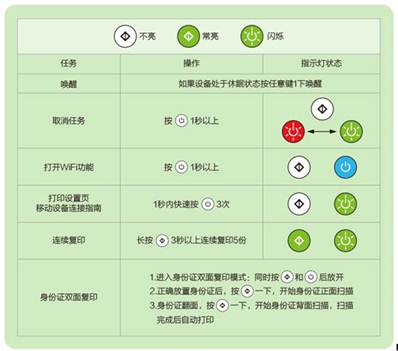

## 打印机





**lenovo联想小新打印：**

打印机

- 方法一：

如果无dp线，就用安卓手机连接lenovo的自己散发的热点，密码1-8；

在用苹果手机连接；

但是这种不太最好。

- 方法二：

主要就是用一个dp线连接；

用光盘驱动一步一步的走；

1.通过usb线使用打印机；

2.通过wi-fi使用打印机，设置好，就可以了

3.安装已入网的打印机；

选择打印机有点问题（需要数据线）


- 问题二：就是红色，代表没有粉了。需要添加，但是不行，这个需要专业的说明书；

- 问题三：远程打印，测试之后 ，不可以使用；


联想m7208w---不可以


**联熄M7400一体打印机考盒清零方法：**

针对联想新出的M7400一体打印机,联想M7400的粉盒244没有清零组件,在加完粉后依然提示更换新粉盒,通过联想客服也提示换新粉盒,要不然就是换齿轮组,这样的成本也太高了,用户和销售商都无法接受。

一个专门销售维修电脑、办公设备及耗材的,经测试,下面的方法绝对可以用于联想M7400加完粉清零。

执行以下操作都可以：

关掉机器→开机的同时按住功能按扭不松导开机→进入维修模式→翻到84功能项→按0K→

用下翻键找到《 PROCESS  CHECK》按0k 按扭→关机→正常开机屏幕上显示《PR0 CES CHECK》→

用下键找到T0 NER CART RESET→按确定后关机→重新按住功能按扭开机进入维修模式→找到84→按确定→找到CHECKER MOD0F→按确定→关机→一切0K→重新开机

加粉清零方法：

强制显影偏压方:随机粉仓加粉后,

插入硒鼓,通电后打开机器前盖,输入“清除/返回”键一下、“开始”键一下、“上箭头”11下,液晶屏显示11

的时候,按“OK”,关闭前盖。

## 参考文献

```

```


