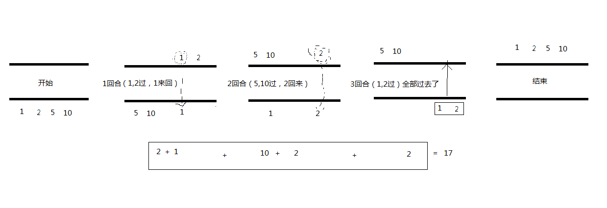

## 前记

>深度和广度都是我们需要的，既要纵向发展，又要横向发展，两者缺一不可。需要我们很努力的修行，厚积薄发，就是指的广度和深度得到充分的体现。

大学毕业，别的院系的同学，做了猎头，对于职业道路、事业无感的我，指了条路，去做计算机行业。

大学数学分析老师，也说道，做计算机的也需要学习数学，最后的做的出色的也就是从数学系出去的。

大学软件工程的朋友，认为对于本专业，浅一点是做web方向（码农），深一点就是做数学的。

初中好友，数学系毕业，大学热爱计算机，自学习了java、python，目前做机器学习，算法领域。


## 数学系

陈天奇（发明xgboost算法）


0. 为什么要深入数学的世界

1. 集合论：现代数学的共同基础
2. 分析：在极限基础上建立的宏伟大厦
   1. 微积分：分析的古典时代——从牛顿到柯西
   2. 实分析：在实数理论和测度理论上建立起现代分析
   3. 拓扑学：分析从实数轴推广到一般空间——现代分析的抽象基础
   4. 微分几何：流形上的分析——在拓扑空间上引入微分结构
3. 代数：一个抽象的世界
   1. 关于抽象代数
   2. 线性代数：“线性”的基础地位
   3. 泛函分析：从有限维向无限维迈进
   4. 继续往前：巴拿赫代数，调和分析，和李代数
4. 现代概率论：在现代分析基础上再生
   

**深入数学的世界**

我学习数学的目的，是要 想爬上巨人的肩膀，希望站在更高的高度，能把我自己研究的东西看得更深广一些。

我不否认现在广泛流行的Graphical Model是对复杂现象建模的有力工具，但是，我认为它不是panacea，并不能取代对于所研究的问题的深入的钻研。如果统计学习包治百病，那么很多 “下游”的学科也就没有存在的必要了。事实上，开始的时候，我也是和Vision中很多人一样，想着去做一个Graphical Model——我的导师指出，这样的做法只是重复一些标准的流程，并没有很大的价值。经过很长时间的反复，另外一个路径慢慢被确立下来——我们相信，一个 图像是通过大量“原子”的某种空间分布构成的，原子群的运动形成了动态的可视过程。微观意义下的单个原子运动，和宏观意义下的整体分布的变换存在着深刻的 联系——这需要我们去发掘。

在深入探索这个题目的过程中，遇到了很多很多的问题，如何描述一个一般的运动过程，如何建立一个稳定并且广泛适用的原子表达，如何刻画微观运动和宏观分布变换的联系，还有很多。在这个过程中，我发现了两个事情：

- 我原有的数学基础已经远远不能适应我对这些问题的深入研究。
- 在数学中，有很多思想和工具，是非常适合解决这些问题的，只是没有被很多的应用科学的研究者重视。

于是，我决心开始深入数学这个浩瀚大海，希望在我再次走出来的时候，我已经有了更强大的武器去面对这些问题的挑战。

我的游历并没有结束，我的视野相比于这个博大精深的世界的依旧显得非常狭窄。在这里，我只是说说，在我的眼中，数学如何一步步从初级向高级发展，更高级别的数学对于具体应用究竟有何好处。


> 1集合论：现代数学的共同基础

现代数学有数不清的分支，但是，它们都有一个共同的基础——集合论——因为 它，数学这个庞大的家族有个共同的语言。集合论中有一些最基本的概念：集合(set)，关系(relation)，函数(function)，等价 (equivalence)，是在其它数学分支的语言中几乎必然存在的。对于这些简单概念的理解，是进一步学些别的数学的基础。我相信，理工科大学生对于 这些都不会陌生。

不过，有一个很重要的东西就不见得那么家喻户晓了——那就是“选择公理” (Axiom of Choice)。这个公理的意思是“任意的一群非空集合，一定可以从每个集合中各拿出一个元素。”——似乎是显然得不能再显然的命题。不过，这个貌似平常 的公理却能演绎出一些比较奇怪的结论，比如巴拿赫-塔斯基分球定理——“一个球，能分成五个部分，对它们进行一系列刚性变换（平移旋转）后，能组合成两个**一样大小**的球”。正因为这些完全有悖常识的结论，导致数学界曾经在相当长时间里对于是否接受它有着激烈争论。现在，主流数学家对于它应该是基本接受的，因为很多数学分支的重要定理都依赖于它。在我们后面要回说到的学科里面，下面的定理依赖于选择公理：

1. 拓扑学：Baire Category Theorem
2. 实分析（测度理论）：Lebesgue 不可测集的存在性
3. 泛函分析四个主要定理：Hahn-Banach Extension Theorem, Banach-Steinhaus Theorem (Uniform boundedness principle), Open Mapping Theorem, Closed Graph Theorem

**在集合论的基础上，现代数学有两大家族：分析(Analysis)和代数(Algebra)。**至于其它的，比如几何和概率论，在古典数学时代，它们是和代数并列的，但是它们的现代版本则基本是建立在分析或者代数的基础上，因此从现代意义说，它们和分析与代数并不是平行的关系。

> 2分析：在极限基础上建立的宏伟大厦

> 2-1微积分：分析的古典时代——从牛顿到柯西

先说说分析(Analysis)吧，它是从微积分(Caculus)发展起来 的——这也是有些微积分教材名字叫“数学分析”的原因。不过，分析的范畴远不只是这些，我们在大学一年级学习的微积分只能算是对古典分析的入门。分析研究 的对象很多，包括导数(derivatives)，积分(integral)，微分方程(differential equation)，还有级数(infinite series)——这些基本的概念，在初等的微积分里面都有介绍。如果说有一个思想贯穿其中，那就是极限——这是整个分析（不仅仅是微积分）的灵魂。

一个很多人都听说过的故事，就是牛顿(Newton)和莱布尼茨 (Leibniz)关于微积分发明权的争论。事实上，在他们的时代，很多微积分的工具开始运用在科学和工程之中，但是，微积分的基础并没有真正建立。那个 长时间一直解释不清楚的“无穷小量”的幽灵，困扰了数学界一百多年的时间——这就是“第二次数学危机”。直到柯西用数列极限的观点重新建立了微积分的基本 概念，这门学科才开始有了一个比较坚实的基础。直到今天，整个分析的大厦还是建立在极限的基石之上。

柯西(Cauchy)为分析的发展提供了一种严密的语言，但是他并没有解决微 积分的全部问题。在19世纪的时候，分析的世界仍然有着一些挥之不去的乌云。而其中最重要的一个没有解决的是“函数是否可积的问题”。我们在现在的微积分 课本中学到的那种通过“无限分割区间，取矩阵面积和的极限”的积分，是大约在1850年由黎曼(Riemann)提出的，叫做黎曼积分。但是，什么函数存 在黎曼积分呢（黎曼可积）？数学家们很早就证明了，定义在闭区间内的连续函数是黎曼可积的。可是，这样的结果并不令人满意，工程师们需要对分段连续函数的 函数积分。

> 2-2实分析：在实数理论和测度理论上建立起现代分析

在19世纪中后期，不连续函数的可积性问题一直是分析的重要课题。对于定义在 闭区间上的黎曼积分的研究发现，可积性的关键在于“不连续的点足够少”。只有有限处不连续的函数是可积的，可是很多有数学家们构造出很多在无限处不连续的 可积函数。显然，在衡量点集大小的时候，有限和无限并不是一种合适的标准。在探讨“点集大小”这个问题的过程中，数学家发现实数轴——这个他们曾经以为已 经充分理解的东西——有着许多他们没有想到的特性。在极限思想的支持下，实数理论在这个时候被建立起来，它的标志是对实数完备性进行刻画的几条等价的定理 （确界定理，区间套定理，柯西收敛定理，Bolzano-Weierstrass Theorem和Heine-Borel Theorem等等）——这些定理明确表达出实数和有理数的根本区别：完备性（很不严格的说，就是对极限运算封闭）。随着对实数认识的深入，如何测量“点 集大小”的问题也取得了突破，勒贝格创造性地把关于集合的代数，和Outer content（就是“外测度”的一个雏形）的概念结合起来，建立了测度理论(Measure Theory)，并且进一步建立了以测度为基础的积分——勒贝格(Lebesgue Integral)。在这个新的积分概念的支持下，可积性问题变得一目了然。

上面说到的实数理论，测度理论和勒贝格积分，构成了我们现在称为实分析 (Real Analysis)的数学分支，有些书也叫实变函数论。对于应用科学来说，实分析似乎没有古典微积分那么“实用”——很难直接基于它得到什么算法。而且， 它要解决的某些“难题”——比如处处不连续的函数，或者处处连续而处处不可微的函数——在工程师的眼中，并不现实。但是，我认为，它并不是一种纯数学概念 游戏，它的现实意义在于为许多现代的应用数学分支提供坚实的基础。下面，我仅仅列举几条它的用处：

1. 黎曼可积的函数空间不是完备的，但是勒贝格可积的函数空间是完备的。简单的 说，一个黎曼可积的函数列收敛到的那个函数不一定是黎曼可积的，但是勒贝格可积的函数列必定收敛到一个勒贝格可积的函数。在泛函分析，还有逼近理论中，经 常需要讨论“函数的极限”，或者“函数的级数”，如果用黎曼积分的概念，这种讨论几乎不可想像。我们有时看一些paper中提到Lp函数空间，就是基于勒 贝格积分。
2. 勒贝格积分是傅立叶变换（这东西在工程中到处都是）的基础。很多关于信号处理的初等教材，可能绕过了勒贝格积分，直接讲点面对实用的东西而不谈它的数学基础，但是，对于深层次的研究问题——特别是希望在理论中能做一些工作——这并不是总能绕过去。
3. 在下面，我们还会看到，测度理论是现代概率论的基础。

> 2-3拓扑学：分析从实数轴推广到一般空间——现代分析的抽象基础

随着实数理论的建立，大家开始把极限和连续推广到更一般的地方的分析。事实 上，很多基于实数的概念和定理并不是实数特有的。很多特性可以抽象出来，推广到更一般的空间里面。对于实数轴的推广，促成了点集拓扑学(Point- set Topology)的建立。很多原来只存在于实数中的概念，被提取出来，进行一般性的讨论。在拓扑学里面，有4个C构成了它的核心：

1. Closed set（闭集合）。在现代的拓扑学的公理化体系中，开集和闭集是最基本的概念。一切从此引申。这两个概念是开区间和闭区间的推广，它们的根本地位，并不是 一开始就被认识到的。经过相当长的时间，人们才认识到：开集的概念是连续性的基础，而闭集对极限运算封闭——而极限正是分析的根基。
2. Continuous function （连续函数）。连续函数在微积分里面有个用epsilon-delta语言给出的定义，在拓扑学中它的定义是“开集的原像是开集的函数”。第二个定义和第 一个是等价的，只是用更抽象的语言进行了改写。我个人认为，它的第三个（等价）定义才从根本上揭示连续函数的本质——“连续函数是保持极限运算的函数” ——比如y是数列x1, x2, x3, … 的极限， 那么如果 f 是连续函数，那么 f(y) 就是 f(x1), f(x2), f(x3), …的极限。连续函数的重要性，可以从别的分支学科中进行类比。比如群论中，基础的运算是“乘法”，对于群，最重要的映射叫“同态映射”——保持“乘法”的 映射。在分析中，基础运算是“极限”，因此连续函数在分析中的地位，和同态映射在代数中的地位是相当的。
3. Connected set （连通集合）。比它略为窄一点的概念叫(Path connected)，就是集合中任意两点都存在连续路径相连——可能是一般人理解的概念。一般意义下的连通概念稍微抽象一些。在我看来，连通性有两个重 要的用场：一个是用于证明一般的中值定理(Intermediate Value Theorem)，还有就是代数拓扑，拓扑群论和李群论中讨论根本群(Fundamental Group)的阶。
4. Compact set（紧集）。Compactness似乎在初等微积分里面没有专门出现，不过有几条实数上的定理和它其实是有关系的。比如，“有界数列必然存在收敛子 列”——用compactness的语言来说就是——“实数空间中有界闭集是紧的”。它在拓扑学中的一般定义是一个听上去比较抽象的东西——“紧集的任意 开覆盖存在有限子覆盖”。这个定义在讨论拓扑学的定理时很方便，它在很多时候能帮助实现从无限到有限的转换。对于分析来说，用得更多的是它的另一种形式 ——“紧集中的数列必存在收敛子列”——它体现了分析中最重要的“极限”。Compactness在现代分析中运用极广，无法尽述。微积分中的两个重要定 理：极值定理(Extreme Value Theory)，和一致收敛定理(Uniform Convergence Theorem)就可以借助它推广到一般的形式。

从某种意义上说，点集拓扑学可以看成是关于“极限”的一般理论，它抽象于实数理论，它的概念成为几乎所有现代分析学科的通用语言，也是整个现代分析的根基所在。

> 2-4微分几何：流形上的分析——在拓扑空间上引入微分结构

拓扑学把极限的概念推广到一般的拓扑空间，但这不是故事的结束，而仅仅是开 始。在微积分里面，极限之后我们有微分，求导，积分。这些东西也可以推广到拓扑空间，在拓扑学的基础上建立起来——这就是微分几何。从教学上说，微分几何 的教材，有两种不同的类型，一种是建立在古典微机分的基础上的“古典微分几何”，主要是关于二维和三维空间中的一些几何量的计算，比如曲率。还有一种是建 立在现代拓扑学的基础上，这里姑且称为“现代微分几何”——它的核心概念就是“流形”(manifold)——就是在拓扑空间的基础上加了一套可以进行微 分运算的结构。现代微分几何是一门非常丰富的学科。比如一般流形上的微分的定义就比传统的微分丰富，我自己就见过三种从不同角度给出的等价定义——这一方 面让事情变得复杂一些，但是另外一个方面它给了同一个概念的不同理解，往往在解决问题时会引出不同的思路。除了推广微积分的概念以外，还引入了很多新概 念：tangent space, cotangent space, push forward, pull back, fibre bundle, flow, immersion, submersion 等等。

切线空间，切线空间，向前推动，向后拉，纤维束，流动，浸入式，浸入式;

近些年，流形在machine learning似乎相当时髦。但是，坦率地说，要弄懂一些基本的流形算法， 甚至“创造”一些流形算法，并不需要多少微分几何的基础。对我的研究来说，微分几何最重要的应用就是建立在它之上的另外一个分支：李群和李代数——这是数 学中两大家族分析和代数的一个漂亮的联姻。分析和代数的另外一处重要的结合则是泛函分析，以及在其基础上的调和分析。

> 3代数：一个抽象的世界

> 3-1关于抽象代数

回过头来，再说说另一个大家族——代数。

如果说**古典微积分是分析的入门**，那么现代代数的入门点则是两个部分：线性代数(linear algebra)和基础的抽象代数(abstract algebra)——据说国内一些教材称之为 近世代数 。

代数——名称上研究的似乎是数，在我看来，主要研究的是运算规则。一门代数， 其实都是从某种具体的运算体系中抽象出一些基本规则，建立一个公理体系，然后在这基础上进行研究。一个集合再加上一套运算规则，就构成一个代数结构。在主 要的代数结构中，最简单的是群(Group)——它只有一种符合结合率的可逆运算，通常叫“乘法”。如果，这种运算也符合交换率，那么就叫阿贝尔群 (Abelian Group)。如果有两种运算，一种叫加法，满足交换率和结合率，一种叫乘法，满足结合率，它们之间满足分配率，这种丰富一点的结构叫做环(Ring)， 如果环上的乘法满足交换率，就叫可交换环(Commutative Ring)。如果，一个环的加法和乘法具有了所有的良好性质，那么就成为一个域(Field)。基于域，我们可以建立一种新的结构，能进行加法和数乘，就 构成了线性代数(Linear algebra)。

代数的好处在于，它只关心运算规则的演绎，而不管参与运算的对象。只要定义恰 当，完全可以让一只猫乘一只狗得到一头猪:-)。基于抽象运算规则得到的所有定理完全可以运用于上面说的猫狗乘法。当然，在实际运用中，我们还是希望用它 干点有意义的事情。学过抽象代数的都知道，基于几条最简单的规则，比如结合律，就能导出非常多的重要结论——这些结论可以应用到一切满足这些简单规则的地 方——这是代数的威力所在，我们不再需要为每一个具体领域重新建立这么多的定理。

抽象代数有在一些基础定理的基础上，进一步的研究往往分为两个流派：研究有限 的离散代数结构（比如有限群和有限域），这部分内容通常用于数论，编码，和整数方程这些地方；另外一个流派是研究连续的代数结构，通常和拓扑与分析联系在 一起（比如拓扑群，李群）。我在学习中的focus主要是后者。

> 3-2线性代数：“线性”的基础地位

对于做Learning, vision, optimization或者statistics的人来说，接触最多的莫过于线性代数——这也是我们在大学低年级就开始学习的。线性代数，包括建立在它 基础上的各种学科，最核心的两个概念是向量空间和线性变换。线性变换在线性代数中的地位，和连续函数在分析中的地位，或者同态映射在群论中的地位是一样的 ——它是保持基础运算（加法和数乘）的映射。

在learning中有这样的一种倾向——鄙视线性算法，标榜非线性。也许在 很多场合下面，我们需要非线性来描述复杂的现实世界，但是无论什么时候，线性都是具有根本地位的。没有线性的基础，就不可能存在所谓的非线性推广。我们常 用的非线性化的方法包括流形和kernelization，这两者都需要在某个阶段回归线性。流形需要在每个局部建立和线性空间的映射，通过把许多局部线 性空间连接起来形成非线性；而kernerlization则是通过置换内积结构把原线性空间“非线性”地映射到另外一个线性空间，再进行线性空间中所能 进行的操作。而在分析领域，线性的运算更是无处不在，微分，积分，傅立叶变换，拉普拉斯变换，还有统计中的均值，通通都是线性的。

> 3-3泛函分析：从有限维向无限维迈进

在大学中学习的线性代数，它的简单主要因为它是在有限维空间进行的，因为有 限，我们无须借助于太多的分析手段。但是，有限维空间并不能有效地表达我们的世界——最重要的，函数构成了线性空间，可是它是无限维的。对函数进行的最重 要的运算都在无限维空间进行，比如傅立叶变换和小波分析。这表明了，为了研究函数（或者说连续信号），我们需要打破有限维空间的束缚，走入无限维的函数空 间——这里面的第一步，就是泛函分析。

泛函分析(Functional Analysis)是研究的是一般的线性空间，包括有限维和无限维，但是很多东西在有限维下显得很trivial，真正的困难往往在无限维的时候出现。在 泛函分析中，空间中的元素还是叫向量，但是线性变换通常会叫作“算子”(operator)。除了加法和数乘，这里进一步加入了一些运算，比如加入范数去 表达“向量的长度”或者“元素的距离”，这样的空间叫做“赋范线性空间”(normed space)，再进一步的，可以加入内积运算，这样的空间叫“内积空间”(Inner product space)。

大家发现，当进入无限维的时间时，很多老的观念不再适用了，一切都需要重新审视。

1. 所有的有限维空间都是完备的（柯西序列收敛），很多无限维空间却是不完备的（比如闭区间上的连续函数）。在这里，完备的空间有特殊的名称：完备的赋范空间叫巴拿赫空间(Banach space)，完备的内积空间叫希尔伯特空间(Hilbert space)。
2. 在有限维空间中空间和它的对偶空间的是完全同构的，而在无限维空间中，它们存在微妙的差别。
3. 在有限维空间中，所有线性变换（矩阵）都是有界变换，而在无限维，很多算子是无界的(unbounded)，最重要的一个例子是给函数求导。
4. 在有限维空间中，一切有界闭集都是紧的，比如单位球。而在所有的无限维空间中，单位球都不是紧的——也就是说，可以在单位球内撒入无限个点，而不出现一个极限点。
5. 在有限维空间中，线性变换（矩阵）的谱相当于全部的特征值，在无限维空间 中，算子的谱的结构比这个复杂得多，除了特征值组成的点谱(point spectrum)，还有approximate point spectrum和residual spectrum。虽然复杂，但是，也更为有趣。由此形成了一个相当丰富的分支——算子谱论(Spectrum theory)。
6. 在有限维空间中，任何一点对任何一个子空间总存在投影，而在无限维空间中， 这就不一定了，具有这种良好特性的子空间有个专门的名称切比雪夫空间(Chebyshev space)。这个概念是现代逼近理论的基础(approximation theory)。函数空间的逼近理论在Learning中应该有着非常重要的作用，但是现在看到的运用现代逼近理论的文章并不多。

> 3-4继续往前：巴拿赫代数，调和分析，和李代数

基本的泛函分析继续往前走，有两个重要的方向。第一个是巴拿赫代数 (Banach Algebra)，它就是在巴拿赫空间（完备的内积空间）的基础上引入乘法（这不同于数乘）。比如矩阵——它除了加法和数乘，还能做乘法——这就构成了一 个巴拿赫代数。除此以外，值域完备的有界算子，平方可积函数，都能构成巴拿赫代数。巴拿赫代数是泛函分析的抽象，很多对于有界算子导出的结论，还有算子谱 论中的许多定理，它们不仅仅对算子适用，它们其实可以从一般的巴拿赫代数中得到，并且应用在算子以外的地方。巴拿赫代数让你站在更高的高度看待泛函分析中 的结论，但是，我对它在实际问题中能比泛函分析能多带来什么东西还有待思考。

最能把泛函分析和实际问题在一起的另一个重要方向是调和分析 (Harmonic Analysis)。我在这里列举它的两个个子领域，傅立叶分析和小波分析，我想这已经能说明它的实际价值。它研究的最核心的问题就是怎么用基函数去逼近 和构造一个函数。它研究的是函数空间的问题，不可避免的必须以泛函分析为基础。除了傅立叶和小波，调和分析还研究一些很有用的函数空间，比如Hardy space，Sobolev space，这些空间有很多很好的性质，在工程中和物理学中都有很重要的应用。对于vision来说，调和分析在信号的表达，图像的构造，都是非常有用的 工具。

当分析和线性代数走在一起，产生了泛函分析和调和分析；当分析和群论走在一 起，我们就有了李群(Lie Group)和李代数(Lie Algebra)。它们给连续群上的元素赋予了代数结构。我一直认为这是一门非常漂亮的数学：在一个体系中，拓扑，微分和代数走到了一起。在一定条件下， 通过李群和李代数的联系，它让几何变换的结合变成了线性运算，让子群化为线性子空间，这样就为Learning中许多重要的模型和算法的引入到对几何运动 的建模创造了必要的条件。因此，我们相信李群和李代数对于vision有着重要意义，只不过学习它的道路可能会很艰辛，在它之前需要学习很多别的数学。

> 4现代概率论：在现代分析基础上再生

最后，再简单说说很多Learning的研究者特别关心的数学分支：概率论。 

自从Kolmogorov在上世纪30年代把测度引入概率论以来，测度理论就成为现代概率论的基础。在这里，概率定义为测度，随机变量定义为可测函数，条 件随机变量定义为可测函数在某个函数空间的投影，均值则是可测函数对于概率测度的积分。值得注意的是，很多的现代观点，开始以泛函分析的思路看待概率论的 基础概念，随机变量构成了一个向量空间，而带符号概率测度则构成了它的对偶空间，其中一方施加于对方就形成均值。角度虽然不一样，不过这两种方式殊途同 归，形成的基础是等价的。

在现代概率论的基础上，许多传统的分支得到了极大丰富，最有代表性的包括鞅论 (Martingale)——由研究赌博引发的理论，现在主要用于金融（这里可以看出赌博和金融的理论联系，:-P），布朗运动(Brownian Motion)——连续随机过程的基础，以及在此基础上建立的随机分析(Stochastic Calculus)，包括随机积分（对随机过程的路径进行积分，其中比较有代表性的叫伊藤积分(Ito Integral)），和随机微分方程。对于连续几何运用建立概率模型以及对分布的变换的研究离不开这些方面的知识。


## 数学系分类


> 信息与计算科学


<u>交换代数方向：（数学科学学院）---  研究生</u>

- 代数基础		 
- 微分流形
- 数值计算
- 概率论基础
- 交换代数
- 图论
- 代数基础2
- 同调代数导引
- 中国特色社会主义理论与实践研究
- 自然辨证法
- 硕士基础英语


|信息与计算科学专业|数学与应用数学|没学习过的|
|-|-|-|
| 解析几何|解析几何|统计初步|
| 常微分方程|常微分方程|信息技术应用|
|复变函数|近世代数|数据结构|
| 运筹学（选修）|数学软件（选修）|复变函数|
| 经济计量分析与EViews 应用。 （试点）||微分几何|
| 离散数学 |离散数学|数值代数（选修）|
| 高等代数|高等代数|几何基础|
| 数值分析(选修)||实变函数|
| 数理经济学||偏微分方程|
|数学分析|数学分析|拓扑学|
|概率论与数理统计|概率论与数理统计|概率论|
|数学建模|数学建模|数学模型|
|多元统计分析与spss应用  2014-07（统计学）||组合数学（选修）|
|预测与决策                    2014-01||小波分析（选修）|
|时间序列分析                   2014-01||模糊分析（选修）|
|办公自动化软件及高级应用|||
|大学计算机基础（理工科类)|||
|c/c++程序设计|||
|数据库系统原理|||
|Matlab程序设计（双语）|||
||||


1. <u>数学课程</u>(本科阶段)

- 解析几何
- 常微分方程
- 复变函数
- 运筹学
- 经济计量分析与EViews 应用。 （试点）
- 离散数学
- 高等代数（上）
- 高等代数（下）
- 数值分析
- 数理经济学
- 数学分析（上）
- 数学分析（中）
- 数学分析（下）
- 概率论与数理统计
- 数学分析选讲1
- 数学建模
- 多元统计分析与spss应用  2014-07（统计学）
- 预测与决策                    2014-01
- 时间序列分析                   2014-01

- 办公自动化软件及高级应用
- 大学计算机基础（理工科类）
- c/c++程序设计
- 数据库系统原理
- Matlab程序设计（双语）


2. <u>会计学</u>

- 课程实习（2）
- 专业应用实习
- 专业综合设计
- 专业导论
- 专业认识实习
- 课程实习（1）
- 大学创业实习基础

- 俄罗斯民族文化与国情
- 大学英语（1）
- 大学英语（2）
- 大学英语（3）
- 大学英语（4）
- 物理实验（下）
- 物理实验（上）
- 管理学原理
- 税务会记基础
- cpa税务实务
- cpa会计实务
- 会记学
- 成本会计
- 审计学
- 常用财务软件实训
- cpa审计学实务
- 中级财务会计
- **高级财务会计**
- cpa经济法实务
- 财务管理
- 微观经济学
- 宏观经济学
- 金融学
- 物流包裹概论
- 创业教育

3. 选修课程

- 体育（1）
- 体育（2）
- 体育（3）
- 体育（4）
- 健康教育
- 军事训练
- 生命科学概论
- 舞蹈鉴赏
- 军事理论
- 中国近代史纲要
- 毛泽东思想金额中国特色社会主义理论体系概论实践
- 形势与政策教育
- 形势与政策教育
- 形势与政策教育
- 形势与政策教育
- 思想道德修养与法律基础
- 马克思主义基础原理概论
- 毛泽东思想金额中国特色社会主义理论体系概论


## 数学系专业共有3个细分专业

分别为数学与应用数学专业、信息与计算科学专业、数理基础科学专业。

数学类专业一览表

| 专业代码 | 数学类         |
| -------- | -------------- |
| 70101    | 数学与应用数学 |
| 70102    | 信息与计算科学 |
| 070103T  | 数理基础科学   |


### 数学与应用数学专业：

数学与应用数学专业培养掌握数学科学的基本理论与基本方法，具备运用数学知识、使用计算机解决实际问题的能力，受到科学研究的初步训练，能在科技、教育和经济部门从事研究、教学工作或在生产经营及管理部门从事实际应用、开发研究和管理工作的高级专门人才。


- 概率论与数理统计（大二下）

- 数学实验与数学模型

- 大学英语4

- 数学分析4

- 数学分析

- 毛泽东思想和中国特色社会主义理论

- 微观经济学

  

- 高等数学（2）上（大三上）

- 古代汉语

- 离散数学

- 数学软件

- 会计学原理

- 计量经济学

- 宏观经济学

- 保险精算（大三下）

- 数学分析

- 财务管理

- 就业指导

- 财政与税收

- 高等代数选讲

- 金融市场学（大四上）

- 投资学

- 国际金融理论

- 高级英语会话

  

  

  

  

  

  

  

  

### 信息与计算科学专业：

信息与计算科学专业Information and Computing Science (原名：计算数学,1987年更名为计算数学及其应用软件，1998年教育部将其更名为信息与计算科学)信息与计算科学专业是以信息领域为背景。数学与信息，计算机管理相结合的计算机科学与技术类专业。该专业培养的学生具有良好的数学基础，能熟练地使用计算机,初步具备在信息与计算机科学领域的某个方向上从事科学研究，解决实际问题，设计开发有关计算机软件的能力。

本专业的课程体系和知识结构体现了在扎实的数学基础之上，合理架构信息科学与计算机科学的专业基础理论。通过信息论、科学计算、运筹学等方面的基础知识教育和建立数学模型、数学实践课、专业实习各环节的训练，着重培养学生解决科学计算、软件开发和设计、信息处理与编码等实际问题的能力，培养能胜任信息处理、科学与工程计算部门工作的高级专门人才。

### 数理基础科学专业：

数理基础科学专业强调打好数学和物理学的基础的同时，培养学生对数学的高度抽象思维能力，同时具有现代物理学的形象思维和实验技能，由于数理基础科学专业的学生具备较扎实的数学和物理学的专业知识。

该专业主要培养能从事数学、物理等基础科学教学和科研的有发展潜力的优秀人才，尤其是在数学、物理上具有创新的能力的人才，同时也为对数理基础要求高的其它学科培养有良好的数理基础的新型人才。

## 软件测试


> ​	软件测试中，最常听到“黑盒测试”与“白盒测试”，它们是软件测试中最基本的测试方法。


> **1-黑盒测试：**

也称功能测试、数据驱动测试，它将被测软件看作一个打不开的黑盒，主要根据功能需求设计测试用例，进行测试。


概念：黑盒测试是从一种从软件外部对软件实施的测试，也称功能测试或基于规格说明的测试。其基本观点是：任何程序都可以看作是从输入定义域到输出值域的映射，这种观点将被测程序看作一个打不开的黑盒，黑盒里面的内容(实现)是完全不知道的，只知道软件要做什么。因无法看到盒子中的内容，所以不知道软件是如何实现的，也不关心黑盒里面的结构，只关心软件的输入数据和输出结果。


　　检测软件功能能否按照需求规格说明书的规定正常工作，是否有功能遗漏；

　　检测是否有人机交互错误，是否有数据结构和外部数据库访问错误，是否能恰当地接收数据并保持外部信息（如数据库或文件）等的完整性；

　　检测行为、性能等特性是否满足要求等； 检测程序初始化和终止方面的错误等。


　　优点：

　　① 与软件具体实现无关，如果软件实现发生了变化，测试用例仍可用；

　　② 设计黑盒测试用例可以和软件实现同时进行，因此可压缩项目总开发时间。


　**黑盒测试常用方法**

　　等价类划分

　　边界值分析

　　因果图

　　决策表分析


　**等价类划分**


　　完全不考虑程序的内部结构，只根据程序规格说明书对输入范围进行划分，把所有可能的输入数据，即程序输入域划分为若干个互不相交的子集，称为等价类，然后从每个等价类中选取少数具有代表性的数据作为测试用例，进行测试。

　　划分原则：区间、数值、数值集合、限制条件或规则、细分等价类


　**边界值分析**

　　边界值和等价类密切相关，输入等价类和输出等价类的边界是要着重测试的边界情况。在等价类的划分过程中产生了许多等价类边界。边界是最容易出错的地方，所以，从等价类中选取测试数据时应该关注边界值。

　　在等价类划分基础上进行边界值分析测试的基本思想是，选取正好等于、刚刚大于或刚刚小于等价类边界的值作为测试数据，而不是选取等价类中的典型值或任意值做为测试数据。

　　对于一个n变量的程序，边界值分析测试会产生4n+1个测试用例。


　**因果图**

　　（1）确定软件规格中的原因和结果。分析规格说明中哪些是原因（即输入条件或输入条件的等价类），哪些是结果（即输出条件），并给每个原因和结果赋予一个标识符。

　　（2）确定原因和结果之间的逻辑关系。分析软件规格说明中的语义，找出原因与结果之间、原因与原因之间对应的关系，根据这些关系画出因果图。

　　（3）确定因果图中的各个约束。由于语法或环境的限制，有些原因与原因之间、原因与结果之间的组合情况不可能出现。为表明这些特殊情况，在因果图上用一些记号表明约束或限制条件。

　　（4）把因果图转换为决策表。

　　（5）根据决策表设计测试用例。


**决策表分析**

　　在所有的黑盒测试方法中，基于决策表的测试是最严格，最具有逻辑性的测试方法。

　　决策表是把作为条件的所有输入的各种组合值以及对应输出值都罗列出来而形成的表格。

　　它能够将复杂的问题按照各种可能的情况全部列举出来，简明并避免遗漏。因此，利用决策表能够设计出完整的测试用例集合。


　**步骤：**

　　（1）列出所有的条件桩和动作桩。

　　（2）确定规则的个数。

　　（3）填入条件项。

　　（4）填入动作项，得到初始决策表。

　　（5）简化决策表，合并相似规则。

　　对于n个条件的决策表，相应有2n个规则

　　决策表合并原则：即若表中有两条以上规则具有相同的动作，并且在条件项之间存在极为相似的关系，便可以合并。


> 　　**2白盒测试：**

　　也称结构测试或逻辑驱动测试，它是知道产品内部工作过程，可通过测试来检测产品内部动作是否按照规格说明书的规定正常进行，按照程序内部的结构测试程序，检验程序中的每条通路是否都有能按预定要求正确工作，而不顾它的功能。


　**白盒测试常用方法**

　　基本覆盖标准：逻辑驱动、循环、基路测试等，主要用于软件验证。

　　“白盒”法全面了解程序内部逻辑结构、对所有逻辑路径进行测试。

　　“白盒”法是穷举路径测试。在使用这一方案时，测试者必须检查程序的内部结构，从检查程序的逻辑着手，得出测试数据。贯穿程序的独立路径数是天文数字。但即使每条路径都测试了仍然可能有错误。

　　原因：

　　第一，穷举路径测试决不能查出程序违反了设计规范，即程序本身是个错误的程序。

　　第二，穷举路径测试不可能查出程序中因遗漏路径而出错。

　　第三，穷举路径测试可能发现不了一些与数据相关的错误。


　　**白盒测试逻辑驱动方法**

　　语句覆盖

　　判定覆盖

　　条件覆盖

　　判定/条件覆盖

　　条件组合覆盖

　　路径覆盖

## 思考题

	>1楼到n楼的每层电梯门口都放着一颗钻石，钻石大小不一。你乘坐电梯从1楼到n楼，每层楼电梯门都会打开一次，只能拿一次钻石，问怎样才能拿到「最大」的一颗？


```
在概率及博弈论上，秘书问题（Secretary problem），类似的名称有相亲问题、止步问题、见好就收问题、苏丹的嫁妆问题、挑剔的求婚者问题等，内容是这样的：要聘请一名秘书，有 n 个应聘者。每次面试一人，面试后就要及时决定是否聘他，如果当时决定不聘他，他便不会回来。面试后总能清楚了解应聘者的合适程度，并能和之前的每个人做比较。问什么样的策略，才使最佳人选被选中的概率最大。


这其实是一个哲学问题。
有一天，柏拉图问他的老师什么是爱情，他的老师就叫他先到麦田里， 摘一棵全麦田里最大最金黄的的麦穗。期间只能摘一次，并且只可以向前走， 不能回头。柏拉图于是照着老师的说话做。结果，他两手空空的走出麦田。 老师问他为什么摘不到，他说：“因为只能摘一次，又不能走回头路， 其间即使见到一棵又大又金黄的，因为不知前面是否有更好，所以没有摘； 走到前面时，又发觉总不及之前见到的好，原来麦田里最大最金黄的麦穗， 早就错过了；于是，我便什么也摘不到。”老师说：“这就是爱情。” 

之后又有一天，柏拉图问他的老师什么是婚姻，他的老师就叫他先到树林里， 砍下一棵全树林最大最茂盛、最适合放在家作圣诞树的树。其间同样只能摘一次，以及同样只可以向前走，不能回头。柏拉图于是照着老师的说话做。 今次，他带了一棵普普通通，不是很茂盛，亦不算太差的树回来。老师问他， 怎么带这棵普普通通的树回来，他说：“有了上一次经验，当我走到大半路程 还两手空空时，看到这棵树也不太差，便砍下来，免得错过了后， 最后又什么也带不出来。”老师：“这就是婚姻。”


```

解决恋爱和婚姻的问题，就和解决数学问题一样了。

只要能列出一个对于配偶价值估计，然后用楼上的37%法则来算就可以了。


> 补充 37%定理
>
> 从数学模型上说，在男生总数 n 已知的情况下，当 k 等于何值时，按上述策略选中最佳男生的概率最大？
>
> 就是先拒掉前面 k 个人，不管这些人有多好；然后从第 k+1 个人开始，一旦看到比之前所有人都要好的人，就毫不犹豫地选择他。不难看出，k 的取值很讲究，太小了达不到试的效果，太大了又会导致真正可选的余地不多了。
>
> 

$$P(k)$$= $$ \sum_{i=k+1}^n \frac{1}{n}*\frac{k}{i-1} $$ = $$\frac{k}{n}\sum_{i=k+1}^n\frac{1}{i-1}$$ 

用 x 来表示 k/n 的值，并且假设 n 充分大，则上述公式可以写成：

P(K) = $$x\int_x^1\frac{1}{t}dt = -x\times ln{x}$$

对 -x · ln x 求导，并令这个导数为 0，可以解出 x 的最优值，它就是欧拉研究的神秘常数的倒数—— 1/e = 0.3679!

这个问题由数学家 Merrill M. Flood 在 1949 首次提出，这个问题被他取名为“未婚妻问题”。这个问题的精妙之处在于，在微积分界叱咤风云的自然底数 e，竟也出人意料地出现在了这个看似与它毫不相关的问题中.你是那 37% 的人⋯⋯


> ​	一个人，花8元买只鸡。9元卖出去。10元买回来、11元在卖出去。请问他赚了多钱？ 

```
这是IBM面试时的题目，有四种算法：
1、9-8=1，11-10=1，1+1=2，所以最后赚2元。 （数学求解）
2、最初只有8块钱，最后你有11块了，所以是赚3块； (错的)
3、第一次买卖，主人公损失8块，获得一只鸡，第二次买卖；主人公获得9块，
损失一只鸡；第三次买卖，主人公损失10块，获得一只鸡；第四买卖，主人公
获得11块，损失一只鸡
所以 整个产生的GDP（国内生产总值）是8＋9＋10＋11＝38元＋4只鸡

4、整个事件有3次交易，我门来看看具体是哪3次？
第一次交易：8元买进，9元卖出，利润1元；
第二次交易：9元卖出，10元买进，利润-1元；
第三次交易：10元买进，11元卖出利润1元；
整个过程：1-1+1=1元
所以分析得知：这个人是个傻子，因为后两次交易等于白干了。


经测试，企业认为：
回答利润是2元的肯定是面试失败者；
回答3元的更为愚蠢，因为自己什么是追加成本都不知道，肯定也是失败；
回答1元者，恭喜你，不属于傻子范围；
结果是：本来可以直接赚3元的，经过他3次交易后总利润变成1元了。
所以正确答案是：-2元！
回答-2元者，恭喜！面试成功！！！


正常老百姓选择2~~~8快钱的成本~~第一次买9快利润就是一快钱~~但是又花10快买进来那么减去利润一快加一快钱成本就是成本9快钱~~在11买出去那就是2快的利润了
8(成本）+1(利润）=9
9(成本和利润）+1（增加的成本）=10
10成本利润和增加的成本）-1利润=9（成本）
11（最后成交价）-9（成本）=2利润，这样的投资可能失败~~~
奸商那就选择1~~~~前面赚一后面就倒贴一万买回了~~就那银行的钱来大比喻．~你拿了银行的8万买了只鸡~~买出去9万赚一万．~你多少你又要问银行拿一万重新买回~那你是亏了一万~~因为你就增加了一万的投资~本是八万的鸡你变成了十万~~因为赚的一万变成9万买你鸡的人了~~鸡还是你的鸡~~你就赚了一万~~~那赚的一万你花十万从9万那买来了~~本来是赚了一万~打个转你倒贴一万又买回~~虽然说你后面赚了一万~~但是你倒贴的一万是谁的钱~~自己的成本啊．
8万投资盈利一万．
10万的投资买了自己买出去的9万亏了一万
10的投资11万的卖出盈利了一万~~1-1+1=1啊~~这个才是商人的算法~~~
正确的答案应该是-2
因为他不买回的话~~直接经济利益可以答到3快~~
可是一个人的买出卖进造成利润是1~~所以三场交易的总利润-2增加的成本可不能算哦！
```


> ​	
>
> 师徒四人西天取经，途中必需跨过一座桥，四个人从桥的同一端出发，你得帮助他们到达另一端，天色很暗而他们只有一支手电筒，一次同时最多可以有两个人一起经过桥。而过桥的时候必须持有手电筒，所以就得有人把手电筒带来带去，来回桥两端。手电筒不能用丢的方式来传递，四个人的步行速度各不同，若两人同行则以较慢者的速度为准，大师兄需花1分钟过桥，二师兄需花2分钟过桥，三师兄需花5分钟过桥，师傅需花10分钟过桥。请问他们最短在多少分钟内过桥？

1、大师兄和二师兄过桥，算二师兄的时间也就是2分钟

2、大师兄独自拿手电回来 1分钟 

3、三师弟和师傅那手电过桥，算师傅的时间也就是10分钟 

4、二师弟拿手电回来 2分钟  （2和4可以互换）

5、最后大师兄和二师弟过桥 2分钟 

总共17分钟





> ​	中庸无为
>
> 【解释】：指不偏不倚，折中调和的处世态度。
>
> ​	中庸：不偏不倚；有自己的事业
>
> ​	无为：无所为，才能有所为。然后就可以说 谋事在人，成事在天。
>
> 
>
> 王健林：比起首富这个目标，一个亿不是小目标吗？？？
>
> 刘强东：和我老婆差不多好看的妹子我见得太多了，各有各的美，长得差不多分不清谁好看。
>
> 所以我感觉自己脸盲了，不如关注内涵。我是脸盲不是审美有问题不是瞎，谢谢。
>
> 马云：我对钱没有兴趣，我不缺钱。缺钱的时候有钱是快乐，不缺钱的时候拿钱快乐啥呀。
>
> 马化腾：房子大了多少倍，活动区域就大了一点点而已。确实有点装过了，都是楼上带节奏。
>
> 
>
> 我记得新上海滩中有一个镜头，冯程程他爸，在写字。四个大字，无欲则刚，写完后补了一句，有了才能无欲。
>
> 马云现在有了，所以他无欲了。
>
> 在烂大街的马洛斯图表上，马云现在追求的不是物资需求，而是精神需求，与精神需求与之对应的现实目标。


“**真理只有一个，圣者们用各种名字称呼它。**――《吠陀》”

2、无为

​		 作为中国道家文化核心思想有五层重要哲学意义：
　　第一层意义：遵循事物的自然趋势而为，不争，即是无为。所以老子说：“圣人之治，虚其心，实其腹，弱其志，强其骨”。原来要百姓休养生息，让百姓填满肚子，强壮骨骼，专心做事，能够不争安乐啊。
　　第二层意义：无为就是能放的下，有所不为。只有有所不为才能聚集精力有所作为，这就是道家的执一、贞一、守一的思想。
　　第三层意义：无是甲骨象形字与大篆金文中的“乐舞”，为是研究学习。要人们学而知其乐。
　　无为境界是谦卑者修行的境界；是顺应万物，以顺其和。自然和谐的语言与行为表达，是通往成功的必由之路；是圣人教化世人守弱、不争、快乐，达到“无为”。
　　第四层意义：道家主张“顺其自然”，认为法律（法和法律有不同；法好比物理，而法律则是人为）是对人类的束缚，要全部舍弃；法家则主张要用法律去惩治人，认为人类本性顽劣，要用权威去治天下。
　　第五层意义：无为，道家的核心概念之一。


3、心性

佛家要旨，直指心性。佛门四观法，观身不净，观念是苦，观心无常，观法无我。佛门讲的心不是分别心，不是你那自怜自爱之心，而是隐藏于你内心中最根本的那个心性。

《西藏生死书》中有具体描述，若了断分别心，做到不动不分别，则万物皆我，我观众生如观己身。乃知众生皆苦，始发宏愿心，慈悲心，精诚心。以心修性，而后能断一切苦厄，远离颠倒是非，无有恐怖。


因此三家汇总，可为一言。修身、修行、修心、修性。将你的所知融入所行，不再随镜流离，不再随波逐流。而是在心中竖起信仰之根，以此信仰见证此生，亦用此生见证此信。


**吠陀**（[梵语](https://zh.wikipedia.org/wiki/梵語)：वेद，转写：Veda，又译为**韦达经**、**韦陀经**、**围陀经**等），是[婆罗门教](https://zh.wikipedia.org/wiki/婆罗门教)和现代的[印度教](https://zh.wikipedia.org/wiki/印度教)最重要和最根本的[经典](https://zh.wikipedia.org/wiki/經典)。“吠陀”意思是“知识”、“启示”。 广义的“吠陀”文献包括很多种性质不同的经典，即吠陀本集、[梵书](https://zh.wikipedia.org/wiki/梵书)、[森林书](https://zh.wikipedia.org/wiki/森林书)和[奥义书](https://zh.wikipedia.org/wiki/奥义书)。


## 参考文献

```
陈天奇的github
https://tqchen.com/
https://blog.csdn.net/hemeinvyiqiluoben/article/details/87870656
分布式（深度）机器学习社区
https://github.com/dmlc/
陈天奇-Google学术搜索引用
https://scholar.google.com/citations?user=7nlvOMQAAAAJ&hl=en


MIT的IT牛人谈数学体系: 集合论、数学分析、拓扑学（点集拓扑学）- 麻省理工大学
https://www.cnblogs.com/hugetong/p/9676025.html

软件测试中的黑盒与白盒测试
https://zhuanlan.zhihu.com/p/39352619
林大华-博士-助理教授-信息工程系-香港中文大学
http://dahua.me/

秘书问题
https://zh.wikipedia.org/wiki/%E7%A7%98%E6%9B%B8%E5%95%8F%E9%A1%8C

拒绝掉前面37%的人
https://www.guokr.com/article/6768/

牛客网 -师徒四人过河
https://www.nowcoder.com/questionTerminal/3faec855b895480c9fecf31d12e947e0

完整脚本严格模式语法
https://developer.mozilla.org/en-US/docs/Web/JavaScript/Reference/Strict_mode
```


```
// Whole-script strict mode syntax
'use strict';
var v = "Hi! I'm a strict mode script!";
```

