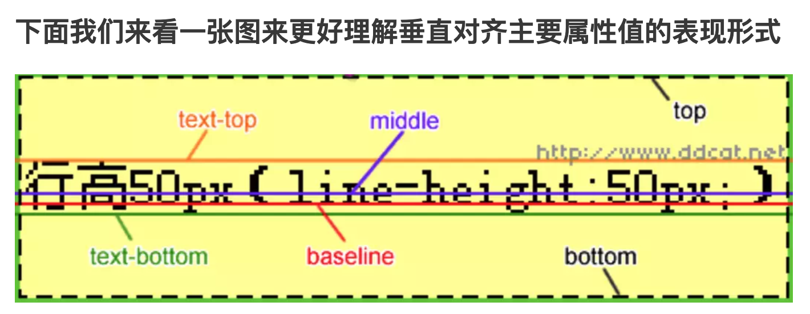

## css

>
>
>**CSS 历史大事记**
>
>1994 年，Hkon Wium Lie 最初提出了 CSS 的想法，联合当时正在设计 Argo 的浏览器的Bert Bos，他们决定一起合作设计 CSS，于是创造了 CSS 的最初版本。
>
>紧接着，他们在芝加哥的Mosaic and the Web 大会上第一次正式提出了 CSS 的建议，1995 年他们一起再次展示了这个建议。当时 W3C 刚刚建立，W3C 对 CSS 很感兴趣，为此专门组织了一次讨论会。
>
>1996 年 12 月，W3C 推出了 CSS 规范的第一版本。
>
>1997 年，W3C 颁布 CSS1.0 版本 ，CSS1.0 较全面地规定了文档的显示样式，可分为选择器、样式属性、伪类 / 对象几个部分。
>
>这一规范立即引起了各方的关注，随即微软和网景公司的浏览器均能支持 CSS1.0，这为 CSS 的发展奠定了基础。
>
>1998 年，W3C 发布了 CSS 的第二个版本，目前的主流浏览器都采用这标准。
>
>CSS2 的规范是基于 CSS1 设计的，包含了 CSS1 所有的功能，并扩充和改进了很多更加强大的属性。包括选择器、位置模型、布局、表格样式、媒体类型、伪类、光标样式。
>
>2005 年 12 月，W3C 开始 CSS3 标准的制定，到目前为止该标准还没有最终定稿。
>
>**IE6，前端工程师的痛**
>
>2001 年，微软发布了 IE6，在 Windows 普及的年代 IE6 浏览器占据了高达 80% 的市场，这对 CSS 的标准推广起着重要作用。
>
>因为 IE6 的用户量大，开发者们就选择了以大众为准，许多开发者竭尽全力把 IE6 下的页面做好，甚至一些开发者的口号很响“Only IE6”。
>
>这样导致许多页面根本不是 W3C 标准，因为 IE6 有一套自己的解析渲染体系。最终 IE6 的庞大市场最终成为了 Web 开发者的一大绊脚石。
>
>作为当时的开发者，必须掌握的一系列浏览器 Hacks，网页开发和面试必备。印象中当时经典的 Bug是“江湖匪号：一只猪的故事”。

```bash

第一个：梳理思维导图 做一个css的类型
			常见的属性就可以去查。
			知识图谱
布局模式：4种
表格布局：完成首页的制作。
浮动布局：div 加 css ，不用table 摆成你想要的。
绝对定位和相对定位的控制，在局部定位，在父级相对定位
flacks：移动端，
```

### css样式分类、定义、优先级


1、样式分类：

    css样式分类、定义、优先级
    
    1）内联样式：style=" ",只能在本标签下使用
    
    2）内部样式：class="样式名称"；只能在本页面使用该样式
    
    3）外部样式：<link rel="stylesheet" type="text/css" href="wai.css">，在本站点下面的所有的页面都可以使用

2、样式的定义：

   1）：类别（选择器）样式class(可以在一个页面里面多次使用)
     .类别名称{
      样式内容
     }
      每一个属性结束要用分号;结束
    2）：id选择器（具有唯一性）即：在一个页面里id只能使用一次
     #id名称{
      样式内容
     }
    3）：标记标签名（div span p a img table  tr td i b ul li ol）
       标记标签名（如：div）{
      样式内容
       }
    4）：浏览器自带的一些css标记

3、样式优先级：
    1).在同一个编辑标签里面：内联样式的优先级大于内部样式的优先级（就近原则）
    2).在同一个标记标签里，id选择器的优先级大于类别选择器class的优先级
    3).在同一个标签里有多个class时<style>越往下面的样式的优先级越高（注：套用类别样式时：class="home work"）
    .class在同一个标记标签里面，class的优先级大于标记标签

4、css注释：/*  注释内容 */   

5、*{样式内容}：是给本页面下所有标记设置样式；body{样式内容}：给主体内设置样式；建议使用body{}

6、字体样式：
     颜色:color  16进制:#666666; rgb() rgba()(raba(颜色，颜色，颜色，透明度)) 
     大小:font-size  单位：px（像素）
     行高:line-height :2em; （如果只有一行可以用来做垂直/竖直方向居中对齐）
     对齐方式:text-align:left/center/right    vertical-algin  
     下划线:text-decoration （默认字体为蓝色，带下划线）:none无 underline下划线   overline上划线   linethrought删除线
     字体加粗:text-weight:bold;  
     首行缩进:text-ident 单位：em  1em代表一个汉字宽度（12-16px）


## 用JS元素CSS样式

> ​	CSS样式的引用有3种方式：style引用、class引用、id引用，所以[js](http://lib.csdn.net/base/javascript)改变元素的样式我们也分3种来说。

1.js改变由style方式引用的样式：
方法一：document.div.style.cssText="border:1px solid #000000;color:#FF0000";
方法二：document.div.setAttribute("style","border:1px solid #000000;color:#FF0000");

其中，divs是要改变样式元素的name。

2.js改变由class方式引用的样式：
方法一：document.div.className='div';
方法二：document.div.setAttribute("class","div");

其中，div是要改变样式元素的name。

3.js改变由id方式引用的样式：
方法二：document.div.setAttribute("id","div");

其中，div是要改变样式元素的name。


## 伪对象选择器

:nth-of-type() 选择的元素相对于父级元素第几个的 不是相对与该元素本身的


### 伪类选择器class:nth-of-type(num)

- 伪类选择器class:nth-of-type(num)

  - 先选择带class的标签
  - 再选择第num个元素
  - 再看是否带class 如果带就附上样式

- <code>包含代码

- <abbr>提示

- ```
  <iframe>每个iframe元素都有自己的会话历史记录(session history)和DOM树。包含嵌入内容的浏览上下文称为父级浏览上下文。顶级浏览上下文（没有父级）通常是由Window对象表示的浏览器窗口。
  页面上每个<iframe>都会需要包括内存占用在内的额外计算资源，这是因为每个<iframe>会都构建出一颗完整的DOM树。虽然理论上来说你能够在代码中写出来无限多的<iframe>，但是你最好还是先看看这么写会不会导致某些性能问题。
  ```

- 


### 什么是_CSS

正如我们之前提到的，CSS是一种用于向用户指定文档如何呈现的语言 — 它们如何被指定样式、布局等。

文档 通常是用标记语言结构化的文本文件 — HTML 是最常用的标记语言, 但你依然可以遇见一些其他的标记语言，比如 SVG 或者 XML。

呈现文档给用户意味着将其转换为用户可用的形式。浏览器，比如 Firefox, Chrome 或者 Internet Explorer，被设计用于可视化呈现文档，例如，在计算机屏幕，投影仪或打印机上。

- background-clip

  |值|描述|
  |-|-|
  |border-box	|背景被裁剪到边框盒。(默认)|
  |padding-box	|背景被裁剪到内边距框。|
	| content-box	|背景被裁剪到内容框。|
	|||


##  Sass

- Sass为css引入了变量

### 变量的声明

- 属性值可以用
  - 空格 `$basic-border: 1px solid black;`
  - `$plain-font: "Myriad Pro"、Myriad、"Helvetica Neue"、Helvetica、"Liberation Sans"、Arial和sans-serif; sans-serif;`

### 变量名用中划线还是下划线分隔;

```
$link-color: blue;
a {
  color: $link_color;
}

//编译后

a {
  color: blue;
}


```

在上例中，`$link-color`和`$link_color`其实指向的是同一个变量。实际上，在`sass`的大 多数地方，中划线命名的内容和下划线命名的内容是互通的，除了变量，也包括对混合器和Sass函数的命名。但是在`sass`中纯`css`部分不互通，比如类名、ID或属性名。


### div

```
<div> 标签定义 HTML 文档中的一个分隔区块或者一个区域部分。
<div>标签常用于组合块级元素，以便通过 CSS 来对这些元素进行格式化。

提示：<div> 元素经常与 CSS 一起使用，用来布局网页。
注释：默认情况下，浏览器通常会在 <div> 元素前后放置一个换行符。然而，您可以通过使用 CSS 改变这种情况。
```


## CSS笔记xue

1. 什么是 CSS

层叠样式表

2. HTML与CSS的关系

CSS给HTML设置样式

3. 如何引入CSS

| 后缀名 |   类型    |
| :----: | :-------: |
| .html  | text/html |
|  .css  | text/css  |

- 外部样式表

  ```
  Head
  <link href="xxx.css" rel="stylesheet" type="text/css">
  ```

- 内部样式表

  ```
  head
  <style type=”text/css”>
  /*css语法 设置样式*/
  ```

- 内嵌样式表(行内样式表)

  ```
  Style属性 全局属性
  <标签名 style=”background-color:yellow;”>
  ```

> 优先级(选中同一个标签，设置相同属性): 就近原则

**4. CSS 语法**

**语法：**

```
选择器{
属性名称:属性值;
......
}
```

**注释：**

```
/*.....*/
```

注释作用：解释说明、注释写在代码上方或右方 注意事项：不能嵌套使用(能注释多行的)


**5. 选择器**

- 1、HTML 标签选择器

  使用标签名称作为选择器

- 2、class 类 选择器

  ```
  class=”c”    ==>   .c{}
  Class=”a b”  ==>   .a{} .b{}
  p.a 选中p标签中class属性值为a的元素
  ```

  多个 class 属性值可以使用空格隔开

- 3、Id 选择器 (属性值唯一)

  ```
  #id 属性值
  ```

- 4、组合选择器

  选择器使用逗号分开

  多个选择器 设置同一个样式

- 5、关系选择器（包含选择器/后代选择器）

  选择器之间使用空格隔开

- 6、伪类选择器 a 标签 选中元素的状态

  ```
  a:link a:hover a:active a:visited
  :hover 鼠标移上去的状态 其它元素也可以使用0
  ```

- 7、通用选择器 

  ```
  选中页面所有元素
  ```

  

**6. 属性及属性值**

- 背景颜色：`Background-color:red;`

  ```
  属性值：
  	单词 red，blue...
  	十六进制 #ffffff
  	rgb (0,0,0)
  ```

- 字体颜色：`color:red;`

- 字体大小：`font-size:12px;`

- 边框颜色：`border:10px solid red;`

  四个边框，边框大小，边框样式，边框颜色


## 练习作业

> 	1. css实现鼠标悬停，光标出现小手
>
> 如何上选 用 control + shift  + 上

```
用css 添加手状样式,鼠标移上去变小手,变小手
cursor:pointer;

用JS使鼠标变小手onmouseover(鼠标越过的时候)
onmouseover="this.style.cursor='hand'"
```

cursor其他取值  

- auto                    ：标准光标  
- default                 ：标准箭头  （箭头）
- pointer, hand                   ：手形光标  （***）
- wait                     ：等待光标    （--转圈圈）
- text                      ：I形光标  
- vertical-text          ：水平I形光标  
- no-drop                ：不可拖动光标  
- not-allowed           ：无效光标  
- help                     ：帮助光标  
- all-scroll         ：三角方向标  
- move                     ：移动标  （好像可以拖拽）
- crosshair           ：十字标  
- e-resize  
- n-resize  
- nw-resize  
- w-resize  
- s-resize  
- se-resize  
- sw-resize


> 2题目

**上下左右的排列顺序**：顺时针。上右下左。


**margin或者padding值为4个、3个、2个、1个的时候分别是什么意思**

内边距 外边距

以margin为例，padding同理

margin为4个时，margin:上  右  下  左;（为顺时针方向）

margin为3个时，margin:上   左=右   下;

margin为2个时，margin:上=下   左=右;

margin为1个时，margin:上=右=下=左;


## 小米官网

> HTML+CSS实战布局指南
>
> 小米的官网 用的应该都是原生的html + css + 部分 js插件，为了照顾IE8及以下的用户，未使用如bootstrap等前端框架

**概述**

在开发⽹网站⻚页⾯面时，⽆无论是PC端还是⼿手机端，都需在项⽬目⽂文件组织架构以及样式的重置等做准备。


**项目结构**

在实际项⽬目开发中，采⽤用结构与⻚页⾯面分离的原则，CSS样式独⽴立于⽂文件之外

项⽬目录 jd

```
- index.html ⾸首⻚页
-- list.html 列列表⻚页
-- static 静态资源⽬目录
-- -- css CSS⽂文件⽬目录
-- -- images 图⽚片⽂文件⽬目录
-- -- js js⽂文件⽬目录
```


**Css 样式重制表**

为了了保证CSS样式在各个浏览器器中表现⼀一致，需要将浏览器器对HTML元素默认的样式进⾏行行重置

以下⽅方式可任选一种：

1. 引⼊入reset.css

2. 引⼊入normalize.css


**Iconfot 字体图标**

> ​	当使⽤用图⽚片作为图标时会涉及多个⼩小图标致使http请求数量量增多，⻚页⾯面加载较慢，同时图⽚片类型的图标.
>
> 后期不不易易维护，我们现在选择使⽤用字体图标，字体图标库有很多，⽐比如阿⾥里里巴巴的⽮矢量量图标库。


图标使⽤用⽅方式： 1. 引⼊入⽣生成的字体CSS⽂文件 2. 按照套路路出牌


**调试技巧**

1.  必须学会使⽤用控制台查看HTML元素，在线调试CSS样式

2. 必须习惯使⽤用注释来进⾏行行调试

3. 必须写明合理理的注释


## **reset.css**

> ​	CSS工具：重置CSS
>
> reset.css
>
> 重置样式表的目的是减少浏览器在默认行高，标题的边距和字体大小等方面的不一致。如果您有兴趣，可以在[2007年5月的帖子中讨论了其](http://meyerweb.com/eric/thoughts/2007/04/18/reset-reasoning/)背后的一般原因。重置样式经常出现在CSS框架中，并且最初的“ meyerweb重置”已进入[Blueprint](http://code.google.com/p/blueprintcss/)等。
>
> 此处给出的重置样式特意是非常通用的。`body`例如，没有为元素设置任何默认颜色或背景。我不特别建议您在自己的项目中以未更改的状态使用它。应该对其进行调整，编辑，扩展和其他调整，以匹配您的特定重置基准。填写页面，链接等的首选颜色。


> ​	normaloze.css

```css
/* http://meyerweb.com/eric/tools/css/reset/ 
   v2.0 | 20110126
   License: none (public domain)
*/

html, body, div, span, applet, object, iframe,
h1, h2, h3, h4, h5, h6, p, blockquote, pre,
a, abbr, acronym, address, big, cite, code,
del, dfn, em, img, ins, kbd, q, s, samp,
small, strike, strong, sub, sup, tt, var,
b, u, i, center,
dl, dt, dd, ol, ul, li,
fieldset, form, label, legend,
table, caption, tbody, tfoot, thead, tr, th, td,
article, aside, canvas, details, embed, 
figure, figcaption, footer, header, hgroup, 
menu, nav, output, ruby, section, summary,
time, mark, audio, video {
	margin: 0;
	padding: 0;
	border: 0;
	font-size: 100%;
	font: inherit;
	vertical-align: baseline;
}
/* HTML5 display-role reset for older browsers */
article, aside, details, figcaption, figure, 
footer, header, hgroup, menu, nav, section {
	display: block;
}
body {
	line-height: 1;
}
ol, ul {
	list-style: none;
}
blockquote, q {
	quotes: none;
}
blockquote:before, blockquote:after,
q:before, q:after {
	content: '';
	content: none;
}
table {
	border-collapse: collapse;
	border-spacing: 0;
}
```


```
/ *！normalize.css v8.0.1 | MIT许可证| github.com/necolas/normalize.css * /

/ *文件
   ================================================== ======================= * /

/ **
 * 1.在所有浏览器中更正行高。
 * 2.防止在iOS中更改方向后调整字体大小。
 * /

html {
  行高：1.15；/ * 1 * /
  -webkit-text-size-adjust：100％; / * 2 * /
}

/ *节
   ================================================== ======================= * /

/ **
 *在所有浏览器中删除边距。
 * /

身体 {
  边距：0;
}

/ **
 *在IE中一致地渲染`main`元素。
 * /

主要{
  显示：块；
}

/ **
 *更正`section`中`h1`元素的字体大小和边距，
 * Chrome，Firefox和Safari中的“文章”上下文。
 * /

h1 {
  字号：2em；
  保证金：0.67em 0;
}

/ *分组内容
   ================================================== ======================= * /

/ **
 * 1.在Firefox中添加正确的框大小。
 * 2.在Edge和IE中显示溢出。
 * /

hr {
  框大小：内容框；/ * 1 * /
  高度：0；/ * 1 * /
  溢出：可见；/ * 2 * /
}

/ **
 * 1.在所有浏览器中更正字体大小的继承和缩放。
 * 2.在所有浏览器中更正奇数的“ em”字体大小。
 * /

前{
  字体家族：等宽，等宽；/ * 1 * /
  字体大小：1em；/ * 2 * /
}

/ *文本级语义
   ================================================== ======================= * /

/ **
 *删除IE 10中活动链接上的灰色背景。
 * /

一种 {
  背景色：透明；
}

/ **
 * 1.移除Chrome 57-中的底部边框
 * 2.在Chrome，Edge，IE，Opera和Safari中添加正确的文字修饰。
 * /

abbr [title] {
  底部边框：无；/ * 1 * /
  文字装饰：下划线；/ * 2 * /
  文字装饰：点划线；/ * 2 * /
}

/ **
 *在Chrome，Edge和Safari中添加正确的字体粗细。
 * /

b，
强{
  font-weight：粗体；
}

/ **
 * 1.在所有浏览器中更正字体大小的继承和缩放。
 * 2.在所有浏览器中更正奇数的“ em”字体大小。
 * /

码，
kbd，
样本{
  字体家族：等宽，等宽；/ * 1 * /
  字体大小：1em；/ * 2 * /
}

/ **
 *在所有浏览器中添加正确的字体大小。
 * /

小{
  字体大小：80％；
}

/ **
 *防止`sub`和`sup`元素影响行的高度
 *所有浏览器。
 * /

子
sup {
  字体大小：75％；
  行高：0
  职位：相对
  垂直对齐：基线；
}

子{
  底部：-0.25em;
}

sup {
  最高：-0.5em;
}

/ *嵌入式内容
   ================================================== ======================= * /

/ **
 *删除IE 10中链接内部图像的边框。
 * /

img {
  边框样式：无；
}

/* 形式
   ================================================== ======================= * /

/ **
 * 1.在所有浏览器中更改字体样式。
 * 2.在Firefox和Safari中删除边距。
 * /

按钮，
输入，
optgroup，
选择，
textarea {
  字体家族：继承；/ * 1 * /
  字体大小：100％；/ * 1 * /
  行高：1.15；/ * 1 * /
  边距：0; / * 2 * /
}

/ **
 *显示IE中的溢出。
 * 1.在Edge中显示溢出。
 * /

按钮，
输入{/ * 1 * /
  溢出：可见；
}

/ **
 *删除Edge，Firefox和IE中文本转换的继承。
 * 1.删除Firefox中文本转换的继承。
 * /

按钮，
选择{/ * 1 * /
  文字转换：无；
}

/ **
 *纠正了无法在iOS和Safari中设置可点击类型的样式的问题。
 * /

按钮，
[type =“ button”]，
[type =“ reset”]，
[type =“ submit”] {
  -webkit-appearance：按钮；
}

/ **
 *在Firefox中删除内部边框和填充。
 * /

按钮：：-moz-focus-inner，
[type =“ button”] ::-moz-focus-inner，
[type =“ reset”] ::-moz-focus-inner，
[type =“ submit”] ::-moz-focus-inner {
  边框样式：无；
  填充：0;
}

/ **
 *恢复以前的规则未设置的焦点样式。
 * /

按钮：-moz-focusring，
[type =“ button”]：-moz-focusring，
[type =“ reset”]：-moz-focusring，
[type =“ submit”]：-moz-focusring {
  轮廓：1px点缀的ButtonText；
}

/ **
 *更正Firefox中的填充。
 * /

栏位{
  填充：0.35em 0.75em 0.625em;
}

/ **
 * 1.更正Edge和IE中的文字换行。
 * 2.纠正IE中来自“ fieldset”元素的颜色继承。
 * 3.删除填充，使开发人员在归零时不会被抓住
 *所有浏览器中的`fieldset`元素。
 * /

图例{
  框大小：border-box；/ * 1 * /
  颜色：继承；/ * 2 * /
  显示：表；/ * 1 * /
  最大宽度：100％；/ * 1 * /
  填充：0; / * 3 * /
  空格：正常；/ * 1 * /
}

/ **
 *在Chrome，Firefox和Opera中添加正确的垂直对齐方式。
 * /

进度{
  垂直对齐：基线；
}

/ **
 *删除IE 10+中的默认垂直滚动条。
 * /

textarea {
  溢出：自动；
}

/ **
 * 1.在IE 10中添加正确的框大小。
 * 2.删除IE 10中的填充。
 * /

[type =“ checkbox”]，
[type =“ radio”] {
  框大小：border-box；/ * 1 * /
  填充：0; / * 2 * /
}

/ **
 *更正Chrome中递增和递减按钮的光标样式。
 * /

[type =“ number”] ::-webkit-inner-spin-button，
[type =“ number”] ::-webkit-outer-spin-button {
  高度：自动；
}

/ **
 * 1.纠正Chrome和Safari中的奇怪外观。
 * 2.在Safari中更正轮廓样式。
 * /

[type =“ search”] {
  -webkit-appearance：文本字段；/ * 1 * /
  轮廓偏移：-2px; / * 2 * /
}

/ **
 *在macOS上的Chrome和Safari中删除内部填充。
 * /

[type =“ search”] ::-webkit-search-decoration {
  -webkit-appearance：无；
}

/ **
 * 1.纠正了无法在iOS和Safari中设置可点击类型的样式的问题。
 * 2.在Safari中将字体属性更改为`inherit`。
 * /

::-webkit-file-upload-button {
  -webkit-appearance：按钮；/ * 1 * /
  font：继承; / * 2 * /
}

/ *互动
   ================================================== ======================= * /

/ *
 *在Edge，IE 10+和Firefox中添加正确的显示。
 * /

细节 {
  显示：块；
}

/ *
 *在所有浏览器中添加正确的显示。
 * /

摘要{
  显示：list-item;
}

/ *其他
   ================================================== ======================= * /

/ **
 *在IE 10+中添加正确的显示。
 * /

模板{
  显示：无；
}

/ **
 *在IE 10中添加正确的显示。
 * /

[隐藏] {
  显示：无；
}
```


## Css运算calc()

calc()从字面我们可以把他理解为一个函数function。其实calc是英文单词calculate(计算)的缩写，是css3的一个新增的功能，用来指定元素的长度。比如说，你可以使用calc()给元素的border、margin、pading、font-size和width等属性设置动态值。为何说是动态值呢?因为我们使用的表达式来得到的值。不过calc()最大的好处就是用在流体布局上，可以通过calc()计算得到元素的宽度。
calc()有什么用？
calc()能让你给元素的做计算，你可以给一个div元素，使用百分比、em、px和rem单位值计算出其宽度或者高度，比如说“width:calc(50% + 2em)”，这样一来你就不用考虑元素DIV的宽度值到底是多少，而把这个烦人的任务交由浏览器去计算。
calc()的语法：

calc()语法非常简单，就像我们小时候学加 （+）、减（-）、乘（*）、除（/）一样，使用数学表达式来表示：

```
.elm {
   width: calc(expression);
}
```


其中"expression"是一个表达式，用来计算长度的表达式。

例如：

```
.box{
border:1px solid #ddd;
width:calc(100% - 100px);
background:#9AC8EB;
}
.box{
margin-left:20px;
width:calc(100%/3 - 20px);
}
.box:nth-child(3n){
margin-left:0;
}
```


calc()的运算规则


使用“+”、“-”、“*” 和 “/”四则运算；
可以使用百分比、px、em、rem等单位；
可以混合使用各种单位进行计算；
表达式中有“+”和“-”时，其前后必须要有空格，如"widht: calc(12%+5em)"这种没有空格的写法是错误的；
表达式中有“*”和“/”时，其前后可以没有空格，但建议留有空格。
注意：表达式中不能用"()"。如果有必须拆分。如（100% - 45px）/ 2必须写成 100% / 2 - 45px / 2。

浏览器的兼容性

浏览器对calc()的兼容性还算不错，在IE9+、FF4.0+、Chrome19+、Safari6+都得到较好支持，同样需要在其前面加上各浏览器厂商的识别符，不过可惜的是，移动端的浏览器还没仅有“firefox for android 14.0”支持，其他的全军覆没。

```
.elm {
	/*Firefox*/
	-moz-calc(expression);
	/*chrome safari*/
	-webkit-calc(expression);
	/*Standard */
	calc();

}
```


## 笔记

```css
background
-color  颜色
-image  图片  URL(地址)
-position  图片定位
-repeat  图片重复 (no-repeat,repeat-x,repeat-y)
top 上
bottom 下
right 右
left 左
center 中

text-indent  首行缩进
text-align  水平对齐方式
word-spacing  字母、单词间距
letter-spacing  单词间距
text-transform  文本大小写（none，uppercase，lowercase，capitalize每个单词首字母大写）
white-space  处理空白符 pre
direction  文本阅读方向
text-decoration 修饰文本( none，underline下划线，overline上划线，line-through删除线)
text-overflow  文本溢出 （clip修剪，ellipsis省略号修剪，string字符串代表修剪文本）

font-family  字体样式
font-style  字体风格  (normal正常，italic倾斜)
font-variant:small-caps小型大写字母
font-weight  文本加粗（bold）
font-size  字体大小

a:link - 普通的、未被访问的链接
a:visited - 用户已访问的链接
a:hover - 鼠标指针位于链接的上方
a:active - 链接被点击的时刻

list-style  简写
list-style-image  列表项用图片替换
list-style-position  列表项位置
list-style-type  列表项风格（none取消列表项）

border-collapse  表格边框  (collapse单线)
width  宽度
height  高度
vertical-align  垂直对齐方式（middle垂直居中）
padding  表格内边距
caption-side  标题位置
empty-cells  空单元格设置（hide不在空绘制边）
table-layout  单元格固定（fixed固定）
solid  实线
dotted  点线
dashed  虚线
double  双线
border-(bottom-left)-radius  边框圆角
outline  轮廓

vertical-align:middle  垂直居中

cursor  鼠标（pointer手掌，wait等待）
```





```
display:inline、display:block、display:inline-block三者真实用途及含义是什么？
https://blog.csdn.net/sinat_34719507/article/details/53512509

最难的css布局
https://blog.csdn.net/weixin_36706903/article/details/82664862

浮动和布局 面试难题
```


>CSS Reset
>
>页面架构HTML+CSS ●▽● 各种布局各种实现

1.作用

（1）清除浏览器默认样式
（2）全局样式定义

2.特别注意

（1）项目开发初期就定义好
（2） `reset.css` 在引入的时候一定要放在第一位
（3）不同的产品 `reset.css`不一样

3.table合并边框间距

```
  table {
  border-collapse: collapse; // 合并边框
  border-spacing: 0; //边框间距。当 `border-collapse` 值为 `seperate` 时生效

}
```

4.一个并不完整也并不通用的reset.css样例

```
      html,body,h1,h2,h3,h4,h5,h6,div,dl,dt,dd,ul,ol,li,p,blockquote,pre,hr,figure,table,caption,th,td,form,fieldset,legend,input,button,textarea,menu{margin:0;padding:0;}
    header,footer,section,article,aside,nav,hgroup,address,figure,figcaption,menu,details{display:block;}
    table{border-collapse:collapse;border-spacing:0;}
    caption,th{text-align:left;font-weight:normal;}
    html,body,fieldset,img,iframe,abbr{border:0;}
    i,cite,em,var,address,dfn{font-style:normal;}
    [hidefocus],summary{outline:0;}
    li{list-style:none;}
    h1,h2,h3,h4,h5,h6,small{font-size:100%;}
    sup,sub{font-size:83%;}
    pre,code,kbd,samp{font-family:inherit;}
    q:before,q:after{content:none;}
    textarea{overflow:auto;resize:none;}
    label,summary{cursor:default;}
    a,button{cursor:pointer;}
    h1,h2,h3,h4,h5,h6,em,strong,b{font-weight:normal;}
    del,ins,u,s,a,a:hover{text-decoration:none;}
    body,textarea,input,button,select,keygen,legend{font:12px/1.14 arial,simsun;color:#333;outline:0;}
    body{background:#fff;}
    a,a:hover{color:#333;}
```

**布局解决方案**

**居中布局**

1.水平居中

父元素和子元素宽度未知。

```
  <div class="parent">
  <div class="child">child</div>
</div>
```

要达到的效果是这样：


**方法一：flex + justify-content**

主要代码：

```
  .parent { 
  display: flex;
  justify-content: center;
}
```


#### **方法二：absolute + transform**

主要代码：

```
  .parent { position: relative; }
.child { 
  position: absolute;
  left: 50%;
  transform: translateX(-50%);
}
```

原理是： `left: 50%;`在子元素的左侧添加了一段距离，这段距离是父元素宽度的50%，接着因为translateX(50%) 设置百分比时的参照物是自身宽度，所以向左偏移了自身宽度的50%，就居中啦 ╮(‵▽′)╭

[动动小手看看栗子](https://jsfiddle.net/DarcyAn/0nrw7s4w/)

#### 方法三：inline-block + text-align

主要代码：

```
  .parent { text-align: center; }
.child { display: inline-block; }
```

这种方法有一个问题是： `parent`设置了 `text-align: center;`后， 因为这个属性可继承，会导致 `child`中的文字也会居中，而这个效果是我们未必需要的，所以我们很多时候需要在 `.child`中加一句 `text-align: left;`

[自己看看栗子](https://jsfiddle.net/DarcyAn/e8ns3qnx/)

#### 方法四：table + margin

主要代码：

```
  .child { display: table; margin: 0 auto; }
```

table的特点：宽度为内容宽度 的 **块状元素**，所以也可以用 `margin: 0 auto;`居中。

优点：只设置子元素样式就可以了，不需关心父元素。

[看看栗子](https://jsfiddle.net/DarcyAn/c0krtduf/)

不喜欢这第四个方案，table是辣么有语义的一个样式，为什么随便把人家变成table (￣.￣)

### 2.垂直居中

父元素和子元素高度未知。

意欲达到的效果：


#### 方法一：flex+ align-items

```
  .parent {
  display: flex;
  align-items: center;
}
```

同 **水平居中**的方法一

[栗子](https://jsfiddle.net/DarcyAn/d3zrvz4q/)

#### 方法二：absolute + transform

```
  .parent { position: relative; }
.child {
  position: absolute;
  top: 50%;
  transform: translateY(-50%);
}
```

同 **水平居中**的方法二

[栗子](https://jsfiddle.net/DarcyAn/btx0ueox/)

#### 方法三：table-cell + vertical-align

```
  .parent {
  display: table-cell;
  vertical-align: middle;
}
```

vertical-align 可以作用在 `inline`元素， `inline-table`元素，以及 `table-cell`元素上。

[栗子](https://jsfiddle.net/DarcyAn/xz1879vk/)

### 3.水平垂直居中

父元素和子元素宽高都未知。


#### 方法一：flex + justify-content + align-items

```
  .parent {
  display: flex;
  justify-content: center;
  align-items: center;
}
```

综合了 **水平居中**和 **垂直居中**的方法一

[栗子](https://jsfiddle.net/DarcyAn/cyyphynb/)

#### 方法二： absolute + transform

```
  .parent { position: relative; }
.child {
  position: absolute;
  top: 50%;
  left: 50%;
  transform: translate(-50%, -50%);
}
```

综合了 **水平居中**和 **垂直居中**的方法二


#### 方法三：[inline-block + text-align] + [table-cell + vertical-align]

```
  .parent {
  display: table-cell;
  vertical-align: middle;
  text-align: center;
}
.child {
  display: inline-block;
}
```


**多列布局**

### 1.一列定宽 + 一列自适应


```
  <div class="parent">
  <div class="left"><p>left</p></div>
  <div class="right">
    <p>right</p>
    <p>right</p>
  </div>
</div>
```

#### 方法1：float + margin

```
  .left {float: left; width: 100px;}
.right { margin-left: 120px;} //有20px是间距
```

#### 方法2：（对方法一的改进）float + margin + (fix)

因为方法1在低版本浏览器有兼容性问题，所以改进一下。

```
  // 首先在right外面加了right-fix这个div
<div class="parent">
  <div class="left"><p>left</p></div>
  <div class="right-fix"> 
    <div class="right">
      <p>right</p>
      <p>right</p>
    </div>
  </div>
</div>
```

CSS改动：

STEP1：

```
  // .left 和 .right 设置暂时不变
.right-fix {float: right; width: 100%;}
```

效果为：（注意：我们把right-fix设置为白色背景，只是为了方便观察。）


STEP2：

可以看到，由于right-fix宽度为100%，所以跑到了left下面一行。想要回到同一行，需要给right-fix设置一个负的margin-left值-100px。

```
  .right-fix { margin-left: -100px; }
```

关于为什么设置了 `margin-left: 100px;`就可以使得回到同一行呢？是因为设置了负的margin-left值之后，浏览器计算right-fix元素的宽度后，会加上-100px，也就是减掉100px，这也就是left的宽度，所以left 与 right-fix 加起来没有超过整行的宽度。
想要进一步了解负的margin值可以参考这篇文章： [CSS布局奇淫巧计之-强大的负边距](http://www.cnblogs.com/2050/archive/2012/08/13/2636467.html#2457812)

效果如图：


STEP3：

不幸的是，因为html文档中right-fix处于left后面，所以left被right-fix遮住了，实际应用中right-fix虽然没有背景色，但是我们还是不会希望它覆盖在left上面。

所以，我们需要提高 left 的层级。如何提高呢？由于设置了position: relative;的元素层级要高于普通元素，所以加上这样一条：

```
  .left{ position: relative; }
```

具体可以参考张鑫旭写的一篇讲解 `position:relative;`很详细的文章： [CSS 相对/绝对(relative/absolute)定位系列（四）](http://www.zhangxinxu.com/wordpress/2011/08/css相对定位relative绝对定位absolute系列（四）/)

最终达到我们要的效果：


[到jsfiddle中自己试试去](https://jsfiddle.net/DarcyAn/t7xjwujj/)

#### 方法3：float + overflow

```
  .left{
  width: 100px;
  margin-right: 20px;
}
.right {
  overflow: hidden;
}
```

原理是：设置了overflow:hidden; 之后，会触发BFC模式，而BFC模式内部的布局不受外部影响，所以不会受浮动影响，不会围绕left而是跑到left右边去了。

#### 方法4：table

```
  .parent{
  display: table;
  width: 100%;
  table-layout: fixed; //加速table渲染，实现了布局优先
}
.left, .right {
  display: table-cell;
}
.left {
  width: 100px;
  padding-right: 20px;//因为table-cell不能设margin，所以设置padding来加间距
}
```

根据table的特性,left设置了100px后，right就占了剩余宽度。

#### 方法5：flex

```
  .parent{ display: flex; }
.left{ width: 100px; margin-right: 20px; }
.right{ flex: 1; }
```

So easy.

### 2.多列定宽 + 一列自适应

再加一列定宽就行啦 o(≧v≦)o

### 3.不定宽 + 一列自适应


**不定宽**意思是：
1.可以随意更改宽度：比如改为100px，200px，同时不需要更改其他样式也可以做到两列自适应布局。
2.或不设置宽度而是由里面子元素的宽度决定。

以下方法对应 [一列定宽+一列自适应] 中的方法

方法1： float + margin ？

不好意思，做不到。

方法2： float + margin +（fix） ？

不好意思，也做不到。

方法3： float + overflow ？

阔以！ **right的样式没有依赖于width的宽度。**代码量也少，很棒棒哦！

方法4：table

阔以！ **right的样式没有依赖于width的宽度，即不关心width的宽度。**

方法5：flex

强大的flex当然可以~（傲娇脸 ）

### 4.两列不定宽 + 一列自适应

没错，跟你想的一样，加一列不定宽的就行了，样式都一样 ㄟ( ▔, ▔ )ㄏ

### 5.等分布局


C + G = 4*（W + G）
以下例子假设间距G = 20px

结构：

```
  <div class="parent">
  <div class="column"><p>1</p></div>
  <div class="column"><p>2</p></div>
  <div class="column"><p>3</p></div>
  <div class="column"><p>4</p></div>
</div>
```

方法1：float

```
  .parent{ margin-left: -20px; }//就是上面公式中等号左边的G
.column{
  float: left;
  width: 25%;
  padding-left: 20px;//这里要注意，因为我们用padding来表示间距，所以如果你是给p元素设置了background-color，会发现没有间距，p标签的width才是上图中的W
  box-sizing: border-box;
}
```

方法2：table

```
  <div class="parent-fix">
    <div class="parent">
      <div class="column"><p>1</p></div>
      <div class="column"><p>2</p></div>
      <div class="column"><p>3</p></div>
      <div class="column"><p>4</p></div>
    </div>
</div>
  .parent-fix{
  margin-left: -20px;
}
.parent {
  display: table;
  width: 100%;
}
.column {
  display: table-cell;
  padding-left: 20px;//因为单元格不能设置margin，所以间距只能用padding来做。
}
```

因为table的width默认是随内容宽度变化的，所以需要手动设置 `width: 100%;`。又因为明确设置了宽度的元素就没办法用将margin设为负值的方式增加20px宽度了，所以需要在外面加一个父元素 `parent-fix`。
这里大家可以自己试试比较一下给 `parent-fix` **设置width为100%**与 **不设置width**时parent-fix实际宽度（用调试工具里的查看元素看）的区别来理解。


方法3：flex

```
  .parent { display: flex; }
.column { flex: 1; } 
.column + .column { margin-left: 20px; }//好用的兄弟选择器 (｡・`ω´･)
```

上面这个等分布局

**6.一列定宽+一列自适应（当其中较高的一列高度变化，另一列同步变化）**

右侧变高，左侧高度随之变化：


↓↓


方法1：table

table的列之间有天然等高的特性。

就是上面 **1.一列定宽 + 一列自适应**中的 **方法4：table**。

方法2：flex

flex也是天然的等高 <(￣︶￣)> 因为它默认的align-items为stretch，即在交叉轴上默认拉伸占满整个容器。

仍旧是上面 **1.一列定宽 + 一列自适应**中的 **方法5：flex**。


方法3：float

仍旧是参照上面 **1.一列定宽 + 一列自适应**中的 **方法3：float + overflow**，float并没有天然等高，所以要在这个基础上做改动。

```
  .left{
  width: 100px;
  margin-right: 20px;
}
.right {
  overflow: hidden;
}
//增加部分
.left, .right{
  padding-bottom: 9999px;//使得有背景色的部分变的很高
  margin-bottom: -9999px;//用负的margin抵消掉很高的padding，让高度变回left和right中较高的那部分的内容高度，以便parent用overflow: hidden;去隐藏掉超出部分
}
.parent {
  overflow: hidden;//隐藏掉超出边界的部分 
}
```

其实left的实际高度并没有变，是一种伪等高，只是背景变高。


7.全等四宫格


这是练习题，置几试试吧。

```
  <div class="parent">
  <div class="outer">
    <div class="column>1</div>
    <div class="column>2</div>
  </div>
  <div class="outer">
    <div class="column>3</div>
    <div class="column>4</div>
  </div>
</div>
```

方法1：flex

```
  .parent {
  display: flex;
  flex-wrap: wrap;
  align-content: space-between;
}
.outer {
  flex-basis: 100%;
  display: flex;
  justify-content: space-between;
}
```

[一颗仅供参考的栗子](https://jsfiddle.net/DarcyAn/d1ndbpxn/)

方法2：float

[我的栗子](https://jsfiddle.net/DarcyAn/twckmv31/)

方法3：table

[一个栗子不一定对](https://jsfiddle.net/DarcyAn/t1for4g0/)

**全屏布局**

### 1.定宽（px）+自适应


只有主内容区 right 随内容滚动。

方法1.position

```
  <div class="parent">
<div class="top">top</div>
<div class="left">left</div>
<div class="right"><div class="help-right">right</div></div>
<div class="bottom">bottom</div>
</div>
  html, body, .parent {height: 100%; overflow: hidden;}//为了让整个页面不滚动
.top {
  position: absolute;
  top: 0; 
  left: 0; right: 0; //注意这个很棒的设置！可以自动占满整行 ヾ(o◕∀◕)ﾉ 
  height: 100px;
}
.left {
  position: absolute;
  left: 0;
  top: 100px; bottom: 50px;
  width:200px;
}
.right {
  position: absolute;
  left: 200px; right: 0;
  top: 100px; bottom: 50px; //这也是上下占满除了top和bottom之外的所有高度
  overflow: auto;//让主内容区可以滚动
}
.help-right {//假装有很多内容
  width: 1000px;
  height: 1000px;
}
.bottom{
  position: absolute;
  bottom: 0; 
  left: 0; right: 0;
  height: 50px;
}
```

[动手写写才记得住](https://jsfiddle.net/DarcyAn/50j3q2bg/)

方法2.flex

```
  <div class="parent">
<div class="top">top</div>
<div class="middle">
<div class="left">left</div>
<div class="right"><div class="help-right">right</div></div>
</div>
<div class="bottom">bottom</div>
</div>
  html, body, .parent {height: 100%; overflow: hidden;}
.parent {display: flex; flex-direction: column;}
.top { height: 100px; }
.middle {flex: 1; display: flex;}
.left { width:200px; }
.right { flex: 1; overflow: auto; }
.help-right { width: 1000px; height: 1000px; }
.bottom{ height: 50px; }
```

[栗子](https://jsfiddle.net/DarcyAn/txcfpsLy/)

### 2.百分比定宽（%）+自适应

方法1.position ， 方法2.flex ：

把原来的用px写的定宽改成百分比就可以了。是相对于body的高度和宽度来变化的。感觉top和bottom高度设置百分比不是很实用。

### 3.自适应+自适应


方法1.position

定宽的高度和宽度影响旁边栏的布局，所以实现不了 - 。-

方法2.flex

阔以实现，而且相当简单 ╮(╯▽╰)╭ 把刚刚设置了高度和宽度的地方去掉就可以了 ∑(っ °Д °;)っ

[惊人的栗子](https://jsfiddle.net/DarcyAn/j1t84e9r/)

方法3.Grid

阔以实现，但是因为还是W3C的草案，所以会经常变化，不稳定，而且浏览器支持也不好。

**响应式**

**想要达到的效果**

只写一个网站，在多个终端显示，在小屏幕上会隐藏部分元素。

**现在的情况**

在PC端浏览器中可以正常访问的网站，到了手机上之后，内容就会变得特别小。
原因：所有的移动设备都有一个viewport（视窗），这个视窗不是手机屏幕大小，而是一个虚拟的窗口，比如iPhone4的viewport宽度为980px（如下图所示）。显示的时候再按照比例将这980px的内容压缩显示到实际的屏幕宽度中。


### 所以为防止让页面缩小，在移动设备中，我们会做如下设置

```
  <meta name="viewport" content="
 width=device-width //让宽度等于设备宽度，因为不同的移动设备宽度不同 iphone4为320px
 ,initial-scale=1.0 //初始缩放1.0， 即不缩放，网站就不会被缩小了
 ,user-scalable=no //防止用户手动缩放
">
```

### 设置结束之后，如何具体开发？

#### 方法1.宽度尽量自适应，而不要用定宽。

#### 方法2.用媒体查询 @media

```
  @media screen and (max-width: 320px) {
  //最大宽度为320px，即视窗宽度小于等于320px
  div{..}
  .class-name{...}
}

@media screen and (min-width: 320px) and (max-width: 769px){
  //最小宽度为320px，最大宽度为769px，即视窗宽度大于320px，小于769px
}
```

**响应式**

**目的**

减少卡顿
利于SEO
便于代码维护

**方法**

### 1. 减少页面请求

#### 减少css文件请求

（1）多个css文件合并成一个
（2）少量css样式内联
（3）避免用import的方式引入css文件，因为每个import语句都会产生一个css请求，并且是同步的请求。

### 2.减少资源文件大小

（1）减少图片大小
选择合适的图片格式，小尺寸、半透明的用png，大尺寸、色彩绚丽用jpg（因为jpg会对图片进行压缩）
压缩图片

（2）css值缩写
margin，padding，border，font，border-radius等属性

（3）省略值为0 的单位

```
  margin: 0 10px;
line-height: .5;
background-position: 50% 0;
```

（4）颜色值最短表示

```
  red
rgb(0,0,0)
rgba(0,0,0,0)
#000000
#000
```

（5）css选择器合并

```
  .left, .right {...}
```

（6）文件压缩
用工具对文件进行自动压缩，去掉空格。

### 3.提升页面性能

#### 加载顺序

css通常放在head中，而js通常放在body底部，因为js会阻碍其他资源加载。

#### 减少标签数量。

#### 选择器长度

```
  body .menu ul li a { ... } //太长了
.menu a { ... } //更好
```

#### 避免耗性能属性

比如：

```
  expression
filter
border-radius
box-shadow
gradients
```

#### 给图片设置固定宽高，并且图片实际宽高与设置宽高相同，否则浏览器会回流设置多次宽高

#### 所有表现用css实现

### 4.通过规范提高代码可读性，可维护性

（1）规范：缩进，变量名等
（2）语义化：除了标签，css、id名最好也尽量有意义
（3）尽量避免Hack，一定要用也要统一的标识，比如IE7用*
（4）模块化：相关联的结构做成一个个模块，复用性更强
（5）添加注释

**规范与模块化**

规范

1.注释的文字两侧需加空格，防止因编码问题导致注释失效

2.为避免命名污染，可以给class加前缀，比如：

```
  g- 布局命名
m- 模块命名
```

3.语义化命名

```
  //结构化命名
top { ... }

//改用语义化命名
nav { ... }
```

4.属性的书写顺序


**模块化**

### 什么是模块化

> 1. 一系列相关联的结构组成的整体
> 2. 带有一定的语义，而非表现

比如，翻页器（或叫分页器paging）、轮播图。

### 怎么做？

> 1. 为模块分类命名（如.m-, .md-）
> 2. 以一个主选择器开头（模块根节点）
> 3. 使用以主选择器开头的后代选择器（模块子节点）

```
  <div class="m-nav">
  <ul>
    <li class="z-crt"><a>链接</a></li>
    <li><a>链接</a></li>
  </ul>
</div>
  //根节点
.m-nav { ... }
//子节点
.m-nav ul{ ... }
.m-nav li{ ... }
.m-nav a{ ... }
.m-nav .z-crt a{ ... }/* 交互状态变化 */
```

若有一个模块只是比上述模块多了一个按钮，其余部分完全相同，怎么办？

### 怎样扩展？

为根节点加一个class就好了，这里我们加一个 `m-nav-1`。

```
  <div class="m-nav m-nav-1">
  <ul>
    <li class="z-crt"><a>链接</a></li>
    <li><a>链接</a></li>
  </ul>
  <a class="btn">我是新加的a标签</a>
</div>
  //变化的部分在 .m-nav-1 这个新class中写
.m-nav-1 { ... }
.m-nav-1 a{ ... }
.m-nav-1 .btn{ ... }
```

## 参考文献

```
CSS 二十年发展简史
https://baijiahao.baidu.com/s?id=1637397152152961209&wfr=spider&for=pc

css布局之圣杯布局和双飞翼布局
https://juejin.im/post/5a9813d6f265da237506506f

photoshop cc 2019 for mac 安装破解版教程，亲测可用！！！
https://blog.csdn.net/zhiwenyan/article/details/86562539
```


