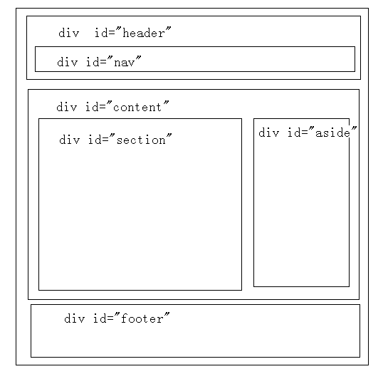
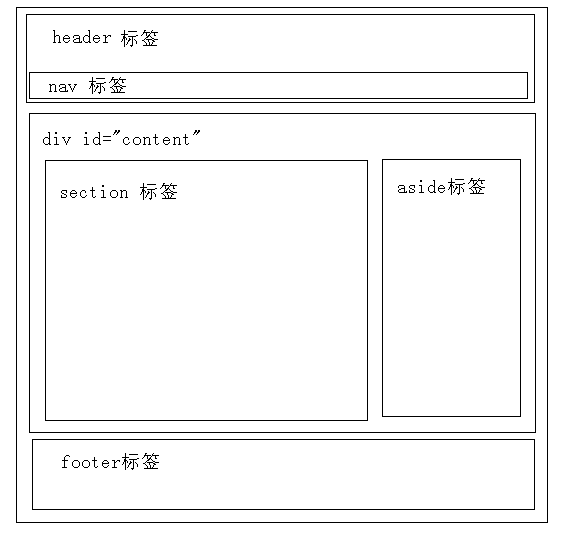

## HTML 测验

**结果：**11/20

### 您的回答：

#### 1.HTML 指的是？

您的回答：超文本标记语言（Hyper Text Markup Language）

#### 2.Web 标准的制定者是？

您的回答：万维网联盟（W3C）

#### 3.在下列的 HTML 中，哪个是最大的标题？

您的回答：<h1>

#### 4.在下列的 HTML 中，哪个可以插入折行？

您的回答：<br>

#### 5.在下列的 HTML 中，哪个可以添加背景颜色？

您的回答：<body color="yellow">

正确答案：<body bgcolor="yellow">

#### 6.请选择产生粗体字的 HTML 标签：

您的回答：<b>

#### 7.请选择产生斜体字的 HTML 标签：

您的回答：<i>

em也是倾斜<i>hh</i>	<em>hh</em>
<strong>jj</strong> 	<b>jj</b>

```js
<i>hh</i>
<em>hh</em>
<strong>jj</strong>
<b>jj</b>
```

#### 8.在下列的 HTML 中，哪个可以产生超链接？

您的回答：<a href="http://www.w3school.com.cn">W3School</a>

#### 9.如何制作电子邮件链接？

您的回答：<a href="xxx@yyy">

正确答案：<a href="mailto:xxx@yyy">

#### 10.如何在新窗口打开链接？

您的回答：<a href="url" target="new">

正确答案：<a href="url" target="_blank">

#### 11.以下选项中，哪个全部都是表格标签？

您的回答：<table><tr><td>

#### 12.请选择可以使单元格中的内容进行左对齐的正确 HTML 标签：

您的回答：<td align="left">

#### 13.如何产生带有数字列表符号的列表？

正确答案：<ol>

#### 14.如何产生带有圆点列表符号的列表？

正确答案：<ul>

#### 15.在下列的 HTML 中，哪个可以产生复选框？

您的回答：<input type="checkbox">

#### 16.在下列的 HTML 中，哪个可以产生文本框？

您的回答：<input type="text">

#### 17.在下列的 HTML 中，哪个可以产生下拉列表？

您的回答：<input type="dropdown">

正确答案：<select>

#### 18.在下列的 HTML 中，哪个可以产生文本区（textarea）？

您的回答：<input type="textarea">

正确答案：<textarea>

#### 19.在下列的 HTML 中，哪个可以插入图像？

您的回答：<image src="image.gif">

正确答案：\

#### 20.在下列的 HTML 中，哪个可以插入背景图像？

您的回答：<background img="background.gif">

正确答案：<body background="background.gif">


## 新标签

> ​	h5新标签

| <u>标签</u>                         | <u>描述</u>                                        |
| :---------------------------------- | :------------------------------------------------- |
| <u>\<!--  --></u>                   | <u>定义注释。</u>                                  |
| <u><!DOCTYPE></u>                   | <u>定义文档类型。</u>                              |
| <u>\<a></u>                         | <u>定义锚。超连结</u>                              |
| <u>addr</u>                         | <u>定义缩写。</u>                                  |
| <u>\<acronym></u>                   | <u>定义只取首字母的缩写。</u>                      |
| <u>\<address></u>                   | <u>定义文档作者或拥有者的联系信息。</u>            |
| <u>\<applet></u>                    | <u>不赞成使用。定义嵌入的 applet。</u>             |
| <u>\<area></u>                      | <u>定义图像映射内部的区域。</u>                    |
| <u>\<article></u>                   | 定义文章。                                         |
| **\<aside>**                        | 定义页面内容之外的内容。                           |
| \<audio>                            | 定义声音内容。                                     |
| \<font_style>                       | 定义粗体字。                                       |
| \<base>                             | 定义页面中所有链接的默认地址或默认目标。           |
| \<basefont>                         | 不赞成使用。定义页面中文本的默认字体、颜色或尺寸。 |
| \<bdi>                              | 定义文本的文本方向，使其脱离其周围文本的方向设置。 |
| \<bdo>                              | 定义文字方向。                                     |
| \<font_style>                       | 定义大号文本。                                     |
| \<blockquote>                       | 定义长的引用。                                     |
| \<body>                             | 定义文档的主体。                                   |
| \<br>                               | 定义简单的折行。                                   |
| \<button>                           | 定义按钮 (push button)。                           |
| \<canvas>                           | 定义图形。                                         |
| \<caption>                          | 定义表格标题。                                     |
| \<center>                           | 不赞成使用。定义居中文本。                         |
| \<cite>                             | 定义引用(citation)。                               |
| \<code>                             | 定义计算机代码文本。                               |
| \<col>                              | 定义表格中一个或多个列的属性值。                   |
| \<colgroup>                         | 定义表格中供格式化的列组。                         |
| \<command>                          | 定义命令按钮。                                     |
| \<datalist>                         | 定义下拉列表。                                     |
| \<dd>                               | 定义定义列表中项目的描述。                         |
| \<del>                              | 定义被删除文本。                                   |
| \<details>                          | 定义元素的细节。                                   |
| \<dir>                              | 不赞成使用。定义目录列表。                         |
| \<div>                              | 定义文档中的节。                                   |
| \<phrase_elements>                  | 定义定义项目。                                     |
| \<dialog>                           | 定义对话框或窗口。                                 |
| \<dl>                               | 定义定义列表。                                     |
| \<dt>                               | 定义定义列表中的项目。                             |
| \<phrase_elements>                  | 定义强调文本。                                     |
| \<embed>                            | 定义外部交互内容或插件。                           |
| \<fieldset>                         | 定义围绕表单中元素的边框。                         |
| \<figcaption>                       | 定义 figure 元素的标题。                           |
| \<figure>                           | 定义媒介内容的分组，以及它们的标题。               |
| \<font>                             | 不赞成使用。定义文字的字体、尺寸和颜色。           |
| \<footer>                           | 定义 section 或 page 的页脚。                      |
| \<form>                             | 定义供用户输入的 HTML 表单。                       |
| \<frame>                            | 定义框架集的窗口或框架。                           |
| \<frameset>                         | 定义框架集。                                       |
| \<figcaption>  --                   | 定义 HTML 标题。                                   |
| \<head>                             | 定义关于文档的信息。                               |
| \<header>                           | 定义 section 或 page 的页眉。                      |
| \<hr>                               | 定义水平线。                                       |
| \<html>                             | 定义 HTML 文档。                                   |
| \<font_style>                       | 定义斜体字。                                       |
| \<iframe>                           | 定义内联框架。                                     |
| \                              | 定义图像。                                         |
| \<input>                            | 定义输入控件。                                     |
| \<ins>                              | 定义被插入文本。                                   |
| \<isindex>---                       | 不赞成使用。定义与文档相关的可搜索索引。           |
| \<kbd>短语元素phrase_elements       | 定义键盘文本。                                     |
| \<keygen>                           | 定义生成密钥。                                     |
| \<label>                            | 定义 input 元素的标注。                            |
| \<legend>                           | 定义 fieldset 元素的标题。                         |
| \<li>                               | 定义列表的项目。                                   |
| \<link>                             | 定义文档与外部资源的关系。                         |
| \<map>                              | 定义图像映射。                                     |
| \<mark>                             | 定义有记号的文本。                                 |
| \<menu>                             | 定义命令的列表或菜单。                             |
| \<menuitem>                         | 定义用户可以从弹出菜单调用的命令/菜单项目。        |
| \<meta>                             | 定义关于 HTML 文档的元信息。                       |
| \<meter>                            | 定义预定义范围内的度量。                           |
| \<nav>                              | 定义导航链接。                                     |
| \<noframes>                         | 定义针对不支持框架的用户的替代内容。               |
| \<noscript>                         | 定义针对不支持客户端脚本的用户的替代内容。         |
| \<object>                           | 定义内嵌对象。                                     |
| \<ol>                               | 定义有序列表。                                     |
| \<optgroup>                         | 定义选择列表中相关选项的组合。                     |
| \<option>                           | 定义选择列表中的选项。                             |
| \<output>                           | 定义输出的一些类型。                               |
| \<p>                                | 定义段落。                                         |
| \<param>                            | 定义对象的参数。                                   |
| \<pre>                              | 定义预格式文本。                                   |
| \<progress>                         | 定义任何类型的任务的进度。                         |
| \<q>                                | 定义短的引用。                                     |
| \<rp>                               | 定义若浏览器不支持 ruby 元素显示的内容。           |
| \<rt>                               | 定义 ruby 注释的解释。                             |
| \<ruby>                             | 定义 ruby 注释。                                   |
| \<s>                                | 不赞成使用。定义加删除线的文本。                   |
| \<phrase_elements>                  | 定义计算机代码样本。                               |
| \<script>                           | 定义客户端脚本。                                   |
| \<section>                          | 定义 section。                                     |
| \<select>                           | 定义选择列表（下拉列表）。                         |
| \<font_style>                       | 定义小号文本。                                     |
| \<source>                           | 定义媒介源。                                       |
| \<span>                             | 定义文档中的节。                                   |
| \<strike>                           | 不赞成使用。定义加删除线文本。                     |
| \<phrase_elements>                  | 定义强调文本。                                     |
| \<style>                            | 定义文档的样式信息。                               |
| \<sub>                              | 定义下标文本。                                     |
| \<summary>                          | 为 <details> 元素定义可见的标题。                  |
| \<sup>                              | 定义上标文本。                                     |
| \<table>                            | 定义表格。                                         |
| \<tbody> --                         | 定义表格中的主体内容。                             |
| \<td>                               | 定义表格中的单元。                                 |
| \<textarea>                         | 定义多行的文本输入控件。                           |
| \<tfoot>                            | 定义表格中的表注内容（脚注）。                     |
| \<th>                               | 定义表格中的表头单元格。                           |
| \<thead>                            | 定义表格中的表头内容。                             |
| \<time>   -5                        | 定义日期/时间。                                    |
| \<title> 一个网页只有一个h1、 title | 定义文档的标题。                                   |
| \<tr>                               | 定义表格中的行。                                   |
| \<track>                            | 定义用在媒体播放器中的文本轨道。                   |
| \<tt>                               | 定义打字机文本。                                   |
| \<u>                                | 不赞成使用。定义下划线文本。                       |
| \<ul>                               | 定义无序列表。                                     |
| \<var>                              | 定义文本的变量部分。                               |
| \<video>                            | 定义视频。                                         |
| \<wbr>                              | 定义可能的换行符。                                 |
| \<xmp>                              | **不赞成使用**。定义预格式文本。                   |

单元格中的星号（*）表示实际规则比上表中所示的复杂。

†“父母”列中的类别是指在其内容模型中列出给定类别的父母，而不是本身在那些类别中的元素。例如，`a`元素的“父母”（Parents）列显示为“短语”，因此内容模型包含“短语”类别的任何元素都可以是`a`元素的父 元素。由于“流”类别包括所有“短语”元素，因此这意味着该`th`元素可以是元素的父`a`元素。


## html介绍

- *什么是HTML*
- *HTML基本语法*
- *常用标签及属性*--
- *链接*
- *文本标记*
- *表格*
- *列表*
- *表单*
- *结构标记*

> *什么是HTML*

```css
Hyper Text Markup Language，超级文本标记语言
- 普通文本a:无特殊意义,超级文本<a>:超链接
- 超文本：文本具备特殊的功能
- 标记：超文本的组成形式<a>
- 语言：拥有自己的语法结构

用该语言编写的文件，以.html 或 .htm为后缀,用来设计网页
由浏览器解释运行，可以嵌入脚本语言编写的程序片段，如JS
```

> ​	*HTML基础语法*
>
> #### *1- 标记语法*

```xml
标记以封闭类型划分：
（1）封闭类型标记.也称双标记，必须成对出现
    <标记>内容</标记>
（2）非封闭类型的标记,也叫做空标记/单标记
    <标记> 或 <标记/>

例如：
<a  href=“www.baidu.com” id=“baidu-link”>标签内容</a>
其中：a为标签名，也叫元素；
      href，id为属性；
      双引号中的值为属性值
```

> *1-1 元素*

```xml
指尖括号及尖括号间所包围的内容部分
元素可以包含文本内容和其他元素，也可以是空的
a.包含文本内容：<p>这是一段文本</p>
b.元素嵌套：形成更为复杂的语法
            <div>
                 <p></p>
             </div>
注意:（1）嵌套顺序；（2）代码缩进（保证代码可读性）
c.空标记<b></b>
```

> *1-2 属性和值*

```jsx
属性是用来修饰元素的
<标记 属性="值" 属性="值">
 ex:<p align="center" id="p1"></p>

【常用的标准属性】
id： 定义元素在页面中的唯一标识
title：鼠标移入到元素上时提示的文本
class：样式相关，定义元素引用的类选择器
style：样式相关，定义元素的行内样式
```

> *1-3 注释*

```xml
在源码中编写，但不会被浏览器所解释的内容，成为注释
可以将对代码的解释说明放在注释中
语法：<!--  注释内容  -->
```

> *2- 文档结构*

```xml
（1）文档类型声明
指定HTML的版本和风格<!DOCTYPE html>
（2）HTML页面
表示HTML页面的开始与结束
语法：<html></html>
位于<!doctype html>之下
```

> *2-1 HTML页面*

```undefined
包含页面头部和页面主体两部分
```

*页面头部：定义页面全局信息*

```xml
<head></head>
紧跟在html之后，是html中的首个子元素

头部所包含的内容（子元素）
（1）网页标题：<title>标题内容</title>
（2）定义网页的编码格式,关键字，描述
    网页的编码格式：<meta charset="utf-8">(utf-8:支持中英文、标点、符号)
    关键字：<meta name="keywords" content="关键字">
    描述：<meta name="description" content="描述内容">
（3）定义或引用javascript：<script></script>
（4）<style></style>定义内部样式
（5）<link>引入外部样式
```

*页面主体：网页显示的主体内容*

```xml
<body></body>
【属性】
text：表示文本颜色
bgcolor：表示网页的背景颜色
```

*简单完整写法如下：*

```xml
<!doctype html>
<html>
  <head>
    <meta charset="utf-8"/>
    <title>页面名称</title>
    <link rel=”stylesheet“ type="text/css" href="文件路径"/>
    <style>样式</style>
    <script>js脚本</script>
</head>
    <body>
        <div>
            <p></p>
        </div>
    </body>
</html>
```

------

## 常用标签及属性

#### *1- 链接*

```xml
又称超链接，设置页面中允许被点击的内容。
【标签】<a></a>
【属性】
href：链接地址（要跳转到的页面的地址）
target：目标，打开新网页的形式
取值：
     _blank：在新标签页中打开
     _self：在自身页面中打开（默认值）
title：鼠标放到链接上的提示
```

#### *2- 文本标记*

- *特殊字符*

```jsx
空格： 
<:  <
>:  ≷  
©:  ©
￥: ¥ 
```

- *文本样式*

```xml
斜体：<i></i>
粗体：<b></b>
删除线：<s></s>
下划线：<u></u>
上标：<sup></sup>
下标：<sub></sub>
```

- *标题元素*

```xml
以标题的形式来显示文本内容
<h1></h1>
<h2></h2>
<h3></h3>
<h4></h4>
<h5></h5>
<h6></h6>
【特点】
- 改变字号（一级最大，六级最小）
- 加粗显示
- 上下有垂直的空白距离
- 独立成行
```

- *段落元素*

```xml
【标签】<p></p>
【特点】
- 默认文字大小
- 独立成行
- 上下垂直空白
```

- *换行元素*

```xml
【标签】<br>
```

- *分隔线元素*

```xml
【标签】<hr>
【属性】
        size：尺寸，取值单位为 px（像素），可以省略
        width：宽度，取值单位为px（像素）可以省略或百分比
        color：颜色，取值自然颜色值
        align：水平对齐方式，取值：left/center/right

```

- *分区元素*

```xml
（1）块分区元素：<div></div>
【特点】独立成行
【作用】页面布局
（2）行内分区元素：<span></span>
【特点】多个元素在一行内显示
【作用】设置同一行文字内的不同格式

```

- *行内元素与块级元素*

```undefined
（1）块级元素（div 、p、h1~h6）
【特点】元素会独占一行，即元素前后都会自动换行，主要用于网页布局
（2）、行内元素（ span、i、b、s、u、sub、sup、img、a）
【特点】不会换行，多个元素会在一行内显示

```

#### *3- 图像*

- *路径*

```undefined
URL：Uniform Resource Locator（统一资源定位器，俗称：路径） 
作用：标识网络任何资源的位置

（1）绝对路径：从文件所在的最高级目录下开始查找资源文件所经过的路径
-包括网络资源&本地资源（如：E:\mmper\练习\img\flower.jpg）
（2）相对路径：从当前文件位置处开始，查找资源文件所经过的路径
- 同目录，直接用， 直接通过资源文件名称进行引用（a.jpg）
- 子目录，进入到子目录中，然后再对资源文件进行引用（img/a.jpg）
- 父目录，返回到父级目录再对资源文件进行引用（../a.jpg）

```

- *图像*

```xml
【标签】
【属性】
        src：图片地址（绝对/相对）
        width：图像宽度
        height：图像高度

```

#### *4- 表格*

```xml
由<table>元素定义。
【标签】<table></table>
【属性】
        width ：设置表格的宽度
        height：设置表格的高度
        align：设置表格的对齐方式，取值: left/center/right
        border：设置表格边框宽度
        cellpadding：内边距（单元格边框与内容之间的距离）
        cellspacing：外边距（单元格之间的距离）
        bgcolor：设置表格的背景颜色

```

- *table中包含的子元素*

```xml
<table></table>中包含的子元素：
【标签】<tr></tr> （创建表行）
【属性】
       align：该行内容水平对齐方式，取值: left/center/right
       valign：该行内容的垂直对齐方式，取值: top/middle/bottom
       bgcolor：设置表格的背景颜色

【标签】<td></td> （创建单元格）
【属性】
        align：内容水平对齐方式
        valign：内容垂直对齐方式
        width ：宽度
        height ：高度
【标签】<caption></caption> （表格标题）
【标签】<th></th> （列标题）
        行标题或列标题，字体有加粗的效果，放在tr中
【标签】<thead></thead> （表头）
【标签】<tbody></tbody> 表主体）
【标签】<tfoot></tfoot> （表尾）

```

- *一个完整的表格*

```xml
<caption>标题文本</caption>
<table>
   <thead>
    <tr>
      <td>姓名</td>
       <td>性别</td>
    </tr>
  </thead>
  <tbody>
    <tr>
      <td>张三</td>
      <td>男</td>
    </tr>
    <tr>
      <td>李四</td>
      <td>女</td>
    </tr>
  </tbody>
</table>

```

- *两行两列的表格*

```xml
<table>
  <tr>
    <td></td>
    <td></td>
  </tr>
  <tr>
    <td></td>
    <td></td>
  </tr>
</table>

```

- *表格的其他应用*

```undefined
（1）不规则表格
- 跨列：从指定单元格位置处，横向向右合并几个（包含自己）单元格
  属性：colspan=值（数字，合并单元格的个数）;
- 跨行：从指定单元格位置处，纵向向下合并几个（包含自己）单元格
  属性：rowspan=值（数字，合并单元格的个数）;
（2）表格的嵌套
  在单元格中去嵌套另一个表格，但嵌套的表格必须要放在td中

```

#### *5- 列表*

```undefined
将一组具有相似特征或者具有先后顺序的内容按照从上到下的顺序排列在一起

```

- *有序列表*

```xml
<ol>
    <li></li>
</ol>
【属性】
        type:指定列表项标志的类型，默认为数字排列
        取值：1（默认值）/a/A/i/I
        start:定义起始值(数字)，默认从1开始
        取值：数字，如：start:1;  start:i;等 

```

- *无序列表*

```xml
<ul>
     <li></li>
</ul>
【属性】
        type：指定无序列表的列表项标识
        取值： disc,默认,实心圆/circle，空心圆/square，实心矩形none，不显示标识

```

- *自定义列表*

```xml
<dl>
  <dt>列表中的标题内容</dt>
  <dd>列表中的数据</dd>
</dl>
使用场合：图文混排时使用

```

#### *6- 表单*

> ​	5个标签
>
> 
>
> 

```xml
由<form>定义，将用户输入的数据提交给后台。
【常见属性】
        action：提交的服务器地址               
        method：表单数据提交的方式，取值： get：明文提交/post：隐式提交
        name：定义表单名称，JS用到的比较多
        id： 独一无二的标识
如：<form action="url" method="get/post"> </form>

```

###### *\<input>元素*

```bash
【主要属性】
        type：根据不同的type属性值可以创建各种类型的输入字段
        					type:text（默认）只要能打出来的 都是可以见的
        value：最终提交给服务器的值
        name：控件的名称，提供给服务器使用，没有name，控件则无法提交
        id：唯一标识，只能在当前页面使用，服务器不能用
        disabled：禁用，不能被提交

```

- *常用的表单控件：*

```bash
（1）文本框：<input type="text">
（2）密码框：<input type="password">   表面加密，其实没有加密
 【专有属性】
         maxlength：限制输入的字符数，取值：数字
         readonly：设置文本控件只读
（3）单选按钮：<input type="radio">  选男 选女，需要添加 相同的name属性；
            <input type="radio",name = "aa">男
            <input type="radio",name ="aa"> 女  
（4）复选框：<input type="checkbox">  ☑️
【专有属性】
         checked，设置默认被选中
（5）提交按钮：<input type="submit">			 提交


（6）重置按钮：<input type="reset">
（7）普通按钮：<input type="button">
（8）图片按钮：<input type="image" src=""> 
（9）隐藏域：<input type="hidden">   ----隐藏0
（10）文件选择框：<input type="file">

```


> 模拟百度

```bash
	<!-- 第2-2种模拟百度跳转-->

 <form action ="http://www.baidu.com/s">
        <input type=text name="wd">
        <input type="submit" value="百度一下">
</form>


```


###### *按钮（提交按钮）*

```xml
<button>内容</button>

```

###### *下拉选择框select 和 option*

```xml
<section name="">
  <option value="" selected></option>
</section>

```


> file 文件上传 

上传文件,成功上传文件需要满足以下三个条件

1·form的 Method=post

2·form的 enctype= multipart/form-data

3·fi1e的name=值

> ​	HTML5新加的表单

emai1邮箱

url

网址

date日期

number数字


#### *7- 结构标记*

```undefined
HTML5所提供的结构标记，专门用于表示常见的网页结构（即制作布局），提升布局代码的语义性和可读性

```

- *常见结构标记*

```xml
<header></header>：定义文档的页眉即页面顶部信息
<nav></nav>：定义页面的导航链接部分
<section></section>：定义文档中的节，文档中主体内容
<article></article> ：定义独立于文档的其他部分内容(章、节等)
<footer></footer>：定义某区域的脚注信息，页面底部内容等
<aside></aside>：多用于侧边栏和相关引用信息等

```


## HTML 简介

**HTML 编辑器推荐**

可以使用专业的 HTML 编辑器来编辑 HTML，菜鸟教程为大家推荐几款常用的编辑器：

- Notepad++：https://notepad-plus-plus.org/
- Sublime Text：[http://www.sublimetext.com/](http://www.sublimetext.com/)
- VS Code：https://code.visualstudio.com/


````
HTTP
telnet ip 端口
header('Location: http://www.baidu.com');//默认302重定向
header('Location: http://www.baidu.com',true,301);//指定301

````


*什么是HTML?*

超文本标记语言（英语：HyperText Markup Language，简称：HTML）是一种用于创建网页的标准标记语言。

## HTML 基础

- 单标签

- 双标签

- ```
  <标签>内容</标签>
  ```

- ```
  <标签 属性=”属性值”>内容</标签>
  ```

- ```
  <标签 属性=”属性值” 属性=”属性值”>内容</标签>
  ```

- ```
  <标签>
  <标签>内容</标签>
  </标签>
  ```

## HTML 标签

### 结构标签

- ```
  <!---->  注释标签
  ```

- ```
  <!doctype html>  定义当前文档类型
  ```

- ```
  <html>    文档标签
  ```

- ```
  <head>    头部标签  定义当前文档相关信息 
  ```

- ```
  <meta>    定义当前文档的元信息
  属性：charset:设置字符集编码格式
  属性值：utf-8 gbk gb2312
  ```

- ```
  <title>    标题标签  定义当前文档的标题
  ```

- ```
  <body>   主体标签  定义当前文档的主题内容 文字 图片 音视频...
  属性：
  		bgcolor: 设置页面的背景颜色
  			值：英文单词：red green blue...
  				6进制颜色：#ff6699 #66ff99...
  				rgb格式：rgb(0-255,0-255,0-255)
    				
  		background: 设置背景图片
  			格式：background=”图片地址”
    			
  		topmargin: 设置网页内容距离浏览器上部的偏移值
    		
  		leftmargin:设置网页内容距离浏览器左部的偏移值
  ```

### 标题标签

HTML 标题（Heading）是通过`<h1> - <h6> `标签来定义的.

```
<h1>这是一个标题</h1>
<h2>这是一个标题</h2>
<h3>这是一个标题</h3>
```

### 段落标签

HTML 段落是通过标签 <p> 来定义的.

```
<p>这是一个段落。</p>
<p>这是另外一个段落。</p>
```

### 链接标签

HTML 链接是通过标签 来定义的.

```
<a href="http://www.runoob.com">这是一个链接</a>
href: 用于设置打开的网页或者跳转的文件地址
target: 设置链接的打开方式
	值：_self 本页面打开 _blank新页面打开
    		_parent父级页面打开 _top顶级页面打开
```

锚点链接：

1. 使用name属性或者id属性设置跳转的名称
2. 设置点击跳转的位置 使用href链接指定的name属性值 或者id值，之前加#号

### 图像标签

```

属性：
	src: 设置用于引入图片地址
	width: 设置图片的宽度
	height: 设置图片的高度
 	注意：只设置宽度或者高度会等比例缩放
	alt: 图片加载失败的信息提示
	title: 显示图片的描述信息
	border: 设置图片的边框
	usemap: 将图片定义为映射区的地址
```

图像热点：在一张图像上实现不同的超链接技术

```
<map></map> 定义映射区域
属性：id 属性 name属性 设置当前map的名称
	<area> 设置地图指定的区域
属性：
	alt:指定文本内容
	shape: 设置映射区域的形状
		值：circle 圆形 rect 矩形 poly多边形
				coords: 设置区域形状的坐标参数
				圆形：水平坐标 垂直坐标 半径
				矩形：水平坐标 垂直坐标 水平坐标 垂直坐标
				多变形：每一个角水平和垂直坐标 自动闭合
	href: 设置链接地址
	target: 设置链接的打开方式 
```

### 格式标签

1. 单纯的格式标签(搜索引擎无优化)

   ```
   <i>斜体字标签</i> 
      
   <b>粗体字标签</b> 
      
   <big>大号文本标签</big> 
      
   <small>小号文本标签</small> 
      
   <tt>打印机文本</tt> 
      
   <sup>上标字</sup> 
      
   <sub>下标字</sub> 
      
   <del>删除线标签</del> 
   <s>删除线标签</s> 
   <strike> 删除线标签</strike> 
   ```

2. 有语义的格式标签

   ```
   <em></em> 强调标签
   <strong></strong> 更为强调的标签
   <cite></cite> 定义引用的参考文献 书籍杂志
   <q></q> 短的引用
   <blockquote></blockquote>定义长的引用
   <code></code> 计算机代码文本
   <pre></pre> 预格式化标签
   <u></u> 下划线文本标签 不建议使用 与a标签容易混淆
   <font></font> 字体标签
   	属性：
   		color: 设置字体的颜色 值：#ff6699 red rgb(255,0,0)
   		size: 设置字体大小  值：1-7
   		face: 设置字体类型 值：宋体 楷体 微软雅黑。。
   <center></center> 文本居中标签
   <style></style> 样式标签 一般写在head标签内部
      
   ```

### 块标签与行内标签

```
   <div></div> 无意义的块标签	
   作用：在页面布局是进行区块划分
   <span></span> 无意义的行内标签 存放一些内容
```

块标签与行内标签的区别：

1. 块标签可以设置宽高度 但是行内标签不可以设置宽高
2. 块标签独占一行 行内标签在一行共存
3. 块标签包含的行内标签 行内标签一般不用于包含块标签

### 列表标签

- ```
  <ul></ul> 无序列表
  ```

- ```
  <ol></ol> 有序列表
  ```

- ```
  <li></li> 列表项标签
  属性：type: 设置列表的标识类型  值：a A i I 1
     			 start: 设置列表标识开始的位置
  ```

- ```
  <dl></dl> 自定义列表标签
  ```

- ```
  <dt></dt> 自定义列表标题标签 只能使用一个
  ```

- ```
  <dd></dd> 自定义内容
  ```

### 表格标签

```
<table border="1">
  <tr>
    <th>Month</th>
    <th>Savings</th>
  </tr>
  <tr>
    <td>January</td>
    <td>$100</td>
  </tr>
</table>
```

- ```
  <tr></tr> 	定义表格中的行。
  ```

- ```
  <td></td> 定义表格中的单元。
  ```

- ```
  <th></th>定义表格中的表头单元格。
  ```

- ```
  colspan:规定单元格可横跨的列数。
  ```

- ```
  rowspan:规定单元格可横跨的行数。
  ```

### 表单标签

`<form> `标签用于为用户输入创建 HTML 表单。

表单能够包含 [input 元素](https://www.w3school.com.cn/tags/tag_input.asp)，比如文本字段、复选框、单选框、提交按钮等等。

表单还可以包含 [menus](https://www.w3school.com.cn/tags/tag_menu.asp)、[textarea](https://www.w3school.com.cn/tags/tag_textarea.asp)、[fieldset](https://www.w3school.com.cn/tags/tag_fieldset.asp)、[legend](https://www.w3school.com.cn/tags/tag_legend.asp) 和 [label 元素](https://www.w3school.com.cn/tags/tag_label.asp)。

```
<form action="form_action.asp" method="get">
  <p>First name: <input type="text" name="fname" /></p>
  <p>Last name: <input type="text" name="lname" /></p>
  <input type="submit" value="Submit" />
</form>
```

- ```
  action: 规定当提交表单时向何处发送表单数据。
  ```

- ```
  method:规定用于发送 form-data 的 HTTP 方法。
  ```

### input 标签

`<input>` 标签用于搜集用户信息。

根据不同的 type 属性值，输入字段拥有很多种形式。输入字段可以是文本字段、复选框、掩码后的文本控件、单选按钮、按钮等等。

- type 类型

  ```
  Hidden 隐藏域
  Text 文本域
  Password 密码
  Radio单选
  Checkbox多选
  File 选择文件上传
  Submit image reset button  按钮
  ```

### 下拉列表标签

select 元素可创建单选或多选菜单。

<select&> 元素中的`<option>`标签用于定义列表中的可用选项。

```
<select>
  <option value ="volvo">Volvo</option>
  <option value ="saab">Saab</option>
  <option value="opel">Opel</option>
  <option value="audi">Audi</option>
</select>
```

**属性**

```
select:
	name
option:
	value
	selected 默认选项
```

### 多行文本域标签

`<textarea>` 标签定义多行的文本输入控件。

文本区中可容纳无限数量的文本，其中的文本的默认字体是等宽字体（通常是 Courier）。

可以通过 cols 和 rows 属性来规定 textarea 的尺寸，不过更好的办法是使用 CSS 的 height 和 width 属性。

**注释：**在文本输入区内的文本行间，用 “%OD%OA” （回车/换行）进行分隔。

**提示：**可以通过 `<textarea>`’ 标签的 wrap 属性设置文本输入区内的换行模式。

```
<textarea rows="3" cols="20">
在w3school，你可以找到你所需要的所有的网站建设教程。
</textarea>
```

### 框架标签

1. 先划分

   ```
   <frameset rows="20%,30%,*">
   <frameset cols="20%,30%,*">
   ```

2. 引入页面

   ```
   <frame src="">
   ```

3. 点击链接在指定位置显示

   给划分的框架 使用 name 属性起名字

   ```
   <frame srf="" name="">
   <a href="" target="与name属性值对应"></a>
   ```


## HTML5 的改变

> ​	html 5 的新增和改变

1. DTD 申明的改变

   HTML5 放弃了 HTML4 中较长的 DTD 声明方式，采用简单的<!doctype html> 语法进行声明

2. 字符集的改变

   ```
   HTML4 
   <meta http-equiv=”content-type” content=”text/html;charset=utf-8” />
   HTML5
   <meta charset=”utf-8”>
   ```

3. 新的标签书写方式

   - 不允许写结束标签的标签

     ```
     
     单标签:base、link、br、hr、img、meta、source...
     ```

   - 可以省略结束标签的标签

     列表标签：li、option、tr、td、dt、dd…

   - 可以完全不写的标签

     ```
     html、head、body..
     ```

4. 单双引号的改变

   可以写单引号，可以写双引号，也可以不写引号，只有一种情况必须写引号（存在=的情况）

   ```
   id="3=3"
   ```

5. 具有布尔值的属性

   ```
   属性名=”属性值” checked=”checked” selected=”selected”
   Checked 或 checked=”true” checked=”false”
   ```

   单属性可以只写名称，就表示设定了该属性，如果不写就表示不设定,例如:写了checked就选中 不写就不选中

   有些单属性在HTML5中使用必须加上true(有）或者false（无）

6. HTML 和 XHTML 在 HTML5 中的应用

   - ML5分为2个版本：

     由HTML4发展而来的HTML5版本（松散语法）

     有XHTML1.1发展而来的XHTML5版本（严格语法）

7. 手册中不赞成使用的标签

   html5 将来可能去掉的标签

   尽量使用 CSS 样式来完成

## HTML5 音频视频

### 1. audio 音频标签

**H5 新属性:**

| 属性                                                         | 值       | 描述                                                         |
| :----------------------------------------------------------- | :------- | :----------------------------------------------------------- |
| [autoplay](https://www.w3school.com.cn/tags/att_audio_autoplay.asp) | autoplay | 如果出现该属性，则音频在就绪后马上播放。                     |
| [controls](https://www.w3school.com.cn/tags/att_audio_controls.asp) | controls | 如果出现该属性，则向用户显示控件，比如播放按钮。             |
| [loop](https://www.w3school.com.cn/tags/att_audio_loop.asp)  | loop     | 如果出现该属性，则每当音频结束时重新开始播放。               |
| [preload](https://www.w3school.com.cn/tags/att_audio_preload.asp) | preload  | 如果出现该属性，则音频在页面加载时进行加载，并预备播放。如果使用 “autoplay”，则忽略该属性。 |
| [src](https://www.w3school.com.cn/tags/att_audio_src.asp)    | *url*    | 要播放的音频的 URL。                                         |

**在页面中引入音频内容:**

```
<!--基本的音频格式-->
<audio src="_WStyle.mp3" controls>您的浏览器不支持</audio>
```

注意；在低版本浏览器中，音频标签不被支持的情况下会显示标签中的文字用于提示。

```
<!--完整的音频格式-->
<audio controls>
	对不起，您的破浏览器不支持该标签，请下载新的浏览器
	<source src="_WStyle.ogg" type="audio/ogg" />
	<source src="_WStyle.mp3" type="audio/mp3" />
</audio>
```

**常用标签属性:**

src 用来引入视频文件地址，如果使用多文件，则需要配合source来使用

controls 设置是否显示控制面板 单标签

autoplay 自动播放属性 单标签

loop 循环播放属性

preload 预先加载属性

​	none 不预先加载 默认值

​	auto 预先加载

poster 设置视频预览图，需要使用一个图片地址。

**各个浏览器的音频支持列表：**

|            | IE 9 | Firefox 3.5 | Opera 10.5 | Chrome 3.0 | Safari 3.0 |
| :--------- | :--- | :---------- | :--------- | :--------- | :--------- |
| Ogg Vorbis |      | √           | √          | √          |            |
| MP3        | √    |             |            | √          | √          |
| Wav        |      | √           | √          |            | √          |

### 2. video 视频标签

\<video>标签的属性:

| 属性                                                         | 值       | 描述                                                         |
| :----------------------------------------------------------- | :------- | :----------------------------------------------------------- |
| [autoplay](https://www.w3school.com.cn/tags/att_video_autoplay.asp) | autoplay | 如果出现该属性，则视频在就绪后马上播放。                     |
| [controls](https://www.w3school.com.cn/tags/att_video_controls.asp) | controls | 如果出现该属性，则向用户显示控件，比如播放按钮。             |
| [height](https://www.w3school.com.cn/tags/att_video_height.asp) | *pixels* | 设置视频播放器的高度。                                       |
| [loop](https://www.w3school.com.cn/tags/att_video_loop.asp)  | loop     | 如果出现该属性，则当媒介文件完成播放后再次开始播放。         |
| [preload](https://www.w3school.com.cn/tags/att_video_preload.asp) | preload  | 如果出现该属性，则视频在页面加载时进行加载，并预备播放。如果使用 “autoplay”，则忽略该属性。 |
| [src](https://www.w3school.com.cn/tags/att_video_src.asp)    | *url*    | 要播放的视频的 URL。                                         |
| [width](https://www.w3school.com.cn/tags/att_video_width.asp) | *pixels* | 设置视频播放器的宽度。                                       |

**在页面中引入视频内容:**

```
<!--普通格式-->
<video src="movie.webm" controls>您的浏览器不支持该标签</video>

<!--完整格式-->
<video controls>
	您的浏览器不支持该标签
	<source src="movie.webm" type="video/webm" />
	<source src="movie.avi" type="video/avi" />
	<source src="movie.mp4" type="video/mp4" />
</video>
```

**视频标签的属性：**

src 用来引入视频文件地址，如果使用多文件，则需要配合source来使用

controls 设置是否显示控制面板 单标签

autoplay 自动播放属性 单标签

loop 循环播放属性

preload 预先加载属性

​	none 不预先加载 默认值

​	auto 预先加载

poster 设置视频预览图，需要使用一个图片地址。

**浏览器对视频的支持：**

| 格式   | IE   | Firefox | Opera | Chrome | Safari |
| :----- | :--- | :------ | :---- | :----- | :----- |
| Ogg    | No   | 3.5+    | 10.5+ | 5.0+   | No     |
| MPEG 4 | 9.0+ | No      | No    | 5.0+   | 3.0+   |
| WebM   | No   | 4.0+    | 10.6+ | 6.0+   | No     |

## HTML5 表单标签

**新的 input 类型**

- email 邮箱类型
- url url地址类型
- number 数字类型
- color 颜色选取类型
- tel 电话类型表单
- range 滑块类型表单
- search 搜索类型表单
- date 日期选取表单
- time 时间选取表单
- week 周选取表单
- month 月选取表单
- datetime 日期时间选取表单
- Datetime-local 本地日期时间选取表单

**新增表单的用法**

在HTML5中为了方便页面布局，避免表单之间的冲突，我们可以允许表单标签在form标签之外使用。

使用方法：

1. 为制定的from标签 添加id属性，并且自定义值
2. 为所有属于当前form标签的表单表单添加form属性，值为指定的form标签的id值即可。

**新增的表单属性**

- autofocus 自动获取焦点属性

- Autocomplete 是否自动完成 on 默认 off

- placeholder 设置表单的提示信息属性

  注意：在HTML5之前我们一直使用value当作默认值和提示信息使用，功能存在重叠，为了使得value作用更加明确，新增的placeholder属性专门用来表示提示信息。

- form为表单标签指定对应的form标签。

- required 强制必填属性

- max 设置表单的最大值

- min 设置表单的最小值

  注意：min和max属性并不能适用于所有的表单，适用于number、date、time、week类型的表单

- step 设置跳步属性,设置数值变化的间隔

  注意:一般用在number标签中，另外可以和value值配合使用，其最终结果为value值+跳步*N

- multiple 设置上传的input文件表单为多文件上传表单

- pattern 表单正则设置属性，为没有规则的表单设置规则

  注意:直接使用正则表达式定义表单的规则，不需要使用正则的定界符，直接书写即可，没有修正符

------

- formaction 重新定义当前按钮提交的表单的action属性
- formmethod 重新定义当前按钮提交的方法
- formenctype 重新定义当前按钮提交的编码方式
- formtarget 重新定义当前按钮的打开方式
- formnovaildate 重新定于当前按钮的验证方式为不验证

注意：

1.以上5个属性是对于所有提交按钮有效。

2.如果提交时没有点击设置这些属性的按钮，那么依旧按照form的值来进行操作

novalidate 设置当前表单为不验证方式，用于form标签

## HTML5 布局标签

新增的结构标签（为搜索引擎专门设置的标签）

 **旧版页面布局结构：**




**HTML5页面布局结构:**




**结构标签：（在页面布局中和在文章中）**

- header 标签

  表示一个页面的顶部区域或者在文章中

  表示一篇文章的标题和顶部区域。

- footer标签

  表示一个页面布局的底部区域

  表示一片文章的结尾部分的其他内容(非文章主体内容)

- artice标签

  表示一篇完整的文章或者一个完整的内容(博文，评论)

  可以用于一篇段文章

- section 标签

  表示页面中的主体内容块

  表示文章中的区块或者章节

- aside标签

  表示页面布局中的侧边栏（非主体内容区域）

  表示在文章中的侧边栏(注释区域)

- nav标签：

  表示页面中的导航部分，一般作为导航使用。

  注意：nav仅仅是一个具有特定名称的div而已。书写导航列表依然使用ul和li的组合无序列表形式。

- address标签

  用来表示一个现实中具体的地址。

  用来表示一个网络地址，例如邮箱。。

## HTML5 其他标签

1. figure 内容解释标签。一般配合figcaption一起使用

   figcaption 内容描述标签

   该标签的作用就是解释文字或者图片视频等内容

   ```
   <figure>
   <!--需要解释的内容-->
   内容
   <figcaption>具体的解释文字</figcaption>
   </figure>
   ```

2. meter 状态条标签

   max 设置最大状态值

   min 设置最小状态值

   value 设置当前状态值

   low 设置低警告值

   high 设置高警告值

   optimum 设置良好值的范围

3. progress 进度条标签

   max 设置进度条的最大值

   value 设置进度条的当前值

4. mark 高亮标记标签

   作用：将mark内部的文字变为具有黄色背景的文字。主要用于提示读者注意。但是对搜索引擎的意义不大。

   注意：如果需要修改背景颜色请使用CSS即可.

5. time 标签 时间标签

   作用：标记使用，方便搜索引擎收录及对时间的解释。

   datetime 对当前设置时间的具体解释

   ​	Datetime=“年-月-日T时：分:秒”（ 当前时间）

   ​	Datetime=“年-月-日T时：分:秒+08：00”（指定时区时间）

   ​	Datetime=“年-月-日T时：分:秒Z”(UTC事件)

   pubdate 设定当前时间的意义，表示当前事件为发布内容的时间。

6. 于给文字或者单词添加拼音注释(定义范围)

   rt 用于标注注音的标签

   rp 当注音不支持的情况下可以使用rp显示()内容

   标准格式：猥琐chunjie	`<ruby>猥琐<rt>chunjie</rt></ruby>`

   兼容格式：夼kuang	`<ruby>夼<rt><rp>(</rp>kuang<rp>)</rp></rt></ruby>`

7. details 细节详细描述标签

   summary细节详细描述标题标签

   ```
   <!--细节描述标签-->
   <details>
   	<summary>2015年微型小说top3</summary>
   	<p>男：走，我请你去吃饭！</p>
   	<p>女：不去了，我下面给你吃把~</p>
   </details>
   ```

8. dialog 会话标签

   用于声明一段对话的标签，需要和dt及dd标签配合使用

   dt用来表示发言者，dd用来表示发言的内容

9. embed标签 多媒体标签

   一般用来引入flash资源

   `<embed src="flash地址">`

10. datalist 数据列表标签

    用来为input标签添加数据列表使用，需要配合option标签来使用

    格式：

    ```
    <input type="text" name="keywords" value="" list="xiyouji" />
    <datalist id="xiyouji">
    	<option>孙悟空大尿天宫</option>
    	<option>猪八戒迎娶卯二姐</option>
    	<option>沙和尚九尝唐僧肉</option>
    </datalist>
    ```


## 语义化标签（work）


**一、为什么HTML5要引入新语义标签**

在HTML5出现之前，我们一般采用DIV+CSS布局我们的页面。但是这样的布局方式不仅使我们的文档结构不够清晰，而且不利于搜索引擎爬虫对我们页面的爬取。为了解决上述缺点，HTML5新增了很多新的语义化标签。

**二、引入语义化标签的优点**

引入语义化标签的好处主要有下列三点：

- 比`<div>`标签有更加丰富的含义，方便开发与维护
- 搜索引擎能更方便的识别页面的每个部分
- 方便其他设备解析（如移动设备、盲人阅读器等）

**三、标签详解**

所谓语义化标签就是一种我们仅通过标签名就能判断出该标签内容的语义的标签。下面将介绍`<article> <section> <nav> <aside>、<header> <footer>`等HTML5新增的语义化区块标签。

**（一） header**

> 通常被放置在页面或者页面中某个区块元素的顶部，包含整个页面或者区块的标题、简介等信息，起到引导与导航的作用。

我们不但可以放置页面或者页面中某个区块的标题，还可以放置搜索表单、logo图片等元素，按照最新的W3C标准，我们还可以放置`<nav>`导航栏。

下面是一个使用该标签的网站头部实例：

```
<header>
    
    <h1>**信息科技有限公司</h1>
</header>
```

需要注意的是，一个文档中可以包含一对或者一对以上的`<header>`标签。标签的位置是次要的，不一定非要显示在页面的上方，我们可以为任何需要的区块标签添加`<header>`元素，例如下面将要讲解的`<article> <section>`等标签。

**（二）nav**

> 表示页面的导航，可以通过导航连接到网站的其他页面，或者当前页面的其它部分。

`<nav>`不但可以作为页面独立的导航区域存在，我们还可以在`<header>`标签中使用。此外，`<nav>`标签还可以显示在侧边栏中。由此可见，一个页面之中可以有多个`<nav>`标签。

根据HTML5标准，`<nav>`标签只用于页面的主要导航部分。因为搜索引擎或者屏幕阅读器会根据`<nav>`标签来确定网站的主体内容，所以并不是任意一组超链接都适合放置在`<nav>`标签中,我们只要将主要的，基本的链接组放进`<nav>`即可,对于有辅助性的页脚链接则不推荐使用`<nav>`标签。

示例如下：

```
<header>
    
    <h1>**信息科技有限公司</h1>
    <nav>
        <li><a href="#">首页</a></li>
        <li><a href="example.html">客户案例</a></li>
        <li><a href="service_one.html">技术服务</a></li>          
        <li><a href="aboutus_one.html">关于我们</a></li>
        <li><a href="connection.html">联系我们</a></li>
    </nav>
</header>
```

值得我们注意的是,HTML5规范不允许将`<nav>`标签嵌套在`<address>`标签中使用。

**（三）aside**

> 所包含的内容不是页面的主要内容、具有独立性，是对页面的补充。

`<aside>`标签一般使用在页面、文章的侧边栏、广告、友情链接等区域。

示例如下：

```
 <article>
    <h1>HTML5学习之语义化标签</h1>
    <p>....正文.....</p>
    <aside>
        <h2>什么是语义化标签</h2>
        <p>语义化标签就是......</p>
    </aside>
</article>
```

**（四）footer**

> 一般被放置在页面或者页面中某个区块的底部，包含版权信息、联系方式等信息。

跟`<header>`标签一样，`<footer>`标签的使用个数没有限制，可以在任意需要的区块底部使用。

示例如下：

```
<footer>
    <small>
        版权所有 © 2016-2017 **信息科技有限公司
    </small>
</footer>
```

**（五）article**

> 表示包含于一个文档、页面、应用程序或网站中的一段独立的内容，可以被独立的发布或者重新使用文章标记标签。

`<article>`标签应该使用在相对比较独立、完整的的内容区块，所以我们可以在一篇博客、一个论坛帖子、一篇新闻报道或者一个用户评论中使用它。通常情况下，一个`<article>`元素包括标题、正文和脚注。和`<nav>`标签一样，该标签同样不能用在`<address>`标签中；

示例如下：

```
<article>
    <h1>HTML5学习之语义化标签</h1>
    <p>....正文.....</p>
    <footer>版权所有*伪版必究</footer>
</article>
```

`<article>`标签还可以嵌套使用，但是它们必须是部分与整体的关系。例如在一篇发表的博客中，我们可以对读者评论使用该标签。

示例如下：

```
<article>
    <h1>HTML5学习之语义化标签</h1>
    <p>....正文.....</p>
    <article>
        <header>
            <h2>读者评论</h2>
        </header>  
        <article>
            <header>
                <h3>评论人：张三</h3>
                <p>评论时间：<time datetime="2017-02-15">2017-02-15 11:45:23</time></p>
            </header>
            <p>张三到此一游</p>
        </article>     
        <article>
            <header>
                <h3>评论人：李四</h3>
                <p>评论时间：<time datetime="2017-02-09">2017-02-09 14:20:15</time></p>
            </header>
            <p>李四到此一游</p>
        </article>  
     </article>  
</article>
```

**（六）section**

> 是一个主题性的内容分组，通常用于对页面进行分块或者对文章等进行分段

`<section>`标签所包裹的是有一组相似的主题的内容，可以用这个标签来实现文章的章节、标签式对话框中的各种标签页等类似的功能。

`<section>`通常包含一个头部`<header>`、可能还会包含一个尾部`<footer>`。

示例如下：

```
<article>
    <h1>JavaScript框架</h1>
    <p>Javascript框架是指以Javascript语言为基础搭建的编程框架。</p>
    <section>
        <h2>angular.Js<h2>
        <p>angular.Js是一款优秀的前端JS框架</p>
    </section>
    <section>
        <h2>Vue.js<h2>
        <p>Vue.js是用于构建交互式的Web界面的库</p>
    </section>
    <section>
        <h2>jQuery<h2>
        <p>jQuery是一个快速、简洁的JavaScript框架。</p>
    </section>
</article>
```

在这篇关于JS框架的文章中,所列举的三个框架都是文章主题构成的一部分，所以我们使用`<section>`标签对其进行分段。

我们不但可以在`<article>`标签中使用`<section>`标签，还可以在`<section>`标签中使用`<article>`标签。

示例如下：

```
<section>
    <h1>HTML5技术栈</h1>
    <p>广义而言的HTML5包含HTML、CSS和JavaScript三个部分</p>
    <article>
        <h2>HTML<h2>
        <p>内容</p>
    </article>
    <article>
        <h2>CSS<h2>
        <p>样式</p>
    </article>
    <article>
        <h2>JavaScript<h2>
        <p>行为</p>
    </article>
</section>
```

在这个例子中，`<section>`标签代表一段内容，在这段内容中，HTML、CSS、Javascript是三个完全独立的部分，因而我们为这三个不同的部分分别使用`<article>`标签。

<div> <section> <article>三者的比较：

- `<div>`：应用广泛，只要我们想为一个区域定义一个样式或者为其添加JS行为，就可以使用div标签
- `<section>`：包含的内容是一个明确的主题，通常有标题区域
- `<article>`:如果我们的页面中需要一个单独的模块来实现一个单独的功能，就用`<article>`，其他的时候都用`<section>`。

**四、文档级别语义**

HTML5试图为每个元素加入一个特定的文档级别语义。

**（一）ruby、rt、rp**

ruby是一种排版注释系统，是位于横排基础文本上方的简短文字，主要针对东亚语言作出简单的读音注释。例如可以为中文或日文显示读音。

ruby涉及的元素包括ruby、rt以及rp。首先使用ruby指定一个具体的表达式，然后使用rt提供说明。rt部分将显示在表达式上方。

下面这个例子中，拼音将显示在文字的上方。

```
<ruby>
    北<rt>bei</rt>
    京<rt>jing</rt>
</ruby>
```

但是在不支持ruby的浏览器中需要使用rp对这两个区块进行视觉上的隔离。

```
<ruby>
    北
    <rp>
        <rt>bei</rt>
    </rp>
    京
    <rp>
        <rt>jing</rt>
    </rp>
</ruby>
```

**（二）time**

为了将现在的常用的日期和时间语句用规范的、利于机器识别的格式进行表述，time元素提供了一个可选的时间和时区组件。

为了确保机器能够正确识别，我们可以使用datetime属性，其属性值可以被定义为时间、日期或者这两者的复合体。

```
<time datetime="2017-07-03">
```

还可以使用pubdate为一个网页指定发布时间。

```
<time datetime="2017-07-03" pubdate>
<!--以下两种形式也可以行-->
<time datetime="2017-07-03" pubdate="">
<time datetime="2017-07-03" pubdate="pubdate">
```

**注意：**在 HTML5中，true或false并非有效的属性值，当解释器发现存在布尔属性时，它将直接解释为true。如果需要将属性设为false，将这个属性去掉即可。

**（三）mark**

mark元素用于高亮标记一段文字。

可以使用mark元素来标记出网页里被搜索的关键词或是用于高亮显示一段解释性的代码。

**（四）wbr**

wbr元素用于让浏览器为长单词增加可选择的破折号，以便自动拆行。

在相当长的单词中插入一对wbr元素，可以让浏览器根据排版的需要决定是否将单词换行。破折号是否出现，以及出现的位置完全由排版决定。wbr只是允许自动拆行，但非强制拆行。

**（五）略微改变的元素**

在HTML4版本中的标签元素在HTML5中有了新的定义。

使用b表示文档渲染为粗体，而i表示文档渲染为斜体。使用strong和em来强调一段重要的文本。cite用来为对参考文献的引用进行定义，比如书籍或杂志的标题。small不仅仅指的是小字体，它还同样为法律声明增添不具有重要性的旁注或小字。hr现在表达的是主体性的间断，不再仅仅是分割版面的一条水平线。


## Html-post/get

**(form) method 属性**

实例

使用 "get" 方法来提交表单：

```html
<form action="demo_form.html" method="get">
  First name: <input type="text" name="fname"><br>
  Last name: <input type="text" name="lname"><br>
  <input type="submit" value="提交">
</form>
```


<form action="demo_form.html" method="get">
  First name: <input type="text" name="fname"><br>
  Last name: <input type="text" name="lname"><br>
  <input type="submit" value="提交">
</form>

**浏览器支持**


所有主流浏览器都支持 method 属性。

------

定义和用法

method 方法规定如何发送表单数据（form-data）（表单数据会被发送到在 action 属性中规定的页面中）。

表单数据可被作为 URL 变量的形式来发送（method="get"）或者作为 HTTP post 事务的形式来发送（method="post"）。

关于 GET 的注释：

- 将表单数据以名称/值对的形式附加到 URL 中
- URL 的长度是有限的（大约 3000 字符）
- 绝不要使用 GET 来发送敏感数据！（在 URL 中是可见的）
- 对于用户希望加入书签的表单提交很有用
- GET 更适用于非安全数据，比如在 Google 中查询字符串

**关于 POST 的注释：**

- 将表单数据附加到 HTTP 请求的 body 内（数据不显示在 URL 中）
- 没有长度限制
- 通过 POST 提交的表单不能加入书签

------

**HTML 4.01 与 HTML5之间的无差异**

```
 <form method="get|post">
  
<!DOCTYPE html>
<html>
<head> 
<meta charset="utf-8"> 
<title>菜鸟教程(runoob.com)</title> 
</head>
<body>

<form action="demo_form_method_post.php" method="post" target="_blank">
  First name: <input type="text" name="fname"><br>
  Last name: <input type="text" name="lname"><br>
  <input type="submit" value="提交">
</form>

<p>点击提交按钮,输入框数据将被发送到服务器上的“demo-form_method.php”页面。</p>

</body>
</html>
```


**属性值**

| 值   | 描述                                                         |
| :--- | :----------------------------------------------------------- |
| get  | 默认。将表单数据（form-data）以名称/值对的形式附加到 URL 中：URL?name=value&name=value。 |
| post | 以 HTTP post 事务的形式发送表单数据（form-data）。           |


## 新元素

下面列出的 HTML5 的新元素，以及对它们的描述。

**新的语义/结构元素**

HTML5 提供的新元素可以构建更好的文档结构：

| 标签         | 描述                                                 |
| :----------- | :--------------------------------------------------- |
| <article>    | 定义文档内的文章。                                   |
| <aside>      | 定义页面内容之外的内容。                             |
| <bdi>        | 定义与其他文本不同的文本方向。                       |
| <details>    | 定义用户可查看或隐藏的额外细节。                     |
| <dialog>     | 定义对话框或窗口。                                   |
| <figcaption> | 定义 <figure> 元素的标题。                           |
| <figure>     | 定义自包含内容，比如图示、图表、照片、代码清单等等。 |
| <footer>     | 定义文档或节的页脚。                                 |
| <header>     | 定义文档或节的页眉。                                 |
| <main>       | 定义文档的主内容。                                   |
| <mark>       | 定义重要或强调的内容。                               |
| <menuitem>   | 定义用户能够从弹出菜单调用的命令/菜单项目。          |
| <meter>      | 定义已知范围（尺度）内的标量测量。                   |
| <nav>        | 定义文档内的导航链接。                               |
| <progress>   | 定义任务进度。                                       |
| <rp>         | 定义在不支持 ruby 注释的浏览器中显示什么。           |
| <rt>         | 定义关于字符的解释/发音（用于东亚字体）。            |
| <ruby>       | 定义 ruby 注释（用于东亚字体）。                     |
| <section>    | 定义文档中的节。                                     |
| <summary>    | 定义 <details> 元素的可见标题。                      |
| <time>       | 定义日期/时间。                                      |
| <wbr>        | 定义可能的折行（line-break）。                       |


**新的表单元素**

| 标签       | 描述                             |
| :--------- | :------------------------------- |
| <datalist> | 定义输入控件的预定义选项。       |
| <keygen>   | 定义键对生成器字段（用于表单）。 |
| <output>   | 定义计算结果。                   |


**新的输入类型**

| 新的输入类型                                                 | 新的输入属性                                                 |
| :----------------------------------------------------------- | :----------------------------------------------------------- |
| colordatedatetimedatetime-localemailmonthnumberrangesearchteltimeurlweek | autocompleteautofocusformformactionformenctypeformmethodformnovalidateformtargetheight 和 widthlistmin 和 maxmultiplepattern (regexp)placeholderrequiredstep |


**HTML5 - 新的属性语法**

HTML5 允许四种不同的属性语法。

该例演示 <input> 标签中使用的不同语法：

| 标签          | 描述                                          |
| :------------ | :-------------------------------------------- |
| Empty         | <input type="text" value="John Doe" disabled> |
| Unquoted      | <input type="text" value=John>                |
| Double-quoted | <input type="text" value="John Doe">          |
| Single-quoted | <input type="text" value='John Doe'>          |

在 HTML5 中，根据属性所需，可能会使用所有这四种语法。

**HTML5 图像**

| 标签     | 描述                             |
| :------- | :------------------------------- |
| <canvas> | 定义使用 JavaScript 的图像绘制。 |
| <svg>    | 定义使用 SVG 的图像绘制。        |


新的媒介元素

| 标签     | 描述                                 |
| :------- | :----------------------------------- |
| <audio>  | 定义声音或音乐内容。                 |
| <embed>  | 定义外部应用程序的容器（比如插件）。 |
| <source> | 定义 <video> 和 <audio> 的来源。     |
| <track>  | 定义 <video> 和 <audio> 的轨道。     |
| <video>  | 定义视频或影片内容。                 |


## 前端面试真题(名企) 	 

随着移动互联网的兴起，HTML5 技术发进一步发展， 拥有全栈能力的高级前端工程师，迅速成为每个IT 企业不可或缺的岗位。 作为新兴的专业，正在展示他蓬勃发展的前景，一骑绝尘，成为市场的宠儿，成为企业争抢的香饽饽，随着HTML5 等web 前端技术兴起，前端开发大潮已经袭来！

#### 一、HTML 和CSS1、你做的页面在哪些流览器测试过？这些浏览器的内核分别是什么?

```
IE: trident 内核
Firefox：gecko 内核
Safari:webkit 内核
Opera:以前是 presto 内核，Opera 现已改用Google Chrome 的Blink 内核
Chrome:Blink(基于webkit，Google 与Opera Software 共同开发)
```


**2**、每个HTML 文件里开头都有个很重要的东西，Doctype，知道这是干什么的吗？**


```
<!DOCTYPE> 声明位于文档中的最前面的位置，处于<html> 标签之前。此标签可告知浏览器文档使用哪种HTML 或XHTML 规范。（重点：告诉浏览器按照何种规范解析页面）

```


#### 3、Quirks 模式是什么？它和Standards 模式有什么区别

从IE6 开始，引入了Standards 模式，标准模式中，浏览器尝试给符合标准的文档在规范上的正确处理达到在指定浏览器中的程度。
在IE6 之前CSS 还不够成熟，所以IE5 等之前的浏览器对CSS 的支持很差，IE6 将对CSS提供更好的支持，然而这时的问题就来了，因为有很多页面是基于旧的布局方式写的，而如果IE6 支持CSS 则将令这些页面显示不正常，如何在即保证不破坏现有页面，又提供新的
渲染机制呢？
在写程序时我们也会经常遇到这样的问题，如何保证原来的接口不变，又提供更强大的功能，尤其是新功能不兼容旧功能时。遇到这种问题时的一个常见做法是增加参数和分支，即当某个参数为真时，我们就使用新功能，而如果这个参数 不为真时，就使用旧功能，这样就能不破坏原有的程序，又提供新功能。IE6 也是类似这样做的，它将DTD 当成了这个“参数”，因为以前的页面大家都不会去写DTD，所以IE6 就假定 如果写了DTD，就意味着这个页面将采用对CSS 支持更好的布局，而如果没有，则采用兼容之前的布局方式。这就是Quirks模式（怪癖模式，诡异模式，怪异模式）。
总体会有布局、样式解析和脚本执行三个方面的区别。
盒模型：在W3C 标准中，如果设置一个元素的宽度和高度，指的是元素内容的宽度和高度，而在Quirks 模式下，IE 的宽度和高度还包含了padding 和border。

设置行内元素的高宽：在 Standards 模式下，给<span>等行内元素设置 wdith 和 height 都不会生效，而在 quirks 模式下，则会生效。

设置百分比的高度：在 standards 模式下，一个元素的高度是由其包含的内容来决定的，如果父元素没有设置百分比的高度，子元素设置一个百分比的高度是无效的用

margin:0 auto 设置水平居中：使用 margin:0 auto 在 standards 模式下可以使元素水平居中，但在 quirks 模式下却会失效。（还有很多，答出什么不重要，关键是看他答出的这些是不是自己经验遇到的，还是说都是看文章看的，甚至完全不知道。）

#### 4、div+css 的布局较 **table** 布局有什么优点？

改版的时候更方便 只要改 css 文件。

页面加载速度更快、结构化清晰、页面显示简洁。

表现与结构相分离。

易于优化（seo）搜索引擎更友好，排名更容易靠前。

#### 5**、** img **的** alt **与** title 有何异同？ strong **与** em 的异同？

a:alt(alt text):为不能显示图像、窗体或 applets 的用户代理（UA），alt 属性用来指定替换文字。替换文字的语言由 lang 属性指定。(在 IE 浏览器下会在没有 title 时把 alt

当成 tool tip 显示)

title(tool tip):该属性为设置该属性的元素提供建议性的信息。

strong:粗体强调标签，强调，表示内容的重要性

em:斜体强调标签，更强烈强调，表示内容的强调点

#### 6、你能描述一下渐进增强和优雅降级之间的不同吗**?**

渐进增强 progressive enhancement：针对低版本浏览器进行构建页面，保证最基本的功能，然后再针对高级浏览器进行效果、交互等改进和追加功能达到更好的用户体验。优雅降级 graceful degradation：一开始就构建完整的功能，然后再针对低版本浏览器

进行兼容。

区别：优雅降级是从复杂的现状开始，并试图减少用户体验的供给，而渐进增强则是从一个非常基础的，能够起作用的版本开始，并不断扩充，以适应未来环境的需要。降级（功能衰减）意味着往回看；而渐进增强则意味着朝前看，同时保证其根基处于安全地带。

 

“优雅降级”观点

“优雅降级”观点认为应该针对那些最高级、最完善的浏览器来设计网站。而将那些被认为“过时”或有功能缺失的浏览器下的测试工作安排在开发周期的最后阶段，并把测试对象限定为主流浏览器（如 IE、Mozilla 等）的前一个版本。

在这种设计范例下，旧版的浏览器被认为仅能提供“简陋却无妨 (poor, but passable)” 的浏览体验。你可以做一些小的调整来适应某个特定的浏览器。但由于它们并非我们所关注的焦点，因此除了修复较大的错误之外，其它的差异将被直接忽略。

“渐进增强”观点

“渐进增强”观点则认为应关注于内容本身。

内容是我们建立网站的诱因。有的网站展示它，有的则收集它，有的寻求，有的操作，还有的网站甚至会包含以上的种种，但相同点是它们全都涉及到内容。这使得“渐进增强”成为一种更为合理的设计范例。这也是它立即被 Yahoo! 所采纳并用以构建其“分级式浏览器支持 (Graded Browser Support)”策略的原因所在。

那么问题来了。现在产品经理看到 IE6,7,8 网页效果相对高版本现代浏览器少了很多圆角，

阴影（CSS3），要求兼容（使用图片背景，放弃 CSS3），你会如何说服他？

#### 7、为什么利用多个域名来存储网站资源会更有效？

CDN 缓存更方便

突破浏览器并发限制

节约 cookie 带宽

节约主域名的连接数，优化页面响应速度

防止不必要的安全问题

#### 8、请谈一下你对网页标准和标准制定机构重要性的理解。

网页标准和标准制定机构都是为了能让 web 发展的更‘健康’，开发者遵循统一的标准，降低开发难度，开发成本，SEO 也会更好做，也不会因为滥用代码导致各种 BUG、安全问题，最终提高网站易用性。

#### 9、请描述一下 cookies，sessionStorage 和 localStorage 的区别？

sessionStorage 用于本地存储一个会话（session）中的数据，这些数据只有在同一个会话中的页面才能访问并且当会话结束后数据也随之销毁。因此 sessionStorage 不是一种持久

file:///C:\Users\ADMINI~1\AppData\Local\Temp\ksohtml\wps97C4.tmp.png的本地存储，仅仅是会话级别的存储。而 localStorage 用于持久化的本地存储，除非主

动删除数据，否则数据是永远不会过期的。

web storage 和 cookie 的区别

Web Storage 的概念和 cookie 相似，区别是它是为了更大容量存储设计的。Cookie 的大小是受限的，并且每次你请求一个新的页面的时候 Cookie 都会被发送过去，这样无形中浪费

了带宽，另外 cookie 还需要指定作用域，不可以跨域调用。

除此之外，Web Storage 拥有 setItem,getItem,removeItem,clear 等方法，不像 cookie需要前端开发者自己封装 setCookie，getCookie。但是 Cookie 也是不可以或缺的：Cookie的作用是与服务器进行交互，作为 HTTP 规范的一部分而存在 ，而 Web Storage 仅仅是为了在本地“存储”数据而生。

#### 10**、简述一下** src **与** href 的区别。

```js
src 用于替换当前元素，href 用于在当前文档和引用资源之间确立联系。

src 是 source 的缩写，指向外部资源的位置，指向的内容将会嵌入到文档中当前标签所在位置；在请求 src 资源时会将其指向的资源下载并应用到文档内，例如 js 脚本，img 图片和 frame 等元素。

<script src =”js.js”></script>

当浏览器解析到该元素时，会暂停其他资源的下载和处理，直到将该资源加载、编译、执行完毕，图片和框架等元素也如此，类似于将所指向资源嵌入当前标签内。这也是为什么将js 脚本放在底部而不是头部。
//-----------------------------------------
href 是 Hypertext Reference(超文本引用) 的缩写，指向网络资源所在位置，建立和当前元素（锚点）或当前文档（链接）之间的链接，如果我们在文档中添加

<link href=”common.css”rel=”stylesheet”/>

那么浏览器会识别该文档为 css 文件，就会并行下载资源并且不会停止对当前文档的处理。

这也是为什么建议使用 link 方式来加载 css，而不是使用@import 方式。


```

## HTML手册				

```
				
HTML 标签列表(字母排序)
HTML 标签列表（功能排序）
HTML 全局属性
HTML 事件
HTML 画布
HTML 音频/视频
HTML 有效DOCTYPES
HTML 颜色名
HTML 拾色器
HTML 颜色混搭
HTML 字符集
HTML ASCII
HTML ISO-8859-1
HTML 符号
HTML URL 编码
HTML 语言代码
HTTP 消息
HTTP 方法
Px/Em 换算工具
键盘快捷键
```


## HTML 标签

https://www.runoob.com/tags/tag-applet.html

```

<!-->						HTML <!--...--> 注释标签
<!DOCTYPE>			<!DOCTYPE html>DOCTYPE(文档类型) 声明 HTML 5
<a>							<a href="//www.runoob.com">访问菜鸟教程!</a>	<a> 标签定义超链接
<abbr>				 <p>The <abbr title="duwang duwang">DUDU</abbr> 厦门啊</p>
						The DUDU 厦门啊
<acronym>		怎么办<acronym title="jie ie e">JIE</acronym>?
						怎么办JIE?
<address>		<address>
					位置 <a href="mailto:pc554328955@gmail.com">旺度</a>.<br> 
					地址:<br>
          厦门<br>
          福建<br>
          中国
          </address>
          
          位置 旺度.
              地址:
              厦门
              福建
              中国
<applet>			<applet> 标签定义嵌入的 applet；HTML5 不支持 <applet> 标签
<area>				<area> 标签定义图像映射内部的区域（图像映射指的是带有可点击区域的图像）。
						始终嵌套在 <map> 标签内部。
<article>			<article> 标签定义独立的内容。定义的内容本身必须是有意义
<aside>			<aside> 的内容可用作文章的侧栏。
<audio>
<b>				b 是html的，bold（粗体）。strong 是 web中xhtml 的标签，是 "强调"；
<base>
<basefont>
<bdi>
<bdo>
<big>
<blockquote>
<body>
<br>		<br> 标签插入一个简单的换行符。空标签，它没有结束标签。
<button>			放置内容，比如文本或图像。与使用 <input> 元素不同； <button> 元素规定 type 属性
<canvas>
<caption>
<center>
<cite>
<code>
<col>
<colgroup>
<command>
<datalist>
<dd>
<del>
<details>
<dfn>
<dialog>
<dir>
<div>	<div> 元素经常与 CSS 一起使用，用来布局网页。
<dl>
<dt>
<em>
<embed>
<fieldset>
<figcaption>
<figure>
<font>
<footer>
<form>
<frame>
<frameset>
<head>
<header>
<hgroup>
<h1> - <h6>
<hr>
<i>
<iframe>

<input>
<ins>
<kbd>
<keygen>
<label>
<legend>
<li>
<link>
<map>
<mark>
<menu>
<meta>
<meter>
<nav>
<noframes>
<noscript>
<object>
<ol>
<optgroup>
<option>
<output>
<p>
<param>
<pre>
<html>
<progress>
<q>
<rp>
<rt>
<ruby>
<s>
<samp>
<script>
<section>
<select>
<small>
<source>
<span>
<strike>
<strong>
<style>
<sub>
<summary>
<sup>
<table>
<tbody>
<td>
<textarea>
<tfoot>
<th>
<thead>
<time>
<title>
<tr>
<track>
<tt>
<u>
<ul>
<var>
<video>
<wbr>
```


**语义元素**


| <article>    | 定义页面独立的内容区域。                                     |
| ------------ | ------------------------------------------------------------ |
| <aside>      | 定义页面的侧边栏内容。                                       |
| <bdi>        | 允许您设置一段文本，使其脱离其父元素的文本方向设置。         |
| <command>    | 定义命令按钮，比如单选按钮、复选框或按钮                     |
| <details>    | 用于描述文档或文档某个部分的细节                             |
| <dialog>     | 定义对话框，比如提示框                                       |
| <summary>    | 标签包含 details 元素的标题                                  |
| <figure>     | 规定独立的流内容（图像、图表、照片、代码等等）。             |
| <figcaption> | 定义 <figure> 元素的标题                                     |
| <footer>     | 定义 section 或 document 的页脚。                            |
| <header>     | 定义了文档的头部区域                                         |
| <mark>       | 定义带有记号的文本。                                         |
| <meter>      | 定义度量衡。仅用于已知最大和最小值的度量。                   |
| <nav>        | 定义导航链接的部分。                                         |
| <progress>   | 定义任何类型的任务的进度。                                   |
| <ruby>       | 定义 ruby 注释（中文注音或字符）。                           |
| <rt>         | 定义字符（中文注音或字符）的解释或发音。                     |
| <rp>         | 在 ruby 注释中使用，定义不支持 ruby 元素的浏览器所显示的内容。 |
| <section>    | 定义文档中的节（section、区段）。                            |
| <time>       | 定义日期或时间。                                             |
| <wbr>        | 规定在文本中的何处适合添加换行符。                           |


## 参考文档


```
XHTML 名称空间
https://www.w3.org/1999/xhtml/


HTML5
https://html.spec.whatwg.org/multipage/indices.html#elements-3


HTML常用标签及属性
https://www.jianshu.com/p/57cecb7cfc4c


简历制作html
https://blog.csdn.net/liuzhe465/article/details/76944960

```


```
简历

课程表

登陆==留言板

爱奇艺网站


```


