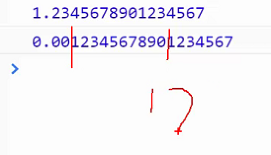

> 入门的时候发现：靠，原来他妈的这么简单
>
> 进阶的时候发现：屮，以前原来什么都不懂
>
> 高级的时候发现：娘的，还有很多东西需要学习啊

## JavaScript 介绍

> w3c 是制定规则；
>
> runoob.com		比较全面；
>
> ES6， 全称 ECMAScript 6.0 ，是 JavaScript 的下一个版本标准，2015.06 发版。
>
> ES6 主要是为了解决 ES5 的先天不足，比如 JavaScript 里并没有类的概念，但是目前浏览器的 JavaScript 是 ES5 版本，大多数高版本的浏览器也支持 ES6，不过只实现了 ES6 的部分特性和功能。


> js是脚本语言
>
> Es官方版本 es6
>
> js6的版本
>
> JavaScript 是互联网上最流行的脚本语言，这门语言可用于 HTML 和 web，更可广泛用于服务器、PC、笔记本电脑、平板电脑和智能手机等设备。


JS 基础


## 终端运行js文件

```sh
➜  code-19-09 git:(master) ✗ pwd                                                     
/Users/tianzi/Desktop/云课堂4.3g/H5/4-javascript核心语法/code-19-09
➜  code-19-09 git:(master) ✗ node 1     
this is 1.js
➜  code-19-09 git:(master) ✗ node 1.js 
this is 1.js
➜  code-19-09 git:(master) ✗ node 1.js
this is 1.js
adsadsad
➜  code-19-09 git:(master) ✗ 

```


**JavaScript 是脚本语言**

avaScript 是一种轻量级的编程语言。

JavaScript 是可插入 HTML 页面的编程代码。

JavaScript 插入 HTML 页面后，可由所有的现代浏览器执行。

JavaScript 很容易学习。

**为什么学习 JavaScript?**

JavaScript web 开发人员必须学习的 3 门语言中的一门：

1. **HTML** 定义了网页的内容
2. **CSS** 描述了网页的布局
3. **JavaScript** 网页的行为

**JavaScript 用法**

> HTML 中的脚本必须位于` <script>` 与` </script>` 标签之间。
>
> 脚本可被放置在 HTML 页面的 `<body> `和 `<head>` 部分中。

**`<script>` 标签**

如需在 HTML 页面中插入 JavaScript，请使用 `<script>` 标签。

<script> 和 </script> 会告诉 JavaScript 在何处开始和结束。
<script> 和 </script> 之间的代码行包含了 JavaScript:
```
<script>
alert("我的第一个 JavaScript");
</script>
```

浏览器会解释并执行位于` <script>` 和 `</script>`之间的 JavaScript 代码

**JavaScript 函数和事件**

JavaScript *函数*是一种 JavaScript 代码块，它可以在调用时被执行。

例如，当发生*事件*时调用函数，比如当用户点击按钮时。

**`<head>` 或 `<body>` 中的 JavaScript**

您能够在 HTML 文档中放置任意数量的脚本。

脚本可被放置与 HTML 页面的 <body> 或 <head> 部分中，或兼而有之。

通常的做法是把函数放入 `<head>` 部分中，或者放在页面底部。这样就可以把它们安置到同一处位置，不会干扰页面的内容。

**外部的 JavaScript**

也可以把脚本保存到外部文件中。外部文件通常包含被多个网页使用的代码。

外部 JavaScript 文件的文件扩展名是 .js。

如需使用外部文件，请在 `<script>` 标签的 “src” 属性中设置该 .js 文件：

```
<!DOCTYPE html>
<html>
<body>
<script src="myScript.js">中间加任何东西都不会出现，和显示的 </script>
</body>
</html>
```

## JavaScript 输出

**JavaScript 显示数据**

JavaScript 可以通过不同的方式来输出数据：(放在<script>中见</script>)

- 使用 **window.alert()** 弹出警告框。  
- 使用 **document.write()** 方法将内容写到 HTML 文档中。
- 使用 **innerHTML** 写入到 HTML 元素。
- 使用 **console.log()** 写入到浏览器的控制台。

**操作 HTML 元素**

如需从 JavaScript 访问某个 HTML 元素，您可以使用 document.getElementById(*id*) 方法。

请使用 “id” 属性来标识 HTML 元素，并 innerHTML 来获取或插入元素内容：

```
<!DOCTYPE html>
<html>
<body>

<h1>我的第一个 Web 页面</h1>

<p id="demo">我的第一个段落</p>

<script>
document.getElementById("demo").innerHTML = "段落已修改。";
</script>

</body>
</html>
```

> ​	以上 JavaScript 语句（在
>
> **document.getElementById(“demo”)** 是使用 id 属性来查找 HTML 元素的 JavaScript 代码 。
>
> **innerHTML = “段落已修改。”** 是用于修改元素的 HTML 内容(innerHTML)的 JavaScript 代码。
>
> **写到 HTML 文档**
>
> 


出于测试目的，您可以将JavaScript直接写在HTML 文档中：

```
<!DOCTYPE html>
<html>
<body>

<h1>我的第一个 Web 页面</h1>

<p>我的第一个段落。</p>

<script>
document.write(Date());
</script>

</body>
</html>
```

请使用 document.write() 仅仅向文档输出写内容。

如果在文档已完成加载后执行 document.write，整个 HTML 页面将被覆盖。

>
>
>### 写到控制台
>
>如果您的浏览器支持调试，你可以使用 **console.log()** 方法在浏览器中显示 JavaScript 值。
>
>浏览器中使用 F12 来启用调试模式， 在调试窗口中点击 “Console” 菜单。
>
>```
><h7>我的第二个</h7>
><h8>我的第二个</h8>
><h9>我的第二个</h9>
>上面属于文本；
>```


```php+HTML
<!DOCTYPE html>
<html>
<body>

<h1>我的第一个 Web 页面</h1>
<h7>我的第二个</h7>
<h8>我的第二个</h8>
<h9>我的第二个</h9>
<script>
a = 5;
b = 6;
c = a + b;
console.log(c);
</script>

</body>
</html>
```

## JavaScript 语法

在 HTML 中，JavaScript 语句向浏览器发出的命令。

语句是用分号分隔,并且区分大小写;

原来的js叫做es

```
ES5中，js中数据类型：
number、string、boolean、undefined、null、object

1. typeof
 可以判断 js 中基本数据类型，但无法判断对象的具体类型 

2. Object.prototype.toString.call(1)
可以判断具体的对象类型，包括正则等，但是无法判断自定义对象类型。

3. instanceof    false true
用法：变量 nstaceof 对象，返回值为boolean。
仅能判断对象的具体类型，但可以拥于判断自定义对象类型。

4. constructor
查看对象对应的构造函数
object的每个实例都具有属性constructor，保存着用于创建当前对象的函数。


var a=1001
console.log(typeof('sss'+12e5))
console.log(Object.prototype.toString.call(123e5))
console.log(a instanceof Number);
console.log(a.constructor)

js用法.html?_ijt=2r6nuqj7r9johae4qf0v1a2mcd:29 string
js用法.html?_ijt=2r6nuqj7r9johae4qf0v1a2mcd:30 [object Number]
js用法.html?_ijt=2r6nuqj7r9johae4qf0v1a2mcd:33 false
js用法.html?_ijt=2r6nuqj7r9johae4qf0v1a2mcd:34 ƒ Number() { [native code] }


ƒ Object() { [native code] }
js用法.html?_ijt=nairsf8dvuv09u05d6c7quu23f:30 false
js用法.html?_ijt=nairsf8dvuv09u05d6c7quu23f:32 number
js用法.html?_ijt=nairsf8dvuv09u05d6c7quu23f:33 [object Number]
js用法.html?_ijt=nairsf8dvuv09u05d6c7quu23f:34 ƒ Number() { [native code] }
```


**字面量**

在编程语言中，一般固定值称为字面量，如 3.14。

**数字（Number）字面量** 可以是整数或者是小数，或者是科学计数(e)。

```
3.14
1001
123e5
```

**字符串（String）字面量** 可以使用单引号或双引号

```
"John Doe"
'John Doe'
```

**表达式字面量** 用于计算

```
5 + 6
5 * 10
```

**数组（Array）字面量** 定义一个数组

```
[40, 100, 1, 5, 25, 10]
```

**对象（Object）字面量** 定义一个对象：

```
{firstName:"John", lastName:"Doe", age:50, eyeColor:"blue"}
```

**函数(Function) 字面量** 定义一个函数:

```
function myFunction(a, b) { return a * b;}
```

**变量**

在编程语言中，变量用于存储数据值。

JavaScript 使用关键字 **var** 来定义变量， 使用等号来为变量赋值：

```
var x, length
x = 5
length = 6
```

变量可以通过变量名访问。在指令式语言中，变量通常是可变的。字面量是一个恒定的值。

**操作符**

| 类型                   | 实例      | 描述                   |
| :--------------------- | :-------- | :--------------------- |
| 赋值，算术和位运算符   | = + - * / | 在 JS 运算符中描述     |
| 条件，比较及逻辑运算符 | == != < > | 在 JS 比较运算符中描述 |

JavaScript使用 **算术运算符** 来计算值:

```
(5 + 6) * 10
```

JavaScript使用**赋值运算符**给变量赋值：

```
x = 5
y = 6
z = (x + y) * 10
```

**关键字**

JavaScript 关键字用于标识要执行的操作。

和其他任何编程语言一样，JavaScript 保留了一些关键字为自己所用。

|          |            |            |              |||||
| :------: | :--------: | :--------: | :----------: | :--------: | :--------: | :----------: |:----------: |
| abstract |    else    | instanceof |    super     | 摘要| 其他| instanceof | 超级|
| boolean  |    enum    |    int     |    switch    | 布尔| 枚举 int | 开关|
|  break   |   export   | interface  | synchronized |打破| 出口| 界面| 同步|
|   byte   |  extends   |    let     |     this     |字节| 延伸| 让| 这个|
|   case   |   false    |    long    |    throw     | 案例 |错误| 长| 扔|
|  catch   |   final    |   native   |    throws    | 抓 |最后| 本机| 抛出|
|   char   |  finally   |    new     |  transient   | 字符| 最后 |新 |瞬态|
|  class   |   float    |    null    |     true     | 类| 浮动| 空| 真实|
|  const   |    for     |  package   |     try      | const | 为| 包装 |尝试|
| continue |  function  |  private   |    typeof    | 继续| 功能| 私人| 类型|
| debugger |    goto    | protected  |     var      | 调试器| 转到| 受保护| var |
| default  |     if     |   public   |     void     | 默认值 如果| 公共| 无效|
|  delete  | implements |   return   |   volatile   | 删除| 工具| 返回| 易挥发|
|    do    |   import   |   short    |    while     | 做| 进口| 短| 当|
|  double  |     in     |   static   |     with     | 双| 在| 静态| 与|

### 注释

不是所有的 JavaScript 语句都是”命令”。双斜杠 **//** 后的内容将会被浏览器忽略：

```
// 注释内容


```

### 数据类型

JavaScript 有多种数据类型：数字，字符串，数组，对象等等：

```
var length = 16;                                  // Number 通过数字字面量赋值 
var points = x * 10;                              // Number 通过表达式字面量赋值
var lastName = "Johnson";                         // String 通过字符串字面量赋值
var cars = ["Saab", "Volvo", "BMW"];              // Array  通过数组字面量赋值
var person = {firstName:"John", lastName:"Doe"};  // Object 通过对象字面量赋值
```

### 函数

JavaScript 语句可以写在函数内，函数可以重复引用：

**引用一个函数** = 调用函数(执行函数内的语句)。

```
function myFunction(a, b) {
   	return a * b;                                // 返回 a 乘以 b 的结果
}
```

### 字符集

JavaScript 使用 Unicode 字符集。

Unicode 覆盖了所有的字符，包含标点等字符。

## JavaScript 语句

JavaScript 语句是发给浏览器的命令。

这些命令的作用是告诉浏览器要做的事情。

下面的 JavaScript 语句向 id=”demo” 的 HTML 元素输出文本 “你好 Dolly” ：

```
document.getElementById("demo").innerHTML = "你好 Dolly";
```

### 分号 ;

分号用于分隔 JavaScript 语句。

通常我们在每条可执行的语句结尾添加分号。

使用分号的另一用处是在一行中编写多条语句。

### 代码

JavaScript 代码是 JavaScript 语句的序列。

浏览器按照编写顺序依次执行每条语句。

本例向网页输出一个标题和两个段落：

```
document.getElementById("demo").innerHTML="你好 Dolly";
document.getElementById("myDIV").innerHTML="你最近怎么样?";
```

### 语句标识符

avaScript 语句通常以一个 **语句标识符** 为开始，并执行该语句。

语句标识符是保留关键字不能作为变量名使用。

下表列出了 JavaScript 语句标识符 (关键字) ：

| 语句       | 描述                                                         |
| :--------- | :----------------------------------------------------------- |
| break      | 用于跳出循环。                                               |
| catch      | 语句块，在 try 语句块执行出错时执行 catch 语句块。           |
| continue   | 跳过循环中的一个迭代。                                       |
| do … while | 执行一个语句块，在条件语句为 true 时继续执行该语句块。       |
| for        | 在条件语句为 true 时，可以将代码块执行指定的次数。           |
| for … in   | 用于遍历数组或者对象的属性（对数组或者对象的属性进行循环操作）。 |
| function   | 定义一个函数                                                 |
| if … else  | 用于基于不同的条件来执行不同的动作。                         |
| return     | 退出函数                                                     |
| switch     | 用于基于不同的条件来执行不同的动作。                         |
| throw      | 抛出（生成）错误 。                                          |
| try        | 实现错误处理，与 catch 一同使用。                            |
| var        | 声明一个变量。                                               |
| while      | 当条件语句为 true 时，执行语句块。                           |

## JavaScript 注释

JavaScript 不会执行注释。

我们可以添加注释来对 JavaScript 进行解释，或者提高代码的可读性。

### 单行注释

单行注释以 **//** 开头。

```
// 输出标题：
document.getElementById("myH1").innerHTML="欢迎来到我的主页";
// 输出段落：
document.getElementById("myP").innerHTML="这是我的第一个段落。";
```

### 多行注释

多行注释以 **/\*** 开始，以 ***/** 结尾。

```
/*
下面的这些代码会输出
一个标题和一个段落
并将代表主页的开始
*/
document.getElementById("myH1").innerHTML="欢迎来到我的主页";
document.getElementById("myP").innerHTML="这是我的第一个段落。";
```

## JavaScript 变量

变量是用于存储信息的”容器”。

- 变量必须以字母开头
- 变量也能以 $ 和 _ 符号开头（不过我们不推荐这么做）
- 变量名称对大小写敏感（y 和 Y 是不同的变量）

### 声明变量

在 JavaScript 中创建变量通常称为”声明”变量。

我们使用 var 关键词来声明变量：

```
var carname;
```

变量声明之后，该变量是空的（它没有值）。

如需向变量赋值，使用等号：

```
carname="Volvo";
```

不过，您也可以在声明变量时对其赋值：

```
var carname="Volvo";
```

### 一条语句，多个变量

在一条语句中声明很多变量。该语句以 var 开头，并使用逗号分隔变量即可：

```
var lastname="Doe", age=30, job="carpenter";
```

声明也可横跨多行：

```
var lastname="Doe",
age=30,
job="carpenter";
```

一条语句中声明的多个不可以赋同一个值:

```
var x,y,z=1;
```

x,y 为 undefined， z 为 1。

### undefined

### Value = undefined

在计算机程序中，经常会声明无值的变量。未使用值来声明的变量，其值实际上是 undefined。

```
在执行过以下语句后，变量 carname 的值将是 undefined：
var carname;
```

### 重新声明

如果重新声明 JavaScript 变量，该变量的值不会丢失：

在以下两条语句执行后，变量 carname 的值依然是 “Volvo”：

```
var carname="Volvo"; 
var carname;
```

## JavaScript 数据类型

> **值类型(基本类型)**：字符串（String）、数字(Number)、布尔(Boolean)、对空（Null）、未定义（Undefined）、Symbol。
>
> **引用数据类型**：对象(Object)、数组(Array)、函数(Function)。

**注：**Symbol 是 ES6 引入了一种新的原始数据类型，表示独一无二的值。

在 JavaScript 中有 5 种不同的数据类型：

- string
- number
- boolean
- object
- function

3 种对象类型：

- Object
- Date
- Array

2 个不包含任何值的数据类型：

- null
- undefined

### 字符串

字符串是存储字符（比如 “Bill Gates”）的变量。

字符串可以是引号中的任意文本。使用单引号或双引号：

```
var carname="Volvo XC60";
var carname='Volvo XC60';
```

可以在字符串中使用引号，只要不匹配包围字符串的引号即可：

```
var answer="It's alright";
var answer="He is called 'Johnny'";
var answer='He is called "Johnny"';
```

### 数字

JavaScript 只有一种数字类型。数字可以带小数点，也可以不带,

极大或极小的数字可以通过科学（指数）计数法来书写

### 布尔

布尔（逻辑）只能有两个值：true 或 false。

```
var x=true;
var y=false;
```

### 数组

下面的代码创建名为 cars 的数组：

```
var cars=new Array();
cars[0]="Saab";
cars[1]="Volvo";
cars[2]="BMW";
```

```
var cars=new Array("Saab","Volvo","BMW");
```

```
var cars=["Saab","Volvo","BMW"];
```

数组下标是基于零的，所以第一个项目是 [0]，第二个是 [1]，以此类推。

### 对象

对象由花括号分隔。在括号内部，对象的属性以名称和值对的形式 (name : value) 来定义。属性由逗号分隔：

```
var person={firstname:"John", lastname:"Doe", id:5566};
```

上面例子中的对象 (person) 有三个属性：firstname、lastname 以及 id。

空格和折行无关紧要。声明可横跨多行：

```
var person={
firstname : "John",
lastname  : "Doe",
id        :  5566
};
```

对象属性有两种寻址方式：

```
name=person.lastname;
name=person["lastname"];
```

### undefined 和 Null

Undefined 这个值表示变量不含有值。

可以通过将变量的值设置为 null 来清空变量。

```
cars=null;
person=null;
```

### 声明变量类型

可以使用关键词 “new” 来声明其类型：

```
var carname=new String;
var x=      new Number;
var y=      new Boolean;
var cars=   new Array;
var person= new Object;
```

JavaScript 变量均为对象。当您声明一个变量时，就创建了一个新的对象。

## JavaScript 字符串

字符串可以存储一系列字符

字符串可以是插入到引号中的任何字符。你可以使用单引号或双引号：

```
var carname = "Volvo XC60";
var carname = 'Volvo XC60';
```

可以使用索引位置来访问字符串中的每个字符：

```
var character = carname[7];
```

字符串的索引从 0 开始，这意味着第一个字符索引值为 [0],第二个为 [1], 以此类推。

可以在字符串中使用引号，字符串中的引号不要与字符串的引号相同:

```
var answer = "It's alright";
var answer = "He is called 'Johnny'";
var answer = 'He is called "Johnny"';
```

也可以在字符串添加转义字符来使用引号：

```
var x = 'It\'s alright';
var y = "He is called \"Johnny\"";
```

### 字符串长度

可以使用内置属性 **length** 来计算字符串的长度：

```
var txt = "ABCDEFGHIJKLMNOPQRSTUVWXYZ";
var sln = txt.length;
```

### 特殊字符

反斜杠是一个**转义字符**。 转义字符将特殊字符转换为字符串字符：

转义字符 () 可以用于转义撇号，换行，引号，等其他特殊字符。

| 代码 | 输出        |
| :--- | :---------- |
| '    | 单引号      |
| "    | 双引号      |
| \    | 反斜杠      |
| \n   | 换行        |
| \r   | 回车        |
| \t   | tab(制表符) |
| \b   | 退格符      |
| \f   | 换页符      |

### 字符串对象

通常， JavaScript 字符串是原始值，可以使用字符创建： **var firstName = “John”**

也可以使用 new 关键字将字符串定义为一个对象： **var firstName = new String(“John”)**

### 字符串属性

| 属性        | 描述                       |
| :---------- | :------------------------- |
| constructor | 返回创建字符串属性的函数   |
| length      | 返回字符串的长度           |
| prototype   | 允许您向对象添加属性和方法 |

### 字符串方法

| 方法                | 描述                                                         |
| :------------------ | :----------------------------------------------------------- |
| charAt()            | 返回指定索引位置的字符                                       |
| charCodeAt()        | 返回指定索引位置字符的 Unicode 值                            |
| concat()            | 连接两个或多个字符串，返回连接后的字符串                     |
| fromCharCode()      | 将 Unicode 转换为字符串                                      |
| indexOf()           | 返回字符串中检索指定字符第一次出现的位置                     |
| lastIndexOf()       | 返回字符串中检索指定字符最后一次出现的位置                   |
| localeCompare()     | 用本地特定的顺序来比较两个字符串                             |
| match()             | 找到一个或多个正则表达式的匹配                               |
| replace()           | 替换与正则表达式匹配的子串                                   |
| search()            | 检索与正则表达式相匹配的值                                   |
| slice()             | 提取字符串的片断，并在新的字符串中返回被提取的部分           |
| split()             | 把字符串分割为子字符串数组                                   |
| substr()            | 从起始索引号提取字符串中指定数目的字符                       |
| substring()         | 提取字符串中两个指定的索引号之间的字符                       |
| toLocaleLowerCase() | 根据主机的语言环境把字符串转换为小写，只有几种语言（如土耳其语）具有地方特有的大小写映射 |
| toLocaleUpperCase() | 根据主机的语言环境把字符串转换为大写，只有几种语言（如土耳其语）具有地方特有的大小写映射 |
| toLowerCase()       | 把字符串转换为小写                                           |
| toString()          | 返回字符串对象值                                             |
| toUpperCase()       | 把字符串转换为大写                                           |
| trim()              | 移除字符串首尾空白                                           |
| valueOf()           | 返回某个字符串对象的原始值                                   |

## JavaScript 对象

对象也是一个变量，但对象可以包含多个值（多个变量）。

```
var car = {type:"Fiat", model:500, color:"white"};
```

在以上实例中，3 个值 (“Fiat”, 500, “white”) 赋予变量 car。

在以上实例中，3 个变量 (type, model, color) 赋予变量 car。

### 对象的定义

可以使用字符来定义和创建 JavaScript 对象:

```
var person = {firstName:"John", lastName:"Doe", age:50, eyeColor:"blue"};
```

定义 JavaScript 对象可以跨越多行，空格跟换行不是必须的：

```
var person = {
    firstName:"John",
    lastName:"Doe",
    age:50,
    eyeColor:"blue"
};
```

### 对象属性

可以说 “JavaScript 对象是变量的容器”。

但是，我们通常认为 “JavaScript 对象是键值对的容器”。

键值对通常写法为 **name : value** (键与值以冒号分割)。

键值对在 JavaScript 对象通常称为 **对象属性**。

### 访问对象属性

1. person.lastName;
2. person[“lastName”];

### 对象方法

对象的方法定义了一个函数，并作为对象的属性存储。

对象方法通过添加 () 调用 (作为一个函数)。

该实例访问了 person 对象的 fullName() 方法:

```
name = person.fullName();
```

如果要访问 person 对象的 fullName 属性，它将作为一个定义函数的字符串返回：

```
name = person.fullName;
```

JavaScript 对象是属性和方法的容器。

### 访问对象的方法

可以使用以下语法创建对象方法：

```
methodName : function() { code lines }
```

可以使用以下语法访问对象方法：

```
objectName.methodName()
```

## JavaScript 函数

函数是由事件驱动的或者当它被调用时执行的可重复使用的代码块。

```
<!DOCTYPE html>
<html>
<head>
<meta charset="utf-8">
<title>测试实例</title>
<script>
function myFunction()
{
    alert("Hello World!");
}
</script>
</head>
 
<body>
<button onclick="myFunction()">点我</button>
</body>
</html>
```

### 函数语法

函数就是包裹在花括号中的代码块，前面使用了关键词 function：

```
function functionname()
{
    // 执行代码
}
```

当调用该函数时，会执行函数内的代码。

可以在某事件发生时直接调用函数（比如当用户点击按钮时），并且可由 JavaScript 在任何位置进行调用。

### 调用带参数的函数

在调用函数时，您可以向其传递值，这些值被称为参数。

这些参数可以在函数中使用。

可以发送任意多的参数，由逗号 (,) 分隔：

```
myFunction(argument1,argument2)
```

当声明函数时，请把参数作为变量来声明：

```JavaScript
function myFunction(var1,var2)
{
//代码
}
```

变量和参数必须以一致的顺序出现。第一个变量就是第一个被传递的参数的给定的值，以此类推。

### 带有返回值的函数

有时，我们会希望函数将值返回调用它的地方。

通过使用 return 语句就可以实现。

在使用 return 语句时，函数会停止执行，并返回指定的值。

```
function myFunction()
{
    var x=5;
    return x;
}
```

### 局部变量

在 JavaScript 函数内部声明的变量（使用 var）是*局部*变量，所以只能在函数内部访问它。（该变量的作用域是局部的）。

您可以在不同的函数中使用名称相同的局部变量，因为只有声明过该变量的函数才能识别出该变量。

只要函数运行完毕，本地变量就会被删除。

### 全局变量

在函数外声明的变量是*全局*变量，网页上的所有脚本和函数都能访问它。

### 变量的生存期

JavaScript 变量的生命期从它们被声明的时间开始。

局部变量会在函数运行以后被删除。

全局变量会在页面关闭后被删除。

### 向未声明的变量分配值

如果您把值赋给尚未声明的变量，该变量将被自动作为 window 的一个属性。

```
carname="Volvo";
```

将声明 window 的一个属性 carname。

非严格模式下给未声明变量赋值创建的全局变量，是全局对象的可配置属性，可以删除。

```
var var1 = 1; // 不可配置全局属性
var2 = 2; // 没有使用 var 声明，可配置全局属性

console.log(this.var1); // 1
console.log(window.var1); // 1

delete var1; // false 无法删除
console.log(var1); //1

delete var2; 
console.log(delete var2); // true
console.log(var2); // 已经删除 报错变量未定义
```

## JavaScript 作用域

> 在 JavaScript 中, 对象和函数同样也是变量。
>
> **作用域为可访问变量，对象，函数的集合。**
>
> JavaScript 函数作用域: 作用域在函数内修改。

### 局部作用域

变量在函数内声明，变量为局部作用域。

局部变量：只能在函数内部访问。

```
// 此处不能调用 carName 变量
function myFunction() {
    var carName = "Volvo";
    // 函数内可调用 carName 变量
}
```

因为局部变量只作用于函数内，所以不同的函数可以使用相同名称的变量。

局部变量在函数开始执行时创建，函数执行完后局部变量会自动销毁。

### 全局变量

变量在函数外定义，即为全局变量。

全局变量有 **全局作用域**: 网页中所有脚本和函数均可使用。

```
var carName = " Volvo";
 
// 此处可调用 carName 变量
function myFunction() {
    // 函数内可调用 carName 变量
}
```

如果变量在函数内没有声明（没有使用 var 关键字），该变量为全局变量。

以下实例中 carName 在函数内，但是为全局变量。

### 变量生命周期

JavaScript 变量生命周期在它声明时初始化。

局部变量在函数执行完毕后销毁。

全局变量在页面关闭后销毁。

### 函数参数

函数参数只在函数内起作用，是局部变量。

### HTML 中的全局变量

在 HTML 中, 全局变量是 window 对象: 所有数据变量都属于 window 对象。

```
//此处可使用 window.carName
 
function myFunction() {
    carName = "Volvo";
}
```

## JavaScript 事件

> HTML 事件是发生在 HTML 元素上的事情。
>
> 当在 HTML 页面中使用 JavaScript 时， JavaScript 可以触发这些事件。

### HTML 事件

HTML 事件可以是浏览器行为，也可以是用户行为。

以下是 HTML 事件的实例：

- HTML 页面完成加载
- HTML input 字段改变时
- HTML 按钮被点击

通常，当事件发生时，你可以做些事情。

在事件触发时 JavaScript 可以执行一些代码。

HTML 元素中可以添加事件属性，使用 JavaScript 代码来添加 HTML 元素。

单引号:

```
<some-HTML-element some-event='JavaScript 代码'>
```

双引号:

```
<some-HTML-element some-event="JavaScript 代码">
```

### 常见的HTML事件

| 事件          | 描述                          |
| :------------ | :---------------------------- |
| onchange      | HTML 元素改变                 |
| onclick       | 用户点击 HTML 元素            |
| onmouseover   | 用户在一个HTML元素上移动鼠标  |
| onmouseout    | 用户从一个HTML元素上移开鼠标  |
| onkeydown     | 用户按下键盘按键              |
| <u>onload</u> | <u>浏览器已完成页面的加载</u> |

事件可以用于处理表单验证，用户输入，用户行为及浏览器动作:

- 页面加载时触发事件
- 页面关闭时触发事件
- 用户点击按钮执行动作
- 验证用户输入内容的合法性
- 等等 …

可以使用多种方法来执行 JavaScript 事件代码：

- HTML 事件属性可以直接执行 JavaScript 代码
- HTML 事件属性可以调用 JavaScript 函数
- 你可以为 HTML 元素指定自己的事件处理程序
- 你可以阻止事件的发生。
- 等等 …

## JavaScript 运算符

### 算术运算符

- `+`
- `-`
- `*`
- `/`

### 字符串拼接

`+` 运算符用于把文本值或字符串变量加起来（连接起来）。

如需把两个或多个字符串变量连接起来，请使用 + 运算符。

```
txt1="What a very";
txt2="nice day";
txt3=txt1+txt2;
>>What a very nice day
```

### 字符串和数字的加法运算

两个数字相加，返回数字相加的和，如果数字与字符串相加，返回字符串，如下实例：

```
x=5+5;
y="5"+5;
z="Hello"+5;
>>10
>>55
>>Hello5
```

**规则:**如果把数字与字符串相加，结果将成为字符串！

### 比较运算符

| 运算符 |                      描述                       |
| :----: | :---------------------------------------------: |
|   ==   |                      等于                       |
|  ===   |             绝对等于(值和类型都相等             |
|   !=   |                     不等于                      |
|  !==   | 不绝对等于(值和类型有一个不相等,或两个都不相等) |
|   >    |                      大于                       |
|   <    |                      小于                       |
|   >=   |                    大于等于                     |
|   <=   |                    小于等于                     |

可以在条件语句中使用比较运算符对值进行比较，然后根据结果来采取行动：

```
if (age<18) x="Too young";
```

### 逻辑与算符

逻辑运算符用于测定变量或值之间的逻辑。

给定 x=6 以及 y=3，下表解释了逻辑运算符：

| 运算符 | 描述 | 例子                      |
| :----- | :--- | :------------------------ |
| &&     | and  | (x < 10 && y > 1) 为 true |
| \|\|   | or   | (x==5 \|\| y==5) 为 false |
| !      | not  | !(x==y) 为 true           |

### 条件运算符

JavaScript 还包含了基于某些条件对变量进行赋值的条件运算符。

```
variablename=(condition)?value1:value2 
```

**实例:**

如果变量 age 中的值小于 18，则向变量 voteable 赋值 “年龄太小”，否则赋值 “年龄已达到”。

```
voteable=(age<18)?"年龄太小":"年龄已达到";
```

## JavaScript 条件语句

> 条件语句用于基于不同的条件来执行不同的动作。

- **if 语句** - 只有当指定条件为 true 时，使用该语句来执行代码
- **if…else 语句** - 当条件为 true 时执行代码，当条件为 false 时执行其他代码
- **if…else if….else 语句**- 使用该语句来选择多个代码块之一来执行
- **switch 语句** - 使用该语句来选择多个代码块之一来执行

### if 语句

只有当指定条件为 true 时，该语句才会执行代码。

```
if (condition)
{
    当条件为 true 时执行的代码
}
```

### if…else 语句

使用 if….else 语句在条件为 true 时执行代码，在条件为 false 时执行其他代码。

```
if (condition)
{
    当条件为 true 时执行的代码
}
else
{
    当条件不为 true 时执行的代码
}
```

### if…else if…else 语句

使用 if….else if…else 语句来选择多个代码块之一来执行。

```
if (condition1)
{
    当条件 1 为 true 时执行的代码
}
else if (condition2)
{
    当条件 2 为 true 时执行的代码
}
else
{
  当条件 1 和 条件 2 都不为 true 时执行的代码
}
```

### switch 语句

使用 switch 语句来选择要执行的多个代码块之一。

```
switch(n)
{
    case 1:
        执行代码块 1
        break;
    case 2:
        执行代码块 2
        break;
    default:
        与 case 1 和 case 2 不同时执行的代码
}
```

工作原理：首先设置表达式 *n*（通常是一个变量）。随后表达式的值会与结构中的每个 case 的值做比较。如果存在匹配，则与该 case 关联的代码块会被执行。请使用 **break** 来阻止代码自动地向下一个 case 运行。

```
var d=new Date().getDay(); 
switch (d) 
{ 
  case 0:x="今天是星期日"; 
  break; 
  case 1:x="今天是星期一"; 
  break; 
  case 2:x="今天是星期二"; 
  break; 
  case 3:x="今天是星期三"; 
  break; 
  case 4:x="今天是星期四"; 
  break; 
  case 5:x="今天是星期五"; 
  break; 
  case 6:x="今天是星期六"; 
  break; 
}
```

### default 关键字

使用 default 关键词来规定匹配不存在时做的事情：

```
var d=new Date().getDay();
switch (d)
{
    case 6:x="今天是星期六";
    break;
    case 0:x="今天是星期日";
    break;
    default:
    x="期待周末";
}
document.getElementById("demo").innerHTML=x;
```

## JavaScript 循环

JavaScript 支持不同类型的循环：

- **for** - 循环代码块一定的次数
- **for/in** - 循环遍历对象的属性
- **while** - 当指定的条件为 true 时循环指定的代码块
- **do/while** - 同样当指定的条件为 true 时循环指定的代码块

### For 循环

```
for (语句 1; 语句 2; 语句 3)
{
    被执行的代码块
}
```

**语句 1** （代码块）开始前执行

**语句 2** 定义运行循环（代码块）的条件

**语句 3** 在循环（代码块）已被执行之后执行

```
for (var i=0; i<5; i++)
{
      x=x + "该数字为 " + i + "<br>";
}
```

### For/In 循环

JavaScript for/in 语句循环遍历对象的属性：

```
var person={fname:"John",lname:"Doe",age:25}; 
 
for (x in person)  // x 为属性名
{
    txt=txt + person[x];
}
```

### While 循环

while 循环会在指定条件为真时循环执行代码块。

```
while (条件)
{
    需要执行的代码
}
```

### do/while 循环

do/while 循环是 while 循环的变体。该循环会在检查条件是否为真之前执行一次代码块，然后如果条件为真的话，就会重复这个循环。

```
do
{
    需要执行的代码
}
while (条件);
```

### Break 语句

break 语句用于跳出循环。

break 语句跳出循环后，会继续执行该循环之后的代码

continue 语句（带有或不带标签引用）只能用在循环中。

break 语句（不带标签引用），只能用在循环或 switch 中。

通过标签引用，break 语句可用于跳出任何 JavaScript 代码块：

```
cars=["BMW","Volvo","Saab","Ford"];
list: 
{
    document.write(cars[0] + "<br>"); 
    document.write(cars[1] + "<br>"); 
    document.write(cars[2] + "<br>"); 
    break list;
    document.write(cars[3] + "<br>"); 
    document.write(cars[4] + "<br>"); 
    document.write(cars[5] + "<br>"); 
}
```

### Continue 语句

**continue 语句**中断循环中的迭代，如果出现了指定的条件，然后继续循环中的下一个迭代。

## JavaScript typeof

### typeof 操作符

可以使用 typeof 操作符来检测变量的数据类型

```
typeof "John"                // 返回 string 
typeof 3.14                  // 返回 number
typeof false                 // 返回 boolean
typeof [1,2,3,4]             // 返回 object
typeof {name:'John', age:34} // 返回 object
```

在JavaScript中，数组是一种特殊的对象类型。 因此 typeof [1,2,3,4] 返回 object。

 注意:

- NaN 的数据类型是 number
- 数组(Array)的数据类型是 object
- 日期(Date)的数据类型为 object
- null 的数据类型是 object
- 未定义变量的数据类型为 undefined

### null

null是一个只有一个值的特殊类型。表示一个空对象引用。

用 typeof 检测 null 返回是object。

可以设置为 null 来清空对象:

### undefined

在 JavaScript 中, **undefined** 是一个没有设置值的变量。

**typeof** 一个没有值的变量会返回 **undefined**。

## 类型转换（看到这）

js类型转换

> ​	javascript 隐式转换
>
> 只认纯数字；

```js
> isNaN('2')
false
> isNaN(2)
false
> typeof 2
'number'
> x= "2"
'2'
> typeof x
'string'
>有效数字
```

> 有效数字




Number() 转换为数字， String() 转换为字符串， Boolean() 转化为布尔值。

JavaScript 变量可以转换为新变量或其他数据类型：

- 通过使用 JavaScript 函数
- 通过 JavaScript 自身自动转换

### constructor 属性

constructor 属性返回所有 JavaScript 变量的构造函数

```
"John".constructor                 // 返回函数 String()  { [native code] }
(3.14).constructor                 // 返回函数 Number()  { [native code] }
false.constructor                  // 返回函数 Boolean() { [native code] }
[1,2,3,4].constructor              // 返回函数 Array()   { [native code] }
{name:'John', age:34}.constructor  // 返回函数 Object()  { [native code] }
new Date().constructor             // 返回函数 Date()    { [native code] }
function () {}.constructor         // 返回函数 Function(){ [native code] }
```

### 转换为字符串

全局方法 **String()**

方法 **toString()** 也是有同样的效果。

```
# 数值
String(123)       // 将数字 123 转换为字符串并返回
(123).toString()

# 布尔值
String(false)        // 返回 "false"
false.toString()     // 返回 "false"

# 日期
Date()					// 返回字符串 
String(new Date())      // 将日期对象转换为字符串。

obj = new Date()
obj.toString()  
```

### 转换为数字

全局方法 **Number()**

```
# 字符串
Number("3.14")    // 返回 3.14
Number(" ")       // 返回 0 
Number("")        // 返回 0
Number("99 88")   // 返回 NaN

# 布尔值
Number(false)     // 返回 0
Number(true)      // 返回 1

# 日期
d = new Date();
Number(d)          // 返回 1404568027739
# 日期方法 getTime() 直接返回数值类型
d = new Date();
d.getTime()        // 返回 1404568027739
```

**一元运算符 +**

**Operator +** 可用于将变量转换为数字：

```
var y = "5";      // y 是一个字符串
var x = + y;      // x 是一个数字
```

如果变量不能转换，它仍然会是一个数字，但值为 NaN (不是一个数字):

```
var y = "John";   // y 是一个字符串
var x = + y;      // x 是一个数字 (NaN)
```

### 自动转换类型

当 JavaScript 尝试操作一个 “错误” 的数据类型时，会自动转换为 “正确” 的数据类型。

```
5 + null    // 返回 5         null 转换为 0
"5" + null  // 返回"5null"   null 转换为 "null"
"5" + 1     // 返回 "51"      1 转换为 "1"  
"5" - 1     // 返回 4         "5" 转换为 5
```

### 自动转换为字符串

当尝试输出一个对象或一个变量时 JavaScript 会自动调用变量的 toString() 方法：

```
document.getElementById("demo").innerHTML = myVar;

myVar = {name:"Fjohn"}  // toString 转换为 "[object Object]"
myVar = [1,2,3,4]       // toString 转换为 "1,2,3,4"
myVar = new Date()      // toString 转换为 "Fri Jul 18 2014 09:08:55 GMT+0200"
```

数字和布尔值也经常相互转换：

```
myVar = 123             // toString 转换为 "123"
myVar = true            // toString 转换为 "true"
myVar = false           // toString 转换为 "false" 
```

## JavaScript 正则表达式

使用单个字符串来描述、匹配一系列符合某个句法规则的字符串搜索模式。

搜索模式可用于文本搜索和文本替换。

### 语法

```
/正则表达式主体/修饰符(可选)
```

```
var patt = /name/i
```

`/name/i` 是一个正则表达式

`name` 是一个正则表达式主体(用于检索)

`i` 是一个修饰符(搜索不区分大小写)

### search() 方法

用于检索字符串中指定的子字符串，或检索与正则表达式相匹配的子字符串，并返回子串的起始位置。

使用正则表达式搜索”name”字符串,且不区分大小写:

```
var str = "name zhangsan";
var n = str.search(/name/i);
>> 6
```

search 方法可使用字符串作为参数。字符串参数会转换为正则表达式：

```
var str = "Visit Runoob!"; 
var n = str.search("Runoob");
```

### replace() 方法

**replace() 方法** 用于在字符串中用一些字符替换另一些字符，或替换一个与正则表达式匹配的子串。

使用正则表达式且不区分大小写将字符串中的 Microsoft 替换为 Runoob :

```
var str = document.getElementById("demo").innerHTML; 
var txt = str.replace(/microsoft/i,"Runoob");
>> Visit Runoob
```

replace() 方法将接收字符串作为参数：

```
var str = document.getElementById("demo").innerHTML; 
var txt = str.replace("Microsoft","Runoob");
```

### 正则表达式修饰符

| 修饰符 | 描述                                                     |
| :----- | :------------------------------------------------------- |
| i      | 执行对大小写不敏感的匹配。                               |
| g      | 执行全局匹配（查找所有匹配而非在找到第一个匹配后停止）。 |
| m      | 执行多行匹配。                                           |

### 正则表达式模式

方括号用于查找某个范围内的字符：

| 表达式                                                       | 描述                               |
| :----------------------------------------------------------- | :--------------------------------- |
| [[abc\]](https://www.runoob.com/jsref/jsref-regexp-charset.html) | 查找方括号之间的任何字符。         |
| [[^abc]](https://www.runoob.com/jsref/jsref-regexp-charset-not.html) | 查找任何不在方括号之间的字符。     |
| [0-9]                                                        | 查找任何从 0 至 9 的数字。         |
| [a-z]                                                        | 查找任何从小写 a 到小写 z 的字符。 |
| [A-Z]                                                        | 查找任何从大写 A 到大写 Z 的字符。 |
| [A-z]                                                        | 查找任何从大写 A 到小写 z 的字符。 |
| [adgk]                                                       | 查找给定集合内的任何字符。         |
| [^adgk]                                                      | 查找给定集合外的任何字符。         |
| (red\|blue\|green)                                           | 查找任何指定的选项。               |

元字符是拥有特殊含义的字符：

| 元字符                                                       | 描述                                        |
| :----------------------------------------------------------- | :------------------------------------------ |
| [.](https://www.runoob.com/jsref/jsref-regexp-dot.html)      | 查找单个字符，除了换行和行结束符。          |
| [\w](https://www.runoob.com/jsref/jsref-regexp-wordchar.html) | 查找单词字符。                              |
| [\W](https://www.runoob.com/jsref/jsref-regexp-wordchar-non.html) | 查找非单词字符。                            |
| [\d](https://www.runoob.com/jsref/jsref-regexp-digit.html)   | 查找数字。                                  |
| [\D](https://www.runoob.com/jsref/jsref-regexp-digit-non.html) | 查找非数字字符。                            |
| [\s](https://www.runoob.com/jsref/jsref-regexp-whitespace.html) | 查找空白字符。                              |
| [\S](https://www.runoob.com/jsref/jsref-regexp-whitespace-non.html) | 查找非空白字符。                            |
| [\b](https://www.runoob.com/jsref/jsref-regexp-begin.html)   | 匹配单词边界。                              |
| [\B](https://www.runoob.com/jsref/jsref-regexp-begin-not.html) | 匹配非单词边界。                            |
| \0                                                           | 查找 NULL 字符。                            |
| [\n](https://www.runoob.com/jsref/jsref-regexp-newline.html) | 查找换行符。                                |
| \f                                                           | 查找换页符。                                |
| \r                                                           | 查找回车符。                                |
| \t                                                           | 查找制表符。                                |
| \v                                                           | 查找垂直制表符。                            |
| [\xxx](https://www.runoob.com/jsref/jsref-regexp-octal.html) | 查找以八进制数 xxx 规定的字符。             |
| [\xdd](https://www.runoob.com/jsref/jsref-regexp-hex.html)   | 查找以十六进制数 dd 规定的字符。            |
| [\uxxxx](https://www.runoob.com/jsref/jsref-regexp-unicode-hex.html) | 查找以十六进制数 xxxx 规定的 Unicode 字符。 |

词量;

| 量词                                                         | 描述                                                         |
| :----------------------------------------------------------- | :----------------------------------------------------------- |
| [n+](https://www.runoob.com/jsref/jsref-regexp-onemore.html) | 匹配任何包含至少一个 n 的字符串。例如，/a+/ 匹配 “candy” 中的 “a”，”caaaaaaandy” 中所有的 “a”。 |
| [n*](https://www.runoob.com/jsref/jsref-regexp-zeromore.html) | 匹配任何包含零个或多个 n 的字符串。例如，/bo*/ 匹配 “A ghost booooed” 中的 “boooo”，”A bird warbled” 中的 “b”，但是不匹配 “A goat grunted”。 |
| [n?](https://www.runoob.com/jsref/jsref-regexp-zeroone.html) | 匹配任何包含零个或一个 n 的字符串。例如，/e?le?/ 匹配 “angel” 中的 “el”，”angle” 中的 “le”。 |
| [n{X}](https://www.runoob.com/jsref/jsref-regexp-nx.html)    | 匹配包含 X 个 n 的序列的字符串。例如，/a{2}/ 不匹配 “candy,” 中的 “a”，但是匹配 “caandy,” 中的两个 “a”，且匹配 “caaandy.” 中的前两个 “a”。 |
| [n{X,}](https://www.runoob.com/jsref/jsref-regexp-nxcomma.html) | X 是一个正整数。前面的模式 n 连续出现至少 X 次时匹配。例如，/a{2,}/ 不匹配 “candy” 中的 “a”，但是匹配 “caandy” 和 “caaaaaaandy.” 中所有的 “a”。 |
| [n{X,Y}](https://www.runoob.com/jsref/jsref-regexp-nxy.html) | X 和 Y 为正整数。前面的模式 n 连续出现至少 X 次，至多 Y 次时匹配。例如，/a{1,3}/ 不匹配 “cndy”，匹配 “candy,” 中的 “a”，”caandy,” 中的两个 “a”，匹配 “caaaaaaandy” 中的前面三个 “a”。注意，当匹配 “caaaaaaandy” 时，即使原始字符串拥有更多的 “a”，匹配项也是 “aaa”。 |
| [n$](https://www.runoob.com/jsref/jsref-regexp-ndollar.html) | 匹配任何结尾为 n 的字符串。                                  |
| [^n](https://www.runoob.com/jsref/jsref-regexp-ncaret.html)  | 匹配任何开头为 n 的字符串。                                  |
| [?=n](https://www.runoob.com/jsref/jsref-regexp-nfollow.html) | 匹配任何其后紧接指定字符串 n 的字符串。                      |
| [?!n](https://www.runoob.com/jsref/jsref-regexp-nfollow-not.html) | 匹配任何其后没有紧接指定字符串 n 的字符串。                  |

### 使用 test()

test() 方法用于检测一个字符串是否匹配某个模式，如果字符串中含有匹配的文本，则返回 true，否则返回 false。

```
var patt = /e/;  # var patt1=new RegExp("e");
patt.test("The best things in life are free!");
>> true
```

可以不用设置正则表达式的变量，以上两行代码可以合并为一行：

```
/e/.test("The best things in life are free!")
```

### 使用 exec()

exec() 方法用于检索字符串中的正则表达式的匹配。

该函数返回一个数组，其中存放匹配的结果。如果未找到匹配，则返回值为 null。

```
/e/.exec("The best things in life are free!");
>> e
```

## JavaScript 错误

**try** 语句测试代码块的错误。

**catch** 语句处理错误。

**throw** 语句创建自定义错误。

**finally** 语句在 try 和 catch 语句之后，无论是否有触发异常，该语句都会执行。

### 抛出(throw)错误

当错误发生时，当事情出问题时，JavaScript 引擎通常会停止，并生成一个错误消息。

描述这种情况的技术术语是：JavaScript 将**抛出**一个错误。

### try 和 catch

**try** 语句允许我们定义在执行时进行错误测试的代码块。

**catch** 语句允许我们定义当 try 代码块发生错误时，所执行的代码块。

JavaScript 语句 **try** 和 **catch** 是成对出现的。

```
try {
    ...    //异常的抛出
} catch(e) {
    ...    //异常的捕获与处理
} finally {
    ...    //结束处理
}
```

### finally 语句

finally 语句不论之前的 try 和 catch 中是否产生异常都会执行该代码块。

```
function myFunction() {
  var message, x;
  message = document.getElementById("p01");
  message.innerHTML = "";
  x = document.getElementById("demo").value;
  try { 
    if(x == "") throw "值是空的";
    if(isNaN(x)) throw "值不是一个数字";
    x = Number(x);
    if(x > 10) throw "太大";
    if(x < 5) throw "太小";
  }
  catch(err) {
    message.innerHTML = "错误: " + err + ".";
  }
  finally {
    document.getElementById("demo").value = "";
  }
}
```

### Throw 语句

throw 语句允许我们创建自定义错误。

正确的技术术语是：创建或**抛出异常**（exception）。

如果把 throw 与 try 和 catch 一起使用，那么您能够控制程序流，并生成自定义的错误消息。

```
throw exception
```

## JavaScript 调试

> 浏览器启用调试工具一般是按下 F12 键，并在调试菜单中选择 “Console” 。

### console.log() 方法

可以使用 console.log() 方法在调试窗口上打印 JavaScript 值

### debugger 关键字

**debugger** 关键字用于停止执行 JavaScript，并调用调试函数。

这个关键字与在调试工具中设置断点的效果是一样的。

如果没有调试可用，debugger 语句将无法工作。

```
var x = 15 * 5;
debugger;
document.getElementbyId("demo").innerHTML = x;
```

End


## ES6

> ​	很实用的js

## 快捷操作Emmet

> 插件的基本使用总结
>
> 1.Emmet的简介
>
> Emmet (前身为 Zen Coding) 是一个能大幅度提高前端开发效率的工具，能够实现 HTML、CSS 的快速编写。
> 官网地址：http://emmet.io/
> 官方文档：http://docs.emmet.io/cheat-sheet/


**1.1 使用Emmet的好处**

通过使用Emmet的精简语法，可以加速前端的页面书写布局，提高前端的开发效率。

**1.2 简单样例展示**

- 在pycharm编辑器(其它编辑器可以安装Emmet插件进行支持)的HTML文件中输入下面代码：

```html
	div#box>(div#menu>(a.menu-item[href="#"]{菜单$})*4)+div#content>(section.article>ul>(li{相关内容})*3)*2	
```

- 接着按下 tab 键，之前的缩写代码就会自动扩展为完整的 html 代码片断。

```html
	<div id="box">
    <div id="menu">
        <a href="#" class="menu-item">菜单1</a>
        <a href="#" class="menu-item">菜单2</a>
        <a href="#" class="menu-item">菜单3</a>
        <a href="#" class="menu-item">菜单4</a>
    </div>
    <div id="content">
        <section class="article">
            <ul>
                <li>相关内容</li>
                <li>相关内容</li>
                <li>相关内容</li>
            </ul>
        </section>
        <section class="article">
            <ul>
                <li>相关内容</li>
                <li>相关内容</li>
                <li>相关内容</li>
            </ul>
        </section>
    </div>
</div>

```

看来上面样例演示是不是感觉很神奇，下面将介绍下其基本语法

2. 基本语法

#### 2.1 后代关系：>

缩写：nav>ul>li

```html
<nav>
    <ul>
        <li></li>
    </ul>
</nav>

```

#### 2.2 兄弟关系：+

缩写：div+p

```html
<div></div>
<p></p>
12
```

#### 2.3 上级关系：^

（1）缩写：div+div>p>span+em^p

```html
<div></div>
<div>
    <p><span></span><em></em></p>
    <p></p>
</div>

```

（2）缩写：div+div>p>span+em^^div

```html
<div></div>
<div>
    <p><span></span><em></em></p>
</div>
<div></div>
12345
```

#### 2.4 分组()

（1）缩写：div>(header>ul>li*2>a)+footer>p

```html
<div>
    <header>
        <ul>
            <li><a href=""></a></li>
            <li><a href=""></a></li>
        </ul>
    </header>
    <footer>
        <p></p>
    </footer>
</div>

```

（2）缩写：(div>dl>(dt+dd)*3)+footer>p

```html
<div>
    <dl>
        <dt></dt>
        <dd></dd>
        <dt></dt>
        <dd></dd>
        <dt></dt>
        <dd></dd>
    </dl>
</div>
<footer>
    <p></p>
</footer>
12345678910111213
```

#### 2.5 乘法：*

缩写：ul>li*4

```html
<ul>
    <li></li>
    <li></li>
    <li></li>
    <li></li>
</ul>
123456
```

#### 2.6 自增符号：$

（1）缩写：ul>li.item$*5

```html
<ul>
    <li class="item1"></li>
    <li class="item2"></li>
    <li class="item3"></li>
    <li class="item4"></li>
    <li class="item5"></li>
</ul>
1234567
```

（2）缩写：h[title=item[title=item[*t**i**t**l**e*=*i**t**e**m*]{Header $}*3

```html
<h1 title="item1">Header 1</h1>
<h2 title="item2">Header 2</h2>
<h3 title="item3">Header 3</h3>
123
```

（3）缩写：ul>li.item$$$*5

```html
<ul>
    <li class="item001"></li>
    <li class="item002"></li>
    <li class="item003"></li>
    <li class="item004"></li>
    <li class="item005"></li>
</ul>
1234567
```

（4）缩写：ul>li.item$@-*5

```html
<ul>
    <li class="item5"></li>
    <li class="item4"></li>
    <li class="item3"></li>
    <li class="item2"></li>~~删除线格式~~ 
    <li class="item1"></li>
</ul>
1234567
```

（5）缩写：ul>li.item$@3*5

```html
<ul>
    <li class="item3"></li>
    <li class="item4"></li>
    <li class="item5"></li>
    <li class="item6"></li>
    <li class="item7"></li>
</ul>
1234567
```

#### 2.7 ID和类属性

**ID属性**
缩写：`#header`

```html
<div id="header"></div>
1
```

**类（class）属性**
缩写：`.title`

```html
<div class="title"></div>
1
```

类连写：`p.class1.class2.class3`

```html
<p class="class1 class2 class3"></p>
1
```

**ID和类属性混合**
缩写: `div#content.wide`

```html
<div id="content" class="wide"></div>
1
```

#### 2.8 自定义属性

（1）缩写：`img[src="/img/a.png"][alt="xxxx"]`

```html

1
```

（2）缩写：`td[rowspan=2 colspan=3 title]`

```html
<td rowspan="2" colspan="3" title=""></td>
1
```

#### 2.9 文本：{}

（1）缩写：a{点我}

```html
<a href="">点我</a>
1
```

（2）缩写：p>{点}+a{这里}+{ 继续}

```html
<p>点<a href="">这里</a> 继续</p>
1
```

### HTML标签语法

（1）缩写：!

```html
<!doctype html>
<html lang="en">
<head>
    <meta charset="UTF-8">
    <meta name="viewport"
          content="width=device-width, user-scalable=no, initial-scale=1.0, maximum-scale=1.0, minimum-scale=1.0">
    <meta http-equiv="X-UA-Compatible" content="ie=edge">
    <title>Document</title>
</head>
<body>

</body>
</html>
12345678910111213
```

（2）缩写：a

```html
<a href=""></a>
1
```

（3）缩写：a:link

```html
<a href="http://"></a>
1
```

（4）缩写：a:mail

```html
<a href="mailto:"></a>
1
```

（5）缩写：link

```html
<link rel="stylesheet" href="">
1
```

（6）缩写：link:css

```html
<link rel="stylesheet" href="style.css">
1
```

（7）缩写：link:favicon

```html
<link rel="shortcut icon" type="image/x-icon" href="favicon.ico">
1
```

（8）缩写：meta:utf

```html
<meta http-equiv="Content-Type" content="text/html;charset=UTF-8">
1
```

（9）缩写：meta:vp

```html
<meta name="viewport" content="width=device-width, user-scalable=no, initial-scale=1.0, maximum-scale=1.0, minimum-scale=1.0">
1
```

（10）缩写：script:src

```html
<script src=""></script>
1
```

（11）缩写：img

```html

1
```

（12）缩写：form:post

```html
<form action="" method="post"></form>
1
```

（13）缩写：form:get

```html
<form action="" method="get"></form>
1
```

（14）缩写：input:h
别名：input:hidden

```html
<input type="hidden" name="">
1
```

（15）缩写：input:text, input:t
别名：inp

```html
<input type="text" name="" id="">    
1
```

（16）缩写：input:p
别名：input:password

```html
<input type="password" name="" id="">         
1
```

（17）缩写：input:c
别名：input:checkbox

```html
<input type="checkbox" name="" id="">     
1
```

（18）缩写：input:r
别名：input:radio

```html
<input type="radio" name="" id="">     
1
```

（19）缩写：input:f
别名：input:file

```html
<input type="file" name="" id="">        
1
```

（20）缩写：input:s
别名：input:submit

```html
<input type="submit" value=""> 
1
```

（21）缩写：input:b
别名：input:button

```html
<input type="button" value="">
1
```

（22）缩写：btn:r
别名：button[type=reset]

```html
<button type="reset"></button>   
1
```

（23）缩写：btn:s
别名：button[type=submit]

```html
<button type="submit"></button> 
1
```


## DOM

> ​	操作的是节点的问题

```
em标签代表强调，这个效果与i标签的效果在Firefox以及很多浏览器效果下是相同的，以至于wordpress默认用em标签实现斜体效果。strong标签代表重点强调。wordpress中默认的加粗是strong，没有设置em标签。

em 表示内容的着重点（stress emphasis），strong 表示内容的重要性（strong importance），strong 不会改变所在句子的语意，em 则会改变所在句子的语义。
```

<p><strong>Warning.</strong> This dungeon is dangerous.
<strong>Avoid the ducks.</strong> Take any gold you find.
<strong><strong>Do not take any of the diamonds</strong>,
they are explosive and <strong>will destroy anything within
ten meters.</strong></strong> You have been warned.</p>


<p><em>Cats</em> are cute animals.</p>
<p>Cats <em>are</em> cute animals.</p>
<p>Cats are <em>cute</em> animals.</p>
strong 表示的是重要性上的强调，不会引起句子意思的变化。

最后注意 em 和 strong 都可以有多重，比如可以用两个 strong 来表示内容很重要。

> ​	我的一些观点：
>
> 1.前端开发、网站重构或者说网页制作不是纯粹的css+div；你兼容性做的再好，效果做的再美，html没有语义，还是垃圾页面。
>
> 2.基础很重要，多去了解了解html的那些标签，不要页面做出来的全是div,li。本来是什么就用什么。虽然你全部用div也能完整的实现页面效果。

**JavaScript HTML DOM EventListener**
<u>addEventListener() 方法</u>

```js
<button id="myBtn">点我</button>
<p id="demo2"></p>


<script>
    //这儿有两个问题，1必须在同一个html里面打
    // 2这个函数不加括号
    document.getElementById("myBtn").addEventListener("click", displayDate());
    function displayDate() {
        document.getElementById("demo").innerHTML = Date();
    }
</script>
```


Console 安慰 {

- <u>log  日志：[功能：绑定consoleCall]，</u>
- debug  调试：[功能：绑定consoleCall]，
- info  信息：[功能：绑定consoleCall]，
-   dirxml：[功能：绑定consoleCall]，
- warn  警告：[功能：绑定consoleCall]，
- Error  错误：[功能：绑定consoleCall]，
- <u>dir：[功能：绑定consoleCall]， 常用。    用于查看功能</u>
- time  时间：[功能：绑定consoleCall]，
- timeEnd  timeEnd：[功能：绑定consoleCall]，
- timeLog  timeLog：[功能：绑定的时间日志]，
- trace  跟踪：[功能：绑定consoleCall]，
- assert  断言：[功能：绑定consoleCall]，
- clear  清除：[功能：绑定consoleCall]，
- count  计数：[功能：绑定consoleCall]，
-   countReset 统计 重启：[功能：绑定 consoleCall]，
- group 组：[功能：绑定consoleCall]，
-   groupCollapsed 分组倒塌：[功能：绑定consoleCall]，
-   groupEnd：[功能：绑定consoleCall]，
- table 表：[功能：绑定consoleCall]，
- Console  控制台：[功能：控制台]，
- markTimeline：[功能：markTimeline]，
- Profile  个人资料：[功能：个人资料]，
-  profileEnd：[功能：profileEnd]，
-   timeline时间轴：[功能：时间轴]，
-   timelineEnd：[功能：timelineEnd]，
-   timeStamp：[Function：timeStamp]，

  上下文：[功能：上下文]，

  [符号（计数）]：地图{}，

  [Symbol（kColorMode）]：'auto'}


> document.write() 
>
> 将内容写入文档，当前编辑位置为写入的内容的后一个字符
>
> document.writeln() 
>
> 将内容写入文档，并添加一个换行符，当前编辑位置为写入的内容的后一行

```js

    document.write("<pre>百度")
    document.write("百度")
    document.writeln("知道")
    document.writeln("知道")
    document.writeln("知道</pre>")


百度百度知道
知道
知道
```


## BOM


## jquery

ul


> （document).ready()
>
> onload() 
>
> 两种最后调用js外部文件、js框架

>
>
>操作浏览器的 browser
>
>window 对象

计时器


```

https://cdn.staticfile.org/jquery/2.0.0/jquery.min.js

Ctrl + j 代码压缩，只能压缩不能解析；
另存为文件
怎么做min ，js代码收起来

	⁃	方法属于函数之一？

循环到死，用计时器
```


## 参考文档

```
菜鸟 中国人的
https://www.runoob.com/js/js-type-conversion.html

w3c
https://www.w3cschool.cn/javascript/javascript-skillmap.html


博客
团队合作开发的；

sprite雪碧；

JavaScript 保留关键字
https://www.runoob.com/js/js-reserved.html


表达式和运算符
https://developer.mozilla.org/zh-CN/docs/Web/JavaScript/Guide/Expressions_and_Operators


emmet参考： 
https://docs.emmet.io/abbreviations/syntax/
```

