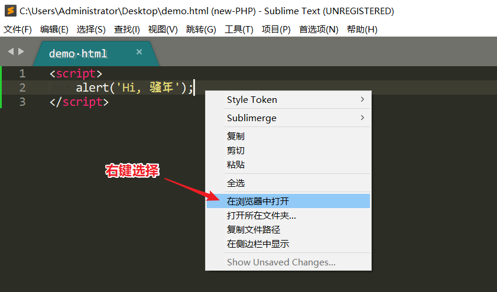
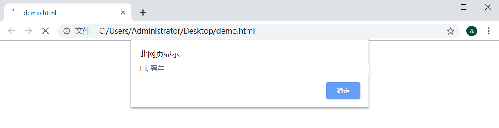
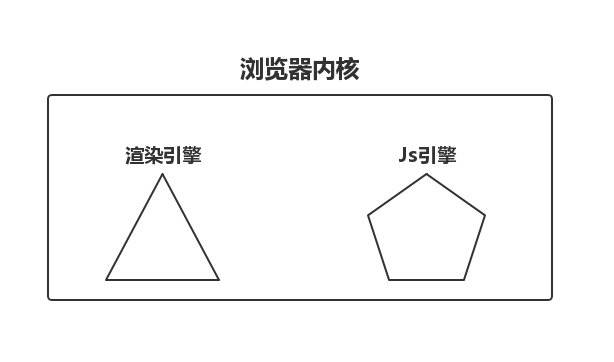
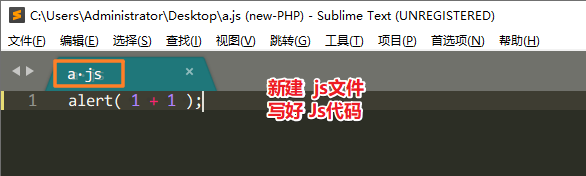
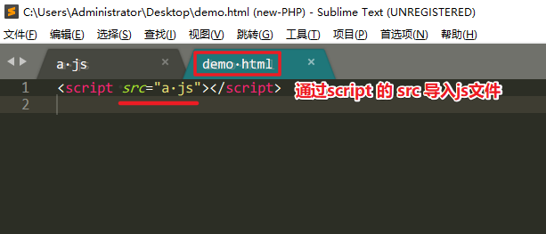
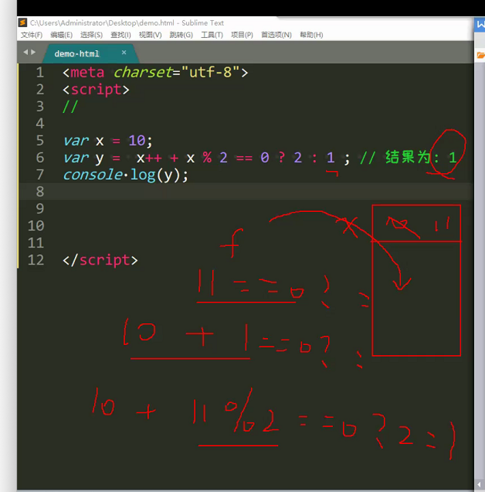

JS 基础


## 终端运行js文件

```sh
➜  code-19-09 git:(master) ✗ pwd                                                     
/Users/tianzi/Desktop/云课堂4.3g/H5/4-javascript核心语法/code-19-09
➜  code-19-09 git:(master) ✗ node 1     
this is 1.js
➜  code-19-09 git:(master) ✗ node 1.js 
this is 1.js
➜  code-19-09 git:(master) ✗ node 1.js
this is 1.js
adsadsad
➜  code-19-09 git:(master) ✗ 

```


## Js训练-3

> ​	ECMAScript是一种由Ecma国际（前身为欧洲计算机制造商协会,英文名称是European Computer Manufacturers Association）通过ECMA-262标准化的脚本程序设计语言。
> ECMA-262规范 定义了ECMAScript支持的一套关键字，这些关键字标识了ECMAScript语句的开头和/或结尾。根据规定，关键字是保留的，不能用作变量名或函数名。
>
> ECMAScript实际上是一种脚本在语法和语义上的标准。实际上JavaScript是由ECMAScript，DOM和BOM三者组成的。 所以说，在JavaScript，JScript和ActionScript中声明变量，操作数组等语法完全一样，因为它们都是ECMAScript。但是在操作浏览器对象等方面又有各自独特的方法，这些都是各自语言的扩展。

```
1997年，ECMAScript1.0发布
1998年6月，ECMAScript2.0 发布
1999年12月，ECMAScript3.0发布。 3.0版本是一个巨大的成功，得到了广泛的支持，奠定了JavaScript的基础，我们一开始学习的JavaScript其实就是3.0版本。
ECMAScript4 由于改变过于激进，所以未能成功发布。但是其中大部分内容被ES6继承了
2009年12月，ECAMScript5.0 正式发布
2011年ECMAScript 5.1 发布


2015年6月 ECMAScript 6.0 发布,正式名称是《ECMAScript 2015标准》（简称 ES2015）。
2016年6月，小幅修订的《ECMAScript 2016标准》（简称 ES2016）发布，这个版本可以看作是 ES6.1 版，也被称作ES7
2017年6月发布 ES2017 标准，也被称作ES8
2018年6月。es2018
2019年6月。es2019

因此，有时候我们用ES6来代指ECMAScript2015以及之后的版本

```


> **1.编辑器**
>
> 工欲善其事，必先利其器
> 想要写好程序, 学好编程,  必须先有一个趁手的IDE(编辑器)
> 目前市场常用编辑器: 
>
> 1. Sublime Text 3
> 2. Visual Studio
> 3. HBuilder
> 4. ATom
> 5. WebStorm
> 推荐Sublime Text 3, 小巧轻便, 就是一个变态版记事本. 


**JavaScript**

> ​	这是一门肥肠神奇的语言, 可以说, 当今IT, 绝大多数项目都需要用到JavaScript ( 俗称Js ). 无论是开发网站, 制作App, 桌面程序, 还是游戏, 都要用到Js. 所以一名程序员不会Js, 程序员这条路走的不会太远太久.
>
> 未来如何判定一名新人程序员是否具有培养价值?  那么 **逻辑思维, 编程思想** 是一个重要指标
>
> 我们前期通过 Js 先锻炼逻辑思维,  慢慢具备编程思想, 会非常有利于我们学习编程

> ​	2**第一次编程**
>
> 1. 创建文件
>
>    在桌面新建一个HTML文件,  取名 `demo.html`


> ​	2.打开`Sublime Text3 编辑器`, 并编写代码


> ​	运行 demo.html 
>
> 在编辑器任意位置, 鼠标右键 -> 选择"在浏览器中打开"




> ​	自动打开默认浏览器, 并看到一个 `弹窗`, `弹窗`就是 `alert()` 实现的
>
> ​	以上, 是我们第一次写代码, 并成功运行代码.




> ​	**3.控制台**
>
> `alert` 来弹出内容的话, 其实还是比较繁琐的. 
>
> 浏览器自带`开发者工具`的`控制台` 来查看内容, 简单方便直观.
>
> 1. 开发者工具
>
>    每个浏览器基本都有开发者工具, 我推荐大家使用 `chrome`的开发者工具, 是Js最理想的实验环境.
>
>    打开开发者工具的方式: 
>
>    - 在浏览器的空白处, 右击选择 `检查` 或 `审查元素` 即可打开开发者工具
>    - 直接按 `F12` 也能打开开发者工具
>
> 2. 控制台
>
>    在开发者工具中, 选择 `Console`, 这就是`控制台`
>
>    在控制台中, 可以查看内容 or 运算


 


> ​	4浏览器内核
>
> 为什么在控制台输入`1+1` 就会得到`2`?
>
> 为什么百度,淘宝网站有各种各样的字体颜色, 背景颜色?
>
> 这些功能都归功于`浏览器内核`
>
> Def 浏览器内核分成两部分: `渲染引擎` 和 `Js引擎`




**渲染引擎**

根据HTML代码, 向网页显示各种文字、图形,  也能给文字, 图形添加各种颜色,  还可以对文字、图形做各种排版

各大浏览器的渲染引擎

- firefox - gecko引擎
- IE - Trident引擎
- Opera - Presto引擎
- Chrome/Safari - webKit 引擎
- Chrome+Opera 联合开发 Blink引擎


**Js引擎**

本来也是渲染引擎里面的一部分, 但后来Js越做越大, 便独立出来了.

**Js引擎主要作用**: 读取网页中的 Js代码, 并对其进行处理. 例如 算术运算, 变量声明, 事件调用等等

各大浏览器的Js引擎

- 旧 IE - Jscript引擎
- IE9 - Chakra引擎
- IE Edge - Chakra引擎
- Firefox - monkey引擎
- Safari - SquirrelFish引擎
- Opera - Carakan引擎
- Chrome - V8引擎    ( Node.Js 也封装了V8引擎 )


**Js标准**				

ECMAScript 是JavaScript语言的国际标准, 简称`ES`

目前市场常用标准版本为 `ES5`, `ES6`


> 5. Js语句
>
> 在控制台中, 了解一下Console


**发现:**

Console 有 `>` 等待输入,  也有 `<` 输出结果. 那么每一次输入的东西, 被我们称之为 `语句`

在将来, 我们要编程的代码会越来越多, 一个正式的项目不会让程序员一边写代码, 一边让客户看结果. 所以我们会把代码写好,一次性导入项目中.


> 书写Js
>
> 项目中常见有两种写法:
>
> - 内部书写
> - 外部导入
>
> 第一种:(script)内部直接书写Js代码


> **第二种: **外部导入Js代码





> 注意: 
>
> ​	用了 src 就不能直接在 script 内直接书写js, 
>
> 除非在下面新写一个 script


> ​	分隔符
>
> 分隔符:  `分号;`


> 每一条Js 写完后, 强烈建议加上`;`  虽说不是必须品, 但能提高代码可读性
>
> 横排写时,  程序员一般都喜欢把字符个数控制在80个以内, 
>
> 亦可提高代码可读性


**空格/换行**

在 Js代码中, 连续多个空格 or 换行会被忽略, 所以我们随意使用空格or换行.

那么, 强烈推荐大家利用空格 or 换行对代码进行排版, 形成统一风格, 从而提高代码`可读性`

例如: 

```
x = 10 + 2
x=10+2
```

两种写法在js引擎中没任何区别, 但对于我们程序员而言, 在 `=` 两边添加空格, 可以提高整体代码可读性


**大小写**

Js 严格区分大小写


> ​	**注释**
>
> Js 注释具备两种功效:
>
> - 对代码进行描述
> - 注释代码无法执行
>
> 
>
> 注释分类:
>
> - 单行注释
> - 多行注释
>
> 
>
> **单行注释**:  `// 注释内容`
>
> **多行注释**: `/* 注释内容 */`


> 注意哦,  注释可是程序员的保命技能, 国外曾发生因不写注释而被枪毙的事情哦, 吓人!!!!!


> ​	6.变量定义
>
> 变量: 就是存储数据的容器,  与数学中的未知数是一个意思, 只是在程序中我们称之为`变量`而已
>
> 

```

声明格式variable

var 变量名;
var 变量名 = 值;
```

例如: 

```
var x = 10

```

- 关键字: var
- 变量名: x       也被称之为`标识符, 标记符`
- 值: 10

> 变量名可以是 短名称(例如 x 和 y),  也可以更具有描述性( 例如 name 和 tel )

命名规范

- 可包含`数字`, `字母`, `汉字`,`下划线`和`美元符$`
- 常用`字母`开头, 很少以`汉字`, `_` 或 `$` 开头, 不能以 `数字`开头
- 区分大小写
- 不能使用`关键字`, `保留字`


> ​	控制台查看变量
>
> 常用 `console.log()`在控制台查看变量,  平时会经常这么查看, 而非用 alert


>数据类型
>
>分类
>
>常用数据类型:
>
>- 基本类型
>- 引用类型

**基本数据类型**

- number 数字2
- string 字符串4
- boolean 布尔3
- null 空 类型 5
- undefined 未定义6
- symbol（es6）独一无二的值	；第七类数据类型

**引用类型**

- object 对象1
- array 数组
- function 函数


> ​	简单使用
>
> number 数字
>
> 数字就是 整数, 小数, 科学计数


```
var x = 10; 	// 整数
var y = 10.5; 	// 小数
var z = -5; 	// 负数
```

```
var x = 2e3; 	// 科学计数, 相当于 2*10的3次方, 结果: 2000
var y = 2e-3;	// 科学计数, 相当于 2*10的-3次方, 结果: 0.002
```


> ​	string 字符串
>
> 字符串可以含有数字, 字母, 汉字, 标点等任意字符.
>
> 字符串基本是用 `引号`包起来的, 单双引号均可.

```
var x = '三国'
var y = "曹操"
```


> ​	boolean 布尔
>
> 布尔只有两个值: `true` 和 `false`
>
> 经常被用于做比较, 判断等状态值
>
> 注意:  boolean 只能识别小写

```
var x = 5;
var y = 8;
console.log( x > y ); # false
console.log( x < y ); # true
```


> ### null   undefined
>
> null 和 undefined 在一定意义上都代表 `空值`
>
> 一般情况下, null 都是程序员主动赋值 or 意料之中的
>
> 而undefined 是 始料未及的 or 系统级的错误等
>
> 注意: null 是关键字,  而undefined 不是

> ​	2.array 数组
>
> 能将很多值 存放到一起, 这些值都是平行关系

```
var x = [
            '刘备',
            '关羽',
            '张飞',
            100,
            5.5,
            true,
        ]
```

获取数组中的值

```
console.log( x[0] ); 	// 刘备 
console.log( x[1] ); 	// 关羽
```

**小结: **

- 数组都是由键值组成, 以上案例我们只写了值
- 键默认从 0 开始, 依次递增
- 数组被`[ ] `包含


> ​	object 对象
>
> 对象有着 `一切皆对象`的口号, 上面的`数组`其实就是对象的一种

```
  var x = {
            'name': '张全蛋',
            'age': 18,
            'address': '富士康',
          }
```

获取对象中的值

```
console.log( x.name ); 	// 张全蛋
console.log( x.age ); 	// 18
```

**小结**

- 数组大多是  数字键+值
- 对象大多是  字母键+值
- 对象被 `{}` 包含


> ​	function 函数
>
> 函数也被称之为功能, 虽说也是类型之一, 但我们其实很少把他看成数据类型, 只是看做能执行特定任务的代码块

```
// 定义一个函数
var x = function demo(){ 
	// 代码块, 功能
} 	

```


> 以上只是对数据类型, 做了简单的介绍, 后面会有详细的介绍
>
> typeof 类型检测
>
> 用于获取一个数据的类型
>
> **格式:** 


```
typeof(数据)
或
typeof 数据

```

**案例:** 

```
var x = 10; 		// number
var x = 1.5; 		// number
var x = 2e3; 		// number
var x = 'abc'; 		// string
var x = '123'; 		// string
var x = true; 		// boolean
var x = false; 		// boolean
var x = null; 		// object
var x = undefined; 	// undefined
var x = [1,2,3]; 	// object
var x = {'name':'刘邦', 'age':58}; // object
var x = function (){} 	// function
console.log( typeof x );

```

> 注:  `null` 并没有返回 null类型, 而是 object类型, 这是 Js历史遗留BUG, 本应是 null类型.

经过 typeof 测试, 基本将数据分为两类人: 

- 原始数据
- 复杂数据


**原始数据**

- number
- string
- boolean
- undefined

**复杂数据**

- object
- function 


> 8	Number 数字
>
> 很多编程语言, 都会有整数、小数之分, 但是在Js中, 统称为`number`
>
> number形式

- 整形
- 浮点型
- Infinity
- NaN


> ​	整型
>
> 整型并非整容, 而是指 整数. 例如 `1`, `2`, `0`, `-1`, `-2` 等
>
> **如何判断一个值是否为整型**

```
Number.isInteger(10); 	// true
Number.isInteger(10.5); // false
```

**其他类型如何转成 整型**

```
var x = parseInt(1.2); 		// 1 	
var x = parseInt(1.7);		// 1 	
var x = parseInt('1.2'); 	// 1 	
var x = parseInt('1.7'); 	// 1 	
var x = parseInt('0.9'); 	// 0
var x = parseInt('.9'); 	// NaN
var x = parseInt('1.a');	// 1
var x = parseInt('a.1'); 	// NaN
var x = parseInt('2e3'); 	// 2
console.log( x );
```

**进制**

常见进制: 二进制Bin, 八进制Oct, 十进制Dec, 十六进制Hex


|          | 基数          |
| -------- | ------------- |
| 二进制   | 0 ~ 1         |
| 八进制   | 0 ~ 7         |
| 十进制   | 0 ~ 9         |
| 十六进制 | 0 ~ 9   a ~ f |

> ​	其他进制 -> 十进制:
>
> **公式: **基数 * 进制数 ^ 次方


```
var x = 10100;
console.log( parseInt(x, 2) ) 	// 20

var x = 24;
console.log( parseInt(x, 8) ) 	// 20

var x = 14;
console.log( parseInt(x, 16) ) 	// 20
```

> ​	十进制->其他进制:
>
> **规则:**  将 十进制 除以 当前进制, 直到商为0, 结果`倒取余`

```
var x = 20

console.log( x.toString(2) ); 	// 10100
console.log( x.toString(8) ); 	// 24
console.log( x.toString(16) ); 	// 14
```

**浮点型**

数字中可以含有一个小数点, 例如: `0.1`, `0.123`, `-0.456`

**17有效位数**

```
var x = 0.123456789012345678901234567890123456789;
console.log(x); 	// 0.12345678901234568 

var x = 123.456789012345678901234567890123456789;
console.log( x, typeof x); 	// 123.45678901234568 
```

最大是2的

```js
console.log(Number(2e307))
console.log(Number(2e308))
2e4 = 20000
//2e+307
//Infinity

```


其他类型如何转为 浮点型

```
var x = parseFloat(10); 	// 10
var x = parseFloat(10.5); 	// 10.5
var x = parseFloat('1.5'); 	// 1.5
var x = parseFloat('a.5'); 	// NaN
var x = parseFloat('5.a'); 	// 5
var x = parseFloat('.9'); 	// 0.9
var x = parseFloat('2e3'); 	// 2000
var x = parseFloat('-2.5'); // -2.5
var x = parseFloat('2.5.6'); // 2.5
console.log(x);
```


>Infinity代表无穷大


```
console.log(x); 	// Infinity

var x = -2e30000;
console.log(x); 	// -Infinity
```


>
>
>### NaN
>
>一个特殊值, 代表 `Not a Number` 意为`不是一个数`, 只要不是number数字, 都认为是 NaN
>
>**检测是否为 NaN**

```
var x = 10; 	// false
var x = 1.5; 	// false
var x = 'a'; 	// true
var x = 'a.5'; 	// true
var x = true; 	// true
var x = NaN; 	// true
var x = 0/0;
console.log( isNaN(x) );
```

**奇葩NaN**

- 只要是纯数字, 就不是NaN
- NaN 与 任何人 都不相等 ( 包括自己 )
- NaN  与 任何人运算结果都为NaN
- 0 / 0  的结果为 NaN


> ​	Number类型转换
>
> 其余类型 -> number类型
>
> - Number()
> - 骚操作
>
> 
>
> Number() 

```
var x = Number('a'); 	// NaN
var x = Number('a2'); 	// NaN
var x = Number('2a'); 	// NaN
var x = Number('2.a'); 	// NaN
var x = Number('2.'); 	// 2
var x = Number('.2'); 	// 0.2
var x = Number('2e3'); 	// 2000
var x = Number('2.5e3');	// 2500

console.log( x, typeof x);
```


> ​	骚操作
>
> 在数值之前加上`+`, 也能转为number类型
>
> 之前的 parseInt 和 parseFloat 也是类型转换的方法

```
var x = +true;      // 1
var x = +false;     // 0
var x = +'2';       // 2
var x = +'.2';      // 0.2
var x = +'a.2';     // NaN
var x = +'1.2';     // 1.2

console.log( x, typeof x);
```


> ​	9 String 字符串
>
> 在计算机中, 除了用数字表达一些东西之外, 还需要一些字母, 汉字, 标点等, 那么这些我们统称为`字符串`
>
> string 形式
>
> - 单引号
> - 双引号
> - 反引号

**单引号**

```
var x = 'Hi, 美女';
```

**双引号**

```
var x = "哇, 好大的猫";
```

**反引号**

```
var x = `这鸡真香啊`
```


> ​	区别
>
> 单双引号本身其实没多大区别, 在于使用时有部分影响, 有如下影响:
>
> - 单双引号不能自插 ( 单引号不能嵌套单引号,  双引号同理 ) 
> - 单双引号可以互插 ( 单引号可以嵌套双引号,  双引号同理 )

```
console.log( 'I give you face, you don't want a face' );  	# 报错

console.log( 'I give you face, you don\'t want a face' ); 	# 解决方法1: 将单引号 转义为普通单引号
console.log( 'I give you face, you don"t want a face' ); 	# 解决方法2: 将单引号 变为双引号
```

> ​	**转义符**
>
> `\`就是转义符, 能将特殊字符-> 普通字符. 也能将普通字符 -> 特殊字符
>
> **特殊字符 -> 普通字符**
>
> 在Js 中有不少字符本身就具有特殊意义, 例如 单引号, 双引号.  
>
> 引号一输出就被认为是字符串,  若只想输出普通的引号, 而不具备特殊意义, 可以这么做 ` \'` 或 `\"`, 在引号前面加上`\`即可.
>
> 
>
> **普通字符 -> 特殊字符**
>
> - \n  换行
> - \r  回车
> - \t  制表符

> ​	变量识别
>
> `反引号`内可以识别变量, 而单双引号无法识别
>
> **格式:** `${变量名}`

```
var name = '刘亦菲';

console.log(' ${name} 真漂亮 ');
console.log(" ${name} 真漂亮 ");
console.log(` ${name} 真漂亮 `);
```


> ​	**注意**
>
> - 单双引号的内容不能直接断行,  如需断行,  可用 `+` 连接
> - 非纯数字值 不加引号会被认为是 `变量`

```
var x = '窗前明月光' + 
		'疑是地上霜';
console.log(x);   
```

```
var x = 10; 		// 正常执行
var x = 'Hello';  	// 正常执行
var x = Hello; 		// 报错, 说 Hello 未定义
```


> ​	常用属性
>
> **.length**		获取字符串的长度

```
var x = 'abc';
console.log( x.length ); 	// 3 	变量x的字符串长度
```


> ​	常用方法
>
> - .split(分割符)	按分割符拆分到 数组中
> - .toUpperCase()		字符串转大写
> - .replace( 搜索值, 替换值 )** 	字符串替换

```
var x = 'abc-ijk-xzy';
console.log(x.split('-')); 		// ["abc", "ijk", "xzy"] 	分割字符串到数组
```

```
var x = 'abc-ijk-xzy';
console.log(x.toUpperCase()); 	// ABC-IJK-XZY 				字符串转大写
```

```
var x = 'abc-ijk-xzy';
console.log(x.replace('-','?')) // abc?ijk-xzy 				字符串替换
```


> ​	10Array 数组
>
> 为什么学习数组? 大家看下面的例子就明白了

```
// 普通变量写法, 好像有点乱

var 同学1 = '胡歌';
var 亲戚1 = '张飞';
var 同学2 = '霍建华';
var 亲戚2 = '李云龙';
var 同学3 = '刘德华';
var 亲戚3 = '孙悟空';


// 数组写法, 一目了然

var 同学 = [ 
            '胡歌',
            '霍建华',
            '刘德华',
           ];

var 亲戚 = [
            '张飞',
            '李云龙',
            '孙悟空',
           ];
```


> ​	array形式
>
> - 中括号
>
> **中括号**
>
> 中括号里面的`值`也被称之为 `元素`

```
var x = []; 			// 空数组
var x = [10, 20, 30]; 	
```

> ​	值的类型不限

```
var x = [
		10,
		1.5,
		true,
		'abc'
];
```

> ​	数组嵌套,  称之为`多维数组`

```
var x = [
		[10],
		[20],
		[[[30]]],
];
```

> ​	**获取元素**
>
> 每个值都有一个索引,  第一个值的索引为0, 第二个为1, 以此类推...

```
var x = ['大哥', '小哥', '胡哥'];

console.log( x[0] ); 	// 大哥
console.log( x[1] ); 	// 小哥
console.log( x[2] ); 	// 胡哥
console.log( x[999] );  // undefined  索引不存在
```

```
var x = [
    ['熊大','熊二','光头强'],
    ['你妹','他妹','傣妹'],
    ['百度','腾讯','阿里'],
];

console.log( x[0][1] );     // 熊二
console.log( x[1][1] );     // 他妹
console.log( x[1][2] );     // 傣妹
```


**添加/修改元素**

```
var x = ['大哥', '小哥', '胡哥'];

x[3] = '磊哥'; 	// 添加, 索引已存在
x[1] = '老哥'; 	// 修改, 索引不存在
console.log(x);		// ["大哥", "老哥", "胡哥", "磊哥"]


x[10] = '马哥';
console.log( x ); 	// ["大哥", "小哥", "胡哥", empty × 7, "马哥"]
console.log(x[10]); // 马哥
console.log(x[8]);  // undefined
```


> 数字索引必须是 连续的, 如果中间的索引没有设置, 则默认undefined
>
> 数组的索引只能是 数字
>
> 数组的索引不能 主动命名


> ​	常用属性
>
> **.length 	获取数组的长度**

```
var x = [10,20,30];
console.log( x.length ); 	// 3
或
console.log( [10,20,30].length ); 	// 3
```


> ​	常用方法
>
> **.push(元素)**  	从尾部添加元素

```
var x = [10,20,30];
x.push(90);
console.log(x); 	//  [10, 20, 30, 90]

```

**.pop()** 		从尾部删除元素

```
var x = [10,20,30];
x.pop();
console.log(x); 	//  [10, 20]

```

**.unshift(元素)** 		从头部添加元素

```
var x = [10,20,30];
x.unshift(88);
console.log(x); 	//  [88, 10, 20, 30]

```

**.shift()** 			从头部删除元素

```
var x = [10,20,30];
x.shift();
console.log(x); 	//  [20, 30]

```

**.reverse()**	颠倒数组值的顺序

```
var x = [10,20,30];
x.reverse();
console.log(x); 	//  [30, 20, 10]

```

**.splice(从哪剪,  剪几个, 插入值1, 插入值2, 插入值3, 更多插入值... )**

```
var x = ['a','b','c','d'];
x.splice(1,2); 		// 从索引1开始剪, 向后剪去2个值
console.log(x);		// ["a", "d"]


var x = ['a','b','c','d'];
x.splice(1,2,'x','y','z'); 	// 从索引1开始剪, 向后剪去2个值, 并插入x,y,z 3个值
console.log(x); 	// ["a", "x", "y", "z", "d"]


```

**.forEach( 回调函数 )** 	数组迭代 	( 将数组中的值一个一个拿出来,  直到拿完为止 )

```
var x = ['a','b','c','d'];

x.forEach(function(索引对应值, 索引){
    console.log(  '第 '+索引+' 条: '+索引对应值 );
})

运结果: 
    第 0 条: a
    第 1 条: b
    第 2 条: c
    第 3 条: d

```


> 11	Object 对象
>
> 为啥学 `对象`?  我还没对象呢 ! ! !
>
> 通过两个对比, 一看就明白, 用对象来描述一些东西, 比普通变量看起来更直观, 整体写法, array跟object长得差不多.

```
// 原始写法
var 姓名1 = '叶修';
var 性别1 = '男';
var 姓名2 = '冷巴';
var 性别2 = '女';
var 年龄1 = 23;
var 年龄2 = 18;


//对象写法
var 叶修 = {
    姓名: '叶修',
    性别: '男',
    年龄: 23,
};

var 冷巴 = {
    姓名: '迪丽冷巴',
    性别: '女',
    年龄: 18,
};
```


> ​	object形式
>
> - 大括号
>
> **大括号**
>
> 左侧不再称之为`索引`, 而是键
>
> 右侧依旧称之为`值`, 也可以是`属性`


```
var x = { }  	// 空对象
var x = {
	键1: '值1',
	键2: '值2',
	...
}
```

键 含有空格or特殊字符

```
var 叶修 = {
    'Your name': '叶修',
    '性+别': '男',
};
```

值 可以是任意类型, 甚至是对象

```
var 叶修 = {
    姓名: '叶修',
    年龄: 23,
    擅长职业: {
        剑客: '狂战士',
        神枪: '机械师',
        法师: '战斗法师',
        格斗: '气功师'
    }
};
```

**小结:** 

- 键 一般用字母or数字, 本身啥字符都能用
- 键 存在空格or特殊字符 必须加引号
- 键 不能重复, 一旦重复, 就会覆盖
- 值 可以为任意类型


> ​	对象操作
>
> **获取对象属性**

```
var 同学 = {
	姓名: '黄磊',
	年龄: 18,
}

console.log( 同学.姓名 );
```

复杂点的对象

```
var 同学 = {
    姓名: '黄磊',
    年龄: 18,
    爱好: {
        美女: '小可爱',
        运动: '约跑',
    }
}

console.log( 同学.爱好.运动 );
```

奇葩的对象

```
var 符号 = {
    '☆': '星星'
}

console.log( 符号.'☆' ); 	// 报错
console.log( 符号['☆']); 	// 以数组的方式来获取, 运行成功
```


**添加/修改属性**

```
var 对象 = {} 	// 先定义一个对象

对象.姓名 = '咪咪';  // 添加属性: 姓名
对象.年龄 = 18; 	// 添加属性: 年龄

对象.年龄 = 23; 	// 修改属性年龄为23 	由于年龄已存在, 所以才是修改, 不存在就是添加
```


> ​	
>
> # 12类型转换
>
> 在js中, 只有同等类型的数据才能进行运算, 例如: number与number 运算, string与string运算 ...
>
> 如果发生不同类型的数据进行运算, 那么,  部分类型会偷偷转换类型再进行运算. 这种行为被称之为`自动类型转换`
>
> 有自动类型转换, 自然也有`强制类型转换`
>
> #### 自动类型转换
>
> **数字类型**
>
> 小结
>
> - boolean
>   - true => 1
>   - false => 0
> - string
>   - number字符串 = >  保留数字 		( 包括正常的科学计数法 ) 
>   - 其余字符串 = > NaN
>
> 只要是与 string 相加的, 都不会做加法, 都变成了 拼接

```
var x = 10;
console.log( x + 1 ); 		// 11
console.log( x + 1.5 ); 	// 11.5
console.log( x + true ); 	// 11 		
console.log( x + false ); 	// 10 		
console.log( x - '2' ); 	// 8 		
console.log( x - 'a' ); 	// NaN 		
console.log( x - '2a' ); 	// NaN  	
console.log( x - 'true' );	// NaN  	
console.log( x - 'false' );	// NaN  	
console.log( x - '2e3' ); 	// -1990
```

> 布尔型


```
var x = true;
console.log( x + 1 ); 		// 2
console.log( x + 1.5 ); 	// 2.5
console.log( x + true ); 	// 2 		
console.log( x + false ); 	// 1		
console.log( x - '2' ); 	// -1 		
console.log( x - 'a' ); 	// NaN 		
console.log( x - '2a' ); 	// NaN  	
console.log( x - 'true' );	// NaN  	
console.log( x - 'false' );	// NaN  
console.log( x - '2e3' );	// -1999
```

**小结**

- 只有 boolean 自动转成别人的份, 要么`1`, 要么`0`


> ​	强制类型转换
>
> 转为number类型:  `Number()`, `parseInt()`,  `parseFloat()`
>
> 转为string类型: `toString()`, `String()`
>
> 转为boolean类型: `Boolean()`


**重点: **

以下值 在boolean转换时为false, 其余都是true

- false

- 0

- 0.0

- -0

- NaN

- null

- undefined

- "" 空字符串

  





> ​	13运算符
>
> - 算术运算符
>   - +
>   - -
>   - \*   乘法
>   - /   除法
>   - %  取模
>   - ++  自增
>   - --    自减
>   - **    幂
> - 赋值运算符
>   - =
>   - +=  -=  *=  /=  %=
> - 字符串运算符
>   - \+ 实则还有`拼接`的意思, 也可以使用 `+=` 拼接
> - 比较运算符
> - 逻辑运算符
> - 类型运算符
> - 位运算符
> - 三元运算符
> - void运算符
>
> 


> 算术运算符
>
> 算术只要计算的是: number之间的运算, 其他类型都会自动转为 number类型


```
# 加法 + 
var x = 10;
var y = 20;
console.log( x + y ); 	# 30


# 乘法 *
var x = 10;
var y = 20;
console.log( x * y ); 	# 200

# 除法 /
var x = 10;
var y = 20;
console.log( x / y ); 	# 0.5

取商
parseInt(x/y)

# 取模 %   求余数
console.log( x % y ); 	# 1 	5除以2的余数为1

# 幂
console.log( x ** y ); 	# 25 	5的2次方为25


# 自增 ++
var x = 5;
console.log( x++ ); 	# 5 	先遇到x, 则优先返回x, 再给x+1
console.log( x ); 		# 6

var x = 5;
console.log( ++x ); 	# 6 	先遇到++, 则优先x+1, 再返回x
console.log( x ); 		# 6 	

var x = 5;
var y = x++ + ++x;
console.log(x, y); 		# x=7  y=13

var x = 5;
var y = 2;
var z = x++ - y-- - ++x;
console.log(x, y, z); 	# x=7  y=1  z=-4

```


> ​	
>
> 赋值运算符
>
> - =
> - +=  -=  *=  /=  %=

```
# 赋值
var x = 10; 	# 将 数值10 赋给 变量x

# 加等 +=
var x = 5;
var y = 10;
x += y; 	# 相当于 x = x+y 	
console.log( x, y ); 	# 15 10


# 乘等 *=
var x = 5;
var y = 10;
x *= y; 	# 相当于 x = x*y 	
console.log( x, y ); 	# 50 10

```


> ## 字符串运算符
>
> - \+  
>
> `+` 看似只是`加法`的意思,  实则还有`拼接`的意思
>
> 当然, 也可以使用 `+=` 拼接
>
> **小结:** 在 `+ `运算过程中, 只要有一边出现字符串, 那么就是`拼接`, 如果两边都是number, 那么就是`加法`
>
>  

```
var x = 10;
var y = 5;
console.log( x + y ); 	# 15 	加法


var x = 10; 	# 数字10
var y = '5'; 	# 字符串5		
console.log( x + y ); 	# 105 	拼接

var x = 'Hello ';
var y = 'boy';
x += y;
console.log( x ); 	# Hello boy
console.log( y ); 	# boy

```


> ​	比较运算符
>
> - \>    
> - \>=
> - \<    
> - \<=
> - ==
> - ===
> - !=
> - !==
>
> 注意: 比较运算符的结果只有 boolean 值

```
console.log( 5 > 10 ); 		# false
console.log( 5 >= 10 );		# false 
console.log( 5 < 10 ); 		# true
console.log( 5 <= 10 ); 	# true
console.log( 5 == 10 ); 	# false 	判断数值大小是否相等
console.log( 5 == 5 ); 		# true
console.log( 5 === 5); 		# true 		判断数值大小是否相等 且 数据类型是否相等 ( 全等 )
console.log( 5 === '5'); 	# false 	
console.log( 5 != 10 ); 	# true 		判断数值大小是否不相等
console.log( 5 !== 5 ); 	# false 	只要全等即为false, 其余都是true

```


> ## 逻辑运算符
>
> - &&
> - \| |
> - !
>
> **逻辑与 &&**
>
> 运算规则:  `与全真才为真(最后一个), 否则就是第一个假(第一个)

```
console.log( true && true );    // true
console.log( true && false );   // false 
console.log( false && true );   // false 
console.log( false && false );  // false 

var x = 3;
var y = 0;
var z = 5;
var o = false;
console.log( x && y );  // y 0 
console.log( x && z );  // z 5
console.log( x && o );  // o false 
console.log( y && o );  // y 0
```


> ​	**逻辑或 | |**
>
> 运算规则: `或全假才为假(最后一个), 否则就是第一个真(第一个)`

```
console.log( true || true );    // true
console.log( true || false );   // true
console.log( false || true );   // true
console.log( false || false );  // false 

var x = 3;
var y = 0;
var z = 5;
var o = false;
console.log( x || y );  // x 3
console.log( x || z );  // x 3 
console.log( x || o );  // x 3
console.log( y || o );  // y false
```


> ​	**逻辑非 ! **
>
> 运算规则: `真即是假, 假即是真`

```
console.log(!true); 	// false
console.log(!false); 	// true

console.log(!1); 		// false
console.log(!0); 		// true
```


> ​	类型运算符
>
> - typeof 主要
> - instanceof 
>
> **返回数据的类型**

```
var x = 10;
console.log( typeof x ); 	// number

var x = '李寻欢';
console.log( typeof x ); 	// string

var x = null
console.log( typeof x ); 	// Object 历史坑

var x = [1,2];
console.log( typeof x );  	// Object 历史坑
console.log( Array.isArray(x) ); 	// true 	这是可以只检测是否为array, 而不是object的

```


> ​	位运算符
>
> - \& 按位与
> - \| 按位或
> - ^ 按位异或
> - ~ 按位取反
> - \>> 左移
> - \<<  右移
> - \>>> 带符号右移
>
> `位运算`基本都要是转化为 `32位二进制`再运算的, `位运算`的结果都是整数

```
console.log( 5 & 1 ); // 1 	
console.log( 5 | 1 ); // 5 	
console.log( 5 ^ 1 ); // 4 	
console.log( ~5 );    // -6 	
console.log( 5 << 1 );  // 10 
console.log( 5 >> 1 );  // 2  
console.log( 5 >>> 1 ); // 2  
console.log( -5 >>> 1 ); // 2147483645 	负数需要先转补码,再位移
```

| 运算符 | 名词     | 运算规则                                                     |
| ------ | -------- | ------------------------------------------------------------ |
| &      | 按位与   | 有一个为0,即为0, 否则为1                                     |
| \|     | 按位或   | 有一个为1, 即为1, 否则为0                                    |
| ^      | 按位异或 | 相异为1, 相同为0；转成二进制；<br /> 11101000（a=232）(0,1  和 1.0 ；；； 1，1 和0，0)<br />00001100(b =12前面4位补0)<br />11100100（a^=b 中间按位异或228） 相异的时候只要有一个不一样就是1<br /> 11101000(b^=a)<br />00001100(a^=b)<br /> |
| ~      | 按位取反 | ~x = -x-1  ；最后取整，直接去小数                            |
| \<<    | 左移     | 左移n位, 低位补0                                             |
| \>>    | 右移     | 右移n位<br>正数: 高位补0<br>负数: 高位补1                    |
| \>>>   | 右移     | 右移n位, 高位补0 , 带符号                                    |

> 正负数位移原理


**<u>按位异或^</u>**

参与运算的两个值，如果两个相应位相同，则结果为0，否则为1。即：0^0=0， 1^0=1， 0^1=1， 1^1=0

例如：10100001^00010001=10110000

0^0=0,0^1=1 0异或任何数＝任何数

1^0=1,1^1=0 1异或任何数－任何数取反

任何数异或自己＝把自己置0

(1)按位异或可以用来使某些特定的位翻转，如对数10100001的第2位和第3位翻转，可以将数与00000110进行按位异或运算。

　　　　　　　　　 10100001^00000110=10100111 //1010 0001 ^ 0x06 = 1010 0001 ^ 6

(2)通过按位异或运算，可以实现两个值的交换，而不必使用临时变量。例如交换两个整数a，b的值，可通过下列语句实现：

    a=10100001,b=00000110
    
    a=a^b； 　　//a=10100111
    
    b=b^a； 　　//b=10100001
    
    a=a^b； 　　//a=00000110

(3)异或运算符的特点是：数a两次异或同一个数b（a=a^b^b）仍然为原值a.

结束end   〉按位异或^


```
掌握位移之前, 必须先掌握 原码, 反码, 补码
例如: 
var x = 10;

10 的原码: 00000000000000000000000000001010 	(32位, 也是 10的二进制)
10 的反码: 11111111111111111111111111110101 	全部取反
10 的补码: 11111111111111111111111111110110    反码+1 , 同时也是 -10的二进制

```

```
>> 或 >>> 或 << 正数位移: 只需要原码即可, 再左右位移
>> 或 << 负数位移: 
            - 将负数当正数用
            - 先求补码
            - 再位移
            - 再减1
            - 再反码
            - 填充符号

>>> 负数位移:  
	- 将负数当正数用
	- 先求补码
	- 再位移

```


**技巧运用**

1. 互换两个变量

   ```js
   var a = 10;
   var b = 20;
   a ^= b, b ^= a, a ^= b; 	// 互换a 和 b 的值
   console.log(a);
   console.log(b);
   
   或者加个中间变量
   ```

2. 取整

   ```
   console.log( 3.5 | 0 );     // 3
   console.log( 3.5 ^ 0 );     // 3
   console.log( 3.5 << 0 );    // 3
   console.log( ~~3.5 );       // 3
   
   var x = -4.7
   var y = 5.9
   console.log(~~x,~~y);
   console.log(~x,~y);
   // -4 5
   // 3 -6
   
   
   
   ```

3. 倍数

   ```
   console.log( 3 << 0 );  // 3        3*2的0次方
   console.log( 3 << 1 );  // 6        3*2的1次方
   console.log( 3 << 2 );  // 12       3*2的2次方
   console.log( 3 << 3 );  // 24       3*2的3次方
   				    // 		  以此类推
   
   console.log( 10 >> 0 ); // 10       10/2的0次方
   console.log( 10 >> 1 ); // 5        10/2的1次方
   console.log( 10 >> 2 ); // 2        10/2的2次方
   console.log( 10 >> 3 ); // 1        10/2的3次方
   				    // 		  以此类推
   				    // 左乘右除
   ```

   


> 三元运算符运算规则:
>
> 当 `表达式1 成立`, 则执行`true环境`, 否则执行 `false环境`
>
> 三元运算符 与 将来的if-else分支功能相似, 不过 三元只能处理简单分支, if-else可以处理复杂分支 


```
# 格式
表达式1 ? true环境 :  false环境

# 例如
console.log(   5%2 == 0 ? '偶数' : '奇数'    );
```

> ​	void 运算符
>
> 意为: 无效的, 空白的
>
> 可以理解为 `没有返回值` or `undefined`
>
> void的语法格式就两种: 带小括号 和 不带小括号.  `推荐: 带小阔号`
>
> **作用:** 常被用于 `超链接的禁止刷新跳转`

```
console.log(  void 10 ); 	// undefined
console.log(  void(10) ); 	// undefined
```

2

```
<a href=""> 刷新当前页面 </a>
<a href="javascript: void(0)"> 不刷新也不跳转 </a>
```

> ​	void的语法格式就两种: 带小括号 和 不带小括号.  `推荐: 带小阔号`
>
> **作用:** 常被用于 `超链接的禁止刷新跳转`

```
console.log( 2 + 5 * 8 ); 	// 先乘法, 再加法
console.log( (2+5) * 8 ); 	// 先加法, 再乘法
```

**复杂运算**

```
var x = 10;
var y =  x++ + x % 2 == 0 ? 2 : 1 ; // 结果为: 1
console.log(y);
```


># 14-分支
>
>根据 `不同的条件` 来执行`不同的功能`
>
>例如: 登录成功与失败, 显示时间为上午与下午, 购买成功与失败...
>
>
>
>## 分支语句
>
>- 单向分支
>- 双向分支
>- 多向分支
>- switch分支

**单向分支**  

```
# 格式1
if( 条件 ){
	如果条件最终结果为 true 时执行的代码
}

# 格式2
if( 条件 )  
	如果条件最终结果为 true 时执行的一行代码
```

**案例**: 早上6:00 闹钟提醒

```
var time = new Date(); 		// 获取时间对象
var hour = time.getHours(); // 获取时间对象中的小时

# 写法1
if( hour == 6 ){
	console.log("懒虫起床");
}

# 写法2
if( hour == 6 ) console.log('懒虫起床');

```


**双向分支**

```
# 格式
if ( 条件 ) {
    如果条件最终结果为 true 时执行的代码
} else {
    如果条件最终结果为 false 时执行的代码
}
```


**案例: ** 早上 9:00 之前进公司提示"早上好, xxx",  9:00 之后进公司提示"迟到了哟"

```
var time = new Date(); 		// 获取时间对象
var hour = time.getHours(); // 获取时间对象中的小时


if ( hour < 9 ) {
    console.log('早上好');
} else {
    console.log('迟到了哦');
}

```


**多向分支**

```
# 格式1
if ( 条件1 ) {
    条件1最终结果为true 时执行的代码
} else if( 条件2 ) {
    条件2最终结果为true 时执行的代码
} else if( 条件3 ) {
    条件3最终结果为true 时执行的代码
}

# 格式2
if ( 条件1 ) {
    条件1最终结果为true 时执行的代码
} else if( 条件2 ) {
    条件2最终结果为true 时执行的代码
} else if( 条件3 ) {
    条件3最终结果为true 时执行的代码
} else{
    以上条件都不满足 时执行的代码
}
```

> 多向分支: 必须从上往下依次进行判断,   前面一旦有满足的条件


**案例: ** 根据成绩 来判定级别

```
var 成绩 =  98
if ( 成绩 < 60 ) {
    console.log('不及格');
} else if( 成绩 < 70 ) {
    console.log('及格');
} else if( 成绩 < 80 ) {
    console.log('中等');
} else if( 成绩 < 90 ){
    console.log('良好');
} else if( 成绩 <= 100 ){   // 成绩有上限: 100
    console.log('优秀');
}

或 

var 成绩 =  98
if ( 成绩 < 60 ) {
    console.log('不及格');
} else if( 成绩 < 70 ) {
    console.log('及格');
} else if( 成绩 < 80 ) {
    console.log('中等');
} else if( 成绩 < 90 ){
    console.log('良好');
} else{ 					// 成绩没有上限, 只要超过90都是优秀
    console.log('优秀');
}

```


**练习:**

```
天梯分:  可小数
	0~3: 青铜
	3~4: 白银
	4~5: 黄金
	5~6: 白金
	6~7: 钻石
	7~8: 大师
	8~9: 星耀
	9~10: 王者
	其余: 系统繁忙

```


**switch分支**

```
# 格式
switch( 表达式 ){
	case 标识1: 
		代码块
		break;
	case 标识2:
		代码块
		break;
	case 标识3:
		代码块
		break;
	case ...
	
	default: 
		默认代码块
}
```

**注意:**

- switch 表达式只执行一次

- 根据表达式, 选择相应的标识, 并执行对应的代码块

- 根据表达式, 始终匹配不到标识, 则执行default的代码块

- break 具有直接结束switch分支的效果

  


**案例: ** 根据数字 显示星期几

```
var x = 5;
switch (x){
    case 1: console.log('星期一'); break; 
    case 2: console.log('星期二'); break; 
    case 3: console.log('星期三'); break; 
    case 4: console.log('星期四'); break; 
    case 5: console.log('星期五'); break; 
    case 6: console.log('星期六'); break; 
    case 7: console.log('星期日'); break; 
    default: console.log('系统有误'); break; 
}
```


**案例: **

```
b = false;
switch(b) {
     case true:
          console.log( 'true' );
          break;
     case false:
          console.log( 'false' );
          break;
     case '':
          console.log( '空字符串');
          break;
     default:
          console.log( 'default' );
}

结果: default
```


># 15.循环
>
>将 部分位置相同, 功能相似的代码块 重复执行好几遍, 即可使用循环
>
>**常用循环:**
>
>- while
>- do/while
>- for
>- for/in
>
>
>
>**循环三要素:**
>
>- 初始值
>- 循环条件
>- 循环增


**1-while**

```
# 格式

初始值
while( 循环条件 ){
	条件成立, 执行的代码区域
}
```

**执行顺序: **


> 有人问: 循环增量呢??? 
>
> 在while循环中,  初始值通常在 while 之前就声明好, 增量有时会出现在 代码区域中, 有时不出现,  由需求决定


**案例1:   输出 1~10**

```
var i = 1;
while( i < 11 ){
	console.log(i);
	i++;
}
```

**案例分析:**

- i = 1 为初始化步骤
- i < 11 为循环条件
- i++ 为循环增量

------


**案例2: 输出 10~1**

```
var i = 10;
while( i > 0 ){
	console.log(i);
	i--
}
```

**案例分析: **

- i = 10 为初始化步骤
- i > 0 为循环条件
- i-- 为循环增量

> 问: 循环增量不是 增量吗, 怎么减呢???
>
> 答: 这里的增量的只是一个代名词, 代表改变条件的变量, 具体是增是减是不确定的, 而是也不一定是自增, 自减, 还可以是乘除, 取模等所有运算符 


**2-do/while**

```
# 格式

初始化
do{
	执行代码的区域
}while(循环条件)
```


**执行顺序:**


**案例1: 输出 1~10**

```
var i = 1;
do{
	console.log(i);
	i++;
}while(i<11)
```


**案例2: 输出 10~1**

```
var i = 10;
do{
    console.log(i);
    i--;
}while(i>0)
```


**while 和 do/while 之间的区别?**

while 是先条件判断, 再决定是否执行代码

do/while 第一次是先执行代码, 再条件判断,  决定是否执行第二次. 也就意味着第一次无论条件是否成立, 都会执行.


**3-for**

```
# 格式

for( 初始化; 循环条件; 循环增量 ){
	条件成立, 执行代码的区域
}
```

**执行顺序:**


> 相比while而言,  for 专门为 初始化, 循环增量 设立了位置


**案例1:  输出 1~10**

```
for(var i = 1; i < 11; i++){
    console.log(i);
}
```

**案例2: 输出 10~1 **

```
for (var i = 10; i > 0; i--) {
    console.log(i);
}
```


**for/in**

```
# 格式
for( 变量 in 对象 ){
	执行代码的区域
}
```

> for/in 一般用于遍历 对象


**案例:  获取对象的所有键和值**

```
var man = {
    '姓名': '张百忍',
    '身份': '玉皇大帝',
    '称号': '昊天上帝',
    '引路人': '太白金星'
}


for( var i in man ){
    console.log( '键 = ' + i );
    console.log( '值 = ' + man[i] );
}
```

```
# 运行结果

键 = 姓名
值 = 张百忍
--------------------------------------
键 = 身份
值 = 玉皇大帝
--------------------------------------
键 = 称号
值 = 昊天上帝
--------------------------------------
键 = 引路人
值 = 太白金星
--------------------------------------
```

**案例分析: **

- 对象键 是通过 变量i 每次循环获取一个键
- 对象值 是通过 对象变量[ 键 ] 的方式来获取


**5-无限循环**

无限循环, 又称"死循环", 只要循环条件永远成立 or 转为bool时永远为true, 即可形成无限循环

**案例: 从 数字1 开始递增, 一直输出**

```
# 条件永远成立
for(var i=1; i>0; i++){}
	console.log(i);
}
```

```
# 条件永远为true
for(var i=1; true; i++){}
	console.log(i);
}
```

```
# 条件转为boolean时, 永远为true
for(var i=1; 1; i++){}
	console.log(i);
}
```

```
# 条件转为boolean时, 永远为true
for(var i=1; 100; i++){}
	console.log(i);
}
```

**应用场景:   轮播图无限滚动, 字幕无限滚动**


**保留关键字**

- continue
- break


**continue**

**作用:** 当满足某些条件时,  则跳过当前一轮循环, 准备进入下一轮循环


**案例: 输出1~10, 遇到5时, 则跳过**

```
# while 写法

var i = 1;
while(i < 11){
    if(i == 5){
        i++;
        continue;
    }
    console.log(i);
    i++;
}
```

```
# for写法

for(var i=1; i<11; i++){
    if (i==5) {
        continue;
    }
    console.log(i);
}
```

**注意:**

- 在while中,  遇到continue, 则直接跳转到**循环条件**
- 在for中, 遇到continue, 则直接跳转到**循环增量**


**break**

**作用: ** 当满足某些条件时, 则立马结束循环, 准备执行循环之外的代码


**案例: 输出 1~10, 遇到5时, 则立马结束**

```
# while 写法

var i = 1;
while(i<11){
    if (i==5) {
        break;
    }
    console.log(i);
    i++;
}
```

```
# for 写法

for(var i=1; i<11; i++){
    if (i==5) {
        break;
    }
    console.log(i);
}
```

**注意: **

- 大循环嵌套小循环时, 如果**小循环嵌套break**, 那么只终止小循环, 不影响大循环.
- 大循环嵌套小循环时, 如果**大循环嵌套break**, 那么直接终止整个循环.
- break 只会终止包含自己的最近的一层循环


> ​	函数
>
> ## 定义
>
> **函数是专门执行特定任务的代码块。** 
>
> 主要有以下定义方式: 
>
> - 函数声明
> - 函数表达式
> - 函数构造器
> - 箭头函数
>
> 


1-函数声明

```
# 格式
function 函数名( 参数 ){
	代码块
}
```

**案例: **

```
function add(num1, num2){
	console.log( num1 + num2 );
}
```

**特征: ** 函数声明后, 并不会自动执行,  只有后期调用后, 才能起作用. 

由于函数声明不是**可执行语句**, 所以末尾很少加分号


2-函数表达式

对于函数声明, 通常需要一个有意义的名字, 这是一个艺术活.

如果不想取名字, 通常会用 **函数表达式**来代替, 因为不用取名, 此行为也被称之为 **匿名函数**

```
# 格式
var 变量 = function (参数){ 代码块 }
```

**案例**

```
var x = funtion (num1, num2){ console.log( num1 + num2 ) }
```


3-构造器

构造器其实就是通过 实例化function对象实现的

```
var 变量 = new Function('参数1', '参数2', '参数3', ... '代码块')
```

其中, **参数1**, **参数2**, **参数3**, **代码块** 都是以 string 形式出现的


**案例**

```
var x = new Function ('num1', 'num2', 'console.log( num1 + num2 )');
```

构造器的写法, 其实在js中, 很少用到


4-箭头函数

这是 ES6 新加的函数写法, 适用于 简短的函数

```
ES5 写法
var x = function (n1, n2){
	return n1 + n2  		// 代表返回 n1+n2 的值
}

ES6 写法
const x = (n1, n2) => n1+n2 	// 自带return
```


2.1函数调用

函数主要由三种调用方式: 

- 主动
- 被动
- 自主


2.1.1主动

在 javascript 代码块区域主动调用函数

```
# 格式1
函数名()  

# 格式2 
函数名( 参数 ) 
```


**2.1.2被动**

在 js 事件中触发函数, 例如 onclick.  后期学期了前端之后, 学习该方法会更好理解


**2.1.3自主**

函数在定义好后, 自主调用自己

```
(function(参数){
	代码块
})()
```

本质其实: `()()`, 主动调用函数, 就是在函数名后面添加 `()`,  那么直接将 函数名所对应的函数代码块 替代掉, 就能直接声明完就立马调用自己了.


**函数名**

组成

可以包含**字母**, **数字**, **下划线**, **$符** , 但不能以数字开头  ( 其实与变量的命名规则一样 )

函数名在设计时, 尽可能取得**有意义**, 具有**可读性**

函数名区分大小写

函数可以重复, 但不推荐, 如果重复, 优先使用最后一个函数声明

**命名形式**

- 驼峰式命名法
- 帕斯卡命名法


**驼峰式命名法**

js中最常用的函数命名形式, 格式: `从第二个单词开始, 首字母均大写`. 例如: addUserName,  getMessage


**帕斯卡命名法**

在后期js对象中的方法, 最常用的一种方式, 格式: `每个单词的首字母均大写`. 例如: AddUserName, GetMessage


**返回值**

关键字: `return`

**作用:**  当执行到函数中的return时, 立马终止函数, 并返回到调用函数的地方

**返回值类型:** 任意类型

**案例**

```
function demo(){
    return 100;
}

var x = demo(); // 调用demo函数, 并将 返回值 交给变量x
console.log(x); // 输出 100
```


> 问题1: 如何一次性返回多个值?


参数

形参( parameter | parame) : 在定义函数时给的参数

实参( argument | arg ) : 在调用函数时给的参数


**形参 **

```
function 函数名( 形参1, 形参2, 形参3=值3, 形参4=值4, ...){
	代码块
}
```

形参格式有两种: 

- 没有默认值 	: 显示undefined
- 有默认值        : 显示指定默认值


**实参 **

```
# 定义函数
function demo(num1, num2){
	var sum = num1 + num2;
	console.log( sum );
}

# 调用函数
demo(10,20)
```

在调用函数时, 提供的参数10 和 20 即为 **实参**

在定义函数时, 提供的参数 num1 和 num2 即为 **形参**


**参数规则**

- 不限制参数数据类型
- 不检查参数数据类型
- 不限制参数个数


参数数量

**实参个数 = 形参个数**  完美

```
function demo( x, y ){
	console.log( x, y ); 	// x=10, y=20
}

demo( 10, 20 )
```


**实参个数 < 形参个数**

```
function demo( x, y ){
	console.log( x, y ); 	// x=10, y=undefined
}

demo( 10 )
```


**实参个数 > 形参个数**

```
function demo( x, y ){
	console.log( x, y ); 	// x=10, y=20 	 30和40则被抛弃掉
}

demo( 10, 20, 30, 40 )
```


**实参个数不确定时**

```
function demo(  ){
	console.log( arguments ); 	// arguments 对象获取到所有的实参
	console.log( arguments[0] ); // 输出10   第一个实参
	console.log( arguments.length); // 输出4  一共传递了4个实参
}

demo( 10, 20, 30, 40 )
```

**注意: ** arguments 带`s` , 是个复数, 而且是个对象


参数传递

**值传递**

将实参的值 传递给 形参,  **记住:** 仅仅是将值 传递过去而已

```
function demo( x ){
	x += 5;
	console.log( x ); 	// 函数内部是: 15
}
var x = 10;
demo(x); 				// 将 实参x的值给了形参x
console.log( x ); 		// 函数结束后, 在外部, x 依旧是 10

```


**引用传递**

将实参的内存地址 传递给 形参, **记住: ** 是内存地址

```
function demo( 猴子 ){
    猴子.师傅 = '唐三藏';
    console.log( 猴子.师傅 ); 	// 在函数内部是: 唐三藏
}

var 猴子 = {
    '姓名': '孙悟空',
    '师傅': '菩提祖师',
}

demo( 猴子 ); 				// 将 实参对象猴子 传递给 形参对象猴子
console.log( 猴子.师傅 ); 	   // 函数结束后, 在外部, 猴子.师傅改为了 唐三藏
```


**小结: ** 参数只有在 传递对象时, 才是引用传递.  函数内部发生,  外部也会发生改变. 


**window对象**

js 经常在HTML中使用, HTML主要是在  浏览器窗口 中进行展示, 那么 js 也属于浏览器窗口的一部分.

浏览器窗口被我们称之为: **window对象**

平常我们所定义的函数, 也可以通过window来调用. 例如:  window.demo( ) 

```
function demo(){
	console.log('Hello, 大家好, 我叫黄磊');
}

demo(); 		// 普通调用
window.demo(); 	// window对象调用
```

在window对象中, 还有很多方法, 例如: alert( ), prompt( ) ...


**方法**

方法是函数的一种特殊形式, 通常在对象中进行定义

```
var 猴子 = {
    '姓名': '孙悟空',
    '师傅': '菩提祖师',
    
    // 定义方法: 描述
    描述: function (){
        console.log( '我叫 %s, 师承 %s', 猴子.姓名, 猴子.师傅);
    }
}

猴子.描述();  // 调用方法
```


**this 关键字**

this 是一个关键字, 代表当前对象.

- 在普通函数使用, 代表window对象
- 在对象方法中使用, 代表当前对象

```
# 函数

function demo(){
    console.log(this); 	// 输出 window对象
}

demo();
```


```
# 方法
var 猴子 = {
    '姓名': '孙悟空',
    '师傅': '菩提祖师',
    
    // 方法
    描述: function (){
    	console.log( '我叫 %s, 师承 %s', 猴子.姓名, 猴子.师傅);
        console.log( '我叫 %s, 师承 %s', this.姓名, this.师傅); // this 等同于 猴子对象
    }
}

猴子.描述();
```


**作用域**

- 局部作用域
- 全局作用域


**局部作用域: ** 在函数内部定义的变量即为 局部变量

**全局作用域: ** 在函数外部定义的变量即为 全局变量

```
function demo(){
    var y = 20; // 局部变量
}

var x = 10; // 全局变量
```


**注意: **

- 默认情况下, 全局变量可以在 局部环境中使用
- 默认情况下, 局部变量不可以在 全局环境中使用
- 变量 不适用var声明, 则认为是全局变量

```
function demo(){
	x = 10; 		// 在函数内部, 没有用var 声明变量x
    var y = 20;		// 在函数内部, 用var 声明变量y
}
demo();
console.log( x,y ); 	// x=10   y报错
```


**生命周期**

全局变量的声明周期: 整个网页开着, 就一直活着, 网页一关, 生命就到期了

局部变量的声明周期: 调用函数时, 才有了生命.  关闭函数/函数结束时, 声明就到期了


> 思考题
>
> 问题1: 当 函数声明 与 函数表达式 重名混合出现时?

## 对比python

> python：	bool别的类型转换成 布尔类型

```
>>> bool([])
False
>>> bool({})
False
>>> bool(())
False
>>> bool("")
False
>>> bool(0)
False
>>> bool(0.0)
False
>>> bool()
False
```

node


```js
Last login: Sat Sep 28 09:45:37 on ttys000
➜  ~ git:(master) ✗ node              
> 10>>1
5
> -10>>!
... 
... ee
Thrown:
ReferenceError: ee is not defined
> -10>>1
-5
> 10<<1
20
> 10<<<@
Thrown:
10<<<@
    ^

SyntaxError: Unexpected token <
> 10<<<2
Thrown:
10<<<2
    ^

SyntaxError: Unexpected token <
> 10 <<< 2
Thrown:
10 <<< 2
     ^

SyntaxError: Unexpected token <
> 10 >>>3
1
> -10 >>> 3
536870910
> -10 >>> 1
2147483643
> -10 >>> 2
1073741821
> 9>>>2
2
> -9>>>2'
Thrown:
-9>>>2'
      ^

SyntaxError: Invalid or unexpected token
> -9>>>2
1073741821
> -10>>>1
2147483643
> 2**32
4294967296
> 2**31
2147483648
>  -9>>>1
2147483643
> -1>>>1
2147483647
> -2>>>1
2147483647
> -3>>>1
2147483646
> -4>>>-2
3
> -4>>>2
1073741823
> -4>>>1
2147483646
> -4>>>1
2147483646
> 10>>-2
0
> 10>>-1
0
> -100>>-2
-1
> 100>@
Thrown:
100>@
    ^

SyntaxError: Invalid or unexpected token
> 100>2
true
> 100>>2
25
> 2**31>>2
-536870912
> 2**31-1>>2
536870911
> 2**32>>2
0
> 2**33>>2
0
> 2**31321>>2
0
> -10>>>1
2147483643
> 2**31 - (10>>1)
2147483643
> -5 >>>1
2147483645
> 2**31 - (5>>1)
2147483646
> 2**31 + (-5>>1)
2147483645
> 2**31 + (-7>>1)
2147483644
> -7>>>1
2147483644
> 0>>>1
0
> 0>>1
0
> 2**31 >>1
-1073741824
> 2**32 >>1
0
> 2**31-1 >>1
1073741823
> 2**31+1 >>1
-1073741824
> 2**32+1 >>1
0
> 2**64 >>1
0
> 2**31>>2  
-536870912
> (2**31-1)>>2  
536870911
> clear
Thrown:
ReferenceError: clear is not defined
> cle

```


```js
Last login: Fri Sep 27 23:26:30 on ttys001
➜  ~ git:(master) ✗ pythpmn
>>> 
>>> 1 and 2
2
>>> 1 and 2
2
>>> 0 and 2
0
>>> 0 or 0
0
>>> 0 or 2
2
>>> 1 and 0
0
>>> 1 or 0
1
>>> not 1
False
>>> not 2
False
>>> not 0
True
>>> 0 or False
False
>>> 0 or 2
2
>>> # and 和偶然
... or 返回都是前后

>>> x = 1

>>> y= 2
>>> z= 0
>>> x=5 and z
>>> 
>>> 
>>> 
>>> x= 5 and z=8
  File "<stdin>", line 1
SyntaxError: can't assign to operator
>>> bin(1073741821)
'0b111111111111111111111111111101'
>>> bin(2**31-1)
'0b1111111111111111111111111111111'
>>> 

```


## 常见报错

> ​	1·He11 o is not defined
>
> 意思:He11o是没有定义
>
> 解决
>
> - 定义一个变量 Hello
> - 不要用He11o

> ​	属性、方法的区别
>
> 属性是没有括号 console.log(str.length)
>
> 方法是有括号的；                                                       

> ​	\>>> ;2D
>
> 用shift+键盘左键


## 快捷键


```
MAC 下Sublime text 同时编辑多行内容
control + shift+ ↕️

window是 ctrl+ alt + 上箭头（条件必须是一样长度的）
```


