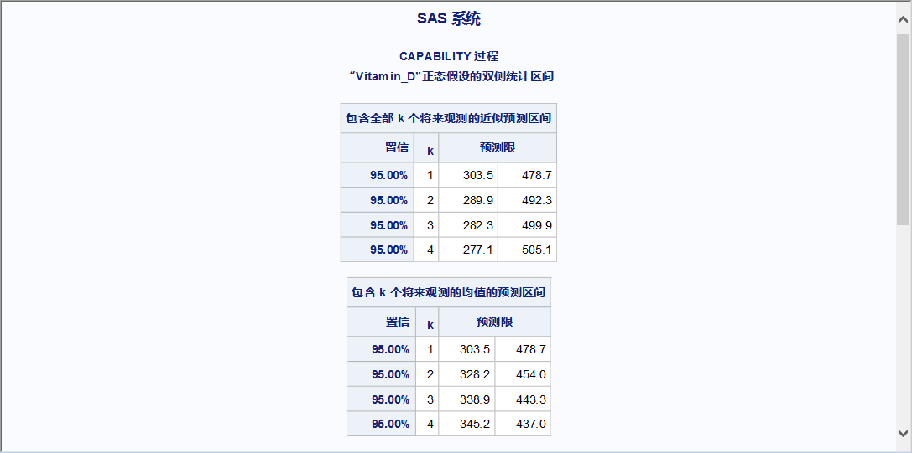
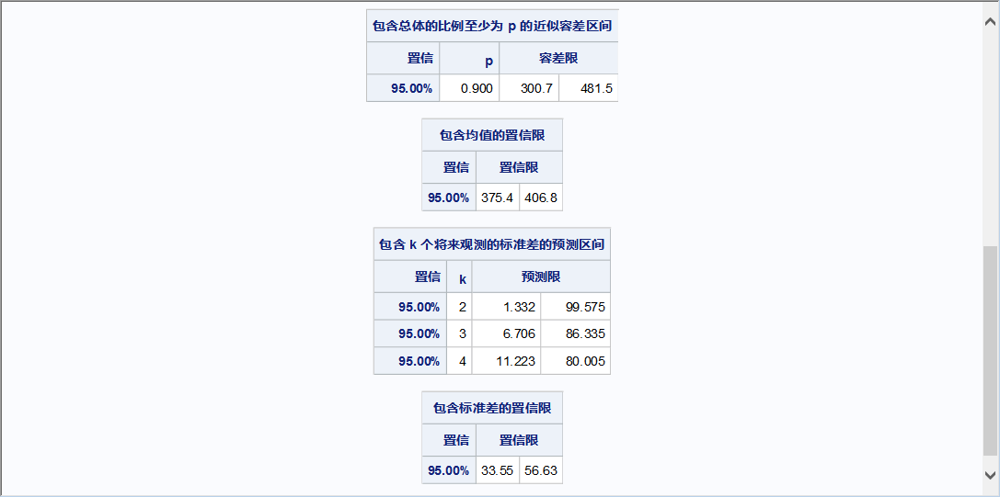
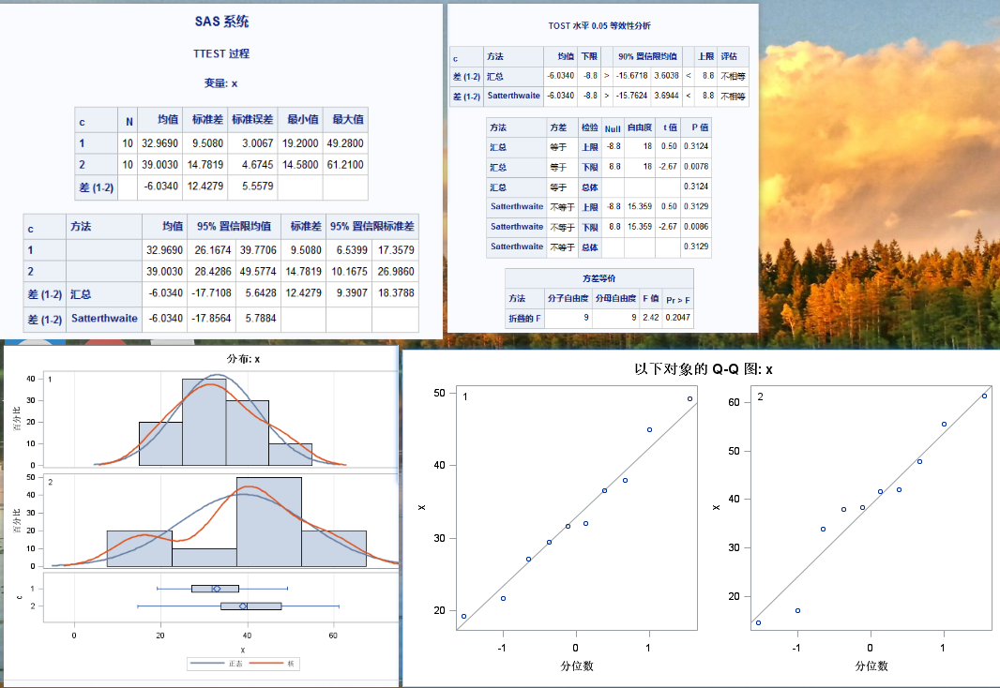
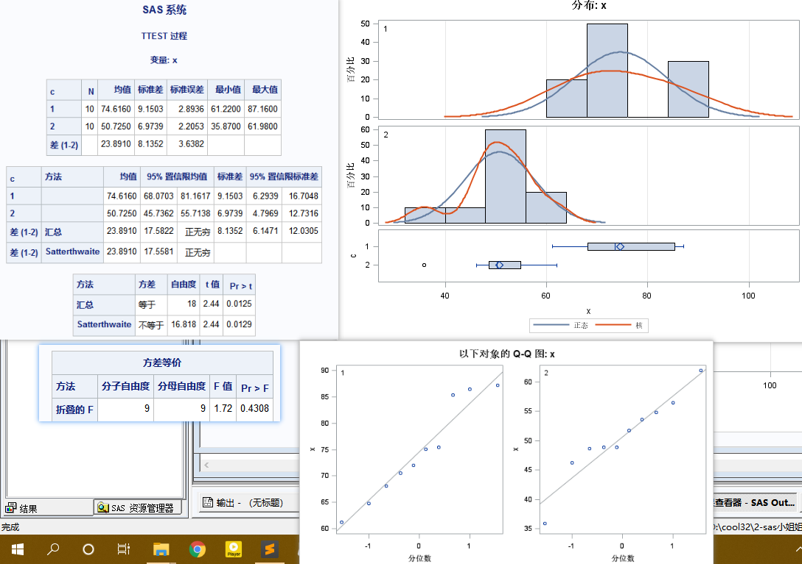

## 实用但并非易获的SAS程序

1-单组设计一元定量资料各种样本均值计算和区间估计

1.1单组设计一元定量资料各种样本平均指标的计算.sas

```sas
DATA mercury;
	input mercury @@;
	g=log10(mercury);
	h=1/mercury;
cards;
 0.6   0.8   0.9   1.1    1.2    1.4   1.5   1.6   1.8   1.9   2.1   2.2    2.4   2.5   2.6
 2.8   2.9   3.1   3.2    3.4    3.5   3.6   3.8   3.9  10.1  10.2  10.4  10.1   4.2   4.2
 4.3   4.4   4.5   4.5    4.6    4.7   4.8   4.8   4.9   5.0   5.1   5.2    5.2   5.3   5.4
 5.5   5.5   5.6   5.7    5.8    5.8   5.9   6.0   6.1   6.2   6.2   6.3    6.4   6.5   6.5
 6.6   6.7   6.8   6.8    6.9    7.0   7.1   7.2   7.2   7.3   7.4   7.5    7.5   7.6   7.7
 7.8   8.1   8.1   8.2    8.3    8.3   8.4   8.5   8.5   8.6   8.7   8.7    8.8   8.9   8.9
 9.0   9.1   9.1   9.2    9.3    9.3   9.4   9.5   9.5   9.6   9.7   9.7    9.8   9.9   9.9
10.0  10.1  10.1  10.2  10.3   10.3  10.4  10.5  10.5  10.6  10.7  10.7   10.8  10.9  10.9
11.0  11.1  11.1  11.2  11.3   11.3  11.4  11.5  11.5  11.6  11.7  11.7   11.8  11.9  12.1
12.2  12.2  12.3  12.4  12.5   12.5  12.6  12.7  12.8  12.8  12.9  13.0   13.1  13.2  13.2
13.3  13.4  13.5  13.5  13.6   13.7  13.8  13.8  13.9  14.0  14.1  14.2   14.2  14.3  14.4
14.5  14.5  14.6  14.7  14.8   14.8  14.9  15.0  15.1  15.2  15.2  15.3   15.4  15.5  15.5
15.6  15.7  15.8  15.8  16.1   16.2  16.3  16.3  16.4  16.5  16.6  16.7   16.8  16.8  16.9
17.0  17.1  17.2  17.3  17.3   17.4  17.5  17.6  17.7  17.8  17.8  17.9   18.0  18.1  18.2
18.3  18.3  18.4  18.5  18.6   18.7  18.8  18.8  18.9  19.0  19.1  19.2   19.3  19.3  19.4
19.5  19.6  19.7  19.8  20.2   20.3  20.5  20.7  20.8  21.0  21.2  21.3   21.5  21.7  21.8
22.0  22.2  22.3  22.5  22.7   22.8  23.0  23.2  23.3  23.5  23.7  24.2   24.4  24.7  24.9
25.1  25.3  25.6  25.8  26.0   26.2  26.4  26.7  26.9  27.1  27.3  28.3   28.6  28.9  29.1
29.4  29.7  30.0  30.3  30.6   30.9  31.1  31.4  32.4  32.8  33.2  37.6   34.0  34.4  34.8
35.2  35.6  27.8  27.7  37.7   38.2  38.8  39.3   9.9  40.6   9.9  41.9   42.5  45.3  46.5
;
run;
proc univariate data=mercury trim=3 winsor=3;
	var mercury g h;
	output out=a1 mean=arit_mean mean_g mean_h 
                  mode=mode median=median;
	ods output TrimmedMeans=trim_mean1(obs=1);
	ods output WinsorizedMeans=wins_mean1(obs=1);
run;

DATA a2(keep=geom_mean harm_mean);
	set a1;
	geom_mean=10**(mean_g);
	harm_mean=1/mean_h;
run;

data a3;
	set trim_mean1;
	trim_mean=mean;
	if _n_>=2 then delete;
run;
data a4;
	set wins_mean1;
	wins_mean=mean;
    if _n_>=2 then delete;
run;
data total;
	merge a1(keep=arit_mean median mode) a2(keep=geom_mean harm_mean) a3 a4;
ods html;
proc print data=total;
	var arit_mean median mode geom_mean harm_mean trim_mean wins_mean;
run;
ODS HTML CLOSE;


```


返回：


## 1.2单组设计一元定量资料参数的各种区间估计.sas	


```sas
DATA P170_TABLE7_1;
	INPUT Vitamin_D @@;
CARDS;
289 355 376 392 406 433 326 363 379 395 410 434
339 364 384 396 413 456 346 370 386 398 422 471
353 373 389 403 427 485
;
RUN;
/* METHODS=1 求未来K个个体值的预测区间                             */
/* METHODS=2 求未来K个个体值的平均值的预测区间                      */
/* METHODS=3 求至少包含总体中比例为P的个体的容许区间,必须给定比例值P */
/* METHODS=4 求总体平均值的置信区间                                */
/* METHODS=5 求未来K个个体值的标准差的预测区间                      */
/* METHODS=6 求总体标准差的置信区间                                */
/* 若不指定K的值,缺省值为K=1 2 3,即预测3个未来的个体观测值的区间     */

ODS HTML;
PROC CAPABILITY DATA=P170_TABLE7_1 NOPRINT;
      INTERVALS Vitamin_D / METHODS=1 2 3 4 5 6  ALPHA=0.05 K=1 2 3 4 P=0.9;
RUN;
ODS HTML CLOSE;


```


结果






## 2-基于原始定量资料进行三种特殊检验

## 2.1基于原始定量数据进行等效性检验的SAS程序.sas

```

data equiv;
input c x @@;
cards;
1	31.68	2	55.56
1	36.48	2	17.03
1	29.48	2	33.95
1	19.20	2	47.77
1	27.04	2	61.21
1	31.96	2	42.00
1	44.90	2	38.02
1	21.66	2	14.58
1	49.28	2	38.25
1	38.01	2	41.66
;
run;
proc ttest tost(8.8);
class c;
var x;
run;

```



## 2.2基于原始定量数据进行非劣效性检验的SAS程序.sas

```sas

data uppertest;
input c x @@;
cards;
1	5.16	2	5.79
1	1.69	2	5.10
1	2.86	2	3.88
1	3.80	2	2.63
1	2.60	2	1.87
1	5.49	2	8.94
1	4.62	2	5.70
1	1.40	2	2.51
1	3.49	2	3.01
1	3.93	2	8.14
;
ods html;
proc ttest sides=u h0=-0.7;
class  c;
var x;
run;
ods html close;


```


同上

```
data uppertest;
input c x @@;
cards;
1	5.16	2	5.79
1	1.69	2	5.10
1	2.86	2	3.88
1	3.80	2	2.63
1	2.60	2	1.87
1	5.49	2	8.94
1	4.62	2	5.70
1	1.40	2	2.51
1	3.49	2	3.01
1	3.93	2	8.14
;
ods html;
proc ttest sides=u h0=-0.7;
class  c;
var x;
run;
ods html close;

```


## 2-3基于原始定量数据进行优效性检验的SAS程序.sas

```sas
data suptest;
input c x@@;
cards;
1	70.53	2	46.24
1	87.16	2	35.87
1	86.45	2	53.62
1	75.40	2	61.98
1	61.22	2	56.46
1	85.34	2	51.70
1	64.84	2	48.91
1	75.05	2	48.68
1	68.14	2	54.88
1	72.03	2	48.91
;
run;
ods html;
proc ttest sides=u h0=15;
class  c;
var x;
run;
ods html close;

```





riqi

```sas
data fmttest;
           set uscpi;
           date0 = date; date1 = date;
  label date  = "DATE with MONYY.format"
              date1 = "DATE with DATE.format "
                   dete0 = "DATE with no format';
           format date monyy. date1 date.;
  run;
   proc print date = fmttest label;
   run;


```

riqi

```
data  __null__;
	date ="17oct91"d;
	put date =;
run;
```

run?

```sas

proc reg data =a;
	
	model y = x1-x10;
run;
```

run2?


```
proc reg data =a;
	
	model y = x1-x10;
	model y = x1-x10/selction = wtepwise
	plot y * x1 = "*"
run;
```


## 安装

```
下载链接：http://pan.baidu.com/s/1kVKKXAR   提取密码：（这个sas9.4破解版）
附：
   根据二○○二年一月一日《计算机软件保护条例》规定：为了学习和研究软件内含的设计思想和原理，通过安装、显示、传输或者存储软件等方式使用软件的，可以不经软件著作权人许可，不向其支付报酬!
   鉴于此，也希望大家按此说明研究软件!谢谢

```


## 参考文献

```
《SAS 系统 Base SAS 软件 使用手册》 高惠璇
《SAS系统 SAS/ETS软件 使用手册》


```

