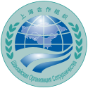

## 周二11-19

1. SAP统计分析几乎
2. 样表（表格）
3. 写ads分析 数据集
4. ads 表
   1. sas
   2. ods 增强数据集
   3. sdml
5. ss发一个条件的人群
   1. 安全基因

总结:

```
第一个 是做一个word
第二个是做个excel

```


## 周一例会11-25

- cdisc标准
  - 临床数据交换标准协会 (clinical data interchange standards consortium, CDISC) 
- crf
  - 病历报告表 (case report form, CRF) （纸质的）
  - 电子数据采集 (EDC) 系统             （电子的）
- sdtm
  - 基于研究数据制表标准 (study data tabulation model, SDTM)
- cdash
  - 临床数据获取协调标准 (clinical data acquisition standards harmonization, CDASH) 
- soc 护理标准 Standards Of Care
- 3c
- df
- tfl
- edc
- cta
  - [Computed Tomography Angiography](https://zh.wikipedia.org/wiki/Computed_Tomography_Angiography)，一种医学影像学检查
- sco




## stdm研究数据列表模型

```

```

SDTM（研究数据列表模型）定义了人类临床试验（研究）数据列表和非临床研究数据列表的标准结构，这些结构将作为产品申请的一部分提交给监管机构（例如美国食品药品监督管理局）（FDA）。临床数据交换标准协会（CDISC）的提交数据标准团队定义了SDTM。

2004年7月21日，SDTM被选为向FDA提交列表数据进行临床试验的标准规范，并于2011年7月5日被选为非临床研究的标准规范。最终，所有数据提交都应符合此格式。结果，临床和非临床数据管理者将需要精通SDTM，以准备提交的内容并在适当的情况下将SDTM结构应用于操作数据管理。


背景
SDTM围绕收集的关于参与临床研究的受试者的观察概念而构建。每个观察值可以由一系列变量来描述，这些变量对应于数据集或表中的一行。每个变量都可以根据其角色进行分类。角色确定变量传达的有关每个不同观察值的信息类型以及如何使用它。变量可分为四个主要角色：

标识符变量，用于标识研究，观察对象，域和记录的序号
主题变量，用于指定观察的重点（例如实验室测试的名称）
计时变量，描述观察的时间（例如开始日期和结束日期）
限定词变量，包括附加的说明性文字或描述观察结果或附加特征的数值（例如单位或描述性形容词）。
第五种可变角色Rule（规则）可以表示一种算法或可执行方法，以定义Trial Design（试验设计）模型中的开始，结束或循环条件。

Qualifier变量集可以进一步分为五个子类：

分组限定符用于将同一域内的一组观察结果分组在一起。示例包括--CAT和--SCAT。
结果限定符描述与发现的主题变量关联的特定结果。这是对主题变量提出的问题的答案。示例包括--ORRES，-STRESC和--STRESN。DM域中的许多值也归类为“结果限定符”。
同义词限定符为观察中的特定变量指定替代名称。示例包括--MODIFY和--DECOD，它们是--TRT或--TERM主题变量的等效术语； --TEST和--LOINC，它们是--TESTCD的等效术语。
记录限定符总体上定义了观察记录的其他属性（而不是描述记录中的特定变量）。示例包括--REASND，AESLIFE和AE域中的所有其他SAE（严重不良事件）标志变量；和--BLFL，-POS和--LOC，-SPEC，-LOT，-NAM。
变量限定符用于进一步修改或描述观察中的特定变量，并且仅在它们限定的变量的上下文中才有意义。示例包括--ORRESU，-ORNRHI和--ORNRLO，它们都是--ORRES的变量限定符，以及--DOSU和--DOSFRM，它们都是--DOSE的变量限定符。
例如，在观察中，“受试者101在研究第6天开始出现轻度恶心”，主题变量值是不良事件的术语“ NAUSEA”。Identifier变量是主题标识符“ 101”。时间变量是事件开始的学习日，它捕获信息，“从学习第6天开始”，而记录预选赛的一个示例是严重性，其严重性值为“ MILD”。

可以包括其他Timing和Qualifier变量以提供必要的详细信息，以充分描述观察结果。•PROC CDISC的SDTM附加功能不会将现有的SDS 2.x内容转换为SDTM 3.x表示形式。

数据集和域
通常收集一系列领域中所有主题的观察结果。域被定义为与逻辑相关的观察结果的集合，这些观察结果具有关于试验对象的特定于主题的共性。关系的逻辑可能与数据的科学问题或其在试验中的作用有关。

通常，每个域都由一个数据集表示，但是有可能将与同一主题相关的信息散布在多个数据集中。每个数据集都有一个独特的，两个字符的DOMAIN代码，应在整个提交过程中一致使用。此DOMAIN代码用于数据集名称，该数据集中的DOMAIN变量的值，并用作数据集中大多数变量名称的前缀。

用于观察的数据集结构是一个平面文件，表示具有一个或多个行和列的表。通常，为每个域提交一个数据集。数据集的每一行代表一个观测值，每一列代表一个变量。每个数据集或表都随附有元数据定义，这些元数据定义提供了有关数据集中使用的变量的信息。元数据在名为“ Define”的数据定义文档中进行了描述，该文档随数据一起提交给监管机构。

提交元数据模型使用七个不同的元数据属性为元数据定义文档中的每个数据集变量定义：

变量名称（限制为8个字符，以便与SAS System V5传输格式兼容）
描述性变量标签，最多使用40个字符，对于数据集中的每个变量应该是唯一的
数据类型（例如，变量值是字符还是数字）
变量的值或表示格式的一组受控术语（受控术语或格式）
每个变量的来源或来源
变量的角色，确定如何在数据集中使用变量。角色用于表示变量的类别，例如标识符，主题，时间或五种限定词。由于这些角色是为遵循常规类别的所有域预定义的，因此发起者无需在其“定义数据定义”文档中指定这些角色。实际的提交元数据可能会使用其他角色指定，并且每个变量可以分配多个角色来满足不同的需求。
有关变量或其数据的注释或其他相关信息。
存储在数据集变量中的数据包括原始值（原始收集的）和派生值（例如，转换为标准单位，或基于多个值（例如平均值）进行计算）。在SDTM中，只有名称，标签和类型与一组CDISC指南一起列出，这些指南为常规观察类使用的每个变量提供了常规描述。

根据个别研究的需要，必要时包含评论。“受控术语或格式”列中带有星号（*）表示应为该变量提供一组离散的值（受控术语）。在尚未定义标准词汇表（由单个*表示）或来自外部出版来源（例如MedDRA）（由**表示）的情况下，这组值可以由发起者定义。 ↑

专用域
CDISC版本3.x提交数据域模型包括具有特定结构的专用域，并且不能使用除指定的限定符或时序变量以外的任何其他限定符或时序变量进行扩展。

受众特征包括一组描述临床研究中每个受试者的标准变量
注释描述了一种固定的结构，用于记录关于某个主题的自由文本注释，或与其他域中的记录或记录组相关的注释。
试用设计模型中讨论了其他固定结构，不可扩展的特殊用途域。

一般领域类
在研究过程中收集的大多数观察结果（特殊用途领域中的观察结果除外）应分为三类常规观察值：干预，事件或发现：

干预类别记录了研究方案（例如“暴露”）指定的，与研究评估期相吻合的故意向受试者施用的研究治疗，治疗方法和外科手术程序（具有一定的实际或预期的生理效果）。 （例如「伴随药物」）或受试者自行服用的其他物质（例如酒精，烟草或咖啡因）
事件类捕获与试验期间（例如，“不良事件”或“处置”）或试验之前（例如，“病史”）发生的计划研究评估无关的事件或事件。
Findings类捕获计划评估得出的观察结果，以解决特定问题，例如身体检查，实验室测试，ECG测试以及问卷中列出的单个问题集。
在大多数情况下，通过时事性来识别适用于特定数据集合的通用类别非常简单。通常，“发现”普通班是收集作为测量或对问题的回答的普通观测数据的最佳选择。在话题性可能不清楚的情况下，类别的选择可能更多地基于协议或分析计划或数据结构的科学意图。

基于任何常规观测类的所有数据集共享一组公共标识符变量和时间变量。确定域中包括哪些变量时，应遵循三个通用规则：

同一组标识符变量基于常规观察类适用于所有域。可以在适当的地方使用可选的标识符。
允许在任何提交数据集中使用任何有效的Timing变量（例如用于描述具有更精确时间点的研究，例如Pharmacokinetics试验），但在适用于所有领域的情况下，应一致使用。
同一通用类中的任何其他限定符变量都可以添加到域模型中。

````

````

## CDISC标准域模型（SDTMIG 3.2）

**Special-Purpose Domains:** **特殊领域**

- Comments (CO)                   评论（CO）
- Demographics (DM)            客层（DM）
- Subject Elements (SE)             主题元素（SE）
- Subject Visits (SV)                    主题访问（SV）

**Interventions General Observation Class:** **干预普通观察班**

- Concomitant Medications (CM)           伴随药物（CM）
- Exposure as Collected (EC)      收集的暴露量（EC）
- Exposure (EX)	              曝光（EX）
- Substance Use (SU)          物质使用（SU）
- Procedures (PR)          程序（公关）

**Events General Observation Class:** **活动一般观察班**

- Adverse Events (AE)           **不良事件（AE）**
- Clinical Events (CE)        临床事件（CE）
- Disposition (DS)         处置（DS）
- Protocol Deviations (DV)   协议偏差（DV）
- Medical History (MH)            病史（MH）
- Healthcare Encounters (HO)    医疗保健遭遇

**Findings General Observation Class:** **调查结果一般观察班**

- Drug Accountability (DA) 药品责任（DA）
- Death Details (DD)         死亡详情
- ECG Test Results (EG)      心电图测试结果
- Inclusion/Exclusion Criterion Not Met (IE)        不符合纳入/排除标准
- Immunogenicity Specimen Assessments (IS)    免疫原性标本评估
- Laboratory Test Results (LB)      实验室测试结果
- Microbiology Specimen (MB)       微生物标本
- Microscopic Findings (MI)            微观发现
- Morphology (MO)             形态学
- Microbiology Susceptibility Test (MS)          微生物敏感性测试
- PK Concentrations (PC)     PK浓度
- PK Parameters (PP)           PK参数
- Physical Examination (PE)      身体检查
- Questionnaires (QS)          问卷
- Reproductive System Findings (RP)         生殖系统发现
-  Disease Response (RS)        疾病反应
- Subject Characteristics (SC)       学科特征
- Subject Status (SS)           主题状态
- Tumor Identification (TU)        肿瘤识别
- Tumor Results (TR)           肿瘤结果
- Vital Signs (VS)     生命体征

**Findings About :** 关于以下内容的发现

- Findings About Events or Interventions (FA)      
  - 关于事件或干预措施（FA）的发现
- Skin Response (SR) 皮肤反应

**Trial Design Domains:** **试用设计领域**

- Trial Arms (TA)          试用武器
- Trial Disease Assessment (TD)     试验疾病评估
- Trial Elements (TE)          试用元素
- Trial Visits (TV)          试用访问
- Trial Inclusion/Exclusion Criteria (TI)     试验纳入/排除标准
- Trial Summary (TS)          试用摘要

**Special-Purpose Relationship Datasets:特殊关系数据集**

- Supplemental Qualifiers - SUPPQUAL    补充资格赛-SUPPQUAL
- Relate Records - RELREC								相关记录

标准的局限性和批评
对SDTM标准的一种批评是它们不断变化，经常发布新版本。CDISC声称SDTM标准是向后兼容的。但是这种说法是不可靠的。在临床试验完成之前，无法将数据从EDC DBMS映射到SDTM标准。最近添加了新域，例如收集的暴露（EC）域。但是，并非始终可以与早期域兼容。该标准不可靠，并且已经完善。受控术语是美国国家癌症研究所术语的很小一部分。

## send 标准非临床数据交换

```
该标准非临床数据交换（SEND）是的执行CDISC 标准数据制表模型（SDTM）对非临床研究，其指定的方式存在非临床数据一致的格式。这些类型的研究与药物开发过程中进行的动物测试有关。为支持向美国食品药品监督管理局提交新药而于2016年12月18日开始的毒理学动物研究原始数据将通过SEND提交给该机构。

具有行业可以遵循的通用模型可以带来好处，例如供应商开发工具的能力，组织形式上的数据交换（无论所涉及的各方如何）等等。

SEND包由几部分组成，但主要重点是单个端点数据。端点通常具有许多变量（aka，列或字段）映射到域（本质上是数据集）。
```


## sco(不常用)上海合作组织

```
上海合作组织（简称上合组织；俄语：Шанха́йская организа́ция сотру́дничества，缩写为 ШОС；英语：Shanghai Cooperation Organization，缩写为 SCO）
是中华人民共和国、俄罗斯、哈萨克、吉尔吉斯斯坦、塔吉克斯坦、乌兹别克、巴基斯坦和印度等8个国家组成的一个国际组织，另有四个观察员国：蒙古、白俄罗斯、伊朗、阿富汗，以及六个对话伙伴国：亚美尼亚、阿塞拜疆、柬埔寨、尼泊尔、斯里兰卡、土耳其[1]。工作语言为汉语和俄语[2]。
成员国总面积为3435.7万平方公里，即亚欧大陆总面积的3/5，人口30亿，为世界总人口的43%。这是在中国境内成立的第2个政府间国际组织，及首次以其城市命名，宣称以“上海精神”解决各成员国间的边境问题。


上海合作组织
Shanghai Cooperation Organisation (SECTSCO)
俄语：Шанхайская организация сотрудничества
简称	SCO / ShOS
成立时间	1996年4月26日上海五国会晤机制形成;2001年6月15日上海合作组织成立.
类型	集体安全、政治、经济等领域政府间国际组织
总部	中国 北京（秘书处）/ 乌兹别克斯坦 塔什干（地区反恐怖机构）
官方语言:汉语、俄语
秘书长:乌兹别克斯坦 - 诺罗夫·弗拉基米尔·伊马莫维奇（2019年1月1日起）
副秘书长:哈萨克斯坦 - 阿科甚卡罗夫 ·努尔兰·索韦托维奇（2018年起）
中国 - 谢小用（2018年8月起）
吉尔吉斯斯坦 - 苏巴阔热耶娃· 阿依扎达· 穆拉特别阔夫娜（2018年2月起）
俄罗斯 - 波塔片科·弗拉基米尔·费奥多罗维奇（2016年8月起）
塔吉克斯坦 - 卓农·舍拉利·萨伊达米尔（2019年起）
反恐怖机构执委会主任:塔吉克斯坦 - 吉约索夫•朱马宏•法伊约佐维奇
网站	chn.sectsco.org（秘书处（中文））/ ecrats.org/cn/（地区反恐怖机构（中文））
```


## 参考文献

````
药学学报 acta pharmaceutica sinica
http://html.rhhz.net/YXXB/html/20151122.htm

非临床数据交换标准
维基百科，自由的百科全书
````

