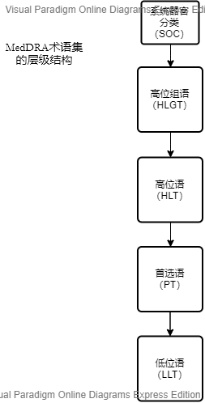

## 缩略词列表

acronyms		首字母缩写词;

abbreviation 	缩略语

------

**STANDS4网络的**成员

医学（medical）->生理学->缩略词

医学->护理标准->缩略词

医疗  » 实验室 »临床试验授权

医疗  » 处方»

学术与科学  »  图书馆 »

| 缩略语  | 全称                                              | 中文全称                   |
| ------- | ------------------------------------------------- | -------------------------- |
| ADT     | Androgen deprivation   therapy                    | 雄激素去除治疗（去势治疗）雄激素剥夺疗法 |
| **AE** | Adverse event                                     | 不良事件                   |
| ALB     | Albumin                                           | 白蛋白  （生理学physiology）    |
| ALP     | Alkaline phosphatase                              | 碱性磷酸酶                 |
| ALT     | Alanine aminotransferase                          | 谷氨酸丙氨酸氨基转移酶     |
| AST     | Aspartate   aminotransferase                      | 谷氨酸天门冬氨酸氨基转移酶 |
| **BID** | <u>Bis in die</u>  Twice A Day                    | 一天两次                   |
| BLQ     | Below   limit of quantitation                     | 低于定量下限               |
| BMI     | Body   mass index                                 | 体重指数                   |
| BUN     | Blood urea   nitrogen                             | 尿素氮                     |
| Ca2+    | Calcium                                           | 钙                         |
| Cl-     | Chlorine                                          | 氯                         |
| Cmin.ss | Cmin   at steady state                            | 稳态谷浓度                 |
| Cr      | Creatinine                                        | 肌酐                       |
| CR      | Complete   Response                               | 完全缓解                   |
| **CRF** | Case report form                                  | 病例报告表                 |
| D       | Day                                               | 天                         |
| DLT     | Dose-limiting toxicity                            | 剂量限制毒性               |
| DoR     | Duration   of response                            | 缓解持续时间               |
| GLU     | Blood glucose                                     | 血糖                       |
| Hb      | Hemoglobin                                        | 血红蛋白                   |
| mCRPC   | Metastatic   castration-resistant prostate cancer | 转移性去势抵抗性前列腺癌   |
| K+      | Serum potassium                                   | 血钾                       |
| LDH     | Lactate dehydrogenase                             | 乳酸脱氢酶                 |
| Na+     | Plasma   sodium                                   | 血钠                       |
| PLT     | Blood platelet                                    | 血小板                     |
| PRO     | Protein   in   urine                              | 尿蛋白                     |
| PSA     | Prostate   specific antigen                       | 前列腺特异性抗原           |
| PR      | Partial Response                                  | 部分缓解                   |
| **QD**  | Quaque die                                        | 每天一次                   |
| RBC     | Red blood cell count                              | 红细胞计数                 |
| **SAE** | Serious adverse event<br />Site Area Emergency    | 严重不良事件<br />场区应急 |
| **SAP** | Statistical analysis plan                         | 统计分析计划               |
| SIE     | Adverse events of   special interest              | 特别关注不良事件           |
| TBIL    | Total bilirubin                                   | 总胆红素                   |
| TC      | Total cholesterol                                 | 总胆固醇                   |
| **TEAE** | Treatment   emergent adverse event                | 治疗期间不良事件 （治疗中）     |
|          |                                                   |                             |
| RCT |randomized controlled trial| 随机对照临床试验 |
| CTA      | CT血管造影术                                      | <u>临床试验授权</u> |
|BP|Blood Pressure|血压|
|consoft|康软||
|             |                                                    |                                          |
|             |                                                    |                                          |
|             |                                                    |                                          |
|             |                                                    |                                          |
|TFL|Tensor Fasciae Latae[ 医学相关   生理 ]|阔筋膜张肌|
| ICH | International Conference on Harmonization[ 医学相关   肿瘤科 ] | **国际协调会议** |
| SMQ         | 分析查询                                           |                                          |
|SOC|27 个互不排斥的平行轴;System Organ Class|**系统器官分类**|
|HLGT|高级别小组条款（MedDRA）High-Level **Group** Terms|高组位语 （组术语）|
| HLT         | 高 级别 条款                                       |高位语|
| PT          | 首选条款Preferred Term                             | 首选术语                                 |
|LLT|Lower-Level Terms|低位语~下层条款（MedDRA）|
||||
|CDC||疾病控制中心（美国）|
|CNS||中枢神经系统|
|CSF||脑脊液|
|**ECG**||**心电图**|
|NEC|限于 HLT 和 HLGT 层级|不另分类|
|NOS|仅限于 LLT 层|非另指|
|LLT CVA||脑血管意外|
|LLT **LFT**||肝脏功能检查值升高能指标升高|
|MedDRA21.0|MedDRA监管活动医学词典||

ICH E3是准则，不是一组严格的要求或模板，灵活性是其使用所固有的。“该指南旨在帮助赞助商制定完整，无歧义，组织合理且易于审核的报告。”


LLT构成了本术语集的最低层级。每个 LLT 仅对应于一个 PT 。

PT是对某种症状、体征、疾病、诊断、适应症、检查、外科和内科操作、疾病史、社会史或家族史等单一医学概念进行独特表达的专用术语。。PT 必须定义明确，无歧义，特异性和描述性强且符合国际标准。冠以人名的术语必须是国际公认的才可以使用。

HLT是PT 的上级术语。高位语属于概括性术语，通过解剖学、病理学、生理学、病因学或功能等特点与下级PT 关联。

HLGT通过解剖学、病理学、生理学、病因学或功能等特点与一个或多个 HLT 对应，是HLT的上级术语。HLGT 旨在用于数据检索和表达。HLGT 对 HLT进行了分组归类，其概念更宽泛，有助于检索。HLGT 是 SOC 的下一层级，可以多对多。

“除”和“含”
为了与术语组的规则一致，包括”“含”或“除”的术语，其标准用法为：

1. “除”表示排除、除外。
2. “含”表示包括。

希腊字母：使用希腊字母全称而非缩写（使用“alpha;” 而非“α”；“beta”而非“β”）

冠以人名的术语：仅使用国际公认的冠以人名的术语（如：与 PT 单核细胞增多症异嗜白细胞检查对应的 LLT 保罗 - 邦内尔检查）。


## SOC

SOC是层级结构的最高层级，为数据检索提供最广泛的概念。SOC 按以下标准分组：
• 病因学（如：SOC 感染及侵染类疾病 )
• 发病部位（如：SOC 胃肠系统疾病）
• 目的（如：SOC 各种手术及医疗操作）

```
SOC代谢及营养类疾病
SOC耳及迷路类疾病
SOC肝胆系统疾病
SOC感染及侵染类疾病
SOC各类检查
SOC精神病类
SOC各类神经系统疾病
SOC各类损伤、中毒及手术并发症
SOC各种肌肉骨骼及结缔组织疾病
SOC各种先天性家族性遗传性疾病
SOC呼吸系统、胸及纵隔疾病
SOC良性、恶性及性质不明的肿瘤（包括囊状和息肉状）
SOC免疫系统疾病
SOC内分泌系统疾病
SOC皮肤及皮下组织类疾病
SOC全身性疾病及给药部位各种反应
SOC妊娠期、产褥期及围产期状况
SOC 产品问题

SOC社会环境
SOC肾脏及泌尿系统疾病
SOC生殖系统及乳腺疾病
SOC各种手术及医疗操作
SOC胃肠系统疾病
SOC心脏器官疾病
SOC血管与淋巴管类疾病
SOC血液及淋巴系统疾病
SOC眼器官疾病
```

```
SOC 感染及侵染类疾病
SOC 良性、恶性及性质不明的肿瘤（包括囊状和息肉状）
SOC 血液及淋巴系统疾病
SOC 免疫系统疾病
SOC 内分泌系统疾病
SOC代谢及营养类疾病
SOC 精神病类
SOC 各类神经系统疾病
SOC 眼器官疾病
SOC 耳及迷路类疾病
SOC 心脏器官疾病
SOC 血管与淋巴管类疾病
SOC 呼吸系统、胸及纵隔疾病
SOC 胃肠系统疾病
SOC 肝胆系统疾病
SOC 皮肤及皮下组织类疾病
SOC 各种肌肉骨骼及结缔组织疾病
SOC 肾脏及泌尿系统疾病
SOC 妊娠期、产褥期及围产期状况
SOC 生殖系统及乳腺疾病

SOC 各种先天性家族性遗传性疾病
SOC全身性疾病及给药部位各种反应
SOC 各类检查
SOC 各类损伤、中毒及手术并发症
SOC 各种手术及医疗操作
SOC 社会环境
SOC 产品问题
```


## 2注释

```
CTA是一种非创伤性的评价血管系统的检查方法.
首先,CTA必须注射碘造影剂.有过造影剂过敏的患者（从皮疹----休克）就不能再做这个检查了.还有肾功能异常（血清肌酐超过正常上限）的患者,按医生的要求,慎重使用造影剂（因为造影剂有可能导致肾功能的进一步恶化）.
检查前禁食4小时即可,不禁水,而且有条件的话应该多喝一点水,有利用造影剂的快速排泄.

	
```


## 例子

医学教育,临床工作

```
缩略词是关键
31 y/o F pt, w/o PMHX, wt 55kg, At ED, cc: severe headache, BLE weak, NVD. PE: TPR normal, PERL. Stat CT, bl work WNL. no meds before adm. Rx?

在这个全球化的时代，如何和外国医生交流？
31 year old female patient, weight 55kg, at emergency department, chief complaint: severe headache, both lower extremities weak. Physical examination: temperature, pulse, respirations normal，pupils equal and reactive to light. Immediately CT scan and blood test within normal limits. No medication before admission. Diagnosis?
31岁的女病人，体重55公斤，急诊科，主要主诉：
剧烈头痛，双下肢无力。 体格检查：温度，脉搏，呼吸正常，瞳孔均等并对光有反应。 立即在正常范围内进行CT扫描和血液检查。 入院前不服药。 诊断？
```


## 血药药代动力学参数分析

本研究中，采用Phoenix WinNonlin软件（Certara USA Inc，7.0或以上版本），基于药代动力学分析集，以非房室模型（NCA）进行药代动力学参数计算，若PK参数无法通过PK浓度计算得到，则在列表中将显示为“未计算”，在表格中将被处理成缺失值，表示为NR（Not Reportable）。

非房室分析（NCA）单剂量给药后的血药动力学参数包括Cmax、Tmax、AUC0-t、AUC0-inf、CL/F、Vz/F、t1/2、MRT0-t、AUC%Extrap和Kel。血药动力学参数将由第三方计算并进行提供，详情另见其它文件（如适用）。其中主要药代动力学参数的计算方法如下：


 


对Tmax以外的PK参数将采用例数、算术均数、算术标准差、中位数、最小值、最大值、几何均数、几何标准差、变异系数和几何变异系数分别对不同剂量组的各个参数水平进行总结。

对Tmax将采用例数、算术均数、算术标准差、中位数、最小值和最大值分别对不同剂量组的各个参数水平进行总结。

将采用幂模型进行给药剂量自然对数与PK参数（如Cmax、AUC0-t、AUC0-inf）自然对数之间剂量比例关系的探索[1]。该幂模型构建如下：

Ln(AUC) = α + β ln(dose)

其中dose表示给予受试者的研究药物实际剂量（mg）。AUC为PK参数之一，亦可针对其他PK参数进行。

将分剂量组提供PK参数（如Cmax、Tmax、AUC0-t、AUC0-inf）的箱式图。

将提供PK参数（如Cmax、Tmax、AUC0-t、AUC0-inf）与剂量的受试者散点图。

将提供各剂量组PK参数的数据列表。

##  PK参数结果规定：

• 0.0001≤值<1，报告为4位小数点（例如，0.0123）。

• 1≤值<10，报告为3位小数点（例如，1.023）。

• 10≤值<100，报告为2位小数点（例如，10.23）。

• 100≤值<1000，报告为1位小数点（例如，102.3）。

• 值≥1000，报告为0位小数点（例如，1023）。

• Tmax报告为2位小数点（例如，1.02）。


## 参考文献

```
crf
华云线上图书馆
http://www.airitilibrary.com/Publication/alDetailedMesh?DocID=16721977-201008-201008300016-201008300016-701-741
```

