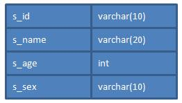

## 数据库

 

###### 1　数据库概念（了解）

1.1　什么是数据库

数据库就是用来**存储和管理**数据的仓库！

数据库存储数据的优先：

l  可存储大量数据；

l  方便检索；

l  保持数据的一致性、完整性；

l  安全，可共享；

l  通过组合分析，可产生新数据。

 

1.2　数据库的发展历程

l  没有数据库，使用磁盘文件存储数据；

l  层次结构模型数据库；

l  网状结构模型数据库；

l  **关系结构**[[c1\]](#_msocom_1) **模型数据库：使用二维表格来存储数据；**

l  关系-对象模型数据库；

 

　　MySQL就是关系型数据库！

 

1.3　常见数据库

l  Oracle（神谕）：甲骨文

l  DB2：IBM；

l  SQL Server：微软；

l  Sybase：赛贝斯；

l  MySQL：甲骨文； Mysql AB--àsun--àoracle

 

1.4　理解数据库

l  RDBMS = 管理员（manager）+仓库（database）

l  database = N个table

l  table：

Ø  表结构：定义表的列名和列类型！

Ø  表记录：一行一行的记录！

 

 

我们现在所说的数据库泛指“关系型数据库管理系统（RDBMS - Relational database management system[[c2\]](#_msocom_2) ）”，即“数据库服务器”。

当我们安装了数据库服务器后，就可以在数据库服务器中创建数据库，每个数据库中还可以包含多张表。

数据库表就是一个多行多列的表格。在创建表时，需要指定表的列数，以及列名称，列类型等信息。而不用指定表格的行数，行数是没有上限的。下面是tab_student表的结构：

 

当把表格创建好了之后，就可以向表格中添加数据了。向表格添加数据是以行为单位的！下面是s_student表的记录：

 

| **s_id**   | **s_name** | **s_age** | **s_sex** |
| ---------- | ---------- | --------- | --------- |
| **S_1001** | zhangSan   | 23        | male      |
| **S_1002** | liSi       | 32        | female    |
| **S_1003** | wangWu     | 44        | male      |

 

大家要学会区分什么是表结构，什么是表记录。

　应用程序与数据库

　　应用程序使用数据库完成对数据的存储！

###### 安装MySQL数据库

2.1　安装MySQL

　　参考：MySQL安装图解.doc

 

2.2　MySQL目录结构

MySQL的数据存储目录为data，data目录通常在C:\Documents and Settings\All Users\Application Data\MySQL\MySQL Server 5.1\data位置。在data下的每个目录都代表一个数据库。

MySQL的安装目录下：

l  bin目录中都是可执行文件；

l  my.ini文件是MySQL的配置文件；

 

###### 3　基本命令

3.1　启动和关闭mysql服务器

l  启动：net start mysql；

l  关闭：net stop mysql；

 

在启动mysql服务后，打开windows任务管理器，会有一个名为mysqld.exe的进程运行，所以mysqld.exe才是MySQL服务器程序。

 

3.2　客户端登录退出mysql

在启动MySQL服务器后，我们需要使用管理员用户登录MySQL服务器，然后来对服务器进行操作。登录MySQL需要使用MySQL的客户端程序：mysql.exe

l  登录：mysql -u root -p 123 -h localhost；

Ø  -u：后面的root是用户名，这里使用的是超级管理员root；

Ø  -p：后面的123是密码，这是在安装MySQL时就已经指定的密码；

l  退出：quit或exit；

 

在登录成功后，打开windows任务管理器，会有一个名为mysql.exe的进程运行，所以mysql.exe是客户端程序。

 

## SQL语句

 

###### 1        SQL概述

1.1　什么是SQL

SQL（Structured Query Language）是“结构化查询语言”，它是对关系型数据库的操作语言。它可以应用到所有关系型数据库中，例如：MySQL、Oracle、SQL Server等。SQ标准（ANSI/ISO）有：

l  SQL-92：1992年发布的SQL语言标准；

l  SQL:1999：1999年发布的SQL语言标准；

l  SQL:2003：2003年发布的SQL语言标准；

 

这些标准就与JDK的版本一样，在新的版本中总要有一些语法的变化。不同时期的数据库对不同标准做了实现。

虽然SQL可以用在所有关系型数据库中，但很多数据库还都有标准之后的一些语法，我们可以称之为“方言”。例如MySQL中的LIMIT语句就是MySQL独有的方言，其它数据库都不支持！当然，Oracle或SQL Server都有自己的方言。

 

1.2　语法要求

l  SQL语句可以单行或多行书写，以分号结尾；

l  可以用空格和缩进来来增强语句的可读性；

l  关键字不区别大小写，建议使用大写；

 

###### 2　分类

l  DDL（Data Definition Language）：数据定义语言，用来定义数据库对象：库、表、列等；

l  DML（Data Manipulation Language）：数据操作语言，用来定义数据库记录（数据）；

 

###### 3　DDL

3.1　基本操作

l  查看所有数据库名称：SHOW DATABASES；　

l  切换数据库：USE mydb1，切换到mydb1数据库；

3.2　操作数据库

l  创建数据库：CREATE DATABASE [IF NOT EXISTS] mydb1；

创建数据库，例如：CREATE DATABASE mydb1，创建一个名为mydb1的数据库。如果这个数据已经存在，那么会报错。例如CREATE DATABASE IF NOT EXISTS mydb1，在名为mydb1的数据库不存在时创建该库，这样可以避免报错。

 

l  删除数据库：DROP DATABASE [IF EXISTS] mydb1；

删除数据库，例如：DROP DATABASE mydb1，删除名为mydb1的数据库。如果这个数据库不存在，那么会报错。DROP DATABASE IF EXISTS mydb1，就算mydb1不存在，也不会的报错。

 

l  修改数据库编码：ALTER DATABASE mydb1 CHARACTER SET utf8

修改数据库mydb1的编码为utf8。注意，在MySQL中所有的UTF-8编码都不能使用中间的“-”，即UTF-8要书写为UTF8。

3.3　数据类型

MySQL与Java一样，也有数据类型。MySQL中数据类型主要应用在列上。

 

常用类型：

l  int：整型

l  double：浮点型，例如double(5,2)表示最多5位，其中必须有2位小数，即最大值为999.99；

l  decimal：泛型型，在表单钱方面使用该类型，因为不会出现精度缺失问题；

l  char：固定长度字符串类型；

l  varchar：可变长度字符串类型；

l  text：字符串类型；

l  blob：字节类型；

l  date：日期类型，格式为：yyyy-MM-dd；

l  time：时间类型，格式为：hh:mm:ss

l  timestamp：时间戳类型；

 

3.4　操作表

l  创建表：

CREATE TABLE 表名(

  列名 列类型,

  列名 列类型,

  ......

);

例如：

 

再例如：

 

l  查看当前数据库中所有表名称：SHOW TABLES；　

l  查看指定表的创建语句：SHOW CREATE TABLE emp，查看emp表的创建语句；

l  查看表结构：DESC emp，查看emp表结构；

l  删除表：DROP TABLE emp，删除emp表；

l  修改表：

\1.       修改之添加列：给stu表添加classname列：

ALTER TABLE stu ADD (classname varchar(100));

\2.       修改之修改列类型：修改stu表的gender列类型为CHAR(2)：

ALTER TABLE stu MODIFY gender CHAR(2);

\3.       修改之修改列名：修改stu表的gender列名为sex：

ALTER TABLE stu change gender sex CHAR(2);

\4.       修改之删除列：删除stu表的classname列：

ALTER TABLE stu DROP classname;

\5.       修改之修改表名称：修改stu表名称为student：

ALTER TABLE stu RENAME TO student;

###### 3　基本命令

3.1　启动和关闭mysql服务器

l  启动：net start mysql；

l  关闭：net stop mysql；

 

在启动mysql服务后，打开windows任务管理器，会有一个名为mysqld.exe的进程运行，所以mysqld.exe才是MySQL服务器程序。

 

3.2　客户端登录退出mysql

在启动MySQL服务器后，我们需要使用管理员用户登录MySQL服务器，然后来对服务器进行操作。登录MySQL需要使用MySQL的客户端程序：mysql.exe

l  登录：mysql -u root -p 123 -h localhost；

Ø  -u：后面的root是用户名，这里使用的是超级管理员root；

Ø  -p：后面的123是密码，这是在安装MySQL时就已经指定的密码；

Ø  -h：后面给出的localhost是服务器主机名，它是可以省略的，例如：mysql -u root -p 123；

l  退出：quit或exit；

 

在登录成功后，打开windows任务管理器，会有一个名为mysql.exe的进程运行，所以mysql.exe是客户端程序。

 

## SQL语句

 

###### 1        SQL概述

1.1　什么是SQL

SQL（Structured Query Language）是“结构化查询语言”，它是对关系型数据库的操作语言。它可以应用到所有关系型数据库中，例如：MySQL、Oracle、SQL Server等。SQ标准（ANSI/ISO）有：

l  SQL-92：1992年发布的SQL语言标准；

l  SQL:1999：1999年发布的SQL语言标签；

l  SQL:2003：2003年发布的SQL语言标签；

 

这些标准就与JDK的版本一样，在新的版本中总要有一些语法的变化。不同时期的数据库对不同标准做了实现。

虽然SQL可以用在所有关系型数据库中，但很多数据库还都有标准之后的一些语法，我们可以称之为“方言”。例如MySQL中的LIMIT语句就是MySQL独有的方言，其它数据库都不支持！当然，Oracle或SQL Server都有自己的方言。

 

1.2　语法要求

l  SQL语句可以单行或多行书写，以分号结尾；

l  可以用空格和缩进来来增强语句的可读性；

l  关键字不区别大小写，建议使用大写；

 

###### 2　分类

l  DDL（Data Definition Language）：数据定义语言，用来定义数据库对象：库、表、列等；

l  DML（Data Manipulation Language）：数据操作语言，用来定义数据库记录（数据）；

 

###### 3　DDL

3.1　基本操作

l  查看所有数据库名称：SHOW DATABASES；　

l  切换数据库：USE mydb1，切换到mydb1数据库；

3.2　操作数据库

l  创建数据库：CREATE DATABASE [IF NOT EXISTS] mydb1；

创建数据库，例如：CREATE DATABASE mydb1，创建一个名为mydb1的数据库。如果这个数据已经存在，那么会报错。例如CREATE DATABASE IF NOT EXISTS mydb1，在名为mydb1的数据库不存在时创建该库，这样可以避免报错。

 

l  删除数据库：DROP DATABASE [IF EXISTS] mydb1；

删除数据库，例如：DROP DATABASE mydb1，删除名为mydb1的数据库。如果这个数据库不存在，那么会报错。DROP DATABASE IF EXISTS mydb1，就算mydb1不存在，也不会的报错。

 

l  修改数据库编码：ALTER DATABASE mydb1 CHARACTER SET utf8

修改数据库mydb1的编码为utf8。注意，在MySQL中所有的UTF-8编码都不能使用中间的“-”，即UTF-8要书写为UTF8。

 

3.3　数据类型

MySQL与Java一样，也有数据类型。MySQL中数据类型主要应用在列上。

 

常用类型：

l  int：整型

l  double：浮点型，例如double(5,2)表示最多5位，其中必须有2位小数，即最大值为999.99；

l  decimal：泛型型，在表单钱方面使用该类型，因为不会出现精度缺失问题；

l  char：固定长度字符串类型；

l  varchar：可变长度字符串类型；

l  text：字符串类型；

l  blob：字节类型；

l  date：日期类型，格式为：yyyy-MM-dd；

l  time：时间类型，格式为：hh:mm:ss

l  timestamp：时间戳类型；

 

3.4　操作表

l  创建表：

CREATE TABLE 表名(

  列名 列类型,

  列名 列类型,

  ......

);

例如：

 

再例如：

 

l  查看当前数据库中所有表名称：SHOW TABLES；　

l  查看指定表的创建语句：SHOW CREATE TABLE emp，查看emp表的创建语句；

l  查看表结构：DESC emp，查看emp表结构；

l  删除表：DROP TABLE emp，删除emp表；

l  修改表：

\1.       修改之添加列：给stu表添加classname列：

ALTER TABLE stu ADD (classname varchar(100));

\2.       修改之修改列类型：修改stu表的gender列类型为CHAR(2)：

ALTER TABLE stu MODIFY gender CHAR(2);

\3.       修改之修改列名：修改stu表的gender列名为sex：

ALTER TABLE stu change gender sex CHAR(2);

\4.       修改之删除列：删除stu表的classname列：

ALTER TABLE stu DROP classname;

\5.       修改之修改表名称：修改stu表名称为student：

ALTER TABLE stu RENAME TO student;

 

###### 4　DML

4.1　插入数据

语法：

INSERT INTO 表名(列名1,列名2, …) VALUES(值1, 值2)

| **INSERT INTO stu(sid, sname,age,gender) VALUES('s_1001',   'zhangSan', 23, 'male');** |
| ------------------------------------------------------------ |
| **INSERT   INTO stu(sid, sname) VALUES('s_1001', 'zhangSan');**[[崔3\]](#_msocom_3) |

 

语法：

INSERT INTO 表名 VALUES(值1,值2,…)

因为没有指定要插入的列，表示按创建表时列的顺序插入所有列的值：

 

　　注意：所有字符串数据必须使用单引用！

 

4.2　修改数据

语法：

UPDATE 表名 SET 列名1=值1, … 列名n=值n [WHERE 条件]

| **UPDATE stu SET sname=’zhangSanSan’, age=’32’,   gender=’female’ WHERE sid=’s_1001’;** |
| ------------------------------------------------------------ |
| **UPDATE stu SET sname=’liSi’, age=’20’ WHERE age>50   AND gender=’male’;** |
| **UPDATE stu SET sname=’wangWu’, age=’30’ WHERE age>60   OR gender=’female’;** |
| **UPDATE stu SET gender=’female’ WHERE gender IS NULL**   **UPDATE stu SET age=age+1 WHERE sname=’zhaoLiu’;** |

update  person set gender='男' where id=2;

4.3　删除数据

语法：

DELETE FROM 表名 [WHERE 条件]

| **DELETE FROM stu WHERE sid=’s_1001’003B**            |
| ----------------------------------------------------- |
| **DELETE FROM stu WHERE sname=’chenQi’ OR age > 30;** |
| **DELETE   FROM stu;**[[崔4\]](#_msocom_4)            |

 

语法：

TRUNCATE TABLE 表名

 

虽然TRUNCATE和DELETE都可以删除表的所有记录，但有原理不同。DELETE的效率没有TRUNCATE高！

TRUNCATE其实属性DDL语句，因为它是先DROP TABLE，再CREATE TABLE。而且TRUNCATE删除的记录是无法回滚的，但DELETE删除的记录是可以回滚的（回滚是事务的知识！）。

 

 

## 数据查询语法（DQL）

　　DQL就是数据查询语言，数据库执行DQL语句不会对数据进行改变，而是让数据库发送结果集给客户端。

语法：

SELECT selection_list /*要查询的列名称*/

  FROM table_list /*要查询的表名称*/

  WHERE condition /*行条件*/

  GROUP BY grouping_columns /*对结果分组*/

  HAVING condition /*分组后的行条件*/

  ORDER BY sorting_columns /*对结果分组*/

  LIMIT offset_start, row_count /*结果限定*/

 

创建名：

l  学生表：stu

| **字段名称**                                                 | **字段类型** | **说明** |      |
| ------------------------------------------------------------ | ------------ | -------- | ---- |
| **sid**                                                      | char(6)      | 学生学号 |      |
| **sname**                                                    | varchar(50)  | 学生姓名 |      |
| **age**                                                      | int          | 学生年龄 |      |
| **gender**                                                   | varchar(50)  | 学生性别 |      |
| CREATE TABLE stu (            sid    CHAR(6),            sname               VARCHAR(50),            age            INT,            gender     VARCHAR(50)   ); |              |          |      |
| INSERT INTO stu VALUES('S_1001', 'liuYi',   35, 'male');   INSERT INTO stu VALUES('S_1002',   'chenEr', 15, 'female');   INSERT INTO stu VALUES('S_1003',   'zhangSan', 95, 'male');   INSERT INTO stu VALUES('S_1004', 'liSi',   65, 'female');   INSERT INTO stu VALUES('S_1005',   'wangWu', 55, 'male');   INSERT INTO stu VALUES('S_1006',   'zhaoLiu', 75, 'female');   INSERT INTO stu VALUES('S_1007', 'sunQi',   25, 'male');   INSERT INTO stu VALUES('S_1008',   'zhouBa', 45, 'female');   INSERT INTO stu VALUES('S_1009', 'wuJiu',   85, 'male');   INSERT INTO stu VALUES('S_1010',   'zhengShi', 5, 'female');   INSERT INTO stu VALUES('S_1011', 'xxx',   NULL, NULL); |              |          |      |

 

l  雇员表：emp

| **字段名称** | **字段类型** | **说明** |
| ------------ | ------------ | -------- |
| **empno**    | int          | 员工编号 |
| **ename**    | varchar(50)  | 员工姓名 |
| **job**      | varchar(50)  | 员工工作 |
| **mgr**      | int          | 领导编号 |
| **hiredate** | date         | 入职日期 |
| **sal**      | decimal(7,2) | 月薪     |
| **comm**     | decimal(7,2) | 奖金     |
| **deptno**   | int          | 部分编号 |

 

| CREATE TABLE emp(            empno               INT,            ename               VARCHAR(50),            job             VARCHAR(50),            mgr           INT,            hiredate   DATE,            sal             DECIMAL(7,2),            comm                decimal(7,2),            deptno               INT   ) ; |
| ------------------------------------------------------------ |
| INSERT INTO emp values(7369,'SMITH','CLERK',7902,'1980-12-17',800,NULL,20);   INSERT INTO emp   values(7499,'ALLEN','SALESMAN',7698,'1981-02-20',1600,300,30);   INSERT INTO emp   values(7521,'WARD','SALESMAN',7698,'1981-02-22',1250,500,30);   INSERT INTO emp   values(7566,'JONES','MANAGER',7839,'1981-04-02',2975,NULL,20);   INSERT INTO emp   values(7654,'MARTIN','SALESMAN',7698,'1981-09-28',1250,1400,30);   INSERT INTO emp   values(7698,'BLAKE','MANAGER',7839,'1981-05-01',2850,NULL,30);   INSERT INTO emp   values(7782,'CLARK','MANAGER',7839,'1981-06-09',2450,NULL,10);   INSERT INTO emp   values(7788,'SCOTT','ANALYST',7566,'1987-04-19',3000,NULL,20);   INSERT INTO emp   values(7839,'KING','PRESIDENT',NULL,'1981-11-17',5000,NULL,10);   INSERT INTO emp   values(7844,'TURNER','SALESMAN',7698,'1981-09-08',1500,0,30);   INSERT INTO emp   values(7876,'ADAMS','CLERK',7788,'1987-05-23',1100,NULL,20);   INSERT INTO emp   values(7900,'JAMES','CLERK',7698,'1981-12-03',950,NULL,30);   INSERT INTO emp   values(7902,'FORD','ANALYST',7566,'1981-12-03',3000,NULL,20);   INSERT INTO emp values(7934,'MILLER','CLERK',7782,'1982-01-23',1300,NULL,10); |

 

l  部分表：dept

| **字段名称** | **字段类型** | **说明**     |
| ------------ | ------------ | ------------ |
| **deptno**   | int          | 部分编码     |
| **dname**    | varchar(50)  | 部分名称     |
| **loc**      | varchar(50)  | 部分所在地点 |

 

| CREATE TABLE dept(            deptno               INT,            dname               varchar(14),            loc             varchar(13)   ); |
| ------------------------------------------------------------ |
| INSERT INTO dept values(10, 'ACCOUNTING',   'NEW YORK');   INSERT INTO dept values(20, 'RESEARCH', 'DALLAS');   INSERT INTO dept values(30, 'SALES', 'CHICAGO');   INSERT INTO dept values(40, 'OPERATIONS',   'BOSTON'); |

 

###### 1　基础查询

1.1　查询所有列

**SELECT \* FROM stu;**

 

1.2　查询指定列

**SELECT sid, sname, age FROM stu;**

 

###### 2　条件查询

2.1　条件查询介绍

条件查询就是在查询时给出WHERE子句，在WHERE子句中可以使用如下运算符及关键字：

l  =、!=、<>、<、<=、>、>=；

l  BETWEEN…AND；

l  IN(set)；

l  IS NULL；

l  AND；

l  OR；

l  NOT；

 

2.2　查询性别为女，并且年龄50的记录

　　**SELECT \* FROM stu** 

**WHERE gender='female' AND ge<50;**

 

2.3　查询学号为S_1001，或者姓名为liSi的记录

**SELECT \* FROM stu** 

**WHERE sid ='S_1001' OR sname='liSi';**

 

2.4　查询学号为S_1001，S_1002，S_1003的记录

**SELECT \* FROM stu** 

**WHERE sid IN ('S_1001','S_1002','S_1003');**

 

2.5　查询学号不是S_1001，S_1002，S_1003的记录

**SELECT \* FROM tab_student** 

**WHERE s_number NOT IN ('S_1001','S_1002','S_1003');**

 

2.6　查询年龄为null的记录

**SELECT \* FROM stu**

**WHERE age IS NULL;**

 

2.7　查询年龄在20到40之间的学生记录

**SELECT \*** 

**FROM stu**

**WHERE age>=20 AND age<=40;**

或者

**SELECT \*** 

**FROM stu** 

**WHERE age BETWEEN 20 AND 40;**

 

2.8　查询性别非男的学生记录

**SELECT \*** 

**FROM stu**

**WHERE gender!='male';**

或者

**SELECT \*** 

**FROM stu**

**WHERE gender<>'male';**

或者

**SELECT \*** 

**FROM stu**

**WHERE NOT gender='male';**

 

2.9　查询姓名不为null的学生记录

**SELECT \*** 

**FROM stu**

**WHERE NOT sname IS NULL;**

或者

**SELECT \*** 

**FROM stu**

**WHERE sname IS NOT NULL;**

 

###### 3　模糊查询

当想查询姓名中包含a字母的学生时就需要使用模糊查询了。模糊查询需要使用关键字LIKE。

3.1　查询姓名由5个字母构成的学生记录

**SELECT \*** 

**FROM stu**

**WHERE sname LIKE '_____';**

模糊查询必须使用LIKE关键字。其中 “_”匹配任意一个字母，5个“_”表示5个任意字母。

 

3.2　查询姓名由5个字母构成，并且第5个字母为“i”的学生记录

**SELECT \*** 

**FROM stu**

**WHERE sname LIKE '____i';**

 

3.3　查询姓名以“z”开头的学生记录

**SELECT \*** 

**FROM stu**

**WHERE sname LIKE 'z%';**

其中“%”匹配0~n个任何字母。

 

3.4　查询姓名中第2个字母为“i”的学生记录

**SELECT \*** 

**FROM stu**

**WHERE sname LIKE '_i%';**

 

3.5　查询姓名中包含“a”字母的学生记录

**SELECT \*** 

**FROM stu**

**WHERE sname LIKE '%a%';**

 

###### 4　字段控制查询

4.1　去除重复记录

去除重复记录（两行或两行以上记录中系列的上的数据都相同），例如emp表中sal字段就存在相同的记录。当只查询emp表的sal字段时，那么会出现重复记录，那么想去除重复记录，需要使用DISTINCT：

**SELECT DISTINCT sal FROM emp;**

 

4.2　查看雇员的月薪与佣金之和

　　因为sal和comm两列的类型都是数值类型，所以可以做加运算。如果sal或comm中有一个字段不是数值类型，那么会出错。

**SELECT \*,sal+comm FROM emp;**

 

comm列有很多记录的值为NULL，因为任何东西与NULL相加结果还是NULL，所以结算结果可能会出现NULL。下面使用了把NULL转换成数值0的函数IFNULL：

**SELECT \*,sal+IFNULL(comm,0) FROM emp;**

 

4.3　给列名添加别名

在上面查询中出现列名为sal+IFNULL(comm,0)，这很不美观，现在我们给这一列给出一个别名，为total：

**SELECT \*, sal+IFNULL(comm,0) AS total FROM emp;**

给列起别名时，是可以省略AS关键字的：

**SELECT \*,sal+IFNULL(comm,0) total FROM emp;**

 

###### 5　排序

5.1　查询所有学生记录，按年龄升序排序

**SELECT \***

**FROM stu**

**ORDER BY sage ASC;**

或者

**SELECT \***

**FROM stu**

**ORDER BY sage;**

 

5.2　查询所有学生记录，按年龄降序排序

**SELECT \***

**FROM stu**

**ORDER BY age DESC;**

 

5.3　查询所有雇员，按月薪降序排序，如果月薪相同时，按编号升序排序

**SELECT \* FROM emp**

**ORDER BY sal DESC,empno ASC;**

 

###### 6　聚合函数

聚合函数是用来做纵向运算的函数：

l  COUNT()：统计指定列不为NULL的记录行数；

l  MAX()：计算指定列的最大值，如果指定列是字符串类型，那么使用字符串排序运算；

l  MIN()：计算指定列的最小值，如果指定列是字符串类型，那么使用字符串排序运算；

l  SUM()：计算指定列的数值和，如果指定列类型不是数值类型，那么计算结果为0；

l  AVG()：计算指定列的平均值，如果指定列类型不是数值类型，那么计算结果为0；

 

6.1　COUNT

当需要纵向统计时可以使用COUNT()。

l  查询emp表中记录数：

**SELECT COUNT(\*) AS cnt FROM emp;**

 

l  查询emp表中有佣金的人数：

**SELECT COUNT(comm) cnt FROM emp;**

注意，因为count()函数中给出的是comm列，那么只统计comm列非NULL的行数。

 

l  查询emp表中月薪大于2500的人数：

**SELECT COUNT(\*) FROM emp**

**WHERE sal > 2500;**

 

l  统计月薪与佣金之和大于2500元的人数：

**SELECT COUNT(\*) AS cnt FROM emp WHERE sal+IFNULL(comm,0) > 2500;**

 

l  查询有佣金的人数，以及有领导的人数：

**SELECT COUNT(comm), COUNT(mgr) FROM emp;**

 

6.2　SUM和AVG

当需要纵向求和时使用sum()函数。

l  查询所有雇员月薪和：

**SELECT SUM(sal) FROM emp;**

 

l  查询所有雇员月薪和，以及所有雇员佣金和：

**SELECT SUM(sal), SUM(comm) FROM emp;**

 

l  查询所有雇员月薪+佣金和：

**SELECT SUM(sal+IFNULL(comm,0)) FROM emp;**

 

l  统计所有员工平均工资：

**SELECT SUM(sal), COUNT(sal) FROM emp;**

或者

**SELECT AVG(sal) FROM emp;**

 

6.3　MAX和MIN

l  查询最高工资和最低工资：

**SELECT MAX(sal), MIN(sal) FROM emp;**

###### 　分组查询

 

当需要分组查询时需要使用GROUP BY子句，例如查询每个部门的工资和，这说明要使用部分来分组。

 

7.1　分组查询

l  查询每个部门的部门编号和每个部门的工资和：

**SELECT deptno, SUM(sal)**

**FROM emp**

**GROUP BY deptno;**

 

l  查询每个部门的部门编号以及每个部门的人数：

**SELECT deptno,COUNT(\*)**

**FROM emp**

**GROUP BY deptno;**

 

l  查询每个部门的部门编号以及每个部门工资大于1500的人数：

**SELECT deptno,COUNT(\*)**

**FROM emp**

**WHERE sal>1500**

**GROUP BY deptno;**

 

7.2　HAVING子句

l  查询工资总和大于9000的部门编号以及工资和：

**SELECT deptno, SUM(sal)**

**FROM emp**

**GROUP BY deptno**

**HAVING SUM(sal) > 9000;**

　　

注意，WHERE是对分组前记录的条件，如果某行记录没有满足WHERE子句的条件，那么这行记录不会参加分组；而HAVING是对分组后数据的约束。

 

###### 8　LIMIT

LIMIT用来限定查询结果的起始行，以及总行数。

 

8.1　查询5行记录，起始行从0开始

**SELECT \* FROM emp LIMIT 0, 5;**

 

注意，起始行从0开始，即第一行开始！

 

8.2　查询10行记录，起始行从3开始

**SELECT \* FROM emp LIMIT 3, 10;**

 

8.3　分页查询

如果一页记录为10条，希望查看第3页记录应该怎么查呢？

l  第一页记录起始行为0，一共查询10行；

l  第二页记录起始行为10，一共查询10行；

l  第三页记录起始行为20，一共查询10行；

## 多表连接查询

 

l  连接查询

Ø  内连接

Ø  外连接

²  左外连接

²  右外连接

²  全外连接（MySQL不支持）

Ø  自然连接

l  子查询

 

 

###### 　连接查询

连接查询就是求出多个表的乘积，例如t1连接t2，那么查询出的结果就是t1*t2。

连接查询会产生笛卡尔积，假设集合A={a,b}，集合B={0,1,2}，则两个集合的笛卡尔积为{(a,0),(a,1),(a,2),(b,0),(b,1),(b,2)}。可以扩展到多个集合的情况。

那么多表查询产生这样的结果并不是我们想要的，那么怎么去除重复的，不想要的记录呢，当然是通过条件过滤。通常要查询的多个表之间都存在关联关系，那么就通过关联关系去除笛卡尔积。

你能想像到emp和dept表连接查询的结果么？emp一共14行记录，dept表一共4行记录，那么连接后查询出的结果是56行记录。

也就你只是想在查询emp表的同时，把每个员工的所在部门信息显示出来，那么就需要使用主外键来去除无用信息了。

**使用主外键关系做为条件来去除无用信息**

 

上面查询结果会把两张表的所有列都查询出来，也许你不需要那么多列，这时就可以指定要查询的列了。

 

还可以为表指定别名，然后在引用列时使用别名即可。

 

2.1　内连接

上面的连接语句就是内连接，但它不是SQL标准中的查询方式，可以理解为方言！SQL标准的内连接为：

 

内连接的特点：查询结果必须满足条件。例如我们向emp表中插入一条记录：

　　其中deptno为50，而在dept表中只有10、20、30、40部门，那么上面的查询结果中就不会出现“张三”这条记录，因为它不能满足e.deptno=d.deptno这个条件。

 

2.2　外连接（左连接、右连接）

外连接的特点：查询出的结果存在不满足条件的可能。

左连接：

 

左连接是先查询出左表（即以左表为主），然后查询右表，右表中满足条件的显示出来，不满足条件的显示NULL。

这么说你可能不太明白，我们还是用上面的例子来说明。其中emp表中“张三”这条记录中，部门编号为50，而dept表中不存在部门编号为50的记录，所以“张三”这条记录，不能满足e.deptno=d.deptno这条件。但在左连接中，因为emp表是左表，所以左表中的记录都会查询出来，即“张三”这条记录也会查出，但相应的右表部分显示NULL。

 

2.3　右连接

右连接就是先把右表中所有记录都查询出来，然后左表满足条件的显示，不满足显示NULL。例如在dept表中的40部门并不存在员工，但在右连接中，如果dept表为右表，那么还是会查出40部门，但相应的员工信息为NULL。

 

**连接查询心得**：

*连接不限与两张表，连接查询也可以是三张、四张，甚至N**张表的连接查询。通常连接查询不可能需要整个笛卡尔积，而只是需要其中一部分，那么这时就需要使用条件来去除不需要的记录。这个条件大多数情况下都是使用主外键关系去除。*

*两张表的连接查询一定有一个主外键关系，三张表的连接查询就一定有两个主外键关系，所以在大家不是很熟悉连接查询时，首先要学会去除无用笛卡尔积，那么就是用主外键关系作为条件来处理。如果两张表的查询，那么至少有一个主外键条件，三张表连接至少有两个主外键条件。*

 

###### 自然连接

大家也都知道，连接查询会产生无用笛卡尔积，我们通常使用主外键关系等式来去除它。而自然连接无需你去给出主外键等式，它会自动找到这一等式：

l  两张连接的表中名称和类型完成一致的列作为条件，例如emp和dept表都存在deptno列，并且类型一致，所以会被自然连接找到！

当然自然连接还有其他的查找条件的方式，但其他方式都可能存在问题！

 

###### 子查询

子查询就是嵌套查询，即SELECT中包含SELECT，如果一条语句中存在两个，或两个以上SELECT，那么就是子查询语句了。

l  子查询出现的位置：

Ø  where后，作为条件的一部分；

Ø  from后，作为被查询的一条表；

l  当子查询出现在where后作为条件时，还可以使用如下关键字：

Ø  any

Ø  all

l  子查询结果集的形式：

Ø  单行单列（用于条件）

Ø  单行多列（用于条件）

Ø  多行单列（用于条件）

Ø  多行多列（用于表）

练习：

\1.       工资高于smith的员工。

分析：

查询条件：工资>smith工资，其中smith工资需要一条子查询。

 

第一步：查询smith的工资

 

第二步：查询高于smith工资的员工

 

结果：

 

l  子查询作为条件

l  子查询形式为单行单列

 

\2.       工资高于30部门所有人的员工信息

分析：

查询条件：工资高于30部门所有人工资，其中30部门所有人工资是子查询。高于所有需要使用all关键字。

 

第一步：查询30部门所有人工资

 

第二步：查询高于30部门所有人工资的员工信息

 

结果：

 

l  子查询作为条件

l  子查询形式为多行单列（当子查询结果集形式为多行单列时可以使用ALL或ANY关键字）

 

\3.       查询工作和工资与smith完全相同的员工信息

分析：

查询条件：工作和工资与smith完全相同，这是子查询

 

第一步：查询出smith的工作和工资

 

第二步：查询出与smith工作和工资相同的人

 

结果：

 

l  子查询作为条件

l  子查询形式为单行多列

 

\4.       查询员工编号为1006的员工名称、员工工资、部门名称、部门地址

分析：

查询列：员工名称、员工工资、部门名称、部门地址

查询表：emp和dept，分析得出，不需要外连接（外连接的特性：某一行（或某些行）记录上会出现一半有值，一半为NULL值）

条件：员工编号为1006

 

第一步：去除多表，只查一张表，这里去除部门表，只查员工表

 

第二步：让第一步与dept做内连接查询，添加主外键条件去除无用笛卡尔积

 

第二步中的dept表表示所有行所有列的一张完整的表，这里可以把dept替换成所有行，但只有dname和loc列的表，这需要子查询。

第三步：查询dept表中dname和loc两列，因为deptno会被作为条件，用来去除无用笛卡尔积，所以需要查询它。

 

第四步：替换第二步中的dept

 

l  子查询作为表

l  子查询形式为多行多列

 

 

 

 

------

 [[c1\]](#_msoanchor_1)关系型！

 [[c2\]](#_msoanchor_2)关系型数据库管理系统

 [[崔3\]](#_msoanchor_3)因为没有插入age和gender列的数据，所以该条记录的age和gender值上为NULL

 [[崔4\]](#_msoanchor_4)删除表所有记录

 [[崔5\]](#_msoanchor_5)删除stu表，再创建stu表。等同与删除stu表所有记录。

 [[q6\]](#_msoanchor_6)在多表查询中，在使用列时必须指定列所从属的表，例如emp.deptno表示emp表的deptno列。

 [[q7\]](#_msoanchor_7)其中AS是可以省略的

 [[q8\]](#_msoanchor_8)INNER可以省略，MySQL默认的连接方式就是内连接

 [[q9\]](#_msoanchor_9)不使用WHERE，而是使用ON

 [[q10\]](#_msoanchor_10)OUTER可以省略

 [[q11\]](#_msoanchor_11)内连接

 [[q12\]](#_msoanchor_12)左连接

 [[q13\]](#_msoanchor_13)右连接

 [[q14\]](#_msoanchor_14)大于所有