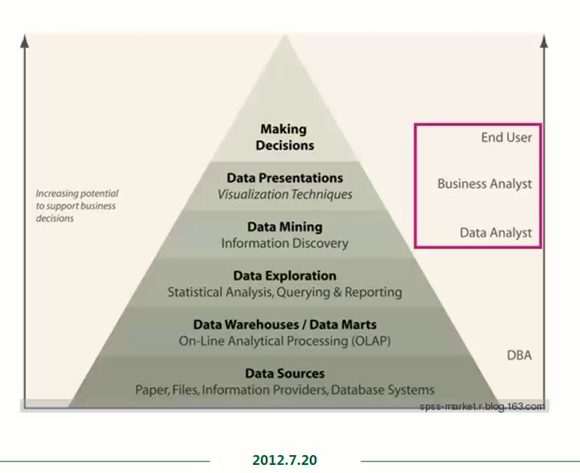
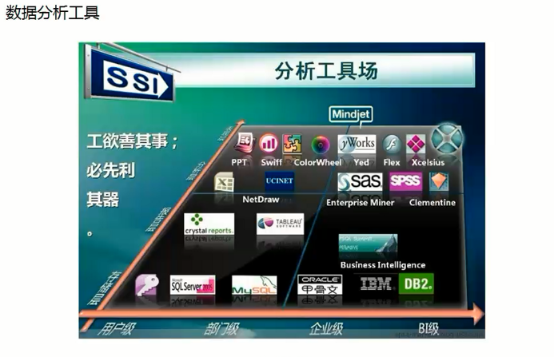
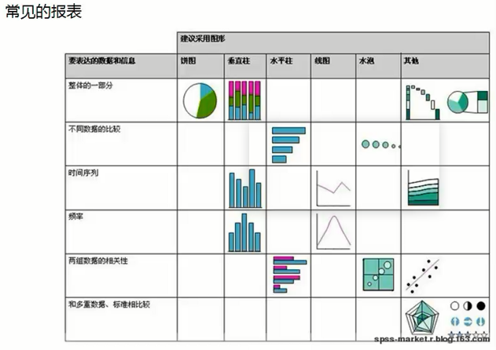
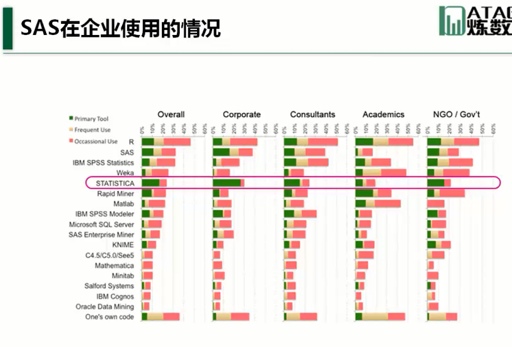

- 数据分析
- 数据挖掘   （菜谱-目的能看到可以做什么）
- 数据仓库  （冰箱-目的能看到菜）
  - etl
  - 对某些规格进行处理。
  - 进一些粗加工

## 数据分析金字塔

数据分析的六层模型：

1.  data sources数据源
    1.  DBA。 oltp 联机数据处理
2.  data warehouses数据仓库，data marts数据集（数据中心）-就是给一个部门来使用
    1.  On-LIne Analytical processing（OLAP）联机分析处理
    2.  生产线的源数据进行抽取，进入初加工
3.  data exploration （统计分析/数据分析）数据探索
    1.  统计分析
    2.  查询
    3.  reporting 报告
4.  DAta mining 数据挖掘
    1.  数据挖掘技术（即指从资料中发掘资讯或知识）
5.  data presentations展现层  （数据显示)
    1.  visualization techniques  可视化技术
6.  making  decisions （做决定--老板）

## 数据分析

- 使用统计方法。有目的地对收集到的数据进行分析处理

统计指标：

- 集中趋势的指标
  - 均值mean：即平均数，mean = 1/n*sum(x1:xn)；（缺点）对异常值（极小值、极大值）很敏感，影响的程度很大。
  - 中位数median ：排序后居于中间位置的数值。（优点）不受异常值的影响；
  - 众数mode：出现频率最高的地方；代表分布中的高峰；名义尺度（分组数据）常用。
- 变异性指标：
  - 极差（range范围）：最大值与最小值之差，range =max - min；直接受到异常值影响。
  - 方差（variance）：离均值（观测值与均值之间的差）平方的均值；var = 1/(n-1) *  sum((Xi - nean)^2); 数据分布越分散（原离均值），方差越大。
  - 标准差（standard deviation） ： 方差的平方根，stdev = SQRT（var）；与数据本身有相同的量纲，常用；
- 变异性指标
  - 偏度（skwness）
    - 刻画数据在均值两侧偏差趋势的差异性
    - 对称分布：skewness= 0 ,mean = median = mode;
    - 右偏分布：skewness> 0 ,mean > median > mode;
    - 左偏分布：skewness< 0 ,mean < median < mode;
  - 峰度（kurtosis）
    - 测试分布曲线相对平滑或突起程度
    - kurtosis = 3，正态分布（Norm distribution）
    - kurtosis > 3，分布曲线比正态分布突起
    - kurtosis <3, 分布曲线比正态分布平缓

## 分析工具厂

- 1.ppt swifff   colorwheel Yed Flew  xceisius
- 2.分析层： excel 、 UCINet 、NETdraw 、enterprice miner、sas 、spss、clementine、
- 3-报告层: crystal reports 、 tableAU  、business Intelligence、
- 4-存储层 ACCESS(用户级)、sql server（部门级） 、  my sql 、 ORACLE（企业级） IBM DB2（BI级别）

## 数据挖掘

数据挖掘思想来源：假设检验，模型识别，人工智能，机器学习

数据挖掘任务： 关联分析，聚类分析，孤点分析

例子：啤酒与尿布的故事

数据挖掘： 是以查找隐藏在数据中的信息为目标的技术，是应用算法从大型数据库中提取知识的过程，   这些算法确定信息项之间的隐藏关联，并且向用户显示这些关联。

展现层： 报表与图形；

- 老土的报表： 一堆数字

## 建议采用的图形

||饼图|垂直柱|水平柱|线图|水泡|其他|仪表盘|区域动态，在地图中画图|
|-|-|-|-|-|-|-|-|-|
|整体的一部分|一个大饼分割|n条线，每条线表示整体的指标|||||描述的数据整体||
|不同数据的比较|||不同的数据水平放置||||||
|时间序列||垂直柱||折线图|||||
|频数||垂直柱||折线图|||||
|两图数据的相关性|||两条水平柱||||||
|和多重数据、标准相比较||||||雷达图|||

微博的图： R语言可以画，微博的扩散路径；sas太昂贵，你去画微博，就很房费

热力图：用户的目光关注度，网页上有那几块，是被关注的。左上角   右侧 。

## BI在数据分析行业里面

BI = BUsiness intelligence 商业智能；包括：

- 数据仓库（存储层）
- 数据分析和数据挖掘（分析层）
- 报表（展现层）

sas在企业界最著名的软件

## sas参考书

- 《sas统计分析应用》 董大军钧
-  朱世武《sas编程技术教程》 清华大学出版社 （蓝色的书籍）