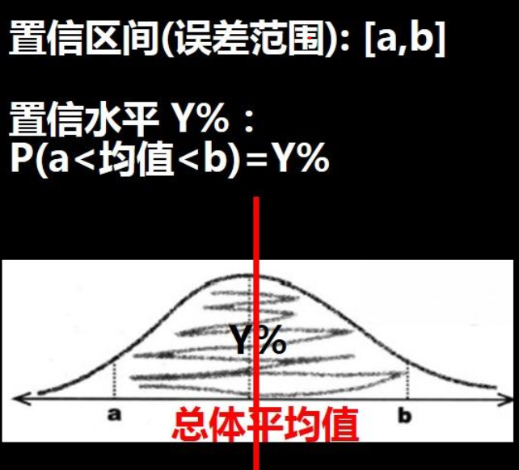
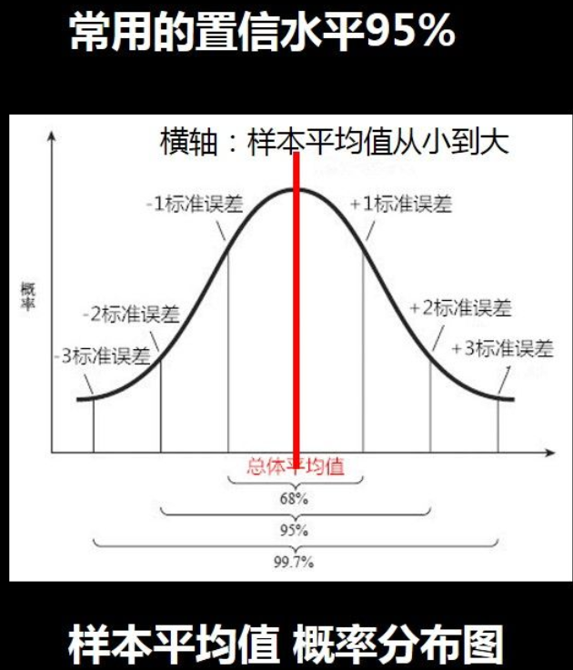
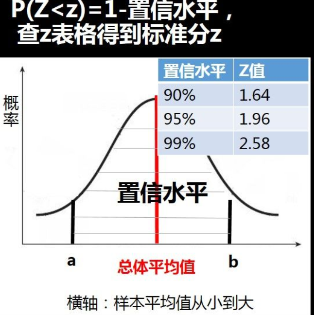
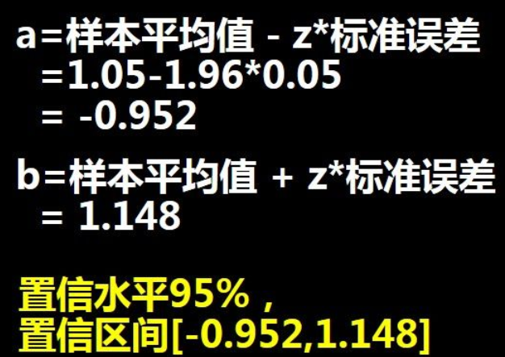
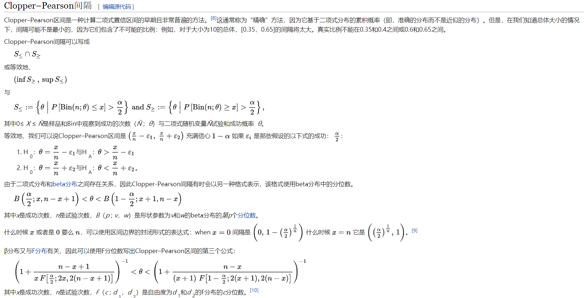
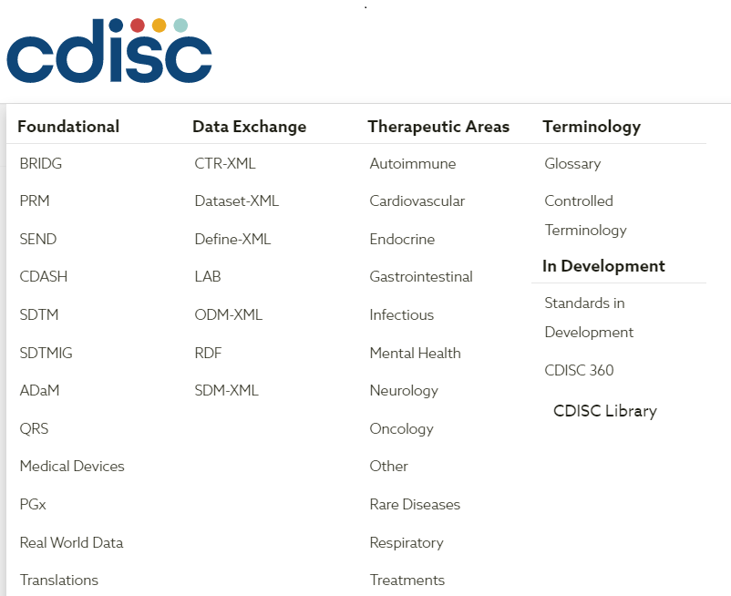

## 目录

```
氟唑帕利联合醋酸阿比特龙在转移性去势抵抗性前列腺癌患者中的药代动力学和安全性的 I 期样表目录
方案编号：SHR3162-ABI-I-101

```

```
对照抄录表
```


```
2.2.2	受试者分布
将对筛选受试者例数、接受研究和完成研究的受试者例数、接受研究治疗和完成研究治疗的受试者例数以及试验药物（氟唑帕利、醋酸阿比特龙、泼尼松）各类研究治疗终止的原因、各类研究终止原因进行描述性总结。
list
对未入选的受试者、研究治疗终止的受试者和研究终止的受试者进行数据列表。
```


```
2.2.3	方案违背情况
如适用，将对受试者方案违背情况进行分类总结。
list
将对受试者方案违背情况进行数据列表。

```


```
2.3.1	人口学和基线特征
将对人口学资料和基线特征等进行描述性总结及数据列表。


list
对烟酒史、
过敏史、
前列腺癌病史、
既往肿瘤治疗史包括既往ADT治疗史、既往抗肿瘤内分泌治疗（除ADT外）、原发病灶手术史、化疗史、放疗史、其他抗肿瘤治疗。
基线ECOG评分、
既往病史、
既往用药史等进行数据列表。


2.1.1	人口学和基线特征
人口学和基线特征包括人口学资料（性别、民族、年龄[岁]、身高[cm]、体重[kg]、体重指数[BMI，kg/m2]）、
烟酒史、过敏史、前列腺癌病史、既往肿瘤治疗史、基线ECOG评分、既往病史、既往用药史等。
其中既往肿瘤治疗史包括既往ADT治疗史、既往抗肿瘤内分泌治疗（除ADT外）、原发病灶手术史、化疗史、放疗史、其他抗肿瘤治疗。
```


```
2.3.3	安全性数据的分析
本研究的安全性数据分析以描述性统计分析为主。


```

```sas
2.1.4	疗效变量
本研究疗效指标包括前列腺特异抗原应答率、至PSA进展时间、客观缓解率、无影像学疾病进展生存期、疗效持续时间和骨影像学评估结果。
前列腺特异抗原（PSA）应答率
指连续治疗第12周末（C4D1）血清PSA水平较基线降低≥50%的受试者比例。

至PSA进展时间
指从随机到PSA首次进展的时间；PSA进展判定依据PCWG3标准，治疗前12周内（即C4D1之前）的PSA水平变化不纳入该评价，其他如下：
1)	若试验第12周末PSA低于基线水平，PSA进展定义为较最低水平（第12周末及之后PSA中的最低值）升高≥25%（升高幅度绝对值≥2ng/mL）；
2)	若试验第12周末PSA不低于基线水平，PSA进展定义为较基线水平升高≥25%（升高幅度绝对值≥2ng/mL）；
3)	首次评价为PSA进展者需在≥3周后进行确认。

基于RECIST v1.1标准的客观缓解率（ORR）
指最佳总体疗效为CR或PR的受试者人数占可评价受试者的比例。采用实体瘤缓解评估标准（RECIST v1.1标准）来评定肿瘤客观缓解。首次被评估为CR、PR的受试者需在4周（±5天）后进行疗效确认。
0	无症状，完全主动活动，及能够进行无限制的活动。
1	有症状，完全能行走，但重体力活动受限，能从事轻的或以坐为主的工作，如轻微家务、办公室工作。
2	有症状，能行走，生活可自理，但不能进行任何的体力活动，约有50%以上的时间清醒（白天卧床时间<50%）。
3	有症状，有限的生活自理能力，清醒时间卧床或坐椅>50%，但尚未卧床不起。
4	完全失去功能，生活完全不能自理，卧床不起。
5	死亡。

```

## HR-FZPL

```
表14.2.1.1  受试者至截止日期的研究者评价
			无进展生存期 情况（FAS）-0-基于RECIST v1.1标准的客观缓解率
表14.2.2.1 受试者至截止日期的研究者评价
缓解持续时间情况（FAS）
表14.2.3.1 受试者至截止日期的
总生存时间情况（FAS）
表14.2.4.1 研究者评价的
肿瘤客观缓解率及疾病控制率情况总结（基于RECIST v1.1标准，FAS）

表14.2.9.1 所有
免疫原性指标总结（免疫原性分析集）

图：
图14.2.5.1 受试者至截止日期的研究者评价
无进展生存期Kaplan-Meier曲线（FAS）

图14.2.8.1 研究者评价所有
靶病灶肿瘤负荷自基线变化百分比瀑布图（RECIST v1.1，FAS）

图14.2.9.2 个体免疫原性-名义采样
时间点曲线图（免疫原性分析集）

图14.2.9.3 不同剂量组
平均免疫原性-采样时间曲线图（免疫原性分析集）
```


备注：

PK外数据统计描述时，连续型变量将提供例数、均数、标准差、中位数、最小值和最大值等。

分类变量将提供例数和百分比。

规则，最小值和最大值与收集原始结果保持相同的小数位，均数、几何均数和中位数小数位增多1位，适用时标准差、几何标准差和95%可信区间增多2位，变异系数和几何变异系数小数位保留两位。

## 分析人群

```
1全分析集（FAS）、2可评估分析集、3安全性分析集（SS）、4 DLT分析集、 5PK浓度分析集、6 PK参数分析集
另外：
符合方案集（PPS）、
（PKS）= 药代动力学分析集
列表16.2.4.2 人口学特征和基线特征(（全部受试者）)


备注：FAS，全分析集。


用法：
人口学和基线特征分析将采用FAS；
ORR将采用可评估分析集，其他疗效变量分析将采用全分析集（FAS）；
用药暴露程度和依从性以及治疗期安全性变量分析将采用SS；
DLT将采用DLT分析集；
血药浓度变量分析将采用 PK浓度分析集；PKS
药代动力学参数将采用	 PK 参数分析集。 
PKS，药代动力学分析集
```


```
客观缓解率（ORR）、1.前列腺特异抗体（PSA）应答率、无影像学疾病进展生存期（rPPS）、
总生存期（OS）、无进展生存期（PFS）、疗效持续时间（DOR）、

实体瘤反应评价标准
RECIST是简称，是每个单词的首字母，１.１是版本号，我们一般称其为RECIST 1.1
```


## 药代动力学参数

```
药代动力学参数有哪些，各代表什么含义

药代力参数:
1. 药峰浓度(Cmax)　　给药现血药浓度高值该参数反映药物体内吸收速率吸收程度重要指标
2. 达峰间(Tmax)　　给药达药峰浓度所需间该参数反映药物进入体内速度吸收速度快则达峰间短
3. 末端消除速率(Ke)　　末端相血药浓度消除速率数血药浓度取数间作线性归所斜率值负数末端消除速率
4. 末端消除半衰期(T1/2)　　末端相血药浓度降半所需间该参数直观反映药物体内消除速度末端消除半衰期数值与末端消除速率互倒数即: 末端消除半衰期=0.693/末端消除速率
5. 药曲线面积(AUC)　　血药浓度曲线间轴所包围面积该参数评价药物吸收程度重要指标反映药物体内暴露特性由于药研究血药浓度能观察至某间点tAUC两种表示式: AUC(0-t)AUC(0-∞)前者根据梯形面积者计算式: AUC(0-∞) = AUC(0-t) + 末端点浓度/末端消除速率
6. 清除率(CL)　　单位间内体内清除药物表观布容积数单位般L/h该参数反映机体药物处置特性重要参数与理素密切关系清除率根据剂量与AUC(0-∞)比值
7. 表观布容积(Vd)　　药物体内达态平衡体内药量与血药浓度比例数单位般L该参数反映药物体内布广窄程度数值越高表示布越广表观布容积数值由清除率与末端消除速率比值
8. 平均驻留间(MRT)　　药物体内停留间平均值表示体内消除63.2%药物所需要间药程具线性特征才能计算该参数其数值通AUMC(药物与间乘积间t积)与AUC(0-∞)比值
9. 物利用度(F)　　药物吸收进入血液循环速度程度种量度评价药物吸收程度重要指标物利用度绝物利用度相物利用度前者用于比较两种给药途径吸收差异计算公式: F = (AUC_ext*Dose_iv)/(AUC_iv*Dose_ext)*100%其ext表示血管外给药iv表示静注给药Dose剂量者用于评价两种制剂吸收差异计算公式: F = (AUC_T*Dose_R)/(AUC_R*Dose_T)*100%其TR别受试制剂参比制剂
```

```
药代动力学参数
一、吸收 溶出度：药物分子在消化道中溶解的程度 
		生物利用度：药物吸收的程度 绝对生物利用度 最大血药浓度(Cmax) 达峰时间(Tmax)
二、分布 由于体内环境的非均一性（血液、组织），导致药物浓度变化的速度不同。


```


　　药重要参数及意义：
　　1、消除半衰期：血药浓度降半所需间决定给药间隔间重要参数
　　2、物利用度：药物吸收速度与程度种量度药曲线面积AUC计算F=口服AUC/注射AUC
　　3、表观布容积Vd ：指血药浓度与体内药物量间比值Vd=A/C=体内药量/血药浓度反映药物布广泛程度或药物与组织结合程度
　　4、药-曲线面积AUC 代表用药吸收总量反映药物吸收程度


Brookmeyer-Crowley

- 布鲁克梅耶·克劳利


## 参考文献

## 分类标准

先做两个表： 

- 150氟
- 100mg氟
- 总计

PK的时候：

- 150mg氟 
- 100mg氟 单药
- 醋酸


## 图、表、列表

列表

- 数据列表


总结：

- 表格


## 变量

连续性变量：(PK外)

```
例数
低于BLQ例数
均数（算术标准差）
中位数
最小值，最大值
```


PK参数：

```
例数
低于BLQ例数
均数（算术标准差）（1，2）
中位数  （1）
最小值，最大值 （0）
变异系数 （直接是2位）
几何均数(几何标准差) （1，2）
几何变异系数。（直接是2位）
```


```
例数
百分比

连续性实验室指标

```

最严重临床意义判断的优先次序

```\
“异常，有临床意义”
“异常，无临床意义”
“正常”
“未查”
```


## word显示兼容模式

```
高版本的一些新功能在低版本中没有，如果用高版本打开低版本的文件，为了适应低版本，就会使用“兼容模式”。

介绍低版本升级成高版本的方法，具体步骤如下：
1、当前电脑上安装的最高版本的Word。
2、点击“打开其他文档”菜单项。
3、就可以看到在上面的状态栏显示出“兼容模式”的字样
4、点击左上角的“文件”菜单
5、左侧边栏的“信息”菜单项，然后点击右侧的“兼容模式”图标。
6、点击“确定”即可。
7、文档已不再是兼容模式了，而是自动升级到最新版本了。
```

目前的工作好像dba  做样子；


## word格式 要求

格式

- 宋体
- Times now roman

字体

- 正文是小四
- 备注5号字体
- 参照图14          都是小四，和最小的标题一样
- 参照表14
- 
- 目录字体11号（自动生成的 ）
- 标题三号 + 加粗
- 小标题 4号
- 然后就是标题小4
- 


## SAS统计分析应用（第二版）

> 作者：董大钧

董大钧sas统计分析应用教程，帮助sas初学者快速掌握sas基本


## 缩写

- 日常生活活动（Activities of DailyLiving，ADL）

```
缩略语	全称	中文全称
AE	Adverseevent	不良事件
ADT	Androgen deprivation therapy	雄激素去除治疗（去势治疗）
psa 前列腺特异性抗原

ALB	Albumin	白蛋白
ALP	Alkaline phosphatase	碱性磷酸酶
ALT	Alanine aminotransferase	谷氨酸丙氨酸氨基转移酶
AST	Aspartate aminotransferase	谷氨酸天门冬氨酸氨基转移酶
BID	Bis in die	一天两次
BLQ	Below limit of quantitation	低于定量下限
BMI	Body mass index	体重指数
BUN	Blood urea nitrogen	尿素氮
Ca2+	Calcium	钙
Cl-	Chlorine	氯
Cmin.ss	Cmin at steady state	稳态谷浓度
Cr	Creatinine	肌酐
CR	Complete Response	完全缓解
CRF	Case report form	病例报告表
D	Day	天
DLT	Dose-limiting toxicity	剂量限制毒性
DoR	Duration of response	缓解持续时间
GLU	Blood glucose	血糖
Hb	Hemoglobin	血红蛋白

mCRPC	
Metastatic castration-resistantprostate cancer	
转移性去势抵抗性前列腺癌


K+	Serumpotassium	血钾
LDH	Lactate dehydrogenase	乳酸脱氢酶
Na+	Plasma sodium	血钠
PLT	Blood platelet	血小板
PRO	Protein inurine	尿蛋白
PSA	Prostate specific antigen	前列腺特异性抗原
PR	PartialResponse	部分缓解
QD	Quaque die	每天一次
RBC	Red blood cellcount	红细胞计数
SAE	Serious adverseevent	严重不良事件
SAP	Statisticalanalysis plan	统计分析计划
SIE 	Adverse events of special interest	特别关注不良事件
TBIL	Total bilirubin	总胆红素
TC	Totalcholesterol	总胆固醇
TEAE	Treatment emergent adverse event	治疗期间不良事件

PD-1是一种细胞表面受体蛋白
CI，可信区间；
FAS，全分析集；
PD，疾病进展；
```

auc 

- Area Under Curve 曲线下面积，在y=x的shang'fang,取值为[0.5,1) 。等于0.5无价值，接近1，检验方法真实性高。

roc

- **接受者操作特性曲线**是指在特定刺激条件下，以被试在不同判断标准下所得的虚报概率P（y/N）为横坐标，以击中概率P（y/SN）为纵坐标，画得的各点的连线。

## stata

- 斯塔塔


面板数据

- “被解释变量和解释变量可以潜在地随时间和个体的变化而变化。
- 给定个体 在时间上的差异被称为**组内差异**；
- 在不同个体之间的差异被称为**组间差异**。”
  ————《用stata学微观计量经济学》，P198


## 置信区间


Confidence interval 是针对频率学派的固定的待估计总体参数，计算出的上下限随机变动的区间。在这里，区间是变动的，参数是固定的。那么我们绝对不能说固定的参数落在一个随机区间的概率是多少。概率用来描述随机变量，固定变量是不能用概率描述的。在这里，概率是描述随机区间这一构建方法理论上重复抽样包含固定参数的频率，一旦计算出来了区间，那么要么包括要么不包括。所以，我们只能说，如果我们用这个方法计算置信区间，那么100次中有95个置信区间会把参数包括进去。当我们抽样一次后，计算出来的置信区间，此时，置信区间已经不是变量，而是固定的上下限的结果了，那么它要么包括估计参数，要么不包括，概率就只有0或者1这两个选项了。当然，我们事先会有个假设，假设两样本均值没有差异。那么理论上来说，95%的置信区间（100个里有95个，5个不包括0）应该包括0，那么假如计算出来置信区间结果不包括0，那理论上5/100的这种概率，非常小，小概率事件，所以拒绝原假设，这本质上跟P值小于0.05是一个道理。  


```
在统计数据中，置信区间（CI）是一种区间估计值，是根据观测数据的统计信息计算得出的，可能包含未知总体参数的真实值。该间隔具有关联的置信度级别或覆盖范围，从广义上讲，该覆盖范围量化了确定性参数被该间隔捕获的置信度级别。更严格地说，置信度代表包含未知总体参数真实值的可能置信区间的频率（即比例）。换句话说，如果使用无限数量的独立样本统计数据使用给定的置信度构建置信区间，则包含参数真实值的那些区间的比例将等于置信度。
```

*confidence interval* 

[统计] 置信区间，可靠区间；

教科书《医学统计学—颜虹版本》是正确的介绍，虽然很绕口。还有一本，是赵耐青主编的这本《医学统计学》

```
赵耐青版本是怎么正确的介绍置信区间的: "在可信区间中，总体参数虽未知，但却是固定的值，而不是随机变量值，其大小与抽样无关。


因此，95%可信区间不能理解为：总体参数有95%的可能落在该区间内，因为相应的总体参数只有一个。


所谓95%的可信度指的是可信区间的构建方法，理论上用该方法建立的95%可信区间能包含总体参数的概率为95%“。Perfect, 这个解释和描述绝对正确。
```

  CI到底是什么？我们应该怎样理解CI? 想弄明白Confidence interval, 那我们不得不提起贝叶斯统计里的Credible interval.


## 可信区间

```
在贝叶斯统计中，可信间隔是指未观察到的参数值以特定概率落入的间隔。它是后验概率分布或预测分布范围内的间隔。[1]多元问题的概括是可信的区域。可信区间是类似于置信区间在频率统计，[2]尽管它们哲学基础上不同：[3]贝叶斯区间将其边界视为固定值，并将估计参数视为随机变量，而频繁度置信区间将其边界视为随机变量，而参数则视为固定值。同样，贝叶斯可信区间使用（并且确实需要）特定于情况的先验分布知识，而常识者的可信区间则不需要。

                  
```


Credible interval 是针对贝叶斯学派的随机的待估计总体参数，计算出来的上下限是固定的区间。在这里，区间是固定的，参数是变动的。那么我们可以说随机的总体参数落在这个固定的区间的概率是多少多少（其实，这里的理解和解释跟参考值范围很像，身高或体重的参考值范围就是针对不同人的身高参考值范围而定，不同人的身高当然是随机变异的，所以道理一样）。贝叶斯学派，虽然在参数先验分布选择饱受主观影响的抨击，以及在计算基于不同参数得到数据概率加和积分采取蒙特卡洛模拟逼近时因用模拟方法而受频率学派抨击不客观不靠谱，但是频率学派的那套东西放到贝叶斯里来，立马变的通俗易懂，比如说 CI, 我们普通人甚至统计学教授对置信区间的误解，一拿到贝叶斯里来，一切都是小菜一碟，错的也变成对的了。

**a=总体平均值-1.96\*标准误差**

**b=总体平均值+1.96\*标准误差**


```
A 95% confidence interval [a,b] means: (let's assume the true value p)
There is a probability of 95% that this estimate, a<p<b, will 100% succeed.
There is a probability of 5% that this estimate, a<p<b, will 100% fail.
Remember that it does not mean the true value p will 95% likely locate within your estimation [a,b]. P is a constant, while confidence interval changes w.r.t each sampling test.
```


95％的置信区间[a，b]表示：

（假设真实值p）此估计a <p <b的概率为95％，将100％成功。

概率为5％的概率为 此估计a <p <b将100％失败。请记住，这并不意味着p的真实值将有95％位于估计[a，b]中。 P是一个常数，而置信区间随每次采样测试而变化。











## Clopper-Pearson

- 二项式比例置信区间

```
克洛珀·皮尔森
在统计中，二项式比例置信区间是根据一系列成功-失败实验的结果（伯努利试验）计算出的成功概率的置信区间。换句话说，二项式比例置信区间是仅知道实验次数n和成功次数n S时成功概率p的区间估计。

对于二项式置信区间，有几种公式，但是它们都依赖于二项式分布的假设。通常，当实验重复固定次数时，将应用二项式分布，该实验的每个试验都有两个可能的结果（成功和失败），每个试验的成功概率相同，并且这些试验在统计上是独立的。由于二项式分布是离散的概率分布（即不连续），并且对于大量试验而言难以计算，因此使用各种近似值来计算此置信区间，所有这些都需要在准确性和计算强度上进行权衡。

一个二项式分布的简单示例是一组可能的结果集及其概率（对于将硬币翻转十次时所观察到的正面数）。观察到的二项式比例是翻转后变成正面的部分。给定这个观察到的比例，硬币落在头上的真实概率的置信区间是可能比例的范围，该比例可能包含也可能不包含真实比例。例如，该比例的95％置信区间将包含95％的真实比例，而该比例是采用构建置信区间的过程的95％。
```




Clopper–Pearson间隔是一个精确的间隔，因为它直接基于二项式分布而不是任何近似的二项式分布。对于任何人口比例，此间隔都不会小于名义覆盖范围，但这意味着它通常是保守的。例如，取决于n和  θ，95％Clopper–Pearson区间的真实覆盖率可能远高于95％。[ 引证需要 ] 因此比它需要的是实现95％的置信区间可以更宽。相比之下，值得注意的是，其他置信区间可能比其标称置信宽度窄，即法向近似（或“标准”）区间，威尔逊区间[5]标称覆盖率是95％的Agresti-Coull区间[10]等实际上可能覆盖率不到95％。[3]

还可以修改Clopper–Pearson区间的定义，以获得不同分布的精确置信区间。例如，它也可以应用于从已知大小的种群中抽取样本而不进行替换的情况，而不是重复抽取二项式分布。在这种情况下，基础分布将是超几何分布。


## Kaplan-Meier

- 卡普兰·迈耶

```
Kaplan-Meier估计器，也被称为产品限估计，是一种非参数 统计量用来估计存活函数从寿命数据。在医学研究中，它通常用于测量治疗后一定时间内存活的患者比例。在其他领域，Kaplan–Meier估计器可用于测量人们失业后的失业时间长短，机械零件的失效时间，或植物上的多肉水果在去除前要保留多长时间。靠节俭。该估计以后被命名爱德华·L.卡普兰和保罗•迈耶（Paul Meier），他们都向“美国统计协会杂志”提交了类似的手稿。
期刊编辑约翰·图基（John Tukey）说服他们将他们的工作整合为一篇论文，该论文自发表以来已被引用约55,000次。
```


```
与 ti当至少一个事件发生时，ð i的事件的数目的是发生在时间（例如，死亡）ti 和ni在知名的人，活了下来（但尚未有一个事件或者被删）到时间 ti。

Kaplan–Meier估计器的图是一系列递减的水平步长，这些步长具有足够大的样本量，接近该人群的真实生存函数。连续的不同采样观测值（“喀哒声”）之间的生存函数值假定为恒定。

Kaplan-Meier曲线的一个重要优点是，该方法可以考虑某些类型的检查数据，尤其是右检查，如果患者退出研究，失去随访或活着而没有事件，则会发生这种检查在最后一次随访中发生。在该图上，小的垂直刻度线表示个别患者的生存时间已被正确删减。当没有截断或删减时，Kaplan–Meier曲线是经验分布函数的补充。

在医学统计学中，典型的应用可能涉及将患者分组，例如，具有基因A谱的患者和具有基因B谱的患者。在图中，基因B的患者比基因A的患者死亡快得多。两年后，大约80％的基因A的患者存活下来，但不到基因B的患者的一半。

为了生成Kaplan-Meier估计器，每个患者（或每个受试者）至少需要两块数据：上次观察的状态（事件发生或右删失）和事件发生时间（或检查时间） ）。如果要比较两个或多个组之间的生存功能，则需要第三条数据：每个受试者的组分配.
```


## 去势治疗

psa 

- Prostate specific antigen
- 前列腺特异性抗原


Adt

- Androgen deprivation therapy	雄激素去除治疗（去势治疗）

```
ADT与这些疗法联为转移性前列腺癌的初始治疗：

●阿比特龙/泼尼松联合ADT–阿比特龙的作用机制是插入胰岛素，肾上腺和前列腺肿瘤组织中雄激素前体的细胞内转化。最初有研究显示其能延长去势抵抗性前列腺癌（近期的随机试验表明，与单用ADT分类，ADT联合阿比特龙加泼尼松可延长极高危局限性或转移性去势敏感性前列腺癌患者的总生存期。）。参见“结合化疗或雄激素受体替代治疗与雄激素剥夺治疗的联合疗法”）

●多西他赛联合ADT–多西他赛可延长去势抵抗性前列腺癌男性的生存期。随后有随机试验证明，对于新出现的高转移负荷去势敏感转移性植入的患者，多西他赛联合ADT的化学激素治疗带来的生存优势具有临床意义。（参见下文'雄激素剥夺治疗+多西他赛'）
```


**PK / PD建模**（**药代动力学/药效学）建模**

```
PK / PD建模（药代动力学/药效学建模）（或简称为PKPD 或PK-PD 建模）是一种结合了药代动力学和药效学这两个经典药理学科的技术。[3]它集成了药代动力学和药效学模型组件为一组的数学表达式，其允许效应强度的时间过程的描述响应于施用药物剂量。PK / PD建模与药理学领域有关。

有多种PK / PD建模方法来描述暴露-反应关系。PK / PD关系可以通过简单的方程式来描述，例如线性模型，Emax模型 或S形Emax模型。但是，如果观察到药物给药和药物作用之间存在延迟，则需要考虑时间分离，并且存在更复杂的模型：

直接与间接链接PK / PD模型
直接与间接响应PK / PD模型
时变与时不变
电池寿命模型
复杂的响应模型
```


## SMQ

- 标准化MedDRA查询（SMQ）

是开发用来促进MedDRA编码数据检索的工具，这是调查药物警戒性和临床开发中药物安全性问题的第一步。在广泛审查，测试，分析和专家讨论之后，SMQ是经过验证的MedDRA术语的预定集合，这些集合在一起。SMQ是MedDRA的独特功能，并且是支持安全分析和报告的强大工具。SMQ主题旨在解决法规和行业用户所需的重要药物警戒性主题。SMQ是与CIOMS标准化MedDRA查询工作组一起开发的，该工作组提供药物警戒性专业知识和SMQ验证。MSSO每次发布MedDRA时都会维护SMQ。

目前，已经创建了100多个SMQ。根据需要创建其他SMQ。以下是今天可供用户使用的一小部分SMQ：

- 过敏反应
- 中枢神经系统血管疾病
- 抽搐
- 抑郁和自杀/自残
- 药物滥用，依赖性和戒断
- 高血糖/新发糖尿病
- 过敏症
- 缺血性心脏疾病
- 缺乏功效/效果
- 用药错误
- 严重的皮肤不良反应

 

## CDASH 域 数据集名称

- AE等 都是 标准域名

AE 不良事件 Adverse events
CO **评注** Comments
CM 过去和同期服用药物 Prior and concomitant medications
DM **人口学统计资料** Demographics
DS **处理** Disposition
DA 药物清点 Drug accountability
EG **心电图测试结果** ECG test results
EX 接触 Exposure
IE 入组和排除标准 Inclusion and exclusion criteria
LB 化验检测结果 Laboratory test results
MH 病史 Medical history
PE 体检 Physical examination
DV 方案偏离 Protocol deviation
SC 受试者属性 Subject characteristics
SU 药物滥用 Substance use
VS 生命体征检查 Vital signs

## 病例报告表注释

 (CRF annotation, aCRF) 是在空白的CRF 中, 在记录数据的位置上, 对递交的数据集以及数据集中变量相应的名字进行标注的过程 , 它用文件记录来说明临床试验病例报告表的表格、变量条目名称、列表、访视及其他任何数据记录, 也包括数据变量代码列表。它是规范临床试验数据库和每个数据集信息采集的重要工具之一。


## rtf

```
RTF格式是许多软件都能够识别的文件格式。 比如Word、WPS Office、Excel等都可以打开RTF格式的文件，这说明这种格式是较为通用的。 
RTF是Rich Text Format的缩写，意即多文本格式。富文本格式
```

## cdisc 

send

- 非临床数据（SEND）


《医疗器械研究数据制表模型实施指南》（SDTMIG-MD v1.1）

- Table of Contents 目录

stdm

- 研究 数据 列表 模型

- Study Data Tabulation Model (SDTM)
- 研究数据列表模型

std

- Standards
- 标准（n）

ADaM

- 分析 数据 模型

- 分析数据模型实现指南版本1.2(最终)

- Implementation guide for analyzing data models version 1.2(final)

- analysis data model   分析数据模型

- Implementation guide(入门、指南)  实现指南

  

```
Foundational
BRIDG
PRM
SEND
CDASH
SDTM
SDTMIG
ADaM
QRS
Medical Devices
PGx
Real World Data
Translations
Data Exchange
CTR-XML
Dataset-XML
Define-XML
LAB
ODM-XML
RDF
SDM-XML
Therapeutic Areas
Autoimmune
Cardiovascular
Endocrine
Gastrointestinal
Infectious
Mental Health
Neurology
Oncology
Other
Rare Diseases
Respiratory
Treatments
```

tte

- 事件时间（TTE）

ADam

- 是需要提交的标准。


ADaM定义了数据集和元数据标准，这些标准支持：

- 有效生成，复制和审查临床试验统计分析，以及
- 分析结果，分析数据和研究数据列表模型（SDTM）中表示的数据之间的可追溯性

ADaM是向FDA（美国）和PMDA（日本）提交数据的必需标准之一。

FDA要求的详细信息在  FDA的  NDA，ANDA和某些BLA提交的数据标准目录中进行了规定。有关更多信息，请访问  FDA标准化数据指南。   

有关PMDA要求的详细信息，可以在“带有电子数据促进组的高级审查”页面上找到。





## Alphabet

- p  s   t 


## References