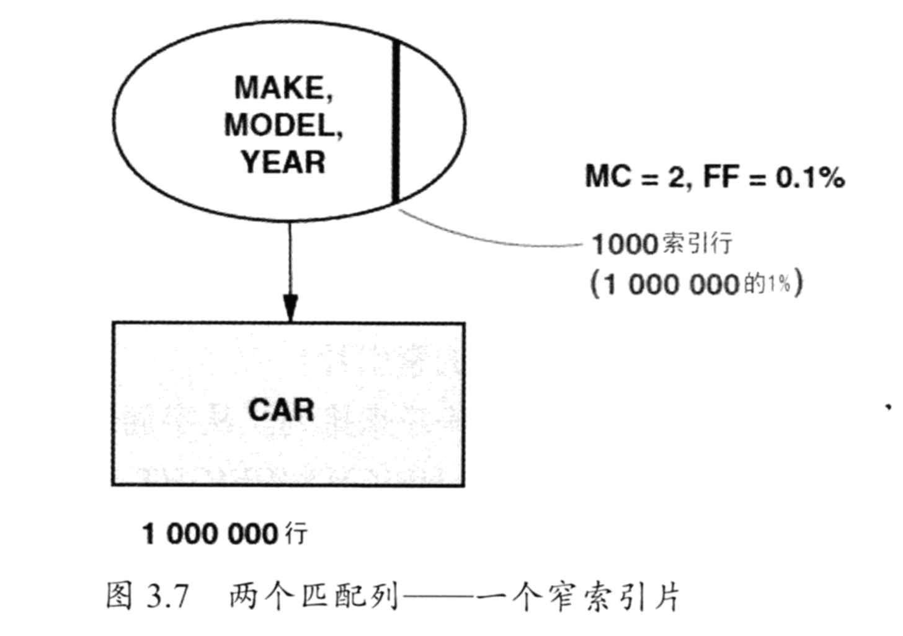
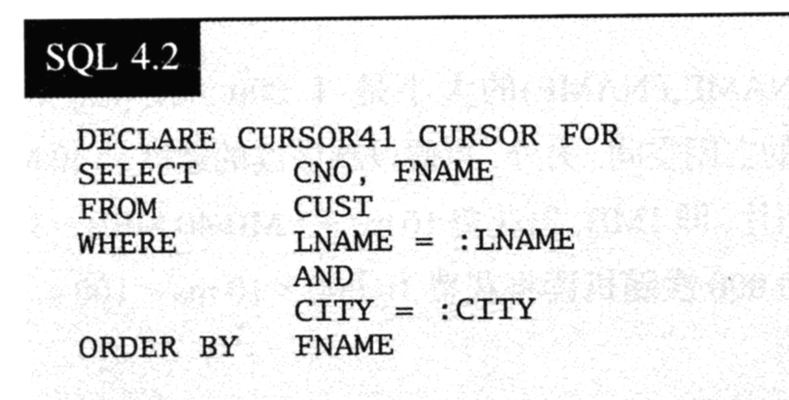
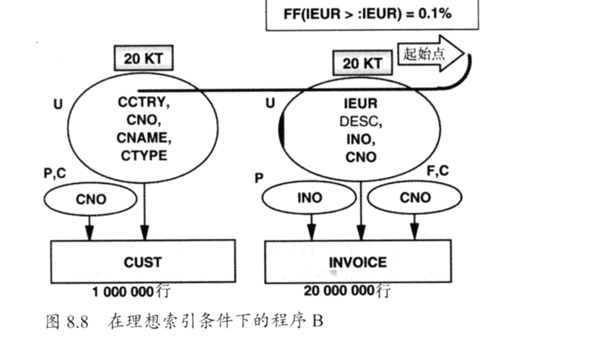

## 过滤因子

过滤因子描述了谓词(ON, 或者是 WHERE)的选择性，即表中表中满足谓词条件的记录行数所占的比例，它主要依赖于列值的分布情况。

例子：
当一名女会员加入到会员表中的时候，sex = ‘F’ 的过滤因子就会增大

.png)

.png)


### 无相关的过滤因子的结合


### 强相关的过滤因子的结合


### 过滤因子比较小的话，会是很好的索引



### 过滤因子比较大的话，会是很不好的索引


### 索引超厚情况


### 练习题


## 理想的索引


索引需要的时间是：
索引：10ms + 1M / 40M/s = 35ms<br>
表：10000 * 10ms = 100s

全表扫描需要的时间：
表：10ms + 600M / 40MB/s = 15s


### 三星索引




**什么是三星索引：**

1. 获取所有等值谓词的列（where col=），放置到索引的开头。顺序没有要求。
2. 将order by 的列加入到索引中。
3. 将剩余的所有的列加入到索引中。

上面的表的三星索引是？


### 三星索引不是那么容易的


如何让上面的内容成为三星索引？
先考虑第三星，在考虑第二星，最后考虑第一星


### 最佳索引

候选A：
1. 取出对于优化器来说，不过分复杂的等值谓词列。将这些列作为索引的前导列，任意顺序皆可。
2. 将选择性最好的范围谓词作为下一个列，如果存在的话。最好的选择性是指，对于最差的输入值，有最低的过滤因子。
3. 以正确的顺序添加order by列
4. 将剩余的select列添加进入索引中

候选B:
1. 取出对于优化器来说，不过分复杂的等值谓词列
2. 以正确的顺序添加order by 列，
3. 将剩余的列添加进索引中

**练习**：


```
A（1， 3星）
(C, F, B, A, E, D)
0.02 * 0.01 * 0.1 * 100000000 = 2000

B (2, 3 星)
（C, F, A, B, E, D）
0.02 * 0.01 * 100000000 = 20000

C, F, B
```


## 如何发现不合适的索引

### BQ

问：是否有一个已存在的或者计划中的索引，包含了WHERE子句所引用的所有列？

答 
1. 如果答案是否，首先应该将缺少的谓词添加到一个现有的索引上去。
2. 如果性能还是达不到标准，那么下一个选择就是将所有select中的列都加到索引上去。
3. 如果还是很慢，就需要最佳索引来实现。


```
1. 最好是在原有索引上进行添加
2. 主要是能够达到标准，而不是最好的
3. 实在不行了在进行添加索引
```


### QUBE（快速上限估算法）

QUBE的比较方程：

比较值：
LRT = TR * 10 ms + TS * 0.01ms

绝对值：
LRT = TR * 10 ms + TS * 0.01ms + F * 0.1ms

LRT 本地响应时间
TR  随机访问的数量
TS  顺序访问的数量
F   有效Fetch（获取）的数量

#### 主键索引


<br>
<br>
#### 聚簇索引


假设：区号位（zip）70301的地区内有1000位名为joneses的客户。那么这条语句以上述条件为基准的情况下，花费的时间是：


<br>
<br>
#### 非聚簇索引


因为是非聚簇索引，所以在非聚簇索引访问数据的过程中，会将查询变成了随机IO，所以会有如下的访问时间：

<br>
<br>
如何优化？

添加覆盖索引，加上第三个星


<br>
<br>
#### 举例子


<br>
<br>
在这个例子中的假设：
1. 表中有100万条数据
2. (LNAME, FNAME)是唯一合适的索引
3. 谓词LNAME的最大过滤因子是1%
4. 谓词CITY的最大过滤因子是10%
5. 结果集最多包含 1000 行记录
6. CNO是主键索引

#### 当前的索引时间


<br>
<br>
#### 最佳索引设计


<br>
<br>
#### 添加式的索引设计


<br>
<br>
#### 覆盖索引设计


<br>
<br>
#### 整体各个条件的比较


<br>
<br>
#### 举例子2


这里我们就需要假设： 
CITY 的过滤因子是10%
LNAME 的过滤因子是10%

<br>
<br>


####这两种情况的时间都是：

<br>
<br>
####最佳索引的情况是：

<br>
<br>
####（半宽索引）最大化索引过滤：

<br>
<br>
####（宽索引）不需要访问表的索引：


#### 整体各个条件的比较：
<br>
<br>


### 困难谓词
1. like表达式
2. bool 和 or
3. in表达式


## 连接的索引设计


<br>
<br>
现有索引的内容如下：

<br>
<br>
这之中的过滤因子

<br>
<br>
若是先获取cust，再获取invoice


<br>
<br>
若是先获取invoice再获取cust


<br>
<br>

### 添加理想索引
<br>
<br>
添加了理想的索引，我们从cust到invoice


<br>
<br>
添加了理想的索引，我们从cust到invoice



