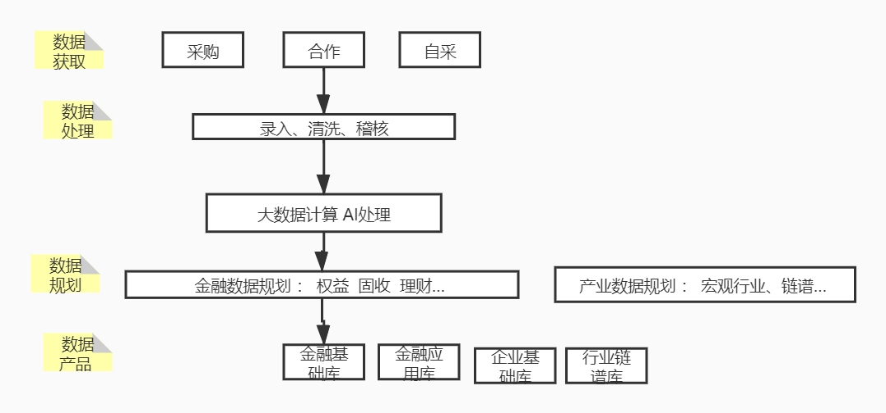

## V2

[聚源各类账号申请指南](http://confluence.gildata.com:8090/pages/viewpage.action?pageId=33784218)
[新员工培训考核 v2 扫码答题 --（地址）](https://www.wenjuan.top/s/7beYNbh/)




```

感谢您能抽出几分钟时间来参加本次答题，现在我们就马上开始吧！
1.部门* 数据一部
2.姓名*
3.工号*
4.岗位信息* 数据稽查部

单选题，3分/题
5.恒生聚源-恒生电子控股子公司，创始于（  ）成立，是中国金融信息服务领域重要的开拓者。*
A 1999年
B 2000年 √
C 2001年
D 2002年

1995年恒生电子成立，恒生电子股份有限公司； 2003 年在上海证券交易所主板上市（代码 600570），是中国领先的金融软件和网络服务供应商。
2000年上海聚源成立 ->>以金融基础数库业务为主
2009年底恒生电子收购 ->>应用数据业务快速发展
2016年蚂蚁金服入股员工期权计划启动，杭州聚源成立；->>销售收入快速增长，创新产品逐步推出。
2018年聚源董事会邀请蚂蚁派出总经理，新经济•深能力• 生态大协同，战略升级；->>业务突破
-----------------------------------
1995年恒生电子成立，金融软件和网络服务供应商
2000年上海聚源成立 ->>以金融基础数库业务为主
2009年底恒生电子被阿里爸爸收购 ->>应用数据业务快速发展
2016年杭州聚源成立，蚂蚁金服入股
2018年聚源，蚂蚁派出总经理

6.公司的午休时间是（  ）。*
A 11:30-12:30
B 11:30-13:00 √
C 12:00-13:00
D 12:00-13:30
7.上下班开始或结束（  ）小时内到/离岗 认定为迟到/早退。*
A 0.5h  
B 1h
C 2h √ 超出规定上班时间2小时内=迟到，不到规定下班时间2小时内=早退。 
D 3h

8.当月累计迟到/早退（  ）次按旷工一天处理，当月迟到/早退达（  ）次，将在公司范围内通报批评。*

A 3，4 
B 4，8
C 3，6
D 4，5  √
当月每四次按旷工一日计算，旷工一日；
迟到或早退一月累计达到5次，通报批评；
超过2小时且无任何请假记录计为旷工。

9.考勤异常免罚一个月有几次机会？*
1
2
3  √
4

10.绩效考核等级分布比例？*
A+&A;/B/C=2/7/1
A+&A;/B/C=4/5/1
A+&A;/B/C=1/6/3
A+&A;/B/C=3/6/1 √

11.正式员工离职，需提前（  ）天提出正式的离职申请？*
A 3 
B 10 
C 15
D 30 √
（试用期提前3天，正式员工提前30天）
提出离职，发送离职申请邮件：发送直接、片区领导， 抄送HR、各部门助理
（离职前30天）积极配合交接工作，完成交接任务，配合助理填写离职表单
（最后一天）退还门禁卡、电脑，当天16:30以后找领取离职证明/ 劳动手册
离职交接表单列表
1.	离职申请邮件（发送直接领导，抄送片区领导及HR）
2.	工作交接单（尽可能地详细描述自己工作的内容，如有技术文档都可以汇总出来）
3.	权限清理表（助理协助完成）
4.	离职面谈表（HR排期进行面谈，表格由HR填写）
5.	员工离职承诺书
6.	员工离职审批表
7.	员工离职手续表
8.	考勤数据（助理找前台核实）


12.员工工资将在每月（   ）号发放？*

A 5
B 10 √
C 15
D 20
终端产品
基础系列：提供不同标的、不同皮肤的基础资讯，协助券商高效迭代APP;
A股F10 、 港股F10 、新三板F10 、基 金 F10、全市场资讯 、科创板专题 、工具系列

工具系列：深度理解用户的理财助手
基金诊断、实时解盘、复盘
英 雄 帮 、重大合同、基金比较
基金排名、基金主题、财经日历、股权质押

智能系列：深入使用AI技术，致力于千人千面的资讯数据服务
 智能问答、基金问答、智能推荐、小梵智讯、热点概念
 热 点 话 题、 可视化年报、智能搜股 、智能诊股


13.绩效考核一年几次？*
1次
2次 √
3次
4次
14.填写报销单时，应包含（  ）、（ ），否则视为无效。*
A 报销人名称、工号
B 报销人部门、名称
C 报销人名称、报销流程编号 √
D 报销人名称、报销时间
多选题，5分/题
15.恒生核心价值观包括以下哪几项？*
A 客户第一 √
B 正直诚信 √
C 专业敬业 √
D 开放合作 √
E 持续成长 √

16.价值观积分的应用场景有哪些？*

A 选拔任用 √
B 转正 √
C 盘点 √
D 晋级 √
E 汰换 √
考核激励 √
17.一基两景指的是什么？*
A 数据基石  基石
B 金融场景  景 金融场景端
C 行业场景
D 产业场景  景 	产业场景端

个人投资者：聚源小梵 2B4C
金融工作者：聚源终端 2B、聚源金探2B2C

Jira  聚源流程工具
Confluence  聚集，合并

恒生协同系、钉钉、聚源流程工具JIRA、聚源知识库
Confluence、文档和源码管理工具SVN等等。申请方式、审批人及对应流程，

公司周年庆活动，针对哪些员工:司龄满5年 √ 司龄满10年 √ 司龄满15年 √

管理序列带人，强调定战略、带队伍、出结果；
专业序列也可以带人，强调更多的以专业带人，能“建标准、建模型、提方案”。

1.“客户第一”价值观得分	
创造用户价值，帮助客户提升整体业务价值，超越客户期望，实现客户和公司共赢。（5分）
站在客户的立场思考问题，主动分析客户整体需求，并持续升级、创新产品与服务。（4分）

2.“正直诚信”价值观得分	
在巨大阻力和压力面前坚持说真话并提出建设性的意见，引导和影响其他人坚持，正确的价值导向。（5）
不回避问题，坦荡诚恳，提出真实的思路和意见。（4分）

3.“专业敬业”价值观得分	
在专业领域成为带头人，有奉献精神，正面影响周围的人和团队（5分）
勤勉努力，充满激情，持续改进优化并提升工作绩效。（4）

4.“开放合作”价值观得分	

5.“持续成长”价值观得分	

1 逐层判断，评价“一贯如此”方可得分， 取高分，如“开放合作”得3分；
2 前一层级得分后，进入下一层级判断；
如果有得分，刷新上一层级分数；如果没有 得分，则取上一层级得分，如2分都未做到“一贯如此”，则得0分；
4 最终价值观得分取5条价值观平均分。

最终价值观得分（平均分）	提交 
问卷网提供技术支持 举报；总计时 00:41:03
```


## UED

> ued是用户体验设计，即User Experience Design，简称UED。UED是进行产品策划的主力之一，他们用自己的知识、经验、设计能力拿出设计方案。UED不只是互联网专家，还是行业专家。能够用自己的互联网知识来设计出行业专家想实现的操作，而付诸以商业营销。

UED： User Experience Design 用户体验设计
用户体验是个人主观感受，但是共性的体验是可以经由良好的设计提升的。用户体验设计旨在提升用户使用产品的体验。

- 互联网企业中，一般将视觉界面设计，交互设计和前端设计都归为用户体验设计。
- 但实际上用户体验设计贯穿于整个产品设计流程，是必然涉及到的，只是重视与否。
- 一名优秀的用户体验设计师，实际上需要对界面、交互和实现技术都有深入的理解。
- UE本身不是一个职位名称，但是很多公司内习惯把做交互设计和用户体验设计的人叫做UE。而交互设计（Interaction Design）通常是应该被缩写为IxD或者IaD，而非很多公司叫的UE或者ID。

- 下面提供用户体验设计部门职位名称对照表：

- User Experience Researcher 用户体验研究员

- Marketing Researcher 市场研究员

- Interaction Designer 交互设计师

- Visual Designer 视觉设计师

- Product Designer 产品设计师

- Usability Expert 可用性专家

- Anthropology Researcher 人类学研究员

- Web Developer 网页开发者

- Front to End Engineer 前端工程师


## 恒生聚源

部门是公司的数据中心，部门内目前有8个部门，分别为:

- 数据一部(股票)、数据三部（基金）、数据二部（债券）、数据四部（财务）、

- 数据五部（专项）、数据六部(研报资讯)  、开发部、以及规划部。


## 参考文献

- 恒生电子股份有限公司（简称恒生电子）成立于1995年2月
-  上海恒生聚源数据服务有限公司（简称恒生聚源） | 金融资讯服务供应商，于2000 . 09 公司成立，中国较早从事金融信息数据加工与解决方案的公司。

 上海恒生聚源数据服务有限公司（简称恒生聚源）—恒生电子控股公司，拥有金融数据库、智能小梵、聚源终端等丰富的产品线。公司与国内券商、基金、保险、信托、银行、期货、资产管理公司等机构建立了广泛的业务合作，是中国重要的金融资讯服务供应商之一。公司立足上海，服务全国，在北京、深圳、杭州等主要城市均设有常驻分支机构。

```
总部地址：上海市浦东新区峨山路91弄61号陆家嘴软件园10号楼7-8楼
邮编：200127
总机：（8621）60897889
传真：（8621）60897799
客服：400-820-7887
邮箱：service@gildata.com
商务电话：（8621）60897828
		 18616379120
```

恒生电子股份有限公司（简称恒生电子）成立于1995年2月，2003年在上海证券交易所主板上市（股票代码：600570），是中国重要的金融软件和网络服务供应商。恒生电子聚焦于财富资产管理，致力于为证券、银行、 基金、期货、信托、保险、私募等金融机构提供整体的解决方案和服务，为个人投资者提供财富管理工具。多年来，恒生电子以技术服务为核心，凭借多年金融IT建设经验，以及对互联网的深刻洞察和理解，用优质的产品与服务，驱动金融机构创新发展。


公司总部 ;分公司12家

```sql
杭州云赢网络科技有限公司
杭州云纪网络科技有限公司
杭州证投网络科技有限公司
杭州云毅网络科技有限公司
杭州云英网络科技有限公司；邮箱：hsyun@hundsun.com
杭州云永网络科技有限公司；邮箱：hsyunyong@hundsun.com
杭州云连网络科技有限公司；邮箱：service.yunlian@hundsun.com
杭州恒生芸擎网络科技有限公司；邮箱：hsyq@hundsun.com
恒云科技有限公司；地址：香港中环;网址：www.hundsun.com.hk
上海恒生聚源数据服务有限公司;地址：上海市浦东新区峨山路91弄61号陆家嘴软件园10号楼7-8楼(邮编：200127);电话：021-60897889;传真：021-60897799	
日本恒生;电话:03-6279-4570;地址：東京都新宿区;网址：www.hundsun.co.jp
美国恒生;网址：www.hgsamerica.com	
商智神州（北京）软件有限公司;网址：http://one2rich.cn/	
杭州智股网络科技有限公司;邮箱：zgservice@hundsun.com;网址：http://www.51zhigu.com/
```

## 晋升路径

数据生产 | 录入/稽核

专业1级

专业2级

专业3级 --- 高级稽查专员

专业4级

专业4级+    M1 

专业5级     M 2 


## 理解错误的

```sql
第1题得分：0
部门
数据生产中心-数据稽核部

第2题
姓名
王基权

第3题
工号
28855

第4题得分：0
岗位信息
数据序列-D-稽核


第14题得分：0
三天以上事假、病假、调休由直接主管开始逐级审批至（  ）级别领导？

 A M1 错误
 B M2 正确
 C M3
 D M4

第16题得分：0
价值观积分的应用场景有哪些？

 A 选拔任用 正确
 B 转正 正确
 C 盘点 正确
 D 晋级 正确
 E 汰换 正确
 
第17题得分：0
恒生的价值观红线行为有哪些？

 A 打听或泄露薪资等保密敏感信息； 正确
 B 泄露公司商业机密； 正确
 C 从事与公司业务相竞争的行为； 正确
 D 连续/月累计旷工五天 
 E 有损公司名誉或利益； 正确
 
第18题得分：0
以下哪儿些是聚源现有的数据内容产品？
 金融数据库 正确
 企业基础库 
 行业链谱库 
 应用数据库 正确
 
第19题得分：0
金融场景涉及到的产品有哪儿些？
 智能小梵 正确
 聚源企探 
 聚源终端 正确
 聚源金探 正确
 
第20题得分：0
聚源目前现有的终端产品有哪儿些？
 A 金融数据库 
 B 聚源终端 正确
 C 智能小梵 正确
 D 聚源金探 正确
 
 第22题得分：0
绩效考核结果将运用到哪些场景？

 A 年终绩效奖金 正确
 B 岗位晋升 正确
 C 工资调整 正确
 D 荣誉评选 正确
 E 汰换 正确
 
 第23题得分：0
关于奖惩，以下哪儿些行为将按照严重违纪处理？

 A 员工伪造、瞒报考勤信息或代他人打考勤卡，被查实三次(含)以上，或经通报批评后仍再犯者 正确
 B 随意向他人透露自己薪资或经通报批评后仍再犯 正确
 C 违反岗位工作流程、作业标准，对公司造成了不良影响或实际损失 
 D 漏报、错报、瞒报客户反映的问题给公司或客户造成损失达一万元（含）以上 正确
 E 仿效签核权限人签字或私自加盖公司印章 正确
 
 
 第25题得分：0
说说你对恒生核心价值观的理解？

恒生核心价值观的理解：
恒生是中国领先的金融软件和网络服务供应商。
1、客户第一为导向，将客户需求放在首位想客户所想，超客户所期，提供完美解决方案不断创造用户价值是恒生人持之以恒的追求；
2、正直诚信的品质，正直是心怀坦荡，只做最真实的自己；诚信是诚实守信，以一颗赤诚之心待所有人事物；做一个正直诚信的恒生人；
3、专业敬业，因为热爱，所以精益求精；痴迷其中，方能炉火纯青；100%专注投入工作，对于极致，恒生人从不将就；
4、开放合作，打开触角，才能看见更广的世界；分享连接，才能创造更大的价值；单者易折，众则难摧；
5、持续成长，伟大和安逸难以共存；“拥抱变化，向上生长”是成功永恒不变的定理。


26.请描述一下你的入职体验，以及对公司及部门氛围的感受？*
以客户第一为导向，有正直诚信的品质，和专业敬业的精神的人,能够开放合作,并且持续成长。
第26题得分：0
请描述一下你的入职体验，以及对公司及部门氛围的感受？

1、同事们：散发着青春气息、又有职业感的着装，欢快的精神面貌，干净整洁的办公桌，人人一付干劲十足。

2、岗上导师：
自信：底气十足，说话大声而面带微笑
阳光：乐观积极，给人以力量
大气：大方大度，有大的格局和志向
导师很有责任感，对我很好。

3、团队。
团结：互帮互助
干净：干净纯洁的友情
友善：每一个人对我都很和善，也很热情
为了公司的发展我们都很努力，遇到问题，大家都可以迎难而上。


以下哪儿些是聚源自己的系统？
 协同 
 Jira       正确
 Confluence 正确
 钉钉 

9.产品运营属于（  ）序列？*

A F序列
B E序列 d
C M序列
D C序列

10.关于员工绩效考核，关于A等级的绩效描述正确的是（  ）？*

A 工作绩效达到挑战性目标，同层次中表现突出 d
B 工作绩效显著超越期望，同层次中出类拔萃
C 工作绩效没有达到正常目标，综合表现没有达到该岗位的合理期望，有明显不足需要改
D 工作绩效达到正常目标，符合该层次的正常水准和合理期望

禁烟管理
	恒生聚源所在软件园10号楼室内一律禁止吸烟（室内是指有顶部遮蔽且四周封闭总面积达
百分之五十以上的建筑物、构筑物内的所有空间）
	违规处理：一经发现，将按照《上海市公共场所控制吸烟条例》进行处理，个人最高处罚200元，禁烟范围内单位最高处罚3万元；
```


## 80

```sql
答案解析
第1题 得分：0
部门
数据生产中心-数据稽核部

第2题
姓名
王基权

第3题
工号
28855

第4题 得分：0
岗位信息
数据序列-D-稽核

第5题 得分：3
恒生聚源-恒生电子控股子公司，创始于（  ）成立，是中国金融信息服务领域重要的开拓者。
 A 1999年
 B 2000年  正确
 C 2001年
 D 2002年
 
第6题 得分：3
上下班开始或结束（  ）小时内到/离岗认定为迟到/早退。

 A 0.5h
 B 1h
 C 2h  正确
 D 3h
 
第7题 得分：3
当月累计迟到/早退（  ）次按旷工一天处理，当月迟到/早退达（  ）次，将在公司范围内通报批评。

 A 3，4
 B 4，8
 C 3，6
 D 4，5 正确
 
第8题 得分：3
考勤异常免罚一个月有几次机会？
 1
 2
 3 正确
 4
 
第9题 得分：3
产品运营属于（  ）序列？

 A F序列
 B E序列  正确
 C M序列
 D C序列
 
第10题 得分：3
正式员工离职，需提前（  ）天提出正式的离职申请？

 A 3
 B 10
 C 15
 D 30 正确
 
第11题 得分：3
员工工资将在每月（   ）号发放？

 A 5
 B 10  正确
 C 15
 D 20
 
第12题 得分：3
绩效考核一年几次？
 1次
 2次 正确
 3次
 4次
 
第13题 得分：3
三天以上事假、病假、调休由直接主管开始逐级审批至（  ）级别领导？

 A M1
 B M2  正确
 C M3
 D M4
 
第14题 得分：3
填写报销单时，应包含（  ）、（ ），否则视为无效。

 A 报销人名称、工号
 B 报销人部门、名称
 C 报销人名称、报销流程编号  正确
 D 报销人名称、报销时间
 
第15题 得分：5
恒生核心价值观包括以下哪几项？

 A 客户第一  正确
 B 正直诚信  正确
 C 专业敬业  正确
 D 开放合作 正确
 E 持续成长 正确
 
第16题 得分：5
恒生的价值观红线行为有哪些？

 A 打听或泄露薪资等保密敏感信息； 正确
 B 泄露公司商业机密； 正确
 C 从事与公司业务相竞争的行为； 正确
 D 连续/月累计旷工五天
 E 有损公司名誉或利益； 正确
 
第17题 得分：5
一基两景指的是什么？
 A 数据基石 正确
 B 金融场景 正确
 C 行业场景
 D 产业场景 正确
 
第18题 得分：5
以下哪儿些是聚源现有的数据内容产品？
 金融数据库 正确
 企业基础库
 行业链谱库
 应用数据库 正确
 
第19题 得分：5
聚源目前现有的终端产品有哪儿些？

 A 金融数据库
 B 聚源终端 正确
 C 智能小梵 正确
 D 聚源金探 正确
 
第20题 得分：5
绩效考核结果将运用到哪些场景？

 A 年终绩效奖金 正确
 B 岗位晋升 正确
 C 工资调整 正确
 D 荣誉评选 正确
 E 汰换 正确
 
第21题 得分：5
公司福利包括一下那些？

 A 常规体检 正确
 B 午餐补贴 正确
 C 高温费 正确
 D 生日礼物、三八中秋节礼物 正确
 E 春节礼金 正确
 
第22题 得分：5
关于奖惩，以下哪儿些行为将按照严重违纪处理？

 A 员工伪造、瞒报考勤信息或代他人打考勤卡，被查实三次(含)以上，或经通报批评后仍再犯者 正确
 B 随意向他人透露自己薪资或经通报批评后仍再犯 正确
 C 违反岗位工作流程、作业标准，对公司造成了不良影响或实际损失
 D 漏报、错报、瞒报客户反映的问题给公司或客户造成损失达一万元（含）以上 正确
 E 仿效签核权限人签字或私自加盖公司印章 正确
 
第23题 得分：5
360价值观评估包含哪儿些维度？
 直属上级 正确
 直属下级 正确
 业务关联方 正确
 自评 正确
 
第24题 得分：5
根据《上海市公共场所控制吸烟条例》，对违规处理描述正确的是：
 个人最高处罚500元
 个人最高处罚200元 正确
 禁烟范围内单位最高处罚3万元 正确
 禁烟范围内单位最高处罚2万元
 
第25题 得分：0
说说你对恒生核心价值观的理解？

恒生核心价值观的理解：恒生是中国领先的金融软件和网络服务供应商。1、客户第一为导向，将客户需求放在首位想客户所想，超客户所期，提供完美解决方案不断创造用户价值是恒生人持之以恒的追求；2、正直诚信的品质，正直是心怀坦荡，只做最真实的自己；诚信是诚实守信，以一颗赤诚之心待所有人事物；做一个正直诚信的恒生人；3、专业敬业，因为热爱，所以精益求精；痴迷其中，方能炉火纯青；100%专注投入工作，对于极致，恒生人从不将就；4、开放合作，打开触角，才能看见更广的世界；分享连接，才能创造更大的价值；单者易折，众则难摧；5、持续成长，伟大和安逸难以共存；“拥抱变化，向上生长”是成功永恒不变的定理。

第26题 得分：0
请描述一下你的入职体验，以及对公司及部门氛围的感受？

1、同事们：散发着青春气息、又有职业感的着装，欢快的精神面貌，干净整洁的办公桌，人人一付干劲十足。2、岗上导师：自信：底气十足，说话大声而面带微笑阳光：乐观积极，给人以力量大气：大方大度，有大的格局和志向导师很有责任感，对我很好。3、团队。团结：互帮互助干净：干净纯洁的友情友善：每一个人对我都很和善，也很热情为了公司的发展我们都很努力，遇到问题，大家都可以迎难而上。

第27题
根据核心价值观的计分规则，进行个人核心价值观的自评（若对计分规则有疑惑，可联系人力资源行政部洪艳君）
1.“客户第一”价值观得分
5
2.“正直诚信”价值观得分
5
3.“专业敬业”价值观得分
5
4.“开放合作”价值观得分
5
5.“持续成长”价值观得分
5
最终价值观得分（平均分）
5
```


## 参考文献

```

```

