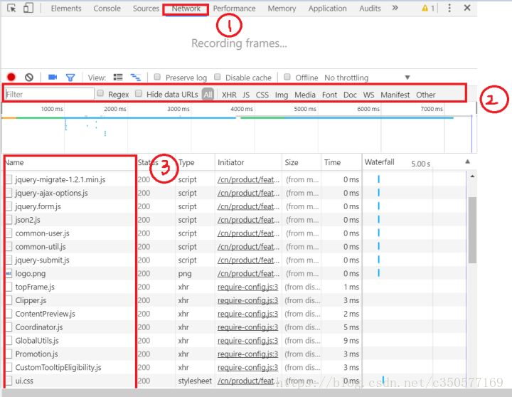
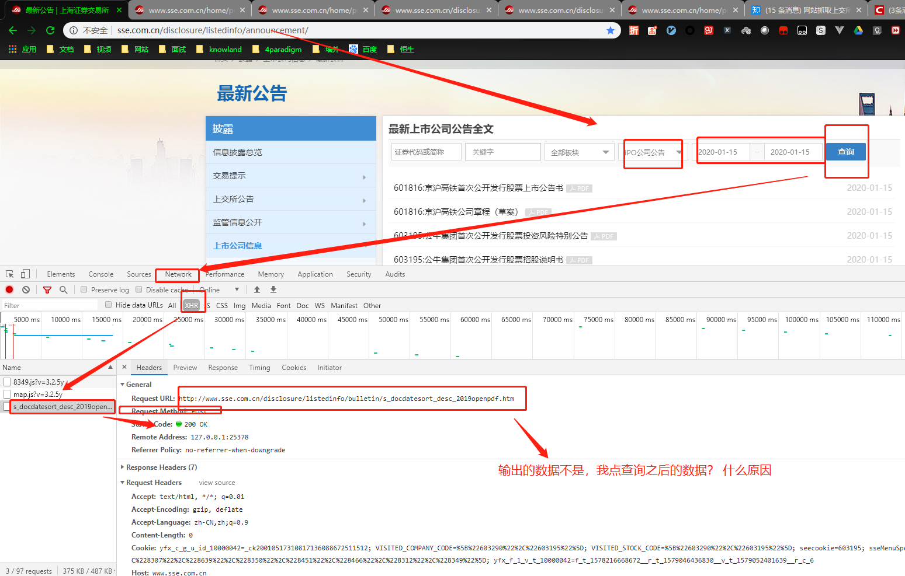

每日必查


行业 核对

- 中万
- 中证
- 中国证监会
- 新股


巨潮公告分类:
	深市
		深主板
		中小板
		创业板
	沪市
		沪主板
		可创板
	香港
		港主板
		港创业板
	三板
		新三板
		老三版

##  新股

```
意向书特别
路演特别：
发行公告特别：
中签率公告特别：
网下配售结果公告
中签结果公告
上市公告书
```

```
意向书特别：
路演特别：
发行公告特别：
中签率公告特别：
网下配售结果公告
中签结果公告
上市公告书
说明书

1如果元素判断相同自然可以用set,不过这里不适用.
需要匹配关键词的话简单点先合并字符串(不考虑连续字符串各有一部分组成关键词的情况.)
    for b in list_b:
        for a in list_a:
            if a in b:
                print(a)
                
 2 如果元素判断相同自然可以用set,不过这里不适用.
需要匹配关键词的话简单点先合并字符串(不考虑连续字符串各有一部分组成关键词的情况.)              
 res = [i for i in list_a if i in ''.join(list_b)]
3 如果字符串太长或需要语义准确可以先对list_b中的字符串分词, 然后求set的交集或其他处理.
如 ['市长'] 不匹配 ['南京市长江大桥']
 import re
res = re.findall('|'.join(list_a), ''.join(list_b))
```


## 新股上市-代码


```python
import requests
from lxml import etree
info_list = []    # 避免问题出来
url = r"http://www.sse.com.cn/disclosure/listedinfo/bulletin/s_docdatesort_desc_2019openpdf.htm"
header = {
    "User-Agent": "Mozilla/5.0 (Windows NT 10.0; Win64; x64) AppleWebKit/537.36 (KHTML, like Gecko) Chrome/79.0.3945.117 Safari/537.36",
    "Referer": "http://www.sse.com.cn/disclosure/listedinfo/announcement/"
}
response = requests.get(url, headers = header)

response.encoding = "utf-8"
ele_html = etree.HTML(response.text)
info_list = ele_html.xpath('//em/a/text()')
# info_list = ele_html.xpath("//dl/dd/em/a/text()")
print(len(info_list), info_list)

list_a= ["说明书","意向书","路演","发行","中签率","配售","中签","上市"]
list_a1 = ["说明书","意向书"]
for j in range(len(list_a1)):
    for i in range(len(info_list)):
        if list_a1[j] in info_list[i]:
            print(info_list[i])
```







## 表格

| 审核表              | shb      |
| ------------------- | -------- |
| 临时表              | lsb      |
| 特别提示            | tbts     |
| 交易所行业划分表    | jyshyhfb |
| 数据采编--审核表    | cbsh     |
| 系统常量表          | xclb     |
| 行业表              | hyb      |
| 新股发行            | xgfx     |
| 公司行业分类表      | gshy     |
| 非文本-公司公告原文 | fwb      |

## 新股的公告类别

| 上会  5                       | 5    |
| ----------------------------- | ---- |
| 过会  6                       | 6    |
| 意向书  7                     | 7    |
| 发行公告  8                   | 8    |
| 网上发行/网下发行/发行结果  9 | 9    |
| 上市公告  10                  | 10   |

### 组里的任务

| 每日停复牌专项核查-陈萍   |
| ------------------------- |
| 深交所停复牌状况对比-陈萍 |

违规当事人编码清洗*71条

股票二组稽核日常工作-胡玉文

| 点新股岗查漏、资金投向说明、分红、证券主表、主要指标、财务最新、股本结构、新股发行与上市、公司概况、企业概况、业绩预告等专项-1H |
| ------------------------------------------------------------ |
| 股本结构表-与交易所股本对比-深市（18条）                     |
| 股本结构表-股本对比资产负债表-12条                           |


| 股票二组稽核日常工作-楼成   |
| --------------------------- |
| 002126-银轮股份修正股本10期 |

培训交易所行业划分-楼成

新股IPO第三方对比邮件

| 制作万德分红预案每日对比自动                 |
| -------------------------------------------- |
| 重写交易所行业划分专项、每日对比公司概况专项 |
| 沟通DMP年报处理问题                          |
| 修改一季报DMP自动化模板                      |
| 教杭州同事JUNO配置                           |

| 测试中心测试       |
| ------------------ |
| JUNO配置修改、测试 |

| 专项重要表、待处理查漏、查错-1H |
| ------------------------------- |
| 每日限售流通日核查              |
| 违规问题整理及修改              |

| 稽核杭州授予、回购完成等*3H |
| --------------------------- |
| 稽核组会-袁程               |

```sql
Business Intelligence（商业智能)

“ERP”企业资源计划（英語：Enterprise resource planning，縮寫ERP）
什么是仓储管理系统(WMS)？

仓储管理系统(WMS) 是一种软体解决方案，可以清楚了解整个业务库存的情形 ，并管理从配送中心到商店货架的供应链履行运作。

在现今动态、全通路、履行的经济中，互联的消费者希望随时随地都可购买、履行并退还。为了能够达成这种需求，企业必须要以优化履行能力的仓储管理软体以快速响应。Oracle领先业界的以云端为基础的仓储管理系统，能为您未来的供应链做好准备。Oracle WMS云端扩展了供应链'，以让库存管理和履行服务并与现代购物方式互相配合，只要—可以透过智慧型手机和浏览器—取得整个库存的即时资讯，而唯一的条件就是能上网。

客户关系管理（Customer Relationship Management，缩写CRM）是一种企业与现有客户及潜在客户之间关系互动的管理系统。 通过对客户数据的历史积累和分析，CRM可以增进企业与客户之间的关系，从而最大化增加企业销售收入和提高客户留存。
```


```
往往从ERP捞出的资料相对分散，用一下Vlookup-->然后透视表一下-->照相机再拍--->交给画图并红圈标出重点-->邮件发出-->再用Excel记下本次重点-->下个月再一次这样循环。
```


## 参考文档