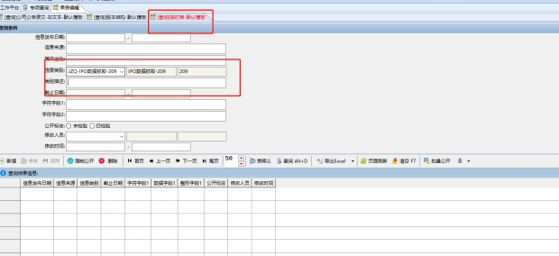
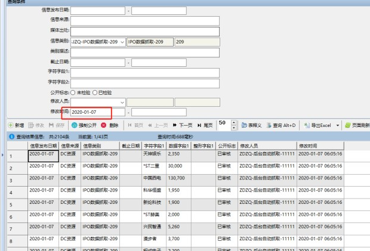
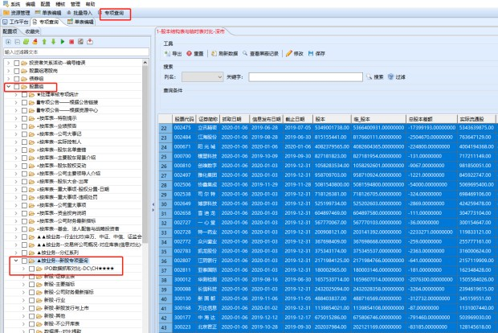
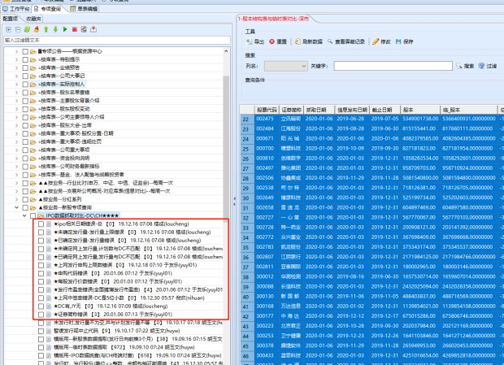

## 7：30网址

http://data.eastmoney.com/xg/xg/default.html

[新股申购与中签查询 _ 数据中心 _ 东方财富网](http://data.eastmoney.com/xg/xg/default.html)

a





b




c





d





## 遇到不同

许志寅

你好 临时表每天早上定时抓取的IPO数据 今天的数据没有抓取 抓的是东财的数据 能复查一下吗 早上要发邮件的


## 代码

- 1★每股发行价数错误-副本

- 关联表名 ：usrXGFXYSS

- 查询语句：

  ```sql
  查询名称 ： ★DC有,JY无
  查询名称 ：★证券简称错误
  select  A.GPDM 公司代码,A.ZQJC 证券简称,B.MGFXJ '新股表-每股发行价',C.DECIMAL4 '临时表-数据字段4', 
  [错误类型]='发行价数错误',B.SWFXRQSX 上网发行日期,C.VARCHAR5 '临时表-字符字段5',C.XGSJ 临时表修改时间 ,S.MS  发行进度
   ,B.XGSJ '新股表-修改时间',R.OPERATORNAME as  '新股表-修改人员'
   from    usrXGFXYSS B  			
  JOIN  usrZQZB A 			
  ON  B.IGSDM=A.IGSDM   and A.ZQLB=(SELECT TOP 1 ZQLB 			
  FROM usrZQZB WHERE IGSDM=A.IGSDM ORDER BY ZQLB)  AND  A.ZQLB IN (1,2)  AND  A.SSBZ IN (1,2,6)			
  left join  usrLSB  C    ON        C.XXLB=209
  JOIN usrXTCLB S ON S.LB=1722 AND S.DM=B.FXJD
  left JOIN cmdOPERATORS R ON R.OPERATORID=B.XGRY
   WHERE   B.SWFXRQSX>=CONVERT(varchar(10),dateadd(month,-3,getdate()), 120 )  AND A.GPDM=C.VARCHAR2  AND 
  (B.MGFXJ<>C.DECIMAL4 OR 
  (B.MGFXJ  IS NULL AND  C.DECIMAL4  IS   NOT NULL) OR 
  (B.MGFXJ  IS NOT NULL AND  C.DECIMAL4  IS    NULL) )
  ORDER   BY  B.SWFXRQSX  desc,A.GPDM
  
  ```


- 2★发行市盈率错误(全面摊薄发行市盈率)-副本
- 关联表名 ：usrXGFXYSS
- 查询语句：

```sql

select  A.GPDM 公司代码,A.ZQJC 证券简称,B.QMTBFXSYL '新股表-全面摊薄发行市盈率',C.DECIMAL5 '临时表-数据字段5', 
[错误类型]='发行市盈率错误',B.SWFXRQSX 上网发行日期,C.VARCHAR6 '临时表-字符字段6',C.XGSJ 临时表时间,S.MS  发行进度
 from    usrXGFXYSS B  			
JOIN  usrZQZB A 			
ON  B.IGSDM=A.IGSDM   and A.ZQLB=(SELECT TOP 1 ZQLB 			
FROM usrZQZB WHERE IGSDM=A.IGSDM ORDER BY ZQLB)  AND  A.ZQLB IN (1,2)  AND  A.SSBZ IN (1,2,6)			
left join  usrLSB  C    ON        C.XXLB=209
JOIN usrXTCLB S ON S.LB=1722 AND S.DM=B.FXJD
WHERE   A.GPDM=C.VARCHAR2   AND 
(B.QMTBFXSYL<>C.DECIMAL5 OR 
(B.QMTBFXSYL  IS  NULL  AND  C.DECIMAL5   IS  NOT   NULL) OR  
(B.QMTBFXSYL  IS NOT  NULL  AND  C.DECIMAL5   IS    NULL))   AND   B.SWFXRQSX>=CONVERT(varchar(10),dateadd(month,-3,getdate()), 120 ) 
ORDER   BY  B.SWFXRQSX  desc,A.GPDM
```


- 3★证券简称错误-副本
- 关联表名 ：usrLSB
- 查询语句：

```sql
select  A.GPDM 公司代码,A.ZQJC 证券简称,B.QMTBFXSYL '新股表-全面摊薄发行市盈率',C.DECIMAL5 '临时表-数据字段5', 
[错误类型]='发行市盈率错误',B.SWFXRQSX 上网发行日期,C.VARCHAR6 '临时表-字符字段6',C.XGSJ 临时表时间,S.MS  发行进度
 from    usrXGFXYSS B  			
JOIN  usrZQZB A 			
ON  B.IGSDM=A.IGSDM   and A.ZQLB=(SELECT TOP 1 ZQLB 			
FROM usrZQZB WHERE IGSDM=A.IGSDM ORDER BY ZQLB)  AND  A.ZQLB IN (1,2)  AND  A.SSBZ IN (1,2,6)			
left join  usrLSB  C    ON        C.XXLB=209
JOIN usrXTCLB S ON S.LB=1722 AND S.DM=B.FXJD
WHERE   A.GPDM=C.VARCHAR2   AND 
(B.QMTBFXSYL<>C.DECIMAL5 OR 
(B.QMTBFXSYL  IS  NULL  AND  C.DECIMAL5   IS  NOT   NULL) OR  
(B.QMTBFXSYL  IS NOT  NULL  AND  C.DECIMAL5   IS    NULL))   AND   B.SWFXRQSX>=CONVERT(varchar(10),dateadd(month,-3,getdate()), 120 ) 
ORDER   BY  B.SWFXRQSX  desc,A.GPDM
```


## 参考文献

中国上海市浦东新区峨山路91弄61号陆家嘴软件园10号楼7-8楼

（上海市浦东新区微山二村邮编 200127）

