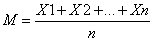

## avg平均数

调和平均数   <=  几何平均数   <=   算数平均数    <= 平方平均数

## 1、算数平均数：

又称均值，是统计学中最基本，最常用的一种平均指标，分为简单算术平均数、加权算术平均数。

**应用场合**:适用于数值型数据，不适用于品质数据。根据表现形式的不同，算术平均数有不同的计算形式和计算公式。

简单算术平均数适用于未分组的原始数据。加权平均数用于分组的数据。

**特点**
算术平均值是一个良好的集中量数，具有反应灵敏、确定严密、简明易解、计算简单、适合进一步演算和较小抽样变化的影响等特点。但是极易受极端数据的影响，每个数据的或大或小的变化都会影响最终结果。

均数（平均数）是指在一组数据中所有数据之和再除以数据的个数。例如：1，3，5，7，这四个数字的均数是〔1+3+5+7）/4〕=4。它是反映数据集中趋势的一项指标。

设一组数据为X1,X2,...,Xn,简单地算术平均数的计算公式为：

## 1.1、加权平均

加权算术平均：主要用于处理经分组整理数据。

设原始数据被分成K组，各组的组中值为X1,X2,...Xk，各组的频数分别为f1,f2,...fk，加权算术平均数的计算公式为：

## 2、调和平均数：

又称倒数平均数，是总体各统计变量倒数的算数平均数的倒数。分为数学调和平均数（数值倒数的平均数的倒数）和统计调和平均数（计算结果与加权算术平均数完全相等）。

**应用场合**:可以用于计算平均速度.

例：计算4x100米接力赛中，运动员的总体速度。

## 2.2 、加权调和平均数：

## 3、几何平均数：

几何平均数是对各变量值的连乘积开项数次方根。根据所拿掌握资料的形式不同，其分为简单几何平均数和加权几何平均数两种形式。

**应用场合**:

1、对比率、指数等进行平均；

2、计算平均发展速度；

3、复利下的平均年利率；

4、连续作业的车间产品的平均合格率；

计算总水平、总成果等所有阶段、所有环节水平、成果的连乘积总和时，求各阶段、各环节的一般水平、一般成果，要使用几何平均法计算几何平均数。

**特点**:

1、调和平均数易受极端值的影响，且受极小值的影响比受极大值的影响更大。

2、只要有一个标志值为0，就不能计算调和平均数。

3、当组距数列有开口组时，其组中值即使按照相邻组距计算，假定性也很大。

4、调和平均数应用的范围较小。

几何平均数是对各变量值的连乘积开项数次方根。求几何平均数的方法叫做几何平均法。如果总水平、总成果等于所有阶段、所有环节水平、成果的连乘积总和时，求各阶段、各环节的一般水平、一般成果，要使用几何平均法计算几何平均数，而不能使用算术平均法计算算术平均数。根据所拿握资料的形式不同，其分为简单几何平均数和加权几何平均数两种形式。

eg： a = 3 ,b = 4

则:几何均数c = sqr(3\*\*2+4\*\*2) =5

简单几何平均数：

## 3.2 、加权几何平均数

## 参考文献

[几何标准差](https://zhidao.baidu.com/question/1575836924575836180.html)

[几何均数](https://gss0.baidu.com/-Po3dSag_xI4khGko9WTAnF6hhy/zhidao/pic/item/ac6eddc451da81cbea744c4e5e66d016082431a7.jpg)

