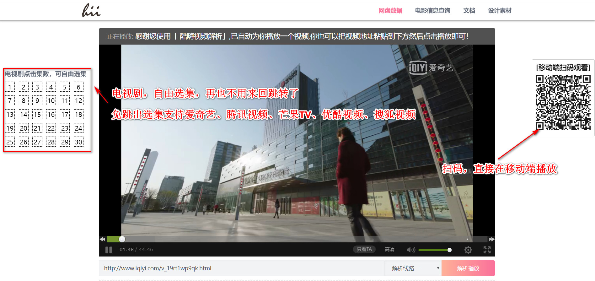
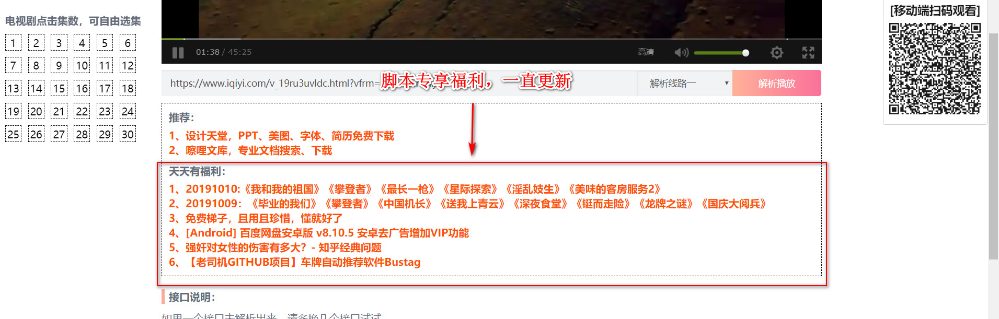
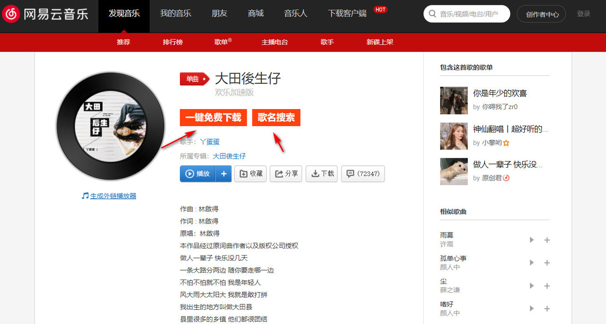

## 浏览器插件


## Tampemonkey

介绍：油猴


**脚本安装教程**

Tampermonkey安装完后还需要另外单独安装功能脚本实现你想要的功能，选择你需要的脚本来安装。如[百度直接下载助手](http://www.pc6.com/softview/SoftView_446962.html#download)、vip视频，还有视频下载等很多，按需安装就行了。方法只需要点开插件，然后安装就行了。

推荐Tampermonkey脚本网站：[greasyfork](https://greasyfork.org/zh-CN/scripts)

```
PS：常用浏览器油猴插件安装教程：https://shimo.im/docs/YxP9GwYkwkdJvvwx/read

福利类型：
1、VIP视频解析，无广告！长期维护更
2、电影资源，一直更新
3、软件资源（常用破解类软件），一直更新
4、一些账号不定时分享，毕竟我也没那么多

```

  **一图胜过千言万语：**百度网盘自动填写提取码


**打开爱奇艺、腾讯视频、优酷、芒果tv等视频播放网页，点击网页左边"VIP"按钮，开始解析播放视频。**








**打开音乐播放界面，出现“一键免费下载”，“音乐搜索”字样，支持qq音乐、网易云音乐、酷狗音乐**





## Infinty新标签页（pro）

很强大的一款

## AdBlock-最佳广告拦截工具

## bilibilli哔哩哔哩下载功能助手

## OneTab Plus 标签效率管理扩展


## readme

网上资源丰富，科学上网！